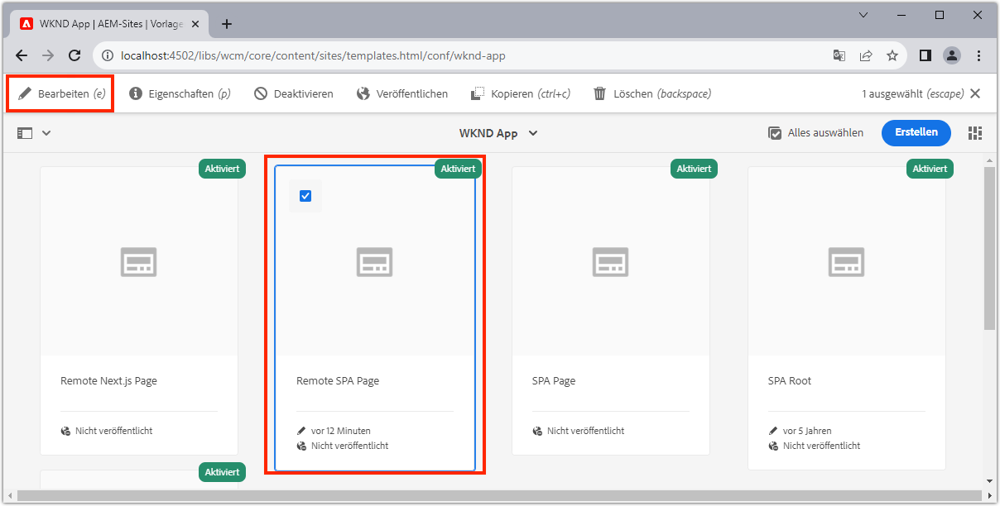

# Bearbeitbare Container-Komponenten

[Feste Komponenten](./spa-fixed-component.md) bieten eine gewisse Flexibilität beim Erstellen SPA Inhalts. Dieser Ansatz ist jedoch starr und erfordert, dass Entwickler die genaue Zusammensetzung des bearbeitbaren Inhalts definieren. Um die Erstellung außergewöhnlicher Erlebnisse durch Autoren zu unterstützen, unterstützt SPA Editor die Verwendung von Container-Komponenten in der SPA. Container-Komponenten ermöglichen es Autoren, zulässige Komponenten per Drag &amp; Drop in den Container zu ziehen und sie wie beim herkömmlichen AEM Sites-Authoring zu erstellen!


In diesem Kapitel fügen wir der Startansicht einen bearbeitbaren Container hinzu, der es Autoren ermöglicht, Rich-Content-Erlebnisse mit bearbeitbaren React-Komponenten direkt in der SPA zu erstellen und anzuordnen.

## WKND-App aktualisieren

Hinzufügen einer Container-Komponente zur Startansicht:

+ Importieren Sie die Komponente AEM React Editable `ResponsiveGrid` component
+ Importieren und registrieren Sie benutzerdefinierte bearbeitbare React-Komponenten (Text und Bild) zur Verwendung in der Komponente &quot;ResponsiveGrid&quot;

### ResponsiveGrid-Komponente verwenden

So fügen Sie der Ansicht &quot;Home&quot;einen bearbeitbaren Bereich hinzu:

1. Öffnen und Bearbeiten `react-app/src/components/Home.js`
1. Importieren Sie die `ResponsiveGrid` Komponente aus `@adobe/aem-react-editable-components` und fügen Sie sie zum `Home` -Komponente.
1. Legen Sie die folgenden Attribute für die `<ResponsiveGrid...>` component
   + `pagePath = '/content/wknd-app/us/en/home'`
   + `itemPath = 'root/responsivegrid'`

   Dies weist die `ResponsiveGrid` -Komponente, um ihren Inhalt aus der AEM-Ressource abzurufen:

   + `/content/wknd-app/us/en/home/jcr:content/root/responsivegrid`

   Die `itemPath` der `responsivegrid` Knoten, der im `Remote SPA Page` AEM Vorlage und wird automatisch auf neuen AEM erstellt, die aus dem `Remote SPA Page` AEM Vorlage.

   Aktualisieren `Home.js` , um `<ResponsiveGrid...>` -Komponente.

   ```javascript
   ...
   import { ResponsiveGrid } from '@adobe/aem-react-editable-components';
   ...
   
   function Home() {
       return (
           <div className="Home">
               <ResponsiveGrid
                   pagePath='/content/wknd-app/us/en/home' 
                   itemPath='root/responsivegrid'/>
   
               <EditableTitle
                   pagePath='/content/wknd-app/us/en/home' 
                   itemPath='title'/>
   
               <Adventures />
           </div>
       );
   }
   ```

Die `Home.js` sollte wie folgt aussehen:


## Erstellen bearbeitbarer Komponenten

Um die volle Wirkung der flexiblen Authoring-Erlebnis-Container im SPA Editor zu erzielen. Wir haben bereits eine bearbeitbare Titelkomponente erstellt, aber lassen Sie uns noch ein paar weitere Komponenten erstellen, die es Autoren ermöglichen, bearbeitbare Text- und Bildkomponenten in der neu hinzugefügten Komponente &quot;ResponsiveGrid&quot;zu verwenden.

Die neuen bearbeitbaren Text- und Bildreaktionskomponenten werden mit dem in [bearbeitbare feste Komponenten](./spa-fixed-component.md).

### Bearbeitbare Textkomponente

1. Öffnen Sie das SPA in Ihrer IDE.
1. Erstellen einer React-Komponente unter `src/components/editable/core/Text.js`
1. Fügen Sie den folgenden Code zu `Text.js`

   ```javascript
   import React from 'react'
   
   const TextPlain = (props) => <div className={props.baseCssClass}><p className="cmp-text__paragraph">{props.text}</p></div>;
   const TextRich = (props) => {
   const text = props.text;
   const id = (props.id) ? props.id : (props.cqPath ? props.cqPath.substr(props.cqPath.lastIndexOf('/') + 1) : "");
       return <div className={props.baseCssClass} id={id} data-rte-editelement dangerouslySetInnerHTML={{ __html: text }} />
   };
   
   export const Text = (props) => {
       if (!props.baseCssClass) {
           props.baseCssClass = 'cmp-text'
       }
   
       const { richText = false } = props
   
       return richText ? <TextRich {...props} /> : <TextPlain {...props} />
       }
   
       export function textIsEmpty(props) {
       return props.text == null || props.text.length === 0;
   }
   ```

1. Erstellen einer bearbeitbaren React-Komponente unter `src/components/editable/EditableText.js`
1. Fügen Sie den folgenden Code zu `EditableText.js`

   ```javascript
   import React from 'react'
   import { EditableComponent, MapTo } from '@adobe/aem-react-editable-components';
   import { Text, textIsEmpty } from "./core/Text";
   import { withConditionalPlaceHolder } from "./core/util/withConditionalPlaceholder";
   import { withStandardBaseCssClass } from "./core/util/withStandardBaseCssClass";
   
   const RESOURCE_TYPE = "wknd-app/components/text";
   
   const EditConfig = {
       emptyLabel: "Text",
       isEmpty: textIsEmpty,
       resourceType: RESOURCE_TYPE
   };
   
   export const WrappedText = (props) => {
       const Wrapped = withConditionalPlaceHolder(withStandardBaseCssClass(Text, "cmp-text"), textIsEmpty, "Text V2")
       return <Wrapped {...props} />
   };
   
   const EditableText = (props) => <EditableComponent config={EditConfig} {...props}><WrappedText /></EditableComponent>
   
   MapTo(RESOURCE_TYPE)(EditableText);
   
   export default EditableText;
   ```

Die Implementierung der bearbeitbaren Textkomponente sollte wie folgt aussehen:


### Bildkomponente

1. Öffnen Sie das SPA in Ihrer IDE.
1. Erstellen einer React-Komponente unter `src/components/editable/core/Image.js`
1. Fügen Sie den folgenden Code zu `Image.js`

   ```javascript
   import React from 'react'
   import { RoutedLink } from "./RoutedLink";
   
   export const imageIsEmpty = (props) => (!props.src) || props.src.trim().length === 0
   
   const ImageInnerContents = (props) => {
   return (<>
       
       {
           !!(props.title) && <span className={props.baseCssClass + '__title'} itemProp="caption">{props.title}</span>
       }
       {
           props.displayPopupTitle && (!!props.title) && <meta itemProp="caption" content={props.title} />
       }
       </>);
   };
   
   const ImageContents = (props) => {
       if (props.link && props.link.trim().length > 0) {
           return (
           <RoutedLink className={props.baseCssClass + '__link'} isRouted={props.routed} to={props.link}>
               <ImageInnerContents {...props} />
           </RoutedLink>
           )
       }
       return <ImageInnerContents {...props} />
   };
   
   export const Image = (props) => {
       if (!props.baseCssClass) {
           props.baseCssClass = 'cmp-image'
       }
   
       const { isInEditor = false } = props;
       const cssClassName = (isInEditor) ? props.baseCssClass + ' cq-dd-image' : props.baseCssClass;
   
       return (
           <div className={cssClassName}>
               <ImageContents {...props} />
           </div>
       )
   };
   ```

1. Erstellen einer bearbeitbaren React-Komponente unter `src/components/editable/EditableImage.js`
1. Fügen Sie den folgenden Code zu `EditableImage.js`

```javascript
import { EditableComponent, MapTo } from '@adobe/aem-react-editable-components';
import { Image, imageIsEmpty } from "./core/Image";
import React from 'react'

import { withConditionalPlaceHolder } from "./core/util/withConditionalPlaceholder";
import { withStandardBaseCssClass } from "./core/util/withStandardBaseCssClass";

const RESOURCE_TYPE = "wknd-app/components/image";

const EditConfig = {
    emptyLabel: "Image",
    isEmpty: imageIsEmpty,
    resourceType: RESOURCE_TYPE
};

const WrappedImage = (props) => {
    const Wrapped = withConditionalPlaceHolder(withStandardBaseCssClass(Image, "cmp-image"), imageIsEmpty, "Image V2");
    return <Wrapped {...props}/>
}

const EditableImage = (props) => <EditableComponent config={EditConfig} {...props}><WrappedImage /></EditableComponent>

MapTo(RESOURCE_TYPE)(EditableImage);

export default EditableImage;
```


1. Erstellen einer SCSS-Datei `src/components/editable/EditableImage.scss` , das benutzerdefinierte Stile für die `EditableImage.scss`. Diese Stile zielen auf die CSS-Klassen der bearbeitbaren React-Komponente ab.
1. Fügen Sie die folgende SCSS zu `EditableImage.scss`

   ```css
   .cmp-image__image {
       margin: 1rem 0;
       width: 100%;
       border: 0;
    }
   ```

1. Import `EditableImage.scss` in `EditableImage.js`

   ```javascript
   ...
   import './EditableImage.scss';
   ...
   ```

Die Implementierung der bearbeitbaren Bildkomponente sollte wie folgt aussehen:


### Importieren der bearbeitbaren Komponenten

Die neu erstellte `EditableText` und `EditableImage` React-Komponenten werden im SPA referenziert und basierend auf der von AEM zurückgegebenen JSON dynamisch instanziiert. Um sicherzustellen, dass diese Komponenten für die SPA verfügbar sind, erstellen Sie Importanweisungen für sie in `Home.js`

1. Öffnen Sie das SPA in Ihrer IDE.
1. Öffnen Sie die Datei `src/Home.js`
1. Hinzufügen von Importanweisungen für `AEMText` und `AEMImage`

   ```javascript
   ...
   // The following need to be imported, so that MapTo is run for the components
   import EditableText from './editable/EditableText';
   import EditableImage from './editable/EditableImage';
   ...
   ```

Das Ergebnis sollte wie folgt aussehen:


Wenn diese Einfuhren _not_ hinzugefügt, `EditableText` und `EditableImage` -Code von SPA nicht aufgerufen wird und daher werden die Komponenten nicht den bereitgestellten Ressourcentypen zugeordnet.

## Container in AEM konfigurieren

AEM Container-Komponenten verwenden Richtlinien, um ihre zulässigen Komponenten anzugeben. Dies ist eine kritische Konfiguration bei der Verwendung des SPA-Editors, da nur AEM Komponenten, die SPA Komponenten zugeordnet haben, vom SPA gerenderbar sind. Stellen Sie sicher, dass nur die Komponenten zulässig sind, für die wir SPA Implementierungen bereitgestellt haben:

+ `EditableTitle` zugeordnet zu `wknd-app/components/title`
+ `EditableText` zugeordnet zu `wknd-app/components/text`
+ `EditableImage` zugeordnet zu `wknd-app/components/image`

So konfigurieren Sie den Reponsivegrid-Container der Vorlage Remote-SPA:

1. Bei der AEM-Autoreninstanz anmelden
1. Navigieren Sie zu __Tools > Allgemein > Vorlagen > WKND-App__
1. Bearbeiten __SPA__

   

1. Auswählen __Struktur__ im Modusschalter oben rechts
1. Tippen, um die __Layout-Container__
1. Tippen Sie auf __Politik__ Symbol in der Popup-Leiste

   

1. Rechts unter dem __Zugelassene Komponenten__ Registerkarte, erweitern __WKND-APP - INHALT__
1. Stellen Sie sicher, dass nur Folgendes ausgewählt ist:
   + Bild
   + Text
   + Titel

   

1. Tippen Sie auf __Fertig__

## Container in AEM erstellen

Nach der Aktualisierung des SPA zum Einbetten des `<ResponsiveGrid...>`, Wrapper für drei bearbeitbare React-Komponenten (`EditableTitle`, `EditableText`und `EditableImage`) und AEM mit einer übereinstimmenden Vorlagenrichtlinie aktualisiert wird, können wir damit beginnen, Inhalte in der Container-Komponente zu erstellen.

1. Bei der AEM-Autoreninstanz anmelden
1. Navigieren Sie zu __Sites > WKND-App__
1. Tippen __Startseite__ und wählen Sie __Bearbeiten__ in der oberen Aktionsleiste
   + Eine Textkomponente &quot;Hello World&quot;wird angezeigt, da diese automatisch hinzugefügt wurde, wenn das Projekt über den AEM Projektarchetyp generiert wurde
1. Auswählen __Bearbeiten__ über die Modusauswahl oben rechts im Seiteneditor
1. Suchen Sie die __Layout-Container__ bearbeitbarer Bereich unter dem Titel
1. Öffnen Sie die __Seitenleiste des Seiteneditors__ und wählen Sie die __Komponentenansicht__
1. Ziehen Sie die folgenden Komponenten in die __Layout-Container__
   + Bild
   + Titel
1. Ziehen Sie die Komponenten in die folgende Reihenfolge, um sie neu anzuordnen:
   1. Titel
   1. Bild
   1. Text
1. __Autor__ die __Titel__ component
   1. Tippen Sie auf die Komponente Titel und dann auf __Schraubenschlüssel__ Symbol zu __edit__ die Titelkomponente
   1. Fügen Sie den folgenden Text hinzu:
      + Titel: __Der Sommer kommt, lassen Sie uns das Beste daraus machen!__
      + Typ: __H1__
   1. Tippen Sie auf __Fertig__
1. __Autor__ die __Bild__ component
   1. Ziehen Sie ein Bild aus der Seitenleiste (nach dem Wechsel zur Asset-Ansicht) auf die Bildkomponente
   1. Tippen Sie auf die Bildkomponente und tippen Sie auf __Schraubenschlüssel__ Symbol zum Bearbeiten
   1. Überprüfen Sie die __Bild ist dekorativ__ Kontrollkästchen
   1. Tippen Sie auf __Fertig__
1. __Autor__ die __Text__ component
   1. Bearbeiten Sie die Textkomponente, indem Sie auf die Textkomponente tippen und auf die __Schraubenschlüssel__ icon
   1. Fügen Sie den folgenden Text hinzu:
      + _Jetzt erhalten Sie 15% auf allen 1-wöchigen Abenteuern und 20% Rabatt auf alle Abenteuer, die 2 Wochen oder länger sind! Fügen Sie beim Checkout den Kampagnencode SUMMERISCOMING hinzu, um Ihre Rabatte zu erhalten!_
   1. Tippen Sie auf __Fertig__

1. Ihre Komponenten werden jetzt erstellt, aber vertikal stapelt.

   

Verwenden Sie AEM Layout-Modus , um die Größe und das Layout der Komponenten anzupassen.

1. Wechseln zu __Layout-Modus__ Verwenden der Modusauswahl oben rechts
1. __Größe ändern__ die Bild- und Text-Komponenten, sodass sie nebeneinander angeordnet sind
   + __Bild__ -Komponente sollte __8 Spalten breit__
   + __Text__ -Komponente sollte __3 Spalten breit__

   

1. __Vorschau__ Ihre Änderungen in AEM Seiteneditor
1. Aktualisieren Sie die WKND-App, die lokal ausgeführt wird auf [http://localhost:3000](http://localhost:3000) um die erstellten Änderungen zu sehen!

   


## Herzlichen Glückwunsch!

Sie haben eine Container-Komponente hinzugefügt, mit der Autoren bearbeitbare Komponenten zur WKND-App hinzufügen können! Sie wissen jetzt, wie:

+ Verwenden der Komponente &quot;AEM React-Bearbeitbar&quot; `ResponsiveGrid` -Komponente im SPA
+ Erstellen und registrieren Sie bearbeitbare React-Komponenten (Text und Bild) zur Verwendung in der SPA über die Container-Komponente
+ Konfigurieren Sie die Vorlage Remote SPA Page , um die SPA aktivierten Komponenten zuzulassen.
+ Hinzufügen bearbeitbarer Komponenten zur Container-Komponente
+ Autoren- und Layoutkomponenten im SPA Editor

## Nächste Schritte

Im nächsten Schritt wird dieselbe Technik verwendet, um [Hinzufügen einer bearbeitbaren Komponente zu einer Abenteuer-Details-Route](./spa-dynamic-routes.md) im SPA.
