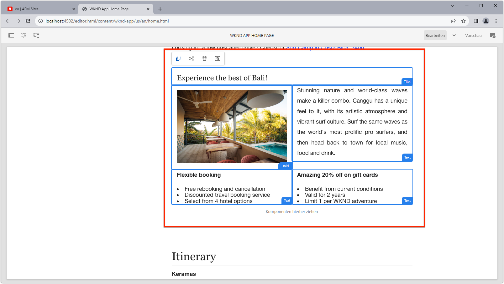

# Dynamische Routen und bearbeitbare Komponenten

In diesem Kapitel aktivieren wir zwei dynamische Adventure Detail-Routen, um bearbeitbare Komponenten zu unterstützen. __Bali Surf Camp__ und __Beervana in Portland__.


Die Abenteuerdetails-SPA-Route ist definiert als `/adventure:path`, wobei `path` der Pfad zum WKND-Abenteuer (Inhaltsfragment) ist, um Details anzuzeigen.

## Ordnen Sie die SPA URLs AEM Seiten zu

In den vorherigen beiden Kapiteln haben wir bearbeitbaren Komponenteninhalt aus der SPA Home-Ansicht der entsprechenden Remote SPA-Stammseite in AEM `/content/wknd-app/us/en/` zugeordnet.

Die Definition der Zuordnung für bearbeitbare Komponenten für die SPA dynamischen Routen ist ähnlich, aber wir müssen ein 1:1-Zuordnungsschema zwischen Instanzen der Route und AEM Seiten entwickeln.

In diesem Tutorial nehmen wir den Namen des WKND Adventure Content Fragment, das das letzte Segment des Pfades ist, und ordnen es einem einfachen Pfad unter `/content/wknd-app/us/en/adventure` zu.

| SPA | AEM |
|------------------------------------|--------------------------------------------|
| / | /content/wknd-app/us/de/home |
| /adventures:/content/dam/working/de/adventures/bali-surf-camp/__bali-surf-camp__ | /content/wknd-app/us/en/home/adventure/__bali-surf-camp__ |
| /adventures:/content/dam/worknd/en/adventures/beervana-portland/__beervana-portland__ | /content/wknd-app/us/en/home/adventure/__beervana-in-portland__ |

Auf der Grundlage dieser Kartierung müssen wir also zwei neue AEM erstellen:

+ `/content/wknd-app/us/en/home/adventure/bali-surf-camp`
+ `/content/wknd-app/us/en/home/adventure/beervana-in-portland`

## Remote-SPA

Die Zuordnung für Anforderungen, die die Remote-SPA verlassen, werden über die `setupProxy`-Konfiguration konfiguriert, die in [Bootstrap der SPA](./spa-bootstrap.md) durchgeführt wird.

## SPA Editor-Zuordnung

Die Zuordnung für SPA Anforderungen, wenn der SPA über AEM Editor geöffnet wird, werden über die Sling Mappings-Konfiguration konfiguriert, die unter [AEM](./aem-configure.md) konfigurieren ausgeführt wird.

## Inhaltsseiten in AEM erstellen

Erstellen Sie zunächst das Zwischenprodukt `adventure` Seitensegment:

1. Bei AEM Author anmelden
1. Navigieren Sie zu __Sites > WKND-App > us > de > WKND-App-Startseite__
   + Diese AEM Seite wird als Stamm der SPA zugeordnet. Hier beginnen wir also mit dem Aufbau der AEM Seitenstruktur für andere SPA Routen.
1. Tippen Sie auf __Erstellen__ und wählen Sie __Seite__
1. Wählen Sie die Vorlage __Remote SPA Page__ und tippen Sie auf __Next__
1. Füllen Sie die Seiteneigenschaften aus
   + __Titel__: Abenteuer
   + __Name__: `adventure`
      + Dieser Wert definiert die URL der AEM Seite und muss daher mit dem Streckensegment der SPA übereinstimmen.
1. Tippen Sie auf __Fertig__

Erstellen Sie dann die AEM Seiten, die den einzelnen SPA URLs entsprechen, für die bearbeitbare Bereiche erforderlich sind.

1. Navigieren Sie zur neuen Seite __Adventure__ im Site-Admin
1. Tippen Sie auf __Erstellen__ und wählen Sie __Seite__
1. Wählen Sie die Vorlage __Remote SPA Page__ und tippen Sie auf __Next__
1. Füllen Sie die Seiteneigenschaften aus
   + __Titel__: Bali Surf Camp
   + __Name__:  `bali-surf-camp`
      + Dieser Wert definiert die URL der AEM Seite und muss daher mit dem letzten Segment der SPA übereinstimmen.
1. Tippen Sie auf __Fertig__
1. Wiederholen Sie die Schritte 3-6, um die Seite __Beervana in Portland__ zu erstellen mit:
   + __Titel__: Beervana in Portland
   + __Name__:  `beervana-in-portland`
      + Dieser Wert definiert die URL der AEM Seite und muss daher mit dem letzten Segment der SPA übereinstimmen.

Diese beiden AEM enthalten den jeweiligen verfassten Inhalt für die passenden SPA Routen. Wenn andere SPA Routen Authoring erfordern, müssen neue AEM Seiten unter ihrer SPA URL unter der Stammeseite der Remote-SPA (`/content/wknd-app/us/en/home`) in AEM erstellt werden.

## WKND-App aktualisieren

Platzieren wir die `<AEMResponsiveGrid...>`-Komponente, die im [letzten Kapitel](./spa-container-component.md) erstellt wurde, in unsere `AdventureDetail`-SPA, und erstellen Sie einen bearbeitbaren Container.

### Platzieren Sie die Komponente AEMResponsiveGrid SPA

Wenn Sie `<AEMResponsiveGrid...>` in der `AdventureDetail`-Komponente platzieren, wird ein bearbeitbarer Container in dieser Route erstellt. Der Trick ist, dass mehrere Routen die `AdventureDetail`-Komponente zum Rendern verwenden, müssen wir dynamisch anpassen `<AEMResponsiveGrid...>'s pagePath` Attribut. Das `pagePath` muss abgeleitet werden, um auf die entsprechende AEM Seite zu zeigen, basierend auf dem Abenteuer, das die Instanz der Route anzeigt.

1. `react-app/src/components/AdventureDetail.js` öffnen und bearbeiten
1. hinzufügen Sie die folgende Zeile vor der Anweisung `AdventureDetail(..)'s` zweite `return(..)`, die den Abenteuernamen vom Pfad des Inhaltsfragments ableitet.

   ```
   ...
   // Get the last segment of the Adventure Content Fragment path to used to generate the pagePath for the AEMResponsiveGrid
   const adventureName = adventureData._path.split('/').pop();
   ...
   ```

1. Importieren Sie die Komponente `AEMResponsiveGrid` und platzieren Sie sie über der Komponente `<h2>Itinerary</h2>`.
1. Legen Sie die folgenden Attribute für die Komponente `<AEMResponsiveGrid...>` fest
   + `pagePath = '/content/wknd-app/us/en/home/adventure/${adventureName}'`
   + `itemPath = 'root/responsivegrid'`

   Dadurch wird die Komponente `AEMResponsiveGrid` angewiesen, ihren Inhalt aus der AEM-Ressource abzurufen:

   + `/content/wknd-app/us/en/home/adventure/${adventureName}/jcr:content/root/responsivegrid`


Aktualisieren Sie `AdventureDetail.js` mit den folgenden Zeilen:

```
...
import AEMResponsiveGrid from '../components/aem/AEMResponsiveGrid';
...

function AdventureDetail(props) {
    ...
    // Get the last segment of the Adventure Content Fragment path to used to generate the pagePath for the AEMResponsiveGrid
    const adventureName = adventureData._path.split('/').pop();

    return(
        ...
        <AEMResponsiveGrid 
            pagePath={`/content/wknd-app/us/en/home/adventure/${adventureName}`}
            itemPath="root/responsivegrid"/>
            
        <h2>Itinerary</h2>
        ...
    )
}
```

Die Datei `AdventureDetail.js` sollte wie folgt aussehen:


## Container in AEM erstellen

Wenn das `<AEMResponsiveGrid...>` vorhanden ist und das `pagePath` basierend auf dem abenteuerlichen Abenteuer dynamisch eingestellt ist, versuchen wir, Inhalte darin zu erstellen.

1. Bei AEM Author anmelden
1. Navigieren Sie zu __Sites > WKND-App > us > en__
1. __Bearbeiten__ der  __WKND-__ Startseite der App
   + Navigieren Sie zur Route __Bali Surf Camp__ im SPA, um sie zu bearbeiten.
1. Wählen Sie __Vorschau__ aus der Modusauswahl oben rechts aus.
1. Tippen Sie auf die Karte __Bali Surf Camp__ im SPA, um zu seiner Route zu navigieren.
1. Wählen Sie __Bearbeiten__ aus der Modusauswahl
1. Suchen Sie den bearbeitbaren Bereich __Layout Container__ direkt über dem __Itinerary__
1. Öffnen Sie die Seitenleiste __Seiteneditor__ und wählen Sie die __Komponenten-Ansicht__
1. Ziehen Sie einige der aktivierten Komponenten in den Container __Layout__
   + Bild
   + Text
   + Titel

   Und erstellen Sie Werbematerial. Es könnte ungefähr so aussehen:

   

1. __Änderungen in der__ Vorschau im Seiteneditor AEM
1. Aktualisieren Sie die WKND-App, die lokal auf [http://localhost:3000](http://localhost:3000) ausgeführt wird, navigieren Sie zur Route __Bali Surf Camp__, um die erstellten Änderungen anzuzeigen!

   

Wenn Sie zu einer Abenteuerdetailroute navigieren, die keine zugeordnete AEM Seite hat, gibt es keine Authoring-Fähigkeit für diese Route-Instanz. Um das Authoring auf diesen Seiten zu aktivieren, erstellen Sie einfach eine AEM Seite mit dem entsprechenden Namen unter der Seite __Adventure__!

## Herzlichen Glückwunsch!

Herzlichen Glückwunsch! Sie haben die Authoring-Fähigkeit zu dynamischen Routen in der SPA hinzugefügt!

+ Komponente &quot;ResponsiveGrid&quot;der Komponente &quot;AEM React Editable&quot;zu einer dynamischen Route hinzugefügt
+ Erstellt AEM Seiten zur Unterstützung des Authoring zweier spezifischer Routen im SPA (Bali Surf Camp und Beervana in Portland)
+ Verfasst Inhalt auf der dynamischen Bali Surf Camp Route!

Sie haben die ersten Schritte zur Verwendung AEM SPA Editors zum Hinzufügen bestimmter bearbeitbarer Bereiche zu einer Remote SPA abgeschlossen!


>[!NOTE]
>
>Bleib dran! Dieses Tutorial wird erweitert, um die Best Practices und Empfehlungen der Adobe zur Bereitstellung der SPA-Editor-Lösung für AEM als Cloud Service und Produktions-Umgebung zu behandeln.