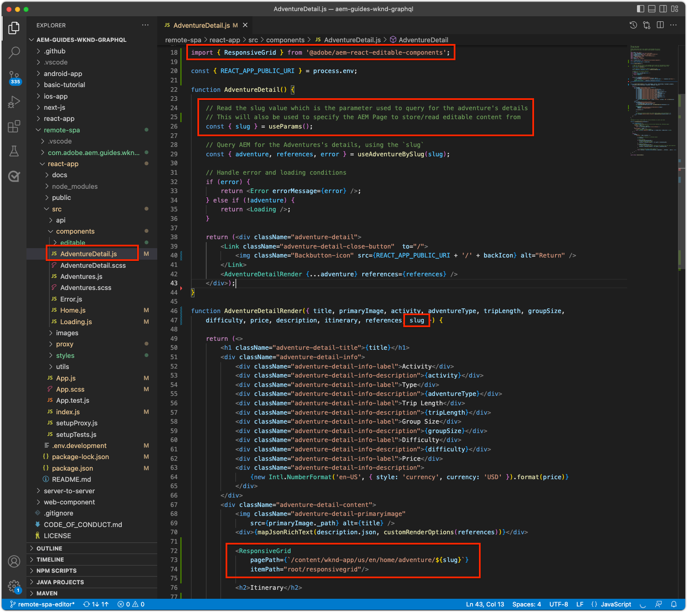

# Dynamische Routen und bearbeitbare Komponenten

In diesem Kapitel aktivieren wir zwei dynamische Adventure-Detail-Routen, um bearbeitbare Komponenten zu unterstützen: __Bali Surf Camp__ und __Beervana in Portland__.


Die SPA-Route Adventure-Detail ist definiert als `/adventure/:slug`, wobei `slug` eine eindeutige ID-Eigenschaft im Adventure-Inhaltsfragment ist.

## Zuordnen der SPA-URLs zu AEM-Seiten

In den vorherigen beiden Kapiteln haben wir bearbeitbare Komponenteninhalte aus der SPA-Startansicht der entsprechenden Remote-SPA-Stammseite in AEM unter `/content/wknd-app/us/en/` zugeordnet.

Die Definition der Zuordnung für bearbeitbare Komponenten für die dynamischen SPA-Routen ist ähnlich, jedoch müssen wir ein 1:1-Zuordnungsschema zwischen Instanzen der Route und AEM-Seiten erstellen.

In diesem Tutorial nehmen wir den Namen des WKND Adventure-Inhaltsfragments, der das letzte Segment des Pfads ist, und ordnen ihn einem einfachen Pfad unter `/content/wknd-app/us/en/adventure` zu.

| Remote-SPA-Route | AEM-Seitenpfad |
|------------------------------------|--------------------------------------------|
| / | /content/wknd-app/us/en/home |
| /adventure/__bali-surf-camp__ | /content/wknd-app/us/en/home/adventure/__bali-surf-camp__ |
| /adventure/__beervana-portland__ | /content/wknd-app/us/en/home/adventure/__beervana-in-portland__ |

Auf Grundlage dieser Zuordnung müssen wir also zwei neue AEM-Seiten erstellen unter:

+ `/content/wknd-app/us/en/home/adventure/bali-surf-camp`
+ `/content/wknd-app/us/en/home/adventure/beervana-in-portland`

## Remote-SPA-Zuordnung

Die Zuordnung für Anfragen, die die Remote-SPA verlassen, wird über die `setupProxy`-Konfiguration in [Bootstrap der SPA](./spa-bootstrap.md) konfiguriert.

## SPA-Editor-Zuordnung

Die Zuordnungen für SPA-Anfragen, wenn die SPA über den AEM-SPA-Editor geöffnet wird, werden über die Konfiguration der Sling-Zuordnungen konfiguriert, die in [AEM konfigurieren](./aem-configure.md) vorgenommen wird.

## Erstellen von Inhaltsseiten in AEM

Erstellen Sie zunächst das dazwischenliegende `adventure`-Seitensegment:

1. Melden Sie sich bei AEM Author an
1. Navigieren Sie zu __Sites > WKND App > us > en > WKND App Home Page__
   + Diese AEM-Seite wird als Stamm der SPA zugeordnet, sodass hier der Aufbau der AEM-Seitenstruktur für andere SPA-Routen beginnt.
1. Tippen Sie auf __Erstellen__ und wählen Sie __Seite__
1. Wählen Sie die Vorlage __Remote-SPA-Seite__ und tippen Sie auf __Weiter__
1. Füllen Sie die Seiteneigenschaften aus
   + __Titel__: Adventure
   + __Name__: `adventure`
      + Dieser Wert definiert die URL der AEM-Seite und muss daher mit dem Routen-Segment der SPA übereinstimmen.
1. Tippen Sie auf __Fertig__

Erstellen Sie dann die AEM-Seiten, die den einzelnen URLs der SPA entsprechen, die bearbeitbare Bereiche erfordern.

1. Navigieren Sie im Site-Admin zur neuen __Adventure__-Seite
1. Tippen Sie auf __Erstellen__ und wählen Sie __Seite__
1. Wählen Sie die Vorlage __Remote-SPA-Seite__ und tippen Sie auf __Weiter__
1. Füllen Sie die Seiteneigenschaften aus
   + __Titel__: Bali Surf Camp
   + __Name__: `bali-surf-camp`
      + Dieser Wert definiert die URL der AEM-Seite und muss daher mit dem letzten Segment der Route der SPA übereinstimmen
1. Tippen Sie auf __Fertig__
1. Wiederholen Sie die Schritte 3 bis 6, um die Seite __Beervana in Portland__ zu erstellen, mit:
   + __Titel__: Beervana in Portland
   + __Name__: `beervana-in-portland`
      + Dieser Wert definiert die URL der AEM-Seite und muss daher mit dem letzten Segment der Route der SPA übereinstimmen

Diese beiden AEM-Seiten enthalten die von den jeweiligen Autorinnen oder Autoren erstellten Inhalte für die entsprechenden SPA-Routen. Wenn andere SPA-Routen Authoring erfordern, müssen neue AEM-Seiten unter der URL ihrer SPA unter der Stammseite der Remote-SPA-Seite (`/content/wknd-app/us/en/home`) in AEM erstellt werden.

## Aktualisieren der WKND-App

Platzieren Sie die im [letzten Kapitel](./spa-container-component.md) erstellte Komponente `<ResponsiveGrid...>` in unserer SPA-Komponente `AdventureDetail` und erstellen Sie dadurch einen editierbaren Container.

### Platzieren der SPA-Komponente ResponsiveGrid

Durch Platzieren von `<ResponsiveGrid...>` in der Komponente `AdventureDetail` wird ein bearbeitbarer Container in dieser Route erstellt. Der Trick besteht darin, dass das Attribut `<ResponsiveGrid...>'s pagePath` dynamisch angepasst werden muss, da mehrere Routen die Komponente `AdventureDetail` zum Rendern verwenden. Der `pagePath` muss so abgeleitet werden, dass er auf die entsprechende AEM-Seite verweist, basierend auf dem Adventure, das die Instanz der Route anzeigt.

1. Öffnen und bearbeiten Sie `react-app-/src/components/AdventureDetail.js`
1. Importieren Sie die Komponente `ResponsiveGrid` und platzieren Sie sie über der Komponente `<h2>Itinerary</h2>`.
1. Legen Sie die folgenden Attribute für die Komponente `<ResponsiveGrid...>` fest. Das Attribut `pagePath` fügt das aktuelle Element `slug` hinzu, das der Adventure-Seite gemäß der oben definierten Zuordnung zugeordnet ist.
   + `pagePath = '/content/wknd-app/us/en/home/adventure/${slug}'`
   + `itemPath = 'root/responsivegrid'`

   Hierdurch wird die Komponente `ResponsiveGrid` angewiesen, ihren Inhalt aus der AEM-Ressource abzurufen:

   + `/content/wknd-app/us/en/home/adventure/${slug}/jcr:content/root/responsivegrid`

Aktualisieren Sie `AdventureDetail.js` mit den folgenden Zeilen:

```javascript
...
import { ResponsiveGrid } from '@adobe/aem-react-editable-components';
...

function AdventureDetailRender(props) {
    ...
    // Get the slug from the React route parameter, this will be used to specify the AEM Page to store/read editable content from
    const { slug } = useParams();

    return(
        ...
        // Pass the slug in
        function AdventureDetailRender({ title, primaryImage, activity, adventureType, tripLength, 
                groupSize, difficulty, price, description, itinerary, references, slug }) {
            ...
            return (
                ...
                <ResponsiveGrid 
                    pagePath={`/content/wknd-app/us/en/home/adventure/${slug}`}
                    itemPath="root/responsivegrid"/>
                    
                <h2>Itinerary</h2>
                ...
            )
        }
    )
}
```

Die Datei `AdventureDetail.js` sollte wie folgt aussehen:



## Erstellen des Containers in AEM

Nachdem `<ResponsiveGrid...>` eingerichtet ist und dessen `pagePath` dynamisch auf der Grundlage des gerenderten Adventures festgelegt wurde, versuchen wir, Inhalte darin zu erstellen.

1. Melden Sie sich bei AEM Author an
1. Navigieren Sie zu __Sites > WKND App > us > en__
1. __Bearbeiten__ Sie die __WKND-App-Startseite__
   + Navigieren Sie zur Route __Bali Surf Camp__ in der SPA, um sie zu bearbeiten
1. Wählen Sie über die Modusauswahl oben rechts die Option __Vorschau__ aus
1. Tippen Sie in der SPA auf die Karte __Bali Surf Camp__, um zur zugehörigen Route zu navigieren
1. Wählen Sie über die Modusauswahl die Option __Bearbeiten__ aus
1. Gehen Sie zu dem bearbeitbaren Bereich __Layout-Container__ direkt über __Itinerary__
1. Öffnen Sie die __Seitenleiste des Seiteneditors__ und wählen Sie die __Komponentenansicht__ aus
1. Ziehen Sie einige der aktivierten Komponenten in den __Layout-Container__:
   + Bild
   + Text
   + Titel

   Erstellen Sie nun Werbematerial. Dies könnte ungefähr so aussehen:

   

1. Zeigen Sie Ihre Änderungen im AEM-Seiteneditor in einer __Vorschau__ an
1. Aktualisieren Sie die WKND-App, die lokal auf [http://localhost:3000](http://localhost:3000) ausgeführt wird, und navigieren Sie zur Route __Bali Surf Camp__, um die erstellten Änderungen zu sehen.

   

Wenn Sie zu einer Adventure-Detail-Route navigieren, der keine AEM-Seite zugeordnet ist, gibt es in dieser Routeninstanz keine Möglichkeiten zum Authoring. Um das Authoring auf diesen Seiten zu aktivieren, erstellen Sie einfach eine AEM-Seite mit dem entsprechenden Namen unter der Seite __Adventure__.

## Herzlichen Glückwunsch!

Herzlichen Glückwunsch! Sie haben die Möglichkeit zum Authoring zu dynamischen Routen in der SPA hinzugefügt.

+ Die Komponente „ResponsiveGrid“ der AEM React Editable-Komponente wurde zu einer dynamischen Route hinzugefügt
+ AEM-Seiten zur Authoring-Unterstützung für zwei bestimmte Routen in der SPA (Bali Surf Camp und Beervana in Portland) wurden erstellt
+ Inhalt auf der dynamischen „Bali Surf Camp“-Route wurde erstellt!

Sie haben nun die ersten Schritte abgeschlossen und gesehen, wie Sie mit dem AEM-SPA-Editor bestimmte bearbeitbare Bereiche zu einer Remote-SPA hinzufügen können.
