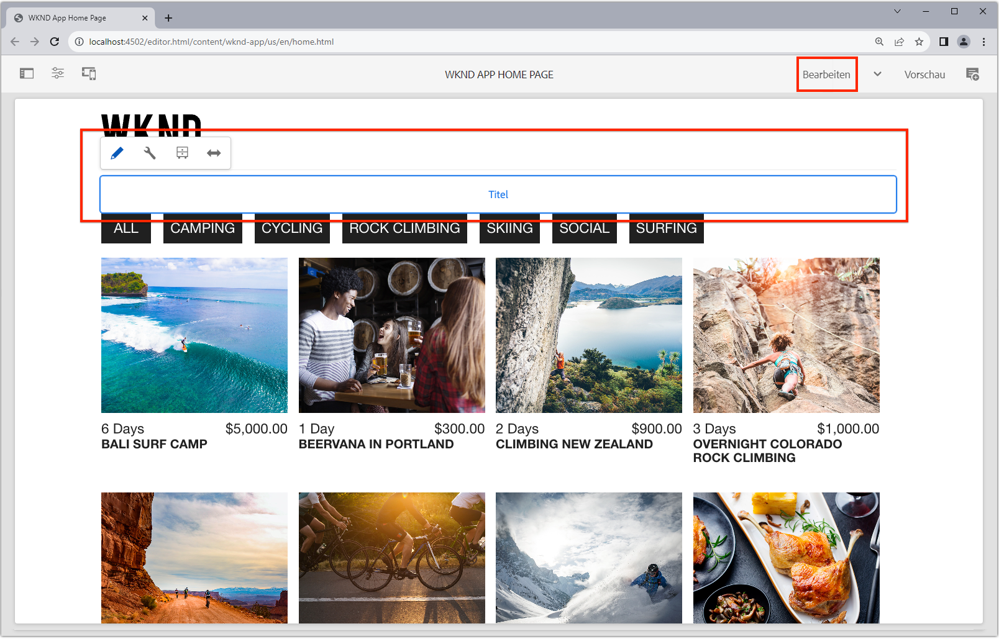

# Bearbeitbare feste Komponenten

Bearbeitbare React-Komponenten können &quot;fest&quot;oder in den SPA-Ansichten hartcodiert sein. Auf diese Weise können Entwickler SPA Editor-kompatible Komponenten in die SPA-Ansichten platzieren und es Benutzern ermöglichen, den Inhalt der Komponenten im AEM Editor SPA zu erstellen.


In diesem Kapitel ersetzen wir den Titel der Home-Ansicht &quot;Current Adventures&quot;, der in `Home.js` hartcodierten Text enthält, durch eine feste, aber bearbeitbare Titelkomponente. Feste Komponenten garantieren die Platzierung des Titels, ermöglichen aber auch die Erstellung des Titeltextes und die Änderung außerhalb des Entwicklungszyklus.

## WKND-App aktualisieren

So fügen Sie der Startansicht eine Komponente vom Typ Feste Seite hinzu:

+ Importieren Sie die Komponente Titel der AEM React-Kernkomponente und registrieren Sie sie im Ressourcentyp des Projekts Titel .
+ Platzieren Sie die bearbeitbare Titelkomponente in der SPA-Startansicht

### Importieren in die Titelkomponente der AEM React-Kernkomponente

Ersetzen Sie in der Ansicht SPA Home den hartcodierten Text `<h2>Current Adventures</h2>` durch die Komponente Titel der AEM React-Kernkomponenten . Bevor die Titelkomponente verwendet werden kann, müssen wir Folgendes tun:

1. Importieren Sie die Titelkomponente aus `@adobe/aem-core-components-react-base`.
1. Registrieren Sie sie mit `withMappable` , damit Entwickler sie in der SPA platzieren können.
1. Registrieren Sie sich auch bei `MapTo` , damit sie später in der [Container-Komponente ](./spa-container-component.md) verwendet werden kann.

Gehen Sie hierfür wie folgt vor:

1. Öffnen Sie das Remote SPA-Projekt unter `~/Code/wknd-app/aem-guides-wknd-graphql/react-app` in Ihrer IDE.
1. Erstellen einer React-Komponente unter `react-app/src/components/aem/AEMTitle.js`
1. Fügen Sie `AEMTitle.js` den folgenden Code hinzu.

   ```
   // Import the withMappable API provided by the AEM SPA Editor JS SDK
   import { withMappable, MapTo } from '@adobe/aem-react-editable-components';
   
   // Import the AEM React Core Components' Title component implementation and it's Empty Function 
   import { TitleV2, TitleV2IsEmptyFn } from "@adobe/aem-core-components-react-base";
   
   // The sling:resourceType for which this Core Component is registered with in AEM
   const RESOURCE_TYPE = "wknd-app/components/title";
   
   // Create an EditConfig to allow the AEM SPA Editor to properly render the component in the Editor's context
   const EditConfig = {    
       emptyLabel: "Title",  // The component placeholder in AEM SPA Editor
       isEmpty: TitleV2IsEmptyFn, // The function to determine if this component has been authored
       resourceType: RESOURCE_TYPE // The sling:resourceType this component is mapped to
   };
   
   // MapTo allows the AEM SPA Editor JS SDK to dynamically render components added to SPA Editor Containers
   MapTo(RESOURCE_TYPE)(TitleV2, EditConfig);
   
   // withMappable allows the component to be hardcoded into the SPA; <AEMTitle .../>
   const AEMTitle = withMappable(TitleV2, EditConfig);
   
   export default AEMTitle;
   ```

Lesen Sie die Kommentare des Codes für die Implementierungsdetails.

Die Datei `AEMTitle.js` sollte wie folgt aussehen:


### Verwenden der React AEMTitle-Komponente

Nachdem die Titelkomponente der AEM React-Kernkomponente in registriert ist und in der React-App zur Verwendung verfügbar ist, ersetzen Sie den hartcodierten Titeltext in der Startansicht.

1. Bearbeiten `react-app/src/App.js`
1. Ersetzen Sie im `Home()` unten den hartcodierten Titel durch die neue Komponente `AEMTitle` :

   ```
   <h2>Current Adventures</h2>
   ```

   durch

   ```
   <AEMTitle
       pagePath='/content/wknd-app/us/en/home' 
       itemPath='root/title'/>
   ```

   Aktualisieren Sie `Apps.js` mit dem folgenden Code:

   ```
   ...
   import { AEMTitle } from './components/aem/AEMTitle';
   ...
   function Home() {
       return (
           <div className="Home">
   
               <AEMTitle
                   pagePath='/content/wknd-app/us/en/home' 
                   itemPath='root/title'/>
   
               <Adventures />
           </div>
       );
   }
   ```

Die Datei `Apps.js` sollte wie folgt aussehen:


## Erstellen Sie die Titelkomponente in AEM

1. Bei der AEM-Autoreninstanz anmelden
1. Navigieren Sie zu __Sites > WKND App__
1. Tippen Sie auf __Home__ und wählen Sie __Edit__ aus der oberen Aktionsleiste
1. Wählen Sie __Bearbeiten__ aus der Modusauswahl im Bearbeitungsmodus oben rechts im Seiteneditor aus.
1. Bewegen Sie den Mauszeiger über den Standardtiteltext unter dem WKND-Logo und über der Abenteuerliste, bis der blaue Bearbeitungsentwurf angezeigt wird.
1. Tippen Sie auf , um die Aktionsleiste der Komponente anzuzeigen, und tippen Sie dann auf den __Schraubenschlüssel__, um sie zu bearbeiten.

   

1. Erstellen Sie die Titelkomponente:
   + Titel: __WKND Adventures__
   + Typ/Größe: __H2__

      

1. Tippen Sie auf __Fertig__, um zu speichern.
1. Vorschau der Änderungen in AEM SPA Editor
1. Aktualisieren Sie die WKND-App, die lokal auf [http://localhost:3000](http://localhost:3000) ausgeführt wird, und sehen Sie sich die Änderungen des erstellten Titels sofort an.

   

## Herzlichen Glückwunsch!

Sie haben der WKND-App eine feste, bearbeitbare Komponente hinzugefügt! Sie wissen jetzt, wie:

+ Import aus und Wiederverwendung einer AEM React-Kernkomponente im SPA
+ Fügen Sie eine feste, aber bearbeitbare Komponente zum SPA hinzu.
+ Erstellen Sie die feste Komponente in AEM
+ Anzeigen der erstellten Inhalte in der Remote-SPA

## Nächste Schritte

Die nächsten Schritte sind [Hinzufügen einer AEM ResponsiveGrid-Container-Komponente](./spa-container-component.md) zur SPA, die es dem Autor ermöglicht, der SPA Komponenten hinzuzufügen und sie zu bearbeiten!
