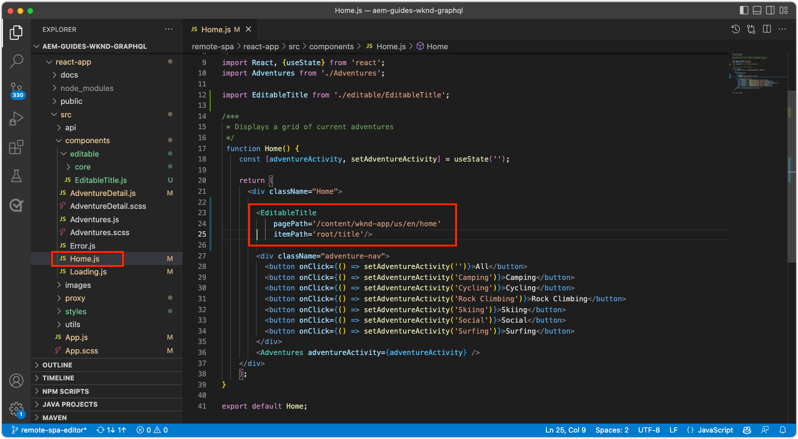

# Bearbeitbare feste Komponenten

Bearbeitbare React-Komponenten können in den SPA-Ansichten „befestigt“ oder hartcodiert werden. Auf diese Weise können Entwicklerinnen und Entwickler SPA-Editor-kompatible Komponenten in den SPA-Ansichten platzieren und Benutzenden ermöglichen, den Inhalt der Komponenten im AEM-SPA-Editor zu erstellen.


In diesem Kapitel ersetzen wir den Titel der Startansicht „Aktuelle Adventures“, der in `Home.js` hartcodiert ist, durch eine feste, aber bearbeitbare Titelkomponente. Feste Komponenten garantieren die Platzierung des Titels, ermöglichen aber auch die Erstellung des Titeltextes und dessen Veränderung außerhalb des Entwicklungszyklus.

## Aktualisieren der WKND-App

So fügen Sie eine __feste__ Komponente zur Startansicht hinzu:

+ Erstellen Sie eine benutzerdefinierte bearbeitbare Titelkomponente und registrieren Sie sie im Ressourcentyp des Projekttitels.
+ Platzieren Sie die bearbeitbare Titelkomponente in der SPA-Startansicht.

### Erstellen einer bearbeitbaren React-Titelkomponente

Ersetzen Sie in der SPA-Startansicht den hartcodierten Text `<h2>Current Adventures</h2>` durch eine benutzerdefinierte bearbeitbare Titelkomponente. Bevor die Titelkomponente verwendet werden kann, müssen wir Folgendes tun:

1. Eine benutzerdefinierte React-Titelkomponente erstellen
1. Die benutzerdefinierte Titelkomponente mit Methoden aus `@adobe/aem-react-editable-components` dekorieren, damit sie bearbeitbar wird
1. Die bearbeitbare Titelkomponente bei `MapTo` registrieren, damit sie später in der [Container-Komponente](./spa-container-component.md) verwendet werden kann

Gehen Sie hierfür wie folgt vor:

1. Öffnen Sie das Remote SPA-Projekt unter `~/Code/aem-guides-wknd-graphql/remote-spa-tutorial/react-app` in Ihrer IDE
1. Erstellen Sie eine React-Komponente unter `react-app/src/components/editable/core/Title.js`.
1. Fügen Sie den folgenden Code zu `Title.js` hinzu.

   ```javascript
   import React from 'react'
   import { RoutedLink } from "./RoutedLink";
   
   const TitleLink = (props) => {
   return (
       <RoutedLink className={props.baseCssClass + (props.nested ? '-' : '__') + 'link'} 
           isRouted={props.routed} 
           to={props.linkURL}>
       {props.text}
       </RoutedLink>
   );
   };
   
   const TitleV2Contents = (props) => {
       if (!props.linkDisabled) {
           return <TitleLink {...props} />
       }
   
       return <>{props.text}</>
   };
   
   export const Title = (props) => {
       if (!props.baseCssClass) {
           props.baseCssClass = 'cmp-title'
       }
   
       const elementType = (!!props.type) ? props.type.toString() : 'h3';
       return (<div className={props.baseCssClass}>
           {
               React.createElement(elementType, {
                       className: props.baseCssClass + (props.nested ? '-' : '__') + 'text',
                   },
                   <TitleV2Contents {...props} />
               )
           }
   
           </div>)
   }
   
   export const titleIsEmpty = (props) => props.text == null || props.text.trim().length === 0
   ```

   Beachten Sie, dass diese React-Komponente noch nicht mit dem AEM-SPA-Editor bearbeitet werden kann. Diese Basiskomponente wird im nächsten Schritt bearbeitbar gemacht.

   Sehen Sie sich die Implementierungsdetails in den Kommentaren des Codes an.

1. Erstellen Sie eine React-Komponente unter `react-app/src/components/editable/EditableTitle.js`.
1. Fügen Sie den folgenden Code zu `EditableTitle.js` hinzu.

   ```javascript
   // Import the withMappable API provided bu the AEM SPA Editor JS SDK
   import { EditableComponent, MapTo } from '@adobe/aem-react-editable-components';
   import React from 'react'
   
   // Import the AEM the Title component implementation and it's Empty Function
   import { Title, titleIsEmpty } from "./core/Title";
   import { withConditionalPlaceHolder } from "./core/util/withConditionalPlaceholder";
   import { withStandardBaseCssClass } from "./core/util/withStandardBaseCssClass";
   
   // The sling:resourceType of the AEM component used to collected and serialize the data this React component displays
   const RESOURCE_TYPE = "wknd-app/components/title";
   
   // Create an EditConfig to allow the AEM SPA Editor to properly render the component in the Editor's context
   const EditConfig = {
       emptyLabel: "Title",        // The component placeholder in AEM SPA Editor
       isEmpty: titleIsEmpty,      // The function to determine if this component has been authored
       resourceType: RESOURCE_TYPE // The sling:resourceType this component is mapped to
   };
   
   export const WrappedTitle = (props) => {
       const Wrapped = withConditionalPlaceHolder(withStandardBaseCssClass(Title, "cmp-title"), titleIsEmpty, "TitleV2")
       return <Wrapped {...props} />
   }
   
   // EditableComponent makes the component editable by the AEM editor, either rendered statically or in a container
   const EditableTitle = (props) => <EditableComponent config={EditConfig} {...props}><WrappedTitle /></EditableComponent>
   
   // MapTo allows the AEM SPA Editor JS SDK to dynamically render components added to SPA Editor Containers
   MapTo(RESOURCE_TYPE)(EditableTitle);
   
   export default EditableTitle;
   ```

   Diese `EditableTitle`-React-Komponente umschließt die `Title`-React-Komponente. Durch das Umschließen und Dekorieren wird sie im AEM-SPA-Editor bearbeitbar.

### Verwenden der EditableTitle-React-Komponente

Nachdem die EditableTitle-React-Komponente nun in der React-App registriert und für die Verwendung darin verfügbar ist, ersetzen Sie den hartcodierten Titeltext in der Startansicht.

1. Bearbeiten von `react-app/src/components/Home.js`
1. Importieren Sie unten in `Home()` `EditableTitle` und ersetzen Sie den hartcodierten Titel durch die neue Komponente `AEMTitle`:

   ```javascript
   ...
   import EditableTitle from './editable/EditableTitle';
   ...
   function Home() {
       return (
           <div className="Home">
   
           <EditableTitle
               pagePath='/content/wknd-app/us/en/home'
               itemPath='root/title'/>
   
               <Adventures />
           </div>
       );
   }
   ```

Die Datei `Home.js` sollte wie folgt aussehen:



## Erstellen der Titelkomponente in AEM

1. Melden Sie sich bei AEM Author an
1. Navigieren Sie zu __Sites > WKND App__
1. Tippen Sie auf __Startseite__ und wählen Sie __Bearbeiten__ in der oberen Aktionsleiste.
1. Wählen Sie __Bearbeiten__ in der Auswahl des Bearbeitungsmodus oben rechts im Seiteneditor.
1. Bewegen Sie den Mauszeiger über den Standardtiteltext unter dem WKND-Logo und über der Adventure-Liste, bis die blaue Bearbeitungskontur angezeigt wird.
1. Tippen Sie darauf, um die Aktionsleiste der Komponente anzuzeigen, und tippen Sie dann zum Bearbeiten auf den __Schraubenschlüssel__.

   

1. Erstellen Sie die Titelkomponente:
   + Titel: __WKND-Adventures__
   + Typ/Größe: __H2__

     

1. Tippen Sie auf __Fertig__, um zu speichern.
1. Sehen Sie sich Ihre Änderungen in der Vorschau im AEM-SPA-Editor an.
1. Aktualisieren Sie die WKND-App, die lokal auf [http://localhost:3000](http://localhost:3000) ausgeführt wird, und die Änderungen am Titel werden sofort angezeigt.

   

## Herzlichen Glückwunsch!

Sie haben der WKND-App eine feste, bearbeitbare Komponente hinzugefügt! Sie wissen jetzt, wie man Folgendes tut:

+ Eine feste, aber bearbeitbare Komponente für die SPA erstellen;
+ die feste Komponente in AEM erstellen;
+ die erstellten Inhalte in der Remote-SPA anzeigen.

## Nächste Schritte

In den nächsten Schritten geht es darum, [der SPA eine AEM ResponsiveGrid-Container-Komponente hinzufügen](./spa-container-component.md), die es der Autorin oder dem Autor ermöglicht, zur SPA Komponenten hinzuzufügen und sie zu bearbeiten.
