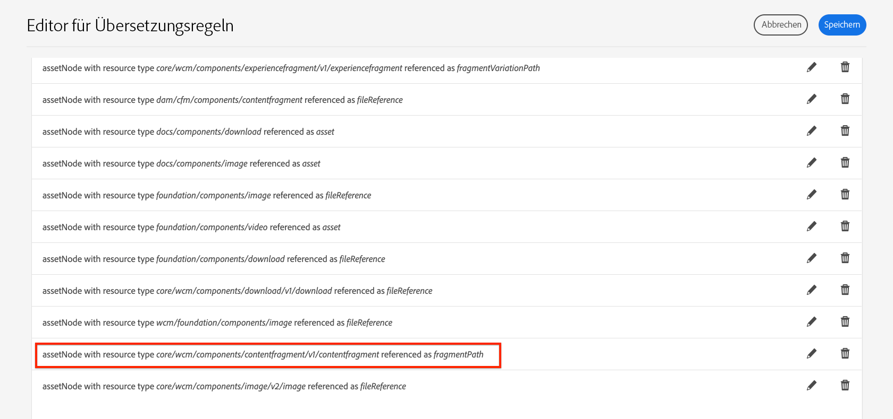

# Übersetzungsunterstützung für AEM Inhaltsfragmente {#translation-support-content-fragments}

Erfahren Sie, wie Inhaltsfragmente mit Adobe Experience Manager lokalisiert und übersetzt werden können. Mit einem Inhaltsfragment verknüpfte gemischte Medien-Assets können ebenfalls extrahiert und übersetzt werden.

>[!VIDEO](https://video.tv.adobe.com/v/18131/?quality=12&learn=on)

## Anwendungsfälle für die Übersetzung von Inhaltsfragmenten {#content-fragment-translation-use-cases}

Inhaltsfragmente sind ein erkannter Inhaltstyp, der AEM Extrakte an einen externen Übersetzungsdienst sendet. Mehrere Anwendungsfälle werden standardmäßig unterstützt:

1. Ein Inhaltsfragment kann direkt in der Konsole &quot;Assets&quot;für Sprachkopie und Übersetzung ausgewählt werden
2. Inhaltsfragmente, die auf einer Sites-Seite referenziert werden, werden in den entsprechenden Sprachordner kopiert und zur Übersetzung extrahiert, wenn die Sites-Seite für die Sprachkopie ausgewählt wird
3. Inline-Medien-Assets, die in ein Inhaltsfragment eingebettet sind, können extrahiert und übersetzt werden.
4. Mit einem Inhaltsfragment verknüpfte Asset-Sammlungen können extrahiert und übersetzt werden.

## Editor für Übersetzungsregeln {#translation-rules-editor}

Das Übersetzungsverhalten von Experience Managern kann mithilfe des **Übersetzungsregel-Editors** aktualisiert werden. Um die Übersetzung zu aktualisieren, navigieren Sie zu **Tools** > **Allgemein** > **Übersetzungskonfiguration** unter [http://localhost:4502/libs/cq/translation/translationrules/contexts.html](http://localhost:4502/libs/cq/translation/translationrules/contexts.html).

Standardmäßige Konfigurationen referenzieren Inhaltsfragmente unter `fragmentPath` mit dem Ressourcentyp `core/wcm/components/contentfragment/v1/contentfragment`. Alle Komponenten, die von `v1/contentfragment` erben, werden von der Standardkonfiguration erkannt.

