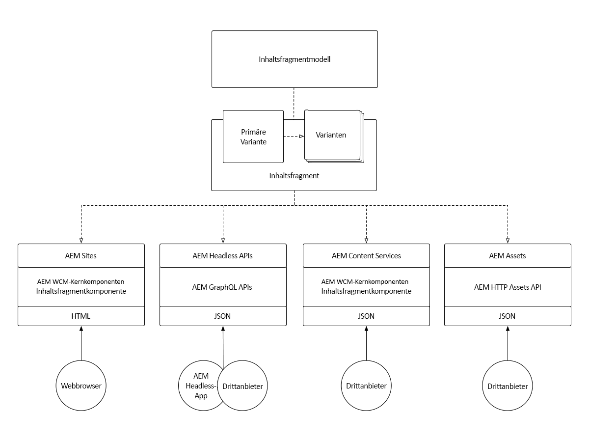
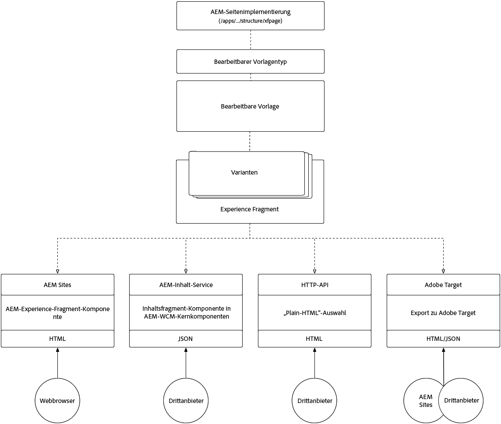

# Verstehen Sie Inhaltsfragmente und Erlebnisfragmente.

Adobe Experience Managers Inhaltsfragmente und Erlebnisfragmente mögen oberflächlich ähnlich aussehen, spielen jedoch in verschiedenen Anwendungsfällen eine Schlüsselrolle. Erfahren Sie, wie Inhaltsfragmente und Erlebnisfragmente ähnlich, unterschiedlich sind und wann und wie sie verwendet werden.

## Vergleich von Inhaltsfragmenten und Erlebnisfragmenten

<table>
<tbody><tr><td><strong> </strong></td>
<td><strong>Inhaltsfragmente (CF)</strong></td>
<td><strong>Erlebnisfragmente (XF)</strong></td>
</tr><tr><td><strong>Definition</strong></td>
<td><ul>
<li>Wiederverwendbarer, präsentationsunabhängiger <strong>Inhalt</strong>, bestehend aus strukturierten Datenelementen (Text, Daten, Referenzen usw.)</li>
</ul>
</td>
<td><ul>
<li>Ein wiederverwendbares Composite aus einer oder mehreren AEM Komponenten, die Inhalt und Darstellung definieren, die ein <strong>Erlebnis</strong> bilden, das für sich genommen sinnvoll ist</li>
</ul>
</td>
</tr><tr><td><strong>Kernlegende</strong></td>
<td><ul>
<li>Inhaltsorientiert</li>
<li>Definiert durch ein strukturiertes, formularbasiertes Datenmodell.</li>
<li>Design und Layout agnostisch.</li>
<li>Dem Kanal gehört die Präsentation des Inhalts des Inhaltsfragments (Layout und Design)</li>
</ul>
</td>
<td><ul>
<li>Präsentationszentrierte</li>
<li>Definiert durch unstrukturierte Zusammensetzung AEM Komponenten</li>
<li>Definiert Entwurf und Layout von Inhalten</li>
<li>Verwendung von "as is"in Kanälen</li>
</ul>
</td>
</tr><tr><td><strong>Technische Details</strong></td>
<td><ul>
<li>Implementiert als <strong>dam:Asset</strong></li>
<li>Definiert durch ein <a href="https://helpx.adobe.com/experience-manager/6-5/assets/using/content-fragments-models.html" target="_blank">Inhaltsfragmentmodell</a></li>
</ul>
</td>
<td><ul>
<li>Implementiert als <strong>cq:Page</strong></li>
<li>Definiert durch bearbeitbare Vorlagen</li>
<li>Native HTML-Darstellung</li>
</ul>
</td>
</tr><tr><td><strong>Varianten</strong></td>
<td><ul>
<li>Übergeordnet ist die kanonische Variante</li>
<li>Variationen sind für den jeweiligen Anwendungsfall spezifisch und können an Kanälen ausgerichtet werden.</li>
</ul>
</td>
<td><ul>
<li>Abweichungen sind Kanals- oder Kontextspezifisch</li>
<li>Varianten werden über AEM Live Copy synchronisiert</li>
<li><a href="https://helpx.adobe.com/experience-manager/6-5/sites/authoring/using/experience-fragments.html#BuildingBlocks" target="_blank">Erstellen von </a> Blocksallow-Inhalten für verschiedene Varianten</li>
</ul>
</td>
</tr><tr><td><strong>Funktionen</strong></td>
<td><ul>
<li>Varianten</li>
<li>Versionen</li>
<li><a href="https://helpx.adobe.com/experience-manager/6-5/assets/using/content-fragments-variations.html#SynchronizingwithMaster" target="_blank">Synchronisierung </a> von Inhalten in verschiedenen Varianten</li>
<li><a href="https://helpx.adobe.com/experience-manager/6-5/assets/using/content-fragments-managing.html#ComparingFragmentVersions" target="_blank">Visuelle </a> Unterschiede bei Inhaltsfragmentversionen</li>
<li><a href="https://helpx.adobe.com/experience-manager/6-5/assets/using/content-fragments-variations.html#AnnotatingaContentFragment" target="_blank">Anmerkungen </a> zu mehrzeiligen Textelementen</li>
<li>Intelligent <a href="https://helpx.adobe.com/experience-manager/6-5/assets/using/content-fragments-variations.html#SummarizingText" target="_blank">Zusammenfassung</a> von mehrzeiligen Textelementen.</li>
<li><a href="https://helpx.adobe.com/experience-manager/6-5/assets/using/creating-translation-projects-for-content-fragments.html" target="_blank">Übersetzung/lokale Anpassung</a></li>
</ul>
</td>
<td><ul>
<li>Varianten</li>
<li>Variationen als Live Copies</li>
<li>Versionen</li>
<li><a href="https://helpx.adobe.com/experience-manager/6-5/sites/authoring/using/experience-fragments.html#BuildingBlocks" target="_blank">Bausteine</a></li>
<li>Anmerkungen</li>
<li>Responsive Layout und Vorschau</li>
<li>Übersetzung/lokale Anpassung</li>
</ul>
</td>
</tr><tr><td><strong>Verwenden</strong></td>
<td><ul>
<li><a href="https://docs.adobe.com/content/help/en/experience-manager-core-components/using/components/content-fragment-component.html" target="_blank">AEM Inhaltsfragment-</a> Komponente für Kernkomponenten zur Verwendung in AEM Sites, AEM Screens oder in Erlebnisfragmenten.</li>
<li>JSON-Export über <a href="https://helpx.adobe.com/experience-manager/kt/sites/using/content-services-tutorial-use.html" target="_blank">AEM Content Services</a> für den Verbrauch durch Dritte</li>
<li>JSON über AEM HTTP Assets APIs für den Drittanbieterkonsum.</li>
</ul>
</td>
<td><ul>
<li>AEM Erlebnisfragment-Komponente zur Verwendung in AEM Sites, AEM Screens oder anderen Erlebnisfragmenten.</li>
<li>Als <a href="https://helpx.adobe.com/experience-manager/6-5/sites/authoring/using/experience-fragments.html#ThePlainHTMLRendition" target="_blank">Nur HTML</a> zur Verwendung durch Drittanbietersysteme exportieren</li>
<li><a href="https://helpx.adobe.com/experience-manager/6-5/sites/administering/using/experience-fragments-target.html" target="_blank">HTML-Export in Adobe </a> Target für zielgerichtete Angebot</li>
<li>JSON-Export nach Adobe Target für zielgerichtete Angebot</li>
</ul>
</td>
</tr><tr><td><strong>Allgemeine Anwendungsfälle</strong></td>
<td><ul>
<li>Hochstrukturierter Dateneintrag/formularbasierter Inhalt</li>
<li>Lange redaktionelle Inhalte (mehrzeiliges Element)</li>
<li>Inhalte, die außerhalb des Lebenszyklus der Kanal, die sie bereitstellen, verwaltet werden</li>
</ul>
</td>
<td><ul>
<li>Zentralisierte Verwaltung von Multi-Kanal-Werbematerial mit Varianten pro Kanal.</li>
<li>Inhalte, die auf mehreren Seiten einer Website wiederverwendet werden.</li>
<li>Website-Chrom (z. B. Kopf- und Fußzeile)</li>
<li>Ein Erlebnis, das außerhalb des Lebenszyklus der Kanal, die es bereitstellen, verwaltet wird</li>
</ul>
</td>
</tr><tr><td><strong>Dokumentation</strong></td>
<td><ul>
<li><a href="https://helpx.adobe.com/experience-manager/6-5/assets/user-guide.html?topic=/experience-manager/6-5/assets/morehelp/content-fragments.ug.js" target="_blank">Benutzerhandbuch AEM Inhaltsfragmente</a></li>
<li><a href="https://helpx.adobe.com/experience-manager/kt/sites/using/content-fragments-feature-video-use.html" target="_blank">Inhaltsfragmente in AEM</a></li>
</ul>
</td>
<td><ul>
<li><a href="https://helpx.adobe.com/experience-manager/6-5/sites/authoring/using/experience-fragments.html" target="_blank">Dokumentation zur Adobe zu Erlebnisfragmenten</a></li>
</ul>
</td>
</tr></tbody></table>

## Architektur von Inhaltsfragmenten

Das folgende Diagramm zeigt die Gesamtarchitektur AEM Inhaltsfragmente

!

+ **Inhaltsfragment-** Modelle definieren die Elemente (oder Felder), die definieren, welche Inhalte vom Inhaltsfragment erfasst und bereitgestellt werden können.
+ Das Inhaltsfragment **ist eine Instanz eines Inhaltsfragmentmodells, das eine logische Inhaltsentität darstellt.**
+ Inhaltsfragment **Varianten** halten sich an das Inhaltsfragmentmodell, es gibt jedoch Inhaltsvarianten.
+ Inhaltsfragmente können wie folgt verfügbar gemacht/genutzt werden:
   + Verwenden von Inhaltsfragmenten auf **AEM Sites** (oder AEM Screens) über die Inhaltsfragment-Komponente der AEM WCM-Kernkomponenten.
   + Einbetten eines Inhaltsfragments in ein **Erlebnisfragment** über die Inhaltsfragment-Komponente der AEM WCM-Kernkomponenten zur Verwendung in einem beliebigen Anwendungsfall des Erlebnisfragments.
   + Durch das Bereitstellen eines Inhaltsfragments werden Inhalte als JSON über **AEM Content Services** und API-Seiten für schreibgeschützte Anwendungsfälle variiert.
   + Direktes Bereitstellen von Content Fragment-Inhalten (alle Varianten) als JSON über Direktaufrufe an AEM Assets über die **AEM Assets HTTP API** für CRUD-Anwendungsfälle.

## Architektur von Erlebnisfragmenten

!

+ **Bearbeitbare Vorlagen**, die wiederum durch  **bearbeitbare** Vorlagentypen und eine Implementierung **von** AEM Seitenkomponenten definiert werden, definieren die zulässigen AEM Komponenten, die zum Erstellen eines Erlebnisfragments verwendet werden können.
+ Das **Erlebnisfragment** ist eine Instanz einer bearbeitbaren Vorlage, die ein logisches Erlebnis darstellt.
+ Erlebnisfragment **Varianten** halten sich an die bearbeitbare Vorlage, es gibt jedoch Variationen im Erlebnis (Inhalt und Design).
+ Erlebnisfragmente können wie folgt verfügbar gemacht/genutzt werden:
   + Verwenden von Erlebnisfragmenten auf AEM Sites (oder AEM Screens) über die Komponente AEM Erlebnisfragment
   + Beim Anzeigen eines Erlebnisfragments werden Inhalte als JSON (mit eingebettetem HTML) über **AEM Content Services**- und API-Seiten variiert.
   + Direktes Anzeigen einer Erlebnisfragment-Variation als **&quot;Nur HTML&quot;**.
   + Exportieren von Erlebnisfragmenten in **Adobe Target** als HTML- oder JSON-Angebot
   + AEM Sites unterstützt nativ HTML-Angebot, JSON-Angebot erfordern jedoch eine benutzerdefinierte Entwicklung.

## Unterstützende Materialien für Inhaltsfragmente

+ [Inhaltsfragmente - Benutzerhandbuch](https://helpx.adobe.com/experience-manager/6-5/assets/user-guide.html?topic=/experience-manager/6-5/assets/morehelp/content-fragments.ug.js)
+ [Inhaltsfragmente in AEM](https://helpx.adobe.com/experience-manager/kt/sites/using/content-fragments-feature-video-use.html)
+ [Inhaltsfragment-Komponente AEM WCM-Kernkomponenten](https://docs.adobe.com/content/help/de/experience-manager-core-components/using/components/content-fragment-component.html)
+ [Inhaltsfragmente und AEM Content Services verwenden](https://helpx.adobe.com/experience-manager/kt/sites/using/structured-fragments-content-services-feature-video-use.html)
+ [Erste Schritte mit AEM Content Services](https://helpx.adobe.com/experience-manager/kt/sites/using/content-services-tutorial-use.html)

## Unterstützende Materialien für Erlebnisfragmente

+ [Dokumentation zur Adobe zu Erlebnisfragmenten](https://helpx.adobe.com/experience-manager/6-5/sites/authoring/using/experience-fragments.html)
+ [Erlebnisfragmente AEM](https://helpx.adobe.com/experience-manager/kt/sites/using/experience-fragments-feature-video-understand.html)
+ [Verwenden AEM Erlebnisfragmente](https://helpx.adobe.com/experience-manager/kt/sites/using/experience-fragments-feature-video-use.html)
+ [Verwenden AEM Erlebnisfragmente mit Adobe Target](https://medium.com/adobetech/experience-fragments-and-adobe-target-d8d74381b9b2)
