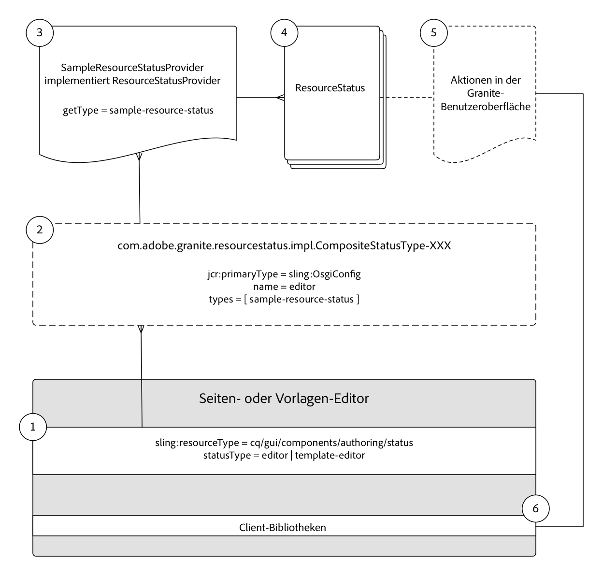

# Entwickeln von Ressourcenstatus {#developing-resource-statuses-in-aem-sites}

Adobe Experience Managers Ressourcen-Status-APIs ist ein Plug-in-Framework zur Bereitstellung von Statusmeldungen in AEM verschiedenen Web-UIs des Editors.

## Überblick {#overview}

Das Resource Status for Editors-Framework bietet serverseitige und clientseitige APIs zum Anzeigen und Interagieren mit Editorstatus auf einheitliche Weise.

Die Statusleisten des Editors stehen in den Editoren &quot;Seite&quot;, &quot;Erlebnisfragment&quot;und &quot;Vorlage&quot;von AEM nativ zur Verfügung.

Beispiele für Anwendungsfälle für benutzerdefinierte Ressourcenstatusanbieter:

* Benachrichtigen von Autoren, wenn eine Seite innerhalb von 2 Stunden nach geplanter Aktivierung liegt
* Benachrichtigen von Autoren, dass eine Seite innerhalb der letzten 15 Minuten aktiviert wurde
* Benachrichtigen von Autoren, dass eine Seite innerhalb der letzten 5 Minuten bearbeitet wurde und von wem


## Resource Status Provider Framework {#resource-status-provider-framework}

Bei der Entwicklung benutzerdefinierter Ressourcenstatus umfasst die Entwicklungsarbeit Folgendes:

1. Die ResourceStatusProvider-Implementierung, die für die Bestimmung, ob ein Status erforderlich ist, und die grundlegenden Informationen zum Status zuständig sind: Titel, Meldung, Priorität, Variante, Symbol und verfügbare Aktionen.
2. Optional kann GraniteUI JavaScript die Funktionalität aller verfügbaren Aktionen implementieren.

   

3. Die Statusressource, die im Rahmen der Editoren für Seite, Erlebnisfragment und Vorlage bereitgestellt wird, wird über die Eigenschaft &quot;[!DNL statusType]&quot;der Ressourcen ein Typ zugewiesen.

   * Seiten-Editor: `editor`
   * Erlebnisfragment-Editor: `editor`
   * Vorlagen-Editor: `template-editor`

4. Die `statusType`-Eigenschaft der Statusressource wird mit der registrierten `CompositeStatusType` OSGi-konfigurierten `name`-Eigenschaft abgeglichen.

   Bei allen Übereinstimmungen werden die `CompositeStatusType's`-Typen erfasst und zum Erfassen der `ResourceStatusProvider`-Implementierungen mit diesem Typ über `ResourceStatusProvider.getType()` verwendet.

5. Das übereinstimmende `ResourceStatusProvider` wird im Editor an das `resource` übergeben und bestimmt, ob der `resource`-Status angezeigt werden soll. Wenn der Status benötigt wird, ist diese Implementierung dafür verantwortlich, dass 0 oder viele `ResourceStatuses` zurückgegeben werden, die jeweils einen anzuzeigenden Status darstellen.

   Normalerweise gibt ein `ResourceStatusProvider` 0 oder 1 `ResourceStatus` pro `resource` zurück.

6. ResourceStatus ist eine Schnittstelle, die vom Kunden implementiert werden kann, oder die hilfreiche `com.day.cq.wcm.commons.status.EditorResourceStatus.Builder` kann zum Aufbau eines Status verwendet werden. Ein Status besteht aus:

   * Titel
   * Nachricht
   * Symbol
   * Variante
   * Priorität
   * Aktionen   
   * Daten

7. Wenn `Actions` für das `ResourceStatus`-Objekt bereitgestellt wird, müssen unterstützende clientlibs die Funktionalität an die Aktionslinks in der Statusleiste binden.

   ```js
   (function(jQuery, document) {
       'use strict';
   
       $(document).on('click', '.editor-StatusBar-action[data-status-action-id="do-something"]', function () {
           // Do something on the click of the resource status action
   
       });
   })(jQuery, document);
   ```

8. Jegliches unterstützendes JavaScript oder CSS zur Unterstützung der Aktionen muss durch die jeweiligen Client-Bibliotheken des jeweiligen Editors kopiert werden, um sicherzustellen, dass der Front-End-Code im Editor verfügbar ist.

   * Kategorie des Seiteneditors: `cq.authoring.editor.sites.page`
   * Kategorie des Experience Fragment-Editors: `cq.authoring.editor.sites.page`
   * Kategorie des Vorlageneditors: `cq.authoring.editor.sites.template`

## Ansicht des Codes {#view-the-code}

[Siehe Code auf GitHub](https://github.com/Adobe-Consulting-Services/acs-aem-samples/tree/master/bundle/src/main/java/com/adobe/acs/samples/resourcestatus/impl/SampleEditorResourceStatusProvider.java)

## Zusätzliche Ressourcen {#additional-resources}

* [`com.adobe.granite.resourcestatus` JavaDocs](https://helpx.adobe.com/experience-manager/6-5/sites/developing/using/reference-materials/javadoc/com/adobe/granite/resourcestatus/package-summary.html)
* [`com.day.cq.wcm.commons.status.EditorResourceStatus` JavaDocs](https://helpx.adobe.com/experience-manager/6-5/sites/developing/using/reference-materials/javadoc/com/day/cq/wcm/commons/status/EditorResourceStatus.html)
