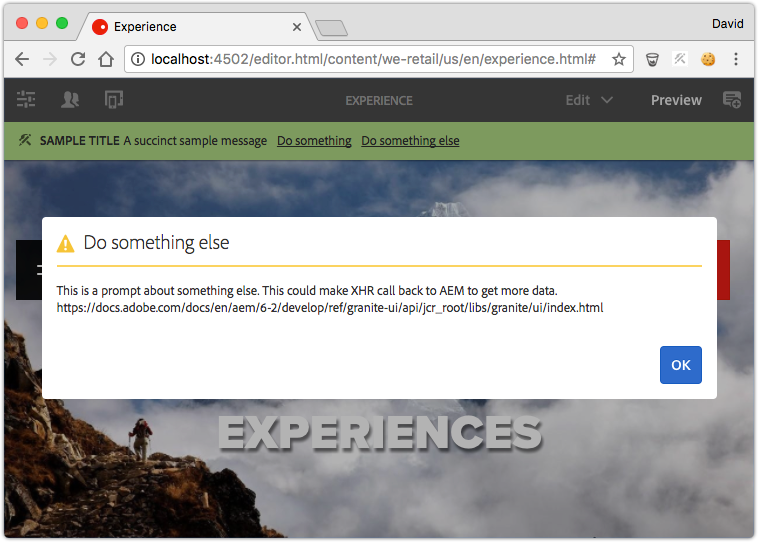

# Entwickeln von Ressourcenstatus {#developing-resource-statuses-in-aem-sites}

Adobe Experience Managers Resource Status-APIs ist ein Plug-in-fähiges Framework für die Anzeige von Statusnachrichten in AEM verschiedenen Editor-Web-Benutzeroberflächen.

## Überblick {#overview}

Das Framework &quot;Resource Status for Editors&quot;bietet serverseitige und Client-seitige APIs für die standardmäßige und einheitliche Anzeige und Interaktion mit den Editorstatus.

Die Statusleisten des Editors sind nativ in den Editoren Seite, Experience Fragment und Vorlage von AEM verfügbar.

Anwendungsbeispiele für benutzerdefinierte Ressourcenstatusanbieter sind:

* Benachrichtigung für Autoren, wenn eine Seite innerhalb von 2 Stunden nach geplanter Aktivierung liegt
* Benachrichtigung der Autoren, dass eine Seite innerhalb der letzten 15 Minuten aktiviert wurde
* Indem Sie Autoren darüber informieren, dass eine Seite in den letzten 5 Minuten bearbeitet wurde und von wem



## Framework für den Ressourcenstatus {#resource-status-provider-framework}

Bei der Entwicklung benutzerdefinierter Ressourcenstatus umfasst die Entwicklungsarbeit Folgendes:

1. Die ResourceStatusProvider-Implementierung, die für die Bestimmung des Status benötigt wird, und die grundlegenden Informationen zum Status: Titel, Nachricht, Priorität, Variante, Symbol und verfügbare Aktionen.
2. Optional kann GraniteUI-JavaScript verwendet werden, das die Funktionalität aller verfügbaren Aktionen implementiert.

   

3. Die Statusressource, die im Rahmen der Editoren &quot;Seite&quot;, &quot;Experience Fragment&quot;und &quot;Vorlage&quot;bereitgestellt wird, erhält einen Typ über die Eigenschaft &quot;[!DNL statusType]&quot;der Ressourcen.

   * Seiten-Editor: `editor`
   * Experience Fragment-Editor: `editor`
   * Vorlagen-Editor: `template-editor`

4. Die `statusType` der Statusressource wird mit der registrierten `CompositeStatusType` OSGi-Eigenschaft abgeglichen, die `name` konfiguriert ist.

   Bei allen Übereinstimmungen werden die `CompositeStatusType's`-Typen erfasst und zur Erfassung der `ResourceStatusProvider`-Implementierungen mit diesem Typ über `ResourceStatusProvider.getType()` verwendet.

5. Der übereinstimmende `ResourceStatusProvider` wird im Editor an `resource` übergeben und bestimmt, ob der `resource` -Status angezeigt werden soll. Wenn der Status erforderlich ist, ist diese Implementierung dafür verantwortlich, 0 oder viele `ResourceStatuses` zu erstellen, die zurückgegeben werden und jeweils einen anzuzeigenden Status darstellen.

   Normalerweise gibt ein `ResourceStatusProvider` 0 oder 1 `ResourceStatus` pro `resource` zurück.

6. ResourceStatus ist eine Schnittstelle, die vom Kunden implementiert werden kann. Alternativ kann die hilfreiche `com.day.cq.wcm.commons.status.EditorResourceStatus.Builder` verwendet werden, um einen Status zu erstellen. Ein Status besteht aus:

   * Titel
   * Nachricht
   * Symbol
   * Variante
   * Priorität
   * Aktionen 
   * Daten

7. Wenn `Actions` für das `ResourceStatus`-Objekt bereitgestellt wird, sind optional unterstützende Clientlibs erforderlich, um die Funktionalität an die Aktionslinks in der Statusleiste zu binden.

   ```js
   (function(jQuery, document) {
       'use strict';
   
       $(document).on('click', '.editor-StatusBar-action[data-status-action-id="do-something"]', function () {
           // Do something on the click of the resource status action
   
       });
   })(jQuery, document);
   ```

8. Alle unterstützenden JavaScript- oder CSS-Elemente zur Unterstützung der Aktionen müssen durch die jeweiligen Client-Bibliotheken der einzelnen Editoren bereitgestellt werden, um sicherzustellen, dass der Frontend-Code im Editor verfügbar ist.

   * Kategorie des Seiteneditors: `cq.authoring.editor.sites.page`
   * Experience Fragment-Editor-Kategorie: `cq.authoring.editor.sites.page`
   * Kategorie des Vorlageneditors: `cq.authoring.editor.sites.template`

## Anzeigen des Codes {#view-the-code}

[Siehe Code auf GitHub](https://github.com/Adobe-Consulting-Services/acs-aem-samples/tree/master/bundle/src/main/java/com/adobe/acs/samples/resourcestatus/impl/SampleEditorResourceStatusProvider.java)

## Zusätzliche Ressourcen {#additional-resources}

* [`com.adobe.granite.resourcestatus` JavaDocs](https://helpx.adobe.com/experience-manager/6-5/sites/developing/using/reference-materials/javadoc/com/adobe/granite/resourcestatus/package-summary.html)
* [`com.day.cq.wcm.commons.status.EditorResourceStatus` JavaDocs](https://helpx.adobe.com/experience-manager/6-5/sites/developing/using/reference-materials/javadoc/com/day/cq/wcm/commons/status/EditorResourceStatus.html)
