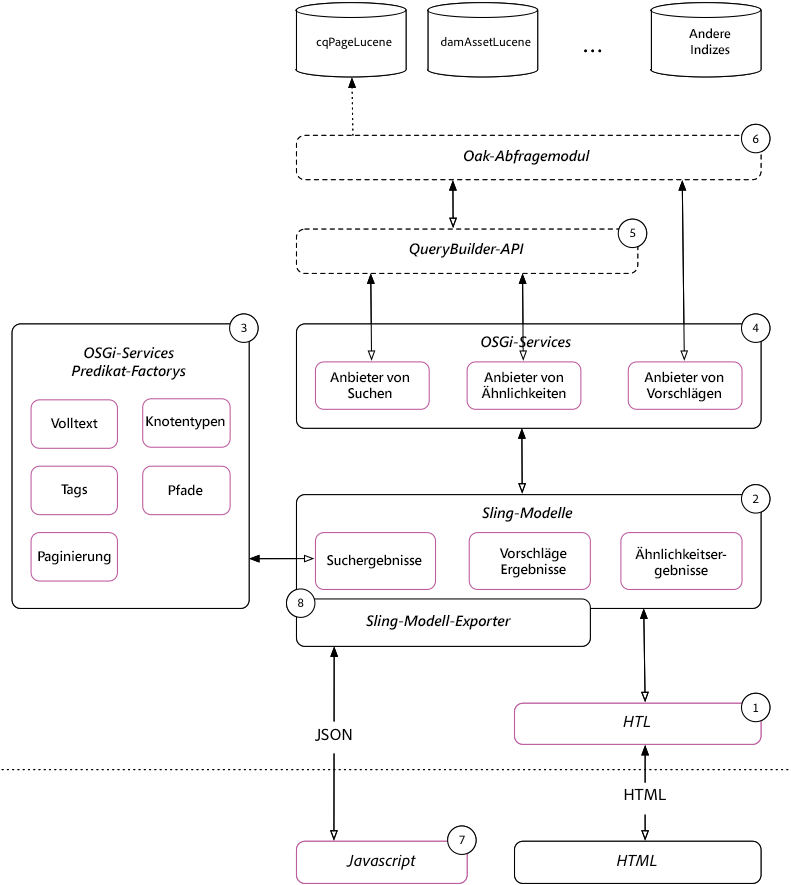

# Einfache Implementierung der Suche{#simple-search-implementation-guide}

The Simple search implementation are the materials from the **Adobe Summit lab AEM Search Demystified**. Diese Seite enthält die Materialien aus diesem Labor. Für eine Führung durch das Labor, Ansicht der Lab-Arbeitsmappe im Abschnitt Präsentation dieser Seite.



## Pressematerial {#bookmarks}

* [Lab-Arbeitsmappe](assets/l4080/l4080-lab-workbook.pdf)
* [Präsentation](assets/l4080/l4080-presentation.pdf)

## Lesezeichen {#bookmarks-1}

### Tools {#tools}

* [Index-Manager](http://localhost:4502/libs/granite/operations/content/diagnosis/tool.html/granite_oakindexmanager)
* [Abfrage erläutern](http://localhost:4502/libs/granite/operations/content/diagnosis/tool.html/granite_queryperformance)
* [CRXDE Lite](http://localhost:4502/crx/de/index.jsp#/oak%3Aindex/cqPageLucene) > /oak:index/cqPageLucene
* [CRX Package Manager](http://localhost:4502/crx/packmgr/index.jsp)
* [QueryBuilder-Debugger](http://localhost:4502/libs/cq/search/content/querydebug.html?)
* [Oak Index Definition Generator](https://oakutils.appspot.com/generate/index)

### Kapitel {#chapters}

*Die folgenden Kapitellinks gehen davon aus, dass die[anfänglichen Pakete](#initialpackages)auf AEM Author unter`http://localhost:4502`*

* [Kapitel 1](http://localhost:4502/editor.html/content/summit/l4080/chapter-1.html)
* [Kapitel 2](http://localhost:4502/editor.html/content/summit/l4080/chapter-2.html)
* [Kapitel 3](http://localhost:4502/editor.html/content/summit/l4080/chapter-3.html)
* [Kapitel 4](http://localhost:4502/editor.html/content/summit/l4080/chapter-4.html)
* [Kapitel 5](http://localhost:4502/editor.html/content/summit/l4080/chapter-5.html)
* [Kapitel 6](http://localhost:4502/editor.html/content/summit/l4080/chapter-6.html)
* [Kapitel 7](http://localhost:4502/editor.html/content/summit/l4080/chapter-7.html)
* [Kapitel 8](http://localhost:4502/editor.html/content/summit/l4080/chapter-8.html)
* [Kapitel 9](http://localhost:4502/editor.html/content/summit/l4080/chapter-9.html)

## Pakete {#packages}

### Ursprüngliche Pakete {#initial-packages}

* [Tags](assets/l4080/summit-tags.zip)
* [Einfaches Suchanwendungspaket](assets/l4080/simple.ui.apps-0.0.1-snapshot.zip)

### Kapitelpakete {#chapter-packages}

* [Kapitel 1 Lösung](assets/l4080/l4080-chapter1.zip)
* [Kapitel 2 Lösung](assets/l4080/l4080-chapter2.zip)
* [Kapitel 3 Lösung](assets/l4080/l4080-chapter3.zip)
* [Kapitel 4 Lösung](assets/l4080/l4080-chapter4.zip)
* [Kapitel 5-Einrichtung](assets/l4080/l4080-chapter5-setup.zip)
* [Kapitel 5 Lösung](assets/l4080/l4080-chapter5-solution.zip)
* [Kapitel 6 Lösung](assets/l4080/l4080-chapter6.zip)
* [Kapitel 9 Lösung](assets/l4080/l4080-chapter9.zip)

## Referenzierte Materialien {#reference-materials}

* [Github-Repository](https://github.com/Adobe-Marketing-Cloud/aem-guides/tree/master/simple-search-guide)
* [Sling-Modelle](https://sling.apache.org/documentation/bundles/models.html)
* [Sling Model Exporter](https://sling.apache.org/documentation/bundles/models.html#exporter-framework-since-130)
* [QueryBuilder-API](https://docs.adobe.com/docs/en/aem/6-2/develop/search/querybuilder-api.html)
* [AEM Chrome-Plug-in](https://chrome.google.com/webstore/detail/aem-chrome-plug-in/ejdcnikffjleeffpigekhccpepplaode) ([Dokumentationsseite](https://adobe-consulting-services.github.io/acs-aem-tools/aem-chrome-plugin/))

## Korrekturen und Folgemaßnahmen {#corrections-and-follow-up}

Korrekturen und Klarstellungen aus den Laborgesprächen und Antworten auf Folgefragen von Teilnehmern.

1. **Wie kann man eine Neuindizierung stoppen?**

   Die Neuindizierung kann über den IndexStats MBean beendet werden, der über [AEM Web-Konsole > JMX verfügbar ist.](http://localhost:4502/system/console/jmx)

   * [http://localhost:4502/system/console/jmx/org.apache.jackrabbit.oak%3Aname%3Dasync%2Ctype%3DIndexStats](http://localhost:4502/system/console/jmx/org.apache.jackrabbit.oak%3Aname%3Dasync%2Ctype%3DIndexStats)
      * Wird ausgeführt, `abortAndPause()` um die Neuindizierung abzubrechen. Dadurch wird der Index für eine weitere Neuindizierung gesperrt, bis er aufgerufen `resume()` wird.
      * Bei Ausführung `resume()` wird der Indexierungsvorgang neu gestartet.
   * Dokumentation: [https://jackrabbit.apache.org/oak/docs/query/indexing.html#async-index-mbean](https://jackrabbit.apache.org/oak/docs/query/indexing.html#async-index-mbean)

2. **Wie können Eichenindizes mehrere Mandanten unterstützen?**

   Oak unterstützt die Platzierung von Indizes durch die Inhaltsstruktur, und diese Indizes werden nur innerhalb dieser Unterstruktur indiziert. So **`/content/site-a/oak:index/cqPageLucene`** könnte z. B. erstellt werden, um Inhalte nur unter **`/content/site-a`zu indizieren.**

   Ein gleichwertiger Ansatz ist die Verwendung der **`includePaths`** und **`queryPaths`** Eigenschaften auf einem Index unter **`/oak:index`**. Beispiel:

   * `/oak:index/siteAcqPageLucene@includePaths=/content/site-a`
   * `/oak:index/siteAcqPageLucene@queryPaths=/content/site-a`

   Bei diesem Ansatz werden folgende Überlegungen angestellt:

   * Abfragen MÜSSEN eine Pfadbeschränkung angeben, die dem Pfadbereich der Abfrage des Indexes entspricht oder dort untergeordnet sein muss.
   * Umfassendere Scoped-Indizes (z. B. `/oak:index/cqPageLucene`) indizieren auch die Daten, was zu doppelter Erfassung und zu Kosten für die Festplattennutzung führt.
   * Kann doppelte Konfigurationsverwaltung erfordern (z. B. die gleichen indexRules über mehrere Mandanten-Indizes hinweg hinzufügen, wenn sie dieselben Abfragen erfüllen müssen)
   * Dieser Ansatz wird am besten auf der AEM Publish-Ebene für die benutzerdefinierte Site-Suche angewandt, da es bei AEM Author üblich ist, dass Abfragen oben in der Inhaltsstruktur für verschiedene Mieter ausgeführt werden (z. B. über OmniSearch) - unterschiedliche Indexdefinitionen können zu einem unterschiedlichen Verhalten führen, das nur auf der Pfadbeschränkung basiert.


3. **Wo ist eine Liste aller verfügbaren Analyzer?**

   Oak stellt eine Reihe von Analyzer-Konfigurationselementen zur Verwendung in AEM bereit.

   * [Dokumentation zu Apache Oak Analytics](http://jackrabbit.apache.org/oak/docs/query/lucene.html#analyzers)
      * [Tokenizers](https://cwiki.apache.org/confluence/display/solr/Tokenizers)
      * [Filter](https://cwiki.apache.org/confluence/display/solr/Filter+Descriptions)
      * [CharFilters](https://cwiki.apache.org/confluence/display/solr/CharFilterFactories)

4. **Wie kann ich in derselben Abfrage nach Seiten und Assets suchen?**

   Neu in AEM 6.3 ist die Möglichkeit zur Abfrage für mehrere Node-Typen in derselben bereitgestellten Abfrage. Die folgende QueryBuilder-Abfrage. Beachten Sie, dass jede &quot;Unter-Abfrage&quot;in einen eigenen Index aufgelöst werden kann. In diesem Beispiel wird die `cq:Page` Unter-Abfrage aufgelöst, `/oak:index/cqPageLucene` und die `dam:Asset` Unter-Abfrage wird in `/oak:index/damAssetLucene`aufgelöst.

   ```plain
   group.p.or=true
   group.1_group.type=cq:Page
   # add all page restrictions to this group
   group.2_group.type=dam:Asset
   # add all asset restrictions to this group
   ```

   Ergebnisse des folgenden Abfrage- und Abfrage-Plans:

   ```plain
   QUERY:(//element(*, cq:Page) | //element(*, dam:Asset))
   
   PLAN: [cq:Page] as [a] /* lucene:cqPageLucene(/oak:index/cqPageLucene) *:* */ union [dam:Asset] as [a] /* lucene:damAssetLucene(/oak:index/damAssetLucene) *:* */
   ```

   Erfahren Sie mehr über die Abfrage und die Ergebnisse mit dem [QueryBuilder-Debugger](http://localhost:4502/libs/cq/search/content/querydebug.html?_charset_=UTF-8&amp;query=group.p.or%3Dtrue%0D%0Agroup.1_group.type%3Dcq%3APage%0D%0A%23+add+all+page+restrictions+to+this+group%0D%0Agroup.2_group.type%3Ddam%3AAsset%0D%0A%23+add+all+asset+restrictions+to+this+group) und dem [AEM Chrome-Plug-in](https://chrome.google.com/webstore/detail/aem-chrome-plug-in/ejdcnikffjleeffpigekhccpepplaode?hl=en-US).

5. **Wie kann ich mehrere Pfade in derselben Abfrage durchsuchen?**

   Neu in AEM 6.3 ist die Möglichkeit, über mehrere Pfade in derselben bereitgestellten Abfrage Abfrage. Die folgende QueryBuilder-Abfrage. Beachten Sie, dass jede &quot;Unter-Abfrage&quot;in einen eigenen Index aufgelöst werden kann.

   ```plain
   group.p.or=true
   group.1_group.type=cq:Page
   group.1_group.path=/content/docs/en/6-2
   # add all page restrictions to this group
   group.2_group.type=cq:Page
   group.2_group.path=/content/docs/en/6-3
   # add all asset restrictions to this group
   ```

   Ergebnisse des folgenden Abfrage- und Abfrage-Plans

   ```plain
   QUERY: (/jcr:root/content/docs/en/_x0036_-2//element(*, cq:Page) | /jcr:root/content/docs/en/_x0036_-3//element(*, cq:Page))
   
   PLAN: [cq:Page] as [a] /* traverse "/content/docs/en/6-2//*" where isdescendantnode([a], [/content/docs/en/6-2]) */ union [cq:Page] as [a] /* traverse "/content/docs/en/6-3//*" where isdescendantnode([a], [/content/docs/en/6-3]) */
   ```

   Erfahren Sie mehr über die Abfrage und die Ergebnisse mit dem [QueryBuilder-Debugger](http://localhost:4502/libs/cq/search/content/querydebug.html?_charset_=UTF-8&amp;query=group.p.or%3Dtrue%0D%0Agroup.1_group.type%3Dcq%3APage%0D%0Agroup.1_group.path%3D%2Fcontent%2Fdocs%2Fen%2F6-2%0D%0A%23+add+all+page+restrictions+to+this+group%0D%0Agroup.2_group.type%3Dcq%3APage%0D%0Agroup.2_group.path%3D%2Fcontent%2Fdocs%2Fen%2F6-3%0D%0A%23+add+all+asset+restrictions+to+this+group) und dem [AEM Chrome-Plug-in](https://chrome.google.com/webstore/detail/aem-chrome-plug-in/ejdcnikffjleeffpigekhccpepplaode?hl=en-US).
