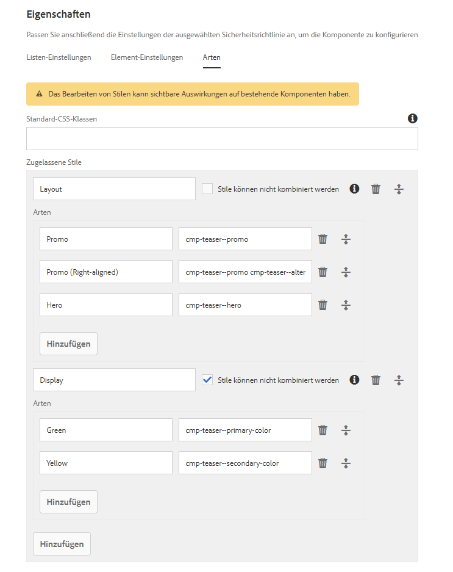
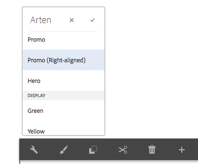

# Best Practices für das Stilsystem{#understanding-style-organization-with-the-aem-style-system}

>[!NOTE]
>
>Bitte lesen Sie den Inhalt unter [Erläuterungen zum Code für das Stilsystem](style-system-technical-video-understand.md), um ein Verständnis der BEM-ähnlichen Konventionen zu gewährleisten, die von AEM Style System verwendet werden.

Es gibt zwei Hauptformate oder -stile, die für das AEM-Stilsystem implementiert sind:

* **Layoutstile**
* **Anzeigestile**

**Layoutstile** wirken sich auf viele Elemente einer Komponente aus, um eine gut definierte und identifizierbare Darstellung (Entwurf und Layout) der Komponente zu erstellen und sie oft an einem bestimmten wiederverwendbaren Markenkonzept auszurichten. Beispielsweise kann eine Teaser-Komponente im klassischen kartenbasierten Layout, im horizontalen Promotionstil oder als Hero-Layout-Überlagerungstext auf einem Bild dargestellt werden.

**Anzeigeformate** wirken sich auf geringfügige Änderungen an Layoutstilen aus, ändern jedoch nicht die grundlegende Natur oder Absicht des Layoutstils. Ein Hero-Layoutstil kann beispielsweise Anzeigestile aufweisen, die das Farbschema vom primären Markenfarbschema zum sekundären Markenfarbschema ändern.

## Best Practices für die Organisation {#style-organization-best-practices}

Beim Definieren der Stilnamen, die AEM Autoren zur Verfügung stehen, sollten Sie Folgendes tun:

* Benennen von Stilen mithilfe eines von den Autoren verständlichen Wortschatzes
* Minimieren der Anzahl der Stiloptionen
* Zeigt nur Stiloptionen und Kombinationen an, die nach den Markenstandards zulässig sind
* Nur Stilkombinationen mit Effekt verfügbar machen
   * Sind unwirksame Kombinationen verfügbar, stellen Sie sicher, dass sie wenigstens keine nachteilige Wirkung haben

Je mehr Stilkombinationen AEM Autoren zur Verfügung stehen, desto mehr Permutationen sind vorhanden, die mit den Markenstandards abgeglichen und validiert werden müssen. Zu viele Optionen können auch Autoren verwirren, da unklar ist, welche Option oder Kombination erforderlich ist, um den gewünschten Effekt zu erzielen.

### Stilnamen vs. CSS-Klassen {#style-names-vs-css-classes}

Stilnamen oder die Optionen, die AEM Autoren angezeigt werden, und die implementierenden CSS-Klassennamen werden in AEM entkoppelt.

Dadurch können Stiloptionen in einem Vokabular eindeutig beschriftet und von den AEM-Autoren verstanden werden, aber CSS-Entwickler können die CSS-Klassen zukünftig semantisch benennen. Beispiel:

Eine Komponente muss die Optionen haben, die mit den **primären** und **sekundären** Farben der Marke farblich zu verfärben sind, die AEM jedoch die Farben als **grün** und **gelb** und nicht als Entwurfssprache primär und sekundär kennen.

Das AEM-Stilsystem kann diese farbigen Anzeigestile mithilfe von **Grün** - und **Gelb**-Bezeichnungen verfügbar machen, während es CSS-Entwicklern ermöglicht wird, die semantische Benennung von zu verwenden `.cmp-component--primary-color` `.cmp-component--secondary-color` und die tatsächliche Stilimplementierung in CSS zu definieren.

Der Stilname von **Grün** wird zugeordnet `.cmp-component--primary-color`, und **Gelb** `.cmp-component--secondary-color`.

Wenn sich die Markenfarbe der Firma in der Zukunft ändert, müssen nur die einzelnen Implementierungen von und `.cmp-component--primary-color` `.cmp-component--secondary-color`sowie die Stilnamen geändert werden.

## Die Teaser-Komponente als Beispiel {#the-teaser-component-as-an-example-use-case}

Im Folgenden finden Sie ein Beispiel für die Formatierung einer Teaser-Komponente mit mehreren verschiedenen Layout- und Anzeigestilen.

Auf diese Weise wird untersucht, wie Stilnamen (denen Autoren zur Verfügung stehen) und wie die CSS-Unterklassen organisiert werden.

### Konfiguration von Teaser-Komponentenstilen {#component-styles-configuration}

Die folgende Abbildung zeigt die Konfiguration der [!UICONTROL Stile] für die Teaser-Komponente für die Varianten, die im Anwendungsfall erläutert werden.

Die Namen der [!UICONTROL Stilgruppen] , Layout und Anzeige stimmen nach dem Glück mit den allgemeinen Konzepten von Anzeigestilen und Layoutstilen überein, die zur konzeptionellen Kategorisierung von Stiltypen in diesem Artikel verwendet werden.

Die [!UICONTROL Stilgruppennamen] und die Anzahl der [!UICONTROL Stilgruppen] sollten auf die Konventionen für die Komponentenverwendung und für die projektspezifische Komponentenformatierung zugeschnitten werden.

Beispielsweise könnte der Gruppenname für den **Anzeigestil** den Namen &quot; **Farben**&quot;erhalten haben.



### Menü &quot;Stilauswahl&quot; {#style-selection-menu}

In der folgenden Abbildung sehen Sie die Interaktion der Autoren des [!UICONTROL Stilmenüs] , um die entsprechenden Stile für die Komponente auszuwählen. Beachten Sie, dass die [!UICONTROL Stilnamen] sowie die Stilnamen dem Autor angezeigt werden.



### Default style {#default-style}

Der Standardstil ist häufig der am häufigsten verwendete Komponentenstil und die standardmäßige, nicht formatierte Ansicht des Teasers, wenn sie einer Seite hinzugefügt wird.

Abhängig von der Standardart kann die CSS direkt auf die `.cmp-teaser` (ohne Modifikatoren) oder auf eine `.cmp-teaser--default`Anwendung angewendet werden.

Wenn die Standard-Stilregeln häufiger als nicht für alle Varianten gelten, sollten Sie sie am besten `.cmp-teaser` als CSS-Klassen des Standardstils verwenden, da alle Varianten diese implizit übernehmen sollten, vorausgesetzt, es werden BEM-ähnliche Konventionen befolgt. Andernfalls sollten sie über den Standardmodifikator angewendet werden, z. B. `.cmp-teaser--default`, der wiederum dem Feld Standard-CSS-Klassen [der](#component-styles-configuration) Komponentenstil-Konfiguration hinzugefügt werden muss. Andernfalls müssen diese Stilregeln in jeder Variante außer Kraft gesetzt werden.

Es ist sogar möglich, einen &quot;benannten&quot;Stil als Standardstil zuzuweisen, z. B. den unten `(.cmp-teaser--hero)` definierten Hero-Stil. Es ist jedoch klarer, den Standardstil für Implementierungen der `.cmp-teaser` oder `.cmp-teaser--default` CSS-Klasse zu implementieren.

>[!NOTE]
>
>Beachten Sie, dass der Standardlayoutstil KEINEN Anzeigestil enthält. Der Autor kann jedoch eine Anzeigeoption im Auswahlwerkzeug &quot;AEM-Stil&quot;auswählen.
>
>Dies verstößt gegen die bewährte Praxis:
>
>**Nur Stilkombinationen mit Effekt verfügbar machen**
>
>Wenn ein Autor den Anzeigestil **Grün** auswählt, passiert nichts.
>
>In diesem Fall werden wir diese Verletzung einräumen, da alle anderen Layoutstile unter Verwendung der Markenfarben farbig sein müssen.
>
>Im Abschnitt **Promo (Rechtsbündig)** unten sehen wir, wie unerwünschte Stilkombinationen vermieden werden können.


* **Layoutstil**
   * Default
* **Anzeigeformat**
   * Keine
* **Effektive CSS-Klassen**: `.cmp-teaser--promo` oder `.cmp-teaser--default`

### Werbeformat {#promo-style}

Der Layoutstil **&quot;** Promo&quot;wird verwendet, um hochwertige Inhalte auf der Site zu fördern. Er wird horizontal angeordnet, um einen Leerraum auf der Webseite aufzunehmen. Er muss mit Markenfarben formatiert sein, wobei der standardmäßige Promo-Layoutstil schwarzen Text verwendet.

Um dies zu erreichen, werden ein **Layoutstil** von **Promo** und die **Anzeigeformate** von **Grün** und **Gelb** im AEM für die Teaser-Komponente konfiguriert.

#### Promo-Standard


* **Layoutstil**
   * Stilname: **Promo**
   * CSS-Klasse: `cmp-teaser--promo`
* **Anzeigeformat**
   * Keine
* **Effektive CSS-Klassen**: `.cmp-teaser--promo`

#### Werbung Primär


* **Layoutstil**
   * Stilname: **Promo**
   * CSS-Klasse: `cmp-teaser--promo`
* **Anzeigeformat**
   * Stilname: **Grün**
   * CSS-Klasse: `cmp-teaser--primary-color`
* **Effektive CSS-Klassen**: `cmp-teaser--promo.cmp-teaser--primary-color`

#### Werbung Sekundär


* **Layoutstil**
   * Stilname: **Promo**
   * CSS-Klasse: `cmp-teaser--promo`
* **Anzeigeformat**
   * Stilname: **Gelb**
   * CSS-Klasse: `cmp-teaser--secondary-color`
* **Effektive CSS-Klassen**: `cmp-teaser--promo.cmp-teaser--secondary-color`

### Rechtsbündiger Stil der Promo {#promo-r-align}

Der Layoutstil &quot; **Promo&quot;mit der rechten Ausrichtung** ist eine Variante des &quot;Promo&quot;-Stils, bei dem die Position des Bilds und des Textes (Bild rechts, Text links) durch den Stil umgekehrt wird.

Die richtige Ausrichtung ist im Kern ein Anzeigestil, der als Display-Stil in Verbindung mit dem Layout-Stil &quot;Promo&quot;in das AEM-Stilsystem eingegeben werden kann. Dies verstößt gegen die Best Practice bei:

**Nur Stilkombinationen mit Effekt verfügbar machen**

..die bereits im [Standardstil](#default-style)verletzt wurde.

Da die rechte Ausrichtung nur den Promo-Layoutstil betrifft, nicht die anderen 2 Layoutstile: Standard und Hero können Sie eine neue Layoutstil-Promo (rechts ausgerichtet) erstellen, die die CSS-Klasse enthält, die den Inhalt der Promo-Layoutstile rechtsbündig ausrichtet: `cmp -teaser--alternate`.

Diese Kombination mehrerer Stile zu einem einzelnen Stileintrag kann auch dazu beitragen, die Anzahl der verfügbaren Stile und Stilpermutationen zu reduzieren, was am besten zu minimieren ist.

Beachten Sie, dass der Name der CSS-Klasse `cmp-teaser--alternate`nicht mit der Authoring-freundlichen Nomenklatur von &quot;rechts ausgerichtet&quot; übereinstimmen muss.

#### Promo, rechtsbündiger Standard


* **Layoutstil**
   * Stilname: **Promo (rechts ausgerichtet)**
   * CSS-Klassen: `cmp-teaser--promo cmp-teaser--alternate`
* **Anzeigeformat**
   * Keine
* **Effektive CSS-Klassen**: `.cmp-teaser--promo.cmp-teaser--alternate`

#### Werbung rechts ausgerichtet Primär


* **Layoutstil**
   * Stilname: **Promo (rechts ausgerichtet)**
   * CSS-Klassen: `cmp-teaser--promo cmp-teaser--alternate`
* **Anzeigeformat**
   * Stilname: **Grün**
   * CSS-Klasse: `cmp-teaser--primary-color`
* **Effektive CSS-Klassen**: `.cmp-teaser--promo.cmp-teaser--alternate.cmp-teaser--primary-color`

#### Werbung rechts ausgerichtet Sekundär


* **Layoutstil**
   * Stilname: **Promo (rechts ausgerichtet)**
   * CSS-Klassen: `cmp-teaser--promo cmp-teaser--alternate`
* **Anzeigeformat**
   * Stilname: **Gelb**
   * CSS-Klasse: `cmp-teaser--secondary-color`
* **Effektive CSS-Klassen**: `.cmp-teaser--promo.cmp-teaser--alternate.cmp-teaser--secondary-color`

### Hero-Stil {#hero-style}

Der Hero-Layoutstil zeigt das Bild der Komponenten als Hintergrund mit dem Titel und der Verknüpfung überlagert an. Der Hero-Layoutstil, wie auch der Promo-Layoutstil, muss mit Markenfarben farbig sein.

Um den Hero-Layoutstil mit Markenfarben zu färben, können die gleichen Anzeigestile verwendet werden, die für den Promo-Layoutstil verwendet werden.

Pro Komponente wird der Stilname dem einzelnen Satz von CSS-Klassen zugeordnet. Das bedeutet, dass die CSS-Klassennamen, die den Hintergrund des Promo-Layoutstils farblich markieren, den Text und die Verknüpfung des Hero-Layoutstils farblich markieren müssen.

Dies lässt sich durch Scoping der CSS-Regeln auf triviale Weise erreichen. Dies erfordert jedoch, dass die CSS-Entwickler verstehen, wie diese Permutationen AEM umgesetzt werden.

CSS zum Färben des Hintergrundfarbens des **Promote** -Layoutstils mit der primären (grünen) Farbe:

```css
.cmp-teaser--promo.cmp-teaser--primary--color {
   ...
   background-color: green;
   ...
}
```

CSS zum Färben des Textes des **Hero** -Layoutstils mit der primären (grünen) Farbe:

```css
.cmp-teaser--hero.cmp-teaser--primary--color {
   ...
   color: green;
   ...
}
```

#### Hero-Standard


* **Layoutstil**
   * Stilname: **Hero**
   * CSS-Klasse: `cmp-teaser--hero`
* **Anzeigeformat**
   * Keine
* **Effektive CSS-Klassen**: `.cmp-teaser--hero`

#### Hero Primär


* **Layoutstil**
   * Stilname: **Promo**
   * CSS-Klasse: `cmp-teaser--hero`
* **Anzeigeformat**
   * Stilname: **Grün**
   * CSS-Klasse: `cmp-teaser--primary-color`
* **Effektive CSS-Klassen**: `cmp-teaser--hero.cmp-teaser--primary-color`

#### Hero Sekundär


* **Layoutstil**
   * Stilname: **Promo**
   * CSS-Klasse: `cmp-teaser--hero`
* **Anzeigeformat**
   * Stilname: **Gelb**
   * CSS-Klasse: `cmp-teaser--secondary-color`
* **Effektive CSS-Klassen**: `cmp-teaser--hero.cmp-teaser--secondary-color`

## Zusätzliche Ressourcen {#additional-resources}

* [Dokumentation zum Stilsystem](https://helpx.adobe.com/de/experience-manager/6-5/sites/authoring/using/style-system.html)
* [Erstellen AEM Client-Bibliotheken](https://helpx.adobe.com/de/experience-manager/6-5/sites/developing/using/clientlibs.html)
* [Website zur BEM-Dokumentation (Block Element Modifier)](https://getbem.com/)
* [Website der LESS-Dokumentation](https://lesscss.org/)
* [jQuery-Website](https://jquery.com/)
