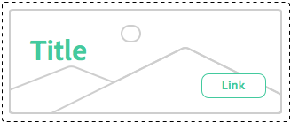

# Best Practices für Stilsysteme{#understanding-style-organization-with-the-aem-style-system}

>[!NOTE]
>
>Lesen Sie den Inhalt unter [Grundlegendes zum Code für das Stilsystem](style-system-technical-video-understand.md), um ein Verständnis der BEM-ähnlichen Konventionen zu gewährleisten, die vom AEM Stilsystem verwendet werden.

Es gibt zwei Hauptformate oder -stile, die für das AEM Stilsystem implementiert sind:

* **Layoutstile**
* **Anzeigestile**

**Layoutstile** beeinflussen viele Elemente einer Komponente, um eine gut definierte und identifizierbare Ausgabedarstellung (Design und Layout) der Komponente zu erstellen, und richten sich häufig an ein bestimmtes wiederverwendbares Markenkonzept aus. Beispielsweise kann eine Teaser-Komponente im herkömmlichen kartenbasierten Layout, einem horizontalen Promotionstil oder als Hero-Layout-Überlagerungstext für ein Bild dargestellt werden.

**Anzeigestile** werden verwendet, um geringfügige Änderungen an Layout-Stilen zu beeinflussen. Sie ändern jedoch nicht die grundlegende Natur oder den Zweck des Layout-Stils. Beispielsweise kann ein Hero-Layoutstil Anzeigestile aufweisen, die das Farbschema vom primären Markenfarbschema in das sekundäre Markenfarbschema ändern.

## Best Practices für die Stilorganisation {#style-organization-best-practices}

Beim Definieren der Stilnamen, die AEM Autoren zur Verfügung stehen, sollten Sie Folgendes tun:

* Benennen von Stilen mithilfe eines von den Autoren verständlichen Vokabulars
* Minimieren der Anzahl der Stiloptionen
* Zeigt nur Stiloptionen und Kombinationen an, die nach Markenstandards zulässig sind
* Zeigt nur Stilkombinationen an, die einen Effekt haben
   * Werden ineffektive Kombinationen ausgesetzt, stellen Sie sicher, dass diese zumindest keine schädlichen Auswirkungen haben.

Je mehr Stilkombinationen AEM Autoren zur Verfügung stehen, desto mehr Permutationen müssen durch Qualitätssicherung und Validierung anhand von Markenstandards vorgenommen werden. Zu viele Optionen können Autoren auch verwirren, da unklar werden kann, welche Option oder Kombination erforderlich ist, um den gewünschten Effekt zu erzielen.

### Stilnamen vs. CSS-Klassen {#style-names-vs-css-classes}

Stilnamen oder die Optionen, die AEM Autoren angezeigt werden, und die implementierenden CSS-Klassennamen werden in AEM entkoppelt.

Dadurch können Stiloptionen in einem Vokabular deutlich beschriftet und von den AEM-Autoren verstanden werden, aber CSS-Entwickler können die CSS-Klassen auf zukunftssichere, semantische Weise benennen. Beispiel:

Eine Komponente muss über die Optionen verfügen, die mit dem **primary** und **Sekundär** Farben kennen die AEM jedoch die Farben als **green** und **gelb**, anstatt der Entwurfssprache von primär und sekundär zu sein.

Das AEM Stilsystem kann diese farbigen Anzeigestile mithilfe von bedienerfreundlichen Beschriftungen verfügbar machen **Grün** und **Gelb**, während es den CSS-Entwicklern ermöglicht, die semantische Benennung von `.cmp-component--primary-color` und `.cmp-component--secondary-color` , um die tatsächliche Stilimplementierung in CSS zu definieren.

Der Stilname von **Grün** wird zugeordnet zu `.cmp-component--primary-color`und **Gelb** nach `.cmp-component--secondary-color`.

Wenn sich die Markenfarbe des Unternehmens in Zukunft ändert, müssen nur die einzelnen Implementierungen von `.cmp-component--primary-color` und `.cmp-component--secondary-color`und die Stilnamen.

## Die Teaser-Komponente als Beispielanwendungsfall {#the-teaser-component-as-an-example-use-case}

Im Folgenden finden Sie ein Anwendungsbeispiel für das Formatieren einer Teaser-Komponente mit mehreren verschiedenen Layout- und Anzeigestilen.

Dadurch wird untersucht, wie Stilnamen (für Autoren verfügbar gemacht) und wie die unterstützenden CSS-Klassen organisiert sind.

### Konfiguration von Teaser-Komponentenstilen {#component-styles-configuration}

Die folgende Abbildung zeigt die [!UICONTROL Stile] -Konfiguration für die Teaser-Komponente für die im Anwendungsbeispiel behandelten Varianten.

Die [!UICONTROL Stilgruppe] Namen, Layout und Anzeige entsprechen durch Zufriedenheit den allgemeinen Konzepten von Anzeigestilen und Layoutstilen, die zur konzeptionellen Kategorisierung von Stiltypen in diesem Artikel verwendet werden.

Die [!UICONTROL Stilgruppe] Namen und Anzahl [!UICONTROL Stilgruppen] sollte auf den Anwendungsfall der Komponente und die projektspezifischen Komponentenstil-Konventionen zugeschnitten sein.

Beispiel: die **Anzeige** Der Name der Stilgruppe hätte **Farben**.


### Menü für Stilauswahl {#style-selection-menu}

Das folgende Bild zeigt die [!UICONTROL Stil] -Menüautoren interagieren mit , um die entsprechenden Stile für die Komponente auszuwählen. Beachten Sie die [!UICONTROL Stil-Grafik] -Namen sowie die Stilnamen dem Autor angezeigt werden.


### Standardstil {#default-style}

Der Standardstil ist häufig der am häufigsten verwendete Stil der Komponente und die standardmäßige, nicht formatierte Ansicht des Teasers beim Hinzufügen zu einer Seite.

Abhängig von der Gemeinsamkeit des Standardstils kann CSS direkt auf die `.cmp-teaser` (ohne Modifikatoren) oder auf einer `.cmp-teaser--default`.

Wenn die standardmäßigen Stilregeln häufiger als nicht für alle Varianten gelten, empfiehlt es sich, `.cmp-teaser` als CSS-Klassen des Standardstils verwenden, da alle Varianten diese implizit übernehmen sollten, vorausgesetzt, BEM-ähnliche Konventionen werden befolgt. Ist dies nicht der Fall, sollten sie über den Standard-Modifikator angewendet werden, z. B. `.cmp-teaser--default`, die wiederum der [CSS-Standardklassen der Stilkonfiguration der Komponente](#component-styles-configuration) -Feld, da diese Stilregeln andernfalls in jeder Variante überschrieben werden müssen.

Es ist sogar möglich, einen &quot;benannten&quot;Stil als Standardstil zuzuweisen, z. B. den Hero-Stil `(.cmp-teaser--hero)` unten definiert ist, es ist jedoch klarer, den Standardstil für die `.cmp-teaser` oder `.cmp-teaser--default` CSS-Klassenimplementierungen.

>[!NOTE]
>
>Beachten Sie, dass der standardmäßige Layoutstil KEINEN Anzeigestil-Namen aufweist. Der Autor kann jedoch im AEM Stilsystem-Auswahlwerkzeug eine Anzeigeoption auswählen.
>
>Dies verstößt gegen die Best Practice:
>
>**Zeigt nur Stilkombinationen an, die einen Effekt haben**
>
>Wenn ein Autor den Anzeigestil von **Grün** nichts wird passieren.
>
>In diesem Anwendungsfall wird diese Verletzung zugegeben, da alle anderen Layoutstile mithilfe der Markenfarben farbig sein müssen.
>
>Im **Angebot (rechts ausgerichtet)** Im folgenden Abschnitt erfahren Sie, wie Sie unerwünschte Stilkombinationen verhindern können.


* **Layout-Stil**
   * Standard
* **Anzeigeformat**
   * Ohne
* **Effektive CSS-Klassen**: `.cmp-teaser--promo` oder `.cmp-teaser--default`

### Werbeformat {#promo-style}

Die **Layout von Angeboten** wird verwendet, um hochwertige Inhalte auf der Site zu bewerben. Diese Inhalte werden horizontal so angeordnet, dass sie einen Bereich Platz auf der Webseite aufnehmen, und müssen mit Markenfarben formatiert sein, wobei der standardmäßige Layoutstil Promo mit schwarzem Text verwendet wird.

Um dies zu erreichen, muss ein **Layoutstil** von **Promo** und **Anzeigestile** von **Grün** und **Gelb** werden im AEM Stilsystem für die Teaser-Komponente konfiguriert.

#### Promo-Standard


* **Layout-Stil**
   * Stilname: **Promo**
   * CSS-Klasse: `cmp-teaser--promo`
* **Anzeigeformat**
   * Ohne
* **Effektive CSS-Klassen**: `.cmp-teaser--promo`

#### Promo Primär


* **Layout-Stil**
   * Stilname: **Promo**
   * CSS-Klasse: `cmp-teaser--promo`
* **Anzeigeformat**
   * Stilname: **Grün**
   * CSS-Klasse: `cmp-teaser--primary-color`
* **Effektive CSS-Klassen**: `cmp-teaser--promo.cmp-teaser--primary-color`

#### Promo Sekundär


* **Layout-Stil**
   * Stilname: **Promo**
   * CSS-Klasse: `cmp-teaser--promo`
* **Anzeigeformat**
   * Stilname: **Gelb**
   * CSS-Klasse: `cmp-teaser--secondary-color`
* **Effektive CSS-Klassen**: `cmp-teaser--promo.cmp-teaser--secondary-color`

### Rechtsbündiger Stil des Angebots {#promo-r-align}

Die **Angebot rechts ausgerichtet** Der Layoutstil ist eine Variation des Angebotsstils, der die Position des Bildes und des Textes (Bild rechts, Text links) im Stil spiegelt.

Die richtige Ausrichtung im Kern ist ein Anzeigestil, der in das AEM Stilsystem als Anzeigestil eingegeben werden kann, der in Verbindung mit dem Layout-Stil von Promo ausgewählt wird. Dies verstößt gegen die Best Practice von:

**Zeigt nur Stilkombinationen an, die einen Effekt haben**

.die bereits in der [Standardstil](#default-style).

Da sich die richtige Ausrichtung nur auf den Layoutstil von Promo und nicht auf die beiden anderen Layoutstile auswirkt: Standard und Hero können wir einen neuen Layoutstil &quot;Promo&quot;(rechts ausgerichtet) erstellen, der die CSS-Klasse enthält, die den Inhalt der Promo-Layoutstile rechtsbündig ausrichtet: `cmp -teaser--alternate`.

Diese Kombination mehrerer Stile zu einem einzelnen Stileintrag kann auch dazu beitragen, die Anzahl der verfügbaren Stile und Stilpermutationen zu reduzieren, was am besten zu minimieren ist.

Beachten Sie den Namen der CSS-Klasse. `cmp-teaser--alternate`, muss nicht mit der autorfreundlichen Nomenklatur von &quot;rechtsbündig&quot;übereinstimmen.

#### Angebot - Rechtsbündiger Standard


* **Layout-Stil**
   * Stilname: **Angebot (rechts ausgerichtet)**
   * CSS-Klassen: `cmp-teaser--promo cmp-teaser--alternate`
* **Anzeigeformat**
   * Ohne
* **Effektive CSS-Klassen**: `.cmp-teaser--promo.cmp-teaser--alternate`

#### Angebot rechts ausgerichtet Primär


* **Layout-Stil**
   * Stilname: **Angebot (rechts ausgerichtet)**
   * CSS-Klassen: `cmp-teaser--promo cmp-teaser--alternate`
* **Anzeigeformat**
   * Stilname: **Grün**
   * CSS-Klasse: `cmp-teaser--primary-color`
* **Effektive CSS-Klassen**: `.cmp-teaser--promo.cmp-teaser--alternate.cmp-teaser--primary-color`

#### Angebot rechts ausgerichtet Sekundär


* **Layout-Stil**
   * Stilname: **Angebot (rechts ausgerichtet)**
   * CSS-Klassen: `cmp-teaser--promo cmp-teaser--alternate`
* **Anzeigeformat**
   * Stilname: **Gelb**
   * CSS-Klasse: `cmp-teaser--secondary-color`
* **Effektive CSS-Klassen**: `.cmp-teaser--promo.cmp-teaser--alternate.cmp-teaser--secondary-color`

### Hero-Stil {#hero-style}

Der Hero-Layoutstil zeigt das Bild der Komponenten als Hintergrund mit überlagerter Überschrift und überlagerter Verknüpfung an. Der Hero-Layoutstil, wie auch der Promo-Layoutstil, muss mit Markenfarben farbig sein.

Um den Hero-Layoutstil mit Markenfarben zu färben, können dieselben Anzeigestile verwendet werden, die auch für das Layout &quot;Promo&quot;verwendet werden.

Pro Komponente wird der Stilname dem einzelnen Satz von CSS-Klassen zugeordnet. Das bedeutet, dass die CSS-Klassennamen, die den Hintergrund des Layoutstils &quot;Promo&quot;farblich markieren, den Text und die Verknüpfung des Hero-Layoutstils farblich markieren müssen.

Dies kann durch das Scoping der CSS-Regeln zunächst erreicht werden. Dies erfordert jedoch, dass die CSS-Entwickler verstehen, wie diese Permutationen auf AEM angewendet werden.

CSS zum Färben des Hintergrunds des **Bewerben** Layoutstil mit der primären (grünen) Farbe:

```css
.cmp-teaser--promo.cmp-teaser--primary--color {
   ...
   background-color: green;
   ...
}
```

CSS zum Färben des Texts der **Hero** Layoutstil mit der primären (grünen) Farbe:

```css
.cmp-teaser--hero.cmp-teaser--primary--color {
   ...
   color: green;
   ...
}
```

#### Hero Default


* **Layout-Stil**
   * Stilname: **Hero**
   * CSS-Klasse: `cmp-teaser--hero`
* **Anzeigeformat**
   * Ohne
* **Effektive CSS-Klassen**: `.cmp-teaser--hero`

#### Hero Primär



* **Layout-Stil**
   * Stilname: **Promo**
   * CSS-Klasse: `cmp-teaser--hero`
* **Anzeigeformat**
   * Stilname: **Grün**
   * CSS-Klasse: `cmp-teaser--primary-color`
* **Effektive CSS-Klassen**: `cmp-teaser--hero.cmp-teaser--primary-color`

#### Hero Sekundär


* **Layout-Stil**
   * Stilname: **Promo**
   * CSS-Klasse: `cmp-teaser--hero`
* **Anzeigeformat**
   * Stilname: **Gelb**
   * CSS-Klasse: `cmp-teaser--secondary-color`
* **Effektive CSS-Klassen**: `cmp-teaser--hero.cmp-teaser--secondary-color`

## Zusätzliche Ressourcen {#additional-resources}

* [Dokumentation zum Stilsystem](https://helpx.adobe.com/de/experience-manager/6-5/sites/authoring/using/style-system.html)
* [Erstellen AEM Client-Bibliotheken](https://helpx.adobe.com/de/experience-manager/6-5/sites/developing/using/clientlibs.html)
* [Website zur BEM-Dokumentation (Block Element Modifier)](https://getbem.com/)
* [Website der LESS-Dokumentation](https://lesscss.org/)
* [jQuery-Website](https://jquery.com/)
