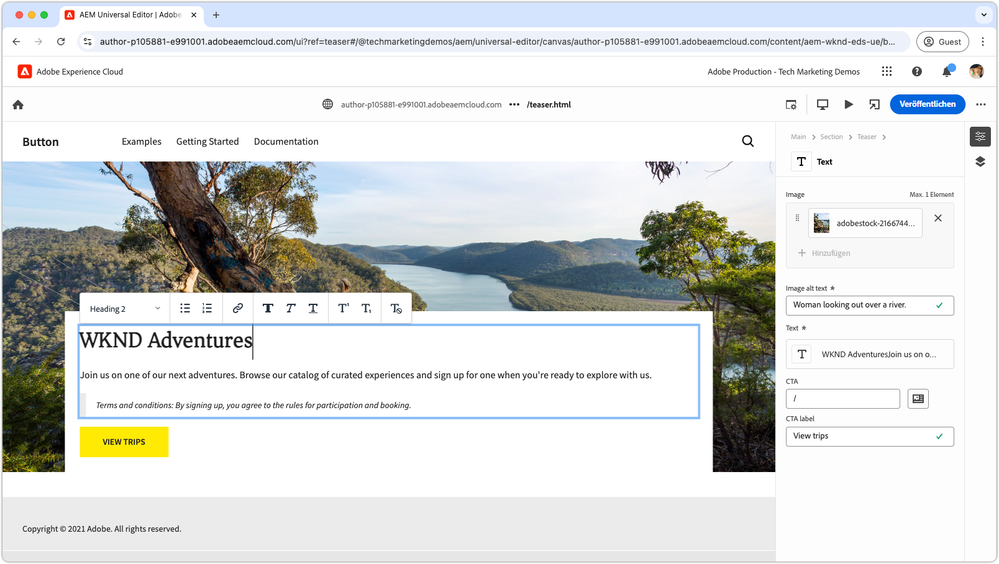

# Entwickler-Tutorial für Edge Delivery Services und den universellen Editor

In diesem Tutorial lernen Sie die Grundlagen zum Erstellen einer AEM-Website kennen, die leistungsstarkes Authoring mit dem universellen Editor und eine blitzschnelle Bereitstellung mithilfe von Edge Delivery Services kombinieren. Am Ende werden Sie über grundlegende Kenntnisse zum Erstellen eines neuen Projekts, zum Einrichten einer lokalen Entwicklungsumgebung und zum Erstellen eines neuen Blocks verfügen.

## Projekt-Setup

Erfahren Sie, wie Sie in AEM as a Cloud Service ein Code-Projekt erstellen und eine neue Site konfigurieren. Dieses Setup ermöglicht eine nahtlose Entwicklung mit dem universellen Editor für die Inhaltserstellung und die schnelle Inhaltsbereitstellung über Edge Delivery Services.

<!-- CARDS 

* ./1-new-code-project.md
* ./2-new-aem-site.md

-->
<!-- START CARDS HTML - DO NOT MODIFY BY HAND -->

    

        

            

                <figure class="image x-is-16by9">
                    
                </figure>
            

            

                

                    

                        <a href="./1-new-code-project.md" target="_blank" rel="referrer" title="Erstellen eines Code-Projekts">Erstellen eines Code-Projekts</a>
                    

                    
Erstellen Sie ein Code-Projekt für Edge Delivery Services, das mit dem universellen Editor bearbeitet werden kann.

                

                <a href="./1-new-code-project.md" target="_blank" rel="referrer" class="spectrum-Button spectrum-Button--outline spectrum-Button--primary spectrum-Button--sizeM" style="align-self: flex-start; margin-top: 1rem;">
Mehr erfahren
</a>
            

        

    

    

        

            

                <figure class="image x-is-16by9">
                    
                </figure>
            

            

                

                    

                        <a href="./2-new-aem-site.md" target="_blank" rel="referrer" title="Erstellen einer AEM-Site">Erstellen einer AEM-Site</a>
                    

                    
Erstellen Sie eine Site in AEM Sites für Edge Delivery Services, die mit dem universellen Editor bearbeitet werden kann.

                

                <a href="./2-new-aem-site.md" target="_blank" rel="referrer" class="spectrum-Button spectrum-Button--outline spectrum-Button--primary spectrum-Button--sizeM" style="align-self: flex-start; margin-top: 1rem;">
Mehr erfahren
</a>
            

        

    

<!-- END CARDS HTML - DO NOT MODIFY BY HAND -->

## Entwicklungs-Setup

Erfahren Sie, wie Sie Ihre lokale Entwicklungsumgebung für eine schnelle Website-Entwicklung konfigurieren. Dieses Setup ermöglicht eine nahtlose Site-Erstellung mit dem universellen Editor und eine effiziente Inhaltsbereitstellung über Edge Delivery Services, wodurch ein reibungsloser und optimierter Entwicklungs-Workflow gewährleistet wird.
<!-- CARDS 

* ./3-local-development-environment.md
* ./4-website-branding.md

-->
<!-- START CARDS HTML - DO NOT MODIFY BY HAND -->

    

        

            

                <figure class="image x-is-16by9">
                    
                </figure>
            

            

                

                    

                        <a href="./3-local-development-environment.md" target="_blank" rel="referrer" title="Einrichten einer lokalen Entwicklungsumgebung">Einrichten einer lokalen Entwicklungsumgebung</a>
                    

                    
Richten Sie eine lokale Entwicklungsumgebung für Sites ein, die mit Edge Delivery Services bereitgestellt werden und mit dem universellen Editor bearbeitet werden können.

                

                <a href="./3-local-development-environment.md" target="_blank" rel="referrer" class="spectrum-Button spectrum-Button--outline spectrum-Button--primary spectrum-Button--sizeM" style="align-self: flex-start; margin-top: 1rem;">
Mehr erfahren
</a>
            

        

    

    

        

            

                <figure class="image x-is-16by9">
                    
                </figure>
            

            

                

                    

                        <a href="./4-website-branding.md" target="_blank" rel="referrer" title="Hinzufügen von Website-Branding">Hinzufügen von Website-Branding</a>
                    

                    
Definieren Sie globales CSS, CSS-Variablen und Web-Schriften für eine Edge Delivery Services-Site.

                

                <a href="./4-website-branding.md" target="_blank" rel="referrer" class="spectrum-Button spectrum-Button--outline spectrum-Button--primary spectrum-Button--sizeM" style="align-self: flex-start; margin-top: 1rem;">
Mehr erfahren
</a>
            

        

    

<!-- END CARDS HTML - DO NOT MODIFY BY HAND -->

## Blockentwicklung

Erfahren Sie, wie Sie einen neuen Block erstellen, indem Sie sein Inhaltsmodell definieren und Beispielinhalte für Tests und Entwicklung einrichten. Erkunden Sie zwei Methoden zum Rendern des Blocks und erfahren Sie, wie Sie ihn strukturieren, um eine optimale Leistung und Flexibilität in AEM und Edge Delivery Services zu erzielen.

<!-- CARDS 

* ./5-new-block.md {image = ./assets/5-new-block/card.png}
* ./6-author-block.md {image = ./assets/6-author-block/card.png}
* ./7a-block-css.md {image = ./assets/7a-block-css/card.png}
* ./7b-block-js-css.md {image = ./assets/7b-block-js-css/card.png}

-->
<!-- START CARDS HTML - DO NOT MODIFY BY HAND -->

    

        

            

                <figure class="image x-is-16by9">
                    
                </figure>
            

            

                

                    

                        <a href="./5-new-block.md" target="_blank" rel="referrer" title="Erstellen eines Blocks">Erstellen eines Blocks</a>
                    

                    
Erstellen Sie einen Block für eine Edge Delivery Services-Website, die mit dem universellen Editor bearbeitet werden kann.

                

                <a href="./5-new-block.md" target="_blank" rel="referrer" class="spectrum-Button spectrum-Button--outline spectrum-Button--primary spectrum-Button--sizeM" style="align-self: flex-start; margin-top: 1rem;">
Mehr erfahren
</a>
            

        

    

    

        

            

                <figure class="image x-is-16by9">
                    
                </figure>
            

            

                

                    

                        <a href="./6-author-block.md" target="_blank" rel="referrer" title="Erstellen eines Blocks">Erstellen eines Blocks</a>
                    

                    
Erstellen Sie einen Edge Delivery Services-Block mit dem universellen Editor.

                

                <a href="./6-author-block.md" target="_blank" rel="referrer" class="spectrum-Button spectrum-Button--outline spectrum-Button--primary spectrum-Button--sizeM" style="align-self: flex-start; margin-top: 1rem;">
Mehr erfahren
</a>
            

        

    

    

        

            

                <figure class="image x-is-16by9">
                    
                </figure>
            

            

                

                    

                        <a href="./7a-block-css.md" target="_blank" rel="referrer" title="Entwickeln eines Blocks mit CSS">Entwickeln eines Blocks mit CSS</a>
                    

                    
Entwickeln Sie einen Block mit CSS für Edge Delivery Services, der mit dem universellen Editor bearbeitet werden kann.

                

                <a href="./7a-block-css.md" target="_blank" rel="referrer" class="spectrum-Button spectrum-Button--outline spectrum-Button--primary spectrum-Button--sizeM" style="align-self: flex-start; margin-top: 1rem;">
Mehr erfahren
</a>
            

        

    

    

        

            

                <figure class="image x-is-16by9">
                    
                </figure>
            

            

                

                    

                        <a href="./7b-block-js-css.md" target="_blank" rel="referrer" title="Entwickeln eines Blocks mit CSS und JS">Entwickeln eines Blocks mit CSS und JS</a>
                    

                    
Entwickeln Sie einen Block mit CSS und JavaScript für Edge Delivery Services, der mit dem universellen Editor bearbeitet werden kann.

                

                <a href="./7b-block-js-css.md" target="_blank" rel="referrer" class="spectrum-Button spectrum-Button--outline spectrum-Button--primary spectrum-Button--sizeM" style="align-self: flex-start; margin-top: 1rem;">
Mehr erfahren
</a>
            

        

    

<!-- END CARDS HTML - DO NOT MODIFY BY HAND -->

## Nächste Schritte

Nachdem Sie dieses Tutorial nun abgeschlossen haben, bauen Sie auf dem auf, was Sie mit diesen zielgerichteten Anleitungen gelernt haben. In diesen Handbüchern wird näher auf den hier behandelten Code und die hier behandelten Konzepte eingegangen. Es werden rollenspezifische Anwendungsfälle, erweiterte Techniken und zusätzliche Tipps zur Verbesserung der Entwicklungsfähigkeiten von Edge Delivery Services und dem universellen Editor untersucht.

<!-- CARDS 

* ./how-to/block-options.md
* ./how-to/header-and-footer.md

-->
<!-- START CARDS HTML - DO NOT MODIFY BY HAND -->

    

        

            

                <figure class="image x-is-16by9">
                    
                </figure>
            

            

                

                    

                        <a href="./how-to/block-options.md" target="_blank" rel="referrer" title="Blockoptionen">Blockoptionen</a>
                    

                    
Erfahren Sie, wie Sie einen Block mit mehreren Anzeigeoptionen erstellen.

                

                <a href="./how-to/block-options.md" target="_blank" rel="referrer" class="spectrum-Button spectrum-Button--outline spectrum-Button--primary spectrum-Button--sizeM" style="align-self: flex-start; margin-top: 1rem;">
                    Mehr erfahren
                </a>
            

        

    

    

        

            

                <figure class="image x-is-16by9">
                    
                </figure>
            

            

                

                    

                        <a href="./how-to/header-and-footer.md" target="_blank" rel="referrer" title="Kopf- und Fußzeile">Kopf- und Fußzeile</a>
                    

                    
Erfahren Sie, wie Kopf- und Fußzeilen in Edge Delivery Services und im universellen Editor verwendet werden.

                

                <a href="./how-to/header-and-footer.md" target="_blank" rel="referrer" class="spectrum-Button spectrum-Button--outline spectrum-Button--primary spectrum-Button--sizeM" style="align-self: flex-start; margin-top: 1rem;">
                    Mehr erfahren
                </a>
            

        

    

<!-- END CARDS HTML - DO NOT MODIFY BY HAND -->
