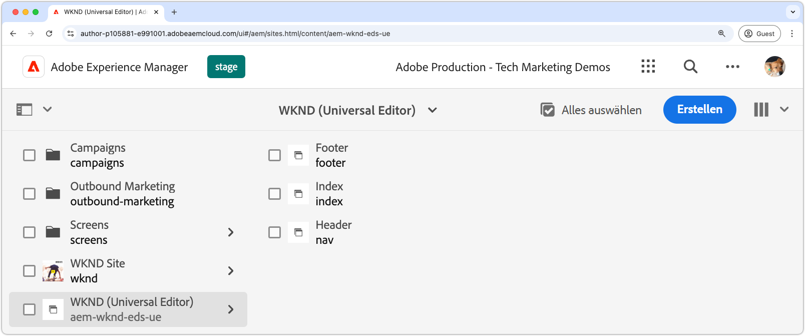

# Erstellen einer AEM-Site

Auf der AEM-Site werden die Inhalte der Website von bearbeitet, verwaltet und veröffentlicht. Um eine AEM-Site zu erstellen, die über Edge Delivery Services bereitgestellt und mit dem universellen Editor erstellt wurde, verwenden Sie die [Edge Delivery Services mit der AEM-Authoring-Site](https://github.com/adobe-rnd/aem-boilerplate-xwalk/releases)Vorlage, um eine neue Site in der AEM-Autoreninstanz zu erstellen.

Auf der AEM-Site werden die Inhalte der Website gespeichert und verfasst. Das endgültige Erlebnis besteht aus der Kombination des AEM-Site-Inhalts mit dem [Code der Website](./1-new-code-project.md)

Befolgen Sie die [detaillierten Schritte in der Dokumentation](https://experienceleague.adobe.com/en/docs/experience-manager-cloud-service/content/edge-delivery/wysiwyg-authoring/edge-dev-getting-started#create-aem-site), um eine neue AEM-Site zu erstellen.  Nachfolgend finden Sie eine zusammenfassende Liste der Schritte, einschließlich der in diesem Tutorial verwendeten Werte.
1. **Erstellen einer neuen Site** in AEM Author. In diesem Tutorial wird die folgende Site-Benennung verwendet:
   * Site-Titel: `WKND (Universal Editor)`
   * Site-Name: `aem-wknd-eds-ue`

      * Der Site-Namenswert muss mit dem Site-Pfadnamen übereinstimmen [zu `paths.json`](https://experienceleague.adobe.com/en/docs/experience-manager-cloud-service/content/edge-delivery/wysiwyg-authoring/path-mapping) hinzugefügt.

2. **Importieren Sie die neueste Vorlage** aus den [Edge Delivery Services mit der AEM-Authoring-Site-Vorlage](https://github.com/adobe-rnd/aem-boilerplate-xwalk/releases).
3. **Benennen Sie die Site**, um dem GitHub-Repository-Namen zu entsprechen, und legen Sie die GitHub-URL als Repository-URL fest.

## Publish : Die neue Site für die Vorschau

Nachdem Sie die Site in der AEM-Autoreninstanz erstellt haben, veröffentlichen Sie sie in der Edge Delivery Services-Vorschau, um den Inhalt in der [lokalen Entwicklungsumgebung“ ](./3-local-development-environment.md).

1. Melden Sie sich bei **AEM Author an** navigieren Sie zu **Sites**.
2. Wählen Sie die **neue Site** (`WKND (Universal Editor)`) aus und klicken Sie auf **Veröffentlichungen verwalten**.
3. Wählen Sie **Vorschau** unter **Ziele** und klicken Sie auf **Weiter**.
4. Wählen **unter „Untergeordnete** einschließen“ die Option **Untergeordnete Elemente einschließen**, heben Sie die Auswahl anderer Optionen auf und klicken Sie auf **OK**.
5. Klicken Sie auf **Publish**, um den Inhalt der Site für die Vorschau zu veröffentlichen.
6. Nach der Veröffentlichung zur Vorschau sind die Seiten in der Edge Delivery Services-Vorschau-Umgebung verfügbar (die Seiten werden nicht im AEM-Vorschau-Service angezeigt).
