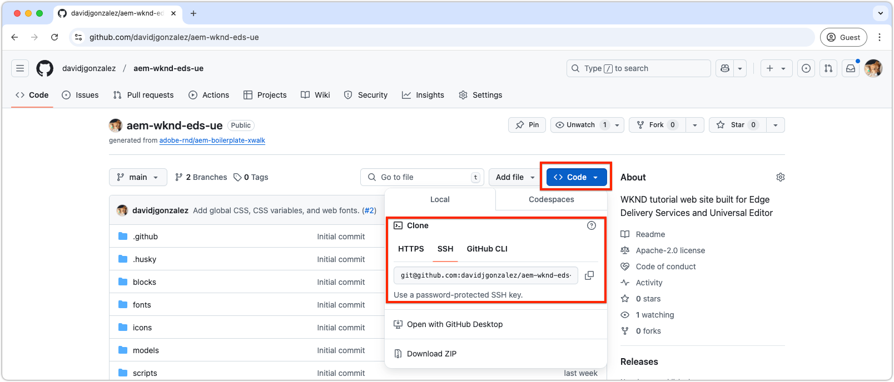

# Einrichten einer lokalen Entwicklungsumgebung

Eine lokale Entwicklungsumgebung ist für die schnelle Entwicklung von Websites, die von Edge Delivery Services bereitgestellt werden, von entscheidender Bedeutung. Die Umgebung verwendet lokal entwickelten Code, während sie Inhalte aus Edge Delivery Services bezieht, sodass Entwickelnde Code-Änderungen sofort anzeigen können. Ein solches Setup unterstützt schnelle, iterative Entwicklungen und Tests.

Die Entwicklungs-Tools und -prozesse für ein Edge Delivery Services-Website-Projekt sind so konzipiert, dass sie Web-Entwickelnden vertraut sind und ihnen ein schnelles und effizientes Entwicklungserlebnis bieten.

## Entwicklungstopologie

Dieses Video bietet einen Überblick über die Entwicklungstopologie für ein Edge Delivery Services-Website-Projekt, das mit dem universellen Editor bearbeitet werden kann.

>[!VIDEO](https://video.tv.adobe.com/v/3443978/?learn=on&enablevpops)

+++Siehe zusätzliche Details zur Entwicklungstopologie.

- **GitHub-Repository**:
   - **Zweck**: Hostet den Code der Website (CSS und JavaScript).
   - **Struktur**: Die **Hauptverzweigung** enthält produktionsbereiten Code, während andere Verzweigungen Arbeits-Code enthalten.
   - **Funktionalität**: Code aus jeder Verzweigung kann für die **Produktions**- oder **Vorschau**-Umgebungen ausgeführt werden, ohne die Live-Website zu beeinträchtigen.

- **AEM-Autoren-Service**:
   - **Zweck**: Dient als kanonisches Content-Repository, in dem Website-Inhalte bearbeitet und verwaltet werden.
   - **Funktionalität**: Inhalte werden vom **universellen Editor** gelesen und geschrieben. Bearbeitete Inhalte werden in **Edge Delivery Services** in **Produktions**- oder **Vorschau**-Umgebungen veröffentlicht.

- **Universeller Editor**:
   - **Zweck**: Bietet eine WYSIWYG-Oberfläche für die Bearbeitung von Website-Inhalten.
   - **Funktionalität**: Lese- und Schreibvorgänge finden im **AEM-Autoren-Service** statt. Kann so konfiguriert werden, dass Code aus einer beliebigen Verzweigung im **GitHub-Repository** wird, um Änderungen zu testen und zu validieren.

- **Edge Delivery Services**:
   - **Produktionsumgebung**:
      - **Zweck**: Stellt den Inhalt und Code der Live-Website für Endbenutzende bereit.
      - **Funktionalität**: Stellt Inhalte bereit, die aus dem **AEM-Autoren-Service** veröffentlicht wurden, wobei Code aus der **Hauptverzweigung** des **GitHub-Repositorys** verwendet wird.
   - **Vorschau-Umgebung**:
      - **Zweck**: Bietet eine Staging-Umgebung, in der Inhalte und Code vor der Bereitstellung getestet und in der Vorschau angezeigt werden können.
      - **Funktionalität**: Stellt Inhalte bereit, die aus dem **AEM-Autoren-Service** veröffentlicht wurden, wobei Code aus einer beliebigen Verzweigung des **GitHub-Repositorys** verwendet wird. Dies ermöglicht gründliche Tests, ohne dabei die Live-Website zu beeinträchtigen.

- **Lokale Entwicklungsumgebung**:
   - **Zweck**: Ermöglicht Entwickelnden, Code (CSS und JavaScript) lokal zu schreiben und zu testen.
   - **Struktur**:
      - Ein lokaler Klon des **GitHub-Repositorys** für die verzweigungsbasierte Entwicklung.
      - Die **AEM-CLI**, die als Entwicklungs-Server fungiert, wendet lokale Code-Änderungen auf die **Vorschau-Umgebung** an, um ein Hot-Reload-Erlebnis zu ermöglichen.
   - **Workflow**: Entwickelnde schreiben Code lokal, übertragen Änderungen an eine Arbeitsverzweigung, übertragen die Verzweigung auf GitHub, validieren sie im **universellen Editor** (unter Verwendung der angegebenen Verzweigung) und führen sie in der **Hauptverzweigung** zusammen, wenn sie für die Produktionsbereitstellung bereit ist.

+++

## Voraussetzungen

Bevor Sie mit der Entwicklung beginnen, installieren Sie Folgendes auf Ihrem Computer:

1. [Git](https://git-scm.com/)
1. [Node.js und npm](https://nodejs.org)
1. [Microsoft Visual Studio Code](https://code.visualstudio.com/) (oder ähnlicher Code-Editor)

## Klonen des GitHub-Repositorys

Klonen Sie das [GitHub-Repository, das im neuen Code-Projektkapitel erstellt wurde](./1-new-code-project.md) und welches das AEM Edge Delivery Services-Code-Projekt enthält, in Ihre lokale Entwicklungsumgebung.



```bash
$ cd ~/Code
$ git clone git@github.com:<YOUR_ORG>/aem-wknd-eds-ue.git
```

Im Verzeichnis `Code` wird ein neuer Ordner `aem-wknd-eds-ue` erstellt, der als Stammordner des Projekts dient. Obwohl das Projekt an einem beliebigen Speicherort auf dem Computer geklont werden kann, verwendet dieses Tutorial `~/Code` als Stammverzeichnis.

## Installieren von Projektabhängigkeiten

Navigieren Sie zum Projektordner und installieren Sie die erforderlichen Abhängigkeiten mit `npm install`. Obwohl Edge Delivery Services-Projekte keine herkömmlichen Node.js-Build-Systeme wie Webpack oder Vite verwenden, benötigen sie dennoch mehrere Abhängigkeiten für die lokale Entwicklung.

```bash
# ~/Code/aem-wknd-eds-ue

$ npm install
```

## Installieren der AEM-CLI

Die AEM-CLI ist ein Tool mit Node.js-Befehlszeilen, das die Entwicklung von Edge Delivery Services-basierten AEM-Websites optimiert und einen lokalen Entwicklungs-Server für die schnelle Entwicklung und das Testen Ihrer Website bietet.

Führen Sie zum Installieren der AEM-CLI Folgendes aus:

```bash
# ~/Code/aem-wknd-eds-ue

$ npm install @adobe/aem-cli
```

Die AEM-CLI kann auch global mit `npm install --global @adobe/aem-cli` installiert werden.

## Starten Sie den lokalen AEM-Entwicklungs-Server.

Mit dem Befehl `aem up` wird der lokale Entwicklungs-Server gestartet und automatisch ein Browser-Fenster zur URL des Servers geöffnet. Dieser Server fungiert als Reverse-Proxy für die Edge Delivery Services-Umgebung und stellt Inhalte von dort bereit, während Ihre lokale Code-Basis für die Entwicklung verwendet wird.

```bash
$ cd ~/Code/aem-wknd-eds-ue 
$ aem up

    ___    ________  ___                          __      __ 
   /   |  / ____/  |/  /  _____(_)___ ___  __  __/ /___ _/ /_____  _____
  / /| | / __/ / /|_/ /  / ___/ / __ `__ \/ / / / / __ `/ __/ __ \/ ___/
 / ___ |/ /___/ /  / /  (__  ) / / / / / / /_/ / / /_/ / /_/ /_/ / /
/_/  |_/_____/_/  /_/  /____/_/_/ /_/ /_/\__,_/_/\__,_/\__/\____/_/

info: Starting AEM dev server version x.x.x
info: Local AEM dev server up and running: http://localhost:3000/
info: Enabled reverse proxy to https://main--aem-wknd-eds-ue--<YOUR_ORG>.aem.page
```

Die AEM-CLI öffnet die Website in Ihrem Browser unter `http://localhost:3000/`. Änderungen im Projekt werden automatisch im Webbrowser neu geladen, während Inhaltsänderungen [in der Vorschauumgebung](./6-author-block.md) veröffentlicht werden müssen und der Webbrowser aktualisiert werden muss.

Wenn die Website sich mit einer 404-Seite öffnet, ist es wahrscheinlich, dass die Dateien [fstab.yaml oder paths.json](https://experienceleague.adobe.com/de/docs/experience-manager-cloud-service/content/edge-delivery/wysiwyg-authoring/edge-dev-getting-started#create-github-project), die in einem [neuen Code-Projekt](./1-new-code-project.md) aktualisiert wurden, falsch konfiguriert sind oder die Änderungen nicht in der `main`-Verzweigung übernommen wurden.

## Erstellen von JSON-Fragmenten

Edge Delivery Services-Projekte, die mit der Vorlage [AEM Boilerplate XWalk](https://github.com/adobe-rnd/aem-boilerplate-xwalk) erstellt wurden, basieren auf JSON-Konfigurationen, die Block-Erstellungen im universellen Editor ermöglichen.

- **JSON-Fragmente**: Werden mit den zugehörigen Blöcken gespeichert und definieren die Blockmodelle, -definitionen und -filter.
   - **Modellfragmente**: Werden unter `/blocks/example/_example.json` gespeichert.
   - **Definitionsfragmente**: Werden unter `/blocks/example/_example.json` gespeichert.
   - **Filterfragmente**: Werden unter `/blocks/example/_example.json` gespeichert.


Die [AEM Boilerplate XWalk-Projektvorlage](https://github.com/adobe-rnd/aem-boilerplate-xwalk) enthält einen [Husky](https://typicode.github.io/husky/)-Pre-Commit-Hook, der Änderungen an JSON-Fragmenten erkennt und bei `git commit` in die entsprechenden `component-*.json`-Dateien kompiliert.

Die folgenden NPM-Skripte können zwar manuell über `npm run` ausgeführt werden, um die JSON-Dateien zu erstellen, dies ist in der Regel nicht erforderlich, da der Husky-Pre-Commit-Hook dies automatisch ausführt.

```bash
# ~/Code/aem-wknd-eds-ue

npm run build:json
```

| NPM-Skript | Beschreibung |
|--------------------|-----------------------------------------------------------------------------|
| `build:json` | Erstellt alle JSON-Dateien aus Fragmenten und fügt sie den entsprechenden Dateien `component-*.json` hinzu. |
| `build:json:models` | Erstellt Block-JSON-Fragmente und kompiliert sie in `/component-models.json`. |
| `build:json:definitions` | Erstellt JSON-Fragmente für Seiten und kompiliert sie in `/component-definitions.json`. |
| `build:json:filters` | Erstellt JSON-Fragmente für Seiten und kompiliert sie in `/component-filters.json`. |

>[!TIP]
>
> Führen Sie `npm run build:json` nach allen Änderungen an den Fragmentdateien aus, um die JSON-Hauptdateien neu zu generieren.

## Linten

Durch das Linten wird die Code-Qualität und -Konsistenz sichergestellt. Dies ist für Edge Delivery Services-Projekte vor dem Zusammenführen von Änderungen in der `main`-Verzweigung erforderlich.

Die NPM-Skripte können über `npm run` ausgeführt werden, zum Beispiel:

```bash
# ~/Code/aem-wknd-eds-ue

$ npm run lint
```

| NPM-Skript | Beschreibung |
|------------------|--------------------------------------------------|
| `lint:js` | Führt JavaScript-Lint-Prüfungen aus. |
| `lint:css` | Führt CSS-Lint-Prüfungen durch. |
| `lint` | Führt sowohl JavaScript- als auch CSS-Lint-Prüfungen aus. |

### Automatisches Beheben von Lint-Problemen

Sie können Lint-Probleme automatisch beheben, indem Sie die folgenden `scripts` zur `package.json` des Projekts hinzufügen. Sie können über `npm run` ausgeführt werden:

```bash
# ~/Code/aem-wknd-eds-ue

$ npm run lint:fix
```

Diese Skripte sind nicht mit der Vorlage „AEM Boilerplate XWalk“ vorkonfiguriert, können jedoch zur Datei `package.json` hinzugefügt werden:

>[!BEGINTABS]

>[!TAB Zusätzliche Skripte]

| NPM-Skript | Befehl | Beschreibung |
|------------------|------------------------------------------------|-------------------------------------------------------|
| `lint:js:fix` | `npm run lint:js -- --fix` | Behebt automatisch Lint-Probleme mit JavaScript. |
| `lint:css:fix` | `stylelint blocks/**/*.css styles/*.css -- --fix` | Behebt automatisch Lint-Probleme mit CSS. |
| `lint:fix` | `npm run lint:js:fix && npm run lint:css:fix` | Führt zur schnellen Bereinigung sowohl JS- als auch CSS-Fix-Skripte aus. |

>[!TAB Beispiel einer package.json]

Die folgenden Skript-Einträge können zum `scripts`-Array in `package.json` hinzugefügt werden.

```json
{
  ...
  "scripts": [
    ...,
    "lint:js:fix": "npm run lint:js -- --fix",
    "lint:css:fix": "npm run lint:css -- --fix",
    "lint:fix": "npm run lint:js:fix && npm run lint:css:fix",
    ...
  ]
  ...
}
```

>[!ENDTABS]
