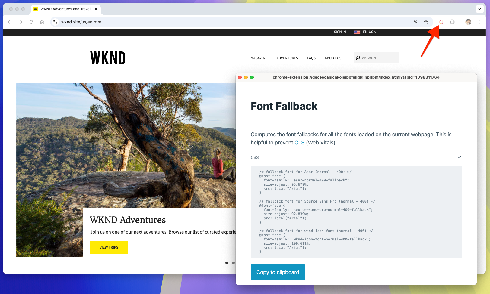

# Hinzufügen von Website-Branding

Richten Sie zunächst das gesamte Branding ein, indem Sie globale Stile aktualisieren, CSS-Variablen definieren und Web-Schriften hinzufügen. Diese grundlegenden Elemente stellen sicher, dass die Website einheitlich und wartbar bleibt. Sie sollten auf der gesamten Website konsistent angewendet werden.

## Erstellen eines GitHub-Problems

Verwenden Sie GitHub, um alles zu organisieren und Arbeiten nachzuverfolgen. Erstellen Sie zunächst ein GitHub-Problem für diesen Arbeitsbereich:

1. Navigieren Sie zum GitHub-Repository (weitere Informationen im Kapitel [Erstellen eines Code-Projekts](./1-new-code-project.md)).
2. Klicken Sie auf die Registerkarte **Issues** (Probleme) und dann auf **New issue** (Neues Problem).
3. Geben Sie einen **Titel** und eine **Beschreibung** für die zu erledigende Aufgabe ein.
4. Klicken Sie **Submit new issue** (Neues Problem senden).

Das GitHub-Problem wird später beim [Erstellen einer Pull-Anfrage](#merge-code-changes) verwendet.


## Erstellen einer Arbeitsverzweigung

Um die Organisation beizubehalten und die Code-Qualität sicherzustellen, erstellen Sie eine neue Verzweigung für jeden Arbeitsbereich. Dadurch wird zum einen verhindert, dass neuer Code die Leistung beeinträchtigt, und zum anderen sichergestellt, dass Änderungen erst live geschaltet werden, wenn sie abgeschlossen sind.

Erstellen Sie für dieses Kapitel, das sich auf die grundlegenden Stile der Website konzentriert, eine Verzweigung mit dem Namen `wknd-styles`.

```bash
# ~/Code/aem-wknd-eds-ue

$ git checkout -b wknd-styles
```

## Globales CSS

Edge Delivery Services verwendet eine globale CSS-Datei unter `styles/styles.css`, um die allgemeinen Stile für die gesamte Website einzurichten. Die Datei `styles.css` steuert Aspekte wie Farben, Schriften und Abstände und stellt sicher, dass alles auf der Site konsistent aussieht.

Globale CSS sollte unabhängig von Konstrukten auf niedrigerer Ebene, z. B. Blöcken, sein und auf das Look-and-Feel der Site sowie gemeinsame visuelle Abwandlungen ausgerichtet sein.

Beachten Sie, dass globale CSS-Stile bei Bedarf überschrieben werden können.

### CSS-Variablen

[CSS-Variablen](https://developer.mozilla.org/de-de/docs/Web/CSS/Using_CSS_custom_properties) eignen sich hervorragend, um Design-Einstellungen wie Farben, Schriften und Größen zu speichern. Durch Verwendung von Variablen können Sie diese Elemente zentral ändern und für die gesamte Site aktualisieren.

Gehen Sie wie folgt vor, um mit der Anpassung der CSS-Variablen zu beginnen:

1. Öffnen Sie die Datei `styles/styles.css` in einem Code-Editor.
2. Suchen Sie die `:root`-Deklaration, in der globale CSS-Variablen gespeichert werden.
3. Ändern Sie die Farb- und Schriftvariablen, um sie an die WKND-Marke anzupassen.

Dies ist ein Beispiel:


```css
/* styles/styles.css */

:root {
  /* colors */
  --primary-color: rgb(255, 234, 3); /* WKND primary color */
  --secondary-color: rgb(32, 32, 32); /* Secondary brand color */
  --background-color: white; /* Background color */
  --light-color: rgb(235, 235, 235); /* Light background color */
  --dark-color: var(--secondary-color); /* Dark text color */
  --text-color: var(--secondary-color); /* Default text color */
  --link-color: var(--text-color); /* Link color */
  --link-hover-color: black; /* Link hover color */

  /* fonts */
  --heading-font: 'Roboto', sans-serif; /* Heading font */
  --body-font: 'Open Sans', sans-serif; /* Body font */
  --base-font-size: 16px; /* Base font size */
}
```

Erkunden Sie die anderen Variablen im Abschnitt `:root` und überprüfen Sie die Standardeinstellungen.

Wenn Sie eine Website entwickeln und dieselben CSS-Werte wiederholt verwenden, sollten Sie ggf. neue Variablen erstellen, um die Stilverwaltung zu vereinfachen. Beispiele für andere CSS-Eigenschaften, die von CSS-Variablen profitieren können, sind: `border-radius`, `padding`, `margin` und `box-shadow`.

### Einfache Elemente

Einfache Elemente werden direkt über ihren Elementnamen formatiert und nicht über eine CSS-Klasse. Statt beispielsweise die CSS-Klasse `.page-heading` zu formatieren, werden Stile mithilfe von `h1 { ... }` auf das `h1`-Element angewendet.

In der Datei `styles/styles.css` wird eine Reihe von Basisstilen auf einfache HTML-Elemente angewendet. Edge Delivery Services-Websites priorisieren die Verwendung einfacher Elemente, da sie dem nativ semantischen HTML von Edge Delivery Service entsprechen.

Formatieren wir nun einige einfache Elemente in `styles.css`, um mit dem WKND-Branding übereinzustimmen:

```css
/* styles/styles.css */

...
h2 {
  font-size: var(--heading-font-size-xl); /* Set font size for h2 */
}

/* Add a partial yellow underline under H2 */
h2::after {
  border-bottom: 2px solid var(--primary-color); /* Yellow underline */
  content: "";
  display: block;
  padding-top: 8px;
  width: 84px;
}
...
```

Diese Stile stellen sicher, dass `h2`-Elemente, sofern sie nicht überschrieben werden, entsprechend dem WKND-Branding formatiert sind, wodurch eine klare visuelle Hierarchie entsteht. Die teilweise gelbe Unterstreichung unter jedem `h2`-Element bewirkt eine deutliche Hervorhebung der Überschriften.

### Abgeleitete Elemente

In Edge Delivery Services verbessern die Dateien `scripts.js` und `aem.js` des Projekts automatisch bestimmte einfache HTML-Elemente basierend auf ihrem Kontext innerhalb der HTML.

Zum Beispiel wird für Anker-Elemente (`<a>`), die in ihrer eigenen Zeile definiert wurden (anstatt inline mit dem umgebenden Text), auf Grundlage dieses Kontexts abgeleitet, dass es sich um Schaltflächen handelt. Diese Anker werden automatisch mit einem Container `div` mit der CSS-Klasse `button-container` umschlossen, und dem Ankerelement wird die CSS-Klasse `button` hinzugefügt.

Wenn beispielsweise ein Link in einer eigenen Zeile erstellt wird, aktualisiert das JavaScript von Edge Delivery Services sein DOM wie folgt:

```html
<p class="button-container">
  <a href="/authored/link" title="Click me" class="button">Click me</a>
</p>
```

Diese Schaltflächen können an die WKND-Marke angepasst werden. Bei ihr sollen Schaltflächen als gelbe Rechtecke mit schwarzem Text angezeigt werden.

Im Folgenden finden Sie ein Beispiel für die Formatierung der „abgeleiteten Schaltflächen“ in `styles.css`:

```css
/* styles/styles.css */

/* Buttons */
a.button:any-link,
button {
  box-sizing: border-box;
  display: inline-block;
  max-width: 100%;
  margin: 12px 0;
  border: 2px solid transparent;
  padding: 0.5em 1.2em;
  font-family: var(--body-font-family);
  font-style: normal;
  font-weight: 500;
  line-height: 1.25;
  text-align: center;
  text-decoration: none;
  cursor: pointer;
  overflow: hidden;
  text-overflow: ellipsis;
  white-space: nowrap;

  /* WKND specific treatments */
  text-transform: uppercase;
  background-color: var(--primary-color);
  color: var(--dark-color);
  border-radius: 0;
}
```

Dieses CSS definiert die grundlegenden Schaltflächenstile und enthält WKND-spezifische Behandlungen wie Text in Großbuchstaben, gelben Hintergrund und schwarzen Text. Die Eigenschaften `background-color` und `color` verwenden CSS-Variablen, damit der Schaltflächenstil an den Farben der Marke ausgerichtet bleibt. Dieser Ansatz stellt sicher, dass Schaltflächen auf der gesamten Site konsistent formatiert werden und gleichzeitig flexibel bleiben.

## Web-Schriften

Edge Delivery Services-Projekte optimieren die Verwendung von Web-Schriften, um eine hohe Leistung sicherzustellen und die Auswirkungen auf Lighthouse-Bewertungen zu minimieren. Diese Methode ermöglicht schnelles Rendern, ohne die visuelle Identität der Site zu beeinträchtigen. Nachstehend erfahren Sie, wie Sie Web-Schriften effizient implementieren, um eine optimale Leistung zu erzielen.

### Schriftarten

Fügen Sie benutzerdefinierte Web-Schriften mithilfe von CSS-Deklarationen mit `@font-face` in der Datei `styles/fonts.css` hinzu. Durch Hinzufügen der `@font-faces` zu `fonts.css` wird sichergestellt, dass Web-Schriften zum optimalen Zeitpunkt geladen werden, wodurch Lighthouse-Bewertungen beibehalten werden können.

1. Öffnen Sie `styles/fonts.css`.
2. Fügen Sie die folgenden Deklarationen von `@font-face` hinzu, um die WKND-Markenschriftarten einzuschließen: `Asar` und `Source Sans Pro`.

```css
/* styles/fonts.css */

@font-face {
  font-family: Asar;
  font-style: normal;
  font-weight: 400;
  font-display: swap;
  src: url("https://fonts.gstatic.com/s/asar/v22/sZlLdRyI6TBIbkEaDZtQS6A.woff2") format('woff2');
  unicode-range: U+0000-00FF, U+0131, U+0152-0153, U+02BB-02BC, U+02C6, U+02DA, U+02DC, U+0304, U+0308, U+0329, U+2000-206F, U+20AC, U+2122, U+2191, U+2193, U+2212, U+2215, U+FEFF, U+FFFD;
}

@font-face {
  font-family: 'Source Sans Pro';
  font-style: italic;
  font-weight: 300;
  font-display: swap;
  src: url("https://fonts.gstatic.com/s/sourcesanspro/v22/6xKwdSBYKcSV-LCoeQqfX1RYOo3qPZZMkids18S0xR41.woff2") format('woff2');
  unicode-range: U+0000-00FF, U+0131, U+0152-0153, U+02BB-02BC, U+02C6, U+02DA, U+02DC, U+0304, U+0308, U+0329, U+2000-206F, U+20AC, U+2122, U+2191, U+2193, U+2212, U+2215, U+FEFF, U+FFFD;
}

@font-face {
  font-family: 'Source Sans Pro';
  font-style: italic;
  font-weight: 400;
  font-display: swap;
  src: url("https://fonts.gstatic.com/s/sourcesanspro/v22/6xK1dSBYKcSV-LCoeQqfX1RYOo3qPZ7nsDJB9cme.woff2") format('woff2');
  unicode-range: U+0000-00FF, U+0131, U+0152-0153, U+02BB-02BC, U+02C6, U+02DA, U+02DC, U+0304, U+0308, U+0329, U+2000-206F, U+20AC, U+2122, U+2191, U+2193, U+2212, U+2215, U+FEFF, U+FFFD;
}

@font-face {
  font-family: 'Source Sans Pro';
  font-style: italic;
  font-weight: 600;
  font-display: swap;
  src: url("https://fonts.gstatic.com/s/sourcesanspro/v22/6xKwdSBYKcSV-LCoeQqfX1RYOo3qPZY4lCds18S0xR41.woff2") format('woff2');
  unicode-range: U+0000-00FF, U+0131, U+0152-0153, U+02BB-02BC, U+02C6, U+02DA, U+02DC, U+0304, U+0308, U+0329, U+2000-206F, U+20AC, U+2122, U+2191, U+2193, U+2212, U+2215, U+FEFF, U+FFFD;
}

@font-face {
  font-family: 'Source Sans Pro';
  font-style: normal;
  font-weight: 300;
  font-display: swap;
  src: url("https://fonts.gstatic.com/s/sourcesanspro/v22/6xKydSBYKcSV-LCoeQqfX1RYOo3ik4zwlxdu3cOWxw.woff2") format('woff2');
  unicode-range: U+0000-00FF, U+0131, U+0152-0153, U+02BB-02BC, U+02C6, U+02DA, U+02DC, U+0304, U+0308, U+0329, U+2000-206F, U+20AC, U+2122, U+2191, U+2193, U+2212, U+2215, U+FEFF, U+FFFD;
}

@font-face {
  font-family: 'Source Sans Pro';
  font-style: normal;
  font-weight: 400;
  font-display: swap;
  src: url("https://fonts.gstatic.com/s/sourcesanspro/v22/6xK3dSBYKcSV-LCoeQqfX1RYOo3qOK7lujVj9w.woff2") format('woff2');
  unicode-range: U+0000-00FF, U+0131, U+0152-0153, U+02BB-02BC, U+02C6, U+02DA, U+02DC, U+0304, U+0308, U+0329, U+2000-206F, U+20AC, U+2122, U+2191, U+2193, U+2212, U+2215, U+FEFF, U+FFFD;
}

@font-face {
  font-family: 'Source Sans Pro';
  font-style: normal;
  font-weight: 600;
  font-display: swap;
  src: url("https://fonts.gstatic.com/s/sourcesanspro/v22/6xKydSBYKcSV-LCoeQqfX1RYOo3i54rwlxdu3cOWxw.woff2") format('woff2');
  unicode-range: U+0000-00FF, U+0131, U+0152-0153, U+02BB-02BC, U+02C6, U+02DA, U+02DC, U+0304, U+0308, U+0329, U+2000-206F, U+20AC, U+2122, U+2191, U+2193, U+2212, U+2215, U+FEFF, U+FFFD;
}
```

Die in diesem Tutorial verwendeten Schriftarten werden von Google Fonts bezogen, Web-Schriften können jedoch von jedem Schriftartenanbieter bezogen werden, einschließlich [Adobe Fonts](https://fonts.adobe.com/).

+++Verwenden lokaler Web-Schriftdateien

Alternativ können Web-Schriftdateien in das Projekt im Ordner `/fonts` kopiert und in den `@font-face`-Deklarationen referenziert werden.

In diesem Tutorial werden die gehosteten Remote-Web-Schriften verwendet, damit Sie dem Tutorial leichter folgen können.

```css
/* styles/fonts.css */

@font-face { 
    font-family: Asar;
    ...
    src: url("/fonts/asar.woff2") format('woff2'),
    ...
}
```

+++

Aktualisieren Sie abschließend die CSS-Variablen in `styles/styles.css` so, dass sie die neuen Schriftarten verwenden:

```css
/* styles/styles.css */

:root {
    ...
    /* fonts */
    --body-font-family: 'Source Sans Pro', roboto-fallback, sans-serif;
    --heading-font-family: 'Asar', roboto-condensed-fallback, sans-serif;
    ...
}
```

`roboto-fallback` und `roboto-condensed-fallback` sind Fallback-Schriftarten, die im Abschnitt [Fallback-Schriftarten](#fallback-fonts) aktualisiert werden, um sie zur Unterstützung der benutzerdefinierten Web-Schriften `Asar` und `Source Sans Pro` auszurichten.

### Ersatzschriften

Web-Schriften beeinträchtigen aufgrund ihrer Größe oft die Leistung, erhöhen möglicherweise die Werte für die kumulative Layout-Verschiebung (Cumulative Layout Shift, CLS) und verringern die Lighthouse-Gesamtbewertung. Um die sofortige Textanzeige beim Laden von Web-Schriften sicherzustellen, verwenden Edge Delivery Services-Projekte Browser-native Schriftarten als Fallback. Dieser Ansatz hilft, ein reibungsloses Benutzererlebnis aufrechtzuerhalten, während die gewünschte Schriftart angewendet wird.

Um die beste Fallback-Schriftart auszuwählen, verwenden Sie die [Chrome-Erweiterung „Helix Font Fallback“](https://www.aem.live/developer/font-fallback) von Adobe, die eine stark übereinstimmende Schriftart für Browser festlegt, bevor die benutzerdefinierte Schriftart geladen wird. Die resultierenden Deklarationen der Fallback-Schriften sollten der Datei `styles/styles.css` hinzugefügt werden, um die Leistung zu verbessern und ein nahtloses Benutzererlebnis sicherzustellen.

{align=center}

Um die [Chrome-Erweiterung „Helix Font Fallback“](https://www.aem.live/developer/font-fallback) zu verwenden, stellen Sie sicher, dass Web-Schriften auf die Web-Seite in den gleichen Varianten angewendet werden wie auf der Edge Delivery Services-Website. Dieses Tutorial zeigt die Erweiterung für [wknd.site](http://wknd.site/us/en.html). Wenden Sie beim Entwickeln einer Website die Erweiterung auf die Site an, an der gearbeitet wird, und nicht auf [wknd.site](http://wknd.site/us/en.html).

```css
/* styles/styles.css */
...

/* fallback fonts */

/* Fallback font for Asar (normal - 400) */
@font-face {
    font-family: "asar-normal-400-fallback";
    size-adjust: 95.7%;
    src: local("Arial");
}

/* Fallback font for Source Sans Pro (normal - 400) */
@font-face {
    font-family: "source-sans-pro-normal-400-fallback";
    size-adjust: 92.9%;
    src: local("Arial");
}

...
```

Fügen Sie die Namen der Fallback-Schriftfamilien den CSS-Variablen für Schriftarten in `styles/styles.css` hinter den „echten“ Schriftfamiliennamen hinzu.

```css
/* styles/styles.css */

:root {
    ...
    /* fonts */
    --body-font-family: 'Source Sans Pro', source-sans-pro-normal-400-fallback, sans-serif;
    --heading-font-family: 'Asar', asar-normal-400-fallback, sans-serif;
    ...
}
```

## Entwicklungsvorschau

Beim Hinzufügen von CSS lädt die lokale Entwicklungsumgebung der AEM-CLI die Änderungen automatisch neu, sodass schnell und einfach zu sehen ist, wie sich das CSS auf den Block auswirkt.


## Herunterladen der endgültigen CSS-Dateien

Sie können die aktualisierten CSS-Dateien über die folgenden Links herunterladen:

* [`styles.css`](https://raw.githubusercontent.com/davidjgonzalez/aem-wknd-eds-ue/refs/heads/main/styles/styles.css)
* [`fonts.css`](https://raw.githubusercontent.com/davidjgonzalez/aem-wknd-eds-ue/refs/heads/main/styles/fonts.css)

## Linten der CSS-Datei

Achten Sie auf [regelmäßiges Linten](./3-local-development-environment.md#linting) Ihrer Code-Änderungen, um Sauberkeit und Konsistenz sicherzustellen. Regelmäßiges Linten hilft, Probleme frühzeitig zu erkennen, und reduziert die allgemeine Entwicklungszeit. Denken Sie daran, dass Sie Ihre Arbeit erst dann mit der Hauptverzweigung zusammenführen können, wenn alle Linging-Probleme behoben sind.

```bash
$ npm run lint:css
```

## Zusammenführen von Code-Änderungen

Führen Sie die Änderungen in der Verzweigung `main` auf GitHub zusammen, damit zukünftige Arbeiten auf diesen Aktualisierungen aufbauen.

```bash
$ git add .
$ git commit -m "Add global CSS, CSS variables, and web fonts"
$ git push origin wknd-styles
```

Sobald die Änderungen an die Verzweigung `wknd-styles` übertragen wurden, erstellen Sie eine Pull-Anfrage auf GitHub, um sie mit der Verzweigung `main` zusammenzuführen.

1. Navigieren Sie zum GitHub-Repository aus dem Kapitel [Erstellen eines neuen Projekts](./1-new-code-project.md).
2. Klicken Sie auf die Registerkarte **Pull requests** (Pull-Anfragen) und wählen Sie **New pull request** (Neue Pull-Anfrage) aus.
3. Legen Sie `wknd-styles` als Quellverzweigung und `main` als Zielverzweigung fest.
4. Überprüfen Sie die Änderungen und klicken Sie auf **Pull-Anfrage erstellen**.
5. Fügen Sie in den Details zur Pull-Anfrage **Folgendes hinzu**:

   ```
   Add basic global CSS, CSS variables, and web fonts (including fallback fonts) to support the WKND brand.
   
   Fix #1
   
   Test URLs:
   - Before: https://main--wknd-aem-eds-ue--davidjgonzalez.aem.live/
   - After: https://wknd-styles--wknd-aem-eds-ue--davidjgonzalez.aem.live/
   ```

   * `Fix #1` verweist auf das zuvor erstellte GitHub-Problem.
   * Die Test-URLs teilen AEM Code Sync mit, welche Verzweigungen für die Validierung und den Vergleich verwendet werden sollen. Die „Nachher“-URL verwendet die Arbeitsverzweigung `wknd-styles`, um zu überprüfen, wie sich die Code-Änderungen auf die Leistung der Website auswirken.

6. Klicken Sie auf **Create pull request** (Pull-Anfrage erstellen).
7. Warten Sie, bis die GitHub-Anwendung [AEM Code Sync](./1-new-code-project.md) die **Qualitätsprüfungen abgeschlossen hat**. Falls diese fehlschlagen, beheben Sie die Fehler und führen Sie die Prüfungen erneut aus.
8. Sobald die Prüfungen bestanden sind, **führen Sie die Pull-Anfrage in `main` zusammen**.

Nachdem die Änderungen in `main` zusammengeführt wurden, werden sie jetzt als in der Produktion bereitgestellt betrachtet, und die neue Entwicklung kann auf Grundlage dieser Aktualisierungen fortgesetzt werden.
