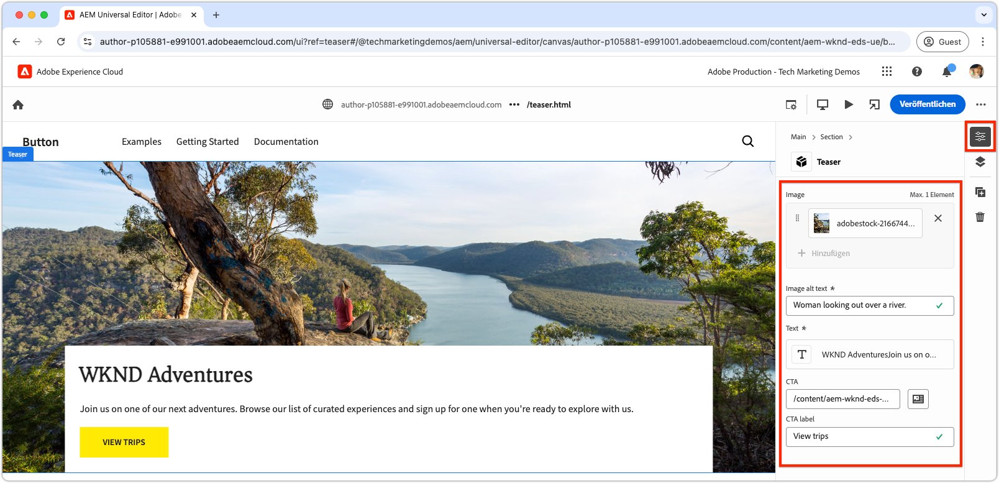
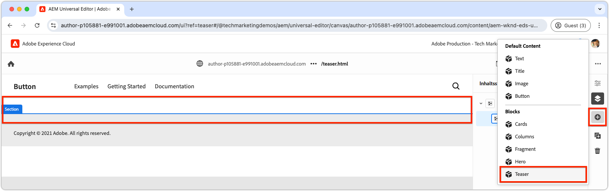

# Erstellen eines neuen Blocks

In diesem Kapitel wird der Prozess zum Erstellen eines neuen, bearbeitbaren Teaser-Blocks für eine Edge Delivery Services-Website mit dem universellen Editor beschrieben.


Der Block mit dem Namen `teaser` zeigt die folgenden Elemente:

- **Bild**: Ein visuell ansprechendes Bild.
- **Textinhalt**:
   - **Titel**: Eine überzeugende Überschrift, um Aufmerksamkeit zu erregen.
   - **Textkörper**: Beschreibender Inhalt mit Kontext oder Details, einschließlich optionaler Nutzungsbedingungen.
   - **Aktionsaufruf (Call-to-action, CTA)-Schaltfläche**: Ein Link, der Benutzende zu einer Interaktion auffordert und sie zu weiteren Interaktion anleitet.

Der Inhalt des `teaser`-Blocks kann im universellen Editor bearbeitet werden, wodurch die Benutzerfreundlichkeit und Wiederverwendbarkeit auf der gesamten Website gewährleistet ist.

Beachten Sie, dass der `teaser`-Block dem `hero`-Block des Textbausteins ähnelt; daher soll der `teaser`-Block nur als einfaches Beispiel zur Veranschaulichung von Entwicklungskonzepten dienen.

## Erstellen einer neuen Git-Verzweigung

Um einen sauberen und organisierten Workflow beizubehalten, erstellen Sie für jede spezifische Entwicklungsaufgabe eine neue Verzweigung. Dadurch werden Probleme mit einer Bereitstellung von unvollständigem oder ungetestetem Code in der Produktion vermieden.

1. **Von der Hauptverzweigung aus starten**: Die Arbeit mit dem aktuellsten Produktions-Code gewährleistet eine solide Grundlage.
2. **Remote-Änderungen abrufen**: Durch das Abrufen der neuesten Aktualisierungen von GitHub wird sichergestellt, dass der aktuelle Code verfügbar ist, bevor mit der Entwicklung begonnen wird.
   - Beispiel: Rufen Sie nach dem Zusammenführen von Änderungen aus der Verzweigung `wknd-styles` in `main` die neuesten Aktualisierungen ab.
3. **Erstellen einer neuen Verzweigung**.

```bash
# ~/Code/aem-wknd-eds-ue

$ git fetch origin  
$ git checkout -b teaser origin/main  
```

Sobald die `teaser`-Verzweigung erstellt ist, können Sie mit der Entwicklung des Teaser-Blocks beginnen.

## Block-Ordner

Erstellen Sie einen neuen Ordner mit dem Namen `teaser` im `blocks`-Verzeichnis des Projekts. Dieser Ordner enthält die JSON-, CSS- und JavaScript-Dateien des Blocks, wobei die Dateien des Blocks an einem selben Speicherort organisiert werden:

```
# ~/Code/aem-wknd-eds-ue

/blocks/teaser
```

Der Name des Blockordners fungiert als ID des Blocks und wird verwendet, um während der Entwicklung des Blocks auf diesen zu verweisen.

## Block-JSON

Die Block-JSON definiert drei wichtige Aspekte des Blocks:

- **Definition**: Registriert den Block als bearbeitbare Komponente im universellen Editor und verknüpft ihn mit einem Blockmodell und optional einem Filter.
- **Modell**: Gibt die Authoring-Felder des Blocks an und legt fest, wie diese Felder als semantische Edge Delivery Services-HTML gerendert werden.
- **Filter**: Konfiguriert Filterregeln, um zu beschränken, zu welchen Containern der Block über den universellen Editor hinzugefügt werden kann. Die meisten Blöcke sind keine Container, sondern ihre IDs werden zu den Filtern anderer Container-Blöcke hinzugefügt.

Erstellen Sie eine neue Datei `/blocks/teaser/_teaser.json` mit der folgenden anfänglichen Struktur in der exakten Reihenfolge. Wenn die Schlüssel nicht in der richtigen Reihenfolge vorliegen, werden sie möglicherweise nicht ordnungsgemäß erstellt.

[!BADGE /blocks/teaser/_teaser.json]{type=Neutral tooltip="Dateiname des unten stehenden Code-Beispiels."}

```json
{
    "definitions": [],
    "models": [],
    "filters": []
}
```

### Blockmodell

Das Blockmodell ist ein wichtiger Teil der Konfiguration des Blocks, da es Folgendes definiert:

1. Das Authoring-Erlebnis durch Definieren der Felder, die zur Bearbeitung verfügbar sind.

   

2. Wie die Feldwerte in Edge Delivery Services-HTML gerendert werden.

Modellen wird eine `id` zugewiesen, die der [Definition des Blocks](#block-definition) entspricht, und sie enthalten ein `fields`-Array zur Angabe der bearbeitbaren Felder.

Jedes Feld in diesem `fields`-Array verfügt über ein JSON-Objekt, das die folgenden erforderlichen Eigenschaften enthält:

| JSON-Eigenschaft | Beschreibung |
|---------------|-----------------------------------------------------------------------------------------------------------------------|
| `component` | Der [Feldtyp](https://experienceleague.adobe.com/de/docs/experience-manager-cloud-service/content/implementing/developing/universal-editor/field-types#component-types), wie etwa `text`, `reference` oder `aem-content`. |
| `name` | Der Name des Felds, das der JCR-Eigenschaft zugeordnet ist, in der der Wert in AEM gespeichert ist. |
| `label` | Die Beschriftung, die den Autorinnen und Autoren im universellen Editor angezeigt wird. |

Eine umfassende Liste der Eigenschaften, einschließlich der optionalen Eigenschaften, finden Sie in der [Dokumentation zu den Feldern des universellen Editors](https://experienceleague.adobe.com/de/docs/experience-manager-cloud-service/content/implementing/developing/universal-editor/field-types#fields).

#### Design des Blocks


Der Teaser-Block enthält die folgenden bearbeitbaren Elemente:

1. **Bild**: Stellt den visuellen Inhalt des Teasers dar.
2. **Textinhalt**: Enthält den Titel, den Textkörper und die Aktionsaufruf-Schaltfläche und befindet sich in einem weißen Rechteck.
   - **Titel** und **Textkörper** können mit demselben Rich-Text-Editor erstellt werden.
   - Der **CTA** kann über ein `text`-Feld für das **Label** und ein `aem-content`-Feld für den **Link** erstellt werden.

Das Design des Teaser-Blocks ist in diese beiden logischen Komponenten (Bild- und Textinhalt) unterteilt, sodass Benutzende ein strukturiertes und intuitives Authoring-Erlebnis erhalten.

### Felder des Blocks

Definieren Sie die für den Block erforderlichen Felder: Bild, Alternativtext für Bilder, Text, CTA-Label und CTA-Link.

>[!BEGINTABS]

>[!TAB Die richtige Methode]

**Diese Registerkarte veranschaulicht die richtige Methode zum Modellieren des Teaser-Blocks.**

Der Teaser besteht aus zwei logischen Bereichen: Bild und Text. Um den Code zu vereinfachen, der zum Anzeigen der Edge Delivery Services-HTML als gewünschtes Web-Erlebnis erforderlich ist, sollte das Blockmodell diese Struktur widerspiegeln.

- Gruppieren Sie **Bild** und **Alternativtext für Bilder** mithilfe der [Ausblendung von Feldern](https://experienceleague.adobe.com/de/docs/experience-manager-cloud-service/content/edge-delivery/wysiwyg-authoring/content-modeling#field-collapse).
- Gruppieren Sie die Textinhaltsfelder mithilfe von [Elementgruppierung](https://experienceleague.adobe.com/de/docs/experience-manager-cloud-service/content/edge-delivery/wysiwyg-authoring/content-modeling#element-grouping) und [Ausblendung von Feldern für den CTA](https://experienceleague.adobe.com/de/docs/experience-manager-cloud-service/content/edge-delivery/wysiwyg-authoring/content-modeling#field-collapse).

Wenn Sie nicht mit der [Ausblendung von Feldern](https://experienceleague.adobe.com/de/docs/experience-manager-cloud-service/content/edge-delivery/wysiwyg-authoring/content-modeling#field-collapse), [Elementgruppierung](https://experienceleague.adobe.com/de/docs/experience-manager-cloud-service/content/edge-delivery/wysiwyg-authoring/content-modeling#element-grouping) oder [Ableitung des Typs](https://experienceleague.adobe.com/de/docs/experience-manager-cloud-service/content/edge-delivery/wysiwyg-authoring/content-modeling#type-inference) vertraut sind, lesen Sie die verknüpfte Dokumentation, bevor Sie fortfahren, da diese für die Erstellung eines gut strukturierten Blockmodells unerlässlich sind.

Im Beispiel unten:

- [Ableitung des Typs](https://experienceleague.adobe.com/de/docs/experience-manager-cloud-service/content/edge-delivery/wysiwyg-authoring/content-modeling#type-inference) wird verwendet, um automatisch ein ``-HTML-Element aus dem `image`-Feld zu erstellen. Die Ausblendung von Feldern wird mit den Feldern `image` und `imageAlt` verwendet, um ein ``-HTML-Element zu erstellen. Das `src`-Attribut wird auf den Wert des `image`-Felds festgelegt, während das `alt`-Attribut auf den Wert des `imageAlt`-Felds festgelegt wird.
- `textContent` ist ein Gruppenname, mit dem Felder kategorisiert werden. Er sollte semantisch sein, kann aber alles sein, solange er für diesen Block einzigartig ist. Dadurch wird der universelle Editor angewiesen, in der endgültigen HTML-Ausgabe alle Felder mit diesem Präfix im selben `<div>`-Element zu rendern.
- Das Reduzieren von Feldern wird auch innerhalb der `textContent`-Gruppe für den Aktionsaufruf (Call-to-action, CTA) angewendet. Der CTA wird als `<a>` über eine [Ableitung des Typs](https://experienceleague.adobe.com/de/docs/experience-manager-cloud-service/content/edge-delivery/wysiwyg-authoring/content-modeling#type-inference) erstellt. Das `cta`-Feld wird verwendet, um das `href`-Attribut des `<a>`-Elements festzulegen, und das `ctaText`-Feld liefert den Textinhalt für den Link innerhalb der `<a ...>`-Tags.

[!BADGE /blocks/teaser/_teaser.json]{type=Neutral tooltip="Dateiname des unten stehenden Code-Beispiels."}

```json
{
    "definitions": [],
    "models": [
        {
            "id": "teaser", 
            "fields": [
                {
                    "component": "reference",
                    "valueType": "string",
                    "name": "image",
                    "label": "Image",
                    "multi": false
                },
                {
                    "component": "text",
                    "valueType": "string",
                    "name": "imageAlt",
                    "label": "Image alt text",
                    "required": true
                },
                {
                    "component": "richtext",
                    "name": "textContent_text",
                    "label": "Text",
                    "valueType": "string",
                    "required": true
                },
                {
                    "component": "aem-content",
                    "name": "textContent_cta",
                    "label": "CTA",
                    "valueType": "string"
                },
                {
                    "component": "text",
                    "name": "textContent_ctaText",
                    "label": "CTA label",
                    "valueType": "string"
                }
            ]
        }
    ],
    "filters": []
}
```

Dieses Modell definiert die Autoreneingaben im universellen Editor für den Block.

Die resultierende Edge Delivery Services-HTML für diesen Block legt das Bild in den ersten Div und die `textContent`-Felder der Elementgruppe in den zweiten Div.

```html
<div>
    <div>
        <!-- This div contains the field-collapsed image fields  -->
        <picture>
            ...
            <source .../>            
            
        </picture>
    </div>
    <div>
        <!-- This div, via element grouping contains the textContent fields -->
        <h2>The authored title</h2>
        <p>The authored body text</p>
        <a href="/authored/cta/link">The authored CTA label</a>
    </div>
</div>        
```

Wie [im nächsten Kapitel gezeigt](./7a-block-css.md), vereinfacht diese HTML-Struktur das Formatieren des Bausteins als zusammenhängende Einheit.

Informationen zu den Folgen, die sich ergeben, wenn Sie die Ausblendung von Feldern und die Elementgruppierung nicht verwenden, finden Sie oben auf der Registerkarte **Die falsche Methode**.

>[!TAB Die falsche Methode]

**Diese Registerkarte veranschaulicht eine suboptimale Methode zum Modellieren des Teaser-Blocks und ist nur eine Gegenüberstellung zur richtigen Methode.**

Das Definieren jedes Felds als eigenständiges Feld im Blockmodell ohne Verwendung des [Ausblendens von Feldern](https://experienceleague.adobe.com/de/docs/experience-manager-cloud-service/content/edge-delivery/wysiwyg-authoring/content-modeling#field-collapse) und des [Gruppierens von Elementen](https://experienceleague.adobe.com/de/docs/experience-manager-cloud-service/content/edge-delivery/wysiwyg-authoring/content-modeling#element-grouping) mag verlockend erscheinen. Diese Übersicht erschwert jedoch die Formatierung des Blocks als zusammenhängende Einheit.

Das Teaser-Modell könnte beispielsweise wie folgt **ohne** die Ausblendung von Feldern oder Elementgruppierung definiert werden:

[!BADGE /blocks/teaser/_teaser.json]{type=Neutral tooltip="Dateiname des unten stehenden Code-Beispiels."}

```json
{
    "definitions": [],
    "models": [
        {
            "id": "teaser", 
            "fields": [
                {
                    "component": "reference",
                    "valueType": "string",
                    "name": "image",
                    "label": "Image",
                    "multi": false
                },
                {
                    "component": "text",
                    "valueType": "string",
                    "name": "alt",
                    "label": "Image alt text",
                    "required": true
                },
                {
                    "component": "richtext",
                    "name": "text",
                    "label": "Text",
                    "valueType": "string",
                    "required": true
                },
                {
                    "component": "aem-content",
                    "name": "link",
                    "label": "CTA",
                    "valueType": "string"
                },
                {
                    "component": "text",
                    "name": "label",
                    "label": "CTA label",
                    "valueType": "string"
                }
            ]
        }
    ],
    "filters": []
}
```

Die Edge Delivery Services-HTML für den Block rendert den Wert jedes Felds in einem separaten `div`, wodurch das Inhaltsverständnis, die Anwendung von Stilen und die Anpassungen der HTML-Struktur zum Erzielen des gewünschten Designs erschwert werden.

```html
<div>
    <div>
        <!-- This div contains the field-collapsed image  -->
        <picture>
            ...
            <source .../>            
            
        </picture>
    </div>
    <div>
        <p>The authored alt text</p>
    </div>
    <div>
        <h2>The authored title</h2>
        <p>The authored body text</p>
    </div>
    <div>
        <a href="/authored/cta/link">/authored/cta/link</a>
    </div>
    <div>
        The authored CTA label
    </div>
</div>        
```

Jedes Feld ist in seinem eigenen `div` isoliert, sodass es schwierig ist, Bild- und Textinhalte als zusammenhängende Einheiten zu formatieren. Das gewünschte Design kann zwar mit Mühe und Kreativität erzielt werden, aber die Verwendung der [Elementgruppierung](https://experienceleague.adobe.com/de/docs/experience-manager-cloud-service/content/edge-delivery/wysiwyg-authoring/content-modeling#element-grouping) zum Gruppieren von Textinhaltsfeldern und der [Ausblendung von Feldern](https://experienceleague.adobe.com/de/docs/experience-manager-cloud-service/content/edge-delivery/wysiwyg-authoring/content-modeling#field-collapse) zum Hinzufügen von erstellten Werten als Elementattribute ist einfacher und semantisch korrekt.

Informationen zur besseren Modellierung des Teaser-Blocks finden Sie oben auf der Registerkarte **Die richtige Methode**.

>[!ENDTABS]


### Blockdefinition

Die Blockdefinition registriert den Block im universellen Editor. Im Folgenden finden Sie eine Aufschlüsselung der in der Blockdefinition verwendeten JSON-Eigenschaften:

| JSON-Eigenschaft | Beschreibung |
|---------------|-------------|
| `definition.title` | Der Titel des Blocks, wie er in den **Hinzufügen**-Blöcken des universellen Editors angezeigt wird. |
| `definition.id` | Eine eindeutige ID für den Block, mit der dessen Verwendung in `filters` gesteuert wird. |
| `definition.plugins.xwalk.page.resourceType` | Definiert den Sling-Ressourcentyp für das Rendern der Komponente im universellen Editor. Verwenden Sie immer den Ressourcentyp `core/franklin/components/block/v#/block`. |
| `definition.plugins.xwalk.page.template.name` | Der Name des ersten Blocks. Er sollte in Kleinbuchstaben geschrieben und mit Bindestrichen versehen werden, um dem Ordnernamen des Blocks zu entsprechen. Dieser Wert wird auch zur Kennzeichnung der Instanz des Blocks im universellen Editor verwendet. |
| `definition.plugins.xwalk.page.template.model` | Verknüpft diese Definition mit ihrer `model`-Definition, die die Erstellungsfelder steuert, die im universellen Editor für den Block angezeigt werden. Der Wert hier muss mit einem `model.id`-Wert übereinstimmen. |
| `definition.plugins.xwalk.page.template.classes` | Optionale Eigenschaft, deren Wert zum `class`-Attribut des HTML-Elements des Blocks hinzugefügt wird. Dies ermöglicht Varianten desselben Blocks. Der `classes`-Wert kann durch [Hinzufügen eines Klassenfeldes](https://experienceleague.adobe.com/de/docs/experience-manager-cloud-service/content/edge-delivery/wysiwyg-authoring/create-block#block-options) zum [Modell des Blocks](#block-model) bearbeitet werden. |


Im Folgenden finden Sie eine Beispiel-JSON für die Blockdefinition:

[!BADGE /blocks/teaser/_teaser.json]{type=Neutral tooltip="Dateiname des unten stehenden Code-Beispiels."}

```json
{
    "definitions": [{
      "title": "Teaser",
      "id": "teaser",
      "plugins": {
        "xwalk": {
          "page": {
            "resourceType": "core/franklin/components/block/v1/block",
            "template": {
              "name": "Teaser",
              "model": "teaser",
              "textContent_text": "<h2>Enter a title</h2><p>...and body text here!</p>",
              "textContent_cta": "/",
              "textContent_ctaText": "Click me!"
            }
          }
        }
      }
    }],
    "models": [... from previous section ...],
    "filters": []
}
```

Beschreibung dieses Beispiels:

- Der Block trägt den Namen „Teaser“ und verwendet das `teaser`-Modell, das bestimmt, welche Felder im universellen Editor für die Bearbeitung verfügbar sind.
- Der Block enthält den Standardinhalt für das Feld `textContent_text`, das ein Rich-Text-Bereich für den Titel und den Textkörper ist, sowie `textContent_cta` und `textContent_ctaText` für den CTA-Link (Aktionsaufruf) bzw. das -Label. Die Feldnamen der Vorlage, die den anfänglichen Inhalt enthalten, stimmen mit den Feldnamen überein, die im [Feld-Array des Inhaltsmodells definiert sind](#block-model).

Durch diese Struktur wird sichergestellt, dass der Block im universellen Editor mit den richtigen Feldern, dem Inhaltsmodell und dem Ressourcentyp für das Rendering eingerichtet wird.

### Blockfilter

Das `filters`-Array des Blocks definiert für [Container-Blöcke](https://experienceleague.adobe.com/de/docs/experience-manager-cloud-service/content/edge-delivery/wysiwyg-authoring/content-modeling#container), welche anderen Blöcke zum Container hinzugefügt werden können. Filter definieren eine Liste von Block-IDs (`model.id`), die dem Container hinzugefügt werden können.

[!BADGE /blocks/teaser/_teaser.json]{type=Neutral tooltip="Dateiname des unten stehenden Code-Beispiels."}

```json
{
  "definitions": [... populated from previous section ...],
  "models": [... populated from previous section ...],
  "filters": []
}
```

Die Teaser-Komponente ist kein [Container-Block](https://experienceleague.adobe.com/de/docs/experience-manager-cloud-service/content/edge-delivery/wysiwyg-authoring/content-modeling#container), d. h., Sie können ihr keine anderen Blöcke hinzufügen. Daher bleibt das `filters`-Array leer. Fügen Sie stattdessen die Teaser-ID zur Filterliste des Abschnittsblocks hinzu, sodass der Teaser zu einem Abschnitt hinzugefügt werden kann.



Von Adobe bereitgestellte Blöcke, wie etwa der Abschnittsblock, speichern Filter im `models`-Ordner des Projekts. Suchen Sie zum Anpassen die JSON-Datei für den von Adobe bereitgestellten Block (z. B. `/models/_section.json`) und fügen Sie die Teaser-ID (`teaser`) zur Filterliste hinzu. Die Konfiguration signalisiert dem universellen Editor, dass die Teaser-Komponente zum Abschnitts-Container-Block hinzugefügt werden kann.

[!BADGE /models/_section.json]{type=Neutral tooltip="Dateiname des unten stehenden Code-Beispiels."}

```json
{
  "definitions": [],
  "models": [],
  "filters": [
    {
      "id": "section",
      "components": [
        "text",
        "image",
        "button",
        "title",
        "hero",
        "cards",
        "columns",
        "fragment",
        "teaser"
      ]
    }
  ]
}
```

Die ID der Teaser-Blockdefinition von `teaser` wird dem `components`-Array hinzugefügt.

## Linten der JSON-Dateien

Achten Sie darauf, dass Sie Ihre Änderungen [häufig linten](./3-local-development-environment.md#linting), um sicherzustellen, dass sie sauber und konsistent sind. Häufiges Linten hilft, Probleme frühzeitig zu erkennen, und reduziert die allgemeine Entwicklungszeit. Der Befehl `npm run lint:js` lintet auch JSON-Dateien und erkennt Syntaxfehler.

```bash
# ~/Code/aem-wknd-eds-ue

$ npm run lint:js
```

## Erstellen der Projekt-JSON

Nach dem Konfigurieren der JSON-Blockdateien (`blocks/teaser/_teaser.json`, `models/_section.json`) werden sie automatisch in die Dateien `component-models.json`, `component-definitions.json` und `component-filters.json` des Projekts kompiliert. Diese Kompilierung wird automatisch von einem [Husky](https://typicode.github.io/husky/)-Pre-Commit-Hook durchgeführt, der in der [AEM Boilerplate XWalk-Projektvorlage](https://github.com/adobe-rnd/aem-boilerplate-xwalk) enthalten ist.

Builds können auch manuell oder programmgesteuert mithilfe der NPM-Skripte für die [Erstellungs-JSON](./3-local-development-environment.md#build-json-fragments) des Projekts ausgelöst werden.

## Bereitstellen der Block-JSON

Um den Block im universellen Editor verfügbar zu machen, muss das Projekt an die Verzweigung des GitHub-Repositorys übertragen werden, in diesem Fall an die `teaser`-Verzweigung.

Der genaue Name der Verzweigung, den der universelle Editor verwendet, kann für jede Benutzerin und jeden Benutzer über die URL des universellen Editors angepasst werden.

```bash
# ~/Code/aem-wknd-eds-ue

$ git add .
$ git commit -m "Add teaser block JSON files so it is available in Universal Editor"
# JSON files are compiled automatically and added to the commit via a husky precommit hook
$ git push origin teaser
```

Wenn der universelle Editor mit dem Abfrageparameter `?ref=teaser` geöffnet wird, erscheint der neue `teaser`-Block in der Blockpalette. Beachten Sie, dass der Block keine Formatierung aufweist, sondern die Felder des Blocks als semantische HTML rendert, die nur über das [globale CSS](./4-website-branding.md#global-css) formatiert wird.
