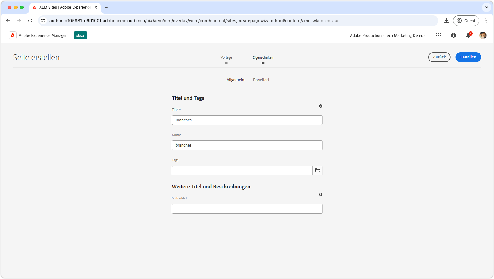
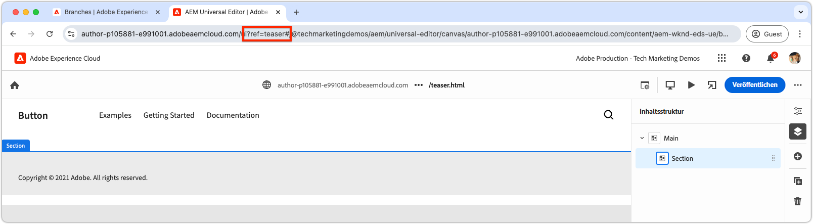
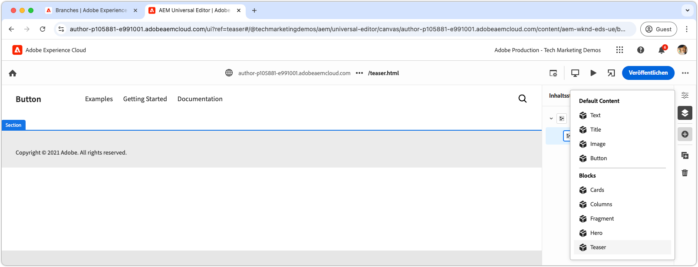
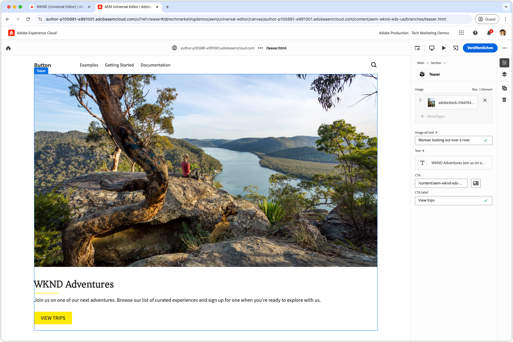
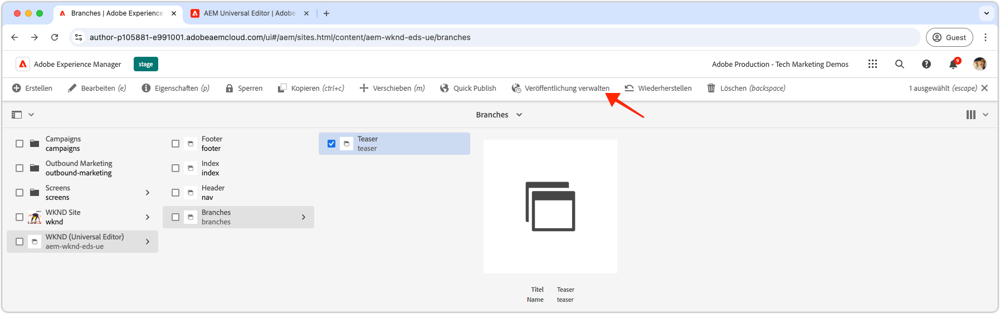

# Erstellen eines Blocks

Nachdem der JSON[Code des Teaser-Blocks an den `teaser`-Zweig ](./5-new-block.md) wurde, kann der Block im universellen AEM-Editor bearbeitet werden.

Die Erstellung eines Bausteins in der Entwicklung ist aus mehreren Gründen wichtig:

1. Dadurch wird überprüft, ob die Definition und das Modell des Blocks korrekt sind.
1. Es ermöglicht Entwicklern, die semantische HTML des Blocks zu überprüfen, die als Grundlage für die Entwicklung dient.
1. Es ermöglicht die Bereitstellung sowohl des Inhalts als auch des semantischen HTML in der Vorschau-Umgebung und unterstützt so eine schnellere Blockentwicklung.

## Öffnen Sie den universellen Editor mit Code aus der `teaser` Verzweigung

1. Melden Sie sich bei AEM Author an.
2. Navigieren Sie zu **Sites** und wählen Sie die Site (WKND (Universal Editor)) aus, die im [vorherigen Kapitel) erstellt ](./2-new-aem-site.md).

   

3. Erstellen oder bearbeiten Sie eine Seite, um den neuen Block hinzuzufügen, und stellen Sie sicher, dass der Kontext zur Unterstützung der lokalen Entwicklung verfügbar ist. Seiten können zwar überall auf der Site erstellt werden, es ist jedoch oft am besten, für jeden neuen Arbeitsbereich separate Seiten zu erstellen. Erstellen Sie eine neue Seite „Ordner“ mit dem Namen **Verzweigungen**. Jede Unterseite wird verwendet, um die Entwicklung der gleichnamigen Git-Verzweigung zu unterstützen.

   

4. Erstellen Sie **Seite „Verzweigungen** eine neue Seite mit dem Titel **Teaser**, der dem Namen der Entwicklungsverzweigung entspricht, und klicken Sie auf **Öffnen**, um die Seite zu bearbeiten.

   

5. Aktualisieren Sie den universellen Editor, um den Code aus der `teaser` zu laden, indem Sie `?ref=teaser` zur URL hinzufügen. Stellen Sie sicher, dass Sie den Abfrageparameter **VOR** dem `#` hinzufügen.

   

6. Wählen Sie den ersten Abschnitt unter **Main**, klicken Sie auf die Schaltfläche **add** und wählen Sie den **Teaser**-Block aus.

   

7. Wählen Sie auf der Arbeitsfläche den neu hinzugefügten Teaser aus und erstellen Sie die Felder rechts oder über die Inline-Bearbeitungsfunktion.

   

8. Wechseln Sie nach Abschluss der Bearbeitung zur vorherigen Browser-Registerkarte (AEM Sites Admin), wählen Sie die Teaser-Seite aus, klicken Sie auf **Veröffentlichungen verwalten**, wählen Sie **Vorschau** aus und veröffentlichen Sie die Änderungen in der Vorschauumgebung. Die Änderungen werden dann in der `aem.page` Domain für die Website veröffentlicht.
   

9. Warten Sie, bis die Änderungen zur Vorschau veröffentlicht wurden, und öffnen Sie dann die Web-Seite über die [AEM CLI](./3-local-development-environment.md#install-the-aem-cli) unter [http://localhost:3000/branches/teaser](http://localhost:3000/branches/teaser).

   

Jetzt sind der Inhalt des erstellten Teaser-Blocks und die semantische HTML auf der Vorschau-Website verfügbar, die mithilfe der AEM-CLI in der lokalen Entwicklungsumgebung entwickelt werden kann.
