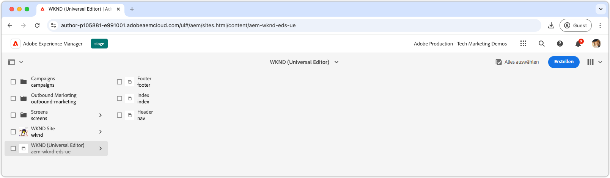

# Erstellen eines Blocks

Nachdem die [JSON des Teaser-Blocks](./5-new-block.md) in die `teaser`-Verzweigung verschoben wurde, kann der Block im universellen Editor von AEM bearbeitet werden.

Die Erstellung eines Blocks in der Entwicklung ist aus mehreren Gründen wichtig:

1. Dadurch wird sichergestellt, dass Definition und Modell des Blocks korrekt sind.
1. Entwickelnde haben die Möglichkeit, die semantische HTML des Blocks zu überprüfen, die als Grundlage für die Entwicklung dient.
1. Es wird die Bereitstellung sowohl des Inhalts als auch der semantischen HTML in der Vorschau-Umgebung ermöglicht, was eine schnellere Blockentwicklung unterstützt.

## Öffnen des universellen Editors mit Code aus der `teaser`-Verzweigung

1. Melden Sie sich bei der AEM-Autoreninstanz an.
2. Navigieren Sie zu **Sites** und wählen Sie die Site (WKND [universeller Editor]) aus, die im [vorherigen Kapitel](./2-new-aem-site.md) erstellt wurde.

   

3. Erstellen oder bearbeiten Sie eine Seite, um den neuen Block hinzuzufügen, und stellen Sie sicher, dass der Kontext zur Unterstützung der lokalen Entwicklung verfügbar ist. Seiten können zwar überall auf der Site erstellt werden, es ist jedoch oft am besten, für jeden neuen Arbeitsbereich separate Seiten zu erstellen. Erstellen Sie eine neue Seite „Ordner“ mit dem Namen **Verzweigungen**. Jede Unterseite wird verwendet, um die Entwicklung der gleichnamigen Git-Verzweigung zu unterstützen.

   

4. Erstellen Sie unter der Seite **Verzweigungen** eine neue Seite mit dem Titel **Teaser**, was dem Namen der Entwicklungsverzweigung entspricht, und klicken Sie auf **Öffnen**, um die Seite zu bearbeiten.

   

5. Aktualisieren Sie den universellen Editor, um den Code aus der Verzweigung `teaser` zu laden, indem Sie `?ref=teaser` zur URL hinzufügen. Achten Sie darauf, den Abfrageparameter **VOR** dem `#`-Symbol hinzufügen.

   

6. Wählen Sie den ersten Abschnitt unter **Main**, klicken Sie auf die Schaltfläche **Hinzufügen** und wählen Sie den **Teaser**-Block aus.

   

7. Wählen Sie auf der Arbeitsfläche den neu hinzugefügten Teaser aus und erstellen Sie die Felder rechts oder über die Inline-Bearbeitungsfunktion.

   

8. Wechseln Sie nach Abschluss der Erstellung zur vorherigen Browser-Registerkarte (AEM Sites Admin), wählen Sie die Teaser-Seite aus, klicken Sie auf **Veröffentlichungen verwalten**, wählen Sie **Vorschau** aus und veröffentlichen Sie die Änderungen in der Vorschauumgebung. Die Änderungen werden dann in der Domain `aem.page` für die Website veröffentlicht.
   

9. Warten Sie, bis die Änderungen in der Vorschau veröffentlicht wurden, und öffnen Sie dann die Web-Seite über die [AEM CLI](./3-local-development-environment.md#install-the-aem-cli) unter [http://localhost:3000/branches/teaser](http://localhost:3000/branches/teaser).

   

Der Inhalt des erstellten Teaser-Blocks und die semantische HTML sind jetzt auf der Vorschau-Website verfügbar und können mithilfe der AEM-CLI in der lokalen Entwicklungsumgebung entwickelt werden.
