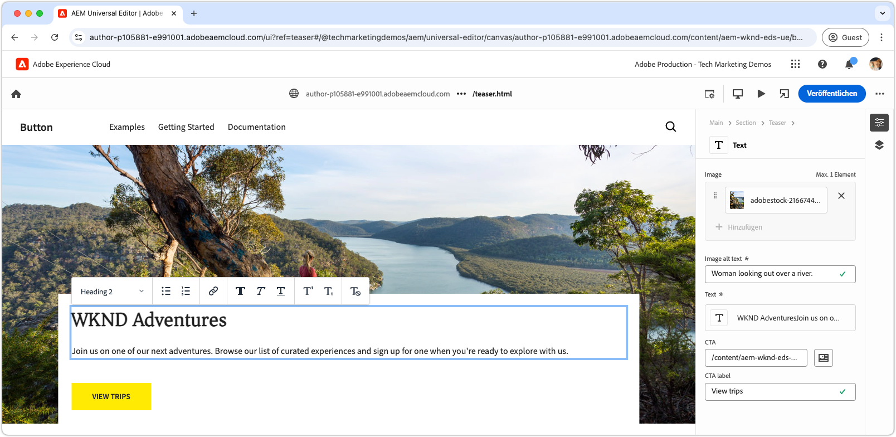

# Entwickeln eines Blocks mit CSS

Blöcke in Edge Delivery Services werden mit CSS formatiert. Die CSS-Datei für einen Block wird im Verzeichnis des Blocks gespeichert und hat denselben Namen wie der Block. Die CSS-Datei für einen Block mit dem Namen `teaser` befindet sich zum Beispiel unter `blocks/teaser/teaser.css`.

Ein Block sollte idealerweise nur CSS für die Formatierung benötigen, ohne für das Ändern des DOM oder das Hinzufügen von CSS-Klassen auf JavaScript angewiesen zu sein. Die Notwendigkeit von JavaScript hängt von der [Inhaltsmodellierung](./5-new-block.md#block-model) des Blocks und deren Komplexität ab. Bei Bedarf kann [Block-JavaScript](./7b-block-js-css.md) hinzugefügt werden.

Bei einem reinen CSS-Ansatz werden die (meist) einfachen semantischen HTML-Elemente des Blocks zielgerichtet und formatiert.

## Block – HTML

Um zu verstehen, wie Sie einen Block formatieren, überprüfen Sie zunächst das von Edge Delivery Services angezeigte DOM, da nur dieses für die Formatierung verfügbar ist. Das DOM finden Sie, indem Sie den Block überprüfen, der von der lokalen Entwicklungsumgebung der AEM-CLI bereitgestellt wird. Verwenden Sie nicht das DOM des universellen Editors, da es leicht abweicht.

>[!BEGINTABS]

>[!TAB DOM für Stil]

Im Folgenden finden Sie das DOM des Teaser-Blocks, welches das Ziel für die Formatierung ist.

Beachten Sie, dass `<p class="button-container">...` durch das JavaScript von Edge Delivery Services als abgeleitetes Element [automatisch erweitert](./4-website-branding.md#inferred-elements) wird.

```html
...
<body>
    <header/>
    <main>
        <div>
            <!-- Start block HTML -->
            <div class="teaser block" data-block-name="teaser" data-block-status="loaded">
                <div>
                    <div>
                        <picture>
                            <source type="image/webp" srcset="./media_15ba2b455e29aca38c1ca653d24c40acaec8a008f.jpeg?width=2000&amp;format=webply&amp;optimize=medium" media="(min-width: 600px)">
                            <source type="image/webp" srcset="./media_15ba2b455e29aca38c1ca653d24c40acaec8a008f.jpeg?width=750&amp;format=webply&amp;optimize=medium">
                            <source type="image/jpeg" srcset="./media_15ba2b455e29aca38c1ca653d24c40acaec8a008f.jpeg?width=2000&amp;format=jpeg&amp;optimize=medium" media="(min-width: 600px)">
                            
                        </picture>
                    </div>
                </div>
                <div>
                    <div>
                        <h2 id="wknd-adventures">WKND Adventures</h2>
                        <p>Join us on one of our next adventures. Browse our list of curated experiences and sign up for one when you're ready to explore with us.</p>
                        <p class="button-container"><a href="/" title="View trips" class="button">View trips</a></p>
                    </div>
                </div>
            </div>     
            <!-- End block HTML -->
        </div>
    </main>
    <footer/>
</body>
...
```

>[!TAB So finden Sie das DOM]

Um das zu formatierende DOM zu finden, öffnen Sie die Seite mit dem nicht formatierten Block in Ihrer lokalen Entwicklungsumgebung, wählen Sie den Block aus und überprüfen Sie das DOM.


>[!ENDTABS]

## Block – CSS

Erstellen Sie eine neue CSS-Datei im Ordner des Blocks, wobei Sie den Namen des Blocks als Dateinamen verwenden. Die Datei für den **Teaser**-Block befindet sich zum Beispiel unter `/blocks/teaser/teaser.css`.

Diese CSS-Datei wird automatisch geladen, wenn das JavaScript von Edge Delivery Services ein DOM-Element auf der Seite erkennt, das einen Teaser-Block darstellt.

[!BADGE /blocks/teaser/teaser.css]{type=Neutral tooltip="Dateiname des unten stehenden Code-Beispiels."}

```css
/* /blocks/teaser/teaser.css */

/* Scope each selector in the block with `.block.teaser` using CSS nesting (https://developer.mozilla.org/en-US/docs/Web/CSS/CSS_nesting) to avoid accidental conflicts outside the block */
.block.teaser {
    animation: teaser-fade-in .6s;
    position: relative;
    width: 1600px;
    max-width: 100vw;
    left: 50%; 
    transform: translateX(-50%);
    height: 500px;
    overflow: hidden; 

    /* The image is rendered to the first div in the block */
    picture {
        position: absolute;
        z-index: -1;
        inset: 0;
        box-sizing: border-box;

        img {
            object-fit: cover;
            object-position: center;
            width: 100%;
            height: 100%;
        }
    }

    /** 
    The teaser's text is rendered to the second (also the last) div in the block.

    These styles are scoped to the second (also the last) div in the block (.block.teaser > div:last-child).

    This div order can be used to target different styles to the same semantic elements in the block. 
    For example, if the block has two images, we could target the first image with `.block.teaser > div:first-child img`, 
    and the second image with `.block.teaser > div:nth-child(2) img`.
    **/
    & > div:last-child {
        position: absolute;
        bottom: 0;
        left: 50%;
        transform: translateX(-50%);
        background: var(--background-color);
        padding: 1.5rem 1.5rem 1rem;
        width: 80vw;
        max-width: 1200px;

        /** 
        The following elements reside within `.block.teaser > div:last-child` and could be scoped as such, for example:

        .block.teaser > div:last-child p { .. }

        However since these element can only appear in the second/last div per our block's model, it's unnecessary to add this additional scope.
        **/

        /* Regardless of the authored heading level, we only want one style the heading */
        h1,
        h2,
        h3,
        h4,
        h5,
        h6 {
            font-size: var(--heading-font-size-xl);
            margin: 0;
        }

        h1::after,
        h2::after,
        h3::after,
        h4::after,
        h5::after,
        h6::after {
            border-bottom: 0;
        }

        p {
            font-size: var(--body-font-size-s);
            margin-bottom: 1rem;
        }

        /* Add underlines to links in the text */
        a:hover {
            text-decoration: underline;
        }

        /* Add specific spacing to buttons. These button CSS classes are automatically added by Edge Delivery Services. */
        .button-container {
            margin: 0;
            padding: 0;

            .button {
                background-color: var(--primary-color);
                border-radius: 0;
                color: var(--dark-color);
                font-size: var(--body-font-size-xs);
                font-weight: bold;
                padding: 1em 2.5em;
                margin: 0;
                text-transform: uppercase;
            }
        }
    }
}

/** Animations 
    Scope the @keyframes to the block (teaser) to avoid accidental conflicts outside the block

    Global @keyframes can defines in styles/styles.css and used in this file.
**/

@keyframes teaser-fade-in {
    from {
        opacity: 0;
    }

    to {
        opacity: 1;
    }
}
```

## Entwicklungsvorschau

Da das CSS in das Code-Projekt geschrieben wird, lädt die AEM-CLI die Änderungen neu, sodass die Auswirkungen des CSS auf den Block schnell und einfach verstanden werden können.


## Linten des Codes

Achten Sie auf [häufiges Linten](./3-local-development-environment.md#linting) Ihrer Code-Änderungen, um Sauberkeit und Konsistenz sicherzustellen. Linten hilft, Probleme frühzeitig zu erkennen, und reduziert die allgemeine Entwicklungszeit. Denken Sie daran, dass Sie Ihre Entwicklungsarbeit erst dann mit `main` zusammenführen können, wenn alle Lint-Probleme behoben sind.

```bash
# ~/Code/aem-wknd-eds-ue

$ npm run lint:css
```

## Vorschau im universellen Editor

Um Änderungen im universellen Editor von AEM anzuzeigen, können Sie sie hinzufügen, übertragen und in die Git-Repository-Verzweigung verschieben, die vom universellen Editor verwendet wird. Mit diesem Schritt wird sichergestellt, dass die Blockimplementierung das Authoring-Erlebnis nicht beeinträchtigt.

```bash
# ~/Code/aem-wknd-eds-ue

$ git add .
$ git commit -m "Add CSS-only implementation for teaser block"
$ git push origin teaser
```

Sie können jetzt Sie eine Vorschau der Änderungen im universellen Editor anzeigen, wenn Sie den Abfrageparameter `?ref=teaser` hinzufügen.


