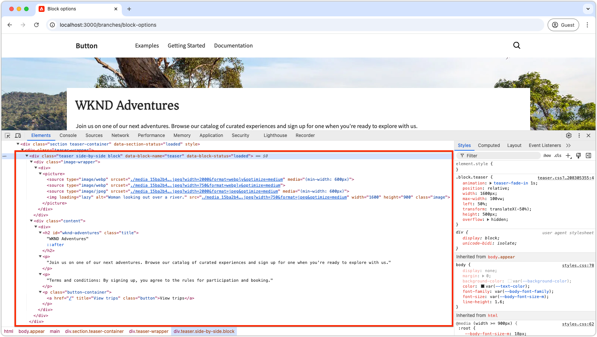

# Entwickeln eines Bausteins mit Optionen

Dieses Tutorial baut auf dem Tutorial für den Edge Delivery Services- und universellen Editor auf und führt Sie durch den Prozess des Hinzufügens von Blockoptionen zu einem Block. Durch die Definition von Blockoptionen können Sie das Erscheinungsbild und die Funktionalität eines Blocks anpassen und so verschiedene Varianten für unterschiedliche Inhaltsanforderungen ermöglichen. Dies ermöglicht eine größere Flexibilität und Wiederverwendbarkeit innerhalb des Designsystems Ihrer Site.

{align="center"}

In diesem Tutorial fügen Sie dem Teaser-Block Blockoptionen hinzu, sodass Autorinnen und Autoren zwischen zwei Anzeigeoptionen wählen können: **Standard** und **nebeneinander**. Mit der Option **Standard** wird das Bild über und hinter dem Text angezeigt, während **Option** Seite an Seite“ das Bild und den Text nebeneinander anzeigt.

## Häufige Anwendungsfälle

Häufige Anwendungsfälle für die Verwendung von **Blockoptionen** in der **Edge Delivery Services**- und **Universal Editor**-Entwicklung sind unter anderem:

1. **Layout-Varianten:** zwischen Layouts wechseln. Beispiel: Horizontal vs. Vertikal oder Raster vs. Liste.
2. **Stilvarianten:** Sie einfach zwischen Designs oder visuellen Abwandlungen wechseln. Zum Beispiel Hell vs. Dunkler Modus oder Groß vs. Kleiner Text.
3. **Steuerung der Inhaltsanzeige:** Ein-/Ausschalten der Sichtbarkeit von Elementen oder Wechseln zwischen Inhaltsstilen (kompakt vs. detailliert).

Diese Optionen bieten Flexibilität und Effizienz beim Erstellen dynamischer und anpassbarer Bausteine.

Dieses Tutorial zeigt den Anwendungsfall für Layout-Varianten, bei dem der Teaser-Block in zwei verschiedenen Layouts angezeigt werden kann **&quot;**&quot; und **nebeneinander**.

## Blockmodell

Um Blockoptionen zum Teaser-Block hinzuzufügen, öffnen Sie sein JSON-Fragment unter `/block/teaser/_teaser.json` und fügen Sie der Modelldefinition ein neues Feld hinzu. In diesem Feld wird die `name`-Eigenschaft auf `classes` festgelegt. Dies ist ein geschütztes Feld, das von AEM zum Speichern von Blockoptionen verwendet wird, die auf die Edge Delivery Services-HTML des Blocks angewendet werden.

### Feldkonfigurationen

Die folgenden Registerkarten veranschaulichen verschiedene Möglichkeiten zum Konfigurieren von Blockoptionen im Blockmodell, einschließlich Einzelauswahl mit einer einzelnen CSS-Klasse, Einzelauswahl mit mehreren CSS-Klassen und Mehrfachauswahl mit mehreren CSS-Klassen. Dieses Tutorial [implementiert den einfacheren Ansatz, ](#field-configuration-for-this-tutorial) in &quot;**mit einer einzelnen CSS-Klasse“ verwendet**.

>[!BEGINTABS]

>[!TAB Mit einzelner CSS-Klasse auswählen]

In diesem Tutorial erfahren Sie, wie Sie mit einem `select` (Dropdown)-Eingabetyp eine Option für einen einzelnen Block auswählen können, der dann als einzelne, entsprechende CSS-Klasse angewendet wird.

{align="center"}

#### Blockmodell

Die **Standard**-Option wird durch eine leere Zeichenfolge dargestellt (`""`), während die **Seite an Seite**-Option `"side-by-side"` verwendet. Die Optionen **name** und **value** müssen nicht identisch sein, aber der **value** bestimmt die CSS-Klasse(n), die auf die HTML des Blocks angewendet werden. Beispielsweise könnte der **der Option** Seite an Seite) anstelle von `side-by-side` `layout-10` werden. Es ist jedoch am besten, semantisch aussagekräftige Namen für CSS-Klassen zu verwenden, um Klarheit und Konsistenz in den Optionswerten sicherzustellen.

[!BADGE /blocks/teaser/_teaser.json]{type=Neutral tooltip="Dateiname des unten stehenden Code-Beispiels."}

```json{highlight="4,8,9-18"}
...
"fields": [
    {
        "component": "select",
        "name": "classes",
        "value": "",
        "label": "Teaser options",
        "valueType": "string",
        "options": [
            {
                "name": "Default",
                "value": ""
            },
            {
                "name": "Side-by-side",
                "value": "side-by-side"
            }
        ]
    }
]
...
```

#### Block – HTML

Wenn der Autor eine Option auswählt, wird der entsprechende Wert als CSS-Klasse zum HTML des Blocks hinzugefügt:

- Wenn **Standard** ausgewählt ist:

  ```html
  <div class="block teaser">
      <!-- Block content here -->
  </div>
  ```

- Wenn **Seite an Seite** ausgewählt ist:

  ```html
  <div class="block teaser side-by-side">
      <!-- Block content here -->
  </div>
  ```

Dadurch können je nach ausgewählter Öffnung unterschiedliche Stile und bedingte JavaScript angewendet werden.


>[!TAB Mit mehreren CSS-Klassen auswählen]

**Dieser Ansatz wird in diesem Tutorial nicht verwendet, veranschaulicht jedoch eine alternative Methode und erweiterte Blockoptionen.**

Mit dem `select`-Eingabetyp können Autoren eine Option für einen einzelnen Block auswählen, der optional mehreren CSS-Klassen zugeordnet werden kann. Listen Sie dazu die CSS-Klassen als durch Leerzeichen getrennte Werte auf.

{align="center"}

#### Blockmodell

Beispielsweise kann die Option **Seite an Seite** Varianten unterstützen, bei denen das Bild links (`side-by-side left`) oder rechts (`side-by-side right`) angezeigt wird.

[!BADGE /blocks/teaser/_teaser.json]{type=Neutral tooltip="Dateiname des unten stehenden Code-Beispiels."}

```json{highlight="4,8,9-21"}
...
"fields": [
    {
        "component": "select",
        "name": "classes",
        "value": "",
        "label": "Teaser options",
        "valueType": "string",
        "options": [
            {
                "name": "Default",
                "value": ""
            },
            {
                "name": "Side-by-side with Image on left",
                "value": "side-by-side left"
            },
            {
                "name": "Side-by-side with Image on right",
                "value": "side-by-side right"
            }
        ]
    }
]
...
```

#### Block – HTML

Wenn der Autor eine Option auswählt, wird der entsprechende Wert als durch Leerzeichen getrennte Gruppe von CSS-Klassen im HTML des Blocks angewendet:

- Wenn **Standard** ausgewählt ist:

  ```html
  <div class="block teaser">
      <!-- Block content here -->
  </div>
  ```

- Wenn **Seite an Seite mit Bild auf der linken Seite** ausgewählt ist:

  ```html
  <div class="block teaser side-by-side left">
      <!-- Block content here -->
  </div>
  ```

- Wenn **Seite an Seite mit Bild auf der rechten Seite** ausgewählt ist:

  ```html
  <div class="block teaser side-by-side right">
      <!-- Block content here -->
  </div>
  ```

Dadurch können je nach ausgewählter Option unterschiedliche Stile und bedingte JavaScript angewendet werden.


>[!TAB Mehrfachauswahl mit mehreren CSS-Klassen]

**Dieser Ansatz wird in diesem Tutorial nicht verwendet, veranschaulicht jedoch eine alternative Methode und erweiterte Blockoptionen.**

Mit dem Eingabetyp von `"component": "multiselect"` kann der Autor mehrere Optionen gleichzeitig auswählen. Dies ermöglicht komplexe Permutationen des Erscheinungsbildes des Blocks, indem mehrere Design-Optionen kombiniert werden.

{align="center"}

### Blockmodell

Beispielsweise können **nebeneinander**, **Bild links** und **Bild rechts** Varianten unterstützen, bei denen das Bild links (`side-by-side left`) oder rechts (`side-by-side right`) positioniert ist.

[!BADGE /blocks/teaser/_teaser.json]{type=Neutral tooltip="Dateiname des unten stehenden Code-Beispiels."}

```json{highlight="4,6,8,10-21"}
...
"fields": [
    {
        "component": "multiselect",
        "name": "classes",
        "value": [],
        "label": "Teaser options",
        "valueType": "array",
        "options": [
            {
                "name": "Side-by-side",
                "value": "side-by-side"
            },
            {
                "name": "Image on left",
                "value": "left"
            },
            {
                "name": "Image on right",
                "value": "right"
            }
        ]
    }
]
...
```

#### Block – HTML

Wenn der Autor mehrere Optionen auswählt, werden die entsprechenden Werte als durch Leerzeichen getrennte CSS-Klassen im HTML des Blocks angewendet:

- Wenn **nebeneinander** und **Bild links** ausgewählt sind:

  ```html{highlight="1"}
  <div class="block teaser side-by-side left">
      <!-- Block content here -->
  </div>
  ```

- Wenn **nebeneinander** und **Bild auf der rechten** ausgewählt sind:

  ```html{highlight="1"}
  <div class="block teaser side-by-side right">
      <!-- Block content here -->
  </div>
  ```

Die Mehrfachauswahl bietet zwar Flexibilität, führt aber auch zu Komplexität bei der Verwaltung von Design-Permutationen. Ohne Einschränkungen können widersprüchliche Auswahlen zu fehlerhaften oder markenfremden Erlebnissen führen.

Zum Beispiel:

- **Bild links** oder **Bild rechts** ohne Auswahl **nebeneinander** wendet sie implizit auf **Standard** an, wodurch das Bild immer als Hintergrund festgelegt wird, sodass die Ausrichtung nach links und rechts irrelevant ist.
- Die Auswahl von **Bild links** und **Bild rechts“ ist**.
- Die Auswahl **nebeneinander** ohne **Bild links** oder **Bild rechts** kann als mehrdeutig angesehen werden, da die Bildposition nicht angegeben ist.

Um Probleme und Autorenverwirrung bei der Verwendung von Mehrfachauswahl zu vermeiden, stellen Sie sicher, dass die Optionen gut geplant sind und alle Permutationen getestet werden. Mehrfachauswahl eignet sich am besten für einfache, nicht widersprüchliche Verbesserungen wie „groß“ oder „Hervorhebung“ und nicht für Optionen zum Ändern des Layouts.


>[!TAB Standardoption]

**Dieser Ansatz wird in diesem Tutorial nicht verwendet, veranschaulicht jedoch eine alternative Methode und erweiterte Blockoptionen.**

Blockoptionen können als Standard festgelegt werden, wenn im universellen Editor eine neue Blockinstanz zu einer Seite hinzugefügt wird. Dies geschieht, indem der Standardwert der `classes`-Eigenschaft in der Definition [Blocks“ festgelegt ](../5-new-block.md#block-definition).

#### Blockdefinition

Im folgenden Beispiel wird die Standardoption auf **Seite an Seite“ festgelegt** indem `side-by-side` die `value` Eigenschaft des `classes` zugewiesen wird. Die entsprechende Blockoptionseingabe im -Blockmodell ist optional.

Sie können auch mehrere Einträge für denselben Block mit jeweils einem anderen Namen und einer anderen Klasse definieren. Dadurch kann der universelle Editor einzelne Blockeinträge anzeigen, die jeweils mit einer bestimmten Blockoption vorkonfiguriert sind. Diese werden zwar als separate Blöcke im Editor angezeigt, die Codebasis enthält jedoch einen einzelnen Block, der basierend auf der ausgewählten Option dynamisch gerendert wird.

[!BADGE /blocks/teaser/_teaser.json]{type=Neutral tooltip="Dateiname des unten stehenden Code-Beispiels."}

```json{highlight="12"}
{
    "definitions": [{
      "title": "Teaser",
      "id": "teaser",
      "plugins": {
        "xwalk": {
          "page": {
            "resourceType": "core/franklin/components/block/v1/block",
            "template": {
              "name": "Teaser",
              "model": "teaser",
              "classes": "side-by-side",
              "textContent_text": "<h2>Enter a title</h2><p>...and body text here!</p>",
              "textContent_cta": "/",
              "textContent_ctaText": "Click me!"
            }
          }
        }
      }
    }],
    "models": [... from previous section ...],
    "filters": []
}
```

>[!ENDTABS]


### Feldkonfiguration für dieses Tutorial


In diesem Tutorial verwenden wir den oben auf der ersten Registerkarte beschriebenen Ansatz mit der Auswahl mit einzelnen CSS-Klassen, der zwei diskrete Blockoptionen ermöglicht: **Standard** und **nebeneinander**.

Fügen Sie in der Modelldefinition im JSON-Fragment des Blocks ein einzelnes Auswahlfeld für Blockoptionen hinzu. In diesem Feld können Autoren zwischen dem Standard-Layout und einem Layout wählen, das nebeneinander angezeigt wird.

[!BADGE /blocks/teaser/_teaser.json]{type=Neutral tooltip="Dateiname des unten stehenden Code-Beispiels."}

```json{highlight="7-24"}
{
    "definitions": [...],
    "models": [
        {
            "id": "teaser", 
            "fields": [
                {
                    "component": "select",
                    "name": "classes",
                    "value": "",
                    "label": "Teaser options",
                    "description": "",
                    "valueType": "string",
                    "options": [
                        {
                            "name": "Default",
                            "value": ""
                        },
                        {
                            "name": "Side-by-side",
                            "value": "side-by-side"
                        }
                    ]
                },
                {
                    "component": "reference",
                    "valueType": "string",
                    "name": "image",
                    "label": "Image",
                    "multi": false
                },
                {
                    "component": "text",
                    "valueType": "string",
                    "name": "imageAlt",
                    "label": "Image alt text",
                    "required": true
                },
                {
                    "component": "richtext",
                    "name": "textContent_text",
                    "label": "Text",
                    "valueType": "string",
                    "required": true
                },
                {
                    "component": "aem-content",
                    "name": "textContent_cta",
                    "label": "CTA",
                    "valueType": "string"
                },
                {
                    "component": "text",
                    "name": "textContent_ctaText",
                    "label": "CTA label",
                    "valueType": "string"
                }
            ]
        }
    ],
    "filters": []
}
```

## Block im universellen Editor aktualisieren

Um die aktualisierten Blockoptioneneingaben im universellen Editor verfügbar zu machen, stellen Sie die JSON-Code-Änderungen in GitHub bereit, erstellen Sie eine neue Seite, fügen Sie den Teaser-Block mit der Option **Seite an Seite** hinzu und erstellen Sie ihn und veröffentlichen Sie dann die Seite zur Vorschau. Laden Sie nach der Veröffentlichung die Seite zur Codierung in die lokale Entwicklungsumgebung.

### Änderungen an GitHub pushen

Um die aktualisierten Blockoptioneneingaben im universellen Editor zum Festlegen von Blockoptionen und zum Entwickeln für die resultierende HTML verfügbar zu machen, muss das Projekt verknüpft werden und die Änderungen an eine GitHub-Verzweigung - in diesem Fall die `block-options` - gepusht werden.

```bash
# ~/Code/aem-wknd-eds-ue

# Lint the changes to catch any syntax errors
$ npm run lint 

$ git add .
$ git commit -m "Add Teaser block option to JSON file so it is available in Universal Editor"
$ git push origin teaser
```

### Erstellen einer Testseite

Erstellen Sie im AEM-Autoren-Service eine neue Seite, um den Teaser-Block für die Entwicklung hinzuzufügen. Gemäß der Konvention im Kapitel [Erstellen eines Blocks](../6-author-block.md) des [Tutorials für die Entwicklung von Edge Delivery Services und dem universellen Editor](../0-overview.md) erstellen Sie eine Testseite unter einer `branches`, wobei Sie sie nach der Git-Verzweigung benennen, an der Sie arbeiten - in diesem Fall `block-options`.

### Erstellen des Blocks

Bearbeiten Sie die neue Seite **Blockoptionen** im universellen Editor und fügen Sie den **Teaser**-Block hinzu. Fügen Sie den Abfrageparameter `?ref=block-options` zur URL hinzu, um die Seite mit Code aus der `block-options` GitHub-Verzweigung zu laden.

Das Dialogfeld „Block“ enthält jetzt **Dropdown-** „Teaser-Optionen **mit den** „Standard **und**. Wählen Sie **nebeneinander** und schließen Sie die verbleibende Inhaltserstellung ab.

{align="center"}

Optional können Sie zwei **Teaser**-Blöcke hinzufügen, von denen einer auf **Standard** und der andere auf **Seite an Seite** eingestellt ist. Auf diese Weise können Sie während der Entwicklung beide Optionen nebeneinander in der Vorschau anzeigen und stellen sicher, dass **Implementierung** Seite an Seite keine Auswirkungen auf die Option **Standard** hat.

### In Vorschau veröffentlichen

Sobald der Teaser-Block zur Seite hinzugefügt wurde, [ Sie die Seite zur Vorschau ](../6-author-block.md), indem Sie **Veröffentlichungen verwalten** und die Site-Admin der AEM-Autoreninstanz verwenden.

## Block – HTML

Um mit der Blockentwicklung zu beginnen, überprüfen Sie zunächst die DOM-Struktur, die von der Edge Delivery Services-Vorschau bereitgestellt wird. Das DOM wurde um JavaScript erweitert und mit CSS formatiert, wodurch die Grundlage für das Erstellen und Anpassen des Bausteins geschaffen wird.

>[!BEGINTABS]

>[!TAB Zu dekorierendes DOM]

Im Folgenden finden Sie das DOM des Teaser-Blocks, wobei die Option **nebeneinander**-Block ausgewählt ist. Dies ist das Ziel, das mit JavaScript und CSS dekoriert werden soll.

```html{highlight="7"}
...
<body>
    <header/>
    <main>
        <div>
            <!-- Start block HTML -->
            <div class="teaser block side-by-side" data-block-name="teaser" data-block-status="loaded">
                <div>
                    <div>
                    <picture>
                        <source type="image/webp" srcset="./media_15ba2b455e29aca38c1ca653d24c40acaec8a008f.jpeg?width=2000&amp;format=webply&amp;optimize=medium" media="(min-width: 600px)">
                        <source type="image/webp" srcset="./media_15ba2b455e29aca38c1ca653d24c40acaec8a008f.jpeg?width=750&amp;format=webply&amp;optimize=medium">
                        <source type="image/jpeg" srcset="./media_15ba2b455e29aca38c1ca653d24c40acaec8a008f.jpeg?width=2000&amp;format=jpeg&amp;optimize=medium" media="(min-width: 600px)">
                        
                    </picture>
                    </div>
                </div>
                <div>
                    <div>
                    <h2 id="wknd-adventures">WKND Adventures</h2>
                    <p>Join us on one of our next adventures. Browse our list of curated experiences and sign up for one when you're ready to explore with us.</p>
                    <p>Terms and conditions: By signing up, you agree to the rules for participation and booking.</p>
                    <p class="button-container"><a href="/" title="View trips" class="button">View trips</a></p>
                    </div>
                </div>
            </div>     
            <!-- End block HTML -->
        </div>
    </main>
    <footer/>
</body>
...
```

>[!TAB So finden Sie das DOM]

Um das zu dekorierende DOM zu finden, öffnen Sie die Seite mit dem Block in Ihrer lokalen Entwicklungsumgebung, wählen Sie den Block mit den Entwickler-Tools Ihres Webbrowsers aus und überprüfen Sie das DOM. Auf diese Weise können Sie die relevanten Elemente für die Dekoration identifizieren.

{align="center"}

>[!ENDTABS]

## Block – CSS

Bearbeiten Sie `blocks/teaser/teaser.css` , um bestimmte CSS-Stile für die Option **nebeneinander** hinzuzufügen. Diese Datei enthält das Standard-CSS für den -Block.

Um Stile für die Option **nebeneinander** zu ändern, fügen Sie eine neue CSS-Regel mit dem Bereich in der `teaser.css`-Datei hinzu, die auf Teaser-Blöcke abzielt, die mit der `side-by-side`-Klasse konfiguriert wurden.

```css
.block.teaser.side-by-side { ... }
```

Alternativ können Sie die CSS-Verschachtelung für eine präzisere Version verwenden:

```css
.block.teaser {
    ... Default teaser block styles ...

    &.side-by-side {
        ... Side-by-side teaser block styles ...
    }
}
```

Fügen Sie innerhalb der `&.side-by-side`-Regel die erforderlichen CSS-Eigenschaften hinzu, um den Block zu formatieren, wenn die `side-by-side`-Klasse angewendet wird.

Ein gängiger Ansatz besteht darin, Standardstile zurückzusetzen, indem `all: initial` auf freigegebene Selektoren angewendet und dann die erforderlichen Stile für die `side-by-side` Variante hinzugefügt werden. Wenn die meisten Stile für mehrere Optionen freigegeben sind, kann das Überschreiben bestimmter Eigenschaften einfacher sein. Wenn jedoch mehrere Selektoren geändert werden müssen, kann das Zurücksetzen aller Stile und das erneute Anwenden nur der erforderlichen Stile den Code übersichtlicher und wartbarer machen.
[!BADGE /blocks/teaser/teaser.css]{type=Neutral tooltip="Dateiname des unten stehenden Code-Beispiels."}

```css
/* /blocks/teaser/teaser.css */

/* Scope each selector in the block with `.block.teaser` to avoid accidental conflicts outside the block */
.block.teaser {
    animation: teaser-fade-in 1s;
    position: relative;
    width: 1600px;
    max-width: 100vw;
    left: 50%; 
    transform: translateX(-50%);
    height: 500px;
    overflow: hidden; 


    /* The teaser image */
    .image-wrapper {
        position: absolute;
        z-index: -1;
        inset: 0;
        box-sizing: border-box;
        overflow: hidden; 

        .image {
            object-fit: cover;
            object-position: center;
            width: 100%;
            height: 100%;
            transform: scale(1); 
            transition: transform 0.6s ease-in-out;

            .zoom {
                transform: scale(1.1);
            }            
        }
    }

    /* The teaser text content */
    .content {
        position: absolute;
        bottom: 0;
        left: 50%;
        transform: translateX(-50%);
        background: var(--background-color);
        padding: 1.5rem 1.5rem 1rem;
        width: 80vw;
        max-width: 1200px;
  
        .title {
            font-size: var(--heading-font-size-xl);
            margin: 0;
        }

        .title::after {
            border-bottom: 0;
        }

        p {
            font-size: var(--body-font-size-s);
            margin-bottom: 1rem;
            animation: teaser-fade-in .6s;
        }

        p.terms-and-conditions {
            font-size: var(--body-font-size-xs);
            color: var(--secondary-color);
            padding: .5rem 1rem;
            font-style: italic;
            border: solid var(--light-color);
            border-width: 0 0 0 10px;
        }

        /* Add underlines to links in the text */
        a:hover {
            text-decoration: underline;
        }

        /* Add specific spacing to buttons. These button CSS classes are automatically added by Edge Delivery Services. */
        .button-container {
            margin: 0;
            padding: 0;        

            .button {   
                background-color: var(--primary-color);
                border-radius: 0;
                color: var(--dark-color);
                font-size: var(--body-font-size-xs);
                font-weight: bold;
                padding: 1em 2.5em;
                margin: 0;
                text-transform: uppercase;
            }
        }
    }

    /**
    *  Add styling for the side-by-side variant 
    **/

    /* This evaluates to .block.teaser.side-by-side */
    &.side-by-side {    
        /* Since this default teaser option doesn't have a style (such as `.default`), we use `all: initial` to reset styles rather than overriding individual styles. */
        all: initial;
        display: flex;
        margin: auto;
        max-width: 900px;

        .image-wrapper {
            all: initial;
            flex: 2;
            overflow: hidden;                 
            
            * {
                height: 100%;
            }        

            .image {
                object-fit: cover;
                object-position: center;
                width: 100%;
                height: 100%;
                transform: scale(1); 
                transition: transform 0.6s ease-in-out;                

                &.zoom {
                    /* This option has a different zoom level than the default */
                    transform: scale(1.5);
                }
            }
        }

        .content {
            all: initial;
            flex: 1;
            background-color: var(--light-color);
            padding: 3.5em 2em 2em;
            font-size: var(--body-font-size-s);
            font-family: var(--body-font-family);
            text-align: justify;
            text-justify: newspaper;
            hyphens: auto;

            p.terms-and-conditions {
                border: solid var(--text-color);
                border-width: 0;
                padding-left: 0;
                text-align: left;
            }
        }

        /* Media query for mobile devices */
        @media (width <= 900px) {
            flex-direction: column; /* Stack elements vertically on mobile */
        }
    }
}

/** Animations 
    Scope the @keyframes to the block (teaser) to avoid accidental conflicts outside the block

    Global @keyframes can defines in styles/styles.css and used in this file.
**/
@keyframes teaser-fade-in {
    from {
        opacity: 0;
    }

    to {
        opacity: 1;
    }
}
```


## Block – JavaScript

Die Identifizierung der aktiven Option(en) für den Block ist einfach, indem Sie die auf das Blockelement angewendeten Klassen überprüfen. In diesem Beispiel müssen wir anpassen, wo die `.image-wrapper` Stile angewendet werden, je nach der aktiven Option.

Die Funktion `getOptions` gibt ein Array von Klassen zurück, die auf den Block angewendet werden, mit Ausnahme von `block` und `teaser` (da alle Blöcke die `block` Klasse und alle Teaser-Blöcke die `teaser` Klasse aufweisen). Alle verbleibenden Klassen im -Array geben die aktiven Optionen an. Wenn das Array leer ist, wird die Standardoption angewendet.

```javascript
function getOptions(block) {
  // Get the block's classes, excluding 'block' and 'teaser'; anything remaining is a block option.
  return [...block.classList].filter((c) => !['block', 'teaser'].includes(c));
}
```

Diese Optionsliste kann verwendet werden, um benutzerdefinierte Logik im JavaScript des Blocks bedingt auszuführen:

```javascript
if (getOptions(block).includes('side-by-side')) {
  /* For side-by-side teaser, add the image-wrapper to a higher-level div to support CSS */
  block.querySelector(':scope > div:first-child').classList.add('image-wrapper');
} else if (!getOptions(block)) {
  /* For the default option, add the image-wrapper to the picture element to support CSS */
  block.querySelector('picture').classList.add('image-wrapper');
}
```

Die vollständige aktualisierte JavaScript-Datei für den Teaser-Block mit den Optionen „Standard“ und „Nebeneinander“ lautet wie folgt:

[!BADGE /blocks/teaser/teaser.js]{type=Neutral tooltip="Dateiname des unten stehenden Code-Beispiels."}

```javascript
/* /blocks/teaser/teaser.js */

/**
 * Block options are applied as classes to the block's DOM element
 * alongside the `block` and `<block-name>` classes.
 *
 * @param {HTMLElement} block represents the block's DOM element/tree
 */
function getOptions(block) {
  // Get the block's classes, excluding 'block' and 'teaser'.
  return [...block.classList].filter((c) => !['block', 'teaser'].includes(c));
}

/**
 * Adds a zoom effect to the image using event listeners.
 *
 * When the CTA button is hovered over, the image zooms in.
 *
 * @param {HTMLElement} block represents the block's DOM tree
 */
function addEventListeners(block) {
  block.querySelector('.button').addEventListener('mouseover', () => {
    block.querySelector('.image').classList.add('zoom');
  });

  block.querySelector('.button').addEventListener('mouseout', () => {
    block.querySelector('.image').classList.remove('zoom');
  });
}

/**
 * Entry point to the block's JavaScript.
 * Must be exported as default and accept a block's DOM element.
 * This function is called by the project's style.js, passing the block's element.
 *
 * @param {HTMLElement} block represents the block's DOM element/tree
 */
export default function decorate(block) {
  /* Common treatments for all options */
  block.querySelector(':scope > div:last-child').classList.add('content');
  block.querySelector('h1,h2,h3,h4,h5,h6').classList.add('title');
  block.querySelector('img').classList.add('image');

  // Process each paragraph and mark it as text or terms-and-conditions
  block.querySelectorAll('p').forEach((p) => {
    const innerHTML = p.innerHTML?.trim();
    if (innerHTML?.startsWith('Terms and conditions:')) {
      p.classList.add('terms-and-conditions');
    }
  });

  /* Conditional treatments for specific options */
  if (getOptions(block).includes('side-by-side')) {
    /* For side-by-side teaser, add the image-wrapper to a higher-level div to support CSS */
    block.querySelector(':scope > div:first-child').classList.add('image-wrapper');
  } else if (!getOptions(block)) {
    /* For the default option, add the image-wrapper to the picture element to support CSS */
    block.querySelector('picture').classList.add('image-wrapper');
  }

  addEventListeners(block);
}
```

## Entwicklungsvorschau

Beim Hinzufügen von CSS und JavaScript lädt die lokale Entwicklungsumgebung der AEM-CLI die Änderungen neu, sodass die Auswirkungen des Codes auf den Block schnell und einfach visualisiert werden können. Bewegen Sie den Mauszeiger über den CTA und überprüfen Sie, ob das Bild des Teasers vergrößert und verkleinert wird.


## Linten des Codes

Achten Sie auf [regelmäßiges Linten](../3-local-development-environment.md#linting) Ihrer Code-Änderungen, um Sauberkeit und Konsistenz beizubehalten. Regelmäßiges Linten hilft, Probleme frühzeitig zu erkennen und so die Entwicklungszeit insgesamt zu verkürzen. Denken Sie daran, dass Sie Ihre Entwicklungsarbeit erst dann mit der `main`-Verzweigung zusammenführen können, wenn alle Lint-Probleme behoben sind.

```bash
# ~/Code/aem-wknd-eds-ue

$ npm run lint
```

## Vorschau im universellen Editor

Um Änderungen im universellen Editor von AEM anzuzeigen, können Sie sie hinzufügen, übertragen und in die Git-Repository-Verzweigung verschieben, die vom universellen Editor verwendet wird. Dadurch wird sichergestellt, dass die Blockimplementierung das Authoring-Erlebnis nicht beeinträchtigt.

```bash
# ~/Code/aem-wknd-eds-ue

$ git add .
$ git commit -m "CSS and JavaScript implementation for Teaser block option Side-by-side"
# JSON files are compiled automatically and added to the commit via a Husky pre-commit hook
$ git push origin block-options
```

Jetzt sind die Änderungen im universellen Editor sichtbar, wenn Sie den `?ref=block-options` Abfrageparameter verwenden.

{align="center"}


## Herzlichen Glückwunsch!

Sie haben jetzt Blockoptionen in Edge Delivery Services und im universellen Editor untersucht, mit denen Sie die Inhaltsbearbeitung mit größerer Flexibilität anpassen und optimieren können. Beginnen Sie mit der Anwendung dieser Optionen in Ihren Projekten, um die Effizienz zu verbessern und die Konsistenz zu wahren.

Weitere Best Practices und erweiterte Techniken finden Sie in der [Dokumentation zum universellen Editor](https://experienceleague.adobe.com/de/docs/experience-manager-cloud-service/content/edge-delivery/wysiwyg-authoring/create-block#block-options).
