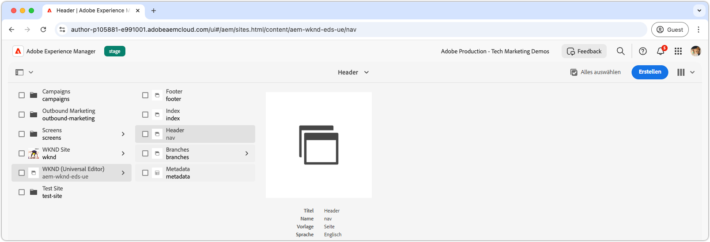
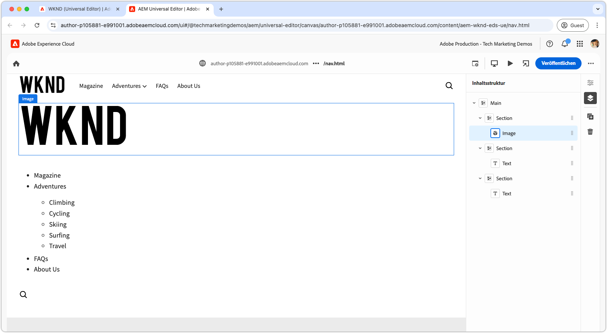
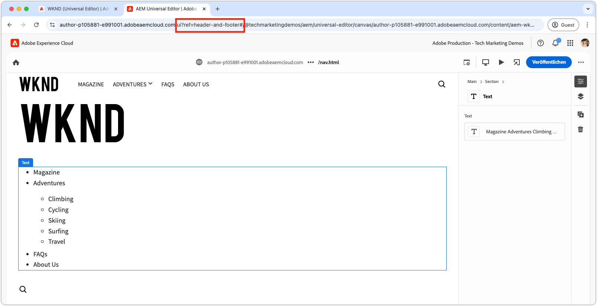
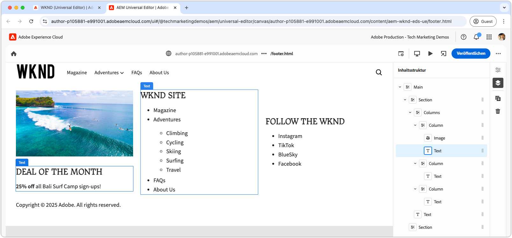

# Entwickeln einer Kopf- und Fußzeile

{align="center"}

Kopf- und Fußzeilen spielen in Edge Delivery Services (EDS) eine einzigartige Rolle, da sie direkt an die HTML-Elemente `<header>` und `<footer>` gebunden sind. Sie werden im Gegensatz zu regulären Seiteninhalten separat verwaltet und können unabhängig aktualisiert werden, ohne den gesamten Seiten-Cache bereinigen zu müssen. Sie sind im Code-Projekt zwar in Form von Blöcken unter `blocks/header` und `blocks/footer` implementiert, Autorinnen und Autoren können ihren Inhalt jedoch über dedizierte AEM-Seiten bearbeiten, die eine beliebige Blockkombination enthalten können.

## Block „Kopfzeile“

{align="center"}

Die Kopfzeile ist ein spezieller Block, der an das HTML-Element `<header>` von Edge Delivery Services gebunden ist.
Das Element `<header>` wird leer bereitgestellt und über XHR (AJAX) auf einer separaten AEM-Seite gefüllt.
Auf diese Weise kann die Kopfzeile unabhängig vom Seiteninhalt verwaltet und aktualisiert werden, ohne dass eine vollständige Cache-Bereinigung aller Seiten erforderlich ist.

Der Block „Kopfzeile“ ist dafür verantwortlich, das AEM-Seitenfragment mit dem Kopfzeileninhalt anzufordern und es im Element `<header>` zu rendern.

[!BADGE /blocks/header/header.js]{type=Neutral tooltip="Dateiname des unten stehenden Code-Beispiels."}

```javascript
import { getMetadata } from '../../scripts/aem.js';
import { loadFragment } from '../fragment/fragment.js';

...

export default async function decorate(block) {
  // load nav as fragment

  // Get the path to the AEM page fragment that defines the header content from the <meta name="nav"> tag. This is set via the site's Metadata file.
  const navMeta = getMetadata('nav');

  // If the navMeta is not defined, use the default path `/nav`.
  const navPath = navMeta ? new URL(navMeta, window.location).pathname : '/nav';

  // Make an XHR (AJAX) call to request the AEM page fragment and serialize it to a HTML DOM tree.
  const fragment = await loadFragment(navPath);
  
  // Add the content from the fragment HTML to the block and decorate it as needed
  ...
}
```

Die Funktion `loadFragment()` sendet eine XHR(AJAX)-Anfrage an `${navPath}.plain.html`, die eine EDS-HTML-Ausgabedarstellung der HTML der AEM-Seite zurückgibt, die im Tag `<main>` der Seite vorhanden ist, ihren Inhalt mit allen Blöcken verarbeitet, die sie möglicherweise enthält, und die aktualisierte DOM-Baumstruktur zurückgibt.

## Erstellen der Seite „Kopfzeile“

Bevor Sie den Block „Kopfzeile“ entwickeln, verfassen Sie zunächst dessen Inhalt im universellen Editor, um eine Grundlage für Ihre Entwicklung zu haben.

Der Inhalt der Kopfzeile befindet sich auf einer dedizierten AEM-Seite mit dem Titel `nav`.

{align="center"}

So erstellen Sie die Kopfzeile:

1. Öffnen Sie die Seite `nav` im universellen Editor.
1. Ersetzen Sie die Standardschaltfläche durch einen **Bildblock** mit dem WKND-Logo.
1. Aktualisieren Sie das Navigationsmenü im **Textblock** mit folgenden Schritten:
   - Hinzufügen der gewünschten Navigations-Links
   - Erstellen von Elementen der Unternavigation, wo erforderlich
   - Vorläufiges Einstellen aller Links auf die Startseite (`/`)

{align="center"}

### Veröffentlichen in der Vorschau

Wenn die Seite „Kopfzeile“ aktualisiert worden ist, [veröffentlichen Sie die Seite in der Vorschau](../6-author-block.md).

Da sich der Inhalt der Kopfzeile auf einer eigenen Seite befindet (der Seite `nav`), müssen Sie gezielt diese Seite veröffentlichen, damit die Änderungen an der Kopfzeile wirksam werden. Der Inhalt der Kopfzeile in Edge Delivery Services wird durch das Veröffentlichen anderer Seiten, die die Kopfzeile verwenden, nicht aktualisiert.

## Block-HTML

Überprüfen Sie zur Blockentwicklung zunächst die in der Edge Delivery Services-Vorschau angezeigte DOM-Struktur. Das DOM wurde um JavaScript erweitert und mit CSS formatiert und bildet somit die Grundlage für das Erstellen und Anpassen des Blocks.

Da die Kopfzeile als Fragment geladen wird, müssen wir die HTML untersuchen, die von der XHR-Anfrage zurückgegeben wird, nachdem sie in das DOM eingefügt und über `loadFragment()` ausgestattet wurde. Dies kann durch die Überprüfung des DOM in den Entwickler-Tools des Browsers erfolgen.


>[!BEGINTABS]

>[!TAB Auszustattendes DOM]

Im Folgenden finden Sie die HTML der Seite „Kopfzeile“, nachdem sie mit der bereitgestellten `header.js` geladen und in das DOM eingefügt wurde:

```html
<header class="header-wrapper">
  <div class="header block" data-block-name="header" data-block-status="loaded">
    <div class="nav-wrapper">
      <nav id="nav" aria-expanded="true">
        <div class="nav-hamburger">
          <button type="button" aria-controls="nav" aria-label="Close navigation">
            <span class="nav-hamburger-icon"></span>
          </button>
        </div>
        <div class="section nav-brand" data-section-status="loaded" style="">
          <div class="default-content-wrapper">
            <p class="">
              <a href="#" title="Button" class="">Button</a>
            </p>
          </div>
        </div>
        <div class="section nav-sections" data-section-status="loaded" style="">
          <div class="default-content-wrapper">
            <ul>
              <li aria-expanded="false">Examples</li>
              <li aria-expanded="false">Getting Started</li>
              <li aria-expanded="false">Documentation</li>
            </ul>
          </div>
        </div>
        <div class="section nav-tools" data-section-status="loaded" style="">
          <div class="default-content-wrapper">
            <p>
              <span class="icon icon-search">
                
              </span>
            </p>
          </div>
        </div>
      </nav>
    </div>
  </div>
</header>
```

>[!TAB So finden Sie das DOM]

So suchen und überprüfen Sie das Element `<header>` der Seite in den Entwickler-Tools des Webbrowsers.

{align="center"}

>[!ENDTABS]


## Block – JavaScript

Die Datei `/blocks/header/header.js` aus der [AEM Boilerplate XWalk-Projektvorlage](https://github.com/adobe-rnd/aem-boilerplate-xwalk) stellt JavaScript für die Navigation bereit, einschließlich Dropdown-Menüs und einer responsiven mobilen Ansicht.

Das Skript `header.js` wird zwar häufig stark an das Design einer Site angepasst, jedoch müssen die ersten Zeilen in `decorate()` unbedingt beibehalten werden, da sie das Fragment der Seite „Kopfzeile“ abrufen und verarbeiten.

[!BADGE /blocks/header/header.js]{type=Neutral tooltip="Dateiname des unten stehenden Code-Beispiels."}

```javascript
export default async function decorate(block) {
  // load nav as fragment
  const navMeta = getMetadata('nav');
  const navPath = navMeta ? new URL(navMeta, window.location).pathname : '/nav';
  const fragment = await loadFragment(navPath);
  ...
```

Der übrige Code kann an die Anforderungen Ihres Projekts angepasst werden.

Abhängig von den Anforderungen der Kopfzeile kann der Textbaustein-Code angepasst oder entfernt werden. In diesem Tutorial verwenden wir den bereitgestellten Code und erweitern ihn, indem wir einen Hyperlink um das erste erstellte Bild herum hinzufügen und es so mit der Startseite der Site verknüpfen.

Der Code der Vorlage verarbeitet das Fragment der Seite „Kopfzeile“ unter der Annahme, dass es aus drei Abschnitten in der folgenden Reihenfolge besteht:

1. **Abschnitt „Marke“** – Enthält das Logo und ist mit der Klasse `.nav-brand` formatiert.
2. **Abschnitt „Abschnitte“** – Definiert das Hauptmenü der Site und ist mit `.nav-sections` formatiert.
3. **Abschnitt „Tools“** – Enthält Elemente wie „Suche“, „Anmeldung/Abmeldung“ und „Profil“, die mit `.nav-tools` formatiert sind.

Um das Logobild über einen Hyperlink mit der Startseite zu verknüpfen, aktualisieren wir den Block „JavaScript“ wie folgt:

>[!BEGINTABS]

>[!TAB Aktualisiertes JavaScript]

Der aktualisierte Code, der das Logobild mit einem Link zur Startseite der Site (`/`) umschließt, wird unten angezeigt:

[!BADGE /blocks/header/header.js]{type=Neutral tooltip="Dateiname des unten stehenden Code-Beispiels."}

```javascript
export default async function decorate(block) {

  ...
  const navBrand = nav.querySelector('.nav-brand');
  
  // WKND: Turn the picture (image) into a linked site logo
  const logo = navBrand.querySelector('picture');
  
  if (logo) {
    // Replace the first section's contents with the authored image wrapped with a link to '/' 
    navBrand.innerHTML = `<a href="/" aria-label="Home" title="Home" class="home">${logo.outerHTML}</a>`;
    // Make sure the logo is not lazy loaded as it's above the fold and can affect page load speed
    navBrand.querySelector('img').settAttribute('loading', 'eager');
  }

  const navSections = nav.querySelector('.nav-sections');
  if (navSections) {
    // WKND: Remove Edge Delivery Services button containers and buttons from the nav sections links
    navSections.querySelectorAll('.button-container, .button').forEach((button) => {
      button.classList = '';
    });

    ...
  }
  ...
}
```

>[!TAB Originales JavaScript]

Nachfolgend finden Sie die aus der Vorlage generierte, originale `header.js`:

[!BADGE /blocks/header/header.js]{type=Neutral tooltip="Dateiname des unten stehenden Code-Beispiels."}

```javascript
export default async function decorate(block) {
  ...
  const navBrand = nav.querySelector('.nav-brand');
  const brandLink = navBrand.querySelector('.button');
  if (brandLink) {
    brandLink.className = '';
    brandLink.closest('.button-container').className = '';
  }

  const navSections = nav.querySelector('.nav-sections');
  if (navSections) {
    navSections.querySelectorAll(':scope .default-content-wrapper > ul > li').forEach((navSection) => {
      if (navSection.querySelector('ul')) navSection.classList.add('nav-drop');
      navSection.addEventListener('click', () => {
        if (isDesktop.matches) {
          const expanded = navSection.getAttribute('aria-expanded') === 'true';
          toggleAllNavSections(navSections);
          navSection.setAttribute('aria-expanded', expanded ? 'false' : 'true');
        }
      });
    });
  }
  ...
}
```

>[!ENDTABS]


## Block – CSS

Aktualisieren Sie die Datei `/blocks/header/header.css`, um sie entsprechend der Marke WKND zu gestalten.

Wir fügen das benutzerdefinierte CSS am Ende der Datei `header.css` hinzu, damit die Änderungen aufgrund des Tutorials leichter zu erkennen und zu verstehen sind. Diese Stile können zwar direkt in die CSS-Regeln der Vorlage integriert werden, aber wenn Sie sie voneinander trennen, können Sie die Änderungen besser veranschaulichen.

Da wir unsere neuen Regeln nach dem ursprünglichen Satz hinzufügen, schließen wir sie mit der CSS-Auswahl `header .header.block nav` ein, um sicherzustellen, dass sie Vorrang vor den Regeln der Vorlage haben.

[!BADGE /blocks/header/header.css]{type=Neutral tooltip="Dateiname des unten stehenden Code-Beispiels."}

```css
/* /blocks/header/header.css */

... Existing CSS generated by the template ...

/* Add the following CSS to the end of the header.css */

/** 
* WKND customizations to the header 
* 
* These overrides can be incorporated into the provided CSS,
* however they are included discretely in thus tutorial for clarity and ease of addition.
* 
* Because these are added discretely
* - They are added to the bottom to override previous styles.
* - They are wrapped in a header .header.block nav selector to ensure they have more specificity than the provided CSS.
* 
**/

header .header.block nav {
  /* Set the height of the logo image.
     Chrome natively sets the width based on the images aspect ratio */
  .nav-brand img {
    height: calc(var(--nav-height) * .75);
    width: auto;
    margin-top: 5px;
  }
  
  .nav-sections {
    /* Update menu items display properties */
    a {
      text-transform: uppercase;
      background-color: transparent;
      color: var(--text-color);
      font-weight: 500;
      font-size: var(--body-font-size-s);
    
      &:hover {
        background-color: auto;
      }
    }

    /* Adjust some spacing and positioning of the dropdown nav */
    .nav-drop {
      &::after {
        transform: translateY(-50%) rotate(135deg);
      }
      
      &[aria-expanded='true']::after {
        transform: translateY(50%) rotate(-45deg);
      }

      & > ul {
        top: 2rem;
        left: -1rem;      
       }
    }
  }
```

## Entwicklungsvorschau

Beim Entwickeln von CSS und JavaScript lädt die lokale Entwicklungsumgebung der AEM-CLI die Änderungen neu, sodass die Auswirkungen des Codes auf den Block schnell und einfach visualisiert werden können. Bewegen Sie den Mauszeiger über den CTA und überprüfen Sie, ob das Bild des Teasers dabei vergrößert und verkleinert wird.

{align="center"}

## Linten des Codes

Achten Sie auf [regelmäßiges Linten](../3-local-development-environment.md#linting) Ihrer Code-Änderungen, um Sauberkeit und Konsistenz beizubehalten. Regelmäßiges Linten hilft, Probleme frühzeitig zu erkennen und so die Entwicklungszeit insgesamt zu verkürzen. Denken Sie daran, dass Sie Ihre Entwicklungsarbeit erst dann mit der `main`-Verzweigung zusammenführen können, wenn alle Lint-Probleme behoben sind.

```bash
# ~/Code/aem-wknd-eds-ue

$ npm run lint
```

## Vorschau im universellen Editor

Um Änderungen im universellen Editor von AEM anzuzeigen, können Sie sie hinzufügen, übertragen und in die Git-Repository-Verzweigung verschieben, die vom universellen Editor verwendet wird. Dadurch wird sichergestellt, dass die Blockimplementierung das Authoring-Erlebnis nicht beeinträchtigt.

```bash
# ~/Code/aem-wknd-eds-ue

$ git add .
$ git commit -m "CSS and JavaScript implementation for Header block"
# JSON files are compiled automatically and added to the commit via a Husky pre-commit hook
$ git push origin header-and-footer
```

Jetzt sind die Änderungen im universellen Editor sichtbar, wenn Sie den Abfrageparameter `?ref=header-and-footer` verwenden.

{align="center"}

## Fußzeile

Der Inhalt der Fußzeile wird ebenso wie die Kopfzeile auf einer dedizierten AEM-Seite erstellt – in diesem Fall auf der Seite „Fußzeile“ (`footer`). Die Fußzeile folgt demselben Muster und wird als Fragment geladen und mit CSS und JavaScript ausgestattet.

>[!BEGINTABS]

>[!TAB Fußzeile]

Die Fußzeile sollte mit einem dreispaltigen Layout implementiert werden, das Folgendes enthält:

- Eine linke Spalte mit einer Promotion (Bild und Text)
- Eine mittlere Spalte mit Navigations-Links
- Eine rechte Spalte mit Social Media-Links
- Eine Zeile ganz unten, die das Copyright enthält und sich über alle drei Spalten erstreckt.

{align="center"}

>[!TAB Inhalt der Fußzeile]

Verwenden Sie den Block „Spalten“ auf der Seite „Fußzeile“, um den dreispaltigen Effekt zu erzeugen.

| Spalte 1 | Spalte 2 | Spalte 3 |
| ---------|----------------|---------------|
| Bild | Überschrift 3 | Überschrift 3 |
| Text | Liste mit Links | Liste mit Links |

{align="center"}

>[!TAB Fußzeilen-Code]

Das folgende CSS formatiert den Block „Fußzeile“ mit einem dreispaltigen Layout, konsistenten Abständen und Typografie. Die Fußzeilenimplementierung verwendet nur das von der Vorlage bereitgestellte JavaScript.

[!BADGE /blocks/footer/footer.css]{type=Neutral tooltip="Dateiname des unten stehenden Code-Beispiels."}

```css
/* /blocks/footer/footer.css */

footer {
  background-color: var(--light-color);

  .block.footer {
    border-top: solid 1px var(--dark-color);
    font-size: var(--body-font-size-s);

    a { 
      all: unset;
      
      &:hover {
        text-decoration: underline;
        cursor: pointer;
      }
    }

    img {
      width: 100%;
      height: 100%;
      object-fit: cover;
      border: solid 1px white;
    }

    p {
      margin: 0;
    }

    ul {
      list-style: none;
      padding: 0;
      margin: 0;

      li {
        padding-left: .5rem;
      }
    }

    & > div {
      margin: auto;
      max-width: 1200px;
    }

    .columns > div {
      gap: 5rem;
      align-items: flex-start;

      & > div:first-child {
        flex: 2;
      }
    }

    .default-content-wrapper {
      padding-top: 2rem;
      margin-top: 2rem;
      font-style: italic;
      text-align: right;
    }
  }
}

@media (width >= 900px) {
  footer .block.footer > div {
    padding: 40px 32px 24px;
  }
}
```


>[!ENDTABS]

## Herzlichen Glückwunsch!

Sie haben sich nun mit der Verwaltung und Entwicklung von Kopf- und Fußzeilen in Edge Delivery Services und im universellen Editor vertraut gemacht. Sie haben gelernt, wie diese:

- vom Hauptinhalt getrennt auf dedizierten AEM-Seiten erstellt werden
- asynchron als Fragmente geladen werden, um unabhängige Aktualisierungen zu ermöglichen
- mit JavaScript und CSS zum Erstellen responsiver Navigationserlebnisse ausgestattet werden
- für ein einfaches Content-Management nahtlos mit dem universellen Editor integriert werden

Dieses Muster bietet einen flexiblen und gut verwaltbaren Ansatz zur Implementierung von Site-weiten Navigationskomponenten.

Weitere Best Practices und erweiterte Techniken finden Sie in der [Dokumentation zum universellen Editor](https://experienceleague.adobe.com/de/docs/experience-manager-cloud-service/content/edge-delivery/wysiwyg-authoring/create-block#block-options).
