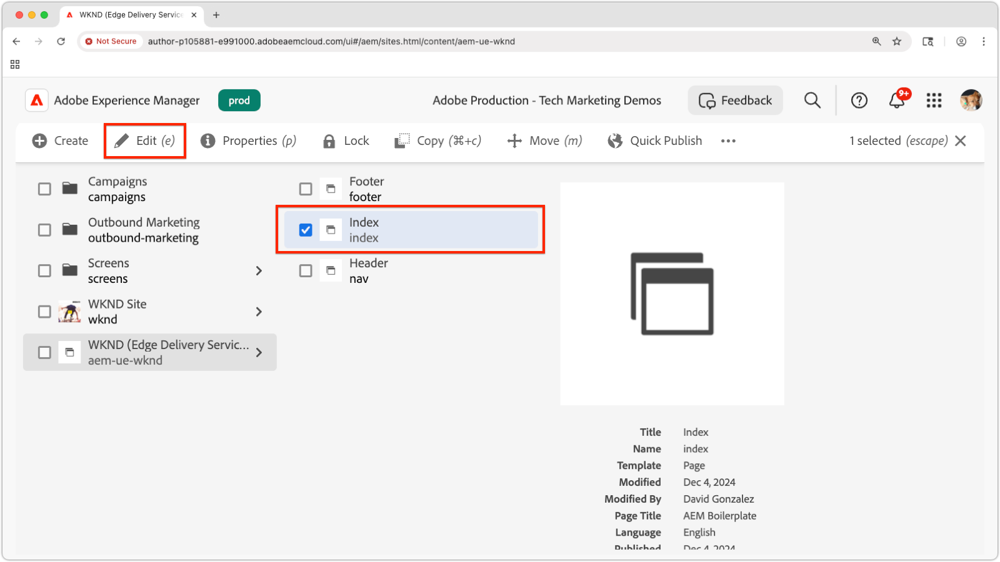

# Anzeigen einer Vorschau einer lokalen Erweiterung des universellen Editors

>[!TIP]
> Erfahren Sie, wie Sie [eine Erweiterung des universellen Editors erstellen](https://developer.adobe.com/uix/docs/services/aem-universal-editor/).

Um bei der Entwicklung eine Vorschau einer Erweiterung des universellen Editors anzuzeigen, müssen Sie Folgendes tun:

1. die Erweiterung lokal ausführen.
2. das selbstsignierte Zertifikat akzeptieren.
3. eine Seite im universellen Editor öffnen.
4. die Standort-URL aktualisieren, um die lokale Erweiterung zu laden.

## Lokales Ausführen der Erweiterung

Hierbei wird davon ausgegangen, dass Sie bereits eine [Erweiterung des universellen Editors](https://developer.adobe.com/uix/docs/services/aem-universal-editor/) erstellt haben und lokal beim Testen und Entwickeln eine Vorschau dieser Erweiterung anzeigen möchten.

Starten Sie die Erweiterung des universellen Editors mit:

```bash
$ aio app run
```

Es werden Ausgaben wie die folgenden angezeigt:

```
To view your local application:
  -> https://localhost:9080
To view your deployed application in the Experience Cloud shell:
  -> https://experience.adobe.com/?devMode=true#/custom-apps/?localDevUrl=https://localhost:9080
```

Dadurch wird Ihre Erweiterung standardmäßig unter `https://localhost:9080` ausgeführt.


## Akzeptieren des selbstsignierten Zertifikats.

Der universelle Editor erfordert HTTPS zum Laden von Erweiterungen. Da die lokale Entwicklung ein selbstsigniertes Zertifikat verwendet, muss Ihr Browser diesem Zertifikat explizit vertrauen.

Öffnen Sie einen neuen Browser-Tab, und navigieren Sie zur URL der lokalen Erweiterung, die über den Befehl `aio app run` ausgegeben wird:

```
https://localhost:9080
```

Ihr Browser zeigt eine Zertifikatswarnung an. Akzeptieren Sie das Zertifikat, um fortzufahren.


Nach dem Akzeptieren wird die Platzhalterseite der lokalen Erweiterung angezeigt:


## Öffnen Sie eine Seite im universellen Editor.

Öffnen Sie den universellen Editor über die [Konsole des universellen Editors](https://experience.adobe.com/#/@myOrg/aem/editor/canvas/) oder indem Sie eine Seite in AEM Sites bearbeiten, die den universellen Editor verwendet:




## Laden der Erweiterung

Suchen Sie im universellen Editor das Feld **Speicherort** oben in der Mitte der Benutzeroberfläche. Erweitern Sie das Feld, und aktualisieren Sie die **URL im Feld „Speicherort“**, **nicht in der Browser-Adressleiste**.

Fügen Sie die folgenden Abfrageparameter an:

* `devMode=true` – Aktiviert den Entwicklungsmodus für den universellen Editor.
* `ext=https://localhost:9080` – Lädt die lokal ausgeführte Erweiterung.

Zum Beispiel:

```
https://author-pXXX-eXXX.adobeaemcloud.com/content/aem-ue-wknd/index.html?devMode=true&ext=https://localhost:9080
```


## Anzeigen einer Vorschau der Erweiterung

Führen Sie einen **harten Neustart** des Browsers durch, um sicherzustellen, dass die aktualisierte URL verwendet wird.

Der universelle Editor lädt jetzt Ihre lokale Erweiterung – nur in Ihrer Browser-Sitzung.

Alle Code-Änderungen, die Sie lokal vornehmen, werden sofort übernommen.


