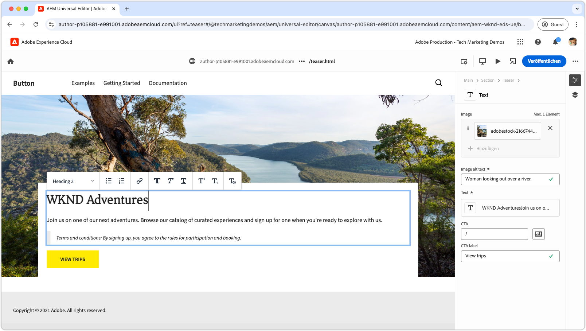

# Videos zu Edge Delivery Services

Erfahren Sie, wie Sie mit Edge Delivery Services schnelle Websites erstellen.

>[!VIDEO](https://video.tv.adobe.com/v/3427989/?learn=on)

Umfassende Details zu Edge Delivery Services samt Funktionen finden Sie in der zugehörigen [Dokumentation](https://experienceleague.adobe.com/de/docs/experience-manager-cloud-service/content/edge-delivery/overview).

## Entwickler-Tutorials für Edge Delivery Services

<!-- CARDS 

* https://experienceleague.adobe.com/en/docs/experience-manager-cloud-service/content/edge-delivery/build/tutorial
  {title = Document-based authoring and Edge Delivery Services tutorial}
  {description = Learn how to create Edge Delivery Services web sites authored using Document-based authoring.}
  {cta = Start the tutorial}

* ./developing/universal-editor/0-overview.md
  {title = Universal Editor and Edge Delivery Services tutorial}
  {description = Learn the basics of creating an Edge Delivery Services web sites authored with Universal Editor.}
  {cta = Start the tutorial}

-->
<!-- START CARDS HTML - DO NOT MODIFY BY HAND -->

    

        

            

                <figure class="image x-is-16by9">
                    
                </figure>
            

            

                

                    

                        <a href="https://experienceleague.adobe.com/de/docs/experience-manager-cloud-service/content/edge-delivery/build/tutorial" target="_blank" rel="referrer" title="Tutorial zum dokumentenbasierten Authoring und Edge Delivery Services">Tutorial zum dokumentenbasierten Authoring und Edge Delivery Services</a>
                    

                    
Erfahren Sie, wie Sie unter Verwendung von dokumentenbasiertem Authoring Edge Delivery Services-Websites erstellen.

                

                <a href="https://experienceleague.adobe.com/de/docs/experience-manager-cloud-service/content/edge-delivery/build/tutorial" target="_blank" rel="referrer" class="spectrum-Button spectrum-Button--outline spectrum-Button--primary spectrum-Button--sizeM" style="align-self: flex-start; margin-top: 1rem;">
Tutorial starten
</a>
            

        

    

    

        

            

                <figure class="image x-is-16by9">
                    
                </figure>
            

            

                

                    

                        <a href="./developing/universal-editor/0-overview.md" target="_blank" rel="referrer" title="Tutorial zum universellen Editor und zu Edge Delivery Services">Tutorial zum universellen Editor und zu Edge Delivery Services</a>
                    

                    
Hier finden Sie die Grundlagen zum Erstellen von Edge Delivery Services-Websites mit dem universellen Editor.

                

                <a href="./developing/universal-editor/0-overview.md" target="_blank" rel="referrer" class="spectrum-Button spectrum-Button--outline spectrum-Button--primary spectrum-Button--sizeM" style="align-self: flex-start; margin-top: 1rem;">
Tutorial starten
</a>
            

        

    

<!-- END CARDS HTML - DO NOT MODIFY BY HAND -->

## Erste Schritte mit Edge Delivery Services

    <!-- Prerequisites -->
    

      

        

          <figure class="image is-16by9">
            
          </figure>
        

        

          

            
5 Minuten

            

              <a href="./developing/prerequisites.md" title="Voraussetzungen">Entwicklervoraussetzungen</a>
            

            
Was Sie benötigen, um mit der Entwicklung mit Edge Delivery Services zu beginnen.

            <a href="./developing/prerequisites.md" class="spectrum-Button
              spectrum-Button--outline spectrum-Button--primary
              spectrum-Button--sizeM">
Video ansehen
</a>
          

        

      

    
 
    <!-- Setting up your Repository-->
    

      

        

          <figure class="image is-16by9">
            
          </figure>
        

        

          

            
1 Minute

            

              <a href="./developing/aem-boilerplate.md" title="Verwenden der Textbausteinvorlage">AEM-Textbausteine</a>
            

            
Verwenden Sie die AEM-Textbausteinvorlage, um das Code-Repository einzurichten.

            <a href="./developing/aem-boilerplate.md" class="spectrum-Button
              spectrum-Button--outline spectrum-Button--primary
              spectrum-Button--sizeM">
Video ansehen
</a>
          

        

      

    

    <!-- Linking Google Drive -->
    

      

        

          <figure class="image is-16by9">
            
          </figure>
        

        

          

            
1 Minute

            

              <a href="./developing/content-repository.md" title="Verknüpfen von Google Drive">Verknüpfen von Google Drive</a>
            

            
Verwenden Sie Google Drive als Repository für alle Inhalte.

            <a href="./developing/content-repository.md" class="spectrum-Button
              spectrum-Button--outline spectrum-Button--primary
              spectrum-Button--sizeM">
Video ansehen
</a>
          

        

      

    

    <!-- Link Sharepoint --->
    

      

        

          <figure class="image is-16by9">
            
          </figure>
        

        

          

            
1 Minute

            

              <a href="./developing/content-repository.md" title="Verknüpfen von SharePoint">Verknüpfen von SharePoint</a>
            

            
Verwenden Sie SharePoint als Repository für all Ihre Inhalte.

            <a href="./developing/content-repository.md"
              class="spectrum-Button spectrum-Button--outline
              spectrum-Button--primary spectrum-Button--sizeM">
Video ansehen
</a>
          

        

      

    

    <!-- Previewing and Publishing Content -->
    

      

        

          <figure class="image is-16by9">
            
          </figure>
        

        

          

            
1 Minute

            

              <a href="./developing/preview-and-publish.md" title="Anzeigen einer Vorschau und Veröffentlichen der Inhalte">Anzeigen einer Vorschau und Veröffentlichen der Inhalte</a>
            

            
Zeigen Sie eine Vorschau an und veröffentlichen Sie Inhalt mithilfe von AEM Sidekick.

            <a href="./developing/preview-and-publish.md" class="spectrum-Button
              spectrum-Button--outline spectrum-Button--primary
              spectrum-Button--sizeM">
Video ansehen
</a>
          

        

      

    

    <!-- Using the Sidekick -->
    

      

        

          <figure class="image is-16by9">
            
          </figure>
        

        

          

            
1 Minute

            

              <a href="./developing/sidekick.md" title="Verwenden von Sidekick">Verwenden von AEM Sidekick</a>
            

            
Erfahren Sie, wie Sie den AEM Sidekick verwenden.

            <a href="./developing/sidekick.md" class="spectrum-Button
              spectrum-Button--outline spectrum-Button--primary
              spectrum-Button--sizeM">
Video ansehen
</a>
          

        

      

    

 <!-- Document Structure -->
    

      

        

          <figure class="image is-16by9">
            
          </figure>
        

        

          

            
1 Minute

            

              <a href="./developing/document-structure.md" title="Dokumentstruktur">Dokumentstruktur</a>
            

            
Sehen Sie sich die Dokumentstruktur an, einschließlich Standardinhalt, Abschnitte und Blöcke 

            <a href="./developing/document-structure.md" class="spectrum-Button
              spectrum-Button--outline spectrum-Button--primary
              spectrum-Button--sizeM">
Video ansehen
</a>
          

        

      

    
  
     <!--Local Development -->
    

      

        

          <figure class="image is-16by9">
            
          </figure>
        

        

          

            
2 Minuten

            

              <a href="./developing/local-development.md" title="Lokale Entwicklung">Lokale Entwicklung</a>
            

            
Konfigurieren Sie Ihre lokale Entwicklungsumgebung.

            <a href="./developing/local-development.md" class="spectrum-Button
              spectrum-Button--outline spectrum-Button--primary
              spectrum-Button--sizeM">
Video ansehen
</a>
          

        

      

    

    <!--Integrate with Git -->
    

      

        

          <figure class="image is-16by9">
            
          </figure>
        

        

          

            
2 Minuten

            

              <a href="./developing/git.md" title="Integrieren mit Git">Integrieren mit Git</a>
            

            
Konfigurieren Sie Git und Edge Delivery Services.

            <a href="./developing/git.md" class="spectrum-Button
              spectrum-Button--outline spectrum-Button--primary
              spectrum-Button--sizeM">
Video ansehen
</a>
          

        

      

    

## Videoanleitungen

    <!--Create RSS Feeds -->
    

      

        

          <figure class="image is-16by9">
            
          </figure>
        

        

          

            
2 Minuten

            

              <a href="./how-to/rss.md" title="Erstellen von RSS-Feeds">Erstellen von RSS-Feeds</a>
            

            
Erfahren Sie, wie Sie RSS-Feeds erstellen.

            <a href="./how-to/rss.md" class="spectrum-Button
              spectrum-Button--outline spectrum-Button--primary
              spectrum-Button--sizeM">
Video ansehen
</a>
          

        

      

    

    <!--Social Media Sharing -->
    

      

        

          <figure class="image is-16by9">
            
          </figure>
        

        

          

            
2 Minuten

            

              <a href="./how-to/social-media-sharing.md" title="Freigabe in Social Media">Freigabe in Social Media</a>
            

            
Erfahren Sie, wie Sie Ihren Inhalt für die Freigabe in Social Media optimieren.

            <a href="./how-to/social-media-sharing.md" class="spectrum-Button
              spectrum-Button--outline spectrum-Button--primary
              spectrum-Button--sizeM">
Video ansehen
</a>
          

        

      

    

    <!--Delete a Page -->
    

      

        

          <figure class="image is-16by9">
            
          </figure>
        

        

          

            
2 Minuten

            

              <a href="./how-to/delete-page.md" title="Löschen von Seiten">Löschen von Seiten</a>
            

            
Erfahren Sie, wie Sie Seiten löschen.

            <a href="./how-to/delete-page.md" class="spectrum-Button
              spectrum-Button--outline spectrum-Button--primary
              spectrum-Button--sizeM">
Video ansehen
</a>
          

        

      

    
    
  

