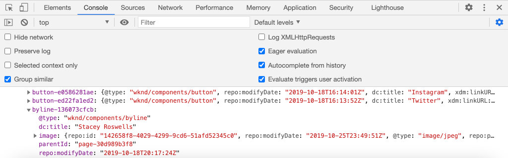

# Anpassen der Adobe Client-Datenschicht mit AEM Komponenten {#customize-data-layer}

Erfahren Sie, wie Sie die Adobe Client-Datenschicht mit Inhalten aus benutzerdefinierten AEM anpassen. Erfahren Sie, wie Sie die APIs verwenden, die von [AEM der zu erweiternden Kernkomponenten](https://experienceleague.adobe.com/docs/experience-manager-core-components/using/developing/data-layer/extending.html) und passen Sie die Datenschicht an.

## Was Sie erstellen werden


In diesem Tutorial werden verschiedene Optionen zur Erweiterung der Adobe Client-Datenschicht durch Aktualisierung des WKND untersucht. [Byte-Komponente](https://experienceleague.adobe.com/docs/experience-manager-learn/getting-started-wknd-tutorial-develop/project-archetype/custom-component.html). Die _Byte_ Komponente ist **benutzerdefinierte Komponente** und in diesem Tutorial gelernte Lektionen können auf andere benutzerdefinierte Komponenten angewendet werden.

### Ziele {#objective}

1. Fügen Sie Komponentendaten in die Datenschicht ein, indem Sie ein Sling-Modell und eine Komponenten-HTL erweitern.
1. Verwenden Sie Datenschichtprogramme der Kernkomponenten, um den Aufwand zu reduzieren
1. Verwenden Sie die Datenattribute der Kernkomponente , um in vorhandene Datenschichtereignisse einzubinden

## Voraussetzungen {#prerequisites}

A **lokale Entwicklungsumgebung** ist erforderlich, um dieses Tutorial abzuschließen. Screenshots und Videos werden mit dem AEM as a Cloud Service SDK erfasst, das auf einer macOS ausgeführt wird. Befehle und Code sind unabhängig vom lokalen Betriebssystem, sofern nicht anders angegeben.

**Neu bei AEM as a Cloud Service?** Sehen Sie sich die [Befolgen Sie die Anleitung zum Einrichten einer lokalen Entwicklungsumgebung mit dem AEM as a Cloud Service SDK.](https://experienceleague.adobe.com/docs/experience-manager-learn/cloud-service/local-development-environment-set-up/overview.html?lang=de).

**Neu bei AEM 6.5?** Sehen Sie sich die [Anleitung zum Einrichten einer lokalen Entwicklungsumgebung](https://experienceleague.adobe.com/docs/experience-manager-learn/foundation/development/set-up-a-local-aem-development-environment.html?lang=de).

## Herunterladen und Bereitstellen der WKND-Referenz-Website {#set-up-wknd-site}

In diesem Tutorial wird die Byline-Komponente auf der WKND-Referenz-Site erweitert. Klonen und installieren Sie die WKND-Codebasis in Ihrer lokalen Umgebung.

1. Starten eines lokalen Schnellstarts **author** Instanz AEM ausgeführt am [http://localhost:4502](http://localhost:4502).
1. Öffnen Sie ein Terminal-Fenster und klonen Sie die WKND-Codebasis mithilfe von Git:

   ```shell
   $ git clone git@github.com:adobe/aem-guides-wknd.git
   ```

1. Stellen Sie die WKND-Codebasis in einer lokalen Instanz von AEM bereit:

   ```shell
   $ cd aem-guides-wknd
   $ mvn clean install -PautoInstallSinglePackage
   ```

   >[!NOTE]
   >
   > Fügen Sie für AEM 6.5 und das neueste Service Pack die `classic` Profil zum Maven-Befehl:
   >
   > `mvn clean install -PautoInstallSinglePackage -Pclassic`

1. Öffnen Sie ein neues Browser-Fenster und melden Sie sich bei AEM an. Öffnen Sie eine **Magazin** wie: [http://localhost:4502/content/wknd/us/en/magazine/guide-la-skateparks.html](http://localhost:4502/content/wknd/us/en/magazine/guide-la-skateparks.html).

   

   Es sollte ein Beispiel der Byline-Komponente angezeigt werden, die der Seite als Teil eines Experience Fragment hinzugefügt wurde. Sie können das Experience Fragment unter [http://localhost:4502/editor.html/content/experience-fragments/wknd/language-masters/en/contributors/stacey-roswells/byline.html](http://localhost:4502/editor.html/content/experience-fragments/wknd/language-masters/en/contributors/stacey-roswells/byline.html)
1. Öffnen Sie Ihre Entwickler-Tools und geben Sie den folgenden Befehl in das **Konsole**:

   ```js
   window.adobeDataLayer.getState();
   ```

   Um den aktuellen Status der Datenschicht auf einer AEM Site anzuzeigen, überprüfen Sie die Antwort. Sie sollten Informationen über die Seite und einzelne Komponenten sehen.

   

   Beachten Sie, dass die Byline-Komponente nicht auf der Datenschicht aufgeführt ist.

## Aktualisieren des Byline Sling-Modells {#sling-model}

Um Daten über die Komponente in die Datenschicht einzufügen, aktualisieren wir zunächst das Sling-Modell der Komponente. Aktualisieren Sie als Nächstes die Java™-Schnittstelle und die Sling-Modell-Implementierung von Byline, um eine neue Methode zu erhalten. `getData()`. Diese Methode enthält die Eigenschaften, die in die Datenschicht eingefügt werden sollen.

1. Öffnen Sie die `aem-guides-wknd` -Projekt in der IDE Ihrer Wahl. Navigieren Sie zum `core` -Modul.
1. Öffnen Sie die Datei `Byline.java` unter `core/src/main/java/com/adobe/aem/guides/wknd/core/models/Byline.java`.

   

1. Fügen Sie folgende Methode zur -Schnittstelle hinzu:

   ```java
   public interface Byline {
       ...
       /***
        * Return data about the Byline Component to populate the data layer
        * @return String
        */
       String getData();
   }
   ```

1. Öffnen Sie die Datei `BylineImpl.java` unter `core/src/main/java/com/adobe/aem/guides/wknd/core/models/impl/BylineImpl.java`. Es ist die Umsetzung der `Byline` und wird als Sling-Modell implementiert.

1. Fügen Sie am Anfang der Datei die folgenden Importanweisungen hinzu:

   ```java
   import java.util.HashMap;
   import java.util.Map;
   import org.apache.sling.api.resource.Resource;
   import com.fasterxml.jackson.core.JsonProcessingException;
   import com.fasterxml.jackson.databind.ObjectMapper;
   import com.adobe.cq.wcm.core.components.util.ComponentUtils;
   ```

   Die `fasterxml.jackson` APIs werden verwendet, um die Daten zu serialisieren, die als JSON bereitgestellt werden sollen. Die `ComponentUtils` AEM Kernkomponenten werden verwendet, um zu überprüfen, ob die Datenschicht aktiviert ist.

1. Die nicht implementierte Methode hinzufügen `getData()` nach `BylineImple.java`:

   ```java
   public class BylineImpl implements Byline {
       ...
       @Override
       public String getData() {
           Resource bylineResource = this.request.getResource();
           // Use ComponentUtils to verify if the DataLayer is enabled
           if (ComponentUtils.isDataLayerEnabled(bylineResource)) {
   
               //Create a map of properties we want to expose
               Map<String, Object> bylineProperties = new HashMap<String,Object>();
               bylineProperties.put("@type", bylineResource.getResourceType());
               bylineProperties.put("name", this.getName());
               bylineProperties.put("occupation", this.getOccupations());
               bylineProperties.put("fileReference", image.getFileReference());
   
               //Use AEM Core Component utils to get a unique identifier for the Byline component (in case multiple are on the page)
               String bylineComponentID = ComponentUtils.getId(bylineResource, this.currentPage, this.componentContext);
   
               // Return the bylineProperties as a JSON String with a key of the bylineResource's ID
               try {
                   return String.format("{\"%s\":%s}",
                       bylineComponentID,
                       // Use the ObjectMapper to serialize the bylineProperties to a JSON string
                       new ObjectMapper().writeValueAsString(bylineProperties));
               } catch (JsonProcessingException e) {
   
                   LOGGER.error("Unable to generate dataLayer JSON string", e);
               }
   
           }
           // return null if the Data Layer is not enabled
           return null;
       }
   }
   ```

   In der obigen Methode wird eine neue `HashMap` wird verwendet, um die Eigenschaften zu erfassen, die als JSON verfügbar gemacht werden sollen. Beachten Sie, dass vorhandene Methoden wie `getName()` und `getOccupations()` verwendet werden. Die `@type` den eindeutigen Ressourcentyp der Komponente darstellt, ermöglicht es einem Client, Ereignisse und/oder Trigger anhand des Komponententyps einfach zu identifizieren.

   Die `ObjectMapper` wird verwendet, um die Eigenschaften zu serialisieren und eine JSON-Zeichenfolge zurückzugeben. Diese JSON-Zeichenfolge kann dann in die Datenschicht eingefügt werden.

1. Öffnen Sie ein Terminal-Fenster. Erstellen und Bereitstellen von nur `core` Modul unter Verwendung Ihrer Maven-Fähigkeiten:

   ```shell
   $ cd aem-guides-wknd/core
   $ mvn clean install -PautoInstallBundle
   ```

## Aktualisieren der Byline-HTL {#htl}

Aktualisieren Sie anschließend die `Byline` [HTL](https://experienceleague.adobe.com/docs/experience-manager-htl/content/specification.html?lang=en). HTL (HTML-Vorlagensprache) ist die Vorlage zum Rendern der HTML der Komponente.

Ein spezielles Datenattribut `data-cmp-data-layer` auf jeder AEM Komponente verwendet wird, um ihre Datenschicht anzuzeigen. Von AEM Kernkomponenten bereitgestelltes JavaScript sucht nach diesem Datenattribut. Der Wert dieses Datenattributs wird mit der JSON-Zeichenfolge gefüllt, die von der `getData()` Methode und in die Adobe Client Data-Ebene eingefügt.

1. Öffnen Sie die `aem-guides-wknd` -Projekt in die IDE. Navigieren Sie zum `ui.apps` -Modul.
1. Öffnen Sie die Datei `byline.html` unter `ui.apps/src/main/content/jcr_root/apps/wknd/components/byline/byline.html`.

   

1. Aktualisieren `byline.html` , um `data-cmp-data-layer` Attribut:

   ```diff
     <div data-sly-use.byline="com.adobe.aem.guides.wknd.core.models.Byline"
       data-sly-use.placeholderTemplate="core/wcm/components/commons/v1/templates.html"
       data-sly-test.hasContent="${!byline.empty}"
   +   data-cmp-data-layer="${byline.data}"
       class="cmp-byline">
       ...
   ```

   Der Wert von `data-cmp-data-layer` wurde auf `"${byline.data}"` where `byline` ist das Sling-Modell, das zuvor aktualisiert wurde. `.data` ist die Standardnotation zum Aufrufen einer Java™ Getter-Methode in HTL von `getData()` in der vorangegangenen Übung umgesetzt.

1. Öffnen Sie ein Terminal-Fenster. Erstellen und Bereitstellen von nur `ui.apps` Modul unter Verwendung Ihrer Maven-Fähigkeiten:

   ```shell
   $ cd aem-guides-wknd/ui.apps
   $ mvn clean install -PautoInstallPackage
   ```

1. Kehren Sie zum Browser zurück und öffnen Sie die Seite mit einer Byline-Komponente erneut: [http://localhost:4502/content/wknd/us/en/magazine/guide-la-skateparks.html](http://localhost:4502/content/wknd/us/en/magazine/guide-la-skateparks.html).

1. Öffnen Sie die Entwickler-Tools und überprüfen Sie die HTML-Quelle der Seite für die Byline-Komponente:

   

   Sie sollten sehen, dass die Variable `data-cmp-data-layer` wurde mit der JSON-Zeichenfolge aus dem Sling-Modell gefüllt.

1. Öffnen Sie die Entwicklertools des Browsers und geben Sie den folgenden Befehl in die **Konsole**:

   ```js
   window.adobeDataLayer.getState();
   ```

1. Navigieren Sie unter der Antwort unter `component` , um die Instanz der `byline` wurde zur Datenschicht hinzugefügt:

   

   Es sollte ein Eintrag wie der folgende angezeigt werden:

   ```json
   byline-136073cfcb:
       @type: "wknd/components/byline"
       fileReference: "/content/dam/wknd/en/contributors/stacey-roswells.jpg"
       name: "Stacey Roswells"
       occupation: (3) ["Artist", "Photographer", "Traveler"]
       parentId: "page-30d989b3f8"
   ```

   Beachten Sie, dass die angezeigten Eigenschaften dieselben sind, die im Abschnitt `HashMap` im Sling-Modell.

## Klickereignis hinzufügen {#click-event}

Die Adobe Client-Datenschicht ist ereignisgesteuert und eines der häufigsten Ereignisse für den Trigger einer Aktion ist die `cmp:click` -Ereignis. Die AEM Kernkomponenten vereinfachen die Registrierung Ihrer Komponente mithilfe des Datenelements: `data-cmp-clickable`.

Klickbare Elemente sind normalerweise eine CTA-Schaltfläche oder ein Navigations-Link. Leider hat die Komponente &quot;Byline&quot;keine davon, aber wir registrieren sie auf jeden Fall, da dies für andere benutzerdefinierte Komponenten üblich sein könnte.

1. Öffnen Sie die `ui.apps` -Modul in Ihrer IDE
1. Öffnen Sie die Datei `byline.html` unter `ui.apps/src/main/content/jcr_root/apps/wknd/components/byline/byline.html`.

1. Aktualisieren `byline.html` , um `data-cmp-clickable` -Attribut im **name** element:

   ```diff
     <h2 class="cmp-byline__name" 
   +    data-cmp-clickable="${byline.data ? true : false}">
        ${byline.name}
     </h2>
   ```

1. Öffnen Sie ein neues Terminal. Erstellen und Bereitstellen von nur `ui.apps` Modul unter Verwendung Ihrer Maven-Fähigkeiten:

   ```shell
   $ cd aem-guides-wknd/ui.apps
   $ mvn clean install -PautoInstallPackage
   ```

1. Kehren Sie zum Browser zurück und öffnen Sie die Seite mit der hinzugefügten Byline-Komponente erneut: [http://localhost:4502/content/wknd/us/en/magazine/guide-la-skateparks.html](http://localhost:4502/content/wknd/us/en/magazine/guide-la-skateparks.html).

   Zum Testen unseres Ereignisses fügen wir mithilfe der Entwicklerkonsole manuell JavaScript hinzu. Siehe [Verwenden der Adobe Client-Datenschicht in Verbindung mit AEM Kernkomponenten](data-layer-overview.md) für ein Video dazu.

1. Öffnen Sie die Entwicklertools des Browsers und geben Sie die folgende Methode in die **Konsole**:

   ```javascript
   function bylineClickHandler(event) {
       var dataObject = window.adobeDataLayer.getState(event.eventInfo.path);
       if (dataObject != null && dataObject['@type'] === 'wknd/components/byline') {
           console.log("Byline Clicked!");
           console.log("Byline name: " + dataObject['name']);
       }
   }
   ```

   Diese einfache Methode sollte den Klick auf den Namen der Byline-Komponente verarbeiten.

1. Geben Sie die folgende Methode in die **Konsole**:

   ```javascript
   window.adobeDataLayer.push(function (dl) {
        dl.addEventListener("cmp:click", bylineClickHandler);
   });
   ```

   Die obige Methode überträgt einen Ereignis-Listener auf die Datenschicht, um auf die `cmp:click` -Ereignis und ruft die `bylineClickHandler`.

   >[!CAUTION]
   >
   > Es ist wichtig **not** , um den Browser während dieser Übung zu aktualisieren, da ansonsten das JavaScript-Konsolen-JavaScript verloren geht.

1. Im Browser mit dem **Konsole** öffnen, klicken Sie in der Komponente &quot;Byline&quot;auf den Namen des Autors:

   

   Die Konsolenmeldung sollte angezeigt werden. `Byline Clicked!` und den Namen der Byline.

   Die `cmp:click` -Ereignis ist am einfachsten einzubinden. Für komplexere Komponenten und zur Verfolgung anderer Verhaltensweisen ist es möglich, benutzerdefiniertes JavaScript hinzuzufügen, um neue Ereignisse hinzuzufügen und zu registrieren. Ein großartiges Beispiel ist die Karussellkomponente , die einen Trigger `cmp:show` -Ereignis immer dann, wenn eine Folie umgeschaltet wird. Siehe [Quellcode für weitere Details](https://github.com/adobe/aem-core-wcm-components/blob/main/content/src/content/jcr_root/apps/core/wcm/components/carousel/v1/carousel/clientlibs/site/js/carousel.js).

## Verwenden des DataLayerBuilder-Dienstprogramms {#data-layer-builder}

Zeitpunkt, zu dem das Sling-Modell [aktualisiert](#sling-model) Anfang des Kapitels haben wir uns dafür entschieden, die JSON-Zeichenfolge mithilfe einer `HashMap` und legen Sie jede Eigenschaft manuell fest. Diese Methode funktioniert in Bezug auf kleine einmalige Komponenten einwandfrei. Bei Komponenten, die die AEM Kernkomponenten erweitern, kann dies jedoch zu viel zusätzlichem Code führen.

eine Dienstprogrammklasse, `DataLayerBuilder`, besteht für den größten Teil der schweren Anhebung. Dadurch können Implementierungen nur die Eigenschaften erweitern, die sie benötigen. Aktualisieren wir das Sling-Modell, um die `DataLayerBuilder`.

1. Kehren Sie zur IDE zurück und navigieren Sie zur `core` -Modul.
1. Öffnen Sie die Datei `Byline.java` unter `core/src/main/java/com/adobe/aem/guides/wknd/core/models/Byline.java`.
1. Ändern Sie die `getData()` -Methode, um einen Typ von `ComponentData`

   ```java
   import com.adobe.cq.wcm.core.components.models.datalayer.ComponentData;
   ...
   public interface Byline {
       ...
       /***
        * Return data about the Byline Component to populate the data layer
        * @return ComponentData
        */
       ComponentData getData();
   }
   ```

   `ComponentData` ist ein Objekt, das von AEM Kernkomponenten bereitgestellt wird. Dies führt wie im vorherigen Beispiel zu einer JSON-Zeichenfolge, führt aber auch viele zusätzliche Arbeiten durch.

1. Öffnen Sie die Datei `BylineImpl.java` unter `core/src/main/java/com/adobe/aem/guides/wknd/core/models/impl/BylineImpl.java`.

1. Fügen Sie die folgenden Importanweisungen hinzu:

   ```java
   import com.adobe.cq.wcm.core.components.models.datalayer.ComponentData;
   import com.adobe.cq.wcm.core.components.models.datalayer.builder.DataLayerBuilder;
   ```

1. Ersetzen Sie die `getData()` -Methode mit der folgenden:

   ```java
   @Override
   public ComponentData getData() {
       Resource bylineResource = this.request.getResource();
       // Use ComponentUtils to verify if the DataLayer is enabled
       if (ComponentUtils.isDataLayerEnabled(bylineResource)) {
   
           return DataLayerBuilder.extending(getImage().getData()).asImageComponent()
               .withTitle(this::getName)
               .build();
   
       }
       // return null if the Data Layer is not enabled
       return null;
   }
   ```

   Die Byline-Komponente verwendet Teile der Bild-Kernkomponente erneut, um ein Bild anzuzeigen, das den Autor darstellt. Im obigen Snippet wird die [DataLayerBuilder](https://javadoc.io/doc/com.adobe.cq/core.wcm.components.core/latest/com/adobe/cq/wcm/core/components/models/datalayer/builder/ComponentDataBuilder.html) wird verwendet, um die Datenschicht der `Image` -Komponente. Dadurch wird das JSON-Objekt mit allen Daten zum verwendeten Bild vorausgefüllt. Es erfüllt auch einige der Routinefunktionen wie das Festlegen der `@type` und die eindeutige Kennung der Komponente. Beachten Sie, dass die Methode klein ist!

   Die einzige Eigenschaft erweiterte die `withTitle` wird durch den Wert von `getName()`.

1. Öffnen Sie ein Terminal-Fenster. Erstellen und Bereitstellen von nur `core` Modul unter Verwendung Ihrer Maven-Fähigkeiten:

   ```shell
   $ cd aem-guides-wknd/core
   $ mvn clean install -PautoInstallBundle
   ```

1. Kehren Sie zur IDE zurück und öffnen Sie die `byline.html` Datei unter `ui.apps`
1. Zu verwendende HTL aktualisieren `byline.data.json` , um die `data-cmp-data-layer` Attribut:

   ```diff
     <div data-sly-use.byline="com.adobe.aem.guides.wknd.core.models.Byline"
       data-sly-use.placeholderTemplate="core/wcm/components/commons/v1/templates.html"
       data-sly-test.hasContent="${!byline.empty}"
   -   data-cmp-data-layer="${byline.data}"
   +   data-cmp-data-layer="${byline.data.json}"
   ```

   Denken Sie daran, jetzt ein Objekt vom Typ `ComponentData`. Dieses Objekt enthält eine Getter-Methode `getJson()` und wird verwendet, um die `data-cmp-data-layer` -Attribut.

1. Öffnen Sie ein Terminal-Fenster. Erstellen und Bereitstellen von nur `ui.apps` Modul unter Verwendung Ihrer Maven-Fähigkeiten:

   ```shell
   $ cd aem-guides-wknd/ui.apps
   $ mvn clean install -PautoInstallPackage
   ```

1. Kehren Sie zum Browser zurück und öffnen Sie die Seite mit der hinzugefügten Byline-Komponente erneut: [http://localhost:4502/content/wknd/us/en/magazine/guide-la-skateparks.html](http://localhost:4502/content/wknd/us/en/magazine/guide-la-skateparks.html).
1. Öffnen Sie die Entwicklertools des Browsers und geben Sie den folgenden Befehl in die **Konsole**:

   ```js
   window.adobeDataLayer.getState();
   ```

1. Navigieren Sie unter der Antwort unter `component` , um die Instanz der `byline` component:

   

   Es sollte ein Eintrag wie der folgende angezeigt werden:

   ```json
   byline-136073cfcb:
       @type: "wknd/components/byline"
       dc:title: "Stacey Roswells"
       image:
           @type: "image/jpeg"
           repo:id: "142658f8-4029-4299-9cd6-51afd52345c0"
           repo:modifyDate: "2019-10-25T23:49:51Z"
           repo:path: "/content/dam/wknd/en/contributors/stacey-roswells.jpg"
           xdm:tags: []
       parentId: "page-30d989b3f8"
       repo:modifyDate: "2019-10-18T20:17:24Z"
   ```

   Beachten Sie, dass jetzt eine `image` -Objekt innerhalb der `byline` Komponenteneintrag. Dies enthält viel mehr Informationen über das Asset im DAM. Beachten Sie auch, dass `@type` und die eindeutige ID (in diesem Fall `byline-136073cfcb`) automatisch ausgefüllt wurden und die `repo:modifyDate` , der angibt, wann die Komponente geändert wurde.

## Zusätzliche Beispiele {#additional-examples}

1. Ein weiteres Beispiel für die Erweiterung der Datenschicht kann durch Überprüfen der `ImageList` -Komponente in der WKND-Codebasis:
   * `ImageList.java` - Java-Schnittstelle in der `core` -Modul.
   * `ImageListImpl.java` - Sling-Modell im `core` -Modul.
   * `image-list.html` - HTL-Vorlage im `ui.apps` -Modul.

   >[!NOTE]
   >
   > Es ist etwas schwieriger, benutzerdefinierte Eigenschaften wie `occupation` bei Verwendung der [DataLayerBuilder](https://javadoc.io/doc/com.adobe.cq/core.wcm.components.core/latest/com/adobe/cq/wcm/core/components/models/datalayer/builder/ComponentDataBuilder.html). Wenn Sie jedoch eine Kernkomponente erweitern, die ein Bild oder eine Seite enthält, spart das Dienstprogramm viel Zeit.

   >[!NOTE]
   >
   > Beim Erstellen einer erweiterten Datenschicht für Objekte, die in einer Implementierung wiederverwendet werden, wird empfohlen, die Datenschichtelemente in ihre eigenen Java™-Objekte zu extrahieren, die für die Datenschicht spezifisch sind. Beispielsweise haben die Commerce-Kernkomponenten Schnittstellen für `ProductData` und `CategoryData` da diese für viele Komponenten innerhalb einer Commerce-Implementierung verwendet werden können. Überprüfen [den Code im aem-cif-core-components-repo](https://github.com/adobe/aem-core-cif-components/tree/master/bundles/core/src/main/java/com/adobe/cq/commerce/core/components/datalayer) für weitere Details.

## Herzlichen Glückwunsch! {#congratulations}

Sie haben gerade einige Möglichkeiten untersucht, um die Adobe Client-Datenschicht mit AEM Komponenten zu erweitern und anzupassen!

## Zusätzliche Ressourcen {#additional-resources}

* [Dokumentation zur Adobe Client-Datenschicht](https://github.com/adobe/adobe-client-data-layer/wiki)
* [Datenschichtintegration mit den Kernkomponenten](https://github.com/adobe/aem-core-wcm-components/blob/main/DATA_LAYER_INTEGRATION.md)
* [Verwenden der Dokumentation zur Adobe Client-Datenschicht und zu Kernkomponenten](https://experienceleague.adobe.com/docs/experience-manager-core-components/using/developing/data-layer/overview.html?lang=de)
