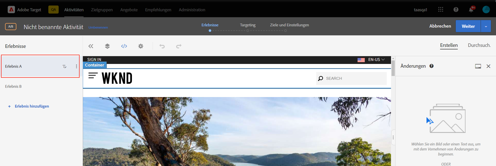
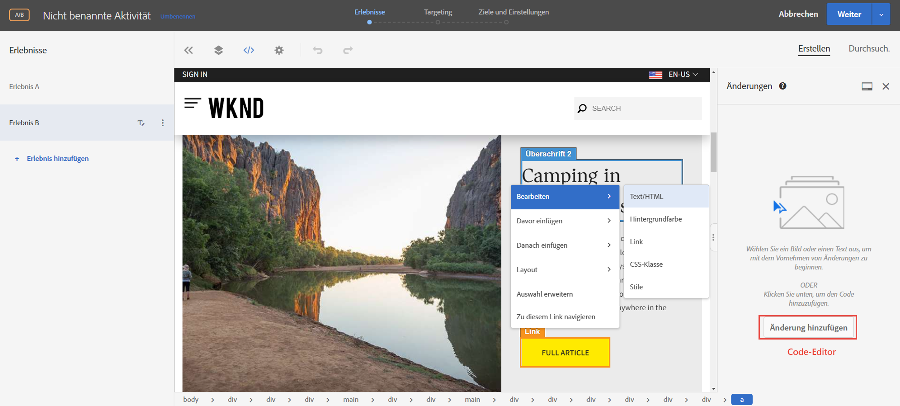
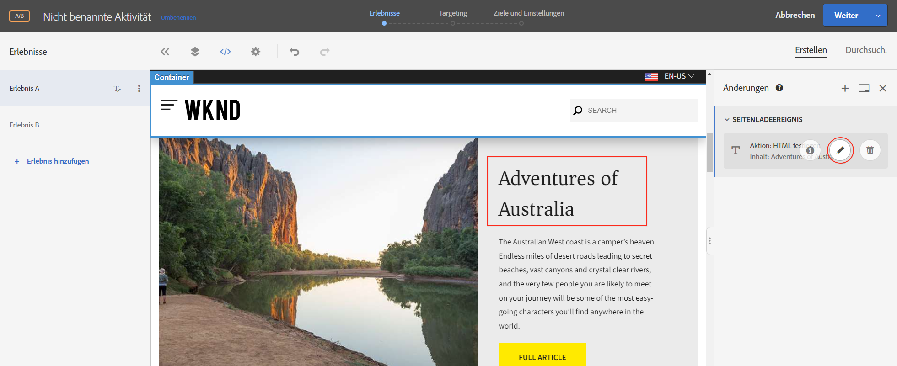
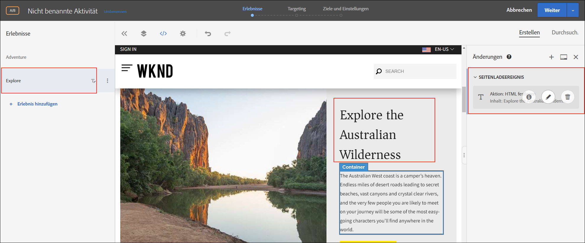
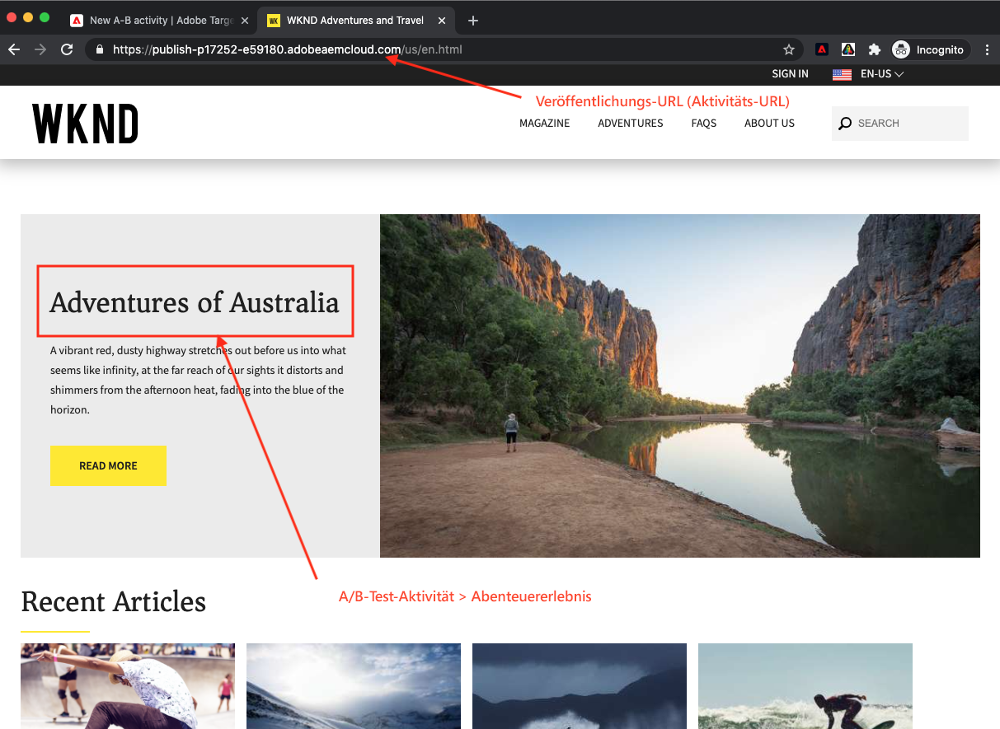

# Personalisierung mit Visual Experience Composer {#personalization-vec}

Erfahren Sie, wie Sie mit Visual Experience Composer (VEC) eine Aktivität zur A/B-Zielgruppe erstellen.

## Voraussetzungen

Zur Verwendung von VEC auf einer AEM Website muss die folgende Einrichtung abgeschlossen sein:

1. [hinzufügen von Adobe Target zu Ihrer AEM Website](./add-target-launch-extension.md)
1. [Trigger und Adobe Target-Aufruf von Launch](./load-and-fire-target.md)

## Szenario-Übersicht

Die WKND-Site-Startseite zeigt Aktivitäten oder das Beste, was man in einer Stadt mit Informationskarten machen kann. Als Vermarkter wurde Ihnen die Aufgabe zugewiesen, die Startseite zu ändern, indem Sie Textänderungen am Abenteuerabschnitt-Teaser vornehmen und verstehen, wie die Konvertierung verbessert wird.

## Schritte zum Erstellen eines A/B-Tests mit Visual Experience Composer (VEC)

1. Melden Sie sich bei [Adobe Experience Cloud](https://experience.adobe.com/) an, tippen Sie auf __Zielgruppe__ und navigieren Sie zur Registerkarte __Aktivitäten__

   + Wenn __Zielgruppe__ im Experience Cloud-Dashboard nicht angezeigt wird, stellen Sie sicher, dass im Organisationswechsel oben rechts die richtige Organisation für die Adobe ausgewählt ist und dass Sie unter [Adobe Admin Console](https://adminconsole.adobe.com/) Zugriff auf die Zielgruppe erhalten haben.

1. Klicken Sie auf die Schaltfläche **Aktivität erstellen** und wählen Sie dann **A/B-Test** Aktivität

   

1. Wählen Sie die Option **Visual Experience Composer**, geben Sie die Aktivitäten-URL ein und klicken Sie auf **Weiter**

   

1. Der Visual Experience Composer zeigt nach Erstellung einer neuen Aktivität auf der linken Seite zwei Registerkarten an: *Erlebnis A* und *Erlebnis B*. Wählen Sie ein Erlebnis aus der Liste. Mit der Schaltfläche **Hinzufügen Erlebnis** können Sie der Liste neue Erlebnisse hinzufügen.

   

1. Wählen Sie ein Bild oder einen Text auf Ihrer Seite aus, um Beginn, die Änderungen vornehmen, zu ändern oder den Code-Editor zum Auswählen und HTML-Element zu verwenden.

   

1. Ändern Sie den Text von *Camping in Westaustralien* in *Abenteuer in Australien*. Eine Liste der Änderungen, die zu einem Erlebnis hinzugefügt wurden, wird unter Änderungen angezeigt. Sie können auf das geänderte Element klicken und es bearbeiten, um dessen CSS-Selektor und den ihm hinzugefügten neuen Inhalt Ansicht.

   

1. Umbenennen von *Erlebnis A* in *Abenteuer*
1. Aktualisieren Sie den Text auf *Erlebnis B* von *Camping in Westaustralien* auf *Die australische Wildnis*.

   

1. Klicken Sie auf **Weiter**, um zum Targeting zu wechseln, und bewahren Sie die manuelle Traffic-Zuordnung von 50-50 zwischen den beiden Erlebnissen auf.

   

1. Wählen Sie für &quot;Ziele und Einstellungen&quot;die Quelle des Berichte als Adobe Target und wählen Sie die Metrik &quot;Ziel&quot;als &quot;Konversion&quot;mit einer Seitenaktion &quot;Ansicht&quot;aus.

   

1. Geben Sie einen Namen für Ihre Aktivität und Speichern ein.
1. Aktivieren Sie Ihre gespeicherte Aktivität, um Ihre Änderungen zu aktivieren.

   

1. Öffnen Sie Ihre Site-Seite (Aktivitäten-URL ab Schritt 3) in einer neuen Registerkarte, und Sie sollten in der Lage sein, eines der Erlebnisse (Abenteuer oder Erforschen) aus unserer A/B-Test-Aktivität Ansicht.

   

## Zusammenfassung

In diesem Kapitel konnte ein Marketingexperte mithilfe von Visual Experience Composer ein Erlebnis erstellen, indem er das Layout und den Inhalt einer Webseite per Drag &amp; Drop verschieben, austauschen und ändern konnte, ohne den Code zum Ausführen eines Tests zu ändern.

## Unterstützende Links

+ [Adobe Experience Cloud Debugger - Chrome](https://chrome.google.com/webstore/detail/adobe-experience-cloud-de/ocdmogmohccmeicdhlhhgepeaijenapj)
+ [Adobe Experience Cloud Debugger - Firefox](https://addons.mozilla.org/en-US/firefox/addon/adobe-experience-platform-dbg/)
