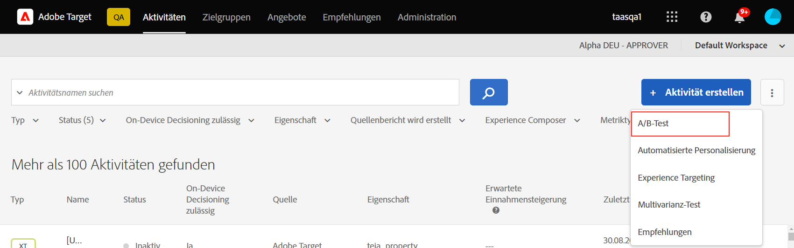
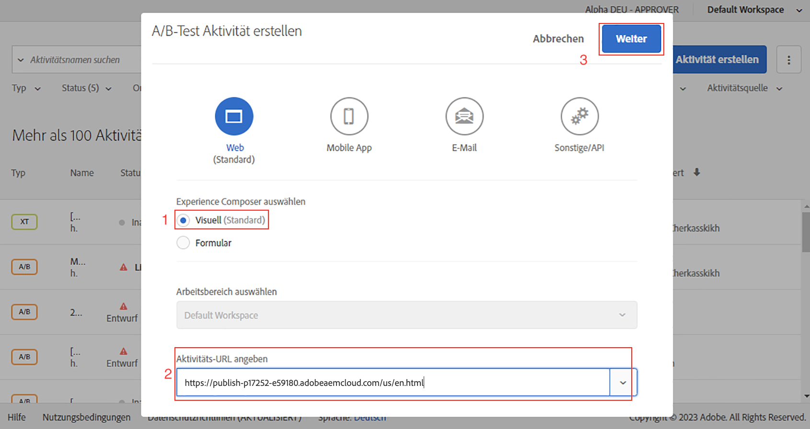
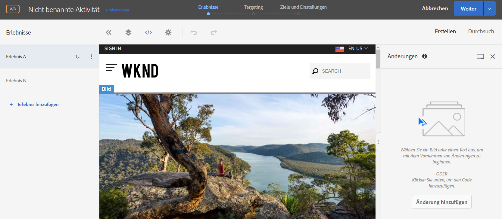
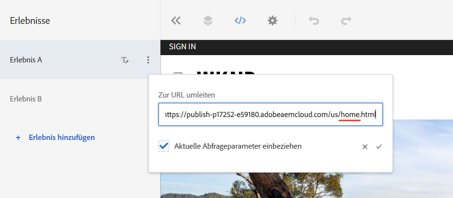
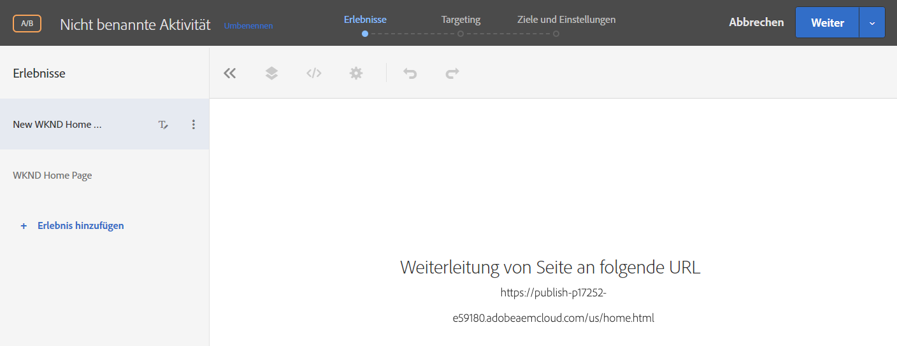
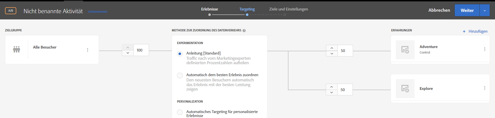
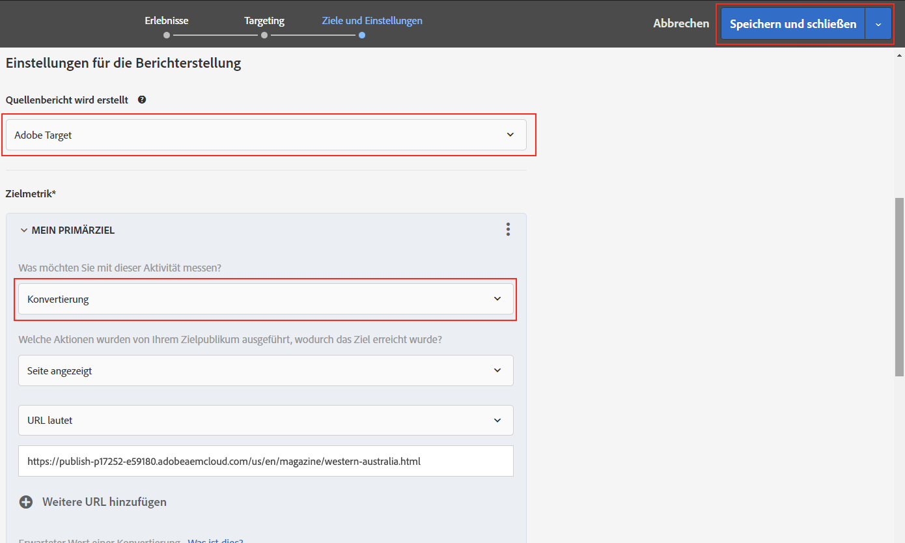
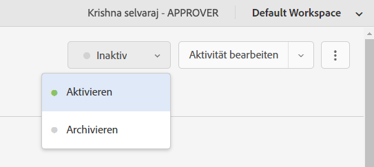
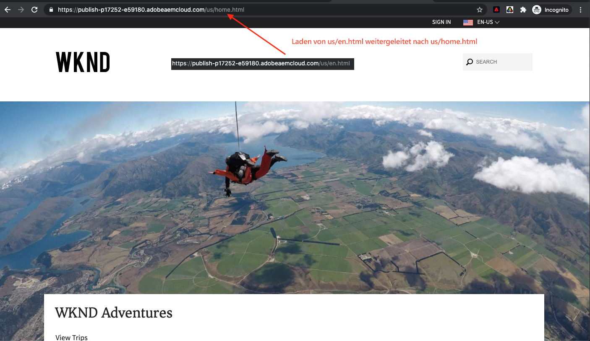

# Personalisierung des vollständigen Website-Erlebnisses {#personalization-fpe}

Erfahren Sie, wie Sie eine Aktivität erstellen, um Ihre Siteseiten, die auf AEM gehostet werden, mit Adobe Target auf eine neue Seite umzuleiten.

## Voraussetzungen

Um die vollständigen Seiten einer AEM Website personalisieren zu können, muss die folgende Einrichtung abgeschlossen sein:

1. [hinzufügen von Adobe Target zu Ihrer AEM Website](./add-target-launch-extension.md)
1. [Trigger und Adobe Target-Aufruf von Launch](./load-and-fire-target.md)

## Szenario - Übersicht

Die WKND-Site hat ihre Startseite neu gestaltet und möchte ihre aktuellen Besucher der Startseite in die neue Startseite umleiten. Gleichzeitig sollten Sie auch verstehen, wie die neu gestaltete Startseite zur Verbesserung der Benutzerinteraktion und des Umsatzes beiträgt. Als Vermarkter wurde Ihnen die Aufgabe zugewiesen, eine Aktivität zu erstellen, mit der die Besucher zur neuen Startseite umgeleitet werden. Lassen Sie uns die Startseite der WKND-Site erkunden und lernen, wie eine Aktivität mit Adobe Target erstellt wird.

## Schritte zum Erstellen eines A/B-Tests mit Visual Experience Composer (VEC)

1. Melden Sie sich bei Adobe Target an und navigieren Sie zur Registerkarte &quot;Aktivitäten&quot;.
1. Klicken Sie auf die Schaltfläche **Aktivität erstellen** und wählen Sie dann **A/B-Test** Aktivität

   

1. Wählen Sie die Option **Visual Experience Composer**, geben Sie die Aktivitäten-URL ein und klicken Sie auf **Weiter**

   

1. Der Visual Experience Composer zeigt nach Erstellung einer neuen Aktivität auf der linken Seite zwei Registerkarten an: *Erlebnis A* und *Erlebnis B*. Wählen Sie ein Erlebnis aus der Liste. Mit der Schaltfläche **Hinzufügen Erlebnis** können Sie der Liste neue Erlebnisse hinzufügen.

   

1. Für Erlebnis A verfügbare Optionen zur Ansicht und wählen Sie dann die Option **Zu URL** umleiten und geben Sie eine URL für die neue WKND-Site-Startseite ein.

   

1. Benennen Sie *Erlebnis A* in *Neue WKND-Startseite* und *Erlebnis B* in *WKND-Startseite* um.

   

1. Klicken Sie auf **Weiter**, um zum Targeting zu wechseln und eine manuelle Traffic-Zuordnung von 50-50 zwischen den beiden Erlebnissen beizubehalten.

   

1. Wählen Sie für &quot;Ziele und Einstellungen&quot;die Quelle des Berichte als Adobe Target und wählen Sie die Metrik &quot;Ziel&quot;als &quot;Konversion&quot;mit einer Seitenaktion &quot;Ansicht&quot;aus.

   

1. Geben Sie einen Namen für Ihre Aktivität und Speichern ein.
1. Aktivieren Sie Ihre gespeicherte Aktivität, um Ihre Änderungen zu aktivieren.

   

1. Öffnen Sie Ihre Site-Seite (Aktivität-URL ab Schritt 3) in einer neuen Registerkarte und Sie sollten in der Lage sein, eines der Erlebnisse (WKND-Startseite oder Neue WKND-Startseite) aus unserer A/B-Test-Aktivität Ansicht. `us/en.html` umleitet zu  `us/home.html`.

   

## Zusammenfassung

Als Vermarkter konnten Sie eine Aktivität erstellen, um Ihre auf AEM gehosteten Site-Seiten mit Adobe Target auf eine neue Seite umzuleiten.

## Unterstützende Links

* [Adobe Experience Cloud Debugger - Chrome](https://chrome.google.com/webstore/detail/adobe-experience-cloud-de/ocdmogmohccmeicdhlhhgepeaijenapj)
* [Adobe Experience Cloud Debugger - Firefox](https://addons.mozilla.org/en-US/firefox/addon/adobe-experience-platform-dbg/)

