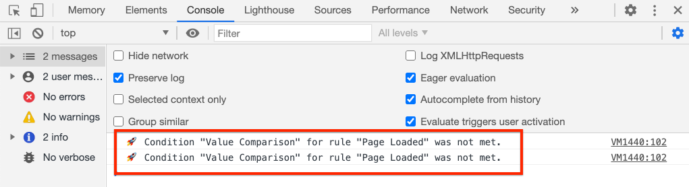

# Seitendaten mit Adobe Analytics erfassen

Hier erfahren Sie, wie Sie die integrierten Funktionen der [Adobe Client Data Layer mit AEM Core Components](https://docs.adobe.com/content/help/de-DE/experience-manager-core-components/using/developing/data-layer/overview.html) verwenden, um Daten zu einer Seite in Adobe Experience Manager Sites zu erfassen. [Experience Platform Launch und die Adobe Analytics-Erweiterung werden verwendet, um Regeln zum Senden von Seitendaten an Adobe Analytics zu erstellen.](https://www.adobe.com/experience-platform/launch.html)[](https://docs.adobe.com/content/help/de-DE/launch/using/extensions-ref/adobe-extension/analytics-extension/overview.html)

## Was Sie erstellen


In diesem Lernprogramm lösen Sie eine auf einem Ereignis aus der Adobe Client Data Layer basierende Startregel aus, fügen Bedingungen für den Zeitpunkt hinzu, zu dem die Regel ausgelöst werden soll, und senden die Seiten **a und** und **einer AEM an Adobe Analytics.**

### Ziele {#objective}

1. Erstellen einer Ereignis-basierten Regel beim Start basierend auf Änderungen an der Datenschicht
1. Seitendatenschichteigenschaften Datenelementen beim Start zuordnen
1. Seitendaten erfassen und mit dem Beacon für die Ansicht an Adobe Analytics senden

## Voraussetzungen

Folgendes ist erforderlich:

* **Experience Platform** LaunchProperty
* **Adobe** Analytics-Test-/Entwicklungs-Report Suite-ID und Tracking-Server. Siehe die folgende Dokumentation für [Erstellen einer neuen Report Suite](https://docs.adobe.com/content/help/en/analytics/admin/manage-report-suites/new-report-suite/new-report-suite.html).
* [Experience Platform ](https://docs.adobe.com/content/help/en/platform-learn/tutorials/data-ingestion/web-sdk/introduction-to-the-experience-platform-debugger.html) Debuggerbrowser-Erweiterung. Screenshots in diesem Tutorial, die aus dem Chrome-Browser erfasst wurden.
* (Optional) AEM Site mit aktivierter Adobe Client Data Layer](https://docs.adobe.com/content/help/en/experience-manager-core-components/using/developing/data-layer/overview.html#installation-activation). [ In diesem Lernprogramm wird die öffentlich zugängliche Website [https://wknd.site/us/en.html](https://wknd.site/us/en.html) verwendet, Sie können jedoch Ihre eigene Site verwenden.

>[!NOTE]
>
> Benötigen Sie Hilfe bei der Integration von Launch und Ihrer AEM Site? [Siehe diese Videoreihe](../experience-platform-launch/overview.md).

## Umgebung für den Start der WKND-Site wechseln

[https://wknd.](https://wknd.site) siteis ist eine öffentliche Website, die auf  [einem Open-Source-](https://github.com/adobe/aem-guides-wknd) Projekt basiert, das als Referenz und  [](https://docs.adobe.com/content/help/de-DE/experience-manager-learn/getting-started-wknd-tutorial-develop/overview.html) Lernprogramm für AEM Implementierungen konzipiert wurde.

Anstatt eine AEM Umgebung einzurichten und die WKND-Codebasis zu installieren, können Sie den Experience Platform-Debugger verwenden, um **switch** die live [https://wknd.site/](https://wknd.site/) zu *Ihre* Launch-Eigenschaft anzuzeigen. Natürlich können Sie Ihre eigene AEM-Site verwenden, wenn bereits die Client-Datenschicht der Adobe [aktiviert ist](https://docs.adobe.com/content/help/en/experience-manager-core-components/using/developing/data-layer/overview.html#installation-activation)

1. Melden Sie sich bei Experience Platform Launch an und [erstellen Sie eine Starteigenschaft](https://docs.adobe.com/content/help/en/core-services-learn/implementing-in-websites-with-launch/configure-launch/launch.html) (falls noch nicht geschehen).
1. Stellen Sie sicher, dass ein initialer Launch [Library erstellt und zu einer Launch [Umgebung](https://docs.adobe.com/content/help/en/launch/using/reference/publish/environments.html) beworben wurde.](https://docs.adobe.com/content/help/en/launch/using/reference/publish/libraries.html#create-a-library)
1. Kopieren Sie den Einbettungscode &quot;Start&quot;aus der Umgebung, in der Ihre Bibliothek veröffentlicht wurde.

   

1. Öffnen Sie in Ihrem Browser eine neue Registerkarte und navigieren Sie zu [https://wknd.site/](https://wknd.site/)
1. Öffnen Sie die Browsererweiterung &quot;Experience Platform Debugger&quot;

   

1. Navigieren Sie zu **Starten** > **Konfiguration** und ersetzen Sie unter **Eingefügte Einbettungscodes** den vorhandenen Einbettungscode starten durch *Ihren* Einbettungscode, der aus Schritt 3 kopiert wurde.

   

1. Aktivieren Sie den Debugger auf der Registerkarte &quot;WKND&quot;, indem Sie **Konsolenprotokollierung** und **Sperren** aktivieren.

   

## Adobe Client-Datenschicht auf WKND-Site überprüfen

Das [WKND-Referenzprojekt](https://github.com/adobe/aem-guides-wknd) wurde mit AEM Kernkomponenten erstellt und hat standardmäßig die [Adobe Client Data Layer aktiviert](https://docs.adobe.com/content/help/en/experience-manager-core-components/using/developing/data-layer/overview.html#installation-activation). Überprüfen Sie anschließend, ob die Adobe Client Data Layer aktiviert ist.

1. Navigieren Sie zu [https://wknd.site](https://wknd.site).
1. Öffnen Sie die Entwicklerwerkzeuge des Browsers und navigieren Sie zur **Konsole**. Führen Sie folgenden Befehl aus:

   ```js
   adobeDataLayer.getState();
   ```

   Dadurch wird der aktuelle Status der Client-Datenschicht der Adobe zurückgegeben.

   

1. Erweitern Sie die Antwort und überprüfen Sie den Eintrag `page`. Es sollte ein Schema wie das folgende angezeigt werden:

   ```json
   page-2eee4f8914:
       @type: "wknd/components/page"
       dc:description: "WKND is a collective of outdoors, music, crafts, adventure sports, and travel enthusiasts that want to share our experiences, connections, and expertise with the world."
       dc:title: "WKND Adventures and Travel"
       repo:modifyDate: "2020-08-31T21:02:21Z"
       repo:path: "/content/wknd/us/en.html"
       xdm:language: "en-US"
       xdm:tags: ["Attract"]
       xdm:template: "/conf/wknd/settings/wcm/templates/landing-page-template"
   ```

   Wir verwenden Standardeigenschaften, die von den Schemas [Page](https://docs.adobe.com/content/help/en/experience-manager-core-components/using/developing/data-layer/overview.html#page), `dc:title`, `xdm:language` und `xdm:template` der Datenschicht abgeleitet wurden, um Seitendaten an Adobe Analytics zu senden.

   >[!NOTE]
   >
   > Sehen Sie nicht das JavaScript-Objekt `adobeDataLayer`? Stellen Sie sicher, dass die Client-Datenschicht der Adobe [auf Ihrer Site aktiviert wurde.](https://docs.adobe.com/content/help/en/experience-manager-core-components/using/developing/data-layer/overview.html#installation-activation)

## Eine Regel zum Laden einer Seite erstellen

Die Adobe Client-Datenschicht ist eine **Ereignis**-gesteuerte Datenschicht. Wenn die AEM **Seite**-Datenschicht geladen wird, löst sie ein Ereignis `cmp:show` aus. Erstellen Sie eine Regel, die basierend auf dem `cmp:show`-Ereignis ausgelöst wird.

1. Navigieren Sie zum Experience Platform Launch und zur Webeigenschaft, die in die AEM Site integriert ist.
1. Navigieren Sie zum Abschnitt **Regeln** in der Benutzeroberfläche &quot;Starten&quot;und klicken Sie dann auf **Neue Regel erstellen**.

   

1. Benennen Sie die Regel **Seite geladen**.
1. Klicken Sie auf **Ereignisse** **Hinzufügen**, um den Assistenten **Ereignis-Konfiguration** zu öffnen.
1. Wählen Sie unter **Ereignistyp** **Benutzerspezifischer Code**.

   

1. Klicken Sie im Hauptbereich auf **Editor öffnen** und geben Sie das folgende Codefragment ein:

   ```js
   var pageShownEventHandler = function(evt) {
      // defensive coding to avoid a null pointer exception
      if(evt.hasOwnProperty("eventInfo") && evt.eventInfo.hasOwnProperty("path")) {
         //trigger Launch Rule and pass event
         console.debug("cmp:show event: " + evt.eventInfo.path);
         var event = {
            //include the path of the component that triggered the event
            path: evt.eventInfo.path,
            //get the state of the component that triggered the event
            component: window.adobeDataLayer.getState(evt.eventInfo.path)
         };
   
         //Trigger the Launch Rule, passing in the new `event` object
         // the `event` obj can now be referenced by the reserved name `event` by other Launch data elements
         // i.e `event.component['someKey']`
         trigger(event);
      }
   }
   
   //set the namespace to avoid a potential race condition
   window.adobeDataLayer = window.adobeDataLayer || [];
   //push the event listener for cmp:show into the data layer
   window.adobeDataLayer.push(function (dl) {
      //add event listener for `cmp:show` and callback to the `pageShownEventHandler` function
      dl.addEventListener("cmp:show", pageShownEventHandler);
   });
   ```

   Das obige Codefragment fügt einen Ereignis-Listener hinzu, indem [eine Funktion](https://github.com/adobe/adobe-client-data-layer/wiki#pushing-a-function) in die Datenschicht gedrückt wird. Wenn das Ereignis `cmp:show` ausgelöst wird, wird die Funktion `pageShownEventHandler` aufgerufen. In dieser Funktion werden einige Sanitätsprüfungen hinzugefügt und ein neuer `event` wird mit dem neuesten [Status der Datenschicht](https://github.com/adobe/adobe-client-data-layer/wiki#getstate) für die Komponente erstellt, die das Ereignis ausgelöst hat.

   Danach wird `trigger(event)` aufgerufen. `trigger()` ist ein reservierter Name in Launch und löst die Launch-Regel aus. Wir übergeben das `event`-Objekt als Parameter, der wiederum durch einen anderen reservierten Namen in Launch namens `event` verfügbar gemacht wird. Datenelemente in Launch können jetzt auf verschiedene Eigenschaften verweisen: `event.component['someKey']`.

1. Speichern Sie die Änderungen.
1. Klicken Sie anschließend unter **Aktionen** auf **Hinzufügen**, um den Assistenten **Aktionskonfiguration** zu öffnen.
1. Wählen Sie unter **Aktionstyp** **Benutzerspezifischer Code**.

   

1. Klicken Sie im Hauptbereich auf **Editor öffnen** und geben Sie das folgende Codefragment ein:

   ```js
   console.debug("Page Loaded ");
   console.debug("Page name: " + event.component['dc:title']);
   console.debug("Page type: " + event.component['@type']);
   console.debug("Page template: " + event.component['xdm:template']);
   ```

   Das `event`-Objekt wird von der `trigger()`-Methode übergeben, die im benutzerdefinierten Ereignis aufgerufen wird. `component` ist die aktuelle Seite, die von der Datenschicht  `getState` im benutzerdefinierten Ereignis abgeleitet wird. Rufen Sie das [Page-Schema](https://docs.adobe.com/content/help/en/experience-manager-core-components/using/developing/data-layer/overview.html#page), das von der Datenschicht offen gelegt wird, erneut auf, um die verschiedenen Tasten sofort sichtbar zu machen.

1. Speichern Sie die Änderungen und führen Sie einen [Build](https://docs.adobe.com/content/help/en/launch/using/reference/publish/builds.html) in Launch aus, um den Code für die [Umgebung](https://docs.adobe.com/content/help/en/launch/using/reference/publish/environments.html) zu bewerben, die auf Ihrer AEM Site verwendet wird.

   >[!NOTE]
   >
   > Es kann sehr hilfreich sein, den [Adobe Experience Platform Debugger](https://docs.adobe.com/content/help/en/platform-learn/tutorials/data-ingestion/web-sdk/introduction-to-the-experience-platform-debugger.html) zu verwenden, um den Einbettungscode auf eine **Development**-Umgebung umzuschalten.

1. Navigieren Sie zu Ihrer AEM Website und öffnen Sie die Entwicklerwerkzeuge, um die Konsole Ansicht. Aktualisieren Sie die Seite und Sie sollten sehen, dass die Konsolenmeldungen protokolliert wurden:

   

## Datenelemente erstellen

Anschließend erstellen Sie mehrere Datenelemente, um verschiedene Werte aus der Adobe Client Data Layer zu erfassen. Wie in der vorherigen Übung gesehen haben wir gesehen, ist es möglich, direkt über benutzerspezifischen Code auf die Eigenschaften der Datenschicht zuzugreifen. Der Vorteil bei der Verwendung von Datenelementen besteht darin, dass sie in allen Startregeln wiederverwendet werden können.

Erinnern Sie sich an das [Page-Schema](https://docs.adobe.com/content/help/en/experience-manager-core-components/using/developing/data-layer/overview.html#page), das von der Datenschicht offen gelegt wird:

Datenelemente werden den Eigenschaften `@type`, `dc:title` und `xdm:template` zugeordnet.

### Komponentenressourcentyp

1. Navigieren Sie zum Experience Platform Launch und zur Webeigenschaft, die in die AEM Site integriert ist.
1. Navigieren Sie zum Abschnitt **Datenelemente** und klicken Sie auf **Neues Datenelement erstellen**.
1. Geben Sie für **Name** **Komponentenressource-Typ** ein.
1. Wählen Sie für **Datenelementtyp** **Benutzerspezifischer Code**.

   

1. Klicken Sie auf **Editor öffnen** und geben Sie Folgendes im Editor für benutzerspezifischen Code ein:

   ```js
   if(event && event.component && event.component.hasOwnProperty('@type')) {
       return event.component['@type'];
   }
   ```

   Speichern Sie die Änderungen.

   >[!NOTE]
   >
   > Denken Sie daran, dass das `event`-Objekt auf der Grundlage des Ereignisses, das die **Regel** beim Starten ausgelöst hat, verfügbar gemacht und in Scoping gesetzt wird. Der Wert eines Datenelements wird erst festgelegt, wenn das Datenelement in einer Regel *referenziert* ist. Daher ist es sicher, dieses Datenelement innerhalb einer Regel zu verwenden, wie z. B. die im vorherigen Schritt *aber* erstellte Regel **Seitenladevorgang**, die in anderen Kontexten nicht sicher verwendet werden kann.

### Seitenname

1. Klicken Sie auf **Hinzufügen Datenelement**.
1. Geben Sie für **Name** **Seitenname** ein.
1. Wählen Sie für **Datenelementtyp** **Benutzerspezifischer Code**.
1. Klicken Sie auf **Editor öffnen** und geben Sie Folgendes im Editor für benutzerspezifischen Code ein:

   ```js
   if(event && event.component && event.component.hasOwnProperty('dc:title')) {
       return event.component['dc:title'];
   }
   ```

   Speichern Sie die Änderungen.

### Seitenvorlage

1. Klicken Sie auf **Hinzufügen Datenelement**.
1. Geben Sie für **Name** **Seitenvorlage** ein.
1. Wählen Sie für **Datenelementtyp** **Benutzerspezifischer Code**.
1. Klicken Sie auf **Editor öffnen** und geben Sie Folgendes im Editor für benutzerspezifischen Code ein:

   ```js
   if(event && event.component && event.component.hasOwnProperty('xdm:template')) {
       return event.component['xdm:template'];
   }
   ```

   Speichern Sie die Änderungen.

1. Sie sollten jetzt drei Datenelemente als Teil Ihrer Regel haben:

   

## hinzufügen der Analytics-Erweiterung

Fügen Sie dann der Eigenschaft &quot;Start&quot;die Analytics-Erweiterung hinzu. Wir müssen diese Daten irgendwo senden!

1. Navigieren Sie zum Experience Platform Launch und zur Webeigenschaft, die in die AEM Site integriert ist.
1. Gehen Sie zu **Erweiterungen** > **Katalog**
1. Suchen Sie die Erweiterung **Adobe Analytics** und klicken Sie auf **Installieren**

   

1. Geben Sie unter **Bibliotheksverwaltung** > **Report Suites** die Report Suite-ID ein, die Sie für jede Launch-Umgebung verwenden möchten.

   

   >[!NOTE]
   >
   > In diesem Lernprogramm können Sie eine Report Suite für alle Umgebung verwenden. In Wirklichkeit sollten Sie jedoch separate Report Suites verwenden, wie im folgenden Bild dargestellt.

   >[!TIP]
   >
   >Es wird empfohlen, die Option *Bibliothek für mich verwalten* als Bibliotheksverwaltungseinstellung zu verwenden, da es wesentlich einfacher ist, die `AppMeasurement.js`-Bibliothek auf dem neuesten Stand zu halten.

1. Markieren Sie das Kästchen, um **Activity Map** zu aktivieren.

   

1. Geben Sie unter **Allgemein** > **Tracking-Server** Ihren Tracking-Server ein, z. B. `tmd.sc.omtrdc.net`. Geben Sie Ihren SSL-Tracking-Server ein, wenn Ihre Site `https://` unterstützt

   

1. Klicken Sie auf **Speichern**, um die Änderungen zu speichern.

## hinzufügen einer Bedingung für die Regel &quot;Seite geladen&quot;

Aktualisieren Sie anschließend die Regel **Seitenladevorgang**, um das Datenelement **Komponentenressource-Typ** zu verwenden, um sicherzustellen, dass die Regel nur ausgelöst wird, wenn das `cmp:show`-Ereignis für **page** gilt. Andere Komponenten können das Ereignis `cmp:show` auslösen, z. B. wird es von der Karussell-Komponente ausgelöst, wenn sich die Folien ändern. Daher ist es wichtig, eine Bedingung für diese Regel hinzuzufügen.

1. Navigieren Sie in der Benutzeroberfläche &quot;Start&quot;zur zuvor erstellten Regel **Seite geladen**.
1. Klicken Sie unter **Conditions** auf **Hinzufügen**, um den Assistenten **Bedingungskonfiguration** zu öffnen.
1. Wählen Sie für **Bedingungstyp** **Wertvergleich**.
1. Legen Sie den ersten Wert im Formularfeld auf `%Component Resource Type%` fest. Sie können das Datenelementsymbol  verwenden, um das Datenelement **Komponentenressource-Typ** auszuwählen. Lassen Sie den Komparator auf `Equals` eingestellt.
1. Setzen Sie den zweiten Wert auf `wknd/components/page`.

   

   >[!NOTE]
   >
   > Sie können diese Bedingung in die benutzerdefinierte Codefunktion einfügen, die auf das zuvor im Lernprogramm erstellte `cmp:show`-Ereignis überwacht. Das Hinzufügen dieser Funktion in der Benutzeroberfläche ermöglicht jedoch zusätzliche Sichtbarkeit für weitere Benutzer, die möglicherweise Änderungen an der Regel vornehmen müssen. Außerdem können wir unser Datenelement verwenden!

1. Speichern Sie die Änderungen.

## Festlegen von Analytics-Variablen und Auslösen des Beacons für die Ansicht von Seiten

Derzeit gibt die Regel **Seite geladen** einfach eine Konsolenanweisung aus. Verwenden Sie anschließend die Datenelemente und die Analytics-Erweiterung, um Analytics-Variablen als **Aktion** in der Regel **Seite geladen** festzulegen. Wir werden außerdem eine zusätzliche Aktion einrichten, um das **Seitenbeacon** auszulösen und die erfassten Daten an Adobe Analytics zu senden.

1. In der Regel **Seite geladen** **entfernen** die Aktion **Core - Benutzerspezifischer Code** (die Konsolenanweisungen):

   

1. Klicken Sie unter Aktionen auf **Hinzufügen**, um eine neue Aktion hinzuzufügen.
1. Legen Sie den Typ **Extension** auf **Adobe Analytics** fest und setzen Sie **Aktionstyp** auf **Variablen festlegen**

   

1. Wählen Sie im Hauptbereich eine verfügbare **eVar** und legen Sie als Wert des Datenelements **Seitenvorlage** fest. Verwenden Sie das Symbol Datenelemente , um das Element **Seitenvorlage** auszuwählen.

   

1. Blättern Sie nach unten, stellen Sie unter **Weitere Einstellungen** **Seitenname** auf das Datenelement **Seitenname** ein:

   

   Speichern Sie die Änderungen.

1. Fügen Sie anschließend rechts neben dem Symbol **Adobe Analytics - Variablen setzen** eine weitere Aktion hinzu, indem Sie auf das Symbol **Plus** tippen:

   

1. Legen Sie den Typ **Extension** auf **Adobe Analytics** fest und setzen Sie **Aktionstyp** auf **Beacon senden**. Da dies als Ansicht der Seite gilt, belassen Sie den Standard-Verfolgungssatz auf **`s.t()`**.

   

1. Speichern Sie die Änderungen. Die Regel **Seite geladen** sollte jetzt die folgende Konfiguration aufweisen:

   

   * **1.** Hör auf das  `cmp:show` Ereignis!
   * **2.** Überprüfen Sie, ob das Ereignis durch eine Seite ausgelöst wurde.
   * **3.** Festlegen von Analytics-Variablen für  **Seitennamen** und  **Seitenvorlage**
   * **4.** Beacon für die Ansicht der Analytics-Seite senden
1. Speichern Sie alle Änderungen und erstellen Sie Ihre Startbibliothek, indem Sie die entsprechende Umgebung verwenden.

## Validieren des Beacon- und Analytics-Aufrufs für die Ansicht der Seite

Nachdem nun die Regel **Seitenladevorgang** den Analytics-Beacon sendet, sollten Sie die Analytics-Verfolgungsvariablen mit dem Experience Platform-Debugger sehen können.

1. Öffnen Sie die [WKND-Site](https://wknd.site/us/en.html) in Ihrem Browser.
1. Klicken Sie auf das Debugger-Symbol , um den Experience Platform-Debugger zu öffnen.
1. Vergewissern Sie sich, dass der Debugger die Eigenschaft &quot;Start&quot;zu *Ihrer* Entwicklungs-Umgebung zuordnet, wie oben beschrieben und **Konsolenprotokollierung** aktiviert ist.
1. Öffnen Sie das Analytics-Menü und überprüfen Sie, ob die Report Suite auf *Ihre* Report Suite eingestellt ist. Der Seitenname sollte ebenfalls gefüllt werden:

   

1. Blättern Sie nach unten und erweitern Sie **Netzwerkanforderungen**. Sie sollten in der Lage sein, die für **Seitenvorlage** eingestellte **evar** zu finden:

   

1. Kehren Sie zum Browser zurück und öffnen Sie die Developer Console. Klicken Sie oben auf der Seite durch das **Karussell**.

   

1. Beobachten Sie in der Browser-Konsole die Konsolenanweisung:

   

   Das liegt daran, dass das Karussell ein `cmp:show`-Ereignis *aber* auslöst, weil wir das **Component Resource Type** überprüfen, wird kein Ereignis ausgelöst.

   >[!NOTE]
   >
   > Wenn keine Konsolenprotokolle angezeigt werden, stellen Sie sicher, dass **Konsolenprotokollierung** unter **Starten** im Experience Platform-Debugger markiert ist.

1. Navigieren Sie zu einer Artikelseite wie [Westaustralien](https://wknd.site/us/en/magazine/western-australia.html). Achten Sie auf die Änderung von Seitenname und Vorlagentyp.

## Herzlichen Glückwunsch!

Sie haben soeben die Ereignis-basierte Adobe Client Data Layer und den Experience Platform Launch verwendet, um Daten von einer AEM Site zu erfassen und an Adobe Analytics zu senden.

### Nächste Schritte

Sehen Sie sich das folgende Lernprogramm an, um zu erfahren, wie Sie die Ereignis-gesteuerte Adobe Client Data-Ebene verwenden, um Klicks auf bestimmte Komponenten auf einer Adobe Experience Manager-Site zu verfolgen.[](track-clicked-component.md)
