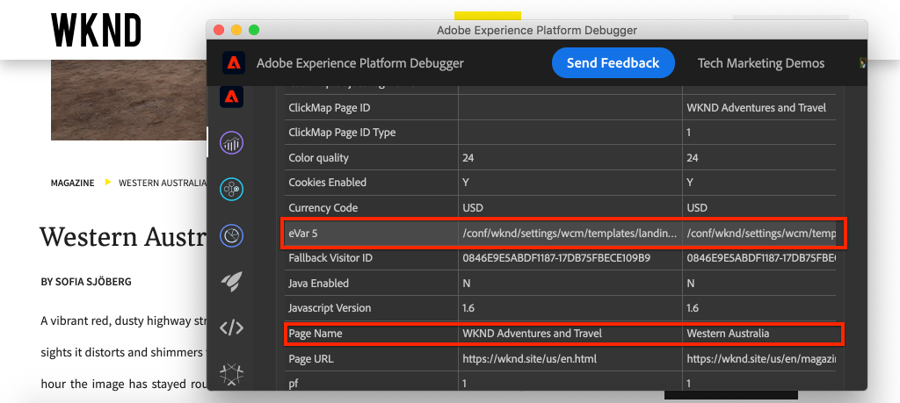

# Integrieren von AEM Sites und Adobe Analytics

>[!NOTE]
>
>Adobe Experience Platform Launch wurde als eine Suite von Datenerfassungstechnologien in Adobe Experience Platform umbenannt. Infolgedessen wurden in der gesamten Produktdokumentation verschiedene terminologische Änderungen durchgeführt. Eine konsolidierte Übersicht über die terminologischen Änderungen finden Sie in diesem [Dokument](https://experienceleague.adobe.com/docs/experience-platform/tags/term-updates.html?lang=de).


Erfahren Sie, wie Sie AEM Sites und Adobe Analytics mit der Adobe Analytics-Tag-Erweiterung integrieren, indem Sie die integrierten Funktionen der [Adobe Client-Datenschicht mit AEM-Kernkomponenten](https://experienceleague.adobe.com/docs/experience-manager-core-components/using/developing/data-layer/overview.html?lang=de) verwenden, um Daten zu einer Seite in Adobe Experience Manager Sites zu erfassen. [Tags in Experience Platform](https://experienceleague.adobe.com/docs/experience-platform/tags/home.html?lang=de) und die [Adobe Analytics-Erweiterung](https://experienceleague.adobe.com/docs/experience-platform/tags/extensions/client/analytics/overview.html?lang=de) werden verwendet, um Regeln zum Senden von Seitendaten an Adobe Analytics zu erstellen.

## Was Sie erstellen werden {#what-build}



In diesem Tutorial lösen Sie eine Tag-Regel aus, die auf einem Ereignis aus der Adobe Client-Datenschicht basiert. Fügen Sie außerdem Bedingungen dafür hinzu, wann die Regel ausgelöst werden soll, und senden Sie dann die Werte für den **Seitennamen** und die **Seitenvorlage** einer AEM-Seite an Adobe Analytics.

### Ziele {#objective}

1. Erstellen Sie eine ereignisgesteuerte Regel in der Tag-Eigenschaft, die Änderungen an der Datenschicht erfasst
1. Ordnen Sie die Eigenschaften der Seitendatenschicht Datenelementen in der Tag-Eigenschaft zu.
1. Erfassen und senden Sie Seitendaten an Adobe Analytics mithilfe des Seitenansichts-Beacons

## Voraussetzungen

Folgendes ist erforderlich:

* **Tag-Eigenschaft** in Experience Platform
* **Adobe Analytics** test/dev-Report Suite-ID und Tracking-Server. Weitere Informationen zum [Erstellen einer Report Suite](https://experienceleague.adobe.com/docs/analytics/admin/admin-tools/manage-report-suites/c-new-report-suite/new-report-suite.html?lang=de) finden Sie in der folgenden Dokumentation.
* [Experience Platform Debugger](https://experienceleague.adobe.com/docs/platform-learn/data-collection/debugger/overview.html?lang=de)-Browser-Erweiterung. Screenshots in diesem Tutorial, die mit dem Chrome-Browser erfasst wurden.
* (Optional) AEM Site mit [aktivierter Adobe Client-Datenschicht](https://experienceleague.adobe.com/docs/experience-manager-core-components/using/developing/data-layer/overview.html?lang=de#installation-activation). In diesem Tutorial wird die öffentlich gezeigte [WKND](https://wknd.site/us/en.html)-Website genutzt, aber Sie können gerne Ihre eigene Website verwenden.

>[!NOTE]
>
> Benötigen Sie Hilfe bei der Integration von Tag-Eigenschaft und AEM Site? [Sehen Sie sich diese Videoreihe an](../experience-platform/data-collection/tags/overview.md).

## Wechseln der Tag-Umgebung für WKND-Site

[WKND](https://wknd.site/us/en.html) ist eine öffentlich zugängliche Website, die auf [einem Open-Source-Projekt](https://github.com/adobe/aem-guides-wknd) basiert, das als Referenz und [Tutorial](https://experienceleague.adobe.com/docs/experience-manager-learn/getting-started-wknd-tutorial-develop/overview.html?lang=de) für eine AEM-Implementierung konzipiert wurde.

Anstatt eine AEM-Umgebung einzurichten und die WKND-Code-Basis zu installieren, können Sie den Experience Platform Debugger verwenden, um von der Live-[WKND-Site](https://wknd.site/us/en.html) zu *Ihrer* Tag-Eigenschaft zu **wechseln**. Sie können jedoch Ihre eigene AEM-Site verwenden, wenn dort bereits die [Adobe Client-Datenschicht aktiviert](https://experienceleague.adobe.com/docs/experience-manager-core-components/using/developing/data-layer/overview.html?lang=de#installation-activation) ist.

1. Melden Sie sich bei Experience Platform an und [erstellen Sie eine Tag-Eigenschaft](https://experienceleague.adobe.com/docs/platform-learn/implement-in-websites/configure-tags/create-a-property.html?lang=de) (falls noch nicht geschehen).
1. Stellen Sie sicher, dass eine anfängliche Tag-JavaScript-[Bibliothek erstellt](https://experienceleague.adobe.com/docs/experience-platform/tags/publish/libraries.html?lang=de#create-a-library) und in die Tag-[Umgebung](https://experienceleague.adobe.com/docs/experience-platform/tags/publish/environments/environments.html?lang=de) weitergeleitet wurde.
1. Kopieren Sie den JavaScript-Einbettungs-Code aus der Tag-Umgebung, in der Ihre Bibliothek veröffentlicht wurde.

   

1. Öffnen Sie in Ihrem Browser eine neue Registerkarte und navigieren Sie zur [WKND-Site](https://wknd.site/us/en.html)
1. Öffnen Sie die Experience Platform Debugger-Browser-Erweiterung.

   

1. Navigieren Sie zu **Experience Platform Tags** > **Konfiguration** und ersetzen Sie unter **Eingeführte Einbettungs-Codes** den vorhandenen Einbettungs-Code durch *Ihren* Einbettungs-Code, der aus Schritt 3 kopiert wurde.

   

1. Aktivieren Sie die **Konsolenprotokollierung** und **sperren** Sie den Debugger auf der WKND-Registerkarte.

   

## Überprüfen der Adobe Client-Datenschicht auf der WKND-Site

Das [WKND-Referenzprojekt](https://github.com/adobe/aem-guides-wknd) wurde mit AEM-Kernkomponenten erstellt und hat standardmäßig die [Adobe Client-Datenschicht aktiviert](https://experienceleague.adobe.com/docs/experience-manager-core-components/using/developing/data-layer/overview.html?lang=de#installation-activation). Überprüfen Sie als Nächstes, ob die Adobe Client-Datenschicht aktiviert ist.

1. Navigieren Sie zur [WKND-Site](https://wknd.site/us/en.html).
1. Öffnen Sie die Entwickler-Tools des Browsers und navigieren Sie zur **Konsole**. Führen Sie den folgenden Befehl aus:

   ```js
   adobeDataLayer.getState();
   ```

   Der obige Code gibt den aktuellen Status der Adobe Client-Datenschicht zurück.

   

1. Erweitern Sie die Antwort und überprüfen Sie den `page`-Eintrag. Es sollte ein Datenschema wie das folgende angezeigt werden:

   ```json
   page-2eee4f8914:
       @type: "wknd/components/page"
       dc:description: WKND is a collective of outdoors, music, crafts, adventure sports, and travel enthusiasts that want to share our experiences, connections, and expertise with the world.
       dc:title: "WKND Adventures and Travel"
       repo:modifyDate: "2020-08-31T21:02:21Z"
       repo:path: "/content/wknd/us/en.html"
       xdm:language: "en-US"
       xdm:tags: ["Attract"]
       xdm:template: "/conf/wknd/settings/wcm/templates/landing-page-template"
   ```

   Verwenden Sie zum Senden von Seitendaten an Adobe Analytics die Standardeigenschaften wie `dc:title`, `xdm:language` und `xdm:template` der Datenschicht.

   Weitere Informationen finden Sie unter dem [Seitenschema](https://experienceleague.adobe.com/docs/experience-manager-core-components/using/developing/data-layer/overview.html?lang=de#page) aus den Datenschemata der Kernkomponenten.

   >[!NOTE]
   >
   > Und wenn Sie das `adobeDataLayer`-JavaScript-Objekt nicht sehen? Stellen Sie sicher, dass die [Adobe Client-Datenschicht auf Ihrer Site aktiviert wurde](https://experienceleague.adobe.com/docs/experience-manager-core-components/using/developing/data-layer/overview.html?lang=de#installation-activation).

## Erstellen einer Regel für „Seite geladen“

Die Adobe Client-Datenschicht ist eine **ereignisgesteuerte** Datenschicht. Wenn die AEM-Seite geladen ist, löst das ein `cmp:show`-Ereignis aus. Erstellen Sie eine Regel, die ausgelöst wird, wenn das `cmp:show`-Ereignis aus der Seitendatenschicht ausgelöst wird.

1. Navigieren Sie zu Experience Platform und zur Tag-Eigenschaft, die mit der AEM-Site integriert ist.
1. Navigieren Sie zum Abschnitt **Regeln** in der Benutzeroberfläche „Tag-Eigenschaft“ auf und klicken Sie auf **Neue Regel erstellen**.

   

1. Benennen Sie die Regel **Seite geladen**.
1. Klicken Sie im Unterabschnitt **Veranstaltungen** auf **Hinzufügen**, um den **Ereigniskonfiguration**-Assistenten zu öffnen.
1. Für das Feld **Ereignistyp** wählen Sie **Benutzerspezifischer Code**.

   

1. Klicken Sie im Hauptbedienfeld auf **Editor öffnen** und geben Sie das folgende Codesnippet ein:

   ```js
   var pageShownEventHandler = function(evt) {
      // defensive coding to avoid a null pointer exception
      if(evt.hasOwnProperty("eventInfo") && evt.eventInfo.hasOwnProperty("path")) {
         //trigger the Tag Rule and pass event
         console.log("cmp:show event: " + evt.eventInfo.path);
         var event = {
            //include the path of the component that triggered the event
            path: evt.eventInfo.path,
            //get the state of the component that triggered the event
            component: window.adobeDataLayer.getState(evt.eventInfo.path)
         };
   
         //Trigger the Tag Rule, passing in the new `event` object
         // the `event` obj can now be referenced by the reserved name `event` by other Tag data elements
         // i.e `event.component['someKey']`
         trigger(event);
      }
   }
   
   //set the namespace to avoid a potential race condition
   window.adobeDataLayer = window.adobeDataLayer || [];
   //push the event listener for cmp:show into the data layer
   window.adobeDataLayer.push(function (dl) {
      //add event listener for `cmp:show` and callback to the `pageShownEventHandler` function
      dl.addEventListener("cmp:show", pageShownEventHandler);
   });
   ```

   Das obige Codesnippet fügt einen Ereignis-Listener hinzu, indem es [eine Funktion](https://github.com/adobe/adobe-client-data-layer/wiki#pushing-a-function) in die Datenschicht schiebt. Wenn das `cmp:show`-Ereignis ausgelöst wird, wird die `pageShownEventHandler`-Funktion aufgerufen. In dieser Funktion werden einige Konsistenzprüfungen hinzugefügt und ein neues `event` wird mit dem neuesten [Status der Datenschicht](https://github.com/adobe/adobe-client-data-layer/wiki#getstate) für die Komponente erstellt, die das Ereignis ausgelöst hat.

   Schließlich wird die Funktion `trigger(event)` aufgerufen. Die Funktion `trigger()` ist ein reservierter Name in der Tag-Eigenschaft und **löst die Regel aus**. Das `event`-Objekt wird als Parameter übergeben, der wiederum durch einen anderen reservierten Namen in der Tag-Eigenschaft verfügbar gemacht wird. Datenelemente in der Tag-Eigenschaft können jetzt auf verschiedene Eigenschaften verweisen, indem sie Codesnippets wie `event.component['someKey']` verwenden.

1. Speichern Sie die Änderungen.
1. Klicken Sie anschließend unter **Aktionen** auf **Hinzufügen**, um den Assistenten **Aktionskonfiguration** zu öffnen.
1. Für das Feld **Aktionstyp** wählen Sie **Benutzerdefinierter Code**.

   

1. Klicken Sie im Hauptbedienfeld auf **Editor öffnen** und geben Sie das folgende Codesnippet ein:

   ```js
   console.log("Page Loaded ");
   console.log("Page name: " + event.component['dc:title']);
   console.log("Page type: " + event.component['@type']);
   console.log("Page template: " + event.component['xdm:template']);
   ```

   Das `event`-Objekt wird von der `trigger()`-Methode übergeben, die in dem benutzerdefinierten Ereignis aufgerufen wird. Hier ist die `component` die aktuelle von der Datenschicht `getState` abgeleitete Seite im benutzerspezifischen Ereignis.

1. Speichern Sie die Änderungen und führen Sie einen [Build](https://experienceleague.adobe.com/docs/experience-platform/tags/publish/builds.html?lang=de) in der Tag-Eigenschaft durch, um den Code in die [Umgebung](https://experienceleague.adobe.com/docs/experience-platform/tags/publish/environments/environments.html?lang=de) zu übertragen, die auf Ihrer AEM-Site verwendet wird.

   >[!NOTE]
   >
   > Es kann nützlich sein, den [Adobe Experience Platform Debugger](https://experienceleague.adobe.com/docs/platform-learn/data-collection/debugger/overview.html?lang=de) zu verwenden, um den Einbettungs-Code in eine **Entwicklungsumgebung** zu wechseln.

1. Navigieren Sie zu Ihrer AEM Site und öffnen Sie die Entwickler-Tools, um die Konsole anzuzeigen. Aktualisieren Sie die Seite. Sie sollten sehen, dass die Konsolenmeldungen protokolliert wurden:


## Erstellen von Datenelementen

Erstellen Sie anschließend mehrere Datenelemente, um andere Werte als die Adobe Client-Datenschicht zu erfassen. Wie in der vorherigen Übung gezeigt, ist es möglich, direkt über benutzerdefinierten Code auf die Eigenschaften der Datenschicht zuzugreifen. Der Vorteil der Verwendung von Datenelementen besteht darin, dass sie über Tag-Regeln hinweg wiederverwendet werden können.

Datenelemente werden den Eigenschaften `@type`, `dc:title` und `xdm:template` zugeordnet.

### Komponenten-Ressourcentyp

1. Navigieren Sie zu Experience Platform und zur Tag-Eigenschaft, die mit der AEM-Site integriert ist.
1. Navigieren Sie zum Abschnitt **Datenelemente** und klicken Sie auf **Neues Datenelement erstellen**.
1. Tragen Sie im Feld **Name** den **Komponenten-Ressourcentyp** ein.
1. Wählen Sie im Feld **Datenelementtyp** **Benutzerspezifischer Code** aus.

   

1. Klicken Sie auf die Schaltfläche **Editor öffnen** und geben Sie den folgenden Code in den benutzerdefinierten Code-Editor ein:

   ```js
   if(event && event.component && event.component.hasOwnProperty('@type')) {
       return event.component['@type'];
   }
   ```

1. Speichern Sie die Änderungen.

   >[!NOTE]
   >
   > Beachten Sie, dass das `event`-Objekt verfügbar gemacht wird und basierend auf dem Ereignis, das die **Regel** in der Tag-Eigenschaft ausgelöst hat, begrenzt ist. Der Wert eines Datenelements wird erst gesetzt, wenn das Datenelement innerhalb einer Regel *referenziert* wird. Daher ist es sicher, dieses Datenelement in einer Regel wie der im vorherigen Schritt erstellten Regel **Seite geladen** zu verwenden, *aber* in anderen Kontexten kann es nicht sicher verwendet werden.

### Seitenname

1. Klicken Sie auf die Schaltfläche **Datenelement hinzufügen**
1. Tragen Sie im Feld **Name** **Seitenname** ein.
1. Wählen Sie im Feld **Datenelementtyp** **Benutzerspezifischer Code** aus.
1. Klicken Sie auf die Schaltfläche **Editor öffnen** und geben Sie Folgendes im Editor für benutzerdefinierten Code ein:

   ```js
   if(event && event.component && event.component.hasOwnProperty('dc:title')) {
       return event.component['dc:title'];
   }
   ```

1. Speichern Sie die Änderungen.

### Seitenvorlage

1. Klicken Sie auf die Schaltfläche **Datenelement hinzufügen**
1. Tragen Sie im Feld **Name** **Seitenvorlage** ein.
1. Wählen Sie im Feld **Datenelementtyp** **Benutzerspezifischer Code** aus.
1. Klicken Sie auf die Schaltfläche **Editor öffnen** und geben Sie Folgendes im Editor für benutzerdefinierten Code ein:

   ```js
   if(event && event.component && event.component.hasOwnProperty('xdm:template')) {
       return event.component['xdm:template'];
   }
   ```

1. Speichern Sie die Änderungen.

1. Sie sollten jetzt drei Datenelemente als Teil Ihrer Regel haben:

   

## Hinzufügen der Analytics-Erweiterung

Fügen Sie anschließend die Analytics-Erweiterung zu Ihrer Tag-Eigenschaft hinzu, um Daten an eine Report Suite zu senden.

1. Navigieren Sie zu Experience Platform und zur Tag-Eigenschaft, die mit der AEM-Site integriert ist.
1. Navigieren Sie zu **Erweiterungen** > **Katalog**
1. Suchen Sie die **Adobe Analytics**-Erweiterung und klicken Sie auf **Installieren**

   

1. Tragen Sie unter **Bibliotheksverwaltung** > **Report Suites** die Report Suite-IDs ein, die Sie für jede Tag-Umgebung verwenden möchten.

   

   >[!NOTE]
   >
   > In diesem Tutorial können Sie eine Report Suite für alle Umgebungen verwenden. In der Praxis sollten Sie jedoch separate Report Suites verwenden, wie in der Abbildung unten dargestellt

   >[!TIP]
   >
   >Es wird empfohlen, die *Option „Bibliothek für mich verwalten“* als Einstellung für die Bibliotheksverwaltung zu nutzen, da es dies sehr erleichtert, die `AppMeasurement.js`-Bibliothek auf dem neuesten Stand zu halten.

1. Aktivieren Sie das Kontrollkästchen, um die Option **Activity Map verwenden** zu aktivieren.

   

1. Geben Sie unter **Allgemein** > **Tracking-Server** Ihren Tracking-Server ein, z. B. `tmd.sc.omtrdc.net`. Geben Sie Ihren SSL-Tracking-Server ein, wenn Ihre Site `https://` unterstützt

   

1. Klicken Sie auf **Speichern**, um die Änderungen zu speichern.

## Hinzufügen einer Bedingung zur Regel „Seite geladen“

Aktualisieren Sie anschließend die Regel **Seite geladen**, um das **Komponenten-Ressourcentyp**-Datenelement zu verwenden, um sicherzustellen, dass die Regel nur ausgelöst wird, wenn das `cmp:show`-Ereignis für die **Seite** stattfindet. Andere Komponenten können das `cmp:show`-Ereignis auslösen, beispielsweise löst die Karussellkomponente es bei einer Änderung der Folien aus. Daher ist es wichtig, eine Bedingung für diese Regel hinzuzufügen.

1. Navigieren Sie in der Benutzeroberfläche der Tag-Eigenschaft zur zuvor erstellten Regel **Seite geladen**.
1. Klicken Sie unter **Bedingungen** auf **Hinzufügen**, um den Assistenten **Bedingungskonfiguration** zu öffnen.
1. Wählen Sie im Feld **Bedingungstyp** die Option **Wertvergleich**.
1. Setzen Sie den ersten Wert im Formularfeld auf `%Component Resource Type%`. Sie können das Datenelementsymbol  zur Auswahl des **Komponenten-Ressourcentyp**-Datenelements verwenden. Belassen Sie den Vergleichsoperator auf `Equals`.
1. Setzen Sie den zweiten Wert auf `wknd/components/page`.

   

   >[!NOTE]
   >
   > Diese Bedingung kann innerhalb der benutzerdefinierten Code-Funktion hinzugefügt werden, die für das Ereignis `cmp:show` aufgelistet ist, das zuvor im Tutorial erstellt wurde. Das Hinzufügen der Regel innerhalb der Benutzeroberfläche bietet zusätzlichen Benutzenden allerdings mehr Sichtbarkeit, die möglicherweise Änderungen an der Regel vornehmen müssen. Außerdem können wir unser Datenelement verwenden!

1. Speichern Sie die Änderungen.

## Festlegen der Analytics-Variablen und Auslösen des Seitenansichts-Beacons

Derzeit gibt die Regel **Seite geladen** einfach eine Konsolenanweisung aus. Verwenden Sie anschließend die Datenelemente und die Analytics-Erweiterung, um Analytics-Variablen als **Aktion** in der Regel **Seite geladen** festzulegen. Wir haben auch eine zusätzliche Aktion zum Auslösen des **Seitenansichts-Beacons** und zum Senden der erfassten Daten an Adobe Analytics festgelegt.

1. **Entfernen** Sie in der Regel „Seite geladen“ die Aktion **Kern – benutzerspezifischer Code** (die Konsolenanweisungen):

   

1. Klicken Sie unter dem Unterabschnitt „Aktionen“ auf **Hinzufügen**, um eine neue Aktion hinzuzufügen.

1. Legen Sie den **Erweiterungstyp** auf **Adobe Analytics** und die **Aktionstyp** auf **Variablen festlegen** fest

   

1. Wählen Sie im Hauptbedienfeld eine verfügbare **eVar** und legen Sie als Wert des Datenelements **Seitenvorlage** fest. Verwenden Sie das Datenelementsymbol  zur Auswahl des **Seitenvorlage**-Elements.

   

1. Scrollen Sie nach unten und legen Sie unter **Zusätzliche Einstellungen** den **Seitennamen** auf das Datenelement **Seitenname** fest:

   

1. Speichern Sie die Änderungen.

1. Fügen Sie als Nächstes rechts neben **Adobe Analytics – Variablen festlegen** durch Tippen auf das **Plus**-Symbol eine zusätzliche Aktion hinzu:

   

1. Legen Sie den **Erweiterungstyp** auf **Adobe Analytics** und den **Aktionstyp** auf **Beacon senden** fest. Da diese Aktion als Seitenansicht gilt, belassen Sie das standardmäßige Tracking auf **`s.t()`**.

   

1. Speichern Sie die Änderungen. Die Regel **Seite geladen** sollte jetzt die folgende Konfiguration aufweisen:

   

   * **1.** Lauschen Sie auf das Ereignis `cmp:show`.
   * **2.** Überprüfen Sie, ob das Ereignis von einer Seite ausgelöst wurde.
   * **3.** Legen Sie Analytics-Variablen für den **Seitennamen** und die **Seitenvorlage** fest.
   * **4.** Senden Sie den Analytics-Seitenansichts-Beacon.

1. Speichern Sie alle Änderungen und erstellen Sie Ihre Tag-Bibliothek, indem Sie sie an die entsprechende Umgebung weiterleiten.

## Validieren des Seitenansichts-Beacons und des Analytics-Aufrufs

Da nun über die Regel **Seite geladen** der Analytics-Beacon gesendet wird, sollten Sie die Analytics-Tracking-Variablen unter Verwendung des Experience Platform-Debuggers sehen können.

1. Öffnen Sie die [WKND-Site](https://wknd.site/us/en.html) in Ihrem Browser.
1. Klicken Sie auf das Debugger-Symbol , um den Experience Platform-Debugger zu öffnen.
1. Stellen Sie sicher, dass der Debugger die Tag-Eigenschaft *Ihrer* Entwicklungsumgebung zuordnet, wie zuvor beschrieben, und dass die **Konsolenprotokollierung** aktiviert ist.
1. Öffnen Sie das Analytics-Menü und überprüfen Sie, ob die Report Suite auf *Ihre* Report Suite festgelegt ist. Der Seitenname sollte ebenfalls angegeben sein:

   

1. Scrollen Sie nach unten und erweitern Sie **Netzwerkanfragen**. Unter **eVar** sollte die **Seitenvorlage** festgelegt sein:

   

1. Kehren Sie zum Browser zurück und öffnen Sie die Entwicklungskonsole. Klicken Sie oben auf der Seite durch das **Karussell**.

   

1. Sehen Sie sich in der Browser-Konsole die Konsolenanweisung an:

   

   Dies liegt daran, dass das Karussell ein `cmp:show`-Ereignis auslöst, *aber* weil wir den **Komponenten-Ressourcentyp** festgelegt haben, wird kein Ereignis ausgelöst.

   >[!NOTE]
   >
   > Wenn keine Konsolenprotokolle angezeigt werden, stellen Sie sicher, dass in Experience Platform Debugger unter **Experience Platform-Tags** die **Konsolenprotokollierung** aktiviert ist.

1. Navigieren Sie zu einer Artikelseite wie [West Australia](https://wknd.site/us/en/magazine/western-australia.html). Sie werden feststellen, dass sich Seitenname und Vorlagentyp ändern.

## Herzlichen Glückwunsch!

Sie haben soeben die ereignisbasierte Adobe Client-Datenschicht und Tags in Experience Platform verwendet, um Daten von einer AEM-Site zu erfassen und an Adobe Analytics zu senden.

### Nächste Schritte

Sehen Sie sich das folgende Tutorial an, um zu erfahren, wie Sie mit der ereignisgesteuerten Adobe Client-Datenschicht [Klicks bestimmter Komponenten auf einer Adobe Experience Manager-Site nachverfolgen](track-clicked-component.md) können.
