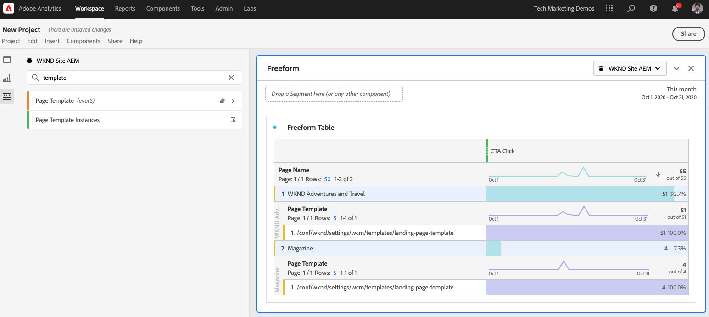
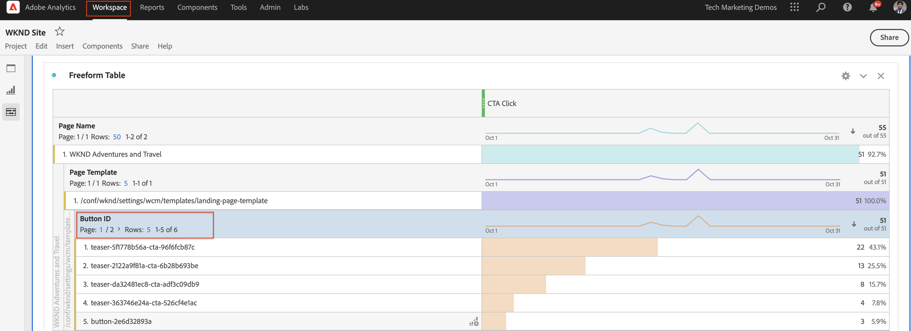

# Daten mit Analysis Workspace analysieren

Erfahren Sie, wie Sie von einer Adobe Experience Manager-Site erfasste Daten Metriken und Dimensionen in Adobe Analytics Report Suites zuordnen. Erfahren Sie, wie Sie mit der Analysis Workspace-Funktion von Adobe Analytics ein detailliertes Berichts-Dashboard erstellen.

## Was Sie erstellen werden

Das WKND-Marketing-Team möchte wissen, welche Aktionsaufruf-Schaltflächen (CTA) auf der Startseite am besten funktionieren. In diesem Tutorial erstellen wir ein neues Projekt in der Analysis Workspace, um die Leistung verschiedener CTA-Schaltflächen zu visualisieren und das Benutzerverhalten auf der Site zu verstehen. Die folgenden Informationen werden mit Adobe Analytics erfasst, wenn ein Benutzer auf der WKND-Startseite auf die Schaltfläche Aktionsaufruf (CTA) klickt.

**Analytics-Variablen**

Nachfolgend finden Sie die Analytics-Variablen, die derzeit verfolgt werden:

* `eVar5` -  `Page template`
* `eVar6` - `Page Id`
* `eVar7` -  `Page last modified date`
* `eVar8` -  `CTA Button Id`
* `eVar9` -  `Page Name`
* `event8` -  `CTA Button Click event`
* `prop8` -  `CTA Button Id`

### Ziele {#objective}

1. Erstellen Sie eine neue Report Suite oder verwenden Sie eine vorhandene.
1. Konfigurieren Sie [Konversionsvariablen (eVars)](https://docs.adobe.com/content/help/en/analytics/admin/admin-tools/conversion-variables/conversion-var-admin.html) und [Erfolgsereignisse (Ereignisse)](https://docs.adobe.com/help/en/analytics/admin/admin-tools/success-events/success-event.html) in der Report Suite.
1. Erstellen Sie ein [Analysis Workspace-Projekt](https://docs.adobe.com/content/help/en/analytics/analyze/analysis-workspace/home.html), um Daten mithilfe von Tools zu analysieren, mit denen Sie schnell Einblicke erstellen, analysieren und teilen können.
1. Geben Sie das Analysis Workspace-Projekt für andere Teammitglieder frei.

## Voraussetzungen

In diesem Tutorial wird die Komponente [Klicks mit Adobe Analytics](./track-clicked-component.md) verfolgen fortgesetzt. Dabei wird davon ausgegangen, dass Sie über Folgendes verfügen:

* Eine **Launch-Eigenschaft** mit der aktivierten [Adobe Analytics-Erweiterung](https://docs.adobe.com/content/help/de-DE/launch/using/extensions-ref/adobe-extension/analytics-extension/overview.html)
* **Report Suite-ID und Tracking-Server für Adobe** Analytics-Tests/Entwicklung. Weitere Informationen finden Sie in der folgenden Dokumentation für [Erstellen einer neuen Report Suite](https://docs.adobe.com/content/help/en/analytics/admin/manage-report-suites/new-report-suite/new-report-suite.html).
* [Experience Platform ](https://docs.adobe.com/content/help/en/platform-learn/tutorials/data-ingestion/web-sdk/introduction-to-the-experience-platform-debugger.html) DebuggerBrowser-Erweiterung, die mit Ihrer Launch-Eigenschaft konfiguriert wurde, die auf  [https://wknd.site/us/en.](https://wknd.site/us/en.html) html oder einer AEM Site geladen wurde, auf der die Adobe-Datenschicht aktiviert ist.

## Konversionsvariablen (eVars) und Erfolgsereignisse (Ereignis)

Die Custom Insight-Konversionsvariable (oder -eVar) wird auf den ausgewählten Webseiten Ihrer Site im Adobe-Code platziert. Ihr Hauptzweck besteht darin, Konversionserfolgsmetriken in benutzerspezifischen Marketing-Berichten zu segmentieren. Ein eVar kann besuchsbasiert sein und ähnlich wie Cookies funktionieren. Die Werte, die an eVar-Variablen übergeben werden, folgen dem Benutzer für einen bestimmten Zeitraum.

Wenn ein eVar auf den Wert eines Besuchers gesetzt wird, speichert Adobe diesen Wert automatisch, bis er abläuft. Alle Erfolgsereignisse, die ein Besucher aufruft, während der eVar aktiv ist, werden für den eVar gezählt.

eVars eignen sich am besten zur Messung von Ursache und Wirkung, z. B.:

* Welche internen Kampagnen haben den Umsatz beeinflusst?
* Welche Banneranzeigen führten letztendlich zu einer Registrierung?
* Die Häufigkeit, mit der eine interne Suche verwendet wurde, bevor eine Bestellung aufgegeben wurde

Erfolgsereignisse sind Aktionen, die verfolgt werden können. Sie bestimmen, was ein Erfolgsereignis ist. Wenn ein Besucher beispielsweise auf eine CTA-Schaltfläche klickt, kann das Klickereignis als Erfolgsereignis betrachtet werden.

### eVars konfigurieren

1. Wählen Sie auf der Adobe Experience Cloud-Startseite Ihr Unternehmen aus und starten Sie Adobe Analytics.

   

1. Klicken Sie in der Analytics-Symbolleiste auf **Admin** > **Report Suites** und suchen Sie Ihre Report Suite.

   

1. Wählen Sie die Report Suite > **Einstellungen bearbeiten** > **Konversion** > **Konversionsvariablen**

   

1. Erstellen wir mit der Option **Neue**-Konversionsvariablen, um das Schema wie folgt zuzuordnen:

   * `eVar5` -   `Page Template`
   * `eVar6` -  `Page ID`
   * `eVar7` -  `Last Modified Date`
   * `eVar8` -  `Button Id`
   * `eVar9` -  `Page Name`

   

1. Geben Sie einen geeigneten Namen und eine Beschreibung für jede eVars ein und **Speichern** Ihre Änderungen. Wir werden diese eVars verwenden, um im nächsten Abschnitt ein Analysis Workspace-Projekt zu erstellen. Ein benutzerfreundlicher Name macht die Variablen einfach zu finden.

   

### Erfolgsereignisse konfigurieren

Als Nächstes erstellen wir ein Ereignis, um das Klicken auf die CTA-Schaltfläche zu verfolgen.

1. Wählen Sie im Fenster **Report Suite Manager** die **Report Suite-ID** aus und klicken Sie auf **Einstellungen bearbeiten**.
1. Klicken Sie auf **Konversion** > **Erfolgsereignisse**
1. Erstellen Sie mit der Option **Neu hinzufügen** ein neues benutzerspezifisches Erfolgsereignis, um die CTA-Schaltflächenklick-Funktion zu verfolgen und dann **Speichern** Ihre Änderungen.
   * `Event`: `event8`
   * `Name`:`CTA Click`
   * `Type`:`Counter`

   

## Neues Projekt in Analysis Workspace erstellen {#workspace-project}

Analysis Workspace ist ein flexibles Browser-Tool, mit dem Sie schnell Analysen erstellen und Erkenntnisse austauschen können. Mithilfe der Drag &amp; Drop-Benutzeroberfläche können Sie Ihre Analyse gestalten, Visualisierungen hinzufügen, um Daten zum Leben zu erwecken, einen Datensatz zu kuratieren, Projekte für andere in Ihrer Organisation freizugeben und zu planen.

Erstellen Sie anschließend ein neues [Projekt](https://docs.adobe.com/content/help/en/analytics/analyze/analysis-workspace/build-workspace-project/t-freeform-project.html), um ein Dashboard zu erstellen, das die Leistung der CTA-Schaltflächen auf der gesamten Site analysiert.

1. Wählen Sie in der Analytics-Symbolleiste **Workspace** aus und klicken Sie auf **Neues Projekt erstellen**.

   

1. Wählen Sie ein **leeres Projekt** oder wählen Sie eine der vordefinierten Vorlagen aus, die entweder von der Adobe oder von Ihrem Unternehmen erstellten benutzerdefinierten Vorlagen bereitgestellt werden. Je nach Analyse oder Anwendungsfall stehen verschiedene Vorlagen zur Verfügung. [Erfahren Sie ](https://docs.adobe.com/content/help/en/analytics/analyze/analysis-workspace/build-workspace-project/starter-projects.html) mehr über die verschiedenen verfügbaren Vorlagenoptionen.

   In Ihrem Workspace-Projekt können Sie über die linke Leiste auf Bedienfelder, Tabellen, Visualisierungen und Komponenten zugreifen. Dies sind Ihre Projektbausteine.

   * **[Komponenten](https://docs.adobe.com/content/help/en/analytics/analyze/analysis-workspace/components/analysis-workspace-components.html)** : Komponenten sind Dimensionen, Metriken, Segmente oder Datumsbereiche, die alle in einer Freiformtabelle kombiniert werden können, um Ihre Geschäftsfrage zu beantworten. Machen Sie sich mit jedem Komponententyp vertraut, bevor Sie sich mit Ihrer Analyse befassen. Sobald Sie die Terminologie der Komponenten kennen, können Sie mit dem Ziehen und Ablegen beginnen, um Ihre Analyse in einer Freiformtabelle zu erstellen.
   * **[Visualisierungen](https://docs.adobe.com/content/help/en/analytics/analyze/analysis-workspace/visualizations/freeform-analysis-visualizations.html)**  - Visualisierungen wie Balken- oder Liniendiagramme werden dann über den Daten hinzugefügt, um sie visuell zu realisieren. Wählen Sie in der linken Leiste das mittlere Symbol Visualisierungen aus, um die vollständige Liste der verfügbaren Visualisierungen anzuzeigen.
   * **[Bedienfelder](https://docs.adobe.com/content/help/en/analytics/analyze/analysis-workspace/panels/panels.html)**  - Ein Bedienfeld ist eine Sammlung von Tabellen und Visualisierungen. Sie können auf Bedienfelder über das Symbol oben links in Workspace zugreifen. Bedienfelder sind hilfreich, wenn Sie Ihre Projekte nach Zeiträumen, Report Suites oder Anwendungsfällen für Analysen organisieren möchten. Die folgenden Bedienfeldtypen sind in Analysis Workspace verfügbar:

   

### Datenvisualisierung mit Analysis Workspace hinzufügen

Erstellen Sie anschließend eine Tabelle, um eine visuelle Darstellung der Interaktion der Benutzer mit den Aktionsaufruf-Schaltflächen (CTA) auf der WKND Site-Startseite zu erstellen. Um eine solche Darstellung zu erstellen, verwenden wir die Daten, die in der Komponente [Klicks mit Adobe Analytics](./track-clicked-component.md) verfolgen erfasst wurden. Nachfolgend finden Sie eine kurze Zusammenfassung der für Benutzerinteraktionen mit den Aktionsaufrufen -Schaltflächen für die WKND-Site verfolgten Daten.

* `eVar5` -   `Page template`
* `eVar6` -  `Page Id`
* `eVar7` -  `Page last modified date`
* `eVar8` -  `CTA Button Id`
* `eVar9` -  `Page Name`
* `event8` -  `CTA Button Click event`
* `prop8` -  `CTA Button Id`

1. Ziehen Sie die Dimension **Seite** in die Freiformtabelle. Sie sollten jetzt in der Lage sein, eine Visualisierung anzuzeigen, die den Seitennamen (eVar 9) und die entsprechenden Seitenansichten (Vorfälle) anzeigt, die in der Tabelle angezeigt werden.

   

1. Ziehen Sie die Metrik **CTA Click** (event8) in die Metrik &quot;Vorfälle&quot;und ersetzen Sie sie. Sie können jetzt eine Visualisierung anzeigen, in der der Seitenname (eVar 9) und die zugehörige Anzahl der CTA-Klickereignisse auf einer Seite angezeigt werden.

   

1. Teilen wir die Seite nach Vorlagentyp auf. Wählen Sie aus den Komponenten die Metrik Seitenvorlage aus und ziehen Sie die Metrik Seitenvorlage auf die Dimension Seitenname . Jetzt können Sie den Seitennamen, aufgeschlüsselt nach Vorlagentyp, anzeigen.

   * **Vorher**

      

   * **Nachher**

      

1. Um zu verstehen, wie Benutzer mit CTA-Schaltflächen interagieren, wenn sie sich auf den WKND-Site-Seiten befinden, müssen wir die Metrik &quot;Seitenvorlage&quot;weiter aufschlüsseln, indem die Metrik &quot;Schaltflächen-ID&quot;(eVar 8) hinzugefügt wird.

   

1. Unten sehen Sie eine visuelle Darstellung der WKND-Site, aufgeschlüsselt nach der zugehörigen Seitenvorlage und weiter aufgeschlüsselt nach Benutzerinteraktion mit den Schaltflächen &quot;Klick zur Aktion&quot;(CTA) der WKND-Site.

   

1. Sie können den Wert der Schaltfläche-ID mit einem benutzerfreundlicheren Namen mithilfe der Adobe Analytics Classifications ersetzen. Weitere Informationen zum Erstellen einer Klassifizierung für eine bestimmte Metrik [finden Sie hier](https://docs.adobe.com/content/help/en/analytics/components/classifications/c-classifications.html). In diesem Fall haben wir eine Classification-Metrik `Button Section (Button ID)` eingerichtet für `eVar8` , die die Schaltflächen-ID einem benutzerfreundlichen Namen zuordnet.

   

## Hinzufügen von Classifications zu einer Analytics-Variablen

### Konversionsklassifizierungen

Analytics Classification ist eine Möglichkeit, Analytics-Variablendaten zu kategorisieren und diese Daten bei der Berichterstellung auf unterschiedliche Weise anzuzeigen. Um die Anzeige der Schaltflächen-ID im Analytics Workspace-Bericht zu verbessern, erstellen wir eine Classification-Variable für die Schaltflächen-ID (eVar 8). Beim Klassifizieren erstellen Sie eine Beziehung zwischen der Variablen und den Metadaten, die sich auf diese Variable beziehen.

Als Nächstes erstellen wir eine Classification für Analytics-Variable.

1. Wählen Sie im Symbolleistenmenü **Admin** **Report Suites** aus.
1. Wählen Sie **Report Suite-ID** aus dem Fenster **Report Suite Manager** und klicken Sie auf **Einstellungen bearbeiten** > **Konversion** > **Konversionsklassifizierungen**

   

1. Wählen Sie in der Dropdownliste **Einen Klassifizierungstyp** auswählen die Variable (eVar8-Button-ID) aus, um eine Klassifizierung hinzuzufügen.
1. Klicken Sie auf den Pfeil rechts neben der Variablen Klassifizierung , die im Abschnitt Klassifizierungen aufgeführt ist, um eine neue Klassifizierung hinzuzufügen.

   

1. Geben Sie im Dialogfeld **Klassifizierung bearbeiten** einen geeigneten Namen für die Textklassifizierung ein. Eine Dimensionskomponente mit dem Namen Textklassifizierung wird erstellt.

   

1. **Speichern Sie Ihre Änderungen.**

### Classification Importer

Verwenden Sie das Importtool, um Classifications in Adobe Analytics hochzuladen. Sie können die Daten auch exportieren, um sie vor einem Import zu aktualisieren. Die mit dem Import-Tool importierten Daten müssen in einem bestimmten Format vorliegen. Adobe bietet Ihnen die Möglichkeit, eine Datenvorlage mit allen korrekten Kopfzeilendetails in einer tabulatorgetrennten Datendatei herunterzuladen. Sie können Ihre neuen Daten zu dieser Vorlage hinzufügen und dann die Datendatei per FTP in den Browser importieren.

#### Klassifizierungsvorlage

Bevor Sie Klassifizierungen in Marketingberichte importieren, können Sie eine Vorlage herunterladen, mit der Sie eine Klassifizierungsdatendatei erstellen können. Die Datendatei verwendet Ihre gewünschten Klassifizierungen als Spaltenüberschriften und organisiert dann den Berichtdatensatz unter den entsprechenden Klassifizierungsüberschriften.

Als Nächstes laden wir die Classification-Vorlage für die Variable Button-ID (eVar 8) herunter

1. Navigieren Sie zu **Admin** > **Classification Importer**
1. Laden wir eine Classification-Vorlage für die Konversionsvariable von der Registerkarte **Vorlage herunterladen** herunter.
   

1. Geben Sie auf der Registerkarte Vorlage herunterladen die Konfiguration der Datenvorlage an.
   * **Report Suite auswählen** : Wählen Sie die Report Suite aus, die in der Vorlage verwendet werden soll. Die Report Suite und der Datensatz müssen übereinstimmen.
   * **Zu klassifizierender**  Datensatz: Wählen Sie den Datentyp für die Datendatei aus. Das Menü enthält alle Berichte in Ihren Report Suites, die für Klassifizierungen konfiguriert sind.
   * **Kodierung** : Wählen Sie die Zeichenkodierung für die Datendatei aus. Das Standard-Kodierungsformat ist UTF-8.

1. Klicken Sie auf **Download** und speichern Sie die Vorlagendatei auf Ihrem lokalen System. Die Vorlagendatei ist eine tabulatorgetrennte Datendatei (Dateierweiterung .tab ), die von den meisten Tabellenkalkulationsprogrammen unterstützt wird.
1. Öffnen Sie die tabulatorgetrennte Datendatei mit einem Editor Ihrer Wahl.
1. Fügen Sie die Schaltflächen-ID (eVar9) und einen entsprechenden Schaltflächennamen zur tabulatorgetrennten Datei für jeden eVar9-Wert aus Schritt 9 im Abschnitt hinzu.

   

1. **** Speichern Sie die tabulatorgetrennte Datei.
1. Navigieren Sie zur Registerkarte **Datei importieren** .
1. Konfigurieren Sie das Ziel für den Dateiimport.
   * **Report Suite auswählen** : WKND Site AEM (Report Suite)
   * **Zu klassifizierender**  Datensatz: Schaltflächen-ID (Konversionsvariable eVar 8)
1. Klicken Sie auf die Option **Datei** auswählen , um die tabulatorgetrennte Datei von Ihrem System hochzuladen, und klicken Sie dann auf **Datei importieren**

   

   >[!NOTE]
   >
   > Bei einem erfolgreichen Import werden die entsprechenden Änderungen sofort in einem Export angezeigt. Datenänderungen in Berichten können jedoch bis zu vier Stunden bei Verwendung eines Browser-Imports und bis zu 24 Stunden bei Verwendung eines FTP-Imports dauern.

#### Konversionsvariable durch Klassifizierungsvariable ersetzen

1. Wählen Sie in der Analytics-Symbolleiste **Workspace** aus und öffnen Sie den Arbeitsbereich, den wir unter [Neues Projekt in Analysis Workspace](#workspace-project) erstellt haben.

   

1. Ersetzen Sie als Nächstes die Metrik **Button-ID** in Ihrem Arbeitsbereich, die die ID der Schaltfläche &quot;Aktionsaufruf (CTA)&quot;anzeigt, durch den Classification-Namen, der im vorherigen Schritt erstellt wurde.

1. Suchen Sie im Komponenten-Finder nach **WKND CTA-Schaltflächen** und ziehen Sie die Dimension **WKND CTA-Schaltflächen (Schaltflächen-ID)** in die Metrik Schaltflächen-ID und ersetzen Sie sie.

   * **Vorher**

      
   * **Nachher**

      

1. Die Metrik &quot;Schaltflächen-ID&quot;, die die Schaltflächen-ID einer Aktionsaufruf-Schaltfläche (CTA) enthielt, wurde jetzt durch einen entsprechenden Namen ersetzt, der in der Klassifizierungsvorlage angegeben ist.
1. Vergleichen wir nun die Analytics Workspace-Tabelle mit der WKND-Startseite und betrachten die Anzahl der CTA-Schaltflächen-Klicks und deren Analyse. Basierend auf den Daten der Freiformtabelle des Arbeitsbereichs ist klar, dass Benutzer 22 Mal auf die Schaltfläche **SKI NOW** und viermal auf die Schaltfläche WKND Home Page Camping in Westaustralien geklickt haben **Mehr lesen**.

   

1. Achten Sie darauf, Ihr Adobe Analytics Workspace-Projekt zu speichern und einen geeigneten Namen und eine Beschreibung anzugeben. Optional können Sie Tags zu einem Workspace-Projekt hinzufügen.

   

1. Nach dem erfolgreichen Speichern Ihres Projekts können Sie Ihr Workspace-Projekt mit anderen Kollegen oder Teammitgliedern teilen, indem Sie die Option Freigeben verwenden.

   

## Herzlichen Glückwunsch!

Sie haben soeben erfahren, wie Sie von einer Adobe Experience Manager-Site erfasste Daten Metriken und Dimensionen in Adobe Analytics-Report Suites zuordnen, eine Classification für die Metriken durchführen und mithilfe der Analysis Workspace-Funktion von Adobe Analytics ein detailliertes Berichts-Dashboard erstellen.

