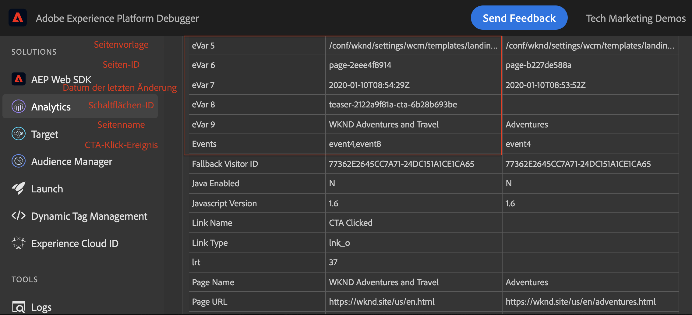
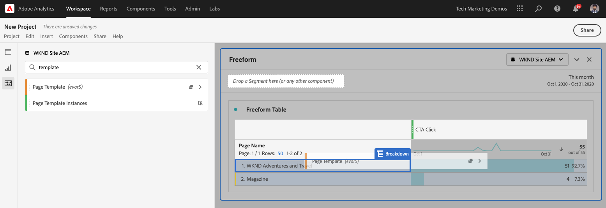
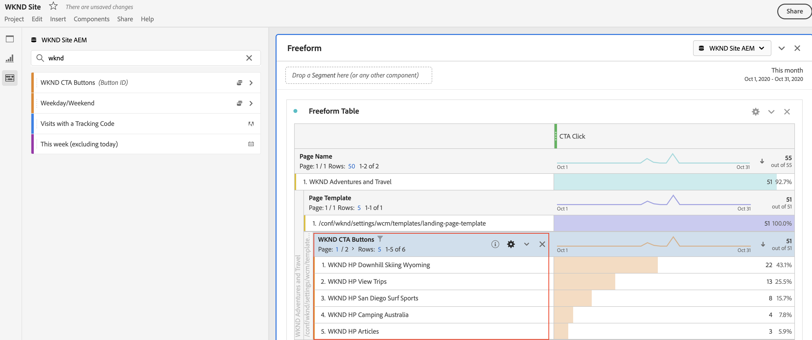

# Daten mit Analysis Workspace analysieren

Erfahren Sie, wie Sie von einer Adobe Experience Manager-Site erfasste Daten Metriken und Dimensionen in Adobe Analytics-Report Suites zuordnen. Erfahren Sie, wie Sie mit der Analysis Workspace-Funktion von Adobe Analytics ein detailliertes Berichte-Dashboard erstellen.

## Was Sie erstellen werden

Das WKND-Marketingteam möchte wissen, welche Aktionsaufruf-Schaltflächen (CTA) auf der Startseite am besten funktionieren. In diesem Lernprogramm erstellen wir ein neues Projekt in der Analysis Workspace, um die Leistung verschiedener CTA-Schaltflächen zu visualisieren und das Benutzerverhalten auf der Site zu verstehen. Die folgenden Informationen werden mit Adobe Analytics erfasst, wenn ein Benutzer auf der WKND-Startseite auf die Schaltfläche &quot;Aktionsaufruf&quot;(CTA) klickt.

**Analytics-Variablen**

Nachfolgend sind die derzeit verfolgten Analytics-Variablen aufgeführt:

* `eVar5` -  `Page template`
* `eVar6` - `Page Id`
* `eVar7` -  `Page last modified date`
* `eVar8` -  `CTA Button Id`
* `eVar9` -  `Page Name`
* `event8` -  `CTA Button Click event`
* `prop8` -  `CTA Button Id`

### Ziele {#objective}

1. Erstellen Sie eine neue Report Suite oder verwenden Sie eine vorhandene.
1. Konfigurieren Sie [Umrechnungsvariablen (eVars)](https://docs.adobe.com/content/help/en/analytics/admin/admin-tools/conversion-variables/conversion-var-admin.html) und [Erfolgsvariablen (Ereignis)](https://docs.adobe.com/help/en/analytics/admin/admin-tools/success-events/success-event.html) in der Report Suite.
1. Erstellen Sie ein [Analysis Workspace-Projekt](https://docs.adobe.com/content/help/en/analytics/analyze/analysis-workspace/home.html), um Daten mithilfe von Tools zu analysieren, mit denen Sie schnell Erkenntnisse erstellen, analysieren und freigeben können.
1. Geben Sie das Analysis Workspace-Projekt für andere Teammitglieder frei.

## Voraussetzungen

Dieses Tutorial stellt eine Fortsetzung der Komponente [Klicks mit Adobe Analytics](./track-clicked-component.md) verfolgen dar und setzt Folgendes voraus:

* A **Eigenschaft &quot;Start&quot;** mit aktivierter [Adobe Analytics-Erweiterung](https://docs.adobe.com/content/help/de-DE/launch/using/extensions-ref/adobe-extension/analytics-extension/overview.html)
* **Adobe** Analytics-Test-/Entwicklungs-Report Suite-ID und Tracking-Server. Siehe die folgende Dokumentation für [Erstellen einer neuen Report Suite](https://docs.adobe.com/content/help/en/analytics/admin/manage-report-suites/new-report-suite/new-report-suite.html).
* [Experience Platform ](https://docs.adobe.com/content/help/en/platform-learn/tutorials/data-ingestion/web-sdk/introduction-to-the-experience-platform-debugger.html) Debuggerbrowser-Erweiterung, die mit Ihrer Launch-Eigenschaft konfiguriert wurde, geladen auf  [https://wknd.site/us/en.](https://wknd.site/us/en.html) htmloder eine AEM Site mit aktivierter Adobe Data Layer.

## Konversionsvariablen (eVars) und Erfolgsvariablen (Ereignis)

Die Custom Insight-Konversionsvariable (oder -eVar) wird auf den ausgewählten Webseiten Ihrer Website in den Adoben-Code eingefügt. Ihr Hauptzweck besteht darin, Konversionserfolgsmetriken in benutzerspezifischen Marketing-Berichten zu segmentieren. Ein eVar kann besuchsbasiert sein und ähnlich wie Cookies funktionieren. An eVar übergebene Werte folgen dem Benutzer für einen bestimmten Zeitraum.

Wenn ein eVar auf den Wert eines Besuchers gesetzt ist, speichert Adobe automatisch diesen Wert, bis er abläuft. Alle Erfolgsereignisse, auf die ein Besucher stößt, während der eVar aktiv ist, werden auf den eVar angerechnet.

eVars eignen sich am besten zur Messung von Ursache und Wirkung, z. B.:

* Welche internen Kampagnen beeinflussten den Umsatz
* Welche Banneranzeigen führten letztendlich zu einer Registrierung?
* Die Häufigkeit, mit der eine interne Suche verwendet wurde, bevor eine Bestellung aufgegeben wurde

Erfolgsereignisse sind Ereignis, die verfolgt werden können. Sie bestimmen, was ein Erfolgsereignis ist. Wenn ein Besucher beispielsweise auf eine CTA-Schaltfläche klickt, könnte das click-Ereignis als ein Erfolgsereignis-Ereignis betrachtet werden.

### eVars konfigurieren

1. Wählen Sie in der Startseite Adobe Experience Cloud Ihr Unternehmen aus und starten Sie Adobe Analytics.

   

1. Klicken Sie in der Analytics-Symbolleiste auf **Admin** > **Report Suites** und suchen Sie Ihre Report Suite.

   

1. Wählen Sie Report Suite > **Einstellungen bearbeiten** > **Umrechnung** > **Umrechnungsvariablen**

   

1. Erstellen Sie mithilfe der Option **Hinzufügen neue** Konversionsvariablen, um das Schema wie folgt zuzuordnen:

   * `eVar5` -   `Page Template`
   * `eVar6` -  `Page ID`
   * `eVar7` -  `Last Modified Date`
   * `eVar8` -  `Button Id`
   * `eVar9` -  `Page Name`

   

1. Geben Sie für jede eVars einen entsprechenden Namen und eine Beschreibung ein und **Speichern** Ihre Änderungen. Wir werden diese eVars verwenden, um im nächsten Abschnitt ein Analysis Workspace-Projekt zu erstellen. Ein benutzerfreundlicher Name macht die Variablen einfach zu erkennen.

   

### Ereignis für Erfolg konfigurieren

Als Nächstes erstellen wir eine Gerade, um den Klick auf die CTA-Schaltfläche zu verfolgen.

1. Wählen Sie im Fenster **Report Suite Manager** die **Report Suite-ID** und klicken Sie auf **Einstellungen bearbeiten**.
1. Klicken Sie auf **Umrechnung** > **Erfolgserfolg-Ereignis**
1. Erstellen Sie mit der Option **Hinzufügen Neu** ein neues benutzerdefiniertes Erfolgsmodell, um den Klick auf die CTA-Schaltfläche zu verfolgen und **Speichern** Ihre Änderungen zu speichern.
   * `Event`: `event8`
   * `Name`:`CTA Click`
   * `Type`:`Counter`

   

## Neues Projekt in Analysis Workspace erstellen{#workspace-project}

Analysis Workspace ist ein flexibles Browser-Tool, mit dem Sie schnell Analysen erstellen und Erkenntnisse austauschen können. Mithilfe der Drag &amp; Drop-Oberfläche können Sie Ihre Analyse gestalten, Visualisierungen hinzufügen, um Daten zu nutzen, einen Datensatz zu kuratieren, Projekte freizugeben und für andere Mitarbeiter Ihres Unternehmens zu planen.

Erstellen Sie anschließend ein neues [Projekt](https://docs.adobe.com/content/help/en/analytics/analyze/analysis-workspace/build-workspace-project/t-freeform-project.html), um ein Dashboard zu erstellen, das die Leistung der CTA-Schaltflächen auf der gesamten Site analysiert.

1. Wählen Sie in der Analytics-Symbolleiste **Workspace** und klicken Sie auf **Neues Projekt erstellen**.

   

1. Wählen Sie einen Beginn aus einem **leeren Projekt** oder wählen Sie eine der vordefinierten Vorlagen aus, die entweder von der Adobe oder von Ihrem Unternehmen erstellten benutzerdefinierten Vorlagen bereitgestellt werden. Je nach Analyse oder Anwendungsfall stehen verschiedene Vorlagen zur Verfügung. [Erfahren Sie ](https://docs.adobe.com/content/help/en/analytics/analyze/analysis-workspace/build-workspace-project/starter-projects.html) mehr über die verschiedenen verfügbaren Vorlagenoptionen.

   In Ihrem Workspace-Projekt können Sie auf Bereiche, Tabellen, Visualisierungen und Komponenten von der linken Leiste aus zugreifen. Das sind Ihre Projektbausteine.

   * **[Komponenten](https://docs.adobe.com/content/help/en/analytics/analyze/analysis-workspace/components/analysis-workspace-components.html)** : Komponenten sind Dimensionen, Metriken, Segmente oder Datumsbereiche, die alle in einer Freiform-Tabelle kombiniert werden können, um Beginn bei der Beantwortung Ihrer Geschäftsfrage zu unterstützen. Machen Sie sich mit jedem Komponententyp vertraut, bevor Sie in Ihre Analyse eintauchen. Nachdem Sie die Terminologie der Komponenten beherrscht haben, können Sie mit dem Ziehen und Ablegen beginnen, um Ihre Analyse in einer Freiform-Tabelle zu erstellen.
   * **[Visualisierungen](https://docs.adobe.com/content/help/en/analytics/analyze/analysis-workspace/visualizations/freeform-analysis-visualizations.html)**  - Visualisierungen, wie z. B. Balken- oder Liniendiagramme, werden dann über den Daten hinzugefügt, um sie visuell zu beleben. Wählen Sie in der linken Leiste das Symbol für Visualisierungen in der Mitte aus, um die vollständige Liste der verfügbaren Visualisierungen anzuzeigen.
   * **[Bedienfelder](https://docs.adobe.com/content/help/en/analytics/analyze/analysis-workspace/panels/panels.html)**  - Ein Bedienfeld ist eine Sammlung von Tabellen und Visualisierungen. Sie können auf Bereiche über das Symbol links oben in Workspace zugreifen. Bedienfelder sind hilfreich, wenn Sie Ihre Projekte nach Zeiträumen, Report Suites oder Anwendungsfällen der Analyse organisieren möchten. Die folgenden Bedienfeldtypen sind in Analysis Workspace verfügbar:

   

### hinzufügen Datenvisualisierung mit Analysis Workspace

Erstellen Sie anschließend eine Tabelle, um eine visuelle Darstellung der Interaktion der Benutzer mit den Aktionsaufruf-Schaltflächen (CTA) in der WKND-Site-Startseite zu erstellen. Um eine solche Darstellung zu erstellen, verwenden wir die Daten, die in der Komponente [Klickende Verfolgung mit Adobe Analytics](./track-clicked-component.md) erfasst werden. Im Folgenden finden Sie eine kurze Zusammenfassung der Daten, die für Benutzerinteraktionen mit den Aktionsaufrufen-Schaltflächen für die WKND-Site verfolgt werden.

* `eVar5` -   `Page template`
* `eVar6` -  `Page Id`
* `eVar7` -  `Page last modified date`
* `eVar8` -  `CTA Button Id`
* `eVar9` -  `Page Name`
* `event8` -  `CTA Button Click event`
* `prop8` -  `CTA Button Id`

1. Ziehen Sie die Dimensionskomponente **Seite** in die Freiform-Tabelle. Sie sollten jetzt eine Visualisierung zur Ansicht des Seitennamens (eVar9) und der zugehörigen Ansichten (Vorfälle) in der Tabelle erstellen können.

   

1. Ziehen Sie die Metrik **CTA Click** (Ereignis8) auf die Metrik &quot;Vorfälle&quot;und ersetzen Sie sie. Sie können jetzt eine Visualisierung erstellen, in der der Seitenname (eVar9) und eine entsprechende Anzahl der CTA-Click-Ereignis auf einer Seite angezeigt werden.

   

1. Unterteilen wir die Seite nach dem Vorlagentyp. Wählen Sie die Metrik für die Seitenvorlage aus den Komponenten und ziehen Sie die Metrik für die Seitenvorlage auf die Dimension &quot;Seitenname&quot;. Sie können jetzt den Seitennamen nach dem Vorlagentyp aufgeschlüsselt Ansicht haben.

   * **Vorher**

      

   * **Nachher**

      

1. Um zu verstehen, wie Benutzer mit CTA-Schaltflächen interagieren, wenn sie sich auf den WKND-Site-Seiten befinden, müssen wir die Metrik &quot;Seitenvorlage&quot;durch Hinzufügen der Metrik &quot;Schaltflächen-ID (eVar8)&quot;weiter unterteilen.

   

1. Unten sehen Sie eine visuelle Darstellung der WKND-Site, aufgeschlüsselt nach der Seitenvorlage und weiter aufgeschlüsselt nach der Benutzerinteraktion mit den Schaltflächen &quot;Klick auf Aktion&quot;(CTA) der WKND-Site.

   

1. Sie können den Wert für die Schaltflächen-ID mit einem benutzerfreundlicheren Namen ersetzen, indem Sie die Adobe Analytics-Klassifizierungen verwenden. Weitere Informationen zum Erstellen einer Klassifizierung für eine bestimmte Metrik [finden Sie hier](https://docs.adobe.com/content/help/en/analytics/components/classifications/c-classifications.html). In diesem Fall haben wir eine Classification-Metrik `Button Section (Button ID)` für `eVar8` eingerichtet, die die Schaltflächen-ID einem benutzerfreundlichen Namen zuordnet.

   

## hinzufügen einer Classification in eine Analytics-Variable

### Umrechnungsklassifizierungen

Analytics-Klassifizierung ist eine Möglichkeit, Analytics-Variablendaten zu kategorisieren und die Daten dann auf unterschiedliche Weise anzuzeigen, wenn Sie Berichte erstellen. Um die Anzeige der Schaltflächen-ID im Analytics Workspace-Bericht zu verbessern, erstellen wir eine Classification-Variable für die Schaltflächen-ID (eVar8). Beim Klassifizieren erstellen Sie eine Beziehung zwischen der Variablen und den Metadaten, die sich auf diese Variable beziehen.

Als Nächstes erstellen wir eine Classification for Analytics-Variable.

1. Wählen Sie im Symbolleistenmenü **Admin** **Report Suites**
1. Wählen Sie **Report Suite-ID** aus dem Fenster **Report Suite-Manager** und klicken Sie auf **Einstellungen bearbeiten** > **Umrechnung** > **Umrechnungsklassifizierungen**

   

1. Wählen Sie in der Dropdown-Liste **Klassifizierungstyp auswählen** die Variable (eVar8-Schaltfläche-ID) aus, um eine Klassifizierung hinzuzufügen.
1. Klicken Sie auf den Pfeil neben der Classification-Variablen, die im Abschnitt Classifications aufgeführt ist, um eine neue Classification hinzuzufügen.

   

1. Geben Sie im Dialogfeld **Eine Klassifizierung bearbeiten** einen geeigneten Namen für die Textklassifizierung ein. Eine Dimensionskomponente mit dem Namen der Textklassifizierung wird erstellt.

   

1. **Speichern Sie Ihre Änderungen.**

### Classification Importer

Verwenden Sie den Importeur, um Classifications nach Adobe Analytics hochzuladen. Sie können die Daten auch exportieren, um sie vor dem Import zu aktualisieren. Die mit dem Import-Tool importierten Daten müssen in einem bestimmten Format vorliegen. Adobe bietet Ihnen die Möglichkeit, eine Datenvorlage mit allen erforderlichen Kopfzeilendetails in einer tabulatorgetrennten Datendatei herunterzuladen. Sie können Ihre neuen Daten dieser Vorlage hinzufügen und die Datendatei dann per FTP in den Browser importieren.

#### Classification-Vorlage

Bevor Sie Klassifizierungen in Marketing-Berichte importieren, können Sie eine Vorlage herunterladen, mit der Sie eine Classification-Datendatei erstellen können. Die Datendatei verwendet Ihre gewünschten Classifications als Spaltenüberschriften und organisiert dann den Berichte-Datensatz unter den entsprechenden Classification-Überschriften.

Als Nächstes laden wir die Classification-Vorlage für die Variable &quot;Button-ID&quot;(eVar8) herunter

1. Navigieren Sie zu **Admin** > **Classification Importer**
1. Laden wir eine Classification-Vorlage für die Konversionsvariable von der Registerkarte **Vorlage herunterladen** herunter.
   

1. Geben Sie auf der Registerkarte Vorlage herunterladen die Konfiguration der Datenvorlage an.
   * **Report Suite**  auswählen: Wählen Sie die Report Suite aus, die in der Vorlage verwendet werden soll. Die Report Suite und der Datensatz müssen übereinstimmen.
   * **Zu klassifizierender**  Datensatz: Wählen Sie den Datentyp für die Datendatei aus. Das Menü enthält alle Berichte in Ihren Report Suites, die für Klassifizierungen konfiguriert sind.
   * **Kodierung** : Wählen Sie die Zeichenkodierung für die Datendatei aus. Das Standard-Kodierungsformat ist UTF-8.

1. Klicken Sie auf **Herunterladen** und speichern Sie die Vorlagendatei auf Ihrem lokalen System. Die Vorlagendatei ist eine tabulatorgetrennte Datendatei (Dateierweiterung .tab), die von den meisten Tabellenkalkulationsprogrammen unterstützt wird.
1. Öffnen Sie die tabulatorgetrennte Datendatei mit einem Editor Ihrer Wahl.
1. hinzufügen Sie die Schaltflächen-ID (eVar9) und einen entsprechenden Schaltflächennamen zur tabulatorgetrennten Datei für jeden eVar9-Wert aus Schritt 9 im Abschnitt.

   

1. **Speichern Sie** die tabulatorgetrennte Datei.
1. Navigieren Sie zur Registerkarte **Datei importieren**.
1. Konfigurieren Sie das Ziel für den Dateiimport.
   * **Report Suite**  auswählen: WKND-Site-AEM (Report Suite)
   * **Zu klassifizierender**  Datensatz: Schaltflächen-ID (Umrechnungsvariable eVar 8)
1. Klicken Sie auf die Option **Datei** auswählen, um die tabulatorgetrennte Datei von Ihrem System hochzuladen, und klicken Sie dann auf **Datei importieren**

   

   >[!NOTE]
   >
   > Bei einem erfolgreichen Import werden die entsprechenden Änderungen sofort in einem Export angezeigt. Datenänderungen in Berichten können bei Verwendung eines Browser-Imports jedoch bis zu vier Stunden und bei Verwendung eines FTP-Imports bis zu 24 Stunden dauern.

#### Konversionsvariable durch Classification-Variable ersetzen

1. Wählen Sie in der Analytics-Symbolleiste **Arbeitsbereich** und öffnen Sie den Arbeitsbereich, den wir unter [Neues Projekt in Analysis Workspace](#workspace-project) erstellt haben.

   

1. Ersetzen Sie anschließend die Metrik **Schaltflächen-ID** in Ihrem Arbeitsbereich, die die ID der Schaltfläche &quot;Aktionsaufruf&quot;(CTA) anzeigt, durch den Klassifizierungsnamen, der im vorherigen Schritt erstellt wurde.

1. Suchen Sie in der Komponentensuche nach **WKND CTA-Schaltflächen** und ziehen Sie die Dimension **WKND CTA-Schaltflächen (Button-ID)** auf die Metrik &quot;Button-ID&quot;und ersetzen Sie sie.

   * **Vorher**

      
   * **Nachher**

      

1. Die Metrik &quot;Schaltflächen-ID&quot;, die die Schaltflächen-ID einer Aktionsaufruf-Schaltfläche enthielt, wird jetzt durch einen entsprechenden Namen ersetzt, der in der Classification-Vorlage bereitgestellt wird.
1. Vergleichen wir die Analytics Workspace-Tabelle mit der WKND-Startseite und verstehen wir die Anzahl der CTA-Schaltflächen und ihre Analyse. Basierend auf den Daten der Freiform-Tabelle im Arbeitsbereich ist klar, dass 22 Mal Benutzer auf die Schaltfläche **SKI NOW** und viermal auf die Schaltfläche WKND Startseite Camping in Westaustralien **Lesen Sie mehr** geklickt haben.

   

1. Achten Sie darauf, Ihr Adobe Analytics Workspace-Projekt zu speichern und einen ordnungsgemäßen Namen und eine Beschreibung anzugeben. Optional können Sie Tags zu einem Workspace-Projekt hinzufügen.

   

1. Nach dem erfolgreichen Speichern Ihres Projekts können Sie Ihr Workspace-Projekt mit anderen Mitarbeitern oder Teammitgliedern gemeinsam verwenden, indem Sie die Option &quot;Freigeben&quot;verwenden.

   

## Herzlichen Glückwunsch!

Sie haben soeben erfahren, wie Sie von einer Adobe Experience Manager-Site erfasste Daten Metriken und Dimensionen in Adobe Analytics-Report Suites zuordnen, eine Klassifizierung der Metriken durchführen und ein detailliertes Berichte-Dashboard mit der Analysis Workspace-Funktion von Adobe Analytics erstellen.

