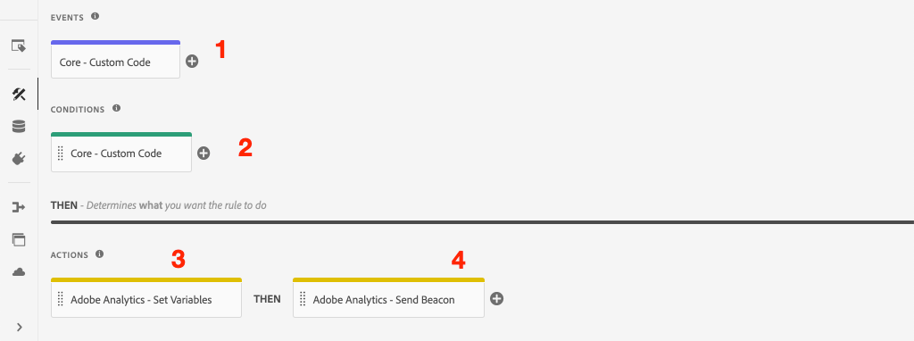

# Klickende Komponente mit Adobe Analytics verfolgen

Verwenden Sie die Ereignis-basierte [Adobe Client Data Layer mit AEM Core Components](https://docs.adobe.com/content/help/de-DE/experience-manager-core-components/using/developing/data-layer/overview.html), um Klicks auf bestimmte Komponenten auf einer Adobe Experience Manager-Site zu verfolgen. Erfahren Sie, wie Sie Regeln in Experience Platform Launch verwenden, um Klick-Ereignisse zu überwachen, nach Komponenten zu filtern und die Daten mit einem Verfolgungs-Linkbeacon an Adobe Analytics zu senden.

## Was Sie erstellen werden

Das WKND-Marketingteam möchte wissen, welche Aktionsaufruf-Schaltflächen auf der Startseite die beste Leistung erbringen. In diesem Lernprogramm fügen wir in Experience Platform Launch eine neue Regel hinzu, die auf `cmp:click`-Ereignis von **Teaser**- und **Button**-Komponenten überwacht und die Komponenten-ID und ein neues Ereignis neben dem Tracking-Link-Beacon an Adobe Analytics sendet.


### Ziele {#objective}

1. Erstellen Sie eine Ereignis-basierte Regel in Launch basierend auf dem `cmp:click`-Ereignis.
1. Filtern Sie die verschiedenen Ereignis nach Komponentenressourcentyp.
1. Legen Sie die angeklickte Komponenten-ID fest und senden Sie Ereignis Adobe Analytics mit dem Tracking-Link-Beacon.

## Voraussetzungen

Dieses Lernprogramm stellt eine Fortsetzung der Funktion [Seitendaten mit Adobe Analytics](./collect-data-analytics.md) erfassen dar und geht davon aus, dass Sie über Folgendes verfügen:

* A **Eigenschaft &quot;Start&quot;** mit aktivierter [Adobe Analytics-Erweiterung](https://docs.adobe.com/content/help/de-DE/launch/using/extensions-ref/adobe-extension/analytics-extension/overview.html)
* **Adobe** Analytics-Test-/Entwicklungs-Report Suite-ID und Tracking-Server. Siehe die folgende Dokumentation für [Erstellen einer neuen Report Suite](https://docs.adobe.com/content/help/en/analytics/admin/manage-report-suites/new-report-suite/new-report-suite.html).
* [Experience Platform ](https://docs.adobe.com/content/help/en/platform-learn/tutorials/data-ingestion/web-sdk/introduction-to-the-experience-platform-debugger.html) Debuggerbrowser-Erweiterung, die mit Ihrer Launch-Eigenschaft konfiguriert wurde, geladen auf  [https://wknd.site/us/en.](https://wknd.site/us/en.html) htmloder eine AEM Site mit aktivierter Adobe Data Layer.

## Inspect the Button and Teaser Schema

Bevor Sie Regeln in Starten erstellen, sollten Sie das [Schema für die Schaltflächen und Teaser](https://docs.adobe.com/content/help/en/experience-manager-core-components/using/developing/data-layer/overview.html#item) überprüfen und sie in der Datenschichtimplementierung überprüfen.

1. Navigieren Sie zu [https://wknd.site/us/en.html](https://wknd.site/us/en.html)
1. Öffnen Sie die Entwicklerwerkzeuge des Browsers und navigieren Sie zur **Konsole**. Führen Sie folgenden Befehl aus:

   ```js
   adobeDataLayer.getState();
   ```

   Dadurch wird der aktuelle Status der Client-Datenschicht der Adobe zurückgegeben.

   

1. Erweitern Sie die Antwort und suchen Sie Einträge mit dem Präfix `button-` und `teaser-xyz-cta`. Es sollte ein Schema wie das folgende angezeigt werden:

   Schaltflächen-Schema:

   ```json
   button-2e6d32893a:
       @type: "wknd/components/button"
       dc:title: "View All"
       parentId: "page-2eee4f8914"
       repo:modifyDate: "2020-07-11T22:17:55Z"
       xdm:linkURL: "/content/wknd/us/en/magazine.html"
   ```

   Teaser-Schema:

   ```json
   teaser-da32481ec8-cta-adf3c09db9:
       @type: "wknd/components/teaser/cta"
       dc:title: "Surf's Up"
       parentId: "teaser-da32481ec8"
       xdm:linkURL: "/content/wknd/us/en/magazine/san-diego-surf.html"
   ```

   Diese basieren auf dem Schema [Component/Container Item](https://docs.adobe.com/content/help/en/experience-manager-core-components/using/developing/data-layer/overview.html#item). Die Regel, die wir in Launch erstellen, wird dieses Schema verwenden.

## Eine auf CTA geklickte Regel erstellen

Die Adobe Client-Datenschicht ist eine **Ereignis**-gesteuerte Datenschicht. Wenn auf die Kernkomponente geklickt wird, wird ein `cmp:click`-Ereignis über die Datenschicht gesendet. Anschließend erstellen Sie eine Regel, die auf das `cmp:click`-Ereignis überwacht wird.

1. Navigieren Sie zum Experience Platform Launch und zur Webeigenschaft, die in die AEM Site integriert ist.
1. Navigieren Sie zum Abschnitt **Regeln** in der Benutzeroberfläche &quot;Starten&quot;und klicken Sie dann auf **Hinzufügen Regel**.
1. Benennen Sie die Regel **CTA, auf die geklickt wurde**.
1. Klicken Sie auf **Ereignisse** > **Hinzufügen**, um den Assistenten **Ereignis-Konfiguration** zu öffnen.
1. Wählen Sie unter **Ereignistyp** **Benutzerspezifischer Code**.

   

1. Klicken Sie im Hauptbereich auf **Editor öffnen** und geben Sie das folgende Codefragment ein:

   ```js
   var componentClickedHandler = function(evt) {
      // defensive coding to avoid a null pointer exception
      if(evt.hasOwnProperty("eventInfo") && evt.eventInfo.hasOwnProperty("path")) {
         //trigger Launch Rule and pass event
         console.debug("cmp:click event: " + evt.eventInfo.path);
         var event = {
            //include the path of the component that triggered the event
            path: evt.eventInfo.path,
            //get the state of the component that triggered the event
            component: window.adobeDataLayer.getState(evt.eventInfo.path)
         };
   
         //Trigger the Launch Rule, passing in the new `event` object
         // the `event` obj can now be referenced by the reserved name `event` by other Launch data elements
         // i.e `event.component['someKey']`
         trigger(event);
      }
   }
   
   //set the namespace to avoid a potential race condition
   window.adobeDataLayer = window.adobeDataLayer || [];
   //push the event listener for cmp:click into the data layer
   window.adobeDataLayer.push(function (dl) {
      //add event listener for `cmp:click` and callback to the `componentClickedHandler` function
      dl.addEventListener("cmp:click", componentClickedHandler);
   });
   ```

   Das obige Codefragment fügt einen Ereignis-Listener hinzu, indem [eine Funktion](https://github.com/adobe/adobe-client-data-layer/wiki#pushing-a-function) in die Datenschicht gedrückt wird. Wenn das Ereignis `cmp:click` ausgelöst wird, wird die Funktion `componentClickedHandler` aufgerufen. In dieser Funktion werden einige Sanitätsprüfungen hinzugefügt und ein neues `event`-Objekt wird mit dem neuesten [Status der Datenschicht](https://github.com/adobe/adobe-client-data-layer/wiki#getstate) für die Komponente erstellt, die das Ereignis ausgelöst hat.

   Danach wird `trigger(event)` aufgerufen. `trigger()` ist ein reservierter Name in Launch und &quot;Trigger&quot; die Launch-Regel. Wir übergeben das `event`-Objekt als Parameter, der wiederum durch einen anderen reservierten Namen in Launch namens `event` verfügbar gemacht wird. Datenelemente in Launch können jetzt auf verschiedene Eigenschaften verweisen: `event.component['someKey']`.

1. Speichern Sie die Änderungen.
1. Klicken Sie anschließend unter **Aktionen** auf **Hinzufügen**, um den Assistenten **Aktionskonfiguration** zu öffnen.
1. Wählen Sie unter **Aktionstyp** **Benutzerspezifischer Code**.

   

1. Klicken Sie im Hauptbereich auf **Editor öffnen** und geben Sie das folgende Codefragment ein:

   ```js
   console.debug("Component Clicked");
   console.debug("Component Path: " + event.path);
   console.debug("Component type: " + event.component['@type']);
   console.debug("Component text: " + event.component['dc:title']);
   ```

   Das `event`-Objekt wird von der `trigger()`-Methode übergeben, die im benutzerdefinierten Ereignis aufgerufen wird. `component` ist der aktuelle Status der Komponente, die von der Datenschicht abgeleitet wurde,  `getState` die den Klick ausgelöst hat.

1. Speichern Sie die Änderungen und führen Sie einen [Build](https://docs.adobe.com/content/help/en/launch/using/reference/publish/builds.html) in Launch aus, um den Code für die [Umgebung](https://docs.adobe.com/content/help/en/launch/using/reference/publish/environments.html) zu bewerben, die auf Ihrer AEM Site verwendet wird.

   >[!NOTE]
   >
   > Es kann sehr hilfreich sein, den [Adobe Experience Platform Debugger](https://docs.adobe.com/content/help/en/platform-learn/tutorials/data-ingestion/web-sdk/introduction-to-the-experience-platform-debugger.html) zu verwenden, um den Einbettungscode auf eine **Development**-Umgebung umzuschalten.

1. Navigieren Sie zur [WKND-Site](https://wknd.site/us/en.html) und öffnen Sie die Entwicklerwerkzeuge, um die Konsole Ansicht. Wählen Sie **log** beibehalten.

1. Klicken Sie auf eine der Schaltflächen **Teaser** oder **Schaltfläche** CTA, um zu einer anderen Seite zu navigieren.

   

1. Beachten Sie in der Entwicklerkonsole, dass die **CTA-Regel, auf die geklickt wurde** ausgelöst wurde:

   

## Datenelemente erstellen

Erstellen Sie anschließend ein Datenelement, um die Komponenten-ID und den Titel zu erfassen, auf die geklickt wurde. In der vorherigen Übung war die Ausgabe von `event.path` ähnlich wie `component.button-b6562c963d` und der Wert von `event.component['dc:title']` war etwa &quot;Ansicht Trips&quot;.

### Komponenten-ID

1. Navigieren Sie zum Experience Platform Launch und zur Webeigenschaft, die in die AEM Site integriert ist.
1. Navigieren Sie zum Abschnitt **Datenelemente** und klicken Sie auf **Hinzufügen Neues Datenelement**.
1. Geben Sie für **Name** **Komponenten-ID** ein.
1. Wählen Sie für **Datenelementtyp** **Benutzerspezifischer Code**.

   

1. Klicken Sie auf **Editor öffnen** und geben Sie Folgendes im Editor für benutzerspezifischen Code ein:

   ```js
   if(event && event.path && event.path.includes('.')) {
       // split on the `.` to return just the component ID
       return event.path.split('.')[1];
   }
   ```

   Speichern Sie die Änderungen.

   >[!NOTE]
   >
   > Denken Sie daran, dass das `event`-Objekt auf der Grundlage des Ereignisses, das die **Regel** beim Starten ausgelöst hat, verfügbar gemacht und in Scoping gesetzt wird. Der Wert eines Datenelements wird erst festgelegt, wenn das Datenelement in einer Regel *referenziert* ist. Daher ist es sicher, dieses Datenelement innerhalb einer Regel zu verwenden, wie die **CTA-Regel, die in der vorherigen Übung *aber* erstellt wurde, in anderen Kontexten nicht sicher zu verwenden.**

### Komponentenname

1. Navigieren Sie zum Abschnitt **Datenelemente** und klicken Sie auf **Hinzufügen Neues Datenelement**.
1. Geben Sie für **Name** **Komponententitel** ein.
1. Wählen Sie für **Datenelementtyp** **Benutzerspezifischer Code**.
1. Klicken Sie auf **Editor öffnen** und geben Sie Folgendes im Editor für benutzerspezifischen Code ein:

   ```js
   if(event && event.component && event.component.hasOwnProperty('dc:title')) {
       return event.component['dc:title'];
   }
   ```

   Speichern Sie die Änderungen.

## hinzufügen einer Bedingung für die CTA-Regel

Aktualisieren Sie anschließend die Regel **CTA, die auf** geklickt wurde, um sicherzustellen, dass die Regel nur ausgelöst wird, wenn das `cmp:click`-Ereignis für einen **Teaser** oder eine **Schaltfläche** ausgelöst wird. Da die CTA des Teasers als separates Objekt in der Datenschicht betrachtet wird, ist es wichtig, die übergeordnete Ebene zu überprüfen, um sicherzustellen, dass sie von einem Teaser stammt.

1. Navigieren Sie in der Benutzeroberfläche &quot;Start&quot;zu der zuvor erstellten Regel **CTA Click**.
1. Klicken Sie unter **Conditions** auf **Hinzufügen**, um den Assistenten **Bedingungskonfiguration** zu öffnen.
1. Wählen Sie für **Bedingungstyp** **Benutzerspezifischer Code**.

   

1. Klicken Sie auf **Editor öffnen** und geben Sie Folgendes im Editor für benutzerspezifischen Code ein:

   ```js
   if(event && event.component && event.component.hasOwnProperty('@type')) {
       // console.log("Event Type: " + event.component['@type']);
       //Check for Button Type OR Teaser CTA type
       if(event.component['@type'] === 'wknd/components/button' ||
          event.component['@type'] === 'wknd/components/teaser/cta') {
           return true;
       }
   }
   
   // none of the conditions are met, return false
   return false;
   ```

   Der obige Code prüft zunächst, ob der Ressourcentyp von einer **Schaltfläche** stammt, und prüft dann, ob der Ressourcentyp von einer CTA innerhalb einer **Teaser** stammt.

1. Speichern Sie die Änderungen.

## Festlegen von Analytics-Variablen und Trigger-Beacon für Link-Verfolgung

Derzeit gibt die Regel **CTA, auf die geklickt wurde** eine Konsolenanweisung aus. Als Nächstes verwenden Sie die Datenelemente und die Analytics-Erweiterung, um Analytics-Variablen als **Aktion** festzulegen. Wir werden außerdem eine zusätzliche Aktion einrichten, um den **Link verfolgen** Trigger und die erfassten Daten an Adobe Analytics zu senden.

1. In der **CTA-Regel** **remove** die Aktion **Core - Benutzerspezifischer Code** (die Konsolenanweisungen):

   

1. Klicken Sie unter Aktionen auf **Hinzufügen**, um eine neue Aktion hinzuzufügen.
1. Legen Sie den Typ **Extension** auf **Adobe Analytics** fest und setzen Sie **Aktionstyp** auf **Variablen festlegen**.

1. Legen Sie die folgenden Werte für **eVars**, **Props** und **Ereignis** fest:

   * `evar8` - `%Component ID%`
   * `prop8` -  `%Component ID%`
   * `event8`

   

   >[!NOTE]
   >
   > Hier wird `%Component ID%` verwendet, da es eine eindeutige Kennung für die CTA sicherstellt, auf die geklickt wurde. Eine potenzielle Nachteil von `%Component ID%` ist, dass der Analytics-Bericht Werte wie `button-2e6d32893a` enthält. Die Verwendung von `%Component Title%` würde einen benutzerfreundlicheren Namen geben, aber der Wert ist möglicherweise nicht eindeutig.

1. Fügen Sie anschließend rechts neben dem Symbol **Adobe Analytics - Variablen setzen** eine weitere Aktion hinzu, indem Sie auf das Symbol **Plus** tippen:

   

1. Legen Sie den Typ **Extension** auf **Adobe Analytics** fest und setzen Sie **Aktionstyp** auf **Beacon senden**.
1. Legen Sie unter **Tracking** das Optionsfeld auf **`s.tl()`** fest.
1. Wählen Sie für **Linktyp** **Benutzerspezifischen Link** und für **Linkname** den Wert auf: **`%Component Title%: CTA Clicked`**:

   

   Dadurch werden die dynamische Variable aus dem Datenelement **Komponententitel** und die statische Zeichenfolge **CTA, auf die geklickt wurde** kombiniert.

1. Speichern Sie die Änderungen. Die **CTA-Regel, auf die geklickt wurde** sollte jetzt die folgende Konfiguration aufweisen:

   

   * **1.** Hör auf das  `cmp:click` Ereignis!
   * **2.** Überprüfen Sie, ob das Ereignis durch einen  **** Buttonor  **Teaser** ausgelöst wurde.
   * **3.** Legen Sie Analytics-Variablen für die Verfolgung der  **Komponenten-** IDs als  **eVar**,  **prop** und ein  **Ereignis** fest.
   * **4.** Senden Sie den Analytics-Beacon &quot;Link verfolgen&quot;(und behandeln Sie ihn  **** nicht als Ansicht der Seite).

1. Speichern Sie alle Änderungen und erstellen Sie Ihre Startbibliothek, indem Sie die entsprechende Umgebung verwenden.

## Validieren des Tracking-Link-Beacon- und Analytics-Aufrufs

Nachdem die Regel **CTA, auf die geklickt wurde** den Analytics-Beacon sendet, sollten Sie die Analytics-Verfolgungsvariablen mit dem Experience Platform-Debugger sehen können.

1. Öffnen Sie die [WKND-Site](https://wknd.site/us/en.html) in Ihrem Browser.
1. Klicken Sie auf das Debugger-Symbol , um den Experience Platform-Debugger zu öffnen.
1. Vergewissern Sie sich, dass der Debugger die Eigenschaft &quot;Start&quot;zu *Ihrer* Entwicklungs-Umgebung zuordnet, wie oben beschrieben und **Konsolenprotokollierung** aktiviert ist.
1. Öffnen Sie das Analytics-Menü und überprüfen Sie, ob die Report Suite auf *Ihre* Report Suite eingestellt ist.

   

1. Klicken Sie im Browser auf eine der Schaltflächen **Teaser** oder **Schaltfläche** CTA, um zu einer anderen Seite zu navigieren.

   

1. Kehren Sie zum Experience Platform-Debugger zurück, blättern Sie nach unten und erweitern Sie **Netzwerkanforderungen** > *Ihre Report Suite*. Sie sollten die Einstellung **eVar**, **prop** und **Ereignis** finden können.

   

1. Kehren Sie zum Browser zurück und öffnen Sie die Developer Console. Navigieren Sie zur Fußzeile der Site und klicken Sie auf einen der Navigationslinks:

   

1. Beobachten Sie in der Browser-Konsole die Meldung *&quot;Benutzerspezifischer Code&quot;für Regel &quot;CTA angeklickt&quot;wurde nicht erfüllt*.

   Dies liegt daran, dass die Navigationskomponente Trigger eines `cmp:click`-Ereignisses *aber* macht, weil wir den Vorgang gegen den Ressourcentyp überprüfen, wird keine Aktion durchgeführt.

   >[!NOTE]
   >
   > Wenn keine Konsolenprotokolle angezeigt werden, stellen Sie sicher, dass **Konsolenprotokollierung** unter **Starten** im Experience Platform-Debugger markiert ist.

## Herzlichen Glückwunsch!

Sie haben soeben die Ereignis-basierte Adobe Client Data Layer und den Experience Platform Launch verwendet, um Klicks auf bestimmte Komponenten auf einer Adobe Experience Manager-Site zu verfolgen.