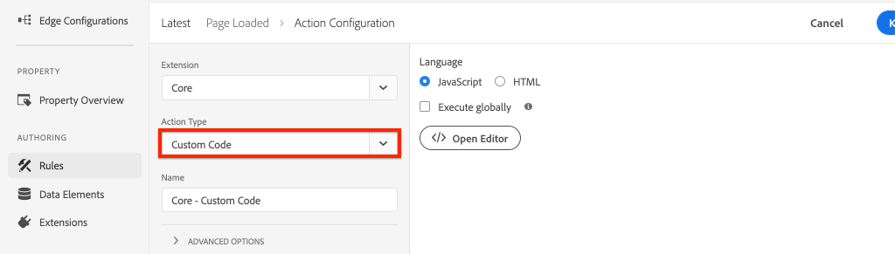

# Nachverfolgen angeklickter Komponenten mit Adobe Analytics

>[!NOTE]
>
>Adobe Experience Platform Launch wurde als eine Suite von Datenerfassungstechnologien in Adobe Experience Platform umbenannt. Infolgedessen wurden in der gesamten Produktdokumentation verschiedene terminologische Änderungen durchgeführt. Eine konsolidierte Übersicht über die terminologischen Änderungen finden Sie in diesem [Dokument](https://experienceleague.adobe.com/docs/experience-platform/tags/term-updates.html?lang=de).

Verwenden Sie die ereignisbasierte [Adobe Client-Datenschicht mit den AEM-Kernkomponenten](https://experienceleague.adobe.com/docs/experience-manager-core-components/using/developing/data-layer/overview.html?lang=de), um Klicks auf bestimmte Komponenten auf einer Adobe Experience Manager-Site zu verfolgen. Erfahren Sie, wie Sie Regeln in der Tag-Eigenschaft verwenden, um auf Klick-Ereignisse zu warten, nach Komponenten zu filtern und die Daten mit einem Verfolgungs-Link-Beacon an Adobe Analytics zu senden.

## Was Sie erstellen werden {#what-build}

Das WKND-Marketing-Team möchte wissen, welche `Call to Action (CTA)`-Schaltflächen auf der Startseite am besten funktionieren. In diesem Tutorial fügen wir der Tag-Eigenschaft eine Regel hinzu, die auf die `cmp:click`-Ereignisse der Komponenten **Teaser** und **Schaltfläche** wartet. Danach senden Sie die Komponenten-ID und ein neues Ereignis zusammen mit dem Verfolgungslink-Beacon an Adobe Analytics.


### Ziele {#objective}

1. Erstellen Sie eine ereignisgesteuerte Regel in der Tag-Eigenschaft, die das Ereignis `cmp:click` erfasst.
1. Filtern Sie die verschiedenen Ereignisse nach Komponenten-Ressourcentyp.
1. Legen Sie die Komponenten-ID fest und senden Sie ein Ereignis mit dem Verfolgungslink-Beacon an Adobe Analytics.

## Voraussetzungen

Dieses Tutorial ist eine Fortsetzung von [Erfassen von Seitendaten mit Adobe Analytics](./collect-data-analytics.md) und setzt voraus, dass Sie über Folgendes verfügen:

* Eine **Tag-Eigenschaft** mit aktivierter [Adobe Analytics-Erweiterung](https://experienceleague.adobe.com/docs/experience-platform/tags/extensions/client/analytics/overview.html?lang=de)
* **Adobe Analytics** test/dev-Report Suite-ID und Tracking-Server. Weitere Informationen zum [Erstellen einer Report Suite](https://experienceleague.adobe.com/docs/analytics/admin/admin-tools/manage-report-suites/c-new-report-suite/new-report-suite.html?lang=de) finden Sie in der folgenden Dokumentation.
* [Experience Platform Debugger](https://experienceleague.adobe.com/docs/platform-learn/data-collection/debugger/overview.html?lang=de)-Browser-Erweiterung, konfiguriert mit Ihrer Tag-Eigenschaft, die auf der [WKND-Site](https://wknd.site/us/en.html) oder einer AEM-Site mit aktivierter Adobe-Datenschicht geladen ist.

## Überprüfen des Schaltflächen- und Teaser-Schemas

Bevor Sie Regeln in der Tag-Eigenschaft erstellen, ist es sinnvoll, das [Schema für die Schaltfläche und den Teaser](https://experienceleague.adobe.com/docs/experience-manager-core-components/using/developing/data-layer/overview.html?lang=de#item) zu überprüfen und sie in der Implementierung der Datenschicht zu untersuchen.

1. Navigieren Sie zur [WKND-Startseite](https://wknd.site/us/en.html)
1. Öffnen Sie die Entwickler-Tools des Browsers und navigieren Sie zur **Konsole**. Führen Sie den folgenden Befehl aus:

   ```js
   adobeDataLayer.getState();
   ```

   Der obige Code gibt den aktuellen Status der Adobe Client-Datenschicht zurück.

   

1. Erweitern Sie die Antwort und suchen Sie nach Einträgen mit dem Präfix `button-` und dem Eintrag `teaser-xyz-cta`. Es sollte ein Datenschema wie das folgende angezeigt werden:

   Schaltflächenschema:

   ```json
   button-2e6d32893a:
       @type: "wknd/components/button"
       dc:title: "View All"
       parentId: "page-2eee4f8914"
       repo:modifyDate: "2020-07-11T22:17:55Z"
       xdm:linkURL: "/content/wknd/us/en/magazine.html"
   ```

   Teaser-Schema:

   ```json
   teaser-da32481ec8-cta-adf3c09db9:
       @type: "wknd/components/teaser/cta"
       dc:title: "Surf's Up"
       parentId: "teaser-da32481ec8"
       xdm:linkURL: "/content/wknd/us/en/magazine/san-diego-surf.html"
   ```

   Die obigen Datendetails basieren auf der Variablen [Komponenten-/Container-Element-Schema](https://experienceleague.adobe.com/docs/experience-manager-core-components/using/developing/data-layer/overview.html?lang=de#item). Die neue Tag-Regel verwendet dieses Schema.

## Erstellen einer auf CTA geklickten Regel

Die Adobe Client-Datenschicht ist eine **ereignisgesteuerte** Datenschicht. Jedes Mal, wenn eine Kernkomponente angeklickt wird, wird über die Datenschicht ein `cmp:click`-Ereignis ausgelöst. Um auf das `cmp:click`-Ereignis zu warten, erstellen wir eine Regel.

1. Navigieren Sie zu Experience Platform und zur Tag-Eigenschaft, die mit der AEM-Site integriert ist.
1. Navigieren Sie zum Abschnitt **Regeln** in der Benutzeroberfläche der Tag-Eigenschaften und klicken Sie dann auf **Regel hinzufügen**.
1. Benennen Sie die Regel **CTA-Geklickt**.
1. Klicken Sie auf **Events** > **Hinzufügen**, um den Assistenten **Event-Konfiguration** zu öffnen.
1. Für das Feld **Ereignistyp** wählen Sie **Benutzerdefinierter Code**.

   

1. Klicken Sie im Hauptbedienfeld auf **Editor öffnen** und geben Sie das folgenden Codesnippet ein:

   ```js
   var componentClickedHandler = function(evt) {
      // defensive coding to avoid a null pointer exception
      if(evt.hasOwnProperty("eventInfo") && evt.eventInfo.hasOwnProperty("path")) {
         //trigger Tag Rule and pass event
         console.debug("cmp:click event: " + evt.eventInfo.path);
         var event = {
            //include the path of the component that triggered the event
            path: evt.eventInfo.path,
            //get the state of the component that triggered the event
            component: window.adobeDataLayer.getState(evt.eventInfo.path)
         };
   
         //Trigger the Tag Rule, passing in the new `event` object
         // the `event` obj can now be referenced by the reserved name `event` by other Tag Property data elements
         // i.e `event.component['someKey']`
         trigger(event);
      }
   }
   
   //set the namespace to avoid a potential race condition
   window.adobeDataLayer = window.adobeDataLayer || [];
   //push the event listener for cmp:click into the data layer
   window.adobeDataLayer.push(function (dl) {
      //add event listener for `cmp:click` and callback to the `componentClickedHandler` function
      dl.addEventListener("cmp:click", componentClickedHandler);
   });
   ```

   Das obige Codesnippet fügt einen Ereignis-Listener hinzu, indem es [eine Funktion](https://github.com/adobe/adobe-client-data-layer/wiki#pushing-a-function) in die Datenschicht schiebt. Jedes Mal, wenn das `cmp:click`-Ereignis ausgelöst wird, wird die Funktion `componentClickedHandler` aufgerufen. In dieser Funktion werden einige Integritätsprüfungen hinzugefügt und ein neues `event`-Objekt mit dem letzten [Zustand der Datenschicht](https://github.com/adobe/adobe-client-data-layer/wiki#getstate) für die Komponente, die das Ereignis ausgelöst hat, konstruiert.

   Schließlich wird die Funktion `trigger(event)` aufgerufen. Die Funktion `trigger()` ist ein reservierter Name in der Tag-Eigenschaft und **löst die Regel aus**. Das `event`-Objekt wird als Parameter übergeben, der wiederum durch einen anderen reservierten Namen in der Tag-Eigenschaft verfügbar gemacht wird. Datenelemente in der Tag-Eigenschaft können jetzt auf verschiedene Eigenschaften verweisen, indem sie Codesnippets wie `event.component['someKey']` verwenden.

1. Speichern Sie die Änderungen.
1. Klicken Sie anschließend unter **Aktionen** auf **Hinzufügen**, um den Assistenten **Aktionskonfiguration** zu öffnen.
1. Für das Feld **Aktionstyp** wählen Sie **Benutzerdefinierter Code**.

   

1. Klicken Sie im Hauptbedienfeld auf **Editor öffnen** und geben Sie das folgende Codesnippet ein:

   ```js
   console.debug("Component Clicked");
   console.debug("Component Path: " + event.path);
   console.debug("Component type: " + event.component['@type']);
   console.debug("Component text: " + event.component['dc:title']);
   ```

   Das `event`-Objekt wird von der `trigger()`-Methode übergeben, die in dem benutzerdefinierten Ereignis aufgerufen wird. Das `component`-Objekt ist der aktuelle Zustand der Komponente, die von der `getState()`-Methode der Datenschicht abgeleitet wurde, und ist das Element, das den Klick ausgelöst hat.

1. Speichern Sie die Änderungen und führen Sie ein [Build](https://experienceleague.adobe.com/docs/experience-platform/tags/publish/builds.html?lang=de) in der Tag-Eigenschaft aus, um den Code in die [Umgebung](https://experienceleague.adobe.com/docs/experience-platform/tags/publish/environments/environments.html?lang=de) zu übertragen, die auf Ihrer AEM-Site verwendet wird.

   >[!NOTE]
   >
   > Es kann nützlich sein, den [Adobe Experience Platform Debugger](https://experienceleague.adobe.com/docs/platform-learn/data-collection/debugger/overview.html?lang=de) zu verwenden, um den Einbettungs-Code in eine **Entwicklungsumgebung** zu wechseln.

1. Navigieren Sie zur [WKND Site](https://wknd.site/us/en.html) und öffnen Sie die Entwickler-Tools, um die Konsole anzuzeigen. Aktivieren Sie zudem das Kontrollkästchen **Protokoll beibehalten**.

1. Klicken Sie auf eine der CTA-Schaltflächen **Teaser** oder **Schaltfläche**, um zu einer anderen Seite zu navigieren.

   

1. Beachten Sie in der Entwicklerkonsole, dass die Regel **CTA-Geklickt** ausgelöst wurde:

   

## Erstellen von Datenelementen

Als Nächstes erstellen Sie ein Datenelement zur Erfassung der Komponenten-ID und des Titels, auf den geklickt wurde. Erinnern Sie sich daran, dass in der vorherigen Übung die Ausgabe von `event.path` etwas Ähnliches wie `component.button-b6562c963d` und der Wert von `event.component['dc:title']` etwas wie „Ausflüge ansehen“ war.

### Komponenten-ID

1. Navigieren Sie zu Experience Platform und zur Tag-Eigenschaft, die mit der AEM-Site integriert ist.
1. Navigieren Sie zum Abschnitt **Datenelemente** und klicken Sie auf **Neues Datenelement hinzufügen**.
1. In das Feld **Name** geben Sie **Komponenten-ID** ein.
1. Für das Feld **Datenelementtyp** wählen Sie **Benutzerdefinierter Code**.

   

1. Klicken Sie auf die Schaltfläche **Editor öffnen** und geben Sie den folgenden Code in den benutzerdefinierten Code-Editor ein:

   ```js
   if(event && event.path && event.path.includes('.')) {
       // split on the `.` to return just the component ID
       return event.path.split('.')[1];
   }
   ```

1. Speichern Sie die Änderungen.

   >[!NOTE]
   >
   > Beachten Sie, dass das `event`-Objekt verfügbar gemacht wird und basierend auf dem Ereignis, das die **Regel** in der Tag-Eigenschaft ausgelöst hat, begrenzt ist. Der Wert eines Datenelements wird erst gesetzt, wenn das Datenelement innerhalb einer Regel *referenziert* wird. Daher ist es sicher, dieses Datenelement in einer Regel wie der im vorherigen Schritt erstellten Regel **Seite geladen** zu verwenden *, aber* wäre in anderen Zusammenhängen nicht sicher.


### Komponententitel

1. Navigieren Sie zum Abschnitt **Datenelemente** und klicken Sie auf **Neues Datenelement hinzufügen**.
1. In das Feld **Name** geben Sie **Komponententitel** ein.
1. Für das Feld **Datenelementtyp** wählen Sie **Benutzerdefinierter Code**.
1. Klicken Sie auf die Schaltfläche **Editor öffnen** und geben Sie den folgenden Code in den benutzerdefinierten Code-Editor ein:

   ```js
   if(event && event.component && event.component.hasOwnProperty('dc:title')) {
       return event.component['dc:title'];
   }
   ```

1. Speichern Sie die Änderungen.

## Hinzufügen einer Bedingung zur Regel „CTA-Geklickt“

Als nächstes aktualisieren Sie die Regel **CTA-Geklickt**, um sicherzustellen, dass die Regel nur ausgelöst wird, wenn das `cmp:click`-Ereignis für einen **Teaser** oder eine **Schaltfläche** ausgelöst wird. Da der CTA des Teasers als separates Objekt in der Datenschicht betrachtet wird, ist es wichtig, das übergeordnete Element zu überprüfen, um sicherzustellen, dass es von einem Teaser stammt.

1. Navigieren Sie in der Benutzeroberfläche der Tag-Eigenschaft zur **CTA-Geklickt**-Regel, die zuvor erstellt wurde.
1. Klicken Sie unter **Bedingungen** auf **Hinzufügen**, um den Assistenten **Bedingungskonfiguration** zu öffnen.
1. Für das Feld **Bedingungsart** wählen Sie **Benutzerdefinierter Code**.

   

1. Klicken Sie auf **Editor öffnen** und geben Sie Folgendes in den Editor für benutzerdefinierten Code ein:

   ```js
   if(event && event.component && event.component.hasOwnProperty('@type')) {
       // console.log("Event Type: " + event.component['@type']);
       //Check for Button Type OR Teaser CTA type
       if(event.component['@type'] === 'wknd/components/button' ||
          event.component['@type'] === 'wknd/components/teaser/cta') {
           return true;
       }
   }
   
   // none of the conditions are met, return false
   return false;
   ```

   Der obige Code prüft zunächst, ob der Ressourcentyp von einer **Schaltfläche** oder von einem CTA in einem **Teaser** stammt.

1. Speichern Sie die Änderungen.

## Festlegen von Analytics-Variablen und auslösen von Verfolgungs-Link-Beacon

Derzeit gibt die **CTA-Geklickt**-Regel lediglich eine Konsolenmeldung aus. Verwenden Sie anschließend die Datenelemente und die Analytics-Erweiterung, um Analytics-Variablen als **Aktion** festzulegen. Wir legen auch eine zusätzliche Aktion fest, um den **Verfolgungs-Link** auszulösen und die gesammelten Daten an Adobe Analytics zu senden.

1. In der **CTA-Geklickt**-Regel, **entfernen** Sie die Aktion **Kern – Benutzerdefinierter Code** (die Konsolenmeldungen):

   

1. Klicken Sie unter Aktionen auf **Hinzufügen**, um eine Aktion zu erstellen.
1. Legen Sie den Typ **Erweiterung** auf **Adobe Analytics** und den **Aktionstyp** auf **Variablen festlegen** fest.

1. Legen Sie die folgenden Werte für **eVars**, **Props**, und **Ereignisse** fest:

   * `evar8` - `%Component ID%`
   * `prop8` - `%Component ID%`
   * `event8`

   

   >[!NOTE]
   >
   > Hier wird `%Component ID%` verwendet, da sie eine eindeutige Kennung für den angeklickten CTA sicherstellt. Ein potenzieller Nachteil bei der Verwendung von `%Component ID%` ist, dass der Analytics-Bericht Werte wie `button-2e6d32893a` enthält. Die Verwendung von `%Component Title%` würde einen benutzerfreundlicheren Namen ergeben, aber der Wert ist möglicherweise nicht eindeutig.

1. Als Nächstes fügen Sie eine zusätzliche Aktion rechts neben **Adobe Analytics – Variablen festlegen** hinzu, indem Sie auf das **Plus**-Symbol tippen:

   

1. Legen Sie den Typ **Erweiterung** auf **Adobe Analytics** und den **Aktionstyp** auf **Beacon senden** fest.
1. Setzen Sie unter **Tracking** das Optionsfeld auf **`s.tl()`**.
1. Für das Feld **Link-Typ** wählen Sie **Benutzerdefinierter Link** und für **Link-Name** setzen Sie den Wert auf: **`%Component Title%: CTA Clicked`**:

   

   Die obige Konfiguration kombiniert die dynamische Variable aus dem Datenelement **Komponententitel** und die statische Zeichenfolge **CTA-Geklickt**.

1. Speichern Sie die Änderungen. Die **CTA-Geklickt**-Regel sollte jetzt die folgende Konfiguration aufweisen:

   

   * **1.** Lauschen Sie auf das Ereignis `cmp:click`.
   * **2.** Überprüfen Sie, ob das Ereignis durch eine **Schaltfläche** oder **Teaser** ausgelöst wurde.
   * **3.** Legen Sie Analytics-Variablen fest, um die **Komponenten-ID** als **eVar**, **Prop** und ein **Ereignis** zu verfolgen.
   * **4.** Senden Sie den Analytics Verfolgungs-Link-Beacon ab (und behandeln Sie ihn **nicht** wie einen Seitenaufruf).

1. Speichern Sie alle Änderungen und erstellen Sie Ihre Tag-Bibliothek, indem Sie sie an die entsprechende Umgebung weiterleiten.

## Validieren des Verfolgungs-Link-Beacon- und Analytics-Aufrufs

Nun sendet die Regel **CTA angeklickt** das Analytics-Beacon. Sie sollten die Analytics-Tracking-Variablen mit dem Experience Platform Debugger sehen können.

1. Öffnen Sie die [WKND-Site](https://wknd.site/us/en.html) in Ihrem Browser.
1. Klicken Sie auf das Debugger-Symbol , um den Experience Platform Debugger zu öffnen.
1. Stellen Sie sicher, dass der Debugger die Tag-Eigenschaft *Ihrer* Entwicklungsumgebung zuordnet, wie zuvor beschrieben, und die **Konsolenprotokollierung** aktiviert ist.
1. Öffnen Sie das Analytics-Menü und überprüfen Sie, ob die Report Suite auf *Ihre* Report Suite festgelegt ist.

   

1. Klicken Sie im Browser auf eine der **Teaser**- oder **Schaltfläche**-CTA-Schaltflächen, um zu einer anderen Seite zu navigieren.

   

1. Kehren Sie zum Experience Platform Debugger zurück, scrollen Sie nach unten und erweitern Sie **Netzwerkanfragen** > *Ihre Report Suite*. Sie sollten feststellen können, dass **eVar**, **prop** und **event** festgelegt sind.

   

1. Kehren Sie zum Browser zurück und öffnen Sie die Entwicklungskonsole. Navigieren Sie zur Fußzeile der Site und klicken Sie auf einen der Navigations-Links:

   

1. Beachten Sie in der Browser-Konsole die Nachricht *„Benutzerspezifischer Code“ für Regel „CTA angeklickt“ wurde nicht erfüllt*.

   Die obige Meldung wird angezeigt, weil die Navigationskomponente ein `cmp:click`-Ereignis auslöst, *aber* wegen [Bedingung für die Regel](#add-a-condition-to-the-cta-clicked-rule), das den Ressourcentyp überprüft, wird keine Aktion ausgeführt.

   >[!NOTE]
   >
   > Wenn keine Konsolenprotokolle angezeigt werden, stellen Sie sicher, dass **Konsolenprotokollierung** unter **Experience Platform Tags** im Experience Platform Debugger aktiviert ist.

## Herzlichen Glückwunsch!

Sie haben soeben das ereignisbasierte Adobe Client Data Layer und Tags in Experience Platform verwendet, um die Klicks auf bestimmte Komponenten auf einer AEM-Site zu verfolgen.
