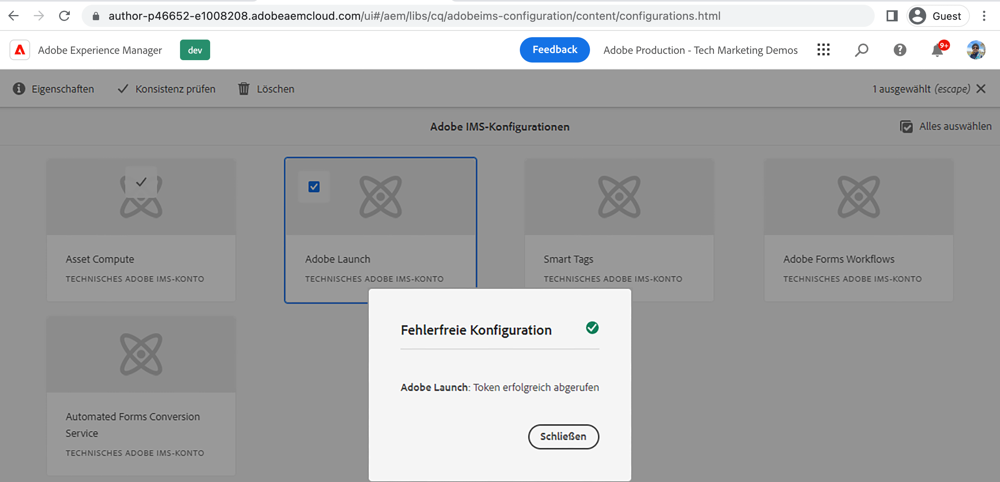

# Verbinden von AEM Sites mit der Tag-Eigenschaft mithilfe von IMS{#connect-aem-and-tag-property-using-ims}

>[!NOTE]
>
>Der Prozess der Umbenennung von Adobe Experience Platform Launch in eine Reihe von Datenerfassungstechnologien wird in der AEM Produktoberfläche, in Inhalten und in der Dokumentation implementiert, sodass der Begriff „Launch“ hier noch verwendet wird.

Erfahren Sie, wie Sie AEM mit der Tag-Eigenschaft über die IMS-Konfiguration (Identity Management-System) in AEM verbinden. Dieses Setup authentifiziert AEM mit der Launch-API und ermöglicht AEM die Kommunikation über die Launch-APIs, um auf Tag-Eigenschaften zuzugreifen.

## Erstellen oder Wiederverwenden der IMS-Konfiguration

Die IMS-Konfiguration mit dem Adobe Developer Console-Projekt ist erforderlich, um AEM in die neu erstellte Tag-Eigenschaft zu integrieren. Diese Konfiguration ermöglicht es AEM, über Launch-APIs mit der Tags-Anwendung zu kommunizieren, und IMS übernimmt den Sicherheitsaspekt dieser Integration.

Wenn eine AEM as Cloud Service-Umgebung bereitgestellt wird, werden automatisch einige IMS-Konfigurationen wie Asset Compute, Adobe Analytics und Adobe Launch erstellt.  Es kann die automatisch erstellte IMS-Konfiguration **Adobe Launch** verwendet werden, bzw. wenn Sie eine AEM 6.x-Umgebung verwenden, sollte eine neue IMS-Konfiguration erstellt werden.

Überprüfen Sie die automatisch erstellte IMS-Konfiguration **Adobe Launch** anhand der folgenden Schritte.

1. Öffnen Sie in AEM das Menü **Tools**

1. Wählen Sie im Abschnitt „Sicherheit“ die Option „Adobe IMS-Konfigurationen“ aus.

1. Wählen Sie die Karte **Adobe Launch** und klicken Sie auf **Eigenschaften**. Überprüfen Sie die Details auf den Registerkarten **Zertifikat** und **Konto**.  Klicken Sie dann auf **Abbrechen**, um zurückzukehren, ohne die automatisch erstellten Details zu ändern.

1. Wählen Sie die Karte **Adobe Launch** und klicken Sie diesmal auf **Konsistenzprüfung**. Sie sollten die Meldung **Erfolg** wie unten dargestellt sehen.

   

## Nächste Schritte

[Erstellen einer Launch-Cloud-Service-Konfiguration in AEM](create-aem-launch-cloud-service.md)
