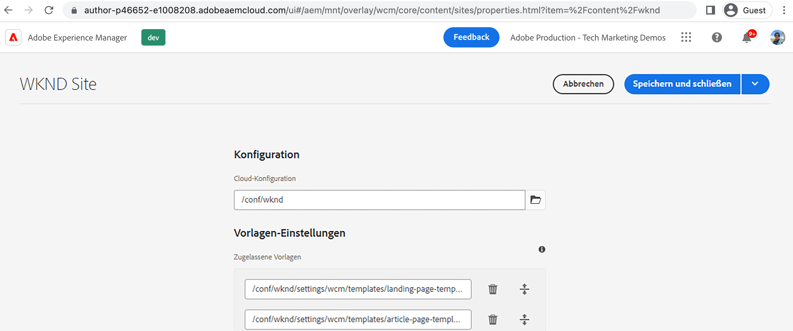

# Erstellen einer Launch-Cloud Service-Konfiguration in AEM {#create-launch-cloud-service}

>[!NOTE]
>
>Der Prozess der Umbenennung von Adobe Experience Platform Launch in eine Reihe von Datenerfassungstechnologien wird in der AEM Produktoberfläche, in Inhalten und in der Dokumentation implementiert, sodass der Begriff &quot;Launch&quot;hier noch verwendet wird.

Erfahren Sie, wie Sie eine Launch-Cloud Service-Konfiguration in Adobe Experience Manager erstellen. AEM Launch-Cloud Service-Konfiguration kann dann auf eine bestehende Site angewendet werden und das Laden der Tags-Bibliotheken kann sowohl in der Autoren- als auch in der Veröffentlichungsumgebung beobachtet werden.

## Launch-Cloud-Service erstellen

Erstellen Sie die Launch-Cloud-Service-Konfiguration mithilfe der folgenden Schritte.

1. Aus dem **Instrumente** Menü auswählen **Cloud Services** und klicken Sie auf **Adobe Launch-Konfigurationen**

1. Wählen Sie den Konfigurationsordner Ihrer Site aus oder wählen Sie **WKND-Site** (bei Verwendung des WKND-Guide-Projekts) und klicken Sie auf **Erstellen**

1. Aus dem _Allgemein_ Registerkarte geben Sie einen Namen für Ihre Konfiguration ein. **Titel** und wählen Sie **Adobe Launch** von _Zugehörige Adobe IMS-Konfiguration_ Dropdown-Liste. Wählen Sie dann Ihren Unternehmensnamen aus dem _Firma_ Dropdown-Liste und wählen Sie die zuvor erstellte Eigenschaft aus der _Eigenschaft_ Dropdown-Liste.

1. Aus dem _Staging_ und _Produktion_ die Standardkonfigurationen beibehalten. Es wird jedoch empfohlen, die Konfigurationen für die reale Produktionseinrichtung zu überprüfen und zu ändern, insbesondere die _Bibliothek asynchron laden_ je nach Leistungs- und Optimierungsanforderungen umschalten. Beachten Sie außerdem, dass _Bibliotheks-URI_ -Wert für Staging und Produktion unterschiedlich ist.

1. Klicken Sie abschließend auf **Erstellen** , um die Launch-Cloud-Services abzuschließen.

   

## Anwenden des Launch-Cloud-Service auf die Site

Um die Tag-Eigenschaft und ihre Bibliotheken auf die AEM-Site zu laden, wird die Launch-Cloud-Service-Konfiguration auf die Site angewendet. Im vorherigen Schritt wird die Cloud-Service-Konfiguration unter dem Site-Namen-Ordner (WKND Site) erstellt, sodass sie automatisch angewendet werden sollte. Überprüfen wir sie.

1. Aus dem **Navigation** Menü auswählen **Sites** Symbol.

1. Wählen Sie die Stammseite der AEM Site aus und klicken Sie auf **Eigenschaften**. Navigieren Sie dann zum **Erweitert** Registerkarte und unter **Konfiguration** überprüfen Sie, ob der Cloud-Konfigurationswert auf Ihre Site-spezifische `conf` Ordner.

   

## Überprüfen des Ladens der Tag-Eigenschaft auf Autoren- und Veröffentlichungsseiten

Jetzt ist es an der Zeit, zu überprüfen, ob die Tag-Eigenschaft und ihre Bibliotheken auf die AEM Site-Seite geladen werden.

1. Öffnen Sie Ihre bevorzugte Site-Seite im **Als veröffentlicht anzeigen** -Modus, sollte in der Browser-Konsole die Protokollmeldung angezeigt werden. Es handelt sich um dieselbe Meldung aus dem JavaScript-Codefragment der Tag-Eigenschaftsregel, die ausgelöst wird, wenn _Bibliothek geladen (Seitenanfang)_ -Ereignis ausgelöst wird.

1. Um dies bei der Veröffentlichung zu überprüfen, veröffentlichen Sie zunächst Ihre **Launch-Cloud-Service** und öffnen Sie die Site-Seite in der Veröffentlichungsinstanz.

   

Herzlichen Glückwunsch! Sie haben die AEM- und Datenerfassungs-Tag-Integration abgeschlossen, die JavaScript-Code in Ihre AEM-Site einfügt, ohne den AEM Projektcode zu aktualisieren.

## Herausforderung - Regel aktualisieren und veröffentlichen in Tag-Eigenschaft

Nutzung der Erfahrungen aus der vorherigen [Erstellen einer Tag-Eigenschaft](./create-tag-property.md) Um die einfache Herausforderung abzuschließen, aktualisieren Sie die vorhandene Regel, um zusätzliche Konsolenanweisungen hinzuzufügen, und verwenden Sie _Veröffentlichungsfluss_ auf der AEM Site bereitstellen.

## Nächste Schritte

[Debuggen einer Tags-Implementierung](debug-tags-implementation.md)
