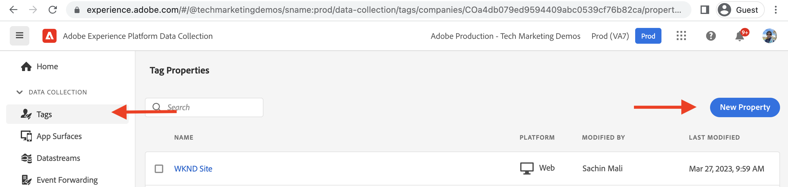
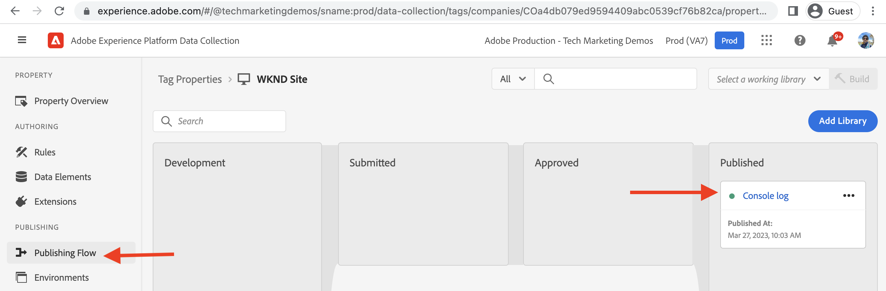

# Erstellen einer Tag-Eigenschaft {#create-tag-property}

Erfahren Sie, wie Sie eine Tag-Eigenschaft mit der Mindestkonfiguration erstellen, um sie in Adobe Experience Manager zu integrieren. Benutzende erhalten eine Einführung in die Tag-Benutzeroberfläche und lernen mehr über Erweiterungen, Regeln und Veröffentlichungs-Workflows.

>[!VIDEO](https://video.tv.adobe.com/v/38553?quality=12&learn=on)

## Erstellung von Tag-Eigenschaften

Führen Sie die folgenden Schritte aus, um eine Tag-Eigenschaft zu erstellen.

1. Navigieren Sie im Browser zur [Adobe Experience Cloud-Startseite](https://experience.adobe.com/) und melden Sie sich mit Ihrer Adobe ID an.

1. Klicken Sie auf der Adobe Experience Cloud-Startseite im Abschnitt _Schnellzugriff_ auf die Anwendung **Datenerfassung**.

1. Klicken Sie in der linken Navigationsleiste auf das Menüelement **Tags** und dann oben rechts auf **Neue Eigenschaft**.

1. Benennen Sie Ihre Tag-Eigenschaft mithilfe des Pflichtfeldes **Name**. Geben Sie in das Feld „Domains“ Ihren Domain-Namen ein oder geben Sie bei Verwendung der AEM as a Cloud Service-Umgebung `adobeaemcloud.com` ein und klicken Sie auf **Speichern**.

   

## Erstellen einer neuen Regel

Öffnen Sie die neu erstellte Tag-Eigenschaft, indem Sie in der Ansicht **Tag-Eigenschaften** auf ihren Namen klicken. Auch unter der Überschrift _Meine letzte Aktivität_ sollte die entsprechend hinzugefügte Core-Erweiterung zu sehen sein. Die Core-Tag-Erweiterung ist die Standarderweiterung. Sie bietet grundlegende Ereignistypen wie Seitenladevorgang, Browser, Formular und andere Ereignistypen. Weitere Informationen dazu finden Sie im [Überblick über die Core-Erweiterung](https://experienceleague.adobe.com/docs/experience-platform/tags/extensions/client/core/overview.html?lang=de).

Mit Regeln können Sie festlegen, was passieren soll, wenn Besuchende mit Ihrer AEM-Site interagieren. Protokollieren Sie einfach zwei Meldungen in der Browser-Konsole, um zu sehen, wie mithilfe der Datenerfassungs-Tag-Integration JavaScript-Code in Ihre AEM-Site eingefügt werden kann, ohne AEM-Projekt-Code zu aktualisieren.

Führen Sie die folgenden Schritte aus, um eine Regel zu erstellen.

1. Klicken Sie in der linken Navigationsleiste im Abschnitt _AUTHORING_ auf **Regeln** und dann auf **Neue Regel erstellen**.

1. Benennen Sie Ihre Regel mithilfe des Pflichtfeldes **Name**.

1. Klicken Sie im Abschnitt _EREIGNISSE_ auf **Hinzufügen**, wählen Sie anschließend im Formular _Ereigniskonfiguration_ aus der Dropdown-Liste **Ereignistyp** die Option _Bibliothek geladen (Seitenanfang)_ aus und klicken Sie auf **Änderungen beibehalten**.

1. Klicken Sie im Abschnitt _AKTIONEN_ auf **Hinzufügen**, wählen Sie anschließend im Abschnitt _Aktionskonfiguration_ aus der Dropdown-Liste **Aktionstyp** die Option _Benutzerdefinierter Code_ aus und klicken Sie auf **Editor öffnen**.

1. Geben Sie im Modal _Code bearbeiten_ folgendes JavaScript-Codesnippet ein, klicken Sie auf **Speichern** und dann auf **Änderungen beibehalten**.

   ```javascript
   console.log('Tags Property loaded, all set for...');
   console.log('capabilities such as capturing data, conversion tracking and delivering unique and personalized experiences');
   ```

1. Klicken Sie auf **Speichern**, um den Regelerstellungsprozess abzuschließen.

   

## Hinzufügen und Veröffentlichen einer Bibliothek

Die _Regeln_ für die Tag-Eigenschaft werden über eine Bibliothek aktiviert. Stellen Sie sich diese Bibliothek als Paket mit JavaScript-Code vor. Führen Sie die folgenden Schritte aus, um die neu erstellte Regel zu aktivieren.

1. Klicken Sie in der linken Navigationsleiste im Abschnitt _PUBLISHING_ auf **Veröffentlichungsfluss** und dann auf **Bibliothek hinzufügen**.

1. Benennen Sie Ihre Bibliothek mithilfe des Feldes **Name** und wählen Sie in der Dropdown-Liste **Umgebung** die Option _Entwicklung (Entwicklung)_ aus.

1. Um alle seit Erstellung der Tag-Eigenschaft geänderten Ressourcen auszuwählen, klicken Sie auf **+ Alle geänderten Ressourcen hinzufügen**. Durch diese Aktion werden die neu erstellte Regel und die Core-Erweiterungsressource zur Bibliothek hinzugefügt. Klicken Sie abschließend auf **Speichern und in Entwicklung erstellen**.

1. Wenn die Bibliothek für die Swimlane **Entwicklung** erstellt wurde, wählen Sie mithilfe der _Auslassungspunkte_ die Option **Zur Genehmigung einreichen** aus.

1. Wählen Sie dann in der Swimlane **Gesendet** mithilfe der _Auslassungspunkte_ die Option **Zur Veröffentlichung genehmigen** aus. Verfahren Sie ebenso in der Swimlane **Genehmigt** mit **Erstellen und in Produktion veröffentlichen**.




Mit dem obigen Schritt wird die einfache Erstellung der Tag-Eigenschaft abgeschlossen, die über eine Regel zum Protokollieren einer Nachricht in der Browser-Konsole bei Seitenladevorgängen verfügt. Außerdem werden die Regel und die Core-Erweiterung durch Erstellen einer Bibliothek veröffentlicht.

## Nächste Schritte

[Verknüpfen von AEM mit Tag-Eigenschaften über IMS](connect-aem-tag-property-using-ims.md)


## Zusätzliche Ressourcen {#additional-resources}

* [Erstellen einer Tag-Eigenschaft](https://experienceleague.adobe.com/docs/platform-learn/implement-in-websites/configure-tags/create-a-property.html?lang=de)
