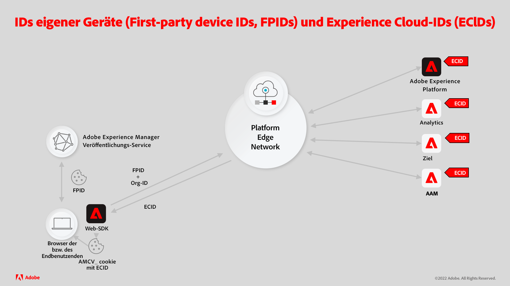
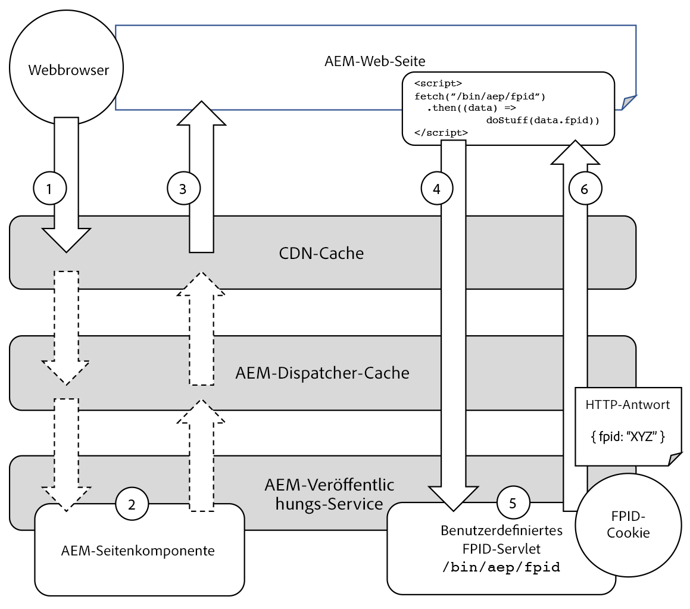

# Generieren von Experience Platform-FPIDs mit AEM Sites

Für die Zusammenarbeit von Adobe Experience Manager (AEM) Sites mit Adobe Experience Platform (AEP) muss AEM ein eindeutiges Erstanbieter-Geräte-ID(FPID)-Cookie generieren und verwalten, um die Benutzeraktivität eindeutig zu verfolgen.

Lesen Sie die unterstützende Dokumentation: [Erfahren Sie mehr über die Zusammenarbeit von Erstanbieter-Geräte-IDs und Experience Cloud-IDs](https://experienceleague.adobe.com/docs/platform-learn/data-collection/edge-network/generate-first-party-device-ids.html?lang=de).

Nachstehend finden Sie einen Überblick darüber, wie FPIDs bei der Verwendung von AEM als Webhost funktionieren.



## Generieren und Beibehalten der FPID mit AEM

Der AEM-Publish-Service optimiert die Leistung, indem so viele Anfragen wie möglich zwischengespeichert werden, sowohl in CDN- als auch in AEM-Dispatcher-Caches.

Es ist zwingend erforderlich, dass HTTP-Anfragen, die das pro Benutzerin bzw. Benutzer eindeutige FPID-Cookie generieren und den FPID-Wert zurückgeben, nie zwischengespeichert und direkt von AEM Publish bereitgestellt werden. Dadurch kann Logik implementiert und so Eindeutigkeit gewährleistet werden.

Vermeiden Sie das Generieren des FPID-Cookies in Anfragen für Web-Seiten oder andere zwischenspeicherbare Ressourcen, da durch die Kombination mit der Anforderung der FPID-Eindeutigkeit diese Ressourcen nicht zwischenspeicherfähig wären.

Im folgenden Diagramm wird beschrieben, wie der AEM-Publish-Service FPIDs verwaltet.



1. Der Webbrowser stellt eine Anfrage für eine von AEM gehostete Web-Seite. Die Anfrage kann mithilfe einer zwischengespeicherten Kopie der Web-Seite aus dem CDN- oder AEM-Dispatcher-Cache verarbeitet werden.
1. Wenn eine Anfrage für die Web-Seite nicht über CDN- oder AEM Dispatcher-Caches möglich ist, geht sie an den AEM-Publish-Service, der die angeforderte Web-Seite generiert.
1. Die Web-Seite wird dann an den Webbrowser zurückgegeben und die Caches, die die Anfrage nicht verarbeiten konnten, werden gefüllt. Bei AEM können Sie davon ausgehen, dass die Cache-Trefferraten von CDN und AEM Dispatcher über 90 % liegen.
1. Die Web-Seite enthält JavaScript, das eine nicht zwischenspeicherbare, asynchrone XHR-Anfrage (AJAX) an ein benutzerdefiniertes FPID-Servlet im AEM-Publish-Service sendet. Da es sich um eine nicht zwischenspeicherbare Anfrage handelt (aufgrund des zufälligen Abfrageparameters und der Cache-Kontroll-Header), wird sie nie vom CDN oder AEM Dispatcher zwischengespeichert und erreicht immer den AEM-Publish-Service, um die Antwort zu generieren.
1. Das benutzerdefinierte FPID-Servlet im AEM-Publish-Service verarbeitet die Anfrage und generiert eine neue FPID, wenn kein vorhandenes FPID-Cookie gefunden wird, oder verlängert die Lebensdauer eines vorhandenen FPID-Cookies. Das Servlet gibt die FPID außerdem im Antworttext zur Verwendung durch das Client-seitige JavaScript zurück. Glücklicherweise ist die benutzerdefinierte FPID-Servlet-Logik einfach und verhindert, dass diese Anfrage die Leistung des AEM-Publish-Service beeinträchtigt.
1. Die Antwort für die XHR-Anfrage wird mit dem FPID-Cookie und der FPID als JSON im Antworttext zur Verwendung durch das Platform Web SDK an den Browser zurückgegeben.

## Code-Beispiel

Der folgende Code und die folgende Konfiguration können im AEM-Publish-Service bereitgestellt werden, um einen Endpunkt zu erstellen, der ein neues FPID-Cookie generiert oder die Lebensdauer eines vorhandenen FPID-Cookies verlängert und die FPID als JSON zurückgibt.

### AEM-FPID-Cookie-Servlet

Es muss ein AEM-HTTP-Endpunkt erstellt werden, um ein FPID-Cookie mithilfe eines [Sling-Servlets](https://sling.apache.org/documentation/the-sling-engine/servlets.html#registering-a-servlet-using-java-annotations-1) zu generieren oder zu verlängern.

+ Das Servlet ist an `/bin/aem/fpid` gebunden, da für den Zugriff keine Authentifizierung erforderlich ist. Wenn eine Authentifizierung erforderlich ist, binden Sie es an einen Sling-Ressourcentyp.
+ Das Servlet akzeptiert HTTP-GET-Anfragen. Die Antwort ist mit `Cache-Control: no-store` gekennzeichnet, um Caching zu verhindern. Dieser Endpunkt sollte jedoch auch mithilfe eindeutiger Cache-Busting-Abfrageparameter angefordert werden.

Wenn eine HTTP-Anfrage das Servlet erreicht, prüft das Servlet, ob in der Anfrage ein FPID-Cookie vorhanden ist:

+ Wenn ein FPID-Cookie vorhanden ist, verlängern Sie die Lebensdauer des Cookies und erfassen Sie seinen Wert, um ihn in die Antwort zu schreiben.
+ Wenn kein FPID-Cookie vorhanden ist, generieren Sie ein neues FPID-Cookie und speichern Sie den Wert, um ihn in die Antwort zu schreiben.

Das Servlet schreibt dann die FPID als JSON-Objekt in folgender Form in die Antwort: `{ fpid: "<FPID VALUE>" }`.

Es ist wichtig, die FPID dem Client im Hauptteil bereitzustellen, da das FPID-Cookie mit `HttpOnly` gekennzeichnet ist. Das bedeutet, dass nur der Server seinen Wert lesen kann, also nicht das Client-seitige JavaScript.

Der FPID-Wert aus dem Antworttext wird verwendet, um Aufrufe mithilfe des Platform Web SDK zu parametrisieren.

Im Folgenden finden Sie einen Beispiel-Code für einen AEM-Servlet-Endpunkt (verfügbar über `HTTP GET /bin/aep/fpid`), der ein FPID-Cookie generiert oder aktualisiert und die FPID als JSON zurückgibt.

+ `core/src/main/java/com/adobe/aem/guides/wkndexamples/core/aep/impl/FpidServlet.java`

```java
package com.adobe.aem.guides.wkndexamples.core.aep.impl;

import com.google.gson.JsonObject;
import org.apache.sling.api.SlingHttpServletRequest;
import org.apache.sling.api.SlingHttpServletResponse;
import org.apache.sling.api.servlets.SlingAllMethodsServlet;
import org.osgi.service.component.annotations.Component;
import org.slf4j.Logger;
import org.slf4j.LoggerFactory;

import javax.servlet.Servlet;
import javax.servlet.http.Cookie;
import java.io.IOException;
import java.util.UUID;

import static org.apache.sling.api.servlets.ServletResolverConstants.SLING_SERVLET_PATHS;
import static org.apache.sling.api.servlets.ServletResolverConstants.SLING_SERVLET_METHODS;

@Component(
        service = {Servlet.class},
        property = {
                SLING_SERVLET_PATHS + "=/bin/aep/fpid",
                SLING_SERVLET_METHODS + "=GET"
        }
)
public class FpidServlet extends SlingAllMethodsServlet {
    private static final Logger log = LoggerFactory.getLogger(FpidServlet.class);
    private static final String COOKIE_NAME = "FPID";
    private static final String COOKIE_PATH = "/";
    private static final int COOKIE_MAX_AGE = 60 * 60 * 24 * 30 * 13;
    private static final String JSON_KEY = "fpid";

    @Override
    protected final void doGet(SlingHttpServletRequest request, SlingHttpServletResponse response) throws IOException {
        // Try to get an existing FPID cookie, this will give us the user's current FPID if it exists
        final Cookie existingCookie = request.getCookie(COOKIE_NAME);

        String cookieValue;

        if (existingCookie == null) {
            //  If no FPID cookie exists, Create a new FPID UUID
            cookieValue = UUID.randomUUID().toString();
        } else {
            // If a FPID cookie exists. get its FPID UUID so it's life can be extended
            cookieValue = existingCookie.getValue();
        }

        // Add the newly generate FPID value, or the extended FPID value to the response
        // Use addHeader(..), as we need to set SameSite=Lax (and addCoookie(..) does not support this)
        response.addHeader("Set-Cookie",
                COOKIE_NAME + "=" + cookieValue + "; " +
                        "Max-Age=" + COOKIE_MAX_AGE + "; " +
                        "Path=" + COOKIE_PATH + "; " +
                        "HttpOnly; " +
                        "Secure; " +
                        "SameSite=Lax");
        
        // Avoid caching the response in any cache
        response.addHeader("Cache-Control", "no-store");

        // Since the FPID is HttpOnly, JavaScript cannot read it (only the server can)
        // Write the FPID to the response as JSON so client JavaScript can access it.
        final JsonObject json = new JsonObject();
        json.addProperty(JSON_KEY, cookieValue);
        
        // The JSON `{ fpid: "11111111-2222-3333-4444-55555555" }` is returned in the response
        response.setContentType("application/json");
        response.getWriter().write(json.toString());
    }
}
```

### HTML-Skript

Ein benutzerdefiniertes Client-seitiges JavaScript muss zur Seite hinzugefügt werden, um das Servlet asynchron aufzurufen, das FPID-Cookie zu generieren oder zu aktualisieren und die FPID in der Antwort zurückzugeben.

Dieses JavaScript-Skript wird der Seite normalerweise mit einer der folgenden Methoden hinzugefügt:

+ [Tags in Adobe Experience Platform](https://experienceleague.adobe.com/docs/experience-platform/tags/home.html?lang=de)
+ [AEM-Client-Bibliothek](https://experienceleague.adobe.com/docs/experience-manager-cloud-service/content/implementing/developing/full-stack/clientlibs.html?lang=de)

Der XHR-Aufruf an das benutzerdefinierte AEM-FPID-Servlet ist schnell, wenn auch asynchron, sodass es möglich ist, dass eine Benutzerin oder ein Benutzer eine von AEM bereitgestellte Web-Seite besucht und verlässt, bevor die Anfrage abgeschlossen werden kann.
In diesem Fall wird beim nächsten Laden einer Web-Seite von AEM erneut versucht, denselben Prozess auszuführen.

Die HTTP-GET-Anfrage an das AEM-FPID-Servlet (`/bin/aep/fpid`) wird mit einem zufälligen Abfrageparameter parametrisiert, um sicherzustellen, dass keine Infrastruktur zwischen Browser und AEM-Publish-Service die Anfrageantwort zwischenspeichert.
Entsprechend wird der Anfrage-Header `Cache-Control: no-store` hinzugefügt, um ein Caching zu vermeiden.

Bei einem Aufruf des AEM-FPID-Servlets wird die FPID aus der JSON-Antwort abgerufen und vom [Platform Web SDK](https://experienceleague.adobe.com/docs/platform-learn/implement-web-sdk/tags-configuration/install-web-sdk.html?lang=de) verwendet, um sie an Experience Platform-APIs zu senden.

Weitere Informationen zum [Verwenden von FPIDs in identityMap](https://experienceleague.adobe.com/docs/experience-platform/edge/identity/first-party-device-ids.html#identityMap?lang=de) finden Sie in der Experience Platform-Dokumentation. 

```javascript
...
<script>
    // Invoke the AEM FPID servlet, and then do something with the response

    fetch(`/bin/aep/fpid?_=${new Date().getTime() + '' + Math.random()}`, { 
            method: 'GET',
            headers: {
                'Cache-Control': 'no-store'
            }
        })
        .then((response) => response.json())
        .then((data) => { 
            // Get the FPID from JSON returned by AEM's FPID servlet
            console.log('My FPID is: ' + data.fpid);

            // Send the `data.fpid` to Experience Platform APIs            
        });
</script>
```

### Dispatcher-Zulassungsfilter

Schließlich müssen HTTP-GET-Anfragen an das benutzerdefinierte FPID-Servlet über die AEM-Dispatcher-Konfiguration `filter.any` zugelassen werden.

Wenn diese Dispatcher-Konfiguration nicht korrekt implementiert ist, führen HTTP-GET-Anfragen an `/bin/aep/fpid` zu einem 404-Fehler.

+ `dispatcher/src/conf.dispatcher.d/filters/filters.any`

```
/1099 { /type "allow" /method "GET" /url "/bin/aep/fpid" }
```

## Experience Platform-Ressourcen

Informationen zu FPIDs (First-Party Device IDs, Erstanbieter-Geräte-IDs) und zum Verwalten von Identitätsdaten mit dem Platform Web SDK finden Sie in der folgenden Experience Platform-Dokumentation.

+ [Generieren von FPIDs](https://experienceleague.adobe.com/docs/platform-learn/data-collection/edge-network/generate-first-party-device-ids.html?lang=de)
+ [FPIDs im Platform Web SDK](https://experienceleague.adobe.com/docs/experience-platform/edge/identity/first-party-device-ids.html?lang=de)
+ [Identitätsdaten im Platform Web SDK](https://experienceleague.adobe.com/docs/experience-platform/edge/identity/overview.html?lang=de)
