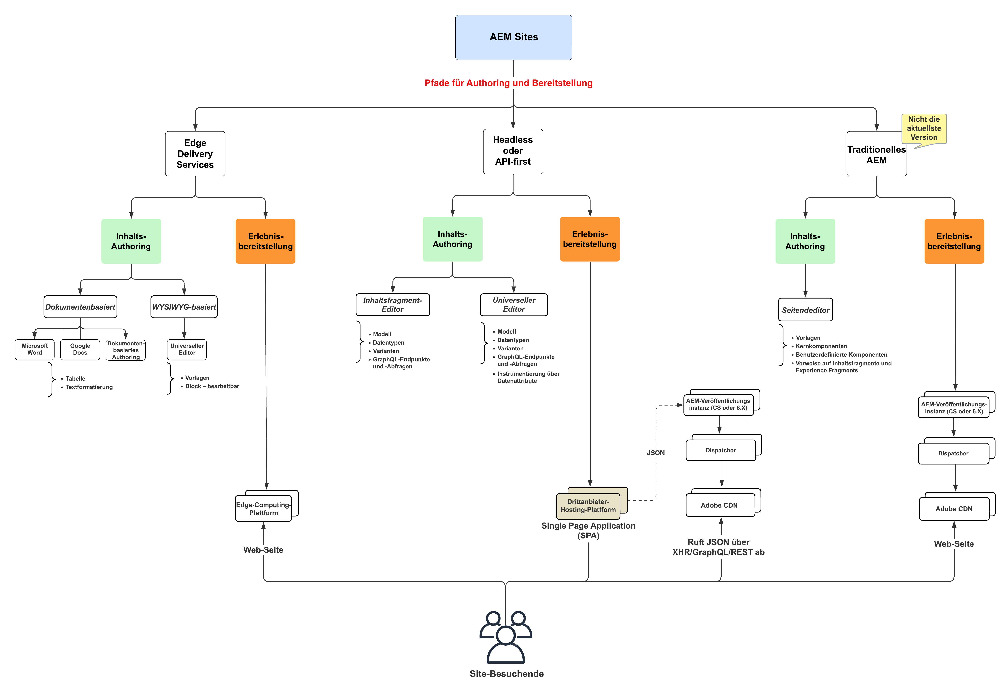
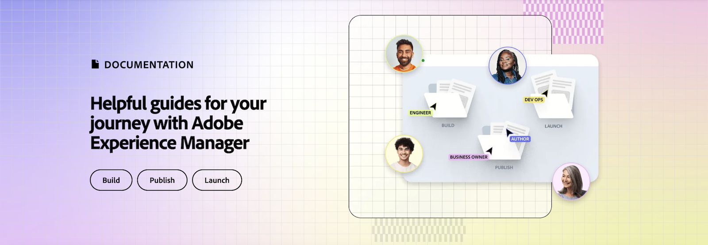
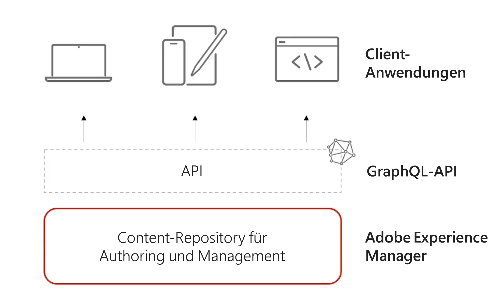

# Videos und Tutorials zu AEM Sites {#overview}

{{edge-delivery-services}}

Adobe Experience Manager (AEM) Sites ist eine führende Experience-Management-Plattform. Dieses Benutzerhandbuch enthält Videos und Tutorials zu den zahlreichen Funktionen und Einsatzmöglichkeiten von AEM Sites.

## Drei Möglichkeiten zum Erstellen mit AEM Sites

AEM Sites bietet drei Möglichkeiten zum Aufbauen, Erstellen und Bereitstellen von Erlebnissen. Unabhängig davon, ob Sie komplette Seiten erstellen, die Edge-Leistung optimieren oder Headless-Apps nutzen, bietet AEM Sites flexible Optionen, um Ihren Projektanforderungen zu entsprechen:

1. **Edge Delivery Services**-Websites nutzen das dokumentbasierte Authoring oder den universellen Adobe-Editor, um Inhalte zu erstellen, die dann aktiviert und dann von Edge Delivery Services as a HTML-Web-Seiten für Endbenutzer bereitgestellt werden. Diese Option ist in erster Linie für _neue und bestehende Projekte_ die hohe Leistung, Skalierbarkeit und Geschwindigkeit erfordern.
1. **Headless/API-First** Web-Erlebnisse verwenden den Inhaltsfragment-Editor oder den universellen Editor, um Inhalte zu erstellen, die dann aktiviert und von AEM Publish als JSON bereitgestellt werden. Diese Option ist in erster Linie für _neue und bestehende Projekte_ die eine Headless-Bereitstellung von Inhalten an mobile Apps, Single Page Applications (SPAs) oder andere Headless-Anwendungen erfordern.
1. **Traditionelles AEM** ist nicht der aktuellste Ansatz für den Web Builder-Erlebnisaufbau mit AEM Sites. Im herkömmlichen AEM wird der Seiteneditor von AEM Author verwendet, um Inhalte zu erstellen, die dann aktiviert und von AEM Publish as HTML WebPages an Endbenutzer übermittelt werden. Für (_Projekte) wird die herkömmliche_ AEM empfohlen.

Diese Optionen wurden entwickelt, um die unterschiedlichen Anforderungen von Marketing-Organisationen zu erfüllen, damit sie personalisierte, ansprechende Erlebnisse mit hoher Geschwindigkeit und auf jedem beliebigen Kanal oder Gerät bereitstellen können.

>[!IMPORTANT]
>
> **Edge Delivery Services** ist die neueste Möglichkeit, mit AEM Sites zu erstellen. Es wurde entwickelt, um skalierte Hochleistungs-Websites bereitzustellen, wobei die Leistungsfähigkeit von Adobe Edge Network genutzt wird.

Das folgende Diagramm veranschaulicht die unterschiedlichen Pfade:

{width="700" zoomable="yes"}

### Vergleichen der Methoden zum Erstellen mit AEM Sites

Die folgende Tabelle bietet einen umfassenden Vergleich der drei Pfade. Der Schwerpunkt liegt dabei auf den Nuancen der Inhaltserstellung und der Bereitstellung für jeden Pfad.

|            | Edge Delivery Services | Headless/API-First | Traditionelles AEM |
|---------------------|------------------------------|---------------------------------|---------------------------------------------|
| **Am besten geeignet für** | Websites mit hohen Anforderungen an Traffic, Leistung und Skalierbarkeit | Mobile Apps, SPAs und andere Headless-Anwendungen | Bestehende Projekte (nicht der aktuellste Ansatz) |
| **Authoring-Tools** | Dokumentenbasiertes Authoring, universeller Editor | Inhaltsfragmente, universeller Editor | Seiteneditor |
| **Erstellte Inhaltsfragmente** | Dokumente oder AEM Author (JCR) | AEM Author (JCR) | AEM Author (JCR) |
| **Versand** | Edge Delivery Services | AEM Publish (mit Adobe CDN + Dispatcher) | AEM Publish (mit Adobe CDN + Dispatcher) |
| **Inhaltsspeicher des Versands** | Edge Delivery Services | AEM Publish (JCR) | AEM Publish (JCR) |
| **Bereitstellungsformat** | HTML  | JSON | HTML  |
| **Entwicklungstechnologie** | JavaScript, CSS | Beliebig (z. B. Swift, React usw.) | Java™, JavaScript, CSS |
| **Implementierungsphase** | Neue und vorhandene Projekte | Neue und vorhandene Projekte | Nur vorhandene Projekte |

## Tutorials

In den folgenden Tutorials erfahren Sie mehr über die drei Pfade, wie Sites mit AEM Sites erstellt werden können:

<!-- CARDS

* https://www.aem.live/docs/
  {title = Edge Delivery Services - Guides}
  {description = Explore Edge Delivery Services with comprehensive guides. The Build, Publish, and Launch guides cover everything you need to get started with EDS.}
  {image = ./assets/edge-delivery-services.png}
  {target = _blank}
* https://experienceleague.adobe.com/en/docs/experience-manager-learn/getting-started-with-aem-headless/overview
  {title = Headless/API-First - Tutorials}
  {description = Learn how to build headless applications powered by AEM content. Tutorials cover frameworks like iOS, Android, and React—choose what fits your stack.}
  {image = ./assets/headless.png}
  {target = _self}
* https://experienceleague.adobe.com/en/docs/experience-manager-learn/getting-started-wknd-tutorial-develop/overview
  {title = Traditional AEM - WKND Tutorial}
  {description = Learn how to build a sample AEM Sites project using the WKND tutorial. This guide walks you through project setup, Core Components, Editable Templates, client-side libraries, and component development.}
  {image = ./assets/aem-wknd-spa-editor-tutorial.png}
  {target = _self}
-->
<!-- START CARDS HTML - DO NOT MODIFY BY HAND -->

    

        

            

                <figure class="image x-is-16by9">
                    
                </figure>
            

            

                

                    

                        <a href="https://www.aem.live/docs/" target="_blank" rel="referrer" title="Handbücher zu Edge Delivery Services">Edge Delivery Services – Handbücher</a>
                    

                    
Erkunden Sie Edge Delivery Services mit umfassenden Handbüchern. Die Build-, Veröffentlichungs- und Launch-Handbücher decken alles ab, was Sie für die ersten Schritte mit EDS benötigen.

                

                <a href="https://www.aem.live/docs/" target="_blank" rel="referrer" class="spectrum-Button spectrum-Button--outline spectrum-Button--primary spectrum-Button--sizeM" style="align-self: flex-start; margin-top: 1rem;">
Mehr erfahren
</a>
            

        

    

    

        

            

                <figure class="image x-is-16by9">
                    
                </figure>
            

            

                

                    

                        <a href="https://experienceleague.adobe.com/de/docs/experience-manager-learn/getting-started-with-aem-headless/overview" target="_self" rel="referrer" title="Headless/API-First – Tutorials">Headless/API-First – Tutorials</a>
                    

                    
Erfahren Sie, wie Sie Headless-Anwendungen erstellen, die auf AEM-Inhalten basieren. Die Tutorials behandeln Frameworks wie iOS, Android und React - wählen Sie aus, was zu Ihrem Stack passt.

                

                <a href="https://experienceleague.adobe.com/de/docs/experience-manager-learn/getting-started-with-aem-headless/overview" target="_self" rel="referrer" class="spectrum-Button spectrum-Button--outline spectrum-Button--primary spectrum-Button--sizeM" style="align-self: flex-start; margin-top: 1rem;">
Mehr erfahren
</a>
            

        

    

    

        

            

                <figure class="image x-is-16by9">
                    
                </figure>
            

            

                

                    

                        <a href="https://experienceleague.adobe.com/de/docs/experience-manager-learn/getting-started-wknd-tutorial-develop/overview" target="_self" rel="referrer" title="Traditionelles AEM - WKND-Tutorial">Traditionelles AEM - WKND-Tutorial</a>
                    

                    
Erfahren Sie im WKND-Tutorial, wie Sie ein Beispielprojekt für AEM Sites erstellen. Dieses Handbuch führt Sie durch die Einrichtung von Projekten, Kernkomponenten, bearbeitbare Vorlagen, Client-seitige Bibliotheken und die Entwicklung von Komponenten.

                

                <a href="https://experienceleague.adobe.com/de/docs/experience-manager-learn/getting-started-wknd-tutorial-develop/overview" target="_self" rel="referrer" class="spectrum-Button spectrum-Button--outline spectrum-Button--primary spectrum-Button--sizeM" style="align-self: flex-start; margin-top: 1rem;">
Mehr erfahren
</a>
            

        

    

<!-- END CARDS HTML - DO NOT MODIFY BY HAND -->

## Zusätzliche Ressourcen

* [AEM Sites-Dokumentation zum Authoring](https://experienceleague.adobe.com/de/docs/experience-manager-65/content/sites/authoring/essentials/first-steps)
* [AEM Sites-Dokumentation zur Entwicklung](https://experienceleague.adobe.com/de/docs/experience-manager-65/content/implementing/developing/introduction/getting-started)
* [AEM Sites-Dokumentation zur Verwaltung](https://experienceleague.adobe.com/de/docs/experience-manager-65/content/sites/administering/home)
* [AEM Sites-Dokumentation zur Bereitstellung](https://experienceleague.adobe.com/de/docs/experience-manager-65/content/implementing/deploying/introduction/platform)
* [Tutorials zu AEM as a Cloud Service](/help/cloud-service/overview.md)
* [Tutorials zu AEM Assets](/help/assets/overview.md)
* [Tutorials zu AEM Forms](/help/forms/overview.md)
* [Grundlegende Tutorials zu AEM](/help/foundation/overview.md)
