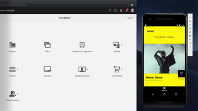

# Überblick {#overview}

Adobe Experience Manager (AEM) Sites ist eine führende Plattform für Erlebnismanagement. Dieses Benutzerhandbuch enthält Videos und Tutorials zu den zahlreichen Funktionen und Funktionen von AEM Sites.

## Neue Funktionen

* **[Erste Schritte mit AEM SPA-Editor und React](https://docs.adobe.com/content/help/en/experience-manager-learn/spa-react-tutorial/overview.html)(Übung)**

    
   *Erste Schritte für Entwickler zur Integration von Einzelseitenanwendungen (SPA) mit AEM mithilfe von React*

* **[Erste Schritte mit AEM SPA-Editor und Angular](https://docs.adobe.com/content/help/en/experience-manager-learn/spa-angular-tutorial/overview.html)(Tutorial)**

    
   *Erste Schritte für Entwickler zur Integration von Einzelseitenanwendungen (SPA) mit AEM mit Angular*

* **[Erste Schritte mit AEM ohne Kopf (Tutorial)](https://docs.adobe.com/content/help/en/experience-manager-learn/getting-started-with-aem-headless/overview.html)**

    
   *Wie Sie Inhalte aus AEM für die Verwendung durch eine native mobile App bereitstellen, in einem kopflosen CMS-Szenario.*

* **[Verwenden von Erlebnisfragmenten (Videoreihen)](./experience-fragments/experience-fragments-feature-video-use.md)**

    
   *Erfahren Sie mehr über AEM Erlebnisfragmente zur Förderung von Inhalten über Kanal hinweg.*

* **[Verwenden von Inhaltsfragmenten (Videoreihen)](./content-fragments/content-fragments-feature-video-use.md)**

    
   *Inhaltsfragmente sind Inhaltsfragmente, die vom Kanal unabhängig sind und wiederverwendet werden können.*

* **[Verwenden des SPA-Editors (Video)](./spa-editor/spa-editor-framework-feature-video-use.md)**

    
   *Erfahren Sie mehr über AEM Bearbeitungsfunktionen für Einzelseitenanwendungen (SPA).*

## Personalauswahl

<table>
<tr>
  <td>
    
    

      <a href="https://docs.adobe.com/content/help/en/experience-manager-learn/getting-started-wknd-tutorial-develop/overview.html">
    <strong>Erste Schritte mit AEM Sites</strong>
    </a>
    

    

    <em>Eine Anleitung für Entwickler, die AEM Sites implementieren möchten.</em>
    

  </td>
  <td>
    
    

    <a href="https://docs.adobe.com/content/help/en/experience-manager-learn/getting-started-with-aem-headless/overview.html">
    <strong>Erste Schritte mit AEM</strong>
    </a>
    

    

    <em>Eine Anleitung zum Einstieg für Entwickler, die AEM als kopfloses CMS verwenden möchten.</em>
    

  </td>
  <td>
    
     

      <a href="https://docs.adobe.com/content/help/en/experience-manager-learn/spa-react-tutorial/overview.html">
        <strong>Erste Schritte mit AEM SPA-Editor</strong>
      </a>
    

    

    <em>Eine Anleitung zum Einstieg für Entwickler zur Integration von Einzelseitenanwendungen (SPA) in AEM.</em>
    

  </td>
</tr>
</table>

## Zusätzliche Ressourcen

* [Experience League - AEM](https://experienceleague.adobe.com/#recommended/solutions/experience-manager)
* [AEM Sites Authoring-Dokumentation](https://helpx.adobe.com/experience-manager/6-5/sites/authoring/user-guide.html)
* [AEM Sites-Entwicklerdokumentation](https://helpx.adobe.com/experience-manager/6-5/sites/developing/user-guide.html)
* [AEM Sites-Verwaltungsdokumentation](https://helpx.adobe.com/experience-manager/6-5/sites/administering/user-guide.html)
* [AEM Sites - Bereitstellung der Dokumentation](https://helpx.adobe.com/experience-manager/6-5/sites/deploying/user-guide.html)
* [AEM als Cloud Service Tutorials](/help/cloud-service/overview.md)
* [AEM Assets Tutorials](/help/assets/overview.md)
* [AEM Forms Tutorials](/help/forms/overview.md)
* [AEM Foundation-Tutorials](/help/foundation/overview.md)
