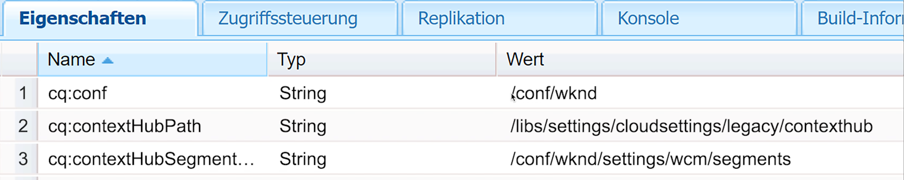

# Setup ContextHub for Personalization {#set-up-contexthub}

ContextHub ist ein Framework zum Speichern, Ändern und Darstellen von Kontextdaten. Mit der ContextHub-JavaScript-API können Sie auf Speicher zugreifen, um Daten bei Bedarf zu erstellen, zu aktualisieren und zu löschen. Daher stellt ContextHub eine Datenschicht auf Ihren Seiten dar. Auf dieser Seite wird beschrieben, wie Sie den Kontext-Hub zu den Seiten Ihrer AEM hinzufügen.

>[!VIDEO](https://video.tv.adobe.com/v/23765/?quality=9&learn=on)

>[!NOTE]
>
>Wir verwenden die WKND Referenz-Website für dieses Video und es ist nicht Teil AEM Veröffentlichung. Sie können die [aktuelle Version hier](https://github.com/adobe/aem-guides-wknd/releases) herunterladen.

hinzufügen Sie ContextHub auf Ihre Seiten, um die ContextHub-Funktionen zu aktivieren und Links zu den ContextHub-JavaScript-Bibliotheken zu erstellen. Die ContextHub JavaScript-API bietet Zugriff auf die Kontextdaten, die von ContextHub verwaltet werden.

## Hinzufügen von ContextHub zu einer Seitenkomponente {#adding-contexthub-to-a-page-component}

Um die ContextHub-Funktionen zu aktivieren und eine Verknüpfung mit den ContextHub-JavaScript-Bibliotheken herzustellen, fügen Sie die Komponente `contexthub` im Abschnitt `<head>` Ihrer Webseite ein. Der HTML-Code für Ihre Seitenkomponente ähnelt dem folgenden Beispiel:

```java
<!--/* Include Context Hub */-->
<sly data-sly-resource="${'contexthub' @ resourceType='granite/contexthub/components/contexthub'}"/>
*/-->
```

## Site-Konfiguration und ContextHub-Segmente {#site-configuration-and-contexthub-segments}

ContextHub enthält eine Segmentations-Engine, die Segmente verwaltet und bestimmt, welche Segmente für den aktuellen Kontext aufgelöst werden. Mehrere Segmente sind definiert. Sie können die Javascript-API verwenden, um [aufgelöste Segmente zu ermitteln](https://helpx.adobe.com/experience-manager/6-5/sites/developing/using/ch-adding.html#DeterminingResolvedContextHubSegments). Aktivieren Sie die ContextHub-Segmente für Ihre Site unter [[!UICONTROL Konfigurationsbrowser]](https://docs.adobe.com/content/help/de-DE/experience-manager-cloud-service/implementing/developing/configurations.html).

## Erstellen von Segmenten {#create-segments}

Erstellen Sie AEM Segmente, die als Regeln für die Teaser fungieren. Das heißt, sie definieren, wann Inhalte in einem Teaser auf einer Webseite angezeigt werden. Inhalte können dann entsprechend den zutreffenden Segmenten speziell auf die Anforderungen und Interessen des Besuchers abgestimmt werden.

## Zuweisen der Cloud-Konfiguration, des Segmentpfads und des ContextHub-Pfads zu Ihrer Site {#assigning-cloud-configuration-segment-path-and-contexthub-path-to-your-site}

Zuweisen des Cloud-Konfigurationspfades, des Segmentierungspfads und des ContextHub-Pfads zu Ihrem Site-Stammknoten, damit Sie ein personalisiertes Erlebnis für Ihre Audience erstellen können. Mithilfe des ContextHub können Sie die Kontextdaten bearbeiten und aufgelöste Segmente testen.



Weitere Informationen zu ContextHub und zur Segmentierung finden Sie unten:

* [ContextHub](https://helpx.adobe.com/experience-manager/6-5/sites/developing/using/contexthub.html)
* [Hinzufügen von Context Hub zu Seiten und Zugreifen auf Stores](https://helpx.adobe.com/experience-manager/6-5/sites/developing/using/ch-adding.html)
* [Grundlegendes zur Segmentierung](https://helpx.adobe.com/experience-manager/6-5/sites/classic-ui-authoring/using/classic-personalization-campaigns-segmentation.html)
* [Konfigurieren der Segmentierung mit ContextHub](https://helpx.adobe.com/experience-manager/6-5/sites/administering/using/segmentation.html)
