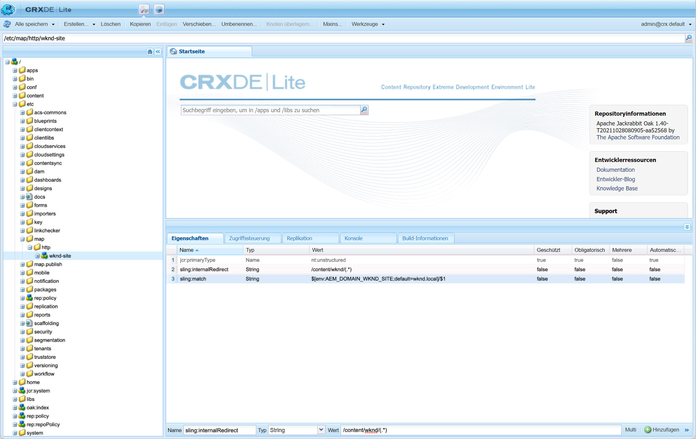

# Sitemaps

Erfahren Sie, wie Sie Ihr SEO durch die Erstellung von Sitemaps für AEM Sites verbessern können.

>[!WARNING]
>
>In diesem Video wird die Verwendung von relativen URLs in der Sitemap veranschaulicht. Sitemaps [sollte absolute URLs verwenden](https://sitemaps.org/protocol.html). Siehe [Konfigurationen](#absolute-sitemap-urls) für die Aktivierung absoluter URLs, da dies im Video unten nicht behandelt wird.

>[!VIDEO](https://video.tv.adobe.com/v/337960?quality=12&learn=on)

## Konfigurationen

### Absolute Sitemap-URLs{#absolute-sitemap-urls}

AEM Sitemap unterstützt absolute URLs durch Verwendung von [Sling-Zuordnung](https://sling.apache.org/documentation/the-sling-engine/mappings-for-resource-resolution.html). Dies geschieht durch Erstellen von Zuordnungsknoten für die AEM Dienste, die Sitemaps generieren (normalerweise der AEM-Veröffentlichungsdienst).

Eine Beispieldefinition für einen Sling-Zuordnungsknoten für `https://wknd.com` kann definiert werden unter `/etc/map/https` wie folgt:

| Pfad  | Eigenschaftsname | Eigenschaftstyp | Eigenschaftenwert |
|------|----------|---------------|-------|
| `/etc/map/https/wknd-site` | `jcr:primaryType` | Zeichenfolge | `nt:unstructured` |
| `/etc/map/https/wknd-site` | `sling:internalRedirect` | Zeichenfolge | `/content/wknd/(.*)` |
| `/etc/map/https/wknd-site` | `sling:match` | Zeichenfolge | `wknd.com/$1` |

Der folgende Screenshot zeigt eine ähnliche Konfiguration, aber für `http://wknd.local` (ein lokales Hostname-Mapping, das auf `http`).




### OSGi-Konfiguration des Sitemap Scheduler

Definiert die [OSGi-Werkskonfiguration](http://localhost:4502/system/console/configMgr/org.apache.sling.sitemap.impl.SitemapScheduler) für die Häufigkeit (mithilfe von [Cron-Ausdrücke](http://www.cronmaker.com)) Sitemaps werden in AEM neu erstellt und zwischengespeichert.

`ui.config/src/main/jcr_content/apps/wknd/osgiconfig/config.publish`

```json
{
  "scheduler.name": "WKND Sitemaps",
  "scheduler.expression": "0 0 2 1/1 * ? *",
  "searchPath": "/content/wknd"
}
```

### Dispatcher-Zulassungsfilterregel

Erlauben Sie HTTP-Anforderungen für die Sitemap-Index- und Sitemap-Dateien.

`dispatcher/src/conf.dispatcher.d/filters/filters.any`

```
...

# Allow AEM sitemaps
/0200 { /type "allow" /path "/content/*" /selectors '(sitemap-index|sitemap)' /extension "xml" }
```

### Apache-Webserver-Neuschreibungsregel

Sichern `.xml` sitemap-HTTP-Anfragen werden an die richtige zugrunde liegende AEM weitergeleitet. Wenn keine URL-Verkürzung verwendet wird oder Sling-Zuordnungen zum Erzielen einer URL-Verkürzung verwendet werden, ist diese Konfiguration nicht erforderlich.

`dispatcher/src/conf.d/rewrites/rewrite.rules`

```
...
RewriteCond %{REQUEST_URI} (.html|.jpe?g|.png|.svg|.xml)$
RewriteRule ^/(.*)$ /content/${CONTENT_FOLDER_NAME}/$1 [PT,L]
```

## Ressourcen

+ [AEM Sitemap-Dokumentation](https://experienceleague.adobe.com/docs/experience-manager-cloud-service/overview/seo-and-url-management.html?lang=en#building-an-xml-sitemap-on-aem)
+ [Apache Sling Sitemap-Dokumentation](https://github.com/apache/sling-org-apache-sling-sitemap#readme)
+ [Sitemap.org Sitemap-Dokumentation](https://www.sitemaps.org/protocol.html)
+ [Dokumentation zur Sitemap-Indexdatei &quot;Sitemap&quot;](https://www.sitemaps.org/protocol.html#index)
+ [Hersteller](http://www.cronmaker.com/)