# Entwicklung mit dem AEM SPA Editor - Hallo Welt-Tutorial {#developing-with-the-aem-spa-editor-hello-world-tutorial}

>[!WARNING]
>
> Dieses Tutorial ist **veraltet**. Es wird empfohlen, entweder [Erste Schritte mit dem AEM SPA Editor und Angular](https://docs.adobe.com/content/help/en/experience-manager-learn/spa-angular-tutorial/overview.html) oder [Erste Schritte mit dem AEM SPA Editor und React](https://docs.adobe.com/content/help/en/experience-manager-learn/spa-react-tutorial/overview.html)

AEM SPA-Editor unterstützt die kontextbezogene Bearbeitung einer Einzelseitenanwendung oder eines Einzelseitenprogramms. Dieses Lernprogramm stellt eine Einführung in die SPA-Entwicklung dar, die mit AEM SPA Editor JS SDK verwendet werden soll. Das Lernprogramm erweitert die App &quot;We.Retail&quot;um eine benutzerdefinierte Komponente &quot;Hello World&quot;. Die Benutzer können das Lernprogramm mithilfe von React- oder Angular-Frameworks abschließen.

>[!NOTE]
>
> Für die Funktion &quot;Einzelseitenanwendung (SPA) Editor&quot;ist AEM 6.4 Service Pack 2 oder höher erforderlich.
>
> Der SPA-Editor ist die empfohlene Lösung für Projekte, bei denen clientseitiges Rendering (z.B. React oder Angular) durch das SPA-Framework erforderlich ist.

## Voraussetzung für das Lesen {#prereq}

In diesem Lernprogramm sollen die Schritte hervorgehoben werden, die zum Zuordnen einer SPA-Komponente zu einer AEM Komponente erforderlich sind, um die Bearbeitung im Kontext zu aktivieren. Benutzer, die dieses Tutorial beginnen, sollten sich mit den Grundkonzepten der Entwicklung mit Adobe Experience Manager, AEM sowie mit der Entwicklung von React of Angular Frameworks vertraut machen. Das Lernprogramm umfasst sowohl Back-End- als auch Front-End-Entwicklungs-Aufgaben.

Es wird empfohlen, die folgenden Ressourcen zu überprüfen, bevor dieses Lernprogramm beginnt:

* [SPA Editor Feature Video](spa-editor-framework-feature-video-use.md) - Eine Videoübersicht über den SPA Editor und die Web.Retail Protokoll App.
* [React.js Tutorial](https://reactjs.org/tutorial/tutorial.html) - Eine Einführung in die Entwicklung mit dem React Framework.
* [Angular Tutorial](https://angular.io/tutorial) - Eine Einführung in die Entwicklung mit Angular

## Lokale Entwicklungsumgebung {#local-dev}

Diese Übung wurde für folgende Aufgaben entwickelt:

[Adobe Experience Manager 6.5](https://helpx.adobe.com/de/experience-manager/6-5/release-notes.html) oder [Adobe Experience Manager 6.4](https://helpx.adobe.com/de/experience-manager/6-4/sites/deploying/using/technical-requirements.html) + [Service Pack 5](https://helpx.adobe.com/de/experience-manager/6-4/release-notes/sp-release-notes.html)

In diesem Lernprogramm sollten die folgenden Technologien und Werkzeuge installiert werden:

1. [Java 11](https://downloads.experiencecloud.adobe.com/content/software-distribution/en/general.html)
2. [Apache Maven - 3.3.1+](https://maven.apache.org/)
3. [Node.js - 8.11.1+](https://nodejs.org/en/) und npm 5.6.0+ (npm wird mit node.js installiert)

Dublette überprüfen Sie die Installation der oben genannten Tools, indem Sie ein neues Terminal öffnen und Folgendes ausführen:

```shell
$ java -version
java version "11 +"

$ mvn -version
Apache Maven 3.3.9

$ node --version
v8.11.1

$ npm --version
6.1.0
```

## Überblick {#overview}

Das Grundkonzept besteht darin, eine SPA-Komponente einer AEM Komponente zuzuordnen. AEM Komponenten, die serverseitig ausgeführt werden, exportieren Inhalte in Form von JSON. Der JSON-Inhalt wird vom SPA genutzt und im Browser clientseitig ausgeführt. Es wird eine 1:1-Zuordnung zwischen SPA-Komponenten und einer AEM-Komponente erstellt.

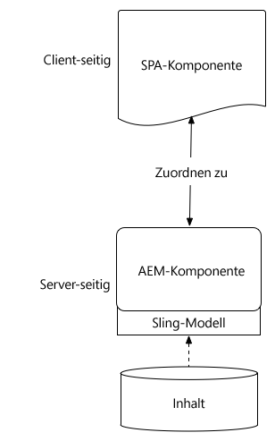

Beliebte Frameworks [React JS](https://reactjs.org/) und [Angular](https://angular.io/) werden standardmäßig unterstützt. Benutzer können dieses Lernprogramm entweder in Angular oder React durchführen, mit welchem Framework sie am besten vertraut sind.

## Projekt-Setup {#project-setup}

Die Entwicklung von SPA hat einen Fuß in AEM Entwicklung und den anderen draußen. Ziel ist es, die Entwicklung von SPA unabhängig und (meist) agnostisch zu AEM.

* SPA-Projekte können während der Front-End-Entwicklung unabhängig vom AEM Projekt betrieben werden.
* Front-End-Bauwerkzeuge und -Technologien wie Webpack, NPM [!DNL Grunt] und [!DNL Gulp]weiterhin verwendet werden.
* Um für AEM zu erstellen, wird das SPA-Projekt kompiliert und automatisch in das AEM Projekt eingebunden.
* Standardpakete AEM die zur Bereitstellung der SPA in AEM verwendet werden.

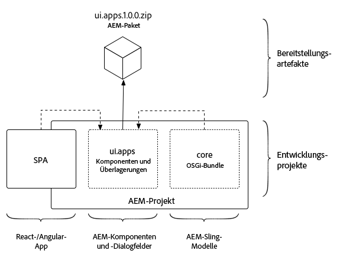

*Die SPA-Entwicklung hat einen Fuß in AEM Entwicklung, der andere in der Entwicklung - sie ermöglicht eine selbstständige Entwicklung der SPA und (größtenteils) AEM agnostisch.*

Ziel dieses Lernprogramms ist es, die App &quot;We.Retail Protokoll&quot;um eine neue Komponente zu erweitern. Beginn durch Herunterladen des Quellcodes für die Web.Retail-Protokoll-App und Bereitstellung auf einem lokalen AEM.

1. **Laden Sie** den neuesten [We.Retail-Protokoll-Code von GitHub](https://github.com/adobe/aem-sample-we-retail-journal)herunter.

   Oder klonen Sie das Repository über die Befehlszeile:

   ```shell
   $ git clone git@github.com:adobe/aem-sample-we-retail-journal.git
   ```

   >[!NOTE]
   >
   >Das Tutorial wird gegen die **Übergeordnet** Zweigstelle mit **1.2.1-SNAPSHOT** Version des Projektes arbeiten.

2. Die folgende Struktur sollte sichtbar sein:

   

   Das Projekt umfasst die folgenden Maven-Module:

   * `all`: Bettet das gesamte Projekt in ein einzelnes Paket ein und installiert es.
   * `bundles`: Enthält zwei OSGi-Pakete: Kommas und Core, die Java-Code [!DNL Sling Models] und anderen Code enthalten.
   * `ui.apps`: enthält die /apps Teile des Projekts, d.h. JS &amp; CSS clientlibs, Komponenten, runmode-spezifische Konfigurationen.
   * `ui.content`: enthält Strukturinhalt und Konfigurationen (`/content`, `/conf`)
   * `react-app`: Wir.Retail Protokoll React Applikation. Dies ist sowohl ein Maven-Modul als auch ein Webpack-Projekt.
   * `angular-app`: Wir.Retail Protokoll Angular Anwendung. Dies ist sowohl ein [!DNL Maven] Modul- als auch ein Webpack-Projekt.

3. Öffnen Sie ein neues Terminalfenster und führen Sie den folgenden Befehl aus, um die gesamte App auf einer lokalen AEM, die auf [http://localhost:4502](http://localhost:4502)ausgeführt wird, zu erstellen und bereitzustellen.

   ```shell
   $ cd <src>/aem-sample-we-retail-journal
   $ mvn -PautoInstallSinglePackage clean install
   ```

   >[!NOTE]
   >
   > In diesem Projekt ist das Maven-Profil zum Erstellen und Verpacken des gesamten Projektes `autoInstallSinglePackage`

   >[!CAUTION]
   >
   > Wenn beim Erstellen ein Fehler auftritt, [stellen Sie sicher, dass die Maven-Datei settings.xml das Maven-Artefakt-Repository](https://helpx.adobe.com/de/experience-manager/kb/SetUpTheAdobeMavenRepository.html)der Adobe enthält.

4. Navigieren Sie zu:

   * [http://localhost:4502/editor.html/content/we-retail-journal/react/en/home.html](http://localhost:4502/editor.html/content/we-retail-journal/react/en/home.html)
   * [http://localhost:4502/editor.html/content/we-retail-journal/angular/en/home.html](http://localhost:4502/editor.html/content/we-retail-journal/angular/en/home.html)

   Die Web.Retail-Protokoll-App sollte im AEM Sites-Editor angezeigt werden.

5. Wählen Sie im [!UICONTROL Bearbeitungsmodus] eine zu bearbeitende Komponente aus und aktualisieren Sie den Inhalt.

   

6. Klicken Sie auf das Symbol [!UICONTROL Seiteneigenschaften] , um die [!UICONTROL Seiteneigenschaften]zu öffnen. Wählen Sie Vorlage [!UICONTROL bearbeiten] , um die Vorlage der Seite zu öffnen.

   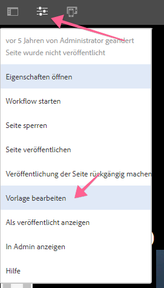

7. In der neuesten Version des SPA-Editors können [bearbeitbare Vorlagen](https://helpx.adobe.com/experience-manager/6-5/sites/developing/using/page-templates-editable.html) genauso verwendet werden wie bei herkömmlichen Sites-Implementierungen. Dies wird später mit unserer benutzerdefinierten Komponente erneut überprüft.

   >[!NOTE]
   >
   > Nur AEM 6.5 und AEM 6.4 + **Service Pack 5** unterstützen bearbeitbare Vorlagen.

## Entwicklungübersicht {#development-overview}

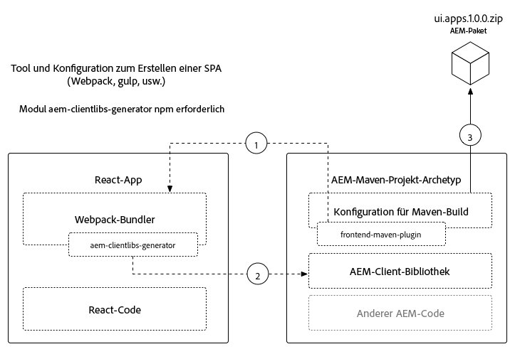

SPA-Entwicklungsiterationen erfolgen unabhängig von AEM. Wenn die besondere Schutzanordnung in AEM bereitgestellt werden kann, werden die folgenden hochrangigen Schritte durchgeführt (wie oben dargestellt).

1. Der AEM Projekterstellung wird aufgerufen, was wiederum einen Build des SPA-Projekts auslöst. Das Protokoll We.Retail verwendet das [**frontend-maven-plugin**](https://github.com/eirslett/frontend-maven-plugin).
2. Der [**aem-clientlib-generator**](https://www.npmjs.com/package/aem-clientlib-generator) des SPA-Projekts integriert die kompilierte SPA als AEM Client Library in das AEM Projekt.
3. Das AEM Projekt generiert ein AEM Paket, einschließlich der kompilierten SPA, sowie jeden anderen AEM Code.

## AEM Komponente erstellen {#aem-component}

**Persona: AEM Developer**

Zuerst wird eine AEM Komponente erstellt. Die AEM-Komponente ist für das Rendern der JSON-Eigenschaften verantwortlich, die von der React-Komponente gelesen werden. Die Komponente AEM ist auch für die Bereitstellung eines Dialogfelds für alle bearbeitbaren Eigenschaften der Komponente verantwortlich.

Importieren Sie [!DNL Eclipse]das Projekt &quot;Wir.Retail Protokoll Maven&quot;mit oder [!DNL IDE]anderen Produkten.

1. Aktualisieren Sie den Reaktor **pom.xml** , um das [!DNL Apache Rat] Plug-In zu entfernen. Dieses Plug-in überprüft jede Datei, um sicherzustellen, dass ein Lizenzheader vorhanden ist. Für unsere Zwecke müssen wir uns nicht um diese Funktionalität kümmern.

   Entfernen Sie in **aem-sample-we-retail-journal/pom.xml** das **apache-rate-plugin**:

   ```xml
   <!-- Remove apache-rat-plugin -->
   <plugin>
           <groupId>org.apache.rat</groupId>
           <artifactId>apache-rat-plugin</artifactId>
           <configuration>
               <excludes combine.children="append">
                   <exclude>*</exclude>
                       ...
               </excludes>
           </configuration>
           <executions>
                   <execution>
                       <phase>verify</phase>
                       <goals>
                           <goal>check</goal>
                       </goals>
               </execution>
           </executions>
       </plugin>
   ```

2. Erstellen Sie im Modul **we-retail-Protokoll-content** (`<src>/aem-sample-we-retail-journal/ui.apps`) einen neuen Knoten unter `ui.apps/jcr_root/apps/we-retail-journal/components` dem Namen **helloworld** vom Typ **cq:Component**.
3. hinzufügen die folgenden Eigenschaften der **Helloworld** -Komponente, dargestellt in XML (`/helloworld/.content.xml`):

   ```xml
   <?xml version="1.0" encoding="UTF-8"?>
   <jcr:root xmlns:cq="http://www.day.com/jcr/cq/1.0" xmlns:jcr="http://www.jcp.org/jcr/1.0"
       jcr:description="Hello World Component for We.Retail Journal"
       jcr:primaryType="cq:Component"
       jcr:title="Hello World"
       componentGroup="We.Retail Journal" />
   ```

   

   >[!NOTE]
   >
   > Zur Veranschaulichung der Funktion Editierbare Vorlagen haben wir die `componentGroup="Custom Components"`. In einem realen Projekt ist es am besten, die Anzahl der Komponentengruppen zu minimieren, sodass eine bessere Gruppe &quot;[!DNL We.Retail Journal]&quot;ist, um mit den anderen Inhaltskomponenten übereinzustimmen.
   >
   > Nur AEM 6.5 und AEM 6.4 + **Service Pack 5** unterstützen bearbeitbare Vorlagen.

4. Als Nächstes wird ein Dialogfeld erstellt, damit eine benutzerdefinierte Nachricht für die Komponente **Hello World** konfiguriert werden kann. Fügen Sie unter `/apps/we-retail-journal/components/helloworld` den Knotennamen **cq:dialog** von **nt:unstructured** hinzu.
5. Das **cq:dialog** zeigt ein einzelnes Textfeld an, das Text in einer Eigenschaft namens **[!DNL message]** beibehält. Fügen Sie unter dem neu erstellten **cq:dialog** die folgenden Knoten und Eigenschaften hinzu, die unten in XML dargestellt werden (`helloworld/_cq_dialog/.content.xml`):

   ```xml
   <?xml version="1.0" encoding="UTF-8"?>
   <jcr:root xmlns:sling="http://sling.apache.org/jcr/sling/1.0" xmlns:cq="http://www.day.com/jcr/cq/1.0" xmlns:jcr="http://www.jcp.org/jcr/1.0" xmlns:nt="http://www.jcp.org/jcr/nt/1.0"
       jcr:primaryType="nt:unstructured"
       jcr:title="We.Retail Journal - Hello World"
       sling:resourceType="cq/gui/components/authoring/dialog">
       <content
           jcr:primaryType="nt:unstructured"
           sling:resourceType="granite/ui/components/coral/foundation/container">
           <items jcr:primaryType="nt:unstructured">
               <tabs
                   jcr:primaryType="nt:unstructured"
                   sling:resourceType="granite/ui/components/coral/foundation/tabs"
                   maximized="{Boolean}true">
                   <items jcr:primaryType="nt:unstructured">
                       <properties
                           jcr:primaryType="nt:unstructured"
                           jcr:title="Properties"
                           sling:resourceType="granite/ui/components/coral/foundation/container"
                           margin="{Boolean}true">
                           <items jcr:primaryType="nt:unstructured">
                               <columns
                                   jcr:primaryType="nt:unstructured"
                                   sling:resourceType="granite/ui/components/coral/foundation/fixedcolumns"
                                   margin="{Boolean}true">
                                   <items jcr:primaryType="nt:unstructured">
                                       <column
                                           jcr:primaryType="nt:unstructured"
                                           sling:resourceType="granite/ui/components/coral/foundation/container">
                                           <items jcr:primaryType="nt:unstructured">
                                               <message
                                                   jcr:primaryType="nt:unstructured"
                                                   sling:resourceType="granite/ui/components/coral/foundation/form/textfield"
                                                   fieldLabel="Message"
                                                   name="./message"
                                                   required="{Boolean}true"/>
                                           </items>
                                       </column>
                                   </items>
                               </columns>
                           </items>
                       </properties>
                   </items>
               </tabs>
           </items>
       </content>
   </jcr:root>
   ```

   

   Die obige XML-Knotendefinition erstellt ein Dialogfeld mit einem einzelnen Textfeld, das dem Benutzer die Eingabe einer &quot;Nachricht&quot;ermöglicht. Notieren Sie die Eigenschaft `name="./message"` innerhalb des `<message />` Knotens. Dies ist der Name der Eigenschaft, die in AEM in der JCR-Datei gespeichert wird.

6. Als Nächstes wird ein leeres Dialogfeld für Richtlinien erstellt (`cq:design_dialog`). Das Dialogfeld &quot;Richtlinie&quot;wird benötigt, um die Komponente im Vorlageneditor anzuzeigen. Für diesen einfachen Anwendungsfall wird es ein leerer Dialog sein.

   Fügen Sie `/apps/we-retail-journal/components/helloworld` darunter einen Knotennamen `cq:design_dialog` von `nt:unstructured`hinzu.

   Die Konfiguration wird unten in XML dargestellt (`helloworld/_cq_design_dialog/.content.xml`)

   ```xml
   <?xml version="1.0" encoding="UTF-8"?>
   <jcr:root xmlns:sling="http://sling.apache.org/jcr/sling/1.0" xmlns:cq="http://www.day.com/jcr/cq/1.0" xmlns:jcr="http://www.jcp.org/jcr/1.0" xmlns:nt="http://www.jcp.org/jcr/nt/1.0"
   jcr:primaryType="nt:unstructured" />
   ```

7. Stellen Sie die Codebasis in der Befehlszeile AEM bereit:

   ```shell
   $ cd <src>/aem-sample-we-retail-journal/content
   $ mvn -PautoInstallPackage clean install
   ```

   In [CRXDE Lite](http://localhost:4502/crx/de/index.jsp#/apps/we-retail-journal/global/components/helloworld) überprüfen, ob die Komponente bereitgestellt wurde, indem Sie den Ordner unter `/apps/we-retail-journal/components:`

   

## Sling-Modell erstellen {#create-sling-model}

**Persona: AEM Developer**

Als Nächstes [!DNL Sling Model] wird ein Element zur Sicherung der [!DNL Hello World] Komponente erstellt. In einem herkömmlichen WCM-Anwendungsfall implementiert der [!DNL Sling Model] eine beliebige Geschäftslogik und ein serverseitiges Rendering-Skript (HTL) ruft den [!DNL Sling Model]Server auf. Dadurch bleibt das Rendering-Skript relativ einfach.

[!DNL Sling Models] werden auch im SPA-Anwendungsfall verwendet, um serverseitige Geschäftslogik zu implementieren. Der Unterschied besteht darin, dass die [!DNL SPA] Anwendungsfälle die Methoden [!DNL Sling Models] als serialisiertes JSON verfügbar machen.

>[!NOTE]
>
>Als Best Practice sollten Entwickler nach Möglichkeit [AEM Hauptkomponenten](https://docs.adobe.com/content/help/de-DE/experience-manager-core-components/using/introduction.html) verwenden. Neben anderen Funktionen bieten Core-Komponenten eine JSON-Ausgabe, die &quot;SPA-bereit&quot;ist, sodass sich Entwickler mehr auf die Front-End-Präsentation konzentrieren können. [!DNL Sling Models]

1. Öffnen Sie im Editor Ihrer Wahl das Projekt **we-retail-Protokoll-commons** ( `<src>/aem-sample-we-retail-journal/bundles/commons`).
2. Im Paket `com.adobe.cq.sample.spa.commons.impl.models`:
   * Erstellen Sie eine neue Klasse mit dem Namen `HelloWorld`.
   * hinzufügen einer Implementierungsschnittstelle für `com.adobe.cq.export.json.ComponentExporter.`

   

   Die `ComponentExporter` Schnittstelle muss implementiert werden, damit sie mit AEM Content Services kompatibel [!DNL Sling Model] ist.

   ```java
    package com.adobe.cq.sample.spa.commons.impl.models;
   
    import com.adobe.cq.export.json.ComponentExporter;
   
    public class HelloWorld implements ComponentExporter {
   
        @Override
        public String getExportedType() {
            return null;
        }
    }
   ```

3. hinzufügen einer statischen Variablen `RESOURCE_TYPE` zur Identifizierung des Ressourcentyps der [!DNL HelloWorld] Komponente:

   ```java
    ...
    public class HelloWorld implements ComponentExporter {
   
        static final String RESOURCE_TYPE = "we-retail-journal/components/helloworld";
   
        ...
    }
   ```

4. hinzufügen der OSGi-Anmerkungen für `@Model` und `@Exporter`. Die `@Model` Anmerkung registriert die Klasse als [!DNL Sling Model]. Die `@Exporter` Anmerkung stellt die Methoden als serialisiertes JSON mit dem [!DNL Jackson Exporter] Framework bereit.

   ```java
   import org.apache.sling.api.SlingHttpServletRequest;
   import org.apache.sling.models.annotations.Exporter;
   import org.apache.sling.models.annotations.Model;
   import com.adobe.cq.export.json.ExporterConstants;
   ...
   
   @Model(
           adaptables = SlingHttpServletRequest.class,
           adapters = {ComponentExporter.class},
           resourceType = HelloWorld.RESOURCE_TYPE
   )
   @Exporter(
           name = ExporterConstants.SLING_MODEL_EXPORTER_NAME, 
           extensions = ExporterConstants.SLING_MODEL_EXTENSION
   )
   public class HelloWorld implements ComponentExporter {
   
   ...
   ```

5. Implementieren Sie die Methode, `getDisplayMessage()` um die JCR-Eigenschaft zurückzugeben `message`. Verwenden Sie die [!DNL Sling Model] Anmerkung von `@ValueMapValue` , um die unter der Komponente `message` gespeicherte Eigenschaft leicht abzurufen. Die `@Optional` Anmerkung ist wichtig, da sie nicht gefüllt wird, wenn die Komponente zum ersten Mal der Seite hinzugefügt wird `message` .

   Im Rahmen der Geschäftslogik wird der Nachricht eine Zeichenfolge &quot;**Hallo**&quot;vorangestellt.

   ```java
   import org.apache.sling.models.annotations.injectorspecific.ValueMapValue;
   import org.apache.sling.models.annotations.Optional;
   
   ...
   
   public class HelloWorld implements ComponentExporter {
   
      static final String RESOURCE_TYPE = "we-retail-journal/components/helloworld";
   
      private static final String PREPEND_MSG = "Hello";
   
       @ValueMapValue @Optional
       private String message;
   
       public String getDisplayMessage() {
           if(message != null && message.length() > 0) {
               return PREPEND_MSG + " "  + message;
           }
           return null;
       }
   
   ...
   ```

   >[!NOTE]
   >
   > Der Methodenname `getDisplayMessage` ist wichtig. Wenn die Datei mit der serialisiert [!DNL Sling Model] wird, wird [!DNL Jackson Exporter] sie als JSON-Eigenschaft bereitgestellt: `displayMessage`. Die [!DNL Jackson Exporter] serialisiert und stellt alle `getter` Methoden bereit, die keinen Parameter verwenden (es sei denn, sie werden explizit ignoriert). Später in der &quot;React / Angular&quot;-App lesen wir diesen Eigenschaftswert und zeigen ihn als Teil der Anwendung an.

   Die Methode `getExportedType` ist ebenfalls wichtig. Der Wert der Komponente `resourceType` wird verwendet, um die JSON-Daten der Front-End-Komponente (Angular/React) zuzuordnen. Wir werden dies im nächsten Abschnitt untersuchen.

6. Implementieren Sie die Methode, `getExportedType()` um den Ressourcentyp der `HelloWorld` Komponente zurückzugeben.

   ```java
    @Override
       public String getExportedType() {
           return RESOURCE_TYPE;
       }
   ```

   Den vollständigen Code für [**HelloWorld.java** finden Sie hier.](https://github.com/Adobe-Marketing-Cloud/aem-guides/blob/master/spa-helloworld-guide/src/bundles/commons/HelloWorld.java)

7. Stellen Sie den Code mit Apache Maven AEM bereit:

   ```shell
   $ cd <src>/sample-we-retail-spa-content/bundles/commons
   $ mvn -PautoInstallPackage clean install
   ```

   Überprüfen Sie die Bereitstellung und Registrierung der Software, [!DNL Sling Model] indem Sie in der OSGi-Konsole zu [[!UICONTROL Status] > [!UICONTROL Sling-Modelle]](http://localhost:4502/system/console/status-slingmodels) navigieren.

   Sie sollten sehen, dass das `HelloWorld` Sling-Modell an den `we-retail-journal/components/helloworld` Sling-Ressourcentyp gebunden ist und als [!DNL Sling Model Exporter Servlet]:

   ```shell
   com.adobe.cq.sample.spa.commons.impl.models.HelloWorld - we-retail-journal/components/helloworld
   com.adobe.cq.sample.spa.commons.impl.models.HelloWorld exports 'we-retail-journal/components/helloworld' with selector 'model' and extension '[Ljava.lang.String;@6480f3e5' with exporter 'jackson'
   ```

## Komponente &quot;React erstellen&quot; {#react-component}

**Persona: Front-End-Entwickler**

Als Nächstes wird die React-Komponente erstellt. Öffnen Sie das **Antwortmodul** ( `<src>/aem-sample-we-retail-journal/react-app`) mit dem Editor Ihrer Wahl.

>[!NOTE]
>
> Sie können diesen Abschnitt überspringen, wenn Sie nur an der [Angular-Entwicklung](#angular-component)interessiert sind.

1. Navigieren Sie im `react-app` Ordner zum Ordner src. Erweitern Sie den Komponentenordner, um die vorhandenen React-Komponentendateien Ansicht.

   

2. hinzufügen eine neue Datei unter dem Komponentenordner `HelloWorld.js`.
3. Öffnen Sie `HelloWorld.js`. hinzufügen einer Import-Anweisung zum Importieren der Bibliothek der React-Komponente. hinzufügen eine zweite Importanweisung, um den von der Adobe bereitgestellten `MapTo` Helfer zu importieren. Der `MapTo` Helfer stellt eine Zuordnung der React-Komponente zum JSON der AEM Komponente bereit.

   ```js
   import React, {Component} from 'react';
   import {MapTo} from '@adobe/cq-react-editable-components';
   ```

4. Unter den Importen wird eine neue Klasse mit dem Namen `HelloWorld` erstellt, die die React- `Component` Schnittstelle erweitert. hinzufügen die erforderliche `render()` Methode der `HelloWorld` Klasse.

   ```js
   import React, {Component} from 'react';
   import {MapTo} from '@adobe/cq-react-editable-components';
   
   class HelloWorld extends Component {
   
       render() {
   
       }
   }
   ```

5. Der `MapTo` Helfer enthält automatisch ein Objekt mit dem Namen `cqModel` als Teil der Props der React-Komponente. Die `cqModel` enthält alle vom [!DNL Sling Model]Operator offen gelegten Eigenschaften.

   Denken Sie daran, dass die [!DNL Sling Model] zuvor erstellte Methode eine Methode enthält `getDisplayMessage()`. `getDisplayMessage()` wird als JSON-Schlüssel übersetzt, der `displayMessage` bei der Ausgabe benannt wird.

   Implementieren Sie die `render()` Methode, um ein `h1` -Tag auszugeben, das den Wert `displayMessage`von enthält. [JSX](https://reactjs.org/docs/introducing-jsx.html), eine Syntaxerweiterung zu JavaScript, wird verwendet, um das endgültige Markup der Komponente zurückzugeben.

   ```js
   ...
   
   class HelloWorld extends Component {
       render() {
   
           if(this.props.displayMessage) {
               return (
                   <div className="cmp-helloworld">
                       <h1 className="cmp-helloworld_message">{this.props.displayMessage}</h1>
                   </div>
               );
           }
           return null;
       }
   }
   ```

6. Implementieren Sie eine Bearbeitungskonfigurationsmethode. Diese Methode wird über den `MapTo` Helfer übergeben und stellt dem AEM-Editor Informationen bereit, um einen Platzhalter anzuzeigen, falls die Komponente leer ist. Dies tritt auf, wenn die Komponente der SPA hinzugefügt, aber noch nicht erstellt wurde. hinzufügen Sie unter der `HelloWorld` Klasse Folgendes:

   ```js
   ...
   
   class HelloWorld extends Component {
       ...
   }
   
   const HelloWorldEditConfig = {
   
       emptyLabel: 'Hello World',
   
       isEmpty: function(props) {
           return !props || !props.displayMessage || props.displayMessage.trim().length < 1;
       }
   };
   
   ...
   ```

7. Rufen Sie am Ende der Datei den `MapTo` Helfer auf und übergeben Sie die `HelloWorld` Klasse und den `HelloWorldEditConfig`. Dadurch wird die React-Komponente basierend auf dem Ressourcentyp der AEM Komponente AEM Komponente zugeordnet: `we-retail-journal/components/helloworld`.

   ```js
   MapTo('we-retail-journal/components/helloworld')(HelloWorld, HelloWorldEditConfig);
   ```

   Den vollständigen Code für [**HelloWorld.js** finden Sie hier.](https://github.com/Adobe-Marketing-Cloud/aem-guides/blob/master/spa-helloworld-guide/src/react-app/components/HelloWorld.js)

8. Öffnen Sie die Datei `ImportComponents.js`. Es ist zu finden bei `<src>/aem-sample-we-retail-journal/react-app/src/ImportComponents.js`.

   hinzufügen Sie eine Zeile, um die `HelloWorld.js` mit den anderen Komponenten im kompilierten JavaScript-Bundle erforderlich zu machen:

   ```js
   ...
     require('./components/Text');
     require('./components/Image');
     require('./components/HelloWorld');
   ...
   ```

9. Erstellen Sie im `components` Ordner eine neue Datei mit dem Namen `HelloWorld.css` als Geschwisterelement `HelloWorld.js.` Füllen Sie die Datei wie folgt, um eine grundlegende Formatierung für die `HelloWorld` Komponente zu erstellen:

   ```css
   /* HelloWorld.css to style HelloWorld component */
   
   .cmp-helloworld_message {
       text-align: center;
       color: #ff505e;
       text-transform: unset;
       letter-spacing: unset;
   }
   ```

10. Öffnen Sie erneut `HelloWorld.js` und aktualisieren Sie unter den Importanweisungen, um `HelloWorld.css`Folgendes zu erfordern:

   ```js
   import React, {Component} from 'react';
   import {MapTo} from '@adobe/cq-react-editable-components';
   
   require('./HelloWorld.css');
   
   ...
   ```

11. Stellen Sie den Code mit Apache Maven AEM bereit:

   ```shell
   $ cd <src>/sample-we-retail-spa-content
   $ mvn -PautoInstallSinglePackage clean install
   ```

12. Öffnen Sie in [CRXDE-Lite](http://localhost:4502/crx/de/index.jsp#/apps/we-retail-journal/react/clientlibs/we-retail-journal-react/js/app.js) `/apps/we-retail-journal/react/clientlibs/we-retail-journal-react/js/app.js`. Führen Sie in app.js eine Schnellsuche nach &quot;HelloWorld&quot;durch, um sicherzustellen, dass die React-Komponente in der kompilierten App enthalten ist.

   >[!NOTE]
   >
   > **app.js** ist die gebündelte React-App. Der Code ist für Menschen nicht mehr lesbar. Der `npm run build` Befehl hat einen optimierten Build ausgelöst, der kompiliertes JavaScript ausgibt, das von modernen Browsern interpretiert werden kann.


## Angular-Komponente erstellen {#angular-component}

**Persona: Front-End-Entwickler**

>[!NOTE]
>
> Sie können diesen Abschnitt überspringen, wenn Sie nur an der React-Entwicklung interessiert sind.

Als Nächstes wird die Angular-Komponente erstellt. Öffnen Sie das **Angular-App** -Modul (`<src>/aem-sample-we-retail-journal/angular-app`) mit dem Editor Ihrer Wahl.

1. Navigieren Sie im `angular-app` Ordner zu seinem `src` Ordner. Erweitern Sie den Komponentenordner, um die vorhandenen Angular-Komponentendateien Ansicht.

   

2. hinzufügen einen neuen Ordner unter dem Komponentenordner `helloworld`. Fügen Sie unter dem `helloworld` Ordner neue Dateien namens `helloworld.component.css, helloworld.component.html, helloworld.component.ts`.

   ```plain
   /angular-app
       /src
           /app
               /components
   +                /helloworld
   +                    helloworld.component.css
   +                    helloworld.component.html
   +                    helloworld.component.ts
   ```

3. Öffnen Sie `helloworld.component.ts`. hinzufügen einer Importanweisung zum Importieren der Angular- `Component` und `Input` -Klassen. Erstellen Sie eine neue Komponente mit Verweis auf `styleUrls` und `templateUrl` auf `helloworld.component.css` und `helloworld.component.html`. Exportieren Sie schließlich die Klasse `HelloWorldComponent` mit der erwarteten Eingabe von `displayMessage`.

   ```js
   //helloworld.component.ts
   
   import { Component, Input } from '@angular/core';
   
   @Component({
     selector: 'app-helloworld',
     host: { 'class': 'cmp-helloworld' },
     styleUrls:['./helloworld.component.css'],
     templateUrl: './helloworld.component.html',
   })
   
   export class HelloWorldComponent {
     @Input() displayMessage: string;
   }
   ```

   >[!NOTE]
   >
   > Wenn Sie sich an die zuvor [!DNL Sling Model] erstellte Methode erinnern, gab es eine Methode **getDisplayMessage()**. Die serialisierte JSON dieser Methode lautet **displayMessage**, die wir jetzt in der Angular-App lesen.

4. Öffnen Sie `helloworld.component.html` zum Einschließen eines `h1` -Tags, das die `displayMessage` Eigenschaft druckt:

   ```html
   <h1 *ngIf="displayMessage" class="cmp-helloworld_message">
       {{displayMessage}}
   </h1>
   ```

5. Aktualisieren Sie, `helloworld.component.css` um einige grundlegende Stile für die Komponente einzuschließen.

   ```css
   :host-context {
       display: block;
   };
   
   .cmp-helloworld {
       display:block;
   }
   .cmp-helloworld_message {
       text-align: center;
       color: #ff505e;
       text-transform: unset;
       letter-spacing: unset;
   }
   ```

6. Aktualisieren Sie `helloworld.component.spec.ts` mit dem folgenden Testbett:

   ```js
   import { async, ComponentFixture, TestBed } from '@angular/core/testing';
   
   import { HelloWorldComponent } from './helloworld.component';
   
       describe('HelloWorld', () => {
       let component: HelloWorldComponent;
       let fixture: ComponentFixture<HelloWorldComponent>;
   
       beforeEach(async(() => {
           TestBed.configureTestingModule({
           declarations: [ HelloWorldComponent ]
           })
           .compileComponents();
       }));
   
       beforeEach(() => {
           fixture = TestBed.createComponent(HelloWorldComponent);
           component = fixture.componentInstance;
           fixture.detectChanges();
       });
   
       it('should create', () => {
           expect(component).toBeTruthy();
       });
   });
   ```

7. Nächstes Update `src/components/mapping.ts` mit der `HelloWorldComponent`. hinzufügen Sie einen `HelloWorldEditConfig` Platzhalter im AEM-Editor, bevor die Komponente konfiguriert wurde. Fügen Sie schließlich eine Zeile hinzu, um die AEM Komponente der Angular-Komponente mit dem `MapTo` Helfer zuzuordnen.

   ```js
   // src/components/mapping.ts
   
   import { HelloWorldComponent } from "./helloworld/helloworld.component";
   
   ...
   
   const HelloWorldEditConfig = {
   
       emptyLabel: 'Hello World',
   
       isEmpty: function(props) {
           return !props || !props.displayMessage || props.displayMessage.trim().length < 1;
       }
   };
   
   ...
   
   MapTo('we-retail-journal/components/helloworld')(HelloWorldComponent, HelloWorldEditConfig);
   ```

   Den vollständigen Code für [**mapping.ts** finden Sie hier.](https://github.com/Adobe-Marketing-Cloud/aem-guides/blob/master/spa-helloworld-guide/src/angular-app/mapping.ts)

8. Aktualisieren Sie `src/app.module.ts` das **NgModule**. hinzufügen die **`HelloWorldComponent`** als **Deklaration** , die zum **AppModule** gehört. Fügen Sie außerdem die Komponente `HelloWorldComponent` als **entryComponent** hinzu, damit sie kompiliert und dynamisch in die App eingeschlossen wird, während das JSON-Modell verarbeitet wird.

   ```js
   import { HelloWorldComponent } from './components/helloworld/helloworld.component';
   
   ...
   
   @NgModule({
     imports: [BrowserModule.withServerTransition({ appId: 'we-retail-sample-angular' }),
       SpaAngularEditableComponentsModule,
     AngularWeatherWidgetModule.forRoot({
       key: "37375c33ca925949d7ba331e52da661a",
       name: WeatherApiName.OPEN_WEATHER_MAP,
       baseUrl: 'http://api.openweathermap.org/data/2.5'
     }),
       AppRoutingModule,
       BrowserTransferStateModule],
     providers: [ModelManagerService,
       { provide: APP_BASE_HREF, useValue: '/' }],
     declarations: [AppComponent,
       TextComponent,
       ImageComponent,
       WeatherComponent,
       NavigationComponent,
       MenuComponent,
       MainContentComponent,
       HelloWorldComponent],
     entryComponents: [TextComponent,
       ImageComponent,
       WeatherComponent,
       NavigationComponent,
       MainContentComponent,
       HelloWorldComponent],
     bootstrap: [AppComponent]
    })
   ```

   Den vollständigen Code für [**app.module.ts** finden Sie hier.](https://github.com/Adobe-Marketing-Cloud/aem-guides/blob/master/spa-helloworld-guide/src/angular-app/app.module.ts)

9. Stellen Sie den Code für AEM mithilfe von Maven bereit:

   ```shell
   $ cd <src>/sample-we-retail-spa-content
   $ mvn -PautoInstallSinglePackage clean install
   ```

10. Öffnen Sie in [CRXDE-Lite](http://localhost:4502/crx/de/index.jsp#/apps/we-retail-journal/angular/clientlibs/we-retail-journal-angular/js/main.js) `/apps/we-retail-journal/angular/clientlibs/we-retail-journal-angular/js/main.js`. Führen Sie eine Schnellsuche nach **HelloWorld** durch, `main.js` um sicherzustellen, dass die Angular-Komponente einbezogen wurde.

   >[!NOTE]
   >
   > **main.js** ist die gebündelte Angular-App. Der Code ist für Menschen nicht mehr lesbar. Der Befehl npm run build hat einen optimierten Build ausgelöst, der kompiliertes JavaScript ausgibt, das von modernen Browsern interpretiert werden kann.

## Aktualisieren der Vorlage {#template-update}

1. Navigieren Sie zur bearbeitbaren Vorlage für die React- und/oder Angular-Versionen:

   * (Angular) [http://localhost:4502/editor.html/conf/we-retail-journal/angular/settings/wcm/templates/we-retail-angular-weather-template/structure.html](http://localhost:4502/editor.html/conf/we-retail-journal/angular/settings/wcm/templates/we-retail-angular-weather-template/structure.html)
   * (React) [http://localhost:4502/editor.html/conf/we-retail-journal/react/settings/wcm/templates/we-retail-react-weather-template/structure.html](http://localhost:4502/editor.html/conf/we-retail-journal/react/settings/wcm/templates/we-retail-react-weather-template/structure.html)

2. Wählen Sie den [!UICONTROL Container] &quot;Hauptlayout&quot;aus und klicken Sie auf das Symbol &quot; [!UICONTROL Richtlinie] &quot;, um die zugehörige Richtlinie zu öffnen:

   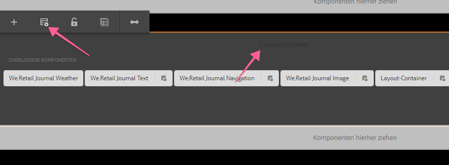

   Führen Sie unter **[!UICONTROL Eigenschaften]** > **[!UICONTROL Zulässige Komponenten]** eine Suche nach **[!DNL Custom Components]**. Sie sollten die **[!DNL Hello World]** Komponente sehen und auswählen. Speichern Sie Ihre Änderungen, indem Sie auf das Kontrollkästchen oben rechts klicken.

   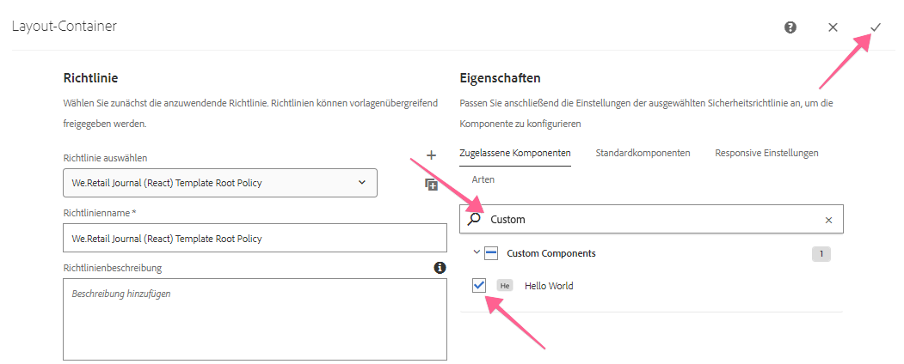

3. Nach dem Speichern sollte die **[!DNL HelloWorld]** Komponente als zulässige Komponente im [!UICONTROL Layout-Container]angezeigt werden.

   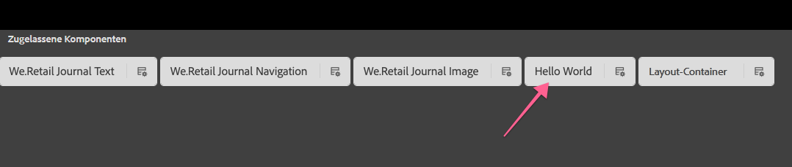

   >[!NOTE]
   >
   > Nur AEM 6.5 und AEM 6.4.5 unterstützen die Funktion &quot;Bearbeitbare Vorlagen&quot;des SPA-Editors. Bei Verwendung von AEM 6.4 müssen Sie die Richtlinie für zulässige Komponenten manuell über CRXDE Lite konfigurieren: `/conf/we-retail-journal/react/settings/wcm/policies/wcm/foundation/components/responsivegrid/default` oder `/conf/we-retail-journal/angular/settings/wcm/policies/wcm/foundation/components/responsivegrid/default`

   CRXDE Lite mit den aktualisierten Richtlinienkonfigurationen für [!UICONTROL Zulässige Komponenten] im [!UICONTROL Layout-Container]:

   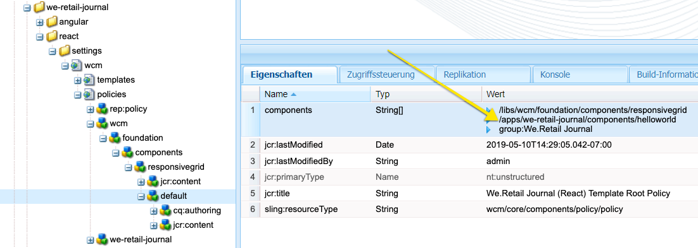

## Alles zusammenbringen {#putting-together}

1. Navigieren Sie zu den Seiten &quot;Angular&quot;oder &quot;React&quot;:

   * [http://localhost:4502/editor.html/content/we-retail-journal/react/en/home.html](http://localhost:4502/editor.html/content/we-retail-journal/react/en/home.html)
   * [http://localhost:4502/editor.html/content/we-retail-journal/angular/en/home.html](http://localhost:4502/editor.html/content/we-retail-journal/angular/en/home.html)

2. Suchen Sie die **[!DNL Hello World]** Komponente und ziehen Sie die **[!DNL Hello World]** Komponente per Drag &amp; Drop auf die Seite.

   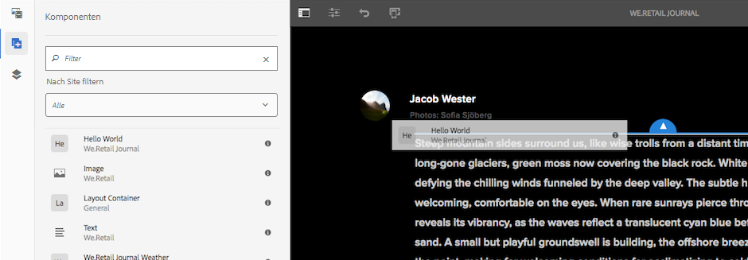

   Der Platzhalter sollte angezeigt werden.

   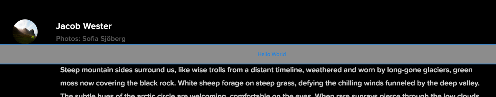

3. Wählen Sie die Komponente aus und fügen Sie eine Nachricht im Dialog hinzu, z.B. &quot;World&quot; oder &quot;Your Name&quot;. Speichern Sie die Änderungen.

   

   Beachten Sie, dass die Zeichenfolge &quot;Hello&quot;der Nachricht immer vorangestellt wird. Dies ist das Ergebnis der Logik in der `HelloWorld.java`[!DNL Sling Model].

## Nächste Schritte {#next-steps}

[Abgeschlossene Lösung für die Komponente HelloWorld](assets/spa-editor-helloworld-tutorial-use/aem-sample-we-retail-journal-HelloWorldSolution.zip)

* Vollständiger Quellcode für [[!DNL We.Retail Journal] GitHub](https://github.com/adobe/aem-sample-we-retail-journal)
* Sehen Sie sich ein ausführlicheres Tutorial zur Entwicklung von React mit [[!DNL Erste Schritte mit dem AEM SPA Editor - WKND Tutorial] an.](https://helpx.adobe.com/experience-manager/kt/sites/using/getting-started-spa-wknd-tutorial-develop.html)

## Fehlerbehebung {#troubleshooting}

### Projekt kann nicht in Eclipse erstellt werden {#unable-to-build-project-in-eclipse}

**Fehler:** Fehler beim Importieren des [!DNL We.Retail Journal] Projekts in Eclipse bei nicht erkannten Zielausführungen:

`Execution npm install, Execution npm run build, Execution default-analyze-classes*`


**Auflösung**: Klicken Sie auf Fertig stellen, um diese später zu beheben. Dies sollte den Abschluss des Tutorials nicht verhindern.

**Fehler**: Das React-Modul `react-app`wird während eines Maven-Builds nicht erfolgreich erstellt.

**Lösung:** Versuchen Sie, den `node_modules` Ordner unter der **Response-App** zu löschen. Führen Sie den Befehl Apache Maven erneut `mvn  clean install -PautoInstallSinglePackage` aus dem Stammverzeichnis des Projekts aus.

### Nicht zufrieden stellende Abhängigkeiten in AEM {#unsatisfied-dependencies-in-aem}

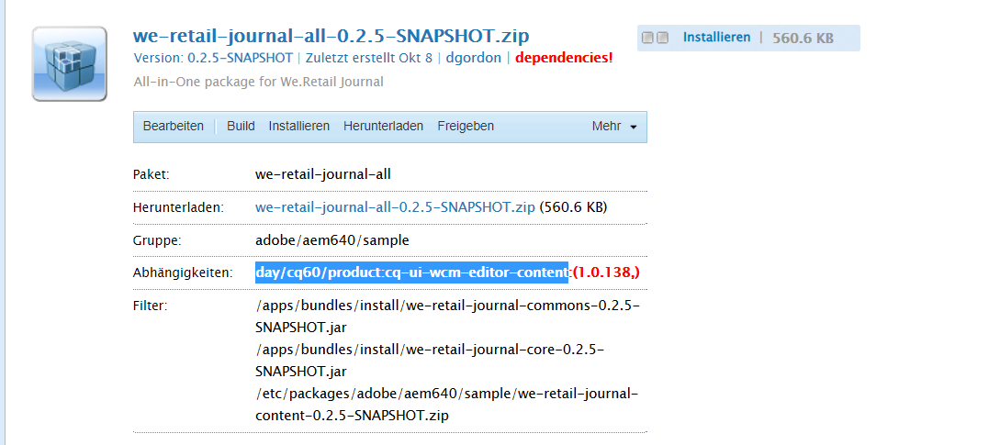

Wenn eine AEM Abhängigkeit weder im **[!UICONTROL AEM Package Manager]** noch in der **[!UICONTROL AEM Web Console]** (Felix-Konsole) erfüllt ist, deutet dies darauf hin, dass SPA Editor-Funktion nicht verfügbar ist.

### Komponente wird nicht angezeigt

**Fehler**: Selbst nach einer erfolgreichen Bereitstellung und Überprüfung, ob die kompilierten Versionen von React/Angular-Apps die aktualisierte `helloworld` Komponente aufweisen, wird meine Komponente nicht angezeigt, wenn ich sie auf die Seite ziehe. Ich kann die Komponente in der AEM Benutzeroberfläche sehen.

**Auflösung**: Löschen Sie den Verlauf/Cache Ihres Browsers und/oder öffnen Sie einen neuen Browser oder verwenden Sie den Inkognito-Modus. Wenn dies nicht funktioniert, machen Sie den Client-Bibliothekscache auf der lokalen AEM ungültig. AEM versucht, große Clientbibliotheken zu zwischenspeichern, um effizient zu sein. Manchmal muss der Cache manuell ungültig gemacht werden, um Probleme zu beheben, bei denen veralteter Code zwischengespeichert wird.

Navigieren Sie zu: [http://localhost:4502/libs/granite/ui/content/dumplibs.rebuild.html](http://localhost:4502/libs/granite/ui/content/dumplibs.rebuild.html) und klicken Sie auf &quot;Cache ungültig machen&quot;. Kehren Sie zur Seite &quot;React/Angular&quot;zurück und aktualisieren Sie die Seite.


