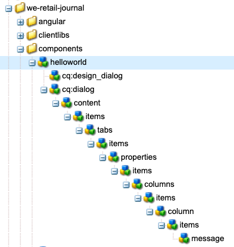

# Entwickeln mit dem AEM SPA Editor - Hallo Welt Tutorial {#developing-with-the-aem-spa-editor-hello-world-tutorial}

>[!WARNING]
>
> Dieses Tutorial ist **nicht mehr unterstützt**. Es wird empfohlen, entweder [Erste Schritte mit dem AEM SPA Editor und Angular](https://docs.adobe.com/content/help/de/experience-manager-learn/spa-angular-tutorial/overview.html) oder [Erste Schritte mit dem AEM SPA Editor und React](https://docs.adobe.com/content/help/de/experience-manager-learn/spa-react-tutorial/overview.html)

AEM SPA Editor unterstützt die kontextbezogene Bearbeitung einer Einzelseitenanwendung oder eines SPA. Dieses Lernprogramm stellt eine Einführung in SPA Entwicklung dar, die mit AEM SPA Editor JS SDK verwendet werden soll. Das Lernprogramm erweitert die App &quot;We.Retail&quot;um eine benutzerdefinierte Komponente &quot;Hello World&quot;. Die Benutzer können das Lernprogramm mit React- oder Angular-Frameworks abschließen.

>[!NOTE]
>
> Für die Funktion zum Editor für Einzelseitenanwendungen (SPA) ist AEM 6.4 Service Pack 2 oder höher erforderlich.
>
> Der SPA Editor ist die empfohlene Lösung für Projekte, bei denen SPA Framework-basiertes clientseitiges Rendering (z.B. React oder Angular) erforderlich ist.

## Voraussetzung für das Lesen {#prereq}

Dieses Lernprogramm soll die Schritte hervorheben, die erforderlich sind, um eine SPA Komponente einer AEM Komponente zuzuordnen, um die Bearbeitung im Kontext zu aktivieren. Benutzer, die dieses Tutorial beginnen, sollten sich mit den Grundkonzepten der Entwicklung mit Adobe Experience Manager, AEM sowie der Entwicklung mit React of Angular Frameworks vertraut machen. Das Lernprogramm umfasst sowohl Back-End- als auch Front-End-Entwicklungs-Aufgaben.

Es wird empfohlen, die folgenden Ressourcen zu überprüfen, bevor dieses Lernprogramm beginnt:

* [Video](spa-editor-framework-feature-video-use.md)  zur Funktion SPA Editor - Eine Videoübersicht über die SPA Editor- und Web.Retail-Protokoll-App.
* [React.js Tutorial](https://reactjs.org/tutorial/tutorial.html)  - Eine Einführung in die Entwicklung mit dem React Framework.
* [Angular Tutorial](https://angular.io/tutorial)  - Einführung in die Entwicklung mit Angular

## Lokale Entwicklungsumgebung {#local-dev}

Diese Übung wurde für folgende Aufgaben entwickelt:

[Adobe Experience Manager 6.5 ](https://helpx.adobe.com/de/experience-manager/6-5/release-notes.html) oder  [Adobe Experience Manager 6.4](https://helpx.adobe.com/de/experience-manager/6-4/sites/deploying/using/technical-requirements.html) +  [Service Pack 5](https://helpx.adobe.com/de/experience-manager/6-4/release-notes/sp-release-notes.html)

In diesem Lernprogramm sollten die folgenden Technologien und Werkzeuge installiert werden:

1. [Java 11](https://downloads.experiencecloud.adobe.com/content/software-distribution/en/general.html)
2. [Apache Maven - 3.3.1+](https://maven.apache.org/)
3. [Node.js - 8.11.1+](https://nodejs.org/en/) und npm 5.6.0+ (npm wird mit node.js installiert)

Dublette überprüfen Sie die Installation der oben genannten Tools, indem Sie ein neues Terminal öffnen und Folgendes ausführen:

```shell
$ java -version
java version "11 +"

$ mvn -version
Apache Maven 3.3.9

$ node --version
v8.11.1

$ npm --version
6.1.0
```

## Überblick {#overview}

Das Grundkonzept besteht darin, eine SPA Komponente einer AEM Komponente zuzuordnen. AEM Komponenten, die serverseitig ausgeführt werden, exportieren Inhalte in Form von JSON. Der JSON-Inhalt wird vom SPA genutzt, wobei clientseitig im Browser ausgeführt wird. Es wird eine 1:1-Zuordnung zwischen SPA Komponenten und einer AEM Komponente erstellt.


Beliebte Frameworks [React JS](https://reactjs.org/) und [Angular](https://angular.io/) werden standardmäßig unterstützt. Die Benutzer können dieses Lernprogramm entweder mit Angular oder mit React abschließen, mit welchem Framework sie am besten vertraut sind.

## Projekt-Setup {#project-setup}

SPA Entwicklung hat einen Fuß in AEM Entwicklung, und der andere draußen. Das Ziel ist es, SPA Entwicklung selbstständig und (meist) agnostisch zu AEM.

* SPA Projekte können während der Front-End-Entwicklung unabhängig vom AEM-Projekt betrieben werden.
* Front-End-Buildwerkzeuge und -Technologien wie Webpack, NPM, [!DNL Grunt] und [!DNL Gulp]werden weiterhin verwendet.
* Zum Erstellen für AEM wird das SPA Projekt kompiliert und automatisch in das AEM Projekt eingebunden.
* Standardpakete für AEM Bereitstellung der SPA in AEM.


*SPA Entwicklung hat einen Fuß in AEM Entwicklung, und der andere ist ausweglos - SPA Entwicklung kann unabhängig erfolgen, und (meist) agnostisch AEM.*

Ziel dieses Lernprogramms ist es, die App &quot;We.Retail Protokoll&quot;um eine neue Komponente zu erweitern. Beginn durch Herunterladen des Quellcodes für die Web.Retail-Protokoll-App und Bereitstellung auf einem lokalen AEM.

1. **Laden Sie** den neuesten  [We.Retail-Protokoll-Code von GitHub](https://github.com/adobe/aem-sample-we-retail-journal) herunter.

   Oder klonen Sie das Repository über die Befehlszeile:

   ```shell
   $ git clone git@github.com:adobe/aem-sample-we-retail-journal.git
   ```

   >[!NOTE]
   >
   >Das Tutorial arbeitet mit der **Übergeordnet**-Verzweigung mit **1.2.1-SNAPSHOT** Version des Projekts.

1. Die folgende Struktur sollte sichtbar sein:

   

   Das Projekt umfasst die folgenden Maven-Module:

   * `all`: Bettet das gesamte Projekt in ein einzelnes Paket ein und installiert es.
   * `bundles`: Enthält zwei OSGi-Pakete: Kommas und Core, die Java-Code enthalten  [!DNL Sling Models] und anderen.
   * `ui.apps`: enthält die /apps Teile des Projekts, d.h. JS &amp; CSS clientlibs, Komponenten, runmode-spezifische Konfigurationen.
   * `ui.content`: enthält Strukturinhalt und Konfigurationen (`/content`,  `/conf`)
   * `react-app`: Wir.Retail Protokoll React Applikation. Dies ist sowohl ein Maven-Modul als auch ein Webpack-Projekt.
   * `angular-app`: We.Retail Protokoll Angular. Dies ist sowohl ein [!DNL Maven]-Modul als auch ein Webpack-Projekt.

1. Öffnen Sie ein neues Terminalfenster und führen Sie den folgenden Befehl aus, um die gesamte App auf einer lokalen AEM-Instanz zu erstellen, die auf [http://localhost:4502](http://localhost:4502) ausgeführt wird.

   ```shell
   $ cd <src>/aem-sample-we-retail-journal
   $ mvn -PautoInstallSinglePackage clean install
   ```

   >[!NOTE]
   >
   > In diesem Projekt ist das Maven-Profil zum Erstellen und Verpacken des gesamten Projektes `autoInstallSinglePackage`

   >[!CAUTION]
   >
   > Wenn Sie während des Builds einen Fehler erhalten, stellen Sie sicher, dass Ihre Maven settings.xml-Datei das Maven Artefakt-Repository der Adobe enthält](https://helpx.adobe.com/de/experience-manager/kb/SetUpTheAdobeMavenRepository.html).[

1. Navigieren Sie zu:

   * [http://localhost:4502/editor.html/content/we-retail-journal/react/en/home.html](http://localhost:4502/editor.html/content/we-retail-journal/react/en/home.html)
   * [http://localhost:4502/editor.html/content/we-retail-journal/angular/en/home.html](http://localhost:4502/editor.html/content/we-retail-journal/angular/en/home.html)

   Die Web.Retail-Protokoll-App sollte im AEM Sites-Editor angezeigt werden.

1. Wählen Sie im Modus [!UICONTROL Bearbeiten] eine zu bearbeitende Komponente aus und führen Sie eine Aktualisierung des Inhalts durch.

   

1. Klicken Sie auf das Symbol [!UICONTROL Seiteneigenschaften], um [!UICONTROL Seiteneigenschaften] zu öffnen. Wählen Sie [!UICONTROL Vorlage bearbeiten], um die Vorlage der Seite zu öffnen.

   

1. In der neuesten Version des SPA-Editors können [Bearbeitbare Vorlagen](https://helpx.adobe.com/experience-manager/6-5/sites/developing/using/page-templates-editable.html) auf dieselbe Weise wie bei herkömmlichen Sites-Implementierungen verwendet werden. Dies wird später mit unserer benutzerdefinierten Komponente erneut überprüft.

   >[!NOTE]
   >
   > Nur AEM 6.5 und AEM 6.4 + **Service Pack 5** unterstützen bearbeitbare Vorlagen.

## Entwicklungsübersicht {#development-overview}


SPA Entwicklungsiterationen erfolgen unabhängig von AEM. Wenn die SPA bereit ist, in AEM eingesetzt zu werden, finden die folgenden hochrangigen Schritte statt (wie oben gezeigt).

1. Der AEM Projekterstellung wird aufgerufen, was wiederum einen Build des SPA-Projekts Trigger. Das Protokoll We.Retail verwendet das [**frontend-maven-plugin**](https://github.com/eirslett/frontend-maven-plugin).
1. Der SPA des Projekts [**aem-clientlib-generator**](https://www.npmjs.com/package/aem-clientlib-generator) bettet die kompilierte SPA als AEM Client-Bibliothek in das AEM Projekt ein.
1. Das AEM Projekt generiert ein AEM Paket, einschließlich des kompilierten SPA, sowie alle anderen AEM.

## AEM Komponente {#aem-component} erstellen

**Persona: AEM Developer**

Zuerst wird eine AEM Komponente erstellt. Die AEM-Komponente ist für das Rendern der JSON-Eigenschaften verantwortlich, die von der React-Komponente gelesen werden. Die Komponente AEM ist auch für die Bereitstellung eines Dialogfelds für alle bearbeitbaren Eigenschaften der Komponente verantwortlich.

Importieren Sie mit [!DNL Eclipse] oder einem anderen [!DNL IDE] das Projekt We.Retail Protokoll Maven.

1. Aktualisieren Sie den Reaktor **pom.xml**, um das [!DNL Apache Rat]-Plugin zu entfernen. Dieses Plug-in überprüft jede Datei, um sicherzustellen, dass ein Lizenzheader vorhanden ist. Für unsere Zwecke müssen wir uns nicht um diese Funktionalität kümmern.

   Entfernen Sie in **aem-sample-we-retail-journal/pom.xml** **apache-rate-plugin**:

   ```xml
   <!-- Remove apache-rat-plugin -->
   <plugin>
           <groupId>org.apache.rat</groupId>
           <artifactId>apache-rat-plugin</artifactId>
           <configuration>
               <excludes combine.children="append">
                   <exclude>*</exclude>
                       ...
               </excludes>
           </configuration>
           <executions>
                   <execution>
                       <phase>verify</phase>
                       <goals>
                           <goal>check</goal>
                       </goals>
               </execution>
           </executions>
       </plugin>
   ```

1. Erstellen Sie im Modul **we-retail-Protokoll-content** (`<src>/aem-sample-we-retail-journal/ui.apps`) einen neuen Knoten unter `ui.apps/jcr_root/apps/we-retail-journal/components` mit dem Namen **helloworld** des Typs **cq:Component**.
1. hinzufügen Sie die folgenden Eigenschaften zur **helloworld**-Komponente, dargestellt in XML (`/helloworld/.content.xml`) unten:

   ```xml
   <?xml version="1.0" encoding="UTF-8"?>
   <jcr:root xmlns:cq="http://www.day.com/jcr/cq/1.0" xmlns:jcr="http://www.jcp.org/jcr/1.0"
       jcr:description="Hello World Component for We.Retail Journal"
       jcr:primaryType="cq:Component"
       jcr:title="Hello World"
       componentGroup="We.Retail Journal" />
   ```

   

   >[!NOTE]
   >
   > Zur Veranschaulichung der Funktion Bearbeitbare Vorlagen haben wir bewusst das `componentGroup="Custom Components"` eingestellt. In einem realen Projekt ist es am besten, die Anzahl der Komponentengruppen zu minimieren, sodass eine bessere Gruppe &quot;[!DNL We.Retail Journal]&quot;wäre, um sie mit den anderen Inhaltskomponenten abzustimmen.
   >
   > Nur AEM 6.5 und AEM 6.4 + **Service Pack 5** unterstützen bearbeitbare Vorlagen.

1. Als Nächstes wird ein Dialogfeld erstellt, in dem eine benutzerdefinierte Meldung für die Komponente **Hello World** konfiguriert werden kann. Fügen Sie unter `/apps/we-retail-journal/components/helloworld` einen Knotennamen **cq:dialog** von **nt:unstructured** hinzu.
1. Das **cq:dialog** zeigt ein einzelnes Textfeld an, das Text in einer Eigenschaft mit dem Namen **[!DNL message]** beibehält. Fügen Sie unter dem neu erstellten **cq:dialog** die folgenden Knoten und Eigenschaften hinzu, die in XML unten dargestellt werden (`helloworld/_cq_dialog/.content.xml`):

   ```xml
   <?xml version="1.0" encoding="UTF-8"?>
   <jcr:root xmlns:sling="http://sling.apache.org/jcr/sling/1.0" xmlns:cq="http://www.day.com/jcr/cq/1.0" xmlns:jcr="http://www.jcp.org/jcr/1.0" xmlns:nt="http://www.jcp.org/jcr/nt/1.0"
       jcr:primaryType="nt:unstructured"
       jcr:title="We.Retail Journal - Hello World"
       sling:resourceType="cq/gui/components/authoring/dialog">
       <content
           jcr:primaryType="nt:unstructured"
           sling:resourceType="granite/ui/components/coral/foundation/container">
           <items jcr:primaryType="nt:unstructured">
               <tabs
                   jcr:primaryType="nt:unstructured"
                   sling:resourceType="granite/ui/components/coral/foundation/tabs"
                   maximized="{Boolean}true">
                   <items jcr:primaryType="nt:unstructured">
                       <properties
                           jcr:primaryType="nt:unstructured"
                           jcr:title="Properties"
                           sling:resourceType="granite/ui/components/coral/foundation/container"
                           margin="{Boolean}true">
                           <items jcr:primaryType="nt:unstructured">
                               <columns
                                   jcr:primaryType="nt:unstructured"
                                   sling:resourceType="granite/ui/components/coral/foundation/fixedcolumns"
                                   margin="{Boolean}true">
                                   <items jcr:primaryType="nt:unstructured">
                                       <column
                                           jcr:primaryType="nt:unstructured"
                                           sling:resourceType="granite/ui/components/coral/foundation/container">
                                           <items jcr:primaryType="nt:unstructured">
                                               <message
                                                   jcr:primaryType="nt:unstructured"
                                                   sling:resourceType="granite/ui/components/coral/foundation/form/textfield"
                                                   fieldLabel="Message"
                                                   name="./message"
                                                   required="{Boolean}true"/>
                                           </items>
                                       </column>
                                   </items>
                               </columns>
                           </items>
                       </properties>
                   </items>
               </tabs>
           </items>
       </content>
   </jcr:root>
   ```

   

   Die obige XML-Knotendefinition erstellt ein Dialogfeld mit einem einzelnen Textfeld, das dem Benutzer die Eingabe einer &quot;Nachricht&quot;ermöglicht. Notieren Sie die Eigenschaft `name="./message"` innerhalb des Knotens `<message />`. Dies ist der Name der Eigenschaft, die in AEM in der JCR-Datei gespeichert wird.

1. Als Nächstes wird ein leeres Richtliniendialogfeld (`cq:design_dialog`) erstellt. Das Dialogfeld &quot;Richtlinie&quot;wird benötigt, um die Komponente im Vorlageneditor anzuzeigen. Für diesen einfachen Anwendungsfall wird es ein leerer Dialog sein.

   Fügen Sie unter `/apps/we-retail-journal/components/helloworld` einen Knotennamen `cq:design_dialog` von `nt:unstructured` hinzu.

   Die Konfiguration wird unten in XML dargestellt (`helloworld/_cq_design_dialog/.content.xml`)

   ```xml
   <?xml version="1.0" encoding="UTF-8"?>
   <jcr:root xmlns:sling="http://sling.apache.org/jcr/sling/1.0" xmlns:cq="http://www.day.com/jcr/cq/1.0" xmlns:jcr="http://www.jcp.org/jcr/1.0" xmlns:nt="http://www.jcp.org/jcr/nt/1.0"
   jcr:primaryType="nt:unstructured" />
   ```

1. Stellen Sie die Codebasis in der Befehlszeile AEM bereit:

   ```shell
   $ cd <src>/aem-sample-we-retail-journal/content
   $ mvn -PautoInstallPackage clean install
   ```

   Überprüfen Sie in [CRXDE Lite](http://localhost:4502/crx/de/index.jsp#/apps/we-retail-journal/global/components/helloworld), ob die Komponente bereitgestellt wurde, indem Sie den Ordner unter `/apps/we-retail-journal/components:` überprüfen.

   

## Sling-Modell erstellen {#create-sling-model}

**Persona: AEM Developer**

Als Nächstes wird ein [!DNL Sling Model] erstellt, um die [!DNL Hello World]-Komponente zurückzukehren. In einem herkömmlichen WCM-Anwendungsfall implementiert das [!DNL Sling Model] eine Geschäftslogik und ein serverseitiges Rendering-Skript (HTL) führt einen Aufruf an das [!DNL Sling Model] aus. Dadurch bleibt das Rendering-Skript relativ einfach.

[!DNL Sling Models] werden auch im SPA-Anwendungsfall verwendet, um serverseitige Geschäftslogik zu implementieren. Der Unterschied besteht darin, dass im Anwendungsfall [!DNL SPA] die [!DNL Sling Models] ihre Methoden als serialisierte JSON verfügbar macht.

>[!NOTE]
>
>Als Best Practice sollten Entwickler nach Möglichkeit [AEM Kernkomponenten](https://docs.adobe.com/content/help/de-DE/experience-manager-core-components/using/introduction.html) verwenden. Neben anderen Funktionen stellen Core-Komponenten [!DNL Sling Models] eine JSON-Ausgabe bereit, die &quot;SPA-bereit&quot;ist, sodass sich Entwickler mehr auf die Front-End-Präsentation konzentrieren können.

1. Öffnen Sie im Editor Ihrer Wahl das **we-retail-Protokoll-commons**-Projekt ( `<src>/aem-sample-we-retail-journal/bundles/commons`).
1. Im Paket `com.adobe.cq.sample.spa.commons.impl.models`:
   * Erstellen Sie eine neue Klasse mit dem Namen `HelloWorld`.
   * hinzufügen einer Implementierungsschnittstelle für `com.adobe.cq.export.json.ComponentExporter.`

   

   Die `ComponentExporter`-Schnittstelle muss implementiert werden, damit [!DNL Sling Model] mit AEM Content Services kompatibel ist.

   ```java
    package com.adobe.cq.sample.spa.commons.impl.models;
   
    import com.adobe.cq.export.json.ComponentExporter;
   
    public class HelloWorld implements ComponentExporter {
   
        @Override
        public String getExportedType() {
            return null;
        }
    }
   ```

1. hinzufügen Sie eine statische Variable mit dem Namen `RESOURCE_TYPE`, um den Ressourcentyp der Komponente [!DNL HelloWorld] zu identifizieren:

   ```java
    ...
    public class HelloWorld implements ComponentExporter {
   
        static final String RESOURCE_TYPE = "we-retail-journal/components/helloworld";
   
        ...
    }
   ```

1. hinzufügen die OSGi-Anmerkungen für `@Model` und `@Exporter`. Die `@Model`-Anmerkung registriert die Klasse als [!DNL Sling Model]. Die `@Exporter`-Anmerkung stellt die Methoden als serialisierte JSON mit dem [!DNL Jackson Exporter]-Framework bereit.

   ```java
   import org.apache.sling.api.SlingHttpServletRequest;
   import org.apache.sling.models.annotations.Exporter;
   import org.apache.sling.models.annotations.Model;
   import com.adobe.cq.export.json.ExporterConstants;
   ...
   
   @Model(
           adaptables = SlingHttpServletRequest.class,
           adapters = {ComponentExporter.class},
           resourceType = HelloWorld.RESOURCE_TYPE
   )
   @Exporter(
           name = ExporterConstants.SLING_MODEL_EXPORTER_NAME, 
           extensions = ExporterConstants.SLING_MODEL_EXTENSION
   )
   public class HelloWorld implements ComponentExporter {
   
   ...
   ```

1. Implementieren Sie die Methode `getDisplayMessage()`, um die JCR-Eigenschaft `message` zurückzugeben. Verwenden Sie die [!DNL Sling Model]-Anmerkung von `@ValueMapValue`, um das Abrufen der unter der Komponente gespeicherten Eigenschaft `message` zu erleichtern. Die `@Optional`-Anmerkung ist wichtig, da `message` beim ersten Hinzufügen der Komponente zur Seite nicht gefüllt wird.

   Als Teil der Geschäftslogik wird der Meldung eine Zeichenfolge vorangestellt, die lautet &quot;**Hello**&quot;.

   ```java
   import org.apache.sling.models.annotations.injectorspecific.ValueMapValue;
   import org.apache.sling.models.annotations.Optional;
   
   ...
   
   public class HelloWorld implements ComponentExporter {
   
      static final String RESOURCE_TYPE = "we-retail-journal/components/helloworld";
   
      private static final String PREPEND_MSG = "Hello";
   
       @ValueMapValue @Optional
       private String message;
   
       public String getDisplayMessage() {
           if(message != null && message.length() > 0) {
               return PREPEND_MSG + " "  + message;
           }
           return null;
       }
   
   ...
   ```

   >[!NOTE]
   >
   > Der Methodenname `getDisplayMessage` ist wichtig. Wenn das [!DNL Sling Model] mit dem [!DNL Jackson Exporter] serialisiert wird, wird es als JSON-Eigenschaft bereitgestellt: `displayMessage`. Die [!DNL Jackson Exporter] serialisiert und stellt alle `getter`-Methoden bereit, die keinen Parameter verwenden (es sei denn, sie werden explizit ignoriert). Später in der React / Angular App lesen wir diesen Eigenschaftswert und zeigen ihn als Teil der Anwendung an.

   Die Methode `getExportedType` ist ebenfalls wichtig. Der Wert der Komponente `resourceType` wird verwendet, um die JSON-Daten der Front-End-Komponente (Angular / React) zuzuordnen. Wir werden dies im nächsten Abschnitt untersuchen.

1. Implementieren Sie die Methode `getExportedType()`, um den Ressourcentyp der Komponente `HelloWorld` zurückzugeben.

   ```java
    @Override
       public String getExportedType() {
           return RESOURCE_TYPE;
       }
   ```

   Den vollständigen Code für [**HelloWorld.java** finden Sie hier.](https://github.com/Adobe-Marketing-Cloud/aem-guides/blob/master/spa-helloworld-guide/src/bundles/commons/HelloWorld.java)

1. Stellen Sie den Code mit Apache Maven AEM bereit:

   ```shell
   $ cd <src>/sample-we-retail-spa-content/bundles/commons
   $ mvn -PautoInstallPackage clean install
   ```

   Überprüfen Sie die Bereitstellung und Registrierung von [!DNL Sling Model], indem Sie zu [[!UICONTROL Status] > [!UICONTROL Sling-Modelle]](http://localhost:4502/system/console/status-slingmodels) in der OSGi-Konsole navigieren.

   Sie sollten sehen, dass das `HelloWorld` Sling-Modell an den `we-retail-journal/components/helloworld` Sling-Ressourcentyp gebunden ist und als [!DNL Sling Model Exporter Servlet] registriert ist:

   ```shell
   com.adobe.cq.sample.spa.commons.impl.models.HelloWorld - we-retail-journal/components/helloworld
   com.adobe.cq.sample.spa.commons.impl.models.HelloWorld exports 'we-retail-journal/components/helloworld' with selector 'model' and extension '[Ljava.lang.String;@6480f3e5' with exporter 'jackson'
   ```

## React-Komponente {#react-component} erstellen

**Persona: Front-End-Entwickler**

Als Nächstes wird die React-Komponente erstellt. Öffnen Sie das Modul **response-app** ( `<src>/aem-sample-we-retail-journal/react-app`) mit dem Editor Ihrer Wahl.

>[!NOTE]
>
> Sie können diesen Abschnitt überspringen, wenn Sie nur an [Angular development](#angular-component) interessiert sind.

1. Navigieren Sie im Ordner `react-app` zum Ordner src. Erweitern Sie den Komponentenordner, um die vorhandenen React-Komponentendateien Ansicht.

   

1. hinzufügen eine neue Datei unter dem Komponentenordner `HelloWorld.js`.
1. Öffnen Sie `HelloWorld.js`. hinzufügen einer Import-Anweisung zum Importieren der Bibliothek der React-Komponente. hinzufügen eine zweite Importanweisung, um den `MapTo` Helper zu importieren, der von der Adobe bereitgestellt wird. Der Helfer `MapTo` stellt eine Zuordnung der React-Komponente zum JSON der AEM Komponente bereit.

   ```js
   import React, {Component} from 'react';
   import {MapTo} from '@adobe/cq-react-editable-components';
   ```

1. Unter den Importen wird eine neue Klasse mit dem Namen `HelloWorld` erstellt, die die Oberfläche React `Component` erweitert. hinzufügen Sie die erforderliche `render()`-Methode zur `HelloWorld`-Klasse.

   ```js
   import React, {Component} from 'react';
   import {MapTo} from '@adobe/cq-react-editable-components';
   
   class HelloWorld extends Component {
   
       render() {
   
       }
   }
   ```

1. Der `MapTo`-Helfer enthält automatisch ein Objekt mit dem Namen `cqModel` als Teil der Props der React-Komponente. Das `cqModel` enthält alle Eigenschaften, die von dem [!DNL Sling Model] offen gelegt werden.

   Denken Sie daran, dass das zuvor erstellte [!DNL Sling Model] eine Methode `getDisplayMessage()` enthält. `getDisplayMessage()` wird als JSON-Schlüssel übersetzt, der  `displayMessage` bei der Ausgabe benannt wird.

   Implementieren Sie die `render()`-Methode, um ein `h1`-Tag auszugeben, das den Wert `displayMessage` enthält. [JSX](https://reactjs.org/docs/introducing-jsx.html), eine Syntaxerweiterung zu JavaScript, wird verwendet, um das endgültige Markup der Komponente zurückzugeben.

   ```js
   ...
   
   class HelloWorld extends Component {
       render() {
   
           if(this.props.displayMessage) {
               return (
                   <div className="cmp-helloworld">
                       <h1 className="cmp-helloworld_message">{this.props.displayMessage}</h1>
                   </div>
               );
           }
           return null;
       }
   }
   ```

1. Implementieren Sie eine Bearbeitungskonfigurationsmethode. Diese Methode wird über den Helfer `MapTo` weitergeleitet und stellt dem AEM Editor Informationen zur Verfügung, um einen Platzhalter anzuzeigen, falls die Komponente leer ist. Dies tritt auf, wenn die Komponente dem SPA hinzugefügt, aber noch nicht verfasst wurde. hinzufügen Sie Folgendes unter der `HelloWorld`-Klasse:

   ```js
   ...
   
   class HelloWorld extends Component {
       ...
   }
   
   const HelloWorldEditConfig = {
   
       emptyLabel: 'Hello World',
   
       isEmpty: function(props) {
           return !props || !props.displayMessage || props.displayMessage.trim().length < 1;
       }
   };
   
   ...
   ```

1. Rufen Sie am Ende der Datei den Helfer `MapTo` auf und übergeben Sie die Klasse `HelloWorld` und `HelloWorldEditConfig`. Dadurch wird die React-Komponente basierend auf dem Ressourcentyp der AEM Komponente AEM Komponente zugeordnet: `we-retail-journal/components/helloworld`.

   ```js
   MapTo('we-retail-journal/components/helloworld')(HelloWorld, HelloWorldEditConfig);
   ```

   Den vollständigen Code für [**HelloWorld.js** finden Sie hier.](https://github.com/Adobe-Marketing-Cloud/aem-guides/blob/master/spa-helloworld-guide/src/react-app/components/HelloWorld.js)

1. Öffnen Sie die Datei `ImportComponents.js`. Sie finden sie unter `<src>/aem-sample-we-retail-journal/react-app/src/ImportComponents.js`.

   hinzufügen Sie eine Zeile, die `HelloWorld.js` mit den anderen Komponenten im kompilierten JavaScript-Bundle erfordert:

   ```js
   ...
     require('./components/Text');
     require('./components/Image');
     require('./components/HelloWorld');
   ...
   ```

1. Erstellen Sie im Ordner `components` eine neue Datei mit dem Namen `HelloWorld.css` als Geschwisterelement von `HelloWorld.js.` Füllen Sie die Datei mit folgendem Code, um eine grundlegende Formatierung für die Komponente `HelloWorld` zu erstellen:

   ```css
   /* HelloWorld.css to style HelloWorld component */
   
   .cmp-helloworld_message {
       text-align: center;
       color: #ff505e;
       text-transform: unset;
       letter-spacing: unset;
   }
   ```

1. Öffnen Sie `HelloWorld.js` erneut und aktualisieren Sie unter den Importanweisungen, um `HelloWorld.css` erforderlich zu machen:

   ```js
   import React, {Component} from 'react';
   import {MapTo} from '@adobe/cq-react-editable-components';
   
   require('./HelloWorld.css');
   
   ...
   ```

1. Stellen Sie den Code mit Apache Maven AEM bereit:

   ```shell
   $ cd <src>/sample-we-retail-spa-content
   $ mvn -PautoInstallSinglePackage clean install
   ```

1. Öffnen Sie in [CRXDE-Lite](http://localhost:4502/crx/de/index.jsp#/apps/we-retail-journal/react/clientlibs/we-retail-journal-react/js/app.js) `/apps/we-retail-journal/react/clientlibs/we-retail-journal-react/js/app.js`. Führen Sie in app.js eine Schnellsuche nach &quot;HelloWorld&quot;durch, um sicherzustellen, dass die React-Komponente in der kompilierten App enthalten ist.

   >[!NOTE]
   >
   > **app.** jsis die gebündelte React-App. Der Code ist für Menschen nicht mehr lesbar. Der Befehl `npm run build` hat einen optimierten Build ausgelöst, der kompiliertes JavaScript ausgibt, das von modernen Browsern interpretiert werden kann.


## Angular-Komponente {#angular-component} erstellen

**Persona: Front-End-Entwickler**

>[!NOTE]
>
> Sie können diesen Abschnitt überspringen, wenn Sie nur an der React-Entwicklung interessiert sind.

Als Nächstes wird die Angular-Komponente erstellt. Öffnen Sie das Modul **angular-app** (`<src>/aem-sample-we-retail-journal/angular-app`) mit dem Editor Ihrer Wahl.

1. Navigieren Sie im Ordner `angular-app` zum Ordner `src`. Erweitern Sie den Komponentenordner, um die vorhandenen Angular-Komponentendateien Ansicht.

   

1. hinzufügen Sie einen neuen Ordner unter dem Komponentenordner mit dem Namen `helloworld`. Fügen Sie unter dem Ordner `helloworld` neue Dateien mit dem Namen `helloworld.component.css, helloworld.component.html, helloworld.component.ts` hinzu.

   ```plain
   /angular-app
       /src
           /app
               /components
   +                /helloworld
   +                    helloworld.component.css
   +                    helloworld.component.html
   +                    helloworld.component.ts
   ```

1. Öffnen Sie `helloworld.component.ts`. hinzufügen eine Importanweisung zum Importieren der Angular-Klassen `Component` und `Input`. Erstellen Sie eine neue Komponente, die auf `styleUrls` und `templateUrl` auf `helloworld.component.css` und `helloworld.component.html` zeigt. Exportieren Sie schließlich die Klasse `HelloWorldComponent` mit der erwarteten Eingabe von `displayMessage`.

   ```js
   //helloworld.component.ts
   
   import { Component, Input } from '@angular/core';
   
   @Component({
     selector: 'app-helloworld',
     host: { 'class': 'cmp-helloworld' },
     styleUrls:['./helloworld.component.css'],
     templateUrl: './helloworld.component.html',
   })
   
   export class HelloWorldComponent {
     @Input() displayMessage: string;
   }
   ```

   >[!NOTE]
   >
   > Wenn Sie sich an die zuvor erstellte [!DNL Sling Model] erinnern, gab es eine Methode **getDisplayMessage()**. Die serialisierte JSON dieser Methode lautet **displayMessage**, die wir jetzt in der Angular-App lesen.

1. Öffnen Sie `helloworld.component.html`, um ein `h1`-Tag einzuschließen, das die `displayMessage`-Eigenschaft druckt:

   ```html
   <h1 *ngIf="displayMessage" class="cmp-helloworld_message">
       {{displayMessage}}
   </h1>
   ```

1. Aktualisieren Sie `helloworld.component.css`, um einige grundlegende Stile für die Komponente einzuschließen.

   ```css
   :host-context {
       display: block;
   };
   
   .cmp-helloworld {
       display:block;
   }
   .cmp-helloworld_message {
       text-align: center;
       color: #ff505e;
       text-transform: unset;
       letter-spacing: unset;
   }
   ```

1. Aktualisieren Sie `helloworld.component.spec.ts` mit dem folgenden Testbed:

   ```js
   import { async, ComponentFixture, TestBed } from '@angular/core/testing';
   
   import { HelloWorldComponent } from './helloworld.component';
   
       describe('HelloWorld', () => {
       let component: HelloWorldComponent;
       let fixture: ComponentFixture<HelloWorldComponent>;
   
       beforeEach(async(() => {
           TestBed.configureTestingModule({
           declarations: [ HelloWorldComponent ]
           })
           .compileComponents();
       }));
   
       beforeEach(() => {
           fixture = TestBed.createComponent(HelloWorldComponent);
           component = fixture.componentInstance;
           fixture.detectChanges();
       });
   
       it('should create', () => {
           expect(component).toBeTruthy();
       });
   });
   ```

1. Nächstes Update `src/components/mapping.ts`, um `HelloWorldComponent` einzuschließen. hinzufügen Sie ein `HelloWorldEditConfig`, das den Platzhalter im AEM Editor markiert, bevor die Komponente konfiguriert wurde. Fügen Sie schließlich eine Zeile hinzu, um die AEM Komponente mit dem Helfer `MapTo` der Angular-Komponente zuzuordnen.

   ```js
   // src/components/mapping.ts
   
   import { HelloWorldComponent } from "./helloworld/helloworld.component";
   
   ...
   
   const HelloWorldEditConfig = {
   
       emptyLabel: 'Hello World',
   
       isEmpty: function(props) {
           return !props || !props.displayMessage || props.displayMessage.trim().length < 1;
       }
   };
   
   ...
   
   MapTo('we-retail-journal/components/helloworld')(HelloWorldComponent, HelloWorldEditConfig);
   ```

   Den vollständigen Code für [**mapping.ts** finden Sie hier.](https://github.com/Adobe-Marketing-Cloud/aem-guides/blob/master/spa-helloworld-guide/src/angular-app/mapping.ts)

1. Aktualisieren Sie `src/app.module.ts`, um das **NgModule** zu aktualisieren. hinzufügen Sie **`HelloWorldComponent`** als **Deklaration**, die zum **AppModule** gehört. Fügen Sie `HelloWorldComponent` auch als **entryComponent** hinzu, damit sie kompiliert und dynamisch in die App eingeschlossen wird, während das JSON-Modell verarbeitet wird.

   ```js
   import { HelloWorldComponent } from './components/helloworld/helloworld.component';
   
   ...
   
   @NgModule({
     imports: [BrowserModule.withServerTransition({ appId: 'we-retail-sample-angular' }),
       SpaAngularEditableComponentsModule,
     AngularWeatherWidgetModule.forRoot({
       key: "37375c33ca925949d7ba331e52da661a",
       name: WeatherApiName.OPEN_WEATHER_MAP,
       baseUrl: 'http://api.openweathermap.org/data/2.5'
     }),
       AppRoutingModule,
       BrowserTransferStateModule],
     providers: [ModelManagerService,
       { provide: APP_BASE_HREF, useValue: '/' }],
     declarations: [AppComponent,
       TextComponent,
       ImageComponent,
       WeatherComponent,
       NavigationComponent,
       MenuComponent,
       MainContentComponent,
       HelloWorldComponent],
     entryComponents: [TextComponent,
       ImageComponent,
       WeatherComponent,
       NavigationComponent,
       MainContentComponent,
       HelloWorldComponent],
     bootstrap: [AppComponent]
    })
   ```

   Den vollständigen Code für [**app.module.ts** finden Sie hier.](https://github.com/Adobe-Marketing-Cloud/aem-guides/blob/master/spa-helloworld-guide/src/angular-app/app.module.ts)

1. Stellen Sie den Code für AEM mithilfe von Maven bereit:

   ```shell
   $ cd <src>/sample-we-retail-spa-content
   $ mvn -PautoInstallSinglePackage clean install
   ```

1. Öffnen Sie in [CRXDE-Lite](http://localhost:4502/crx/de/index.jsp#/apps/we-retail-journal/angular/clientlibs/we-retail-journal-angular/js/main.js) `/apps/we-retail-journal/angular/clientlibs/we-retail-journal-angular/js/main.js`. Führen Sie eine Schnellsuche nach **HelloWorld** in `main.js` durch, um sicherzustellen, dass die Angular-Komponente einbezogen wurde.

   >[!NOTE]
   >
   > **main.** jsis die gebündelte Angular-App. Der Code ist für Menschen nicht mehr lesbar. Der Befehl npm run build hat einen optimierten Build ausgelöst, der kompiliertes JavaScript ausgibt, das von modernen Browsern interpretiert werden kann.

## Aktualisieren der Vorlage {#template-update}

1. Navigieren Sie zur bearbeitbaren Vorlage für die React- und/oder Angular-Versionen:

   * (Angular) [http://localhost:4502/editor.html/conf/we-retail-journal/angular/settings/wcm/templates/we-retail-angular-weather-template/structure.html](http://localhost:4502/editor.html/conf/we-retail-journal/angular/settings/wcm/templates/we-retail-angular-weather-template/structure.html)
   * (React) [http://localhost:4502/editor.html/conf/we-retail-journal/react/settings/wcm/templates/we-retail-react-weather-template/structure.html](http://localhost:4502/editor.html/conf/we-retail-journal/react/settings/wcm/templates/we-retail-react-weather-template/structure.html)

1. Wählen Sie den Container [!UICONTROL Layout] und klicken Sie auf das Symbol [!UICONTROL Richtlinie], um die Richtlinie zu öffnen:

   

   Führen Sie unter **[!UICONTROL Eigenschaften]** > **[!UICONTROL Zulässige Komponenten]** eine Suche nach **[!DNL Custom Components]** durch. Sie sollten die Komponente **[!DNL Hello World]** sehen und auswählen. Speichern Sie Ihre Änderungen, indem Sie auf das Kontrollkästchen oben rechts klicken.

   

1. Nach dem Speichern sollte die Komponente **[!DNL HelloWorld]** im [!UICONTROL Layout-Container] als zulässige Komponente angezeigt werden.

   

   >[!NOTE]
   >
   > Nur AEM 6.5 und AEM 6.4.5 unterstützen die Funktion &quot;Bearbeitbare Vorlage&quot;des SPA-Editors. Bei Verwendung von AEM 6.4 müssen Sie die Richtlinie für zulässige Komponenten manuell über CRXDE Lite konfigurieren: `/conf/we-retail-journal/react/settings/wcm/policies/wcm/foundation/components/responsivegrid/default` oder `/conf/we-retail-journal/angular/settings/wcm/policies/wcm/foundation/components/responsivegrid/default`

   CRXDE Lite mit den aktualisierten Richtlinienkonfigurationen für [!UICONTROL Zulässige Komponenten] im [!UICONTROL Layout-Container]:

   

## Alles zusammenbringen {#putting-together}

1. Navigieren Sie zu den Seiten &quot;Angular&quot;oder &quot;Reagieren&quot;:

   * [http://localhost:4502/editor.html/content/we-retail-journal/react/en/home.html](http://localhost:4502/editor.html/content/we-retail-journal/react/en/home.html)
   * [http://localhost:4502/editor.html/content/we-retail-journal/angular/en/home.html](http://localhost:4502/editor.html/content/we-retail-journal/angular/en/home.html)

1. Suchen Sie die Komponente **[!DNL Hello World]** und ziehen Sie die Komponente **[!DNL Hello World]** auf die Seite.

   

   Der Platzhalter sollte angezeigt werden.

   

1. Wählen Sie die Komponente aus und fügen Sie eine Nachricht im Dialog hinzu, z.B. &quot;World&quot; oder &quot;Your Name&quot;. Speichern Sie die Änderungen.

   

   Beachten Sie, dass die Zeichenfolge &quot;Hello&quot;der Nachricht immer vorangestellt wird. Dies ergibt sich aus der Logik in `HelloWorld.java` [!DNL Sling Model].

## Nächste Schritte {#next-steps}

[Abgeschlossene Lösung für die Komponente HelloWorld](assets/spa-editor-helloworld-tutorial-use/aem-sample-we-retail-journal-HelloWorldSolution.zip)

* Vollständiger Quellcode für [[!DNL We.Retail Journal] auf GitHub](https://github.com/adobe/aem-sample-we-retail-journal)
* Sehen Sie sich ein ausführlicheres Tutorial zur Entwicklung von React mit [[!DNL Getting Started with the AEM SPA Editor - WKND Tutorial]](https://helpx.adobe.com/de/experience-manager/kt/sites/using/getting-started-spa-wknd-tutorial-develop.html) an.

## Fehlerbehebung {#troubleshooting}

### Projekt kann nicht in Eclipse {#unable-to-build-project-in-eclipse} erstellt werden

**Fehler:** Fehler beim Importieren des  [!DNL We.Retail Journal] Projekts in Eclipse bei nicht erkannten Zielausführungen:

`Execution npm install, Execution npm run build, Execution default-analyze-classes*`


**Auflösung**: Klicken Sie auf Fertig stellen, um diese später zu beheben. Dies sollte den Abschluss des Tutorials nicht verhindern.

**Fehler**: Das React-Modul  `react-app`wird während eines Maven-Builds nicht erfolgreich erstellt.

**Auflösung:** Versuchen Sie, den  `node_modules` Ordner unter der  **Antwortanwendung** zu löschen. Führen Sie den Befehl Apache Maven `mvn  clean install -PautoInstallSinglePackage` erneut aus dem Stammverzeichnis des Projekts aus.

### Unzufriedene Abhängigkeiten in AEM {#unsatisfied-dependencies-in-aem}


Wenn eine AEM Abhängigkeit nicht erfüllt ist, entweder im **[!UICONTROL AEM Package Manager]** oder in der **[!UICONTROL AEM Web Console]** (Felix-Konsole), deutet dies darauf hin, dass SPA Editor-Funktion nicht verfügbar ist.

### Komponente wird nicht angezeigt

**Fehler**: Selbst nach einer erfolgreichen Bereitstellung und Überprüfung, ob die kompilierten Versionen von React/Angular-Apps die aktualisierte  `helloworld` Komponente aufweisen, wird meine Komponente nicht angezeigt, wenn ich sie auf die Seite ziehe. Ich kann die Komponente in der AEM Benutzeroberfläche sehen.

**Auflösung**: Löschen Sie den Verlauf/Cache Ihres Browsers und/oder öffnen Sie einen neuen Browser oder verwenden Sie den Inkognito-Modus. Wenn dies nicht funktioniert, machen Sie den Client-Bibliothekscache auf der lokalen AEM ungültig. AEM versucht, große Clientbibliotheken zu zwischenspeichern, um effizient zu sein. Manchmal muss der Cache manuell ungültig gemacht werden, um Probleme zu beheben, bei denen veralteter Code zwischengespeichert wird.

Navigieren Sie zu: [http://localhost:4502/libs/granite/ui/content/dumplibs.rebuild.html](http://localhost:4502/libs/granite/ui/content/dumplibs.rebuild.html) und klicken Sie auf Cache ungültig. Kehren Sie zu Ihrer React/Angular zurück und aktualisieren Sie die Seite.


