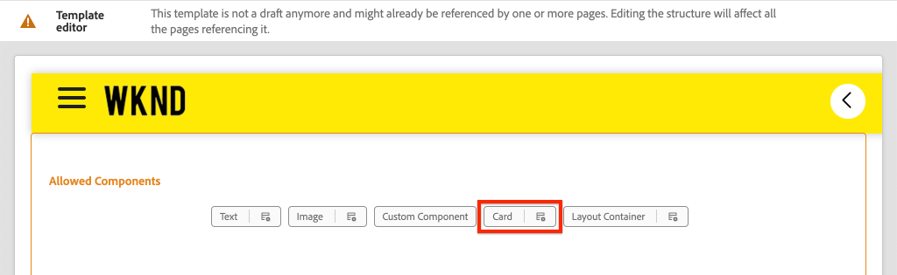

# Erweitern einer Kernkomponente {#extend-component}

Erfahren Sie, wie Sie eine bestehende Core-Komponente erweitern, um sie mit dem AEM SPA Editor zu verwenden. Das Verstehen, wie eine vorhandene Komponente erweitert wird, ist eine leistungsstarke Methode zum Anpassen und Erweitern der Funktionen einer AEM SPA Editor-Implementierung.

## Vorgabe

1. Erweitern Sie eine vorhandene Core-Komponente mit zusätzlichen Eigenschaften und Inhalten.
2. Verstehen Sie die Grundlagen der Komponentenvererbung mit der Verwendung von `sling:resourceSuperType`.
3. Erfahren Sie, wie Sie das [Delegationsmuster](https://github.com/adobe/aem-core-wcm-components/wiki/Delegation-Pattern-for-Sling-Models) für Sling-Modelle nutzen können, um vorhandene Logik und Funktionalität wiederzuverwenden.

## Was Sie erstellen werden

In diesem Kapitel wird eine neue Komponente `Card` erstellt. Die Komponente `Card` erweitert die [Image-Core-Komponente](https://docs.adobe.com/content/help/de-DE/experience-manager-core-components/using/components/image.html) um zusätzliche Inhaltsfelder wie Titel und Aktionsaufruf, um die Rolle eines Teasers für andere Inhalte innerhalb der SPA auszuführen.


>[!NOTE]
>
> In einer realen Implementierung ist es möglicherweise angemessener, einfach die [Teaser-Komponente](https://docs.adobe.com/content/help/de-DE/experience-manager-core-components/using/components/teaser.html) zu verwenden und dann die [Image-Core-Komponente](https://docs.adobe.com/content/help/en/experience-manager-core-components/using/components/image.html) zu erweitern, um je nach Projektanforderungen eine `Card`-Komponente zu erstellen. Es wird immer empfohlen, [Kernkomponenten](https://docs.adobe.com/content/help/de-DE/experience-manager-core-components/using/introduction.html) nach Möglichkeit direkt zu verwenden.

## Voraussetzungen

Überprüfen Sie die erforderlichen Werkzeuge und Anweisungen zum Einrichten einer [lokalen Entwicklungs-Umgebung](overview.md#local-dev-environment).

### Code abrufen

1. Laden Sie den Ausgangspunkt für dieses Lernprogramm über Git herunter:

   ```shell
   $ git clone git@github.com:adobe/aem-guides-wknd-spa.git
   $ cd aem-guides-wknd-spa
   $ git checkout Angular/extend-component-start
   ```

2. Stellen Sie die Codebasis mithilfe von Maven auf einer lokalen AEM-Instanz bereit:

   ```shell
   $ mvn clean install -PautoInstallSinglePackage
   ```

   Wenn Sie [AEM 6.x](overview.md#compatibility) verwenden, fügen Sie das `classic`-Profil hinzu:

   ```shell
   $ mvn clean install -PautoInstallSinglePackage -Pclassic
   ```

3. Installieren Sie das fertige Paket für die herkömmliche [WKND-Referenz-Website](https://github.com/adobe/aem-guides-wknd/releases/latest). Die von [WKND-Referenz-Website](https://github.com/adobe/aem-guides-wknd/releases/latest) bereitgestellten Bilder werden auf der WKND-SPA wiederverwendet. Das Paket kann mit [AEM Package Manager](http://localhost:4502/crx/packmgr/index.jsp) installiert werden.

   

Sie können den fertigen Code immer auf [GitHub](https://github.com/adobe/aem-guides-wknd-spa/tree/Angular/extend-component-solution) oder lokal prüfen, indem Sie zur Verzweigung `Angular/extend-component-solution` wechseln.

## Inspect-Erstimplementierung der Karte

Eine anfängliche Kartenkomponente wurde vom Kapitelstartercode bereitgestellt. Inspect als Ausgangspunkt für die Kartenimplementierung.

1. Öffnen Sie in der IDE Ihrer Wahl das Modul `ui.apps`.
2. Navigieren Sie zu `ui.apps/src/main/content/jcr_root/apps/wknd-spa-angular/components/card` und Ansicht der `.content.xml`-Datei.

   

   ```xml
   <?xml version="1.0" encoding="UTF-8"?>
   <jcr:root xmlns:sling="http://sling.apache.org/jcr/sling/1.0" xmlns:cq="http://www.day.com/jcr/cq/1.0" xmlns:jcr="http://www.jcp.org/jcr/1.0"
       jcr:primaryType="cq:Component"
       jcr:title="Card"
       sling:resourceSuperType="wknd-spa-angular/components/image"
       componentGroup="WKND SPA Angular - Content"/>
   ```

   Die Eigenschaft `sling:resourceSuperType` verweist auf `wknd-spa-angular/components/image`, um anzugeben, dass die `Card`-Komponente alle Funktionen der WKND-SPA Image-Komponente übernimmt.

3. Prüfen Sie die Datei `ui.apps/src/main/content/jcr_root/apps/wknd-spa-angular/components/image/.content.xml`:

   ```xml
   <?xml version="1.0" encoding="UTF-8"?>
   <jcr:root xmlns:sling="http://sling.apache.org/jcr/sling/1.0" xmlns:cq="http://www.day.com/jcr/cq/1.0" xmlns:jcr="http://www.jcp.org/jcr/1.0"
       jcr:primaryType="cq:Component"
       jcr:title="Image"
       sling:resourceSuperType="core/wcm/components/image/v2/image"
       componentGroup="WKND SPA Angular - Content"/>
   ```

   Beachten Sie, dass `sling:resourceSuperType` auf `core/wcm/components/image/v2/image` verweist. Dies bedeutet, dass die WKND SPA Image-Komponente alle Funktionen des Core Component Image übernimmt.

   Auch als [Proxy pattern](https://docs.adobe.com/content/help/en/experience-manager-core-components/using/developing/guidelines.html#proxy-component-pattern) Sling-Ressourcenvererbung bezeichnet, ist ein leistungsstarkes Designmuster, mit dem untergeordnete Komponenten Funktionen übernehmen und das Verhalten bei Bedarf erweitern/überschreiben können. Die Sling-Vererbung unterstützt mehrere Vererbungsstufen, sodass letztendlich die neue Komponente `Card` die Funktionalität des Core Component Image übernimmt.

   Viele Entwicklungsteams streben danach, D.R.Y. (Wiederholen Sie sich nicht!) Die Sling-Vererbung ermöglicht dies mit AEM.

4. Öffnen Sie unter dem Ordner `card` die Datei `_cq_dialog/.content.xml`.

   Diese Datei ist die Definition des Komponentendialogs für die Komponente `Card`. Bei Verwendung der Sling-Vererbung ist es möglich, Funktionen des [Sling Resource Merger](https://docs.adobe.com/content/help/en/experience-manager-65/developing/platform/sling-resource-merger.html) zu verwenden, um Teile des Dialogfelds zu überschreiben oder zu erweitern. In diesem Beispiel wurde eine neue Registerkarte zum Dialog hinzugefügt, um zusätzliche Daten von einem Autor zu erfassen, um die Kartenkomponente zu füllen.

   Mit Eigenschaften wie `sling:orderBefore` können Entwickler festlegen, wo neue Registerkarten oder Formularfelder eingefügt werden sollen. In diesem Fall wird die Registerkarte `Text` vor der Registerkarte `asset` eingefügt. Um den Sling Resource Merger vollständig zu nutzen, ist es wichtig, die ursprüngliche Knotenstruktur des Dialogfelds [Image component dialog](https://github.com/adobe/aem-core-wcm-components/blob/master/content/src/content/jcr_root/apps/core/wcm/components/image/v2/image/_cq_dialog/.content.xml) zu kennen.

5. Öffnen Sie unter dem Ordner `card` die Datei `_cq_editConfig.xml`. Diese Datei gibt das Drag &amp; Drop-Verhalten in der Benutzeroberfläche für das AEM Authoring vor. Beim Erweitern der Image-Komponente ist es wichtig, dass der Ressourcentyp mit der Komponente selbst übereinstimmt. Überprüfen Sie den Knoten `<parameters>`:

   ```xml
   <parameters
       jcr:primaryType="nt:unstructured"
       sling:resourceType="wknd-spa-angular/components/card"
       imageCrop=""
       imageMap=""
       imageRotate=""/>
   ```

   Bei den meisten Komponenten ist kein `cq:editConfig` erforderlich, bei den untergeordneten und untergeordneten Elementen der Image-Komponente handelt es sich um Ausnahmen.

6. Navigieren Sie im IDE-Switch zum Modul `ui.frontend` zu `ui.frontend/src/app/components/card`:

   

7. Prüfen Sie die Datei `card.component.ts`.

   Die Komponente wurde bereits zur Zuordnung zur AEM `Card`-Komponente mithilfe der Standardfunktion `MapTo` gestoppt.

   ```js
   MapTo('wknd-spa-angular/components/card')(CardComponent, CardEditConfig);
   ```

   Überprüfen Sie die drei Parameter `@Input` in der Klasse für `src`, `alt` und `title`. Diese JSON-Werte werden von der AEM Komponente erwartet, die der Angular-Komponente zugeordnet wird.

8. Öffnen Sie die Datei `card.component.html`:

   ```html
   <div class="card"  *ngIf="hasContent">
       <app-image class="card__image" [src]="src" [alt]="alt" [title]="title"></app-image>
   </div>
   ```

   In diesem Beispiel haben wir die bestehende Angular Image-Komponente `app-image` wiederverwendet, indem wir einfach die `@Input`-Parameter von `card.component.ts` übergeben. Später im Tutorial werden zusätzliche Eigenschaften hinzugefügt und angezeigt.

## Vorlagenrichtlinie aktualisieren

Mit dieser ersten `Card` Implementierung überprüfen Sie die Funktionalität im AEM SPA Editor. Zum Anzeigen der ursprünglichen Komponente `Card` ist ein Update der Vorlagenrichtlinie erforderlich.

1. Stellen Sie den Starter-Code auf einer lokalen Instanz von AEM bereit, falls Sie nicht bereits:

   ```shell
   $ cd aem-guides-wknd-spa
   $ mvn clean install -PautoInstallSinglePackage
   ```

2. Navigieren Sie zur SPA Seitenvorlage unter [http://localhost:4502/editor.html/conf/wknd-spa-angular/settings/wcm/templates/spa-page-template/structure.html](http://localhost:4502/editor.html/conf/wknd-spa-angular/settings/wcm/templates/spa-page-template/structure.html).
3. Aktualisieren Sie die Richtlinie des Layout-Containers, um die neue Komponente `Card` als zulässige Komponente hinzuzufügen:

   

   Speichern Sie die Änderungen an der Richtlinie und beachten Sie die `Card`-Komponente als zulässige Komponente:

   

## Autorenkartenkomponente

Als Nächstes erstellen Sie die Komponente `Card` mit dem AEM SPA Editor.

1. Navigieren Sie zu [http://localhost:4502/editor.html/content/wknd-spa-angular/us/en/home.html](http://localhost:4502/editor.html/content/wknd-spa-angular/us/en/home.html).
2. Fügen Sie im Modus `Edit` die Komponente `Card` der Komponente `Layout Container` hinzu:

   

3. Ziehen Sie ein Bild aus der Asset-Suche auf die Komponente `Card`:

   

4. Öffnen Sie das Komponentendialogfeld `Card` und beachten Sie, dass die Registerkarte **Text** hinzugefügt wird.
5. Geben Sie auf der Registerkarte **Text** die folgenden Werte ein:

   

   **Kartenpfad** : Wählen Sie eine Seite unter der SPA Homepage aus.

   **CTA-Text**  - &quot;Mehr dazu&quot;

   **Kartentitel**  - leer lassen

   **Titel von verknüpfter Seite**  abrufen - Kontrollkästchen aktivieren, um true anzugeben.

6. Aktualisieren Sie die Registerkarte **Asset-Metadaten**, um Werte für **Alternativtext** und **Beschriftung** hinzuzufügen.

   Derzeit werden nach der Aktualisierung des Dialogfelds keine weiteren Änderungen angezeigt. Um die neuen Felder der Angular-Komponente zur Verfügung zu stellen, müssen wir das Sling-Modell für die Komponente `Card` aktualisieren.

7. Öffnen Sie eine neue Registerkarte und navigieren Sie zu [CRXDE-Lite](http://localhost:4502/crx/de/index.jsp#/content/wknd-spa-angular/us/en/home/jcr%3Acontent/root/responsivegrid/card). Inspect Sie die Inhaltsknoten unter `/content/wknd-spa-angular/us/en/home/jcr:content/root/responsivegrid`, um den `Card`-Komponenteninhalt zu suchen.

   

   Beachten Sie, dass die Eigenschaften `cardPath`, `ctaText`, `titleFromPage` vom Dialogfeld beibehalten werden.

## Kartenauslagerungsmodell aktualisieren

Um die Werte des Komponentendialogs letztendlich der Angular-Komponente zur Verfügung zu stellen, müssen wir das Sling-Modell aktualisieren, das die JSON für die Komponente `Card` füllt. Wir haben auch die Möglichkeit, zwei Teile der Geschäftslogik umzusetzen:

* Wenn `titleFromPage` auf **true** gesetzt ist, geben Sie den Titel der Seite zurück, die von `cardPath` angegeben wird. Geben Sie andernfalls den Wert von `cardTitle` textfield zurück.
* Gibt das letzte geänderte Datum der Seite zurück, das von `cardPath` angegeben wurde.

Kehren Sie zur IDE Ihrer Wahl zurück und öffnen Sie das Modul `core`.

1. Öffnen Sie die Datei `Card.java` unter `core/src/main/java/com/adobe/aem/guides/wknd/spa/angular/core/models/Card.java`.

   Beachten Sie, dass die `Card`-Schnittstelle derzeit `com.adobe.cq.wcm.core.components.models.Image` erweitert und daher alle Methoden der `Image`-Schnittstelle übernimmt. Die `Image`-Schnittstelle erweitert bereits die `ComponentExporter`-Schnittstelle, mit der das Sling-Modell als JSON exportiert und vom SPA-Editor zugeordnet werden kann. Daher müssen wir die `ComponentExporter`-Schnittstelle nicht explizit erweitern, wie wir es im [Kapitel &quot;Benutzerspezifische Komponente](custom-component.md) getan haben.

2. hinzufügen Sie die folgenden Methoden an der Schnittstelle:

   ```java
   @ProviderType
   public interface Card extends Image {
   
       /***
       * The URL to populate the CTA button as part of the card.
       * The link should be based on the cardPath property that points to a page.
       * @return String URL
       */
       public String getCtaLinkURL();
   
       /***
       * The text to display on the CTA button of the card.
       * @return String CTA text
       */
       public String getCtaText();
   
   
   
       /***
       * The date to be displayed as part of the card.
       * This is based on the last modified date of the page specified by the cardPath
       * @return
       */
       public Calendar getCardLastModified();
   
   
       /**
       * Return the title of the page specified by cardPath if `titleFromPage` is set to true.
       * Otherwise return the value of `cardTitle`
       * @return
       */
       public String getCardTitle();
   }
   ```

   Diese Methoden werden über die JSON-Modell-API bereitgestellt und an die Angular-Komponente übergeben.

3. Öffnen Sie `CardImpl.java`. Dies ist die Implementierung der `Card.java`-Schnittstelle. Diese Implementierung wurde bereits teilweise gestört, um das Tutorial zu beschleunigen.  Beachten Sie, dass die Anmerkungen `@Model` und `@Exporter` verwendet werden, um sicherzustellen, dass das Sling-Modell über den Sling Model Exporter als JSON serialisiert werden kann.

   `CardImpl.java` verwendet auch das  [Delegationsmuster für Sling-](https://github.com/adobe/aem-core-wcm-components/wiki/Delegation-Pattern-for-Sling-Models) Modelle, um zu vermeiden, dass die gesamte Logik aus der Image-Core-Komponente umgeschrieben wird.

4. Beachten Sie die folgenden Zeilen:

   ```java
   @Self
   @Via(type = ResourceSuperType.class)
   private Image image;
   ```

   Die obige Anmerkung instanziiert ein Image-Objekt mit dem Namen `image` basierend auf der `sling:resourceSuperType`-Vererbung der `Card`-Komponente.

   ```java
   @Override
   public String getSrc() {
       return null != image ? image.getSrc() : null;
   }
   ```

   Es ist dann möglich, einfach das `image`-Objekt zu verwenden, um Methoden zu implementieren, die von der `Image`-Schnittstelle definiert werden, ohne die Logik selbst schreiben zu müssen. Diese Technik wird für `getSrc()`, `getAlt()` und `getTitle()` verwendet.

5. Implementieren Sie anschließend die `initModel()`-Methode, um eine private Variable `cardPage` basierend auf dem Wert `cardPath` zu initiieren.

   ```java
   @PostConstruct
   public void initModel() {
       if(StringUtils.isNotBlank(cardPath) && pageManager != null) {
           cardPage = pageManager.getPage(this.cardPath);
       }
   }
   ```

   Das `@PostConstruct initModel()` wird immer aufgerufen, wenn das Sling-Modell initialisiert wird. Daher ist es eine gute Gelegenheit, Objekte zu initialisieren, die von anderen Methoden im Modell verwendet werden können. Das `pageManager` ist eines von einer Reihe von [Java-gesicherten globalen Objekten](https://docs.adobe.com/content/help/en/experience-manager-htl/using/htl/global-objects.html#java-backed-objects), die Sling-Modellen über die `@ScriptVariable`-Anmerkung zur Verfügung gestellt werden. Die [getPage](https://docs.adobe.com/content/help/en/experience-manager-cloud-service/implementing/developing/ref/javadoc/com/day/cq/wcm/api/PageManager.html#getPage-java.lang.String-)-Methode nimmt einen Pfad an und gibt ein AEM [Page](https://docs.adobe.com/content/help/de-DE/experience-manager-cloud-service/implementing/developing/ref/javadoc/com/day/cq/wcm/api/Page.html)-Objekt oder null zurück, wenn der Pfad nicht auf eine gültige Seite verweist.

   Dadurch wird die Variable `cardPage` initialisiert, die von den anderen neuen Methoden verwendet wird, um Daten über die zugrunde liegende verknüpfte Seite zurückzugeben.

6. Überprüfen Sie die globalen Variablen, die den JCR-Eigenschaften bereits zugeordnet sind und im Autorendialogfeld gespeichert wurden. Die `@ValueMapValue`-Anmerkung wird verwendet, um die Zuordnung automatisch durchzuführen.

   ```java
   @ValueMapValue
   private String cardPath;
   
   @ValueMapValue
   private String ctaText;
   
   @ValueMapValue
   private boolean titleFromPage;
   
   @ValueMapValue
   private String cardTitle;
   ```

   Diese Variablen werden zur Implementierung der zusätzlichen Methoden für die `Card.java`-Schnittstelle verwendet.

7. Implementieren Sie die zusätzlichen Methoden, die in der `Card.java`-Schnittstelle definiert sind:

   ```java
   @Override
   public String getCtaLinkURL() {
       if(cardPage != null) {
           return cardPage.getPath() + ".html";
       }
       return null;
   }
   
   @Override
   public String getCtaText() {
       return ctaText;
   }
   
   @Override
   public Calendar getCardLastModified() {
      if(cardPage != null) {
          return cardPage.getLastModified();
      }
      return null;
   }
   
   @Override
   public String getCardTitle() {
       if(titleFromPage) {
           return cardPage != null ? cardPage.getTitle() : null;
       }
       return cardTitle;
   }
   ```

   >[!NOTE]
   >
   > Sie können die [fertige CardImpl.java hier](https://github.com/adobe/aem-guides-wknd-spa/blob/Angular/extend-component-solution/core/src/main/java/com/adobe/aem/guides/wknd/spa/angular/core/models/impl/CardImpl.java) Ansicht durchführen.

8. Öffnen Sie ein Terminalfenster und stellen Sie mithilfe des Maven `autoInstallBundle`-Profils nur die Updates für das `core`-Modul bereit.`core`

   ```shell
   $ cd core/
   $ mvn clean install -PautoInstallBundle
   ```

   Wenn Sie [AEM 6.x](overview.md#compatibility) verwenden, fügen Sie das `classic`-Profil hinzu.

9. Ansicht der JSON-Modellantwort unter: [http://localhost:4502/content/wknd-spa-angular/us/en.model.json](http://localhost:4502/content/wknd-spa-angular/us/en.model.json) und suchen Sie nach dem `wknd-spa-angular/components/card`:

   ```json
   "card": {
       "ctaText": "Read More",
       "cardTitle": "Page 1",
       "title": "Woman chillaxing with river views in Australian bushland",
       "src": "/content/wknd-spa-angular/us/en/home/_jcr_content/root/responsivegrid/card.coreimg.jpeg/1595190732886/adobestock-216674449.jpeg",
       "alt": "Female sitting on a large rock relaxing in afternoon dappled light the Australian bushland with views over the river",
       "cardLastModified": 1591360492414,
       "ctaLinkURL": "/content/wknd-spa-angular/us/en/home/page-1.html",
       ":type": "wknd-spa-angular/components/card"
   }
   ```

   Beachten Sie, dass das JSON-Modell nach der Aktualisierung der Methoden im Sling-Modell mit zusätzlichen Schlüssel/Wert-Paaren aktualisiert wird.`CardImpl`

## Angular-Komponente aktualisieren

Nun, da das JSON-Modell mit neuen Eigenschaften für `ctaLinkURL`, `ctaText`, `cardTitle` und `cardLastModified` gefüllt wird, können wir die Angular-Komponente aktualisieren, um diese anzuzeigen.

1. Kehren Sie zur IDE zurück und öffnen Sie das Modul `ui.frontend`. Optional können Sie den Webpack-Dev-Server aus einem neuen Terminalfenster heraus Beginn haben, um die Änderungen in Echtzeit anzuzeigen:

   ```shell
   $ cd ui.frontend
   $ npm install
   $ npm start
   ```

2. Öffnen Sie `card.component.ts` bei `ui.frontend/src/app/components/card/card.component.ts`. hinzufügen Sie die zusätzlichen `@Input`-Anmerkungen, um das neue Modell zu erfassen:

   ```diff
   export class CardComponent implements OnInit {
   
        @Input() src: string;
        @Input() alt: string;
        @Input() title: string;
   +    @Input() cardTitle: string;
   +    @Input() cardLastModified: number;
   +    @Input() ctaLinkURL: string;
   +    @Input() ctaText: string;
   ```

3. hinzufügen Methoden zur Überprüfung, ob der Aktionsaufruf bereit ist, und zur Rückgabe einer Datums-/Uhrzeitzeichenfolge, die auf der `cardLastModified`-Eingabe basiert:

   ```js
   export class CardComponent implements OnInit {
       ...
       get hasCTA(): boolean {
           return this.ctaLinkURL && this.ctaLinkURL.trim().length > 0 && this.ctaText && this.ctaText.trim().length > 0;
       }
   
       get lastModifiedDate(): string {
           const lastModifiedDate = this.cardLastModified ? new Date(this.cardLastModified) : null;
   
           if (lastModifiedDate) {
           return lastModifiedDate.toLocaleDateString();
           }
           return null;
       }
       ...
   }
   ```

4. Öffnen Sie `card.component.html` und fügen Sie das folgende Markup hinzu, um den Titel, den Aktionsaufruf und das Datum der letzten Änderung anzuzeigen:

   ```html
   <div class="card"  *ngIf="hasContent">
       <app-image class="card__image" [src]="src" [alt]="alt" [title]="title"></app-image>
       <div class="card__content">
           <h2 class="card__title">
               {{cardTitle}}
               <span class="card__lastmod" *ngIf="lastModifiedDate">{{lastModifiedDate}}</span>
           </h2>
           <div class="card__action-container" *ngIf="hasCTA">
               <a [routerLink]="ctaLinkURL" class="card__action-link" [title]="ctaText">
                   {{ctaText}}
               </a>
           </div>
       </div>
   </div>
   ```

   Bei `card.component.scss` wurden bereits Segmentregeln hinzugefügt, um den Titel, den Aktionsaufruf und das Datum der letzten Änderung zu gestalten.

   >[!NOTE]
   >
   > Sie können den fertigen [Angular-Kartenkomponentencode hier](https://github.com/adobe/aem-guides-wknd-spa/tree/Angular/extend-component-solution/ui.frontend/src/app/components/card) Ansicht durchführen.

5. Stellen Sie mithilfe von Maven die vollständigen Änderungen an AEM aus dem Stammordner des Projekts bereit:

   ```shell
   $ cd aem-guides-wknd-spa
   $ mvn clean install -PautoInstallSinglePackage
   ```

6. Navigieren Sie zu [http://localhost:4502/editor.html/content/wknd-spa-angular/us/en/home.html](http://localhost:4502/editor.html/content/wknd-spa-angular/us/en/home.html), um die aktualisierte Komponente anzuzeigen:

   

7. Sie sollten den vorhandenen Inhalt erneut erstellen können, um eine Seite wie die folgende zu erstellen:

   

## Herzlichen Glückwunsch! {#congratulations}

Herzlichen Glückwunsch, Sie haben gelernt, wie Sie eine AEM Komponente mit dem erweitern und wie Sling-Modelle und Dialoge mit dem JSON-Modell funktionieren.

Sie können den fertigen Code immer auf [GitHub](https://github.com/adobe/aem-guides-wknd-spa/tree/Angular/extend-component-solution) oder lokal prüfen, indem Sie zur Verzweigung `Angular/extend-component-solution` wechseln.
