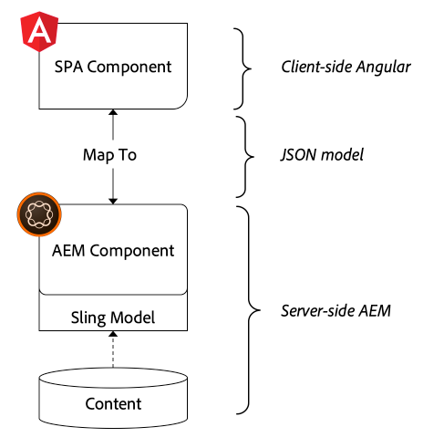
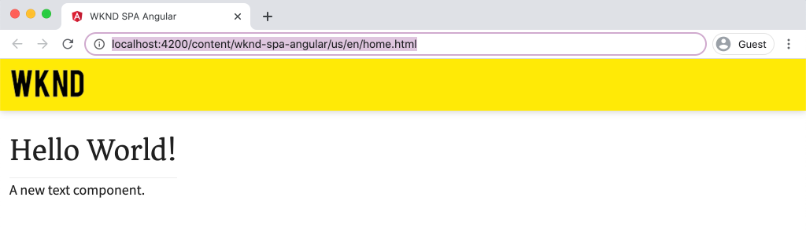
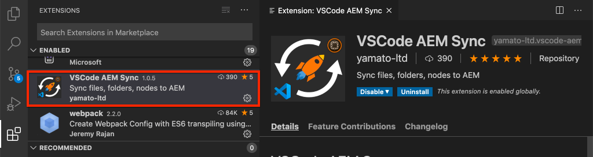

# Zuordnen von SPA-Komponenten zu AEM Komponenten {#map-components}

Erfahren Sie, wie Sie Angular-Komponenten mit dem AEM SPA Editor JS SDK Adobe Experience Manager (AEM) Komponenten zuordnen. Mithilfe der Komponentenzuordnung können Benutzer im AEM SPA-Editor dynamische Aktualisierungen an SPA-Komponenten vornehmen, ähnlich wie beim herkömmlichen AEM Authoring.

Dieses Kapitel enthält einen tieferen Einstieg in die AEM JSON-Modell-API und wie der JSON-Inhalt, der von einer AEM Komponente offen gelegt wird, automatisch als Props in eine Angular-Komponente injiziert werden kann.

## Vorgabe

1. Erfahren Sie, wie Sie AEM Komponenten SPA-Komponenten zuordnen.
2. Machen Sie sich mit dem Unterschied zwischen **Container** - und **Inhaltskomponenten** vertraut.
3. Erstellen Sie eine neue Angular-Komponente, die einer vorhandenen AEM zugeordnet ist.

## Was Sie erstellen

In diesem Kapitel wird untersucht, wie die bereitgestellte `Text` SPA-Komponente der AEM `Text`Komponente zugeordnet wird. Es wird eine neue `Image` SPA-Komponente erstellt, die im SPA verwendet und in AEM verfasst werden kann. Außerdem werden vordefinierte Funktionen der Richtlinien **Layout Container** und **Vorlageneditor** verwendet, um eine Ansicht zu erstellen, die im Erscheinungsbild etwas abwechslungsreicher ist.


## Voraussetzungen

Überprüfen Sie die erforderlichen Werkzeuge und Anleitungen zum Einrichten einer [lokalen Entwicklungs-Umgebung](overview.md#local-dev-environment).

### Code abrufen

1. Laden Sie den Ausgangspunkt für dieses Lernprogramm über Git herunter:

   ```shell
   $ git clone git@github.com:adobe/aem-guides-wknd-spa.git
   $ cd aem-guides-wknd-spa
   $ git checkout Angular/map-components-start
   ```

2. Stellen Sie die Codebasis mithilfe von Maven auf einer lokalen AEM-Instanz bereit:

   ```shell
   $ mvn clean install -PautoInstallSinglePackage
   ```

   Bei Verwendung von [AEM 6.x](overview.md#compatibility) fügen Sie das `classic` Profil hinzu:

   ```shell
   $ mvn clean install -PautoInstallSinglePackage -Pclassic
   ```

Sie können den fertigen Code immer auf [GitHub](https://github.com/adobe/aem-guides-wknd-spa/tree/Angular/map-components-solution) Ansicht oder den Code lokal auschecken, indem Sie zur Verzweigung wechseln `Angular/map-components-solution`.

## Zuordnungsansatz

Das Grundkonzept besteht darin, eine SPA-Komponente einer AEM Komponente zuzuordnen. AEM Komponenten, serverseitig ausführen, Inhalte als Teil der JSON-Modell-API exportieren Der JSON-Inhalt wird vom SPA genutzt und im Browser clientseitig ausgeführt. Es wird eine 1:1-Zuordnung zwischen SPA-Komponenten und einer AEM-Komponente erstellt.



*Überblick über die Zuordnung einer AEM Komponente zu einer Angular-Komponente auf hoher Ebene*

## Inspect der Textkomponente

Der [AEM Projektarchiv](https://github.com/adobe/aem-project-archetype) stellt eine `Text` Komponente bereit, die der AEM [Textkomponente](https://docs.adobe.com/content/help/de-DE/experience-manager-core-components/using/components/text.html)zugeordnet wird. Dies ist ein Beispiel für eine **Inhaltskomponente** , da sie *Inhalte* aus AEM rendert.

Sehen wir uns an, wie die Komponente funktioniert.

### Inspect-JSON-Modell

1. Bevor Sie in den SPA-Code springen, sollten Sie das JSON-Modell, das AEM bietet, kennen. Navigieren Sie zur [Kernkomponentenbibliothek](https://www.aemcomponents.dev/content/core-components-examples/library/page-authoring/text.html) und Ansicht der Textseite. Die Core Component Library enthält Beispiele für alle AEM Core-Komponenten.
2. Wählen Sie für eines der Beispiele die Registerkarte **JSON** aus:

   

   Es sollten drei Eigenschaften angezeigt werden: `text`, `richText`und `:type`.

   `:type` ist eine reservierte Eigenschaft, die die `sling:resourceType` (oder den Pfad) der AEM-Komponente Liste. Der Wert von `:type` ist der Wert, mit dem die AEM Komponente der SPA-Komponente zugeordnet wird.

   `text` und `richText` sind zusätzliche Eigenschaften, die der SPA-Komponente bereitgestellt werden.

### Inspect der Textkomponente

1. Öffnen Sie ein neues Terminal und navigieren Sie zum `ui.frontend` Ordner im Projekt. Führen Sie `npm install` den `npm start` Webpack-Dev-Server **aus und dann** zum Beginn:

   ```shell
   $ cd ui.frontend
   $ npm run start:mock
   ```

   Das `ui.frontend` Modul ist derzeit für die Verwendung des [JSON-Modell](./integrate-spa.md#mock-json)eingerichtet.

2. Es sollte ein neues Browserfenster geöffnet werden, das [http://localhost:4200/content/wknd-spa-angular/us/en/home.html](http://localhost:4200/content/wknd-spa-angular/us/en/home.html)

   

3. Öffnen Sie in der IDE Ihrer Wahl das AEM Projekt für die WKND SPA. Erweitern Sie das `ui.frontend` Modul und öffnen Sie die Datei **text.component.ts** unter `ui.frontend/src/app/components/text/text.component.ts`:

   

4. Der erste zu prüfende Bereich ist die `class TextComponent` bei ~Zeile 35:

   ```js
   export class TextComponent {
       @Input() richText: boolean;
       @Input() text: string;
       @Input() itemName: string;
   
       @HostBinding('innerHtml') get content() {
           return this.richText
           ? this.sanitizer.bypassSecurityTrustHtml(this.text)
           : this.text;
       }
       @HostBinding('attr.data-rte-editelement') editAttribute = true;
   
       constructor(private sanitizer: DomSanitizer) {}
   }
   ```

   [@Input()](https://angular.io/api/core/Input) decorator wird verwendet, um Felder zu deklarieren, deren Werte über das zugeordnete JSON-Objekt festgelegt werden, das zuvor überprüft wurde.

   `@HostBinding('innerHtml') get content()` ist eine Methode, die den verfassten Textinhalt aus dem Wert `this.text`von verfügbar macht. Wenn der Inhalt Rich Text (durch das `this.richText` Flag bestimmt) ist, wird die integrierte Sicherheit von Angular umgangen. Angular&#39;s [DomSanitizer](https://angular.io/api/platform-browser/DomSanitizer) wird verwendet, um rohe HTML-Daten zu &quot;scrubben&quot; und Cross-Site Scripting-Verwundbarkeiten zu verhindern. Die Methode ist mit dem Dekorator `innerHtml` @HostBinding [an die](https://angular.io/api/core/HostBinding) Eigenschaft gebunden.

5. Anschließend überprüfen Sie die `TextEditConfig` unter ~Zeile 24:

   ```js
   const TextEditConfig = {
       emptyLabel: 'Text',
       isEmpty: cqModel =>
           !cqModel || !cqModel.text || cqModel.text.trim().length < 1
   };
   ```

   Der obige Code bestimmt, wann der Platzhalter in der Umgebung AEM Autors wiedergegeben wird. Wenn die `isEmpty` Methode **true** zurückgibt, wird der Platzhalter gerendert.

6. Sehen Sie sich schließlich den `MapTo` Aufruf von ~Zeile 53 an:

   ```js
   MapTo('wknd-spa-angular/components/text')(TextComponent, TextEditConfig );
   ```

   **MapTo** wird vom AEM SPA Editor JS SDK (`@adobe/cq-angular-editable-components`) bereitgestellt. Der Pfad `wknd-spa-angular/components/text` stellt die `sling:resourceType` Komponente AEM dar. Dieser Pfad wird mit dem zuvor beobachteten JSON-Modell `:type` abgeglichen. **MapTo** analysiert die JSON-Modellantwort und übergibt die korrekten Werte an die `@Input()` Variablen der SPA-Komponente.

   Die AEM `Text` Komponentendefinition finden Sie unter `ui.apps/src/main/content/jcr_root/apps/wknd-spa-angular/components/text`.

7. Experimentieren Sie, indem Sie die Datei **en.model.json** unter ändern `ui.frontend/src/mocks/json/en.model.json`.

   Aktualisieren Sie in ~Zeile 62 den ersten `Text` Wert, um ein **`H1`** und **`u`** -Tags zu verwenden:

   ```json
       "text": {
           "text": "<h1><u>Hello World!</u></h1>",
           "richText": true,
           ":type": "wknd-spa-angular/components/text"
       }
   ```

   Kehren Sie zum Browser zurück, um die vom **Webpack-Dev-Server** bereitgestellten Effekte anzuzeigen:

   

   Versuchen Sie, die `richText` Eigenschaft zwischen **true** / **false** umzuschalten, um die Renderlogik in Aktion zu sehen.

8. Inspect **text.component.html** at `ui.frontend/src/app/components/text/text.component.html`.

   Diese Datei ist leer, da der gesamte Inhalt der Komponente durch die `innerHTML` Eigenschaft festgelegt wird.

9. Inspect Sie die Datei **app.module.ts** unter `ui.frontend/src/app/app.module.ts`.

   ```js
   @NgModule({
   imports: [
       BrowserModule,
       SpaAngularEditableComponentsModule,
       AppRoutingModule
   ],
   providers: [ModelManagerService, { provide: APP_BASE_HREF, useValue: '/' }],
   declarations: [AppComponent, TextComponent, PageComponent, HeaderComponent],
   entryComponents: [TextComponent, PageComponent],
   bootstrap: [AppComponent]
   })
   export class AppModule {}
   ```

   Die **TextComponent** ist nicht explizit enthalten, sondern dynamisch über **AEMResponsiveGridComponent** , bereitgestellt vom AEM SPA Editor JS SDK. Daher muss im **app.module.ts**&#39; [entryComponents](https://angular.io/guide/entry-components) -Array aufgeführt werden.

## Erstellen der Bildkomponente

Erstellen Sie anschließend eine `Image` Angular-Komponente, die der AEM [Image-Komponente](https://docs.adobe.com/content/help/de-DE/experience-manager-core-components/using/components/image.html)zugeordnet wird. Die `Image` Komponente ist ein weiteres Beispiel für eine **Inhaltskomponente** .

### Inspect the JSON

Prüfen Sie vor dem Aufrufen des SPA-Codes das von AEM bereitgestellte JSON-Modell.

1. Navigieren Sie zu den [Bildbeispielen in der Core Component-Bibliothek](https://www.aemcomponents.dev/content/core-components-examples/library/page-authoring/image.html).

   

   Eigenschaften von `src`, `alt`und `title` werden zum Füllen der SPA- `Image` Komponente verwendet.

   >[!NOTE]
   >
   > Es sind andere Bildeigenschaften verfügbar (`lazyEnabled`, `widths`), die es einem Entwickler ermöglichen, eine adaptive und verzögertes Laden-Komponente zu erstellen. Die in diesem Lernprogramm erstellte Komponente ist einfach und verwendet **nicht** diese erweiterten Eigenschaften.

2. Kehren Sie zu Ihrer IDE zurück und öffnen Sie das `en.model.json` unter `ui.frontend/src/mocks/json/en.model.json`. Da dies eine netto-neue Komponente für unser Projekt ist, müssen wir das Bild JSON &quot;spotten&quot;.

   Fügen Sie in ~Zeile 70 einen JSON-Eintrag für das `image` Modell hinzu (vergessen Sie nicht das nachfolgende Komma `,` nach der zweiten `text_386303036`) und aktualisieren Sie das `:itemsOrder` Array.

   ```json
   ...
   ":items": {
               ...
               "text_386303036": {
                   "text": "<p>A new text component.</p>\r\n",
                   "richText": true,
                   ":type": "wknd-spa-angular/components/text"
                   },
               "image": {
                   "alt": "Rock Climber in New Zealand",
                   "title": "Rock Climber in New Zealand",
                   "src": "/mocks/images/adobestock-140634652.jpeg",
                   ":type": "wknd-spa-angular/components/image"
               }
           },
           ":itemsOrder": [
               "text",
               "text_386303036",
               "image"
           ],
   ```

   Das Projekt enthält ein Beispielbild, `/mock-content/adobestock-140634652.jpeg` das mit dem **Webpack-Dev-Server** verwendet wird.

   Sie können hier die vollständige [en.model.json-Ansicht durchführen](https://github.com/adobe/aem-guides-wknd-spa/blob/Angular/map-components-solution/ui.frontend/src/mocks/json/en.model.json).

3. hinzufügen ein von der Komponente anzuzeigendes Lagerfoto.

   Erstellen Sie einen neuen Ordner mit dem Namen **images** unter `ui.frontend/src/mocks`. Laden Sie [adobestock-140634652.jpeg](assets/map-components/adobestock-140634652.jpeg) herunter und legen Sie es im neu erstellten Ordner &quot; **images** &quot;ab. Sie können Ihr eigenes Bild bei Bedarf verwenden.

### Komponente &quot;Bild&quot;implementieren

1. Beenden Sie den **Webpack dev-Server** , wenn er gestartet wird.
2. Erstellen Sie eine neue Image-Komponente, indem Sie den `ng generate component` Befehl &quot;Angular CLI&quot;aus einem `ui.frontend` Ordner ausführen:

   ```shell
   $ ng generate component components/image
   ```

3. Öffnen Sie in der IDE **image.component.ts** bei `ui.frontend/src/app/components/image/image.component.ts` und aktualisieren Sie wie folgt:

   ```js
   import {Component, Input, OnInit} from '@angular/core';
   import {MapTo} from '@adobe/cq-angular-editable-components';
   
   const ImageEditConfig = {
   emptyLabel: 'Image',
   isEmpty: cqModel =>
       !cqModel || !cqModel.src || cqModel.src.trim().length < 1
   };
   
   @Component({
   selector: 'app-image',
   templateUrl: './image.component.html',
   styleUrls: ['./image.component.scss']
   })
   export class ImageComponent implements OnInit {
   
   @Input() src: string;
   @Input() alt: string;
   @Input() title: string;
   
   constructor() { }
   
   get hasImage() {
       return this.src && this.src.trim().length > 0;
   }
   
   ngOnInit() { }
   }
   
   MapTo('wknd-spa-angular/components/image')(ImageComponent, ImageEditConfig);
   ```

   `ImageEditConfig` ist die Konfiguration, um zu bestimmen, ob der Autor-Platzhalter in AEM wiedergegeben werden soll, basierend darauf, ob die `src` Eigenschaft gefüllt ist.

   `@Input()` von `src`, `alt`und `title` sind die Eigenschaften, die von der JSON-API zugeordnet werden.

   `hasImage()` ist eine Methode, die bestimmt, ob das Bild wiedergegeben werden soll.

   `MapTo` ordnet die SPA-Komponente der AEM Komponente zu, die sich unter `ui.apps/src/main/content/jcr_root/apps/wknd-spa-angular/components/image`befindet.

4. Öffnen Sie **image.component.html** und aktualisieren Sie es wie folgt:

   ```html
   <ng-container *ngIf="hasImage">
       
   </ng-container>
   ```

   Dadurch wird das `` Element gerendert, wenn `hasImage` &quot; **true&quot;zurückgegeben wird**.

5. Öffnen Sie **image.component.scss** und aktualisieren Sie es wie folgt:

   ```scss
   :host-context {
       display: block;
   }
   
   .image {
       margin: 1rem 0;
       width: 100%;
       border: 0;
   }
   ```

   >[!NOTE]
   >
   > Die `:host-context` Regel ist **entscheidend** , damit der Platzhalter für den AEM SPA-Editor ordnungsgemäß funktioniert. Alle SPA-Komponenten, die im AEM Seiteneditor erstellt werden sollen, benötigen diese Regel mindestens.

6. Öffnen `app.module.ts` und fügen Sie `ImageComponent` dem `entryComponents` Array Folgendes hinzu:

   ```js
   entryComponents: [TextComponent, PageComponent, ImageComponent],
   ```

   Wie bei der `TextComponent`wird die `ImageComponent` Datei dynamisch geladen und muss in das `entryComponents` Array aufgenommen werden.

7. Beginn des **Webpack-Dev-Servers** , um das `ImageComponent` Rendering anzuzeigen.

   ```shell
   $ npm run start:mock
   ```

   

   *Dem SPA hinzugefügtes Bild*

   >[!NOTE]
   >
   > **Bonusherausforderung**: Implementieren Sie eine neue Methode, um den Wert von `title` als Beschriftung unter dem Bild anzuzeigen.

## Richtlinien in AEM aktualisieren

Die `ImageComponent` Komponente ist nur im **Webpack-Dev-Server** sichtbar. Stellen Sie dann die aktualisierte SPA bereit, um die Vorlagenrichtlinien zu AEM und zu aktualisieren.

1. Beenden Sie den **Webpack-Dev-Server** und stellen Sie die Änderungen an den AEM aus dem **Stammordner** des Projekts mit Ihren Maven-Fähigkeiten bereit:

   ```shell
   $ cd aem-guides-wknd-spa
   $ mvn clean install -PautoInstallSinglePackage
   ```

2. Navigieren Sie im Bildschirm &quot;AEM Beginn&quot;zu **[!UICONTROL Extras]** > **[!UICONTROL Vorlagen]** > **[WKND-SPA-Winkel](http://localhost:4502/libs/wcm/core/content/sites/templates.html/conf/wknd-spa-angular)**.

   Wählen Sie die **SPA-Seite** aus und bearbeiten Sie sie:

   

3. Wählen Sie den **Layout-Container** aus und klicken Sie auf das **Richtliniensymbol** , um die Richtlinie zu bearbeiten:

   

4. Unter **Zulässige Komponenten** > **WKND-SPA-Angular - Inhalt** > Überprüfen Sie die **Image** -Komponente:

   

   Wählen Sie unter &quot; **Standardkomponenten** &quot;> &quot; **Hinzufügen zuordnen** &quot;die Komponente &quot; **Bild - WKND-SPA-Winkel - Content** &quot;:

   

   Geben Sie einen **Mime-Typ** von ein `image/*`.

   Klicken Sie auf **Fertig** , um die Richtlinienaktualisierungen zu speichern.

5. Klicken Sie im Container **Layout** auf das Symbol **Richtlinie** für die **Textkomponente** :

   

   Erstellen Sie eine neue Richtlinie mit dem Namen **WKND SPA Text**. Aktivieren Sie unter **Plugins** > **Formatierung** > alle Kontrollkästchen, um weitere Formatierungsoptionen zu aktivieren:

   

   Aktivieren Sie unter **Plugins** > **Absatzformate** > das Kontrollkästchen, um Absatzformate **zu** aktivieren:

   

   Klicken Sie auf **Fertig** , um die Richtlinienaktualisierung zu speichern.

6. Navigieren Sie zur **Homepage** [http://localhost:4502/editor.html/content/wknd-spa-angular/us/en/home.html](http://localhost:4502/editor.html/content/wknd-spa-angular/us/en/home.html).

   Sie sollten auch die `Text` Komponente bearbeiten und zusätzliche Absatzstile im **Vollbildmodus** hinzufügen können.

   

7. Sie sollten auch ein Bild aus der **Asset-Suche** ziehen und ablegen können:

   

8. hinzufügen Sie Ihre eigenen Bilder über [AEM Assets](http://localhost:4502/assets.html/content/dam) oder installieren Sie die fertige Code-Basis für die Standard- [WKND-Referenz-Website](https://github.com/adobe/aem-guides-wknd/releases/latest). Die [WKND-Referenz-Website](https://github.com/adobe/aem-guides-wknd/releases/latest) enthält viele Bilder, die auf der WKND-SPA wiederverwendet werden können. Das Paket kann mit [AEM Package Manager](http://localhost:4502/crx/packmgr/index.jsp)installiert werden.

   

## Inspect Layout Container

Der **Layout-Container** wird automatisch vom AEM SPA Editor SDK unterstützt. Der **Layout-Container** ist, wie durch den Namen angegeben, eine **Container** -Komponente. Container-Komponenten sind Komponenten, die JSON-Strukturen akzeptieren, die *andere* Komponenten darstellen und dynamisch instanziieren.

Lassen Sie uns den Layout-Container näher untersuchen.

1. Öffnen Sie in der IDE **responsive-grid.component.ts** unter `ui.frontend/src/app/components/responsive-grid`:

   ```js
   import { AEMResponsiveGridComponent,MapTo } from '@adobe/cq-angular-editable-components';
   
   MapTo('wcm/foundation/components/responsivegrid')(AEMResponsiveGridComponent);
   ```

   Die `AEMResponsiveGridComponent` wird als Teil des AEM SPA Editor SDK implementiert und über `import-components`das Projekt in das Projekt aufgenommen.

2. Navigieren Sie in einem Browser zu [http://localhost:4502/content/wknd-spa-angular/us/en.model.json](http://localhost:4502/content/wknd-spa-angular/us/en.model.json)

   

   Die Komponente **Layout Container** verfügt über einen `sling:resourceType` von `wcm/foundation/components/responsivegrid` und wird vom SPA-Editor mithilfe der `:type` Eigenschaft erkannt, genau wie die `Text` und die `Image` Komponenten.

   Mit dem SPA-Editor stehen die gleichen Funktionen zum Neuskalieren einer Komponente im [Layoutmodus](https://docs.adobe.com/content/help/en/experience-manager-65/authoring/siteandpage/responsive-layout.html#defining-layouts-layout-mode) zur Verfügung.

3. Kehren Sie zu [http://localhost:4502/editor.html/content/wknd-spa-angular/us/en/home.html](http://localhost:4502/editor.html/content/wknd-spa-angular/us/en/home.html)zurück. hinzufügen Sie weitere **Bildkomponenten** und versuchen Sie, die Größe mithilfe der Option &quot; **Layout** &quot;zu ändern:

   

4. Öffnen Sie das JSON-Modell erneut [http://localhost:4502/content/wknd-spa-angular/us/en.model.json](http://localhost:4502/content/wknd-spa-angular/us/en.model.json) und beobachten Sie das `columnClassNames` JSON-Modell:

   

   Der Klassenname `aem-GridColumn--default--4` gibt an, dass die Komponente basierend auf einem 12-Spalten-Raster vier Spalten breit sein sollte. Weitere Informationen zum [reaktionsfähigen Raster finden Sie hier](https://adobe-marketing-cloud.github.io/aem-responsivegrid/).

5. Kehren Sie zur IDE zurück und im `ui.apps` Modul ist eine clientseitige Bibliothek definiert `ui.apps/src/main/content/jcr_root/apps/wknd-spa-angular/clientlibs/clientlib-grid`. Öffnen Sie die Datei `less/grid.less`.

   Diese Datei legt die vom`default`Layout-Container `tablet`verwendeten Haltepunkte ( `phone`, **und**) fest. Diese Datei soll nach Projektspezifikationen angepasst werden. Derzeit sind die Haltepunkte auf `1200px` und `650px`festgelegt.

6. Sie sollten die reaktionsfähigen Funktionen und die aktualisierten Rich-Text-Richtlinien der `Text` Komponente verwenden können, um eine Ansicht wie die folgende zu erstellen:

   

## Herzlichen Glückwunsch! {#congratulations}

Herzlichen Glückwunsch, Sie haben gelernt, wie Sie SPA-Komponenten zu AEM Komponenten zuordnen und Sie haben eine neue `Image` Komponente implementiert. Sie haben auch die Möglichkeit, die reaktionsfähigen Funktionen des **Layout-Containers** zu erkunden.

Sie können den fertigen Code immer auf [GitHub](https://github.com/adobe/aem-guides-wknd-spa/tree/Angular/map-components-solution) Ansicht oder den Code lokal auschecken, indem Sie zur Verzweigung wechseln `Angular/map-components-solution`.

### Nächste Schritte {#next-steps}

[Navigation und Routing](navigation-routing.md) - Erfahren Sie, wie mehrere Ansichten im SPA durch Zuordnen zu AEM mit dem SPA Editor SDK unterstützt werden können. Die dynamische Navigation wird mithilfe des Angular-Routers implementiert und einer vorhandenen Header-Komponente hinzugefügt.

## Bonus - Beständige Konfigurationen zur Quellcodeverwaltung {#bonus}

In vielen Fällen, besonders zu Beginn eines AEM Projekts, ist es nützlich, Konfigurationen wie Vorlagen und zugehörige Inhaltsrichtlinien zur Quellcodeverwaltung beizubehalten. Dadurch wird sichergestellt, dass alle Entwickler mit demselben Inhaltssatz und denselben Konfigurationen arbeiten und zusätzliche Konsistenz zwischen den Umgebung sicherstellen. Sobald ein Projekt eine gewisse Reife erreicht hat, kann die Verwaltung von Vorlagen einer speziellen Gruppe von Stromverbrauchern überlassen werden.

Die nächsten Schritte werden mit der Code-IDE und [VSCode AEM Synchronisierung](https://marketplace.visualstudio.com/items?itemName=yamato-ltd.vscode-aem-sync) von Visual Studio durchgeführt. Sie können jedoch jedes Tool und jede IDE verwenden, die Sie zum **Abrufen** oder **Importieren** von Inhalten aus einer lokalen Instanz von AEM konfiguriert haben.

1. Stellen Sie in der Code-IDE von Visual Studio sicher, dass **VSCode AEM Sync** über die Erweiterung Marketplace installiert ist:

   

2. Erweitern Sie das Modul **ui.content** im Projektexplorer und navigieren Sie zu `/conf/wknd-spa-angular/settings/wcm/templates`.

3. **Klicken Sie mit der rechten Maustaste auf** den `templates` Ordner und wählen Sie **Aus AEM Server** importieren:

   

4. Wiederholen Sie die Schritte zum Importieren von Inhalten, wählen Sie jedoch den **Ordner &quot;policies** &quot;unter `/conf/wknd-spa-angular/settings/wcm/templates/policies`.

5. Inspect Sie die `filter.xml` Datei unter `ui.content/src/main/content/META-INF/vault/filter.xml`.

   ```xml
   <!--ui.content filter.xml-->
   <?xml version="1.0" encoding="UTF-8"?>
    <workspaceFilter version="1.0">
        <filter root="/conf/wknd-spa-angular" mode="merge"/>
        <filter root="/content/wknd-spa-angular" mode="merge"/>
        <filter root="/content/dam/wknd-spa-angular" mode="merge"/>
        <filter root="/content/experience-fragments/wknd-spa-angular" mode="merge"/>
    </workspaceFilter>
   ```

   Die `filter.xml` Datei ist dafür verantwortlich, die Pfade der Knoten zu identifizieren, die mit dem Paket installiert werden. Beachten Sie die `mode="merge"` auf jedem Filter, die anzeigen, dass vorhandene Inhalte nicht geändert werden, sondern nur neue Inhalte hinzugefügt werden. Da Inhaltsersteller diese Pfade möglicherweise aktualisieren, ist es wichtig, dass eine Codebereitstellung Inhalte **nicht** überschreibt. Weitere Informationen zum Arbeiten mit Filterelementen finden Sie in der [FileVault-Dokumentation](https://jackrabbit.apache.org/filevault/filter.html) .

   Vergleichen `ui.content/src/main/content/META-INF/vault/filter.xml` und `ui.apps/src/main/content/META-INF/vault/filter.xml` verstehen Sie die verschiedenen Knoten, die von den einzelnen Modulen verwaltet werden.
