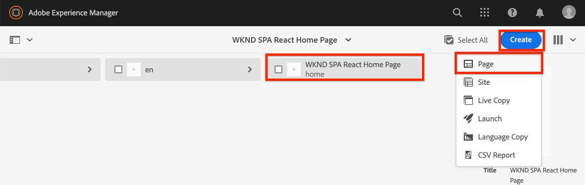

# hinzufügen Navigation und Routing {#navigation-routing}

Erfahren Sie, wie mehrere Ansichten im SPA mithilfe von AEM und SPA Editor SDK unterstützt werden. Die dynamische Navigation wird mithilfe von Angular-Routen implementiert und einer vorhandenen Kopfzeilenkomponente hinzugefügt.

## Vorgabe

1. Machen Sie sich mit den Optionen für das Routing des SPA-Modells vertraut, die bei Verwendung des SPA-Editors verfügbar sind.
2. Hier erfahren Sie, wie Sie mit dem Routing [Angular](https://angular.io/guide/router) zwischen verschiedenen Ansichten des SPA navigieren.
3. Implementieren Sie eine dynamische Navigation, die von der AEM Seitenhierarchie gesteuert wird.

## Was Sie erstellen werden

In diesem Kapitel wird einer vorhandenen Komponente `Header` ein Navigationsmenü hinzugefügt. Das Navigationsmenü wird von der AEM-Seitenhierarchie gesteuert und verwendet das JSON-Modell, das von der [Navigationskernkomponente](https://docs.adobe.com/content/help/de/experience-manager-core-components/using/components/navigation.html) bereitgestellt wird.


## Voraussetzungen

Überprüfen Sie die erforderlichen Werkzeuge und Anweisungen zum Einrichten einer [lokalen Entwicklungs-Umgebung](overview.md#local-dev-environment).

### Code abrufen

1. Laden Sie den Ausgangspunkt für dieses Lernprogramm über Git herunter:

   ```shell
   $ git clone git@github.com:adobe/aem-guides-wknd-spa.git
   $ cd aem-guides-wknd-spa
   $ git checkout Angular/navigation-routing-start
   ```

2. Stellen Sie die Codebasis mithilfe von Maven auf einer lokalen AEM-Instanz bereit:

   ```shell
   $ mvn clean install -PautoInstallSinglePackage
   ```

   Wenn Sie [AEM 6.x](overview.md#compatibility) verwenden, fügen Sie das `classic`-Profil hinzu:

   ```shell
   $ mvn clean install -PautoInstallSinglePackage -Pclassic
   ```

3. Installieren Sie das fertige Paket für die herkömmliche [WKND-Referenz-Website](https://github.com/adobe/aem-guides-wknd/releases/latest). Die von [WKND-Referenz-Website](https://github.com/adobe/aem-guides-wknd/releases/latest) bereitgestellten Bilder werden auf der WKND-SPA wiederverwendet. Das Paket kann mit [AEM Package Manager](http://localhost:4502/crx/packmgr/index.jsp) installiert werden.

   

Sie können den fertigen Code immer auf [GitHub](https://github.com/adobe/aem-guides-wknd-spa/tree/Angular/navigation-routing-solution) oder lokal prüfen, indem Sie zur Verzweigung `Angular/navigation-routing-solution` wechseln.

## Inspect HeaderComponent-Updates {#inspect-header}

In vorherigen Kapiteln wurde die Komponente `HeaderComponent` als reine Angular-Komponente hinzugefügt, die über `app.component.html` eingeschlossen wurde. In diesem Kapitel wird die Komponente `HeaderComponent` aus der App entfernt und über den [Vorlagen-Editor](https://docs.adobe.com/content/help/de-DE/experience-manager-learn/sites/page-authoring/template-editor-feature-video-use.html) hinzugefügt. Dadurch können Benutzer das Navigationsmenü von `HeaderComponent` aus AEM konfigurieren.

>[!NOTE]
>
> Zur Beginn dieses Kapitels wurden bereits mehrere CSS- und JavaScript-Aktualisierungen an der Codebasis vorgenommen. Um sich auf Kernkonzepte zu konzentrieren, werden nicht **alle** der Codeänderungen besprochen. Sie können die vollständigen Änderungen [hier](https://github.com/adobe/aem-guides-wknd-spa/compare/Angular/map-components-solution...Angular/navigation-routing-start) Ansicht vornehmen.

1. Öffnen Sie in der IDE Ihrer Wahl das SPA Startprojekt für dieses Kapitel.
2. Unterhalb des Moduls `ui.frontend` überprüfen Sie die Datei `header.component.ts` unter: `ui.frontend/src/app/components/header/header.component.ts`.

   Es wurden verschiedene Aktualisierungen vorgenommen, darunter das Hinzufügen von `HeaderEditConfig` und einem `MapTo`, um die Zuordnung der Komponente zu einer AEM Komponente `wknd-spa-angular/components/header` zu ermöglichen.

   ```js
   /* header.component.ts */
   ...
   const HeaderEditConfig = {
       ...
   };
   
   @Component({
   selector: 'app-header',
   templateUrl: './header.component.html',
   styleUrls: ['./header.component.scss']
   })
   export class HeaderComponent implements OnInit {
   @Input() items: object[];
       ...
   }
   ...
   MapTo('wknd-spa-angular/components/header')(withRouter(Header), HeaderEditConfig);
   ```

   Beachten Sie die Anmerkung `@Input()` für `items`. `items` enthält ein Array von Navigationsobjekten, die von AEM übergeben werden.

3. Überprüfen Sie im Modul `ui.apps` die Komponentendefinition der Komponente AEM `Header`: `ui.apps/src/main/content/jcr_root/apps/wknd-spa-angular/components/header/.content.xml`:

   ```xml
   <?xml version="1.0" encoding="UTF-8"?>
   <jcr:root xmlns:sling="http://sling.apache.org/jcr/sling/1.0" xmlns:cq="http://www.day.com/jcr/cq/1.0"
       xmlns:jcr="http://www.jcp.org/jcr/1.0"
       jcr:primaryType="cq:Component"
       jcr:title="Header"
       sling:resourceSuperType="wknd-spa-angular/components/navigation"
       componentGroup="WKND SPA Angular - Structure"/>
   ```

   Die AEM `Header`-Komponente übernimmt alle Funktionen der [Navigationskernkomponente](https://docs.adobe.com/content/help/en/experience-manager-core-components/using/components/navigation.html) über die `sling:resourceSuperType`-Eigenschaft.

## hinzufügen die HeaderComponent der SPA Vorlage {#add-header-template}

1. Öffnen Sie einen Browser und melden Sie sich bei AEM [http://localhost:4502/](http://localhost:4502/) an. Die Basis für den Startcode sollte bereits bereitgestellt werden.
2. Navigieren Sie zum Ordner **[!UICONTROL SPA Seitenvorlage]**: [http://localhost:4502/editor.html/conf/wknd-spa-angular/settings/wcm/templates/spa-page-template/structure.html](http://localhost:4502/editor.html/conf/wknd-spa-angular/settings/wcm/templates/spa-page-template/structure.html).
3. Wählen Sie den äußeren **[!UICONTROL Root Layout Container]** und klicken Sie auf das Symbol **[!UICONTROL Richtlinie]**. Achten Sie darauf, **not** auszuwählen, um den **[!UICONTROL Layout-Container]** nicht gesperrt für Authoring auszuwählen.

   

4. Kopieren Sie die aktuelle Richtlinie und erstellen Sie eine neue Richtlinie mit dem Namen **[!UICONTROL SPA Struktur]**:

   

   Wählen Sie unter **[!UICONTROL Zulässige Komponenten]** > **[!UICONTROL Allgemein]** > die Komponente **[!UICONTROL Layout Container]** aus.

   Wählen Sie unter **[!UICONTROL Zulässige Komponenten]** > **[!UICONTROL WKND SPA ANGULAR - STRUKTUR]** > die Komponente **[!UICONTROL Kopfzeile]** aus:

   

   Wählen Sie unter **[!UICONTROL Zulässige Komponenten]** > **[!UICONTROL WKND SPA ANGULAR - Inhalt]** > die Komponenten **[!UICONTROL Bild]** und **[!UICONTROL Text]** aus. Sie sollten vier Komponenten auswählen.

   Klicken Sie auf **[!UICONTROL Fertig]**, um die Änderungen zu speichern.

5. **Aktualisieren Sie die Seite.** hinzufügen Sie die Komponente **[!UICONTROL Kopfzeile]** über dem nicht gesperrten **[!UICONTROL Layout-Container]**:

   

6. Wählen Sie die Komponente **[!UICONTROL Kopfzeile]** und klicken Sie auf das Symbol **Richtlinie**, um die Richtlinie zu bearbeiten.

   

7. Erstellen Sie eine neue Richtlinie mit einem **[!UICONTROL Richtlinientitel]** von **&quot;WKND SPA Kopfzeile&quot;**.

   Unter **[!UICONTROL Eigenschaften]**:

   * Legen Sie **[!UICONTROL Navigationsstamm]** auf `/content/wknd-spa-angular/us/en` fest.
   * Stellen Sie die **[!UICONTROL Root-Stufen ausschließen]** auf **1** ein.
   * Deaktivieren Sie **[!UICONTROL Alle untergeordneten Seiten]** erfassen.
   * Setzen Sie die **[!UICONTROL Navigationsstrukturtiefe]** auf **3**.

   

   Dadurch werden die 2 Navigationsstufen unterhalb von `/content/wknd-spa-angular/us/en` erfasst.

8. Nach dem Speichern der Änderungen sollten Sie das ausgefüllte `Header` als Teil der Vorlage sehen:

   

## Erstellen von untergeordneten Seiten

Anschließend erstellen Sie zusätzliche Seiten in AEM, die als verschiedene Ansichten im SPA dienen. Wir werden auch die hierarchische Struktur des von AEM bereitgestellten JSON-Modells überprüfen.

1. Navigieren Sie zur Konsole **Sites**: [http://localhost:4502/sites.html/content/wknd-spa-angular/us/en/home](http://localhost:4502/sites.html/content/wknd-spa-angular/us/en/home). Wählen Sie die **WKND SPA Angular-Startseite** aus und klicken Sie auf **[!UICONTROL Erstellen]** > **[!UICONTROL Seite]**:

   

2. Wählen Sie unter **[!UICONTROL Vorlage]** **[!UICONTROL SPA Seite]**. Geben Sie unter **[!UICONTROL Properties]** **&quot;Page 1&quot;** für **[!UICONTROL title]** und **&quot;page-1&quot;** als Namen ein.

   

   Klicken Sie auf **[!UICONTROL Erstellen]** und klicken Sie im Popup-Dialogfeld auf **[!UICONTROL Öffnen]**, um die Seite im AEM SPA Editor zu öffnen.

3. hinzufügen Sie eine neue Komponente **[!UICONTROL Text]** in den Container **[!UICONTROL Layout]**. Bearbeiten Sie die Komponente und geben Sie den Text ein: **&quot;Seite 1&quot;** mit dem RTE- und dem **H1**-Element (Sie müssen in den Vollbildmodus wechseln, um die Absatzelemente zu ändern)

   

   Fügen Sie zusätzliche Inhalte hinzu, z. B. ein Bild.

4. Kehren Sie zur AEM Sites-Konsole zurück und wiederholen Sie die oben genannten Schritte und erstellen Sie eine zweite Seite mit dem Namen **&quot;Seite 2&quot;** als Geschwister von **Seite 1**. hinzufügen Sie Inhalt auf **Seite 2**, damit er leicht identifiziert werden kann.
5. Erstellen Sie schließlich eine dritte Seite, **&quot;Seite 3&quot;**, aber als **untergeordnetes** von **Seite 2**. Nach Abschluss des Vorgangs sollte die Site-Hierarchie wie folgt aussehen:

   

6. Öffnen Sie auf einer neuen Registerkarte die von AEM bereitgestellte JSON-Modell-API: [http://localhost:4502/content/wknd-spa-angular/us/en.model.json](http://localhost:4502/content/wknd-spa-angular/us/en.model.json). Dieser JSON-Inhalt wird angefordert, wenn der SPA zum ersten Mal geladen wird. Die äußere Struktur sieht wie folgt aus:

   ```json
   {
   "language": "en",
   "title": "en",
   "templateName": "spa-app-template",
   "designPath": "/libs/settings/wcm/designs/default",
   "cssClassNames": "spa page basicpage",
   ":type": "wknd-spa-angular/components/spa",
   ":items": {},
   ":itemsOrder": [],
   ":hierarchyType": "page",
   ":path": "/content/wknd-spa-angular/us/en",
   ":children": {
       "/content/wknd-spa-angular/us/en/home": {},
       "/content/wknd-spa-angular/us/en/home/page-1": {},
       "/content/wknd-spa-angular/us/en/home/page-2": {},
       "/content/wknd-spa-angular/us/en/home/page-2/page-3": {}
       }
   }
   ```

   Unter `:children` sollte für jede erstellte Seite ein Eintrag angezeigt werden. Der Inhalt für alle Seiten ist in dieser ersten JSON-Anforderung enthalten. Nach der Implementierung des Navigationssystems werden nachfolgende Ansichten des SPA schnell geladen, da der Routing bereits clientseitig verfügbar ist.

   Es ist nicht sinnvoll, **ALL** des Inhalts eines SPA in der anfänglichen JSON-Anforderung zu laden, da dies das Laden der ersten Seite verlangsamen würde. Als Nächstes sehen wir uns an, wie die Hierarchietiefe der Seiten erfasst wird.

7. Navigieren Sie zur Vorlage **SPA Stamm** unter: [http://localhost:4502/editor.html/conf/wknd-spa-angular/settings/wcm/templates/spa-app-template/structure.html](http://localhost:4502/editor.html/conf/wknd-spa-angular/settings/wcm/templates/spa-app-template/structure.html).

   Klicken Sie auf das Menü **[!UICONTROL Seiteneigenschaften]** > **[!UICONTROL Seitenrichtlinie]**:

   

8. Die Vorlage **SPA Stamm** verfügt über eine zusätzliche Registerkarte **[!UICONTROL Hierarchische Struktur]**, um den erfassten JSON-Inhalt zu steuern. Die **[!UICONTROL Strukturtiefe]** bestimmt, wie tief in der Site-Hierarchie untergeordnete Seiten unterhalb der **root** erfasst werden. Sie können auch das Feld **[!UICONTROL Strukturmuster]** verwenden, um weitere Seiten basierend auf einem regulären Ausdruck zu filtern.

   Aktualisieren Sie die **[!UICONTROL Strukturtiefe]** auf **&quot;2&quot;**:

   

   Klicken Sie auf **[!UICONTROL Fertig]**, um die Änderungen an der Richtlinie zu speichern.

9. Öffnen Sie das JSON-Modell [http://localhost:4502/content/wknd-spa-angular/us/en.model.json](http://localhost:4502/content/wknd-spa-angular/us/en.model.json) erneut.

   ```json
   {
   "language": "en",
   "title": "en",
   "templateName": "spa-app-template",
   "designPath": "/libs/settings/wcm/designs/default",
   "cssClassNames": "spa page basicpage",
   ":type": "wknd-spa-angular/components/spa",
   ":items": {},
   ":itemsOrder": [],
   ":hierarchyType": "page",
   ":path": "/content/wknd-spa-angular/us/en",
   ":children": {
       "/content/wknd-spa-angular/us/en/home": {},
       "/content/wknd-spa-angular/us/en/home/page-1": {},
       "/content/wknd-spa-angular/us/en/home/page-2": {}
       }
   }
   ```

   Beachten Sie, dass der Pfad **Seite 3** entfernt wurde: `/content/wknd-spa-angular/us/en/home/page-2/page-3` aus dem anfänglichen JSON-Modell.

   Später werden wir beobachten, wie das AEM SPA Editor SDK zusätzliche Inhalte dynamisch laden kann.

## Implementierung der Navigation

Implementieren Sie anschließend das Navigationsmenü mit einem neuen `NavigationComponent`. Wir könnten den Code direkt in `header.component.html` hinzufügen, aber eine bessere Vorgehensweise ist, große Komponenten zu vermeiden. Implementieren Sie stattdessen ein `NavigationComponent`, das später wiederverwendet werden könnte.

1. Überprüfen Sie die JSON, die von der Komponente AEM `Header` unter [http://localhost:4502/content/wknd-spa-angular/us/en.model.json](http://localhost:4502/content/wknd-spa-angular/us/en.model.json) bereitgestellt wird:

   ```json
   ...
   "header": {
       "items": [
       {
       "level": 0,
       "active": true,
       "path": "/content/wknd-spa-angular/us/en/home",
       "description": null,
       "url": "/content/wknd-spa-angular/us/en/home.html",
       "lastModified": 1589062597083,
       "title": "WKND SPA Angular Home Page",
       "children": [
               {
               "children": [],
               "level": 1,
               "active": false,
               "path": "/content/wknd-spa-angular/us/en/home/page-1",
               "description": null,
               "url": "/content/wknd-spa-angular/us/en/home/page-1.html",
               "lastModified": 1589429385100,
               "title": "Page 1"
               },
               {
               "level": 1,
               "active": true,
               "path": "/content/wknd-spa-angular/us/en/home/page-2",
               "description": null,
               "url": "/content/wknd-spa-angular/us/en/home/page-2.html",
               "lastModified": 1589429603507,
               "title": "Page 2",
               "children": [
                   {
                   "children": [],
                   "level": 2,
                   "active": false,
                   "path": "/content/wknd-spa-angular/us/en/home/page-2/page-3",
                   "description": null,
                   "url": "/content/wknd-spa-angular/us/en/home/page-2/page-3.html",
                   "lastModified": 1589430413831,
                   "title": "Page 3"
                   }
               ],
               }
           ]
           }
       ],
   ":type": "wknd-spa-angular/components/header"
   ```

   Die hierarchische Natur der AEM Seiten wird im JSON modelliert, das zum Ausfüllen eines Navigationsmenüs verwendet werden kann. Denken Sie daran, dass die `Header`-Komponente alle Funktionen der [Navigationskernkomponente](https://www.aemcomponents.dev/content/core-components-examples/library/templating/navigation.html) übernimmt und der über JSON offen gelegte Inhalt automatisch der Angular `@Input`-Anmerkung zugeordnet wird.

2. Öffnen Sie ein neues Terminalfenster und navigieren Sie zum Ordner `ui.frontend` des SPA. Erstellen Sie ein neues `NavigationComponent` mit dem Angular CLI-Tool:

   ```shell
   $ cd ui.frontend
   $ ng generate component components/navigation
   CREATE src/app/components/navigation/navigation.component.scss (0 bytes)
   CREATE src/app/components/navigation/navigation.component.html (25 bytes)
   CREATE src/app/components/navigation/navigation.component.spec.ts (656 bytes)
   CREATE src/app/components/navigation/navigation.component.ts (286 bytes)
   UPDATE src/app/app.module.ts (2032 bytes)
   ```

3. Erstellen Sie anschließend eine Klasse mit dem Namen `NavigationLink` mithilfe der Angular-CLI im neu erstellten Ordner `components/navigation`:

   ```shell
   $ cd src/app/components/navigation/
   $ ng generate class NavigationLink
   CREATE src/app/components/navigation/navigation-link.spec.ts (187 bytes)
   CREATE src/app/components/navigation/navigation-link.ts (32 bytes)
   ```

4. Kehren Sie zur IDE Ihrer Wahl zurück und öffnen Sie die Datei unter `navigation-link.ts` bei `/src/app/components/navigation/navigation-link.ts`.

   

5. Füllen Sie `navigation-link.ts` wie folgt:

   ```js
   export class NavigationLink {
   
       title: string;
       path: string;
       url: string;
       level: number;
       children: NavigationLink[];
       active: boolean;
   
       constructor(data) {
           this.path = data.path;
           this.title = data.title;
           this.url = data.url;
           this.level = data.level;
           this.active = data.active;
           this.children = data.children.map( item => {
               return new NavigationLink(item);
           });
       }
   }
   ```

   Dies ist eine einfache Klasse zur Darstellung eines einzelnen Navigationslinks. Im Klassenkonstruktor wird erwartet, dass `data` das von AEM übergebene JSON-Objekt ist. Diese Klasse wird sowohl innerhalb von `NavigationComponent` als auch `HeaderComponent` verwendet, um die Navigationsstruktur einfach zu füllen.

   Es wird keine Datenumwandlung durchgeführt. Diese Klasse wird primär zur starken Typisierung des JSON-Modells erstellt. Beachten Sie, dass `this.children` als `NavigationLink[]` typisiert wird und dass der Konstruktor rekursiv neue `NavigationLink`-Objekte für jedes Element im `children`-Array erstellt. Denken Sie daran, dass das JSON-Modell für das `Header` hierarchisch ist.

6. Öffnen Sie die Datei `navigation-link.spec.ts`. Dies ist die Testdatei für die `NavigationLink`-Klasse. Aktualisieren Sie es mit folgenden Informationen:

   ```js
   import { NavigationLink } from './navigation-link';
   
   describe('NavigationLink', () => {
       it('should create an instance', () => {
           const data = {
               children: [],
               level: 1,
               active: false,
               path: '/content/wknd-spa-angular/us/en/home/page-1',
               description: null,
               url: '/content/wknd-spa-angular/us/en/home/page-1.html',
               lastModified: 1589429385100,
               title: 'Page 1'
           };
           expect(new NavigationLink(data)).toBeTruthy();
       });
   });
   ```

   Beachten Sie, dass `const data` demselben JSON-Modell folgt, das zuvor auf einen einzelnen Link überprüft wurde. Dies ist alles andere als ein robuster Komponententest, sollte jedoch ausreichen, um den Konstruktor von `NavigationLink` zu testen.

7. Öffnen Sie die Datei `navigation.component.ts`. Aktualisieren Sie es mit folgenden Informationen:

   ```js
   import { Component, OnInit, Input } from '@angular/core';
   import { NavigationLink } from './navigation-link';
   
   @Component({
   selector: 'app-navigation',
   templateUrl: './navigation.component.html',
   styleUrls: ['./navigation.component.scss']
   })
   export class NavigationComponent implements OnInit {
   
       @Input() items: object[];
   
       constructor() { }
   
       get navigationLinks(): NavigationLink[] {
   
           if (this.items && this.items.length > 0) {
               return this.items.map(item => {
                   return new NavigationLink(item);
               });
           }
   
           return null;
       }
   
       ngOnInit() {}
   
   }
   ```

   `NavigationComponent` erwartet einen  `object[]` Namen,  `items` der das JSON-Modell von AEM ist. Diese Klasse stellt eine einzelne Methode `get navigationLinks()` bereit, die ein Array von `NavigationLink`-Objekten zurückgibt.

8. Öffnen Sie die Datei `navigation.component.html` und aktualisieren Sie sie wie folgt:

   ```html
   <ul *ngIf="navigationLinks && navigationLinks.length > 0" class="navigation__group">
       <ng-container *ngTemplateOutlet="recursiveListTmpl; context:{ links: navigationLinks }"></ng-container>
   </ul>
   ```

   Dadurch wird eine initiale `<ul>`-Methode generiert und die `get navigationLinks()`-Methode von `navigation.component.ts` aufgerufen. Ein `<ng-container>` wird verwendet, um einen Aufruf an eine Vorlage mit dem Namen `recursiveListTmpl` durchzuführen und das `navigationLinks` als Variable mit dem Namen `links` zu übergeben.

   hinzufügen `recursiveListTmpl` als Nächstes:

   ```html
   <ng-template #recursiveListTmpl let-links="links">
       <li *ngFor="let link of links" class="{{'navigation__item navigation__item--' + link.level}}">
           <a [routerLink]="link.url" class="navigation__item-link" [title]="link.title" [attr.aria-current]="link.active">
               {{link.title}}
           </a>
           <ul *ngIf="link.children && link.children.length > 0">
               <ng-container *ngTemplateOutlet="recursiveListTmpl; context:{ links: link.children }"></ng-container>
           </ul>
       </li>
   </ng-template>
   ```

   Hier wird der Rest des Renderings für den Navigationslink implementiert. Beachten Sie, dass die Variable `link` vom Typ `NavigationLink` und alle von dieser Klasse erstellten Methoden/Eigenschaften verfügbar sind. [`[routerLink]`](https://angular.io/api/router/RouterLink) anstelle des normalen  `href` Attributs verwendet. Auf diese Weise können Sie Links zu bestimmten Routen in der App erstellen, ohne dass eine vollständige Aktualisierung erforderlich ist.

   Der rekursive Teil der Navigation wird auch durch Erstellen eines weiteren `<ul>` implementiert, wenn das aktuelle `link` ein nicht leeres `children`-Array hat.

9. Aktualisieren Sie `navigation.component.spec.ts`, um Unterstützung für `RouterTestingModule` hinzuzufügen:

   ```diff
    ...
   + import { RouterTestingModule } from '@angular/router/testing';
    ...
    beforeEach(async(() => {
       TestBed.configureTestingModule({
   +   imports: [ RouterTestingModule ],
       declarations: [ NavigationComponent ]
       })
       .compileComponents();
    }));
    ...
   ```

   Das Hinzufügen von `RouterTestingModule` ist erforderlich, da die Komponente `[routerLink]` verwendet.

10. Aktualisieren Sie `navigation.component.scss`, um einige grundlegende Stile zu `NavigationComponent` hinzuzufügen:

   ```scss
   @import "~src/styles/variables";
   
   $link-color: $black;
   $link-hover-color: $white;
   $link-background: $black;
   
   :host-context {
       display: block;
       width: 100%;
   }
   
   .navigation__item {
       list-style: none;
   }
   
   .navigation__item-link {
       color: $link-color;
       font-size: $font-size-large;
       text-transform: uppercase;
       padding: $gutter-padding;
       display: flex;
       border-bottom: 1px solid $gray;
   
       &:hover {
           background: $link-background;
           color: $link-hover-color;
       }
   
   }
   ```

## Aktualisieren der Kopfzeilenkomponente

Nachdem `NavigationComponent` implementiert wurde, muss `HeaderComponent` aktualisiert werden, um darauf zu verweisen.

1. Öffnen Sie ein Terminal und navigieren Sie zum Ordner `ui.frontend` innerhalb des SPA Projekts. Beginn des **webpack dev server**:

   ```shell
   $ npm start
   ```

2. Öffnen Sie eine Browser-Registerkarte und navigieren Sie zu [http://localhost:4200/](http://localhost:4200/).

   Der **webpack dev server** sollte so konfiguriert werden, dass das JSON-Modell von einer lokalen Instanz von AEM (`ui.frontend/proxy.conf.json`) proxyliert wird. Auf diese Weise können wir direkt mit den Inhalten vergleichen, die in AEM früheren Übung erstellt wurden.

   

   Die Menüschaltfläche `HeaderComponent` ist derzeit bereits implementiert. Fügen Sie als Nächstes die Navigationskomponente hinzu.

3. Kehren Sie zur IDE Ihrer Wahl zurück und öffnen Sie die Datei `header.component.ts` unter `ui.frontend/src/app/components/header/header.component.ts`.
4. Aktualisieren Sie die `setHomePage()`-Methode, um den hartcodierten String zu entfernen und die von der AEM-Komponente übergebenen dynamischen props zu verwenden:

   ```js
   /* header.component.ts */
   import { NavigationLink } from '../navigation/navigation-link';
   ...
    setHomePage() {
       if (this.hasNavigation) {
           const rootNavigationLink: NavigationLink = new NavigationLink(this.items[0]);
           this.isHome = rootNavigationLink.path === this.route.snapshot.data.path;
           this.homePageUrl = rootNavigationLink.url;
       }
   }
   ...
   ```

   Eine neue Instanz von `NavigationLink` wird basierend auf `items[0]` erstellt, dem Stamm des JSON-Navigationsmodells, das von AEM weitergegeben wird. `this.route.snapshot.data.path` gibt den Pfad der aktuellen Angular-Route zurück. Mit diesem Wert wird bestimmt, ob die aktuelle Route die **Startseite** ist. `this.homePageUrl` wird verwendet, um den Ankerlink auf dem  **Logo** zu füllen.

5. Öffnen Sie `header.component.html` und ersetzen Sie den statischen Platzhalter für die Navigation durch einen Verweis auf das neu erstellte `NavigationComponent`:

   ```diff
       <div class="header-navigation">
           <div class="navigation">
   -            Navigation Placeholder
   +           <app-navigation [items]="items"></app-navigation>
           </div>
       </div>
   ```

   `[items]=items` übergibt den Wert  `@Input() items` von der  `HeaderComponent` an die  `NavigationComponent` Stelle, an der die Navigation erstellt wird.

6. Öffnen Sie `header.component.spec.ts` und fügen Sie eine Deklaration für `NavigationComponent` hinzu:

   ```diff
       /* header.component.spect.ts */
   +   import { NavigationComponent } from '../navigation/navigation.component';
   
       describe('HeaderComponent', () => {
       let component: HeaderComponent;
       let fixture: ComponentFixture<HeaderComponent>;
   
       beforeEach(async(() => {
           TestBed.configureTestingModule({
           imports: [ RouterTestingModule ],
   +       declarations: [ HeaderComponent, NavigationComponent ]
           })
           .compileComponents();
       }));
   ```

   Da das `NavigationComponent` jetzt als Teil des `HeaderComponent` verwendet wird, muss es als Teil des Testbodens deklariert werden.

7. Speichern Sie Änderungen an allen geöffneten Dateien und kehren Sie zum **webpack dev server** zurück: [http://localhost:4200/](http://localhost:4200/)

   

   Öffnen Sie die Navigation, indem Sie auf den Menüschalter klicken, und Sie sollten die ausgefüllten Navigationslinks sehen. Sie sollten zu verschiedenen Ansichten der SPA navigieren können.

## Verstehen Sie das SPA Routing

Nachdem die Navigation implementiert wurde, überprüfen Sie das Routing in AEM.

1. Öffnen Sie in der IDE die Datei `app-routing.module.ts` unter `ui.frontend/src/app`.

   ```js
   /* app-routing.module.ts */
   import { AemPageDataResolver, AemPageRouteReuseStrategy } from '@adobe/cq-angular-editable-components';
   import { NgModule } from '@angular/core';
   import { RouteReuseStrategy, RouterModule, Routes, UrlMatchResult, UrlSegment } from '@angular/router';
   import { PageComponent } from './components/page/page.component';
   
   export function AemPageMatcher(url: UrlSegment[]): UrlMatchResult {
       if (url.length) {
           return {
               consumed: url,
               posParams: {
                   path: url[url.length - 1]
               }
           };
       }
   }
   
   const routes: Routes = [
       {
           matcher: AemPageMatcher,
           component: PageComponent,
           resolve: {
               path: AemPageDataResolver
           }
       }
   ];
   @NgModule({
       imports: [RouterModule.forRoot(routes)],
       exports: [RouterModule],
       providers: [
           AemPageDataResolver,
           {
           provide: RouteReuseStrategy,
           useClass: AemPageRouteReuseStrategy
           }
       ]
   })
   export class AppRoutingModule {}
   ```

   Das `routes: Routes = [];`-Array definiert die Routen oder Navigationspfade zu Angular-Komponentenzuordnungen.

   `AemPageMatcher` ist ein benutzerdefinierter Angular-Router  [UrlMatcher](https://angular.io/api/router/UrlMatcher), der mit allem übereinstimmt, was in AEM Angular-Anwendung &quot;aussieht&quot;.

   `PageComponent` ist die Angular-Komponente, die eine Seite in AEM darstellt, und die entsprechenden Routen werden aufgerufen. Die `PageComponent` werden weiter geprüft.

   `AemPageDataResolver`, bereitgestellt vom AEM SPA Editor JS SDK, ist ein benutzerdefinierter  [Angular-Router, der ](https://angular.io/api/router/Resolve) aufgelöst wird, um die Route-URL (den Pfad AEM einschließlich der Erweiterung .html) in den Ressourcenpfad in AEM umzuwandeln, d. h. den Seitenpfad weniger als die Erweiterung.

   Beispielsweise wandelt `AemPageDataResolver` die URL einer Route von `content/wknd-spa-angular/us/en/home.html` in einen Pfad von `/content/wknd-spa-angular/us/en/home` um. Auf diese Weise wird der Seiteninhalt basierend auf dem Pfad in der JSON-Modell-API aufgelöst.

   `AemPageRouteReuseStrategy`, bereitgestellt vom AEM SPA Editor JS SDK, ist eine benutzerspezifische  [](https://angular.io/api/router/RouteReuseStrategy) RouteReuseStrategy, die die Wiederverwendung der  `PageComponent` Routen verhindert. Andernfalls kann Inhalt von Seite &quot;A&quot;beim Navigieren zu Seite &quot;B&quot;angezeigt werden.

2. Öffnen Sie die Datei `page.component.ts` unter `ui.frontend/src/app/components/page/`.

   ```js
   ...
   export class PageComponent {
       items;
       itemsOrder;
       path;
   
       constructor(
           private route: ActivatedRoute,
           private modelManagerService: ModelManagerService
       ) {
           this.modelManagerService
           .getData({ path: this.route.snapshot.data.path })
           .then(data => {
               this.path = data[Constants.PATH_PROP];
               this.items = data[Constants.ITEMS_PROP];
               this.itemsOrder = data[Constants.ITEMS_ORDER_PROP];
           });
       }
   }
   ```

   `PageComponent` ist erforderlich, um die JSON zu verarbeiten, die von AEM abgerufen wurde, und wird als Angular-Komponente zum Rendern der Routen verwendet.

   `ActivatedRoute`, das vom Angular Router-Modul bereitgestellt wird, enthält den Status, der angibt, welcher AEM JSON-Inhalt der Seite in diese Angular Page-Komponenteninstanz geladen werden soll.

   `ModelManagerService`, ruft die JSON-Daten basierend auf der Route ab und ordnet die Daten Klassenvariablen zu  `path`,  `items`,  `itemsOrder`. Diese werden dann an die [AEMPageComponent](https://www.npmjs.com/package/@adobe/cq-angular-editable-components#aempagecomponent.md) weitergeleitet.

3. Öffnen Sie die Datei `page.component.html` unter `ui.frontend/src/app/components/page/`

   ```html
   <aem-page 
       class="structure-page" 
       [attr.data-cq-page-path]="path" 
       [cqPath]="path" 
       [cqItems]="items" 
       [cqItemsOrder]="itemsOrder">
   </aem-page>
   ```

   `aem-page` enthält die  [AEMPageComponent](https://www.npmjs.com/package/@adobe/cq-angular-editable-components#aempagecomponent.md). Die Variablen `path`, `items` und `itemsOrder` werden an `AEMPageComponent` übergeben. Die über die JavaScript-SDKs des SPA Editors bereitgestellten `AemPageComponent`-Variablen durchlaufen diese Daten und instanziieren dynamisch Angular-Komponenten basierend auf den JSON-Daten, wie im Tutorial [Komponenten zuordnen](./map-components.md) dargestellt.

   Das `PageComponent` ist wirklich nur ein Proxy für das `AEMPageComponent` und es ist das `AEMPageComponent`, das den Großteil der schweren Anhebung ausführt, um das JSON-Modell korrekt den Angular-Komponenten zuzuordnen.

## Inspect das SPA Routing in AEM

1. Öffnen Sie ein Terminal und beenden Sie den **webpack dev server**, wenn dieser gestartet wird. Navigieren Sie zum Stammverzeichnis des Projekts und stellen Sie das Projekt bereit, AEM Sie Ihre Maven-Fähigkeiten verwenden:

   ```shell
   $ cd aem-guides-wknd-spa
   $ mvn clean install -PautoInstallSinglePackage
   ```

   >[!CAUTION]
   >
   > Für das Angular-Projekt sind einige sehr strenge Linting-Regeln aktiviert. Wenn der Maven-Build fehlschlägt, überprüfen Sie den Fehler und suchen Sie nach **Lint-Fehlern, die in den aufgelisteten Dateien gefunden wurden.**. Beheben Sie alle vom Linter gefundenen Probleme und führen Sie den Maven-Befehl erneut aus.

2. Navigieren Sie zur SPA Homepage in AEM: [http://localhost:4502/content/wknd-spa-angular/us/en/home.html](http://localhost:4502/content/wknd-spa-angular/us/en/home.html) und öffnen Sie die Entwicklerwerkzeuge Ihres Browsers. Screenshots unten werden aus dem Google Chrome-Browser erfasst.

   Aktualisieren Sie die Seite und Sie sollten eine XHR-Anforderung an `/content/wknd-spa-angular/us/en.model.json` sehen, was der SPA Stamm ist. Beachten Sie, dass nur drei untergeordnete Seiten enthalten sind, basierend auf der Hierarchietiefenkonfiguration der SPA-Stammvorlage, die zuvor im Lernprogramm vorgenommen wurde. Dies umfasst nicht **Seite 3**.

   

3. Wenn die Entwicklerwerkzeuge geöffnet sind, navigieren Sie zu **Seite 3**:

   

   Beachten Sie, dass eine neue XHR-Anforderung an Folgendes gerichtet wird: `/content/wknd-spa-angular/us/en/home/page-2/page-3.model.json`

   

   Der AEM Modell-Manager erkennt, dass der JSON-Inhalt von **Seite 3** nicht verfügbar ist und Trigger automatisch die zusätzliche XHR-Anforderung.

4. Fahren Sie mit den verschiedenen Navigationslinks weiter durch die SPA. Beachten Sie, dass keine weiteren XHR-Anforderungen gestellt werden und keine vollständige Aktualisierung der Seite erfolgt. Dadurch wird der SPA für den Endbenutzer schnell und unnötige Anforderungen werden auf AEM reduziert.

   

5. Experimentieren Sie mit Deep Links, indem Sie direkt zu Folgendem navigieren: [http://localhost:4502/content/wknd-spa-angular/us/en/home/page-2.html](http://localhost:4502/content/wknd-spa-angular/us/en/home/page-2.html). Beachten Sie, dass die Zurück-Taste des Browsers weiterhin funktioniert.

## Herzlichen Glückwunsch! {#congratulations}

Herzlichen Glückwunsch, Sie haben gelernt, wie mehrere Ansichten im SPA durch Zuordnen zu AEM Seiten mit dem SPA Editor SDK unterstützt werden können. Die dynamische Navigation wurde mithilfe von Angular Routing implementiert und der Komponente `Header` hinzugefügt.

Sie können den fertigen Code immer auf [GitHub](https://github.com/adobe/aem-guides-wknd-spa/tree/Angular/navigation-routing-solution) oder lokal prüfen, indem Sie zur Verzweigung `Angular/navigation-routing-solution` wechseln.

### Nächste Schritte {#next-steps}

[Erstellen einer benutzerdefinierten Komponente](custom-component.md)  - Erfahren Sie, wie Sie eine benutzerdefinierte Komponente erstellen, die mit dem AEM SPA Editor verwendet werden soll. Erfahren Sie, wie Sie Authoring-Dialoge und Sling-Modelle entwickeln, um das JSON-Modell zu erweitern und eine benutzerdefinierte Komponente zu füllen.
