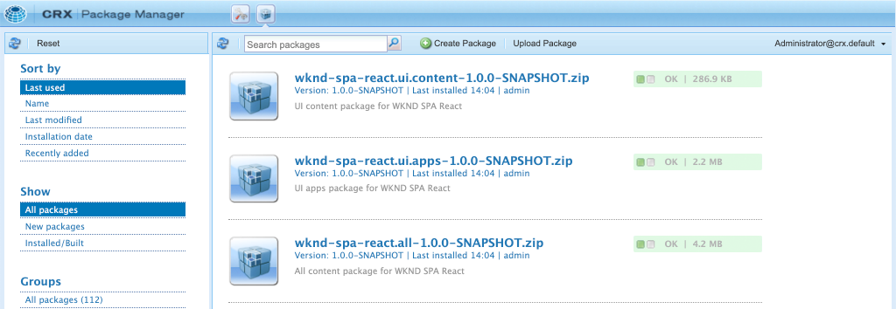

# SPA Editor Project {#spa-editor-project}

Erfahren Sie, wie Sie ein Adobe Experience Manager (AEM) Maven-Projekt als Ausgangspunkt für eine React-Anwendung verwenden, die mit dem AEM SPA Editor integriert ist.

## Vorgabe

1. Machen Sie sich mit der Struktur eines neuen AEM SPA Editor-Projekts vertraut, das auf einem Maven-Archetyp basiert.
2. Stellen Sie das Startprojekt auf einer lokalen Instanz von AEM bereit.

## Was Sie erstellen

In diesem Kapitel wird ein neues AEM Projekt bereitgestellt, das auf dem [AEM Projektarchiv](https://github.com/adobe/aem-project-archetype) basiert. Das AEM Projekt wird mit einem sehr einfachen Ausgangspunkt für die React SPA ausgestattet. Das in diesem Kapitel verwendete Projekt wird als Grundlage für die Umsetzung der SPA dienen und in künftigen Kapiteln aufbauen.


*Starthierarchie für die WKND-SPA.*

## Voraussetzungen

Überprüfen Sie die erforderlichen Werkzeuge und Anweisungen zum Einrichten einer [lokalen Entwicklungs-Umgebung](overview.md#local-dev-environment). Stellen Sie sicher, dass eine neue Instanz von Adobe Experience Manager, die im **author**-Modus gestartet wird, lokal ausgeführt wird.

## Projekt abrufen

Es gibt mehrere Optionen, um ein Maven-Multi-Modul-Projekt für AEM zu erstellen. In diesem Lernprogramm wurde der neueste [AEM Projektarchetyp](https://github.com/adobe/aem-project-archetype) als Grundlage für den Tutorialcode verwendet. Der Projektcode wurde geändert, um mehrere Versionen von AEM zu unterstützen. Bitte lesen Sie [den Hinweis zur Abwärtskompatibilität](overview.md#compatibility).

>[!CAUTION]
>
> Es empfiehlt sich, die **letzte** Version des [archetype](https://github.com/adobe/aem-project-archetype) zu verwenden, um ein neues Projekt für eine Implementierung in der realen Welt zu erstellen. AEM Projekte sollten mit der `aemVersion`-Eigenschaft des Archetyps eine einzelne AEM Zielgruppe werden.

1. Laden Sie den Ausgangspunkt für dieses Lernprogramm über Git herunter:

   ```shell
   $ git clone git@github.com:adobe/aem-guides-wknd-spa.git
   $ cd aem-guides-wknd-spa
   $ git checkout React/create-project-start
   ```

2. Die folgende Ordner- und Dateistruktur stellt das AEM Projekt dar, das vom Maven-Archetyp auf dem lokalen Dateisystem generiert wurde:

   ```plain
   |--- aem-guides-wknd-spa
       |--- all/
       |--- core/
       |--- dispatcher/
       |--- ui.apps/
       |--- ui.apps.structure/
       |--- ui.content/
       |--- ui.frontend /
       |--- it.tests/
       |--- pom.xml
       |--- README.md
       |--- .gitignore
       |--- archetype.properties
   ```

3. Die folgenden Eigenschaften wurden beim Generieren des AEM Projekts aus dem [AEM Projektarchiv](https://github.com/Adobe-Marketing-Cloud/aem-project-archetype/releases/tag/aem-project-archetype-14) verwendet:

   | Eigenschaft | Wert |
   |-----------------|-------------------------------------|
   | aemVersion | Wolke |
   | appTitle | WKND SPA React |
   | appId | work-spa-response |
   | groupId | com.adobe.aem.guides |
   | frontendModule | response |
   | package | com.adobe.aem.guides.wknd.spa.react |
   | includeExamples | n |

   >[!NOTE]
   >
   > Beachten Sie die Eigenschaft `frontendModule=react`. Dies weist den AEM Project Archetype an, das Projekt mit einem Startpunkt [React code base](https://docs.adobe.com/content/help/en/experience-manager-core-components/using/developing/archetype/uifrontend-react.html) zu bootstrappen, der mit dem AEM SPA Editor verwendet werden soll.

## Projekt erstellen

Kompilieren Sie dann den Projektcode und stellen Sie ihn mithilfe von Maven auf einer lokalen Instanz von AEM bereit.

1. Stellen Sie sicher, dass eine Instanz von AEM lokal am Port **4502** ausgeführt wird.
2. Überprüfen Sie im Befehlszeilenterminal, ob Maven installiert ist:

   ```shell
   $ mvn --version
    Apache Maven 3.6.2
    Maven home: /Library/apache-maven-3.6.2
    Java version: 11.0.4, vendor: Oracle Corporation, runtime: /Library/Java/JavaVirtualMachines/jdk-11.0.4.jdk/Contents/Home
   ```

3. Führen Sie den folgenden Befehl Maven aus dem Ordner `aem-guides-wknd-spa` aus, um das Projekt zu erstellen und AEM bereitzustellen:

   ```shell
   $ mvn clean install -PautoInstallSinglePackage
   ```

   Bei Verwendung von [AEM 6.x](overview.md#compatibility):

   ```shell
   $ mvn clean install -PautoInstallSinglePackage -Pclassic
   ```

   Die verschiedenen Projektmodule sollten kompiliert und für AEM bereitgestellt werden.

   ```plain
    [INFO] ------------------------------------------------------------------------
    [INFO] Reactor Summary for wknd-spa-react 1.0.0-SNAPSHOT:
    [INFO] 
    [INFO] wknd-spa-react ..................................... SUCCESS [  0.523 s]
    [INFO] WKND SPA React - Core .............................. SUCCESS [  8.069 s]
    [INFO] wknd-spa-react.ui.frontend - UI Frontend ........... SUCCESS [01:23 min]
    [INFO] WKND SPA React - Repository Structure Package ...... SUCCESS [  0.830 s]
    [INFO] WKND SPA React - UI apps ........................... SUCCESS [  4.654 s]
    [INFO] WKND SPA React - UI content ........................ SUCCESS [  1.607 s]
    [INFO] WKND SPA React - All ............................... SUCCESS [  0.384 s]
    [INFO] WKND SPA React - Integration Tests Bundles ......... SUCCESS [  0.770 s]
    [INFO] WKND SPA React - Integration Tests Launcher ........ SUCCESS [  1.407 s]
    [INFO] WKND SPA React - Dispatcher ........................ SUCCESS [  0.055 s]
    [INFO] ------------------------------------------------------------------------
    [INFO] BUILD SUCCESS
    [INFO] ------------------------------------------------------------------------
    [INFO] Total time:  01:44 min
   ```

   Das Maven-Profil ***autoInstallSinglePackage*** kompiliert die einzelnen Projektmodule und stellt ein einzelnes Paket für die AEM Instanz bereit. Standardmäßig wird dieses Paket auf einer AEM Instanz bereitgestellt, die lokal am Port **4502** ausgeführt wird, und mit den Anmeldeinformationen von **admin:admin**.

4. Navigieren Sie zu **[!UICONTROL Package Manager]** in Ihrer lokalen AEM: [http://localhost:4502/crx/packmgr/index.jsp](http://localhost:4502/crx/packmgr/index.jsp).

5. Es sollten drei Pakete für `wknd-spa-react.all`, `wknd-spa-react.ui.apps` und `wknd-spa-react.ui.content` angezeigt werden.

   

   *AEM Package Manager*

   Der gesamte für das Projekt erforderliche benutzerdefinierte Code wird in diese Pakete gebündelt und auf der AEM Laufzeit installiert.

6. Sie sollten auch mehrere Pakete für `spa.project.core` und `core.wcm.components` sehen. Diese Abhängigkeiten werden automatisch vom Archetyp eingeschlossen. Weitere Informationen zu [AEM Hauptkomponenten finden Sie hier](https://docs.adobe.com/content/help/de-DE/experience-manager-core-components/using/introduction.html).

   `spa.project.core` ist eine Abhängigkeit, die zum Generieren der JSON-Modell-API benötigt wird, die der SPA Editor erwartet.

## Autoreninhalt

Öffnen Sie als Nächstes die SPA, die vom Archetyp generiert wurde, und aktualisieren Sie einige Inhalte.

1. Navigieren Sie zur Konsole **[!UICONTROL Sites]**: [http://localhost:4502/sites.html/content](http://localhost:4502/sites.html/content).

   Die WKND-SPA enthalten eine Grundstruktur mit einem Land, einer Sprache und einer Startseite. Diese Hierarchie basiert auf den Standardwerten des Archetyps für `language_country` und `isSingleCountryWebsite`. Diese Werte können überschrieben werden, indem die [verfügbaren Eigenschaften](https://github.com/adobe/aem-project-archetype#available-properties) beim Generieren eines Projekts aktualisiert werden.

2. Öffnen Sie die Seite **[!DNL us]** > **[!DNL en]** > **[!DNL WKND SPA React Home Page]**, indem Sie die Seite markieren und auf die Schaltfläche **[!UICONTROL Bearbeiten]** in der Menüleiste klicken:

   

3. Eine Komponente **[!UICONTROL Text]** wurde der Seite bereits hinzugefügt. Sie können diese Komponente wie jede andere Komponente in AEM bearbeiten.

   

4. hinzufügen Sie eine zusätzliche Komponente **[!UICONTROL Text]** zur Seite.

   Beachten Sie, dass das Authoring-Erlebnis mit dem auf einer herkömmlichen AEM Sites-Seite vergleichbar ist. Zurzeit steht eine begrenzte Anzahl von Komponenten zur Verfügung. Im Laufe des Tutorials werden weitere Informationen hinzugefügt.

## Inspect der Einzelseitenanwendung

Vergewissern Sie sich anschließend, dass es sich um eine Einzelseitenanwendung mit den Entwicklerwerkzeugen Ihres Browsers handelt.

1. Klicken Sie im **[!UICONTROL Seiteneditor]** auf die Schaltfläche **[!UICONTROL Seiteninformationen]** > **[!UICONTROL Ansicht als Veröffentlicht]**:

   

   Dadurch wird eine neue Registerkarte mit dem Abfrage-Parameter `?wcmmode=disabled` geöffnet, der den AEM Editor deaktiviert: [http://localhost:4502/content/wknd-spa-react/us/en/home.html?wcmmode=disabled](http://localhost:4502/content/wknd-spa-react/us/en/home.html?wcmmode=disabled)

2. Ansicht der Seitenquelle und Beachten Sie, dass der Textinhalt **[!DNL Hello World]** oder ein anderer Inhalt nicht gefunden wird. Stattdessen sollte HTML wie folgt angezeigt werden:

   ```html
   ...
   <body>
       <noscript>You need to enable JavaScript to run this app.</noscript>
       <div id="spa-root"></div>
       <script type="text/javascript" src="/etc.clientlibs/wknd-spa-react/clientlibs/clientlib-react.min.js"></script>
   </body>
   ...
   ```

   `clientlib-react.min.js` ist der React-SPA, der auf die Seite geladen wird und für die Wiedergabe des Inhalts verantwortlich ist.

   *Woher kommt der Inhalt?*

3. Kehren Sie zur Registerkarte zurück: [http://localhost:4502/content/wknd-spa-react/us/en/home.html?wcmmode=disabled](http://localhost:4502/content/wknd-spa-react/us/en/home.html?wcmmode=disabled)
4. Öffnen Sie die Entwicklerwerkzeuge des Browsers und überprüfen Sie den Netzwerkverkehr der Seite während einer Aktualisierung. Ansicht der **XHR**-Anforderungen:

   

   Es sollte eine Anforderung an [http://localhost:4502/content/wknd-spa-react/us/en.model.json](http://localhost:4502/content/wknd-spa-react/us/en.model.json) geben. Dieser enthält alle Inhalte, die in JSON formatiert sind und die SPA fördern.

5. Öffnen Sie in einem neuen Register [http://localhost:4502/content/wknd-spa-react/us/en.model.json](http://localhost:4502/content/wknd-spa-react/us/en.model.json)

   Die Anforderung `en.model.json` stellt das Inhaltsmodell dar, das die Anwendung antreiben wird. Inspect Sie die JSON-Ausgabe, und Sie sollten das Codefragment finden können, das die **[!UICONTROL Text]**-Komponente(n) darstellt.

   ```json
   ...
   ":items": {
       "text": {
           "text": "<p>Hello World! Updated content!</p>\r\n",
           "richText": true,
           ":type": "wknd-spa-react/components/text"
       },
       "text_98796435": {
           "text": "<p>A new text component.</p>\r\n",
           "richText": true,
           ":type": "wknd-spa-react/components/text"
       },
   }
   ...
   ```

   Im nächsten Kapitel werden wir untersuchen, wie dieser JSON-Inhalt von AEM Komponenten zu SPA Komponenten zugeordnet wird, um die Grundlage für die AEM SPA Editor-Erfahrung zu bilden.

   >[!NOTE]
   >
   > Es kann hilfreich sein, eine Browsererweiterung zu installieren, um die JSON-Ausgabe automatisch zu formatieren.

## Herzlichen Glückwunsch! {#congratulations}

Herzlichen Glückwunsch, Sie haben gerade Ihr erstes AEM SPA Editor Projekt erstellt!

Die SPA ist ganz einfach. In den nächsten Kapiteln werden weitere Funktionen hinzugefügt.

### Nächste Schritte {#next-steps}

[Integrieren Sie die SPA](integrate-spa.md) - Erfahren Sie, wie der SPA Quellcode in das AEM Projekt integriert ist, und lernen Sie die verfügbaren Tools kennen, um die SPA schnell zu entwickeln.
