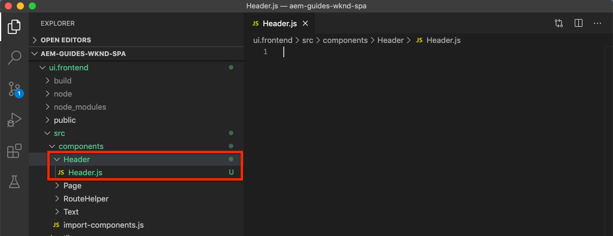

# SPA integrieren {#integrate-spa}

Verstehen Sie, wie der Quellcode für eine Einzelseitenanwendung (SPA), die in React geschrieben wurde, in ein Adobe Experience Manager (AEM) Projekt integriert werden kann. Erfahren Sie, wie Sie mit modernen Front-End-Werkzeugen wie einem Webpack-Dev-Server die SPA mit der AEM JSON-Modell-API schnell entwickeln.

## Vorgabe

1. Verstehen Sie, wie das SPA-Projekt in AEM mit clientseitigen Bibliotheken integriert ist.
2. Erfahren Sie, wie Sie einen Webpack-Entwicklungsserver für die dedizierte Front-End-Entwicklung verwenden.
3. Verwenden einer **Proxy** - und statischen **Modell** -Datei zur Entwicklung mit der AEM JSON-Modell-API

## Was Sie erstellen

In diesem Kapitel wird eine einfache `Header` Komponente zur SPA hinzugefügt. Bei der Erstellung dieser statischen `Header` Komponente werden verschiedene Ansätze zur Entwicklung AEM SPA verwendet.


*Die SPA wird erweitert, um eine statische`Header`Komponente hinzuzufügen*

## Voraussetzungen

Überprüfen Sie die erforderlichen Werkzeuge und Anleitungen zum Einrichten einer [lokalen Entwicklungs-Umgebung](overview.md#local-dev-environment).

### Code abrufen

1. Laden Sie den Ausgangspunkt für dieses Lernprogramm über Git herunter:

   ```shell
   $ git clone git@github.com:adobe/aem-guides-wknd-spa.git
   $ cd aem-guides-wknd-spa
   $ git checkout React/integrate-spa-start
   ```

2. Stellen Sie die Codebasis mithilfe von Maven auf einer lokalen AEM-Instanz bereit:

   ```shell
   $ mvn clean install -PautoInstallSinglePackage
   ```

   Bei Verwendung von [AEM 6.x](overview.md#compatibility) fügen Sie das `classic` Profil hinzu:

   ```shell
   $ mvn clean install -PautoInstallSinglePackage -Pclassic
   ```

Sie können den fertigen Code immer auf [GitHub](https://github.com/adobe/aem-guides-wknd-spa/tree/React/integrate-spa-solution) Ansicht oder den Code lokal auschecken, indem Sie zur Verzweigung wechseln `React/integrate-spa-solution`.

## Integrationsansatz {#integration-approach}

Im Rahmen des AEM Projekts wurden zwei Module erstellt: `ui.apps` und `ui.frontend`.

Das `ui.frontend` Modul ist ein [Webpack](https://webpack.js.org/) -Projekt, das den gesamten SPA-Quellcode enthält. Ein Großteil der SPA-Entwicklung und -Tests wird im Webpack-Projekt durchgeführt. Wenn ein Produktionsaufbau ausgelöst wird, wird die SPA mithilfe von Webpack erstellt und kompiliert. Die kompilierten Artefakte (CSS und JavaScript) werden in das `ui.apps` Modul kopiert, das dann zur AEM Laufzeit bereitgestellt wird.


*Eine detaillierte Darstellung der SPA-Integration.*

Weitere Informationen zum Front-End-Build finden Sie hier [](https://docs.adobe.com/content/help/en/experience-manager-core-components/using/developing/archetype/uifrontend-react.html).

## Inspect - SPA-Integration {#inspect-spa-integration}

Überprüfen Sie anschließend das `ui.frontend` Modul, um die SPA zu verstehen, die vom [AEM Projektarchiv](https://docs.adobe.com/content/help/en/experience-manager-core-components/using/developing/archetype/uifrontend-react.html)automatisch generiert wurde.

1. Öffnen Sie in der IDE Ihrer Wahl das AEM Projekt für die WKND SPA. In diesem Lernprogramm wird die [Visual Studio-Code-IDE](https://docs.adobe.com/content/help/en/experience-manager-learn/cloud-service/local-development-environment-set-up/development-tools.html#microsoft-visual-studio-code)verwendet.

   

2. Erweitern Sie den `ui.frontend` Ordner und überprüfen Sie ihn. Öffnen Sie die Datei `ui.frontend/package.json`

3. Unter dem `dependencies` Link sollten Sie mehrere Informationen zu `react` sehen, darunter `react-scripts`

   ```json
   "react": "^16.12.0",
   "react-app-polyfill": "^1.0.5",
   "react-dom": "^16.12.0",
   "react-router-dom": "^5.1.2",
   "react-scripts": "3.4.1"
   ```

   Es `ui.frontend` handelt sich um eine React-Anwendung, die kurz auf der [Create React App](https://create-react-app.dev/) oder CRA basiert. Die `react-scripts` Version gibt an, welche Version von CRA verwendet wird.

4. Es gibt auch drei Abhängigkeiten mit dem Präfix `@adobe`:

   ```json
   "@adobe/aem-react-editable-components": "^1.0.0",
   "@adobe/aem-spa-component-mapping": "^1.0.0",
   "@adobe/aem-spa-page-model-manager": "^1.0.0",
   ```

   Die oben genannten Module bilden das [AEM SPA Editor JS SDK](https://docs.adobe.com/content/help/en/experience-manager-65/developing/headless/spas/spa-blueprint.html) und bieten die Funktionalität, um SPA-Komponenten AEM Komponenten zuzuordnen.

5. In der `package.json` Datei sind mehrere `scripts` definiert:

   ```json
   "scripts": {
       "start": "react-scripts start",
       "build": "react-scripts build && clientlib",
       "test": "react-scripts test",
       "eject": "react-scripts eject",
   }
   ```

   Dies sind standardmäßige Buildskripte, die von der App &quot;Reaktion erstellen&quot; [zur Verfügung gestellt](https://create-react-app.dev/docs/available-scripts) werden.

   Der einzige Unterschied ist der Zusatz von `&& clientlib` zum `build` Skript. Diese zusätzliche Anweisung ist für das Kopieren der kompilierten SPA in das `ui.apps` Modul als clientseitige Bibliothek während eines Builds verantwortlich.

   Das Modul npm [aem-clientlib-generator](https://github.com/wcm-io-frontend/aem-clientlib-generator) wird dazu verwendet.

6. Inspect die Datei `ui.frontend/clientlib.config.js`. Diese Konfigurationsdatei wird von [aem-clientlib-generator](https://github.com/wcm-io-frontend/aem-clientlib-generator#clientlibconfigjs) verwendet, um zu bestimmen, wie die Client-Bibliothek generiert wird.

7. Inspect die Datei `ui.frontend/pom.xml`. Diese Datei wandelt den `ui.frontend` Ordner in ein [Maven-Modul](http://maven.apache.org/guides/mini/guide-multiple-modules.html)um. Die `pom.xml` Datei wurde aktualisiert, um das [frontend-maven-plugin](https://github.com/eirslett/frontend-maven-plugin) zu verwenden, um die SPA während eines Maven-Builds zu **testen** und zu **erstellen** .

8. Inspect die Datei `index.js` unter `ui.frontend/src/index.js`:

   ```js
   //ui.frontend/src/index.js
   ...
   document.addEventListener('DOMContentLoaded', () => {
       ModelManager.initialize().then(pageModel => {
           const history = createBrowserHistory();
           render(
           <Router history={history}>
               <App
               history={history}
               cqChildren={pageModel[Constants.CHILDREN_PROP]}
               cqItems={pageModel[Constants.ITEMS_PROP]}
               cqItemsOrder={pageModel[Constants.ITEMS_ORDER_PROP]}
               cqPath={pageModel[Constants.PATH_PROP]}
               locationPathname={window.location.pathname}
               />
           </Router>,
           document.getElementById('spa-root')
           );
       });
   });
   ```

   `index.js` ist der Einstiegspunkt des BSG. `ModelManager` wird vom AEM SPA Editor JS SDK bereitgestellt. Es ist dafür zuständig, den `pageModel` (JSON-Inhalt) aufzurufen und in den Antrag einzufügen.

## hinzufügen einer Kopfzeilenkomponente {#header-component}

Fügen Sie dann der SPA eine neue Komponente hinzu und stellen Sie die Änderungen in einer lokalen AEM bereit.

1. Erstellen Sie im `ui.frontend` Modul unten `ui.frontend/src/components` einen neuen Ordner mit dem Namen `Header`.
2. Create a file named `Header.js` beneath the `Header` folder.

   

3. Füllen Sie `Header.js` wie folgt:

   ```js
   //Header.js
   import React, {Component} from 'react';
   
   export default class Header extends Component {
   
       render() {
           return (
                   <header className="Header">
                       <div className="Header-container">
                           <h1>WKND</h1>
                       </div>
                   </header>
           );
       }
   }
   ```

   Oben ist eine standardmäßige React-Komponente, die eine statische Textzeichenfolge ausgibt.

4. Öffnen Sie die Datei `ui.frontend/src/App.js`. Dies ist der Einstiegspunkt der Anwendung.
5. Führen Sie die folgenden Aktualisierungen durch, `App.js` um das statische einzuschließen `Header`:

   ```diff
     import { Page, withModel } from '@adobe/aem-react-editable-components';
     import React from 'react';
   + import Header from './components/Header/Header';
   
     // This component is the application entry point
     class App extends Page {
     render() {
         return (
         <div>
   +       <Header />
            {this.childComponents}
            {this.childPages}
        </div>
   ```

6. Öffnen Sie ein neues Terminal, navigieren Sie zum `ui.frontend` Ordner und führen Sie den `npm run build` Befehl aus:

   ```shell
   $ cd aem-guides-wknd-spa
   $ cd ui.frontend
   $ npm run build
   ...
   Compiled successfully.
   
   File sizes after gzip:
   
   118.95 KB (-33 B)  build/static/js/2.489f399a.chunk.js
   1.11 KB (+48 B)    build/static/js/main.6cfa5095.chunk.js
   806 B              build/static/js/runtime-main.42b998df.js
   451 B              build/static/css/main.e57bbe8a.chunk.css
   ```

7. Navigieren Sie zum Ordner `ui.apps`. Darunter sollten `ui.apps/src/main/content/jcr_root/apps/wknd-spa-react/clientlibs/clientlib-react` Sie sehen, dass die kompilierten SPA-Dateien aus dem`ui.frontend/build` Ordner kopiert wurden.

   

8. Kehren Sie zum Terminal zurück und navigieren Sie zum `ui.apps` Ordner. Führen Sie den folgenden Maven-Befehl aus:

   ```shell
   $ cd ../ui.apps
   $ mvn clean install -PautoInstallPackage
   ...
   [INFO] ------------------------------------------------------------------------
   [INFO] BUILD SUCCESS
   [INFO] ------------------------------------------------------------------------
   [INFO] Total time:  9.629 s
   [INFO] Finished at: 2020-05-04T17:48:07-07:00
   [INFO] ------------------------------------------------------------------------
   ```

   Dadurch wird das `ui.apps` Paket für eine lokale Instanz von AEM bereitgestellt.

9. Öffnen Sie eine Browser-Registerkarte und navigieren Sie zu [http://localhost:4502/editor.html/content/wknd-spa-react/us/en/home.html](http://localhost:4502/editor.html/content/wknd-spa-react/us/en/home.html). Sie sollten nun den Inhalt der `Header` Komponente im SPA anzeigen.

   

   Die Schritte 6-8 werden automatisch ausgeführt, wenn ein Maven-Build aus dem Stammverzeichnis des Projekts (d.h. `mvn clean install -PautoInstallSinglePackage`) ausgelöst wird. Sie sollten nun die Grundlagen der Integration zwischen SPA und AEM clientseitigen Bibliotheken verstehen. Beachten Sie, dass Sie unter der statischen `Text` Komponente weiterhin `Header` Komponenten in AEM bearbeiten und hinzufügen können.

## Webpack Dev Server - Proxy der JSON-API {#proxy-json}

Wie in den vorherigen Übungen gezeigt, dauert die Ausführung eines Builds und die Synchronisierung der Client-Bibliothek mit einer lokalen Instanz von AEM einige Minuten. Dies ist für die Endprüfung annehmbar, aber nicht ideal für den Großteil der SPA-Entwicklung.

Ein [webpack-dev-server](https://webpack.js.org/configuration/dev-server/) kann verwendet werden, um die SPA schnell zu entwickeln. Die SPA wird von einem von AEM erstellten JSON-Modell gesteuert. In dieser Übung wird der JSON-Inhalt einer laufenden Instanz von AEM auf den Entwicklungsserver **proximiert** .

1. Kehren Sie zur IDE zurück und öffnen Sie die Datei `ui.frontend/package.json`.

   Suchen Sie eine Zeile wie die folgende:

   ```json
   "proxy": "http://localhost:4502",
   ```

   Die [Create React App](https://create-react-app.dev/docs/proxying-api-requests-in-development) bietet einen einfachen Mechanismus zum Proxy von API-Anforderungen. Alle unbekannten Anforderungen werden über `localhost:4502`den lokalen AEM Schnellstart weitergeleitet.

2. Öffnen Sie ein Terminalfenster und navigieren Sie zum `ui.frontend` Ordner. Run the command `npm start`:

   ```shell
   $ cd ui.frontend
   $ npm start
   ...
   Compiled successfully!
   
   You can now view wknd-spa-react in the browser.
   
   Local:            http://localhost:3000
   On Your Network:  http://192.168.86.136:3000
   
   Note that the development build is not optimized.
   To create a production build, use npm run build.
   ```

3. Öffnen Sie eine neue Browserregisterkarte (sofern noch nicht geöffnet) und navigieren Sie zu [http://localhost:3000/content/wknd-spa-react/us/en/home.html](http://localhost:3000/content/wknd-spa-react/us/en/home.html).

   

   Sie sollten dieselben Inhalte wie in AEM sehen, jedoch keine der Authoring-Funktionen aktiviert haben.

   >[!NOTE]
   >
   > Aufgrund der Sicherheitsanforderungen von AEM müssen Sie bei der lokalen AEM (http://localhost:4502) im selben Browser, jedoch in einer anderen Registerkarte angemeldet sein.

4. Kehren Sie zur IDE zurück und erstellen Sie einen neuen Ordner mit dem Namen `media` at `ui.frontend/src/media`.
5. Laden Sie das folgende WKND-Logo herunter und fügen Sie es dem `media` Ordner hinzu:

   

6. Öffnen `Header.js` `ui.frontend/src/components/Header/Header.js` und importieren Sie das Logo:

   ```diff
     import React, {Component} from 'react';
   + import wkndLogoDark from '../../media/wknd-logo-dk.png';
   ```

7. Führen Sie die folgenden Aktualisierungen durch, um das Logo als Teil der Kopfzeile einzuschließen: `Header.js`

   ```js
    export default class Header extends Component {
   
       get logo() {
           return (
               <div className="Logo">
                   
               </div>
           );
       }
   
       render() {
           return (
                   <header className="Header">
                       <div className="Header-container">
                           {this.logo}
                       </div>
                   </header>
           );
       }
   }
   ```

   Speichern Sie die Änderungen in `Header.js`.

8. Kehren Sie zum Browser unter [http://localhost:3000/content/wknd-spa-react/us/en/home.html](http://localhost:3000/content/wknd-spa-react/us/en/home.html)zurück. Die Änderungen an der App sollten sofort angezeigt werden.

   

   Sie können auch weiterhin Inhaltsaktualisierungen in AEM vornehmen und sie im **webpack-dev-server** wiedergeben, da wir den Inhalt proxizieren.

9. Beenden Sie den Webpack-Dev-Server mit `ctrl+c` im Terminal.

## Webpack Dev Server - JSON-API {#mock-json}

Ein weiterer Ansatz zur schnellen Entwicklung ist die Verwendung einer statischen JSON-Datei als JSON-Modell. Indem wir die JSON &quot;betrügen&quot;, entfernen wir die Abhängigkeit von einer lokalen AEM Instanz. Außerdem kann ein Front-End-Entwickler das JSON-Modell aktualisieren, um Funktionen zu testen und Änderungen an der JSON-API vorzunehmen, die später von einem Back-End-Entwickler implementiert werden.

Die anfängliche Einrichtung des JSON-Musters **erfordert eine lokale AEM Instanz**.

1. Navigieren Sie im Browser zu [http://localhost:4502/content/wknd-spa-react/us/en.model.json](http://localhost:4502/content/wknd-spa-react/us/en.model.json).

   Dies ist die von AEM exportierte JSON, die die Anwendung ausführt. Kopieren Sie die JSON-Ausgabe.

2. Kehren Sie zur IDE zurück, navigieren Sie zu einem neuen Ordner mit dem Namen `ui.frontend/public` und fügen Sie ihn hinzu `mock-content`.
3. Erstellen Sie eine neue Datei mit dem Namen `mock.model.json` darunter `ui.frontend/public/mock-content`. Fügen Sie hier die JSON-Ausgabe aus **Schritt 1** ein.

   

4. Open the file `index.html` at `ui.frontend/public/index.html`. Aktualisieren Sie die Metadateneigenschaft für das AEM Seitenmodell, um auf eine Variable zu verweisen `%REACT_APP_PAGE_MODEL_PATH%`:

   ```html
       <!-- AEM page model -->
       <meta
          property="cq:pagemodel_root_url"
          content="%REACT_APP_PAGE_MODEL_PATH%"
       />
   ```

   Die Verwendung einer Variablen für den Wert des `cq:pagemodel_root_url` JSON-Modells erleichtert das Umschalten zwischen dem Proxy- und dem JSON-Modell.

5. Öffnen Sie die Datei `ui.frontend/.env.development` und führen Sie die folgenden Aktualisierungen durch, um den vorherigen Wert für `REACT_APP_PAGE_MODEL_PATH`auszukommentieren:

   ```plain
   PUBLIC_URL=/
   
   #REACT_APP_PAGE_MODEL_PATH=/content/wknd-spa-react/us/en.model.json
   REACT_APP_PAGE_MODEL_PATH=/mock-content/mock.model.json
   
   REACT_APP_ROOT=/content/wknd-spa-react/us/en/home.html
   ```

6. Beenden Sie den **webpack-dev-server**, wenn er gerade ausgeführt wird. Beginn des **webpack-dev-servers** vom Terminal:

   ```shell
   $ cd ui.frontend
   $ npm start
   ```

   Navigieren Sie zu [http://localhost:3000/content/wknd-spa-react/us/en/home.html](http://localhost:3000/content/wknd-spa-react/us/en/home.html) und Sie sollten die SPA mit demselben Inhalt sehen, der in der **Proxy** -JSON verwendet wird.

7. Nehmen Sie eine kleine Änderung an der zuvor erstellten `mock.model.json` Datei vor. Sie sollten den aktualisierten Inhalt sofort im **webpack-dev-server** sehen.

   

Die Möglichkeit, das JSON-Modell zu manipulieren und die Auswirkungen auf eine Live-SPA zu sehen, kann einem Entwickler helfen, die JSON-Modell-API zu verstehen. Es ermöglicht auch die parallele Entwicklung von Front-End und Back-End.

Sie können jetzt umschalten, wo der JSON-Inhalt verwendet werden soll, indem Sie die Einträge in der `env.development` Datei umschalten:

```plain
# JSON API via proxy to AEM
#REACT_APP_PAGE_MODEL_PATH=/content/wknd-spa-react/us/en.model.json

# JSON API via static mock file
REACT_APP_PAGE_MODEL_PATH=/mock-content/mock.model.json
```

## hinzufügen von Stilen mit Sass

Eine Best Practice von React ist, jede Komponente modular und eigenständig zu halten. Eine allgemeine Empfehlung besteht darin, zu vermeiden, dass der gleiche CSS-Klassenname in allen Komponenten wiederverwendet wird, wodurch die Verwendung von Präprozessoren nicht so leistungsfähig ist. Dieses Projekt verwendet [Sass](https://sass-lang.com/) für einige nützliche Funktionen wie Variablen. Dieses Projekt wird auch lose den [SUIT CSS Benennungskonventionen](https://github.com/suitcss/suit/blob/master/doc/components.md)folgen. SUIT ist eine Variante der BEM-Notation, Block Element Modifier, die verwendet wird, um konsistente CSS-Regeln zu erstellen.

1. Öffnen Sie ein Terminalfenster und stoppen Sie den **webpack-dev-server** , wenn er gestartet wird. Geben Sie von innerhalb des `ui.frontend` Ordners den folgenden Befehl ein, um Sass zu [installieren](https://create-react-app.dev/docs/adding-a-sass-stylesheet):

   ```shell
   $ cd ui.frontend
   $ npm install node-sass --save
   ```

   Als `sass` Peer-Abhängigkeiten installieren:

   ```shell
   $ npm install sass --save
   ```

2. Installieren Sie `normalize-scss` die Installation, um die Stile über Browser hinweg zu normalisieren:

   ```shell
   $ npm install normalize-scss
   ```

3. Beginn des **webpack-dev-servers** , damit die Stile in Echtzeit aktualisiert werden:

   ```shell
   $ npm start
   ```

   Verwenden Sie zum Bearbeiten der JSON-Modell-API entweder den Proxy-of-Mock-Ansatz.

4. Kehren Sie zur IDE zurück und erstellen Sie unter `ui.frontend/src` Erstellen Sie einen neuen Ordner mit dem Namen `styles`.
5. Erstellen Sie eine neue Datei unter dem `ui.frontend/src/styles` Namen `_variables.scss` und füllen Sie sie mit den folgenden Variablen:

   ```scss
   //_variables.scss
   
   //== Colors
   //
   //## Gray and brand colors for use across theme.
   
   $black:                  #202020;
   $gray:                   #696969;
   $gray-light:             #EBEBEB;
   $gray-lighter:           #F7F7F7;
   $white:                  #FFFFFF;
   $yellow:                 #FFEA00;
   $blue:                   #0045FF;
   
   
   //== Typography
   //
   //## Font, line-height, and color for body text, headings, and more.
   
   $font-family-sans-serif:  "Helvetica Neue", Helvetica, Arial, sans-serif;
   $font-family-serif:       Georgia, "Times New Roman", Times, serif;
   $font-family-base:        $font-family-sans-serif;
   $font-size-base:          18px;
   
   $line-height-base:        1.5;
   $line-height-computed:    floor(($font-size-base * $line-height-base));
   
   // Functional Colors
   $brand-primary:             $yellow;
   $body-bg:                   $white;
   $text-color:                $black;
   $text-color-inverse:        $gray-light;
   $link-color:                $blue;
   
   //Layout
   $max-width: 1024px;
   
   // Spacing
   $gutter-padding: 12px;
   ```

6. Benennen Sie die Dateierweiterung erneut `index.css` bei `ui.frontend/src/index.css` zu **`index.scss`**. Ersetzen Sie den Inhalt durch Folgendes:

   ```scss
   /* index.scss * /
   
   /* Normalize */
   @import '~normalize-scss/sass/normalize';
   
   @import './styles/variables';
   
   body {
       background-color: $body-bg;
       font-family: $font-family-base;
       margin: 0;
       padding: 0;
       font-size: $font-size-base;
       text-align: left;
       color: $text-color;
       line-height: $line-height-base;
   }
   
   //spacing for header
   body.page {
       padding-top: 75px;
   }
   ```

7. Aktualisieren Sie `ui.frontend/src/index.js` auf die neu benannte `index.scss`:

   ```diff
    ...
   - import './index.css';
   + import './index.scss';
    ....
   ```

8. Erstellen Sie eine neue Datei mit dem Namen `Header.scss` darunter `ui.frontend/src/components/Header`. Füllen Sie die Datei mit folgendem Inhalt:

   ```scss
   @import '../../styles/variables';
   
   .Header {
       width: 100%;
       position: fixed;
       top: 0;
       left:0;
       z-index: 99;
       background-color: $brand-primary;
       box-shadow: 0px 0px 10px 0px rgba(0, 0, 0, 0.24);
   }
   
   .Header-container {
       display: flex;
       max-width: $max-width;
       margin: 0 auto;
       padding-left: $gutter-padding;
       padding-right: $gutter-padding;
   }
   
   .Logo {
       z-index: 100;
       display: flex;
       padding-top: $gutter-padding;
       padding-bottom: $gutter-padding;
   }
   
   .Logo-img {
       width: 100px;
   }
   ```

9. Einbeziehen `Header.scss` durch Aktualisierung `Header.js`:

   ```js
   import React, {Component} from 'react';
   import wkndLogoDark from '../../media/wknd-logo-dk.png';
   
   require('./Header.scss');
   ...
   ```

10. Kehren Sie zum Browser und zum **webpack-dev-server** zurück: [http://localhost:3000/content/wknd-spa-react/us/en/home.html](http://localhost:3000/content/wknd-spa-react/us/en/home.html)

   

   Sie sollten nun die aktualisierten Stile sehen, die der `Header` Komponente hinzugefügt wurden.

## Bereitstellen von SPA-Updates für AEM

Die Änderungen, die an der `Header` Seite vorgenommen wurden, sind derzeit nur über den **webpack-dev-server** sichtbar. Stellen Sie die aktualisierte SPA bereit, AEM die Änderungen anzuzeigen.

1. Navigieren Sie zum Stammverzeichnis des Projekts (`aem-guides-wknd-spa`) und stellen Sie das Projekt für AEM mithilfe von Maven bereit:

   ```shell
   $ cd ..
   $ mvn clean install -PautoInstallSinglePackage
   ```

2. Navigieren Sie zu [http://localhost:4502/editor.html/content/wknd-spa-react/us/en/home.html](http://localhost:4502/editor.html/content/wknd-spa-react/us/en/home.html). Sie sollten die aktualisierte Version `Header` mit angewendeten Logos und Stilen sehen.

   

   Nachdem sich die aktualisierte SPA in AEM befindet, kann das Authoring fortgesetzt werden.

## Fehlerbehebung beim Fehler &quot;node-sass&quot;

Bei der Entwicklung können Sie auf den folgenden Fehler stoßen:

```
Error: Missing binding aem-guides-wknd-spa/ui.frontend/node_modules/node-sass/vendor/darwin-x64-72/binding.node
Node Sass could not find a binding for your current environment: macOS 64-bit with Node.js 12.x
```

Dies kann vorkommen, wenn sich die lokale Version von **Node.js** und **npm** von der des [frontend-maven-plugins](https://github.com/eirslett/frontend-maven-plugin)unterscheidet. Durch Ausführen des Befehls `npm rebuild node-sass` kann das Problem vorübergehend behoben oder der `ui.frontend/node_modules` Ordner entfernt und neu installiert werden.

Es gibt auch einige Möglichkeiten, dies nachhaltiger anzugehen.

* Stellen Sie sicher, dass die lokale Version von npm und Node.js mit den Versionen übereinstimmt, die vom Maven- [Build verwendet werden.](https://github.com/adobe/aem-guides-wknd-spa/blob/React/latest/pom.xml#L118)
* hinzufügen Sie den folgenden Ausführungsschritt vor dem `ui.frontend/pom.xml``npm run build` Schritt an:

   ```xml
   <execution>
       <id>npm rebuild node-sass</id>
       <goals>
           <goal>npm</goal>
       </goals>
       <configuration>
           <arguments>rebuild node-sass</arguments>
       </configuration>
   </execution>
   ```

## Herzlichen Glückwunsch! {#congratulations}

Herzlichen Glückwunsch, Sie haben die SPA aktualisiert und die Integration mit AEM! Sie kennen jetzt zwei verschiedene Ansätze zum Entwickeln der SPA mit der AEM JSON-Modell-API mit einem **webpack-dev-server**.

Sie können den fertigen Code immer auf [GitHub](https://github.com/adobe/aem-guides-wknd-spa/tree/React/integrate-spa-solution) Ansicht oder den Code lokal auschecken, indem Sie zur Verzweigung wechseln `React/integrate-spa-solution`.

### Nächste Schritte {#next-steps}

[Zuordnen von SPA-Komponenten zu AEM Komponenten](map-components.md) - Erfahren Sie, wie Sie React-Komponenten mit dem AEM SPA Editor JS SDK Adobe Experience Manager (AEM) Komponenten zuordnen. Mithilfe der Komponentenzuordnung können Benutzer im AEM SPA-Editor dynamische Aktualisierungen an SPA-Komponenten vornehmen, ähnlich wie beim herkömmlichen AEM Authoring.
