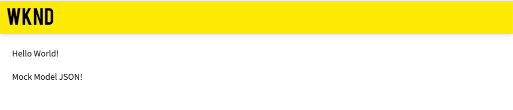
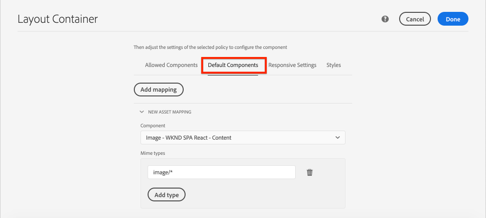

# Zuordnen SPA Komponenten zu AEM Komponenten {#map-components}

Erfahren Sie, wie Sie React-Komponenten mit dem AEM SPA Editor JS SDK Adobe Experience Manager (AEM) Komponenten zuordnen. Mithilfe der Komponentenzuordnung können Benutzer im AEM SPA Editor dynamische Aktualisierungen an SPA Komponenten vornehmen, ähnlich wie beim herkömmlichen AEM Authoring.

Dieses Kapitel enthält einen tieferen Einstieg in die AEM JSON-Modell-API und wie der von einer AEM Komponente offen gelegte JSON-Inhalt automatisch als Props in eine React-Komponente eingefügt werden kann.

## Vorgabe

1. Erfahren Sie, wie Sie AEM Komponenten SPA Komponenten zuordnen.
2. Verstehen Sie den Unterschied zwischen den Komponenten **Container** und **Content**.
3. Erstellen Sie eine neue React-Komponente, die einer vorhandenen AEM zugeordnet ist.

## Was Sie erstellen werden

In diesem Kapitel wird untersucht, wie die bereitgestellte SPA der AEM `Text`Komponente zugeordnet wird. `Text` Es wird eine neue Komponente `Image` SPA erstellt, die in der SPA verwendet und in AEM verfasst werden kann. Standardmäßig werden die Funktionen der **Layout-Container**- und **Vorlagen-Editor**-Richtlinien auch verwendet, um eine Ansicht zu erstellen, die im Erscheinungsbild etwas abwechslungsreicher ist.


## Voraussetzungen

Überprüfen Sie die erforderlichen Werkzeuge und Anweisungen zum Einrichten einer [lokalen Entwicklungs-Umgebung](overview.md#local-dev-environment).

### Code abrufen

1. Laden Sie den Ausgangspunkt für dieses Lernprogramm über Git herunter:

   ```shell
   $ git clone git@github.com:adobe/aem-guides-wknd-spa.git
   $ cd aem-guides-wknd-spa
   $ git checkout React/map-components-start
   ```

2. Stellen Sie die Codebasis mithilfe von Maven auf einer lokalen AEM-Instanz bereit:

   ```shell
   $ mvn clean install -PautoInstallSinglePackage
   ```

   Wenn Sie [AEM 6.x](overview.md#compatibility) verwenden, fügen Sie das `classic`-Profil hinzu:

   ```shell
   $ mvn clean install -PautoInstallSinglePackage -Pclassic
   ```

Sie können den fertigen Code immer auf [GitHub](https://github.com/adobe/aem-guides-wknd-spa/tree/React/map-components-solution) oder lokal prüfen, indem Sie zur Verzweigung `React/map-components-solution` wechseln.

## Zuordnungsansatz

Das Grundkonzept besteht darin, eine SPA Komponente einer AEM Komponente zuzuordnen. AEM Komponenten, serverseitig ausführen, Inhalte als Teil der JSON-Modell-API exportieren Der JSON-Inhalt wird vom SPA genutzt, wobei clientseitig im Browser ausgeführt wird. Es wird eine 1:1-Zuordnung zwischen SPA Komponenten und einer AEM Komponente erstellt.


*Überblick über die Zuordnung einer AEM Komponente zu einer React-Komponente auf hoher Ebene*

## Inspect der Textkomponente

Der [AEM Projektarchiv](https://github.com/adobe/aem-project-archetype) stellt eine `Text`-Komponente bereit, die der AEM [Textkomponente](https://docs.adobe.com/content/help/de-DE/experience-manager-core-components/using/components/text.html) zugeordnet wird. Dies ist ein Beispiel für eine Komponente **content**, in der *content* von AEM gerendert wird.

Sehen wir uns an, wie die Komponente funktioniert.

### Inspect-JSON-Modell

1. Bevor Sie in den SPA-Code springen, sollten Sie das JSON-Modell, das AEM bereitstellt, kennen. Navigieren Sie zur [Core Component Library](https://www.aemcomponents.dev/content/core-components-examples/library/page-authoring/text.html) und Ansicht der Textkomponente. Die Core Component Library enthält Beispiele für alle AEM Core-Komponenten.
2. Wählen Sie die Registerkarte **JSON** für eines der folgenden Beispiele:

   

   Es sollten drei Eigenschaften angezeigt werden: `text`, `richText` und `:type`.

   `:type` ist eine reservierte Eigenschaft, die die  `sling:resourceType` (oder den Pfad) der AEM Komponente Liste. Der Wert von `:type` wird verwendet, um die AEM Komponente der SPA zuzuordnen.

   `text` und  `richText` sind zusätzliche Eigenschaften, die der SPA Komponente ausgesetzt werden.

### Inspect der Textkomponente

1. Öffnen Sie ein neues Terminal und navigieren Sie zum Ordner `ui.frontend` innerhalb des Projekts. Führen Sie `npm install` und dann `npm start` aus, um den **webpack-dev-server** Beginn:

   ```shell
   $ cd ui.frontend
   $ npm install
   $ npm start
   ```

   Das `ui.frontend`-Modul ist derzeit so eingerichtet, dass das [JSON-Modell](./integrate-spa.md#mock-json) verwendet wird.

2. Sie sollten ein neues Browserfenster mit [http://localhost:3000/content/wknd-spa-react/us/en/home.html](http://localhost:3000/content/wknd-spa-react/us/en/home.html) öffnen.

   

3. Öffnen Sie in der IDE Ihrer Wahl das AEM Projekt für die WKND SPA. Erweitern Sie das Modul `ui.frontend` und öffnen Sie die Datei `Text.js` unter `ui.frontend/src/components/Text/Text.js`:

   

4. Der erste Bereich, den wir überprüfen werden, ist der `class Text` in ~Zeile 40:

   ```js
   class Text extends Component {
   
       get richTextContent() {
           return (<div
                   id={extractModelId(this.props.cqPath)}
                   data-rte-editelement
                   dangerouslySetInnerHTML={{__html: DOMPurify.sanitize(this.props.text)}} />
                   );
       }
   
       get textContent() {
           return <div>{this.props.text}</div>;
       }
   
       render() {
           return this.props.richText ? this.richTextContent : this.textContent;
       }
   }
   ```

   `Text` ist eine standardmäßige React-Komponente. Die Komponente verwendet `this.props.richText`, um zu bestimmen, ob der zu rendernde Inhalt Rich-Text oder Nur-Text sein soll. Der tatsächlich verwendete &quot;Inhalt&quot;stammt von `this.props.text`. Um einen potenziellen XSS-Angriff zu vermeiden, wird der Rich-Text über `DOMPurify` escaped, bevor [gefährlichSetInnerHTML](https://reactjs.org/docs/dom-elements.html#dangerouslysetinnerhtml) zum Rendern des Inhalts verwendet wird. Rufen Sie die Eigenschaften `richText` und `text` aus dem JSON-Modell früher in der Übung auf.

5. Sehen Sie sich als Nächstes die `TextEditConfig` in ~Zeile 29 an:

   ```js
   const TextEditConfig = {
   emptyLabel: 'Text',
   
       isEmpty: function(props) {
           return !props || !props.text || props.text.trim().length < 1;
       }
   };
   ```

   Der obige Code bestimmt, wann der Platzhalter in der Umgebung AEM Autors wiedergegeben wird. Wenn die `isEmpty`-Methode **true** zurückgibt, wird der Platzhalter gerendert.

6. Sehen Sie sich schließlich den `MapTo`-Aufruf unter ~Zeile 62 an:

   ```js
   export default MapTo('wknd-spa-react/components/text')(Text, TextEditConfig);
   ```

   `MapTo` wird vom AEM SPA Editor JS SDK (`@adobe/aem-react-editable-components`) bereitgestellt. Der Pfad `wknd-spa-react/components/text` stellt die `sling:resourceType` der AEM Komponente dar. Dieser Pfad wird mit dem `:type` übereinstimmen, das vom JSON-Modell, das zuvor beobachtet wurde, bereitgestellt wird. `MapTo` analysiert die JSON-Modellantwort und übergibt die richtigen Werte  `props` an die SPA Komponente.

   Die AEM `Text`-Komponentendefinition finden Sie unter `ui.apps/src/main/content/jcr_root/apps/wknd-spa-react/components/text`.

7. Experimentieren Sie, indem Sie die Datei `mock.model.json` unter `ui.frontend/public/mock-content/mock.model.json` ändern. Aktualisieren Sie in ~Zeile 62 den ersten `Text`-Wert, um die Tags **`H1`** und **`u`** zu verwenden:

   ```json
       "text": {
           "text": "<h1><u>Hello World!</u></h1>",
           "richText": true,
           ":type": "wknd-spa-react/components/text"
       }
   ```

   Navigieren Sie zu [http://localhost:3000](http://localhost:3000), um die Effekte anzuzeigen:

   

   Versuchen Sie, die `richText`-Eigenschaft zwischen **true** / **false** umzuschalten, um die Renderlogik in Aktion zu sehen.

8. Inspect `Text.scss` bei `ui.frontend/src/components/Text/Text.scss`.

   Diese Datei wurde von der Start-Code-Basis für dieses Kapitel hinzugefügt und verwendet die Funktion [Sass](https://sass-lang.com/), die im vorherigen Kapitel hinzugefügt wurde. Notieren Sie die Variablen, auf die von `ui.frontend/src/styles/_variables.scss` verwiesen wird.

## Erstellen der Bildkomponente

Erstellen Sie anschließend eine Remact-Komponente, die der AEM [Image-Komponente](https://docs.adobe.com/content/help/de-DE/experience-manager-core-components/using/components/image.html) zugeordnet ist. `Image` Die Komponente `Image` ist ein weiteres Beispiel für eine Komponente **content**.

### Inspect the JSON

Prüfen Sie vor dem Aufrufen des SPA-Codes das von AEM bereitgestellte JSON-Modell.

1. Navigieren Sie zu den [Bildbeispielen in der Core Component Library](https://www.aemcomponents.dev/content/core-components-examples/library/page-authoring/image.html).

   

   Die Komponenten `src`, `alt` und `title` werden mit den Eigenschaften `Image` SPA gefüllt.

   >[!NOTE]
   >
   > Es sind andere Bildeigenschaften verfügbar (`lazyEnabled`, `widths`), mit denen Entwickler eine adaptive und verzögertes Laden-Komponente erstellen können. Die in diesem Lernprogramm erstellte Komponente ist einfach und verwendet **nicht** diese erweiterten Eigenschaften.

2. Kehren Sie zu Ihrer IDE zurück und öffnen Sie die `mock.model.json` bei `ui.frontend/public/mock-content/mock.model.json`. Da dies eine netto-neue Komponente für unser Projekt ist, müssen wir das Bild JSON &quot;spotten&quot;.

   Fügen Sie in ~Zeile 70 einen JSON-Eintrag für das `image`-Modell hinzu (vergessen Sie nicht das nachfolgende Komma `,` nach dem zweiten `text_23828680`) und aktualisieren Sie das `:itemsOrder`-Array.

   ```json
   ...
   ":items": {
               ...
               "text_23828680": {
                   "text": "<p>Mock Model JSON!</p>",
                   "richText": true,
                   ":type": "wknd-spa-react/components/text"
               },
               "image": {
                   "alt": "Rock Climber in New Zealand",
                   "title": "Rock Climber in New Zealand",
                   "src": "/mock-content/adobestock-140634652.jpeg",
                   ":type": "wknd-spa-react/components/image"
               }
           },
           ":itemsOrder": [
               "text",
               "text_23828680",
               "image"
           ],
   ```

   Das Projekt enthält ein Beispielbild unter `/mock-content/adobestock-140634652.jpeg`, das mit dem **webpack-dev-server** verwendet wird.

   Sie können die vollständige [mock.model.json hier](https://github.com/adobe/aem-guides-wknd-spa/blob/React/map-components-solution/ui.frontend/public/mock-content/mock.model.json) Ansicht durchführen.

### Komponente &quot;Bild&quot;implementieren

1. Erstellen Sie anschließend einen neuen Ordner mit dem Namen `Image` unter `ui.frontend/src/components`.
2. Erstellen Sie unter dem Ordner `Image` eine neue Datei mit dem Namen `Image.js`.

   

3. hinzufügen Sie die folgenden `import`-Anweisungen an `Image.js`:

   ```js
   import React, {Component} from 'react';
   import {MapTo} from '@adobe/aem-react-editable-components';
   ```

4. Fügen Sie dann das `ImageEditConfig` hinzu, um zu bestimmen, wann der Platzhalter in AEM angezeigt wird:

   ```js
   export const ImageEditConfig = {
   
       emptyLabel: 'Image',
   
       isEmpty: function(props) {
           return !props || !props.src || props.src.trim().length < 1;
       }
   };
   ```

   Der Platzhalter zeigt an, ob die `src`-Eigenschaft nicht eingestellt ist.

5. Implementieren Sie anschließend die `Image`-Klasse:

   ```js
    export default class Image extends Component {
   
       get content() {
           return ;
       }
   
       render() {
           if(ImageEditConfig.isEmpty(this.props)) {
               return null;
           }
   
           return (
                   <div className="Image">
                       {this.content}
                   </div>
           );
       }
   }
   ```

   Der obige Code gibt ein `` basierend auf den Props `src`, `alt` und `title` aus, die vom JSON-Modell übergeben werden.

6. hinzufügen Sie den `MapTo`-Code, um die React-Komponente der AEM Komponente zuzuordnen:

   ```js
   MapTo('wknd-spa-react/components/image')(Image, ImageEditConfig);
   ```

   Beachten Sie die Zeichenfolge `wknd-spa-react/components/image` entspricht dem Speicherort der AEM Komponente in `ui.apps` unter: `ui.apps/src/main/content/jcr_root/apps/wknd-spa-react/components/image`.

7. Erstellen Sie eine neue Datei mit dem Namen `Image.scss` im selben Ordner und fügen Sie Folgendes hinzu:

   ```scss
   .Image-src {
       margin: 1rem 0;
       width: 100%;
       border: 0;
   }
   ```

8. Fügen Sie in `Image.js` oben unter den Anweisungen `import` einen Verweis zur Datei hinzu:

   ```js
   import React, {Component} from 'react';
   import {MapTo} from '@adobe/aem-react-editable-components';
   
   require('./Image.scss');
   ```

   Sie können die fertige [Image.js hier](https://github.com/adobe/aem-guides-wknd-spa/blob/React/map-components-solution/ui.frontend/src/components/Image/Image.js) Ansicht durchführen.

9. Öffnen Sie die Datei `ui.frontend/src/components/import-components.js` und fügen Sie der neuen Komponente `Image` einen Verweis hinzu:

   ```js
   import './Page/Page';
   import './Text/Text';
   import './Image/Image'; //add reference to Image component
   ```

10. Wenn noch nicht gestartet, Beginn **webpack-dev-server**. Navigieren Sie zu [http://localhost:3000](http://localhost:3000) und Sie sollten das Bild-Rendering sehen:

   

   >[!NOTE]
   >
   > **Bonusherausforderung**: Implementieren Sie eine neue Methode in,  `Image.js` um den Wert von  `this.props.title` als Beschriftung unter dem Bild anzuzeigen.

## Richtlinien in AEM aktualisieren

Die Komponente `Image` ist nur in **webpack-dev-server** sichtbar. Stellen Sie anschließend die aktualisierte SPA bereit, um die Vorlagenrichtlinien zu AEM und zu aktualisieren.

1. Beenden Sie den **webpack-dev-server** und stellen Sie die Änderungen an AEM mithilfe Ihrer Maven-Fähigkeiten aus dem Stammordner des Projekts bereit:

   ```shell
   $ cd aem-guides-wknd-spa
   $ mvn clean install -PautoInstallSinglePackage
   ```

2. Navigieren Sie im Bildschirm &quot;AEM Beginn&quot;zu **Tools** > **Vorlagen** > **[WKND SPA React](http://localhost:4502/libs/wcm/core/content/sites/templates.html/conf/wknd-spa-react)**.

   Wählen Sie die **SPA Seite** aus und bearbeiten Sie sie:

   

3. Wählen Sie den Container **Layout** und klicken Sie auf das Symbol **policy**, um die Richtlinie zu bearbeiten:

   

4. Aktivieren Sie unter **Zulässige Komponenten** > **WKND SPA React - Content** die Komponente **Bild**:

   

   Wählen Sie unter **Standardkomponenten** > **Hinzufügen Zuordnung** die Komponente **Bild - WKND SPA React - Content** aus:

   

   Geben Sie einen **mime-Typ** von `image/*` ein.

   Klicken Sie auf **Fertig**, um die Richtlinienaktualisierungen zu speichern.

5. Klicken Sie im **Layout-Container** auf das Symbol **policy** für die Komponente **text**:

   

   Erstellen Sie eine neue Richtlinie mit dem Namen **WKND SPA Text**. Aktivieren Sie unter **Plugins** > **Formatierung** > alle Kontrollkästchen, um weitere Formatierungsoptionen zu aktivieren:

   

   Aktivieren Sie unter **Plugins** > **Absatzstile** > das Kontrollkästchen **Absatzstile** aktivieren:

   

   Klicken Sie auf **Fertig**, um die Richtlinienaktualisierung zu speichern.

6. Navigieren Sie zur **Homepage** [http://localhost:4502/editor.html/content/wknd-spa-react/us/en/home.html](http://localhost:4502/editor.html/content/wknd-spa-react/us/en/home.html).

   Sie sollten auch die Komponente `Text` bearbeiten und im Modus **Vollbild** weitere Absatzstile hinzufügen können.

   

7. Sie sollten auch ein Bild aus der **Asset Finder** ziehen und ablegen können:

   

8. hinzufügen Sie Ihre eigenen Bilder über [AEM Assets](http://localhost:4502/assets.html/content/dam) oder installieren Sie die fertige Code-Basis für die Standard [WKND-Referenz-Website](https://github.com/adobe/aem-guides-wknd/releases/latest). Die [WKND-Referenz-Website](https://github.com/adobe/aem-guides-wknd/releases/latest) enthält viele Bilder, die auf der WKND-SPA wiederverwendet werden können. Das Paket kann mit [AEM Package Manager](http://localhost:4502/crx/packmgr/index.jsp) installiert werden.

   

## Inspect Layout Container

Der **Layout-Container** wird automatisch vom AEM SPA Editor SDK unterstützt. Der **Layout-Container** ist, wie durch den Namen angegeben, eine **Container**-Komponente. Container-Komponenten sind Komponenten, die JSON-Strukturen akzeptieren, die *andere*-Komponenten darstellen und diese dynamisch instanziieren.

Lassen Sie uns den Layout-Container näher untersuchen.

1. Navigieren Sie in einem Browser zu [http://localhost:4502/content/wknd-spa-react/us/en.model.json](http://localhost:4502/content/wknd-spa-react/us/en.model.json)

   

   Die Komponente **Layout Container** hat die Eigenschaft `sling:resourceType` von `wcm/foundation/components/responsivegrid` und wird vom SPA-Editor mit der Eigenschaft `:type` erkannt, genau wie die Komponenten `Text` und `Image`.

   Die gleichen Funktionen zum Neuskalieren einer Komponente mit [Layoutmodus](https://docs.adobe.com/content/help/en/experience-manager-65/authoring/siteandpage/responsive-layout.html#defining-layouts-layout-mode) sind im SPA Editor verfügbar.

2. Kehren Sie zu [http://localhost:4502/editor.html/content/wknd-spa-react/us/en/home.html](http://localhost:4502/editor.html/content/wknd-spa-react/us/en/home.html) zurück. hinzufügen Sie weitere **Bild**-Komponenten und versuchen Sie, sie mit der Option **Layout** neu zu skalieren:

   

3. Öffnen Sie das JSON-Modell [http://localhost:4502/content/wknd-spa-react/us/en.model.json](http://localhost:4502/content/wknd-spa-react/us/en.model.json) erneut und beobachten Sie das `columnClassNames` als Teil des JSON:

   

   Der Klassenname `aem-GridColumn--default--4` gibt an, dass die Komponente basierend auf einem 12-Spalten-Raster 4 Spalten breit sein sollte. Weitere Informationen zum interaktiven Raster finden Sie hier.[](https://adobe-marketing-cloud.github.io/aem-responsivegrid/)

4. Kehren Sie zur IDE zurück und im Modul `ui.apps` ist eine clientseitige Bibliothek definiert, die unter `ui.apps/src/main/content/jcr_root/apps/wknd-spa-react/clientlibs/clientlib-grid` definiert ist. Öffnen Sie die Datei `less/grid.less`.

   Diese Datei legt die Haltepunkte (`default`, `tablet` und `phone`) fest, die vom **Layout-Container** verwendet werden. Diese Datei soll nach Projektspezifikationen angepasst werden. Derzeit sind die Haltepunkte auf `1200px` und `650px` eingestellt.

5. Sie sollten die reaktionsfähigen Funktionen und die aktualisierten Rich-Text-Richtlinien der Komponente `Text` verwenden können, um eine Ansicht wie die folgende zu erstellen:

   

## Herzlichen Glückwunsch! {#congratulations}

Herzlichen Glückwunsch, Sie haben gelernt, wie Sie SPA Komponenten zu AEM Komponenten zuordnen und Sie haben eine neue `Image`-Komponente implementiert. Sie haben auch die Möglichkeit, die reaktionsfähigen Funktionen des **Layout-Containers** zu erkunden.

Sie können den fertigen Code immer auf [GitHub](https://github.com/adobe/aem-guides-wknd-spa/tree/React/map-components-solution) oder lokal prüfen, indem Sie zur Verzweigung `React/map-components-solution` wechseln.

### Nächste Schritte {#next-steps}

[Navigation und Routing](navigation-routing.md)  - Erfahren Sie, wie mehrere Ansichten im SPA durch Zuordnen zu AEM Seiten mit dem SPA Editor SDK unterstützt werden können. Die dynamische Navigation wird mithilfe des React Routers implementiert und einer vorhandenen Header-Komponente hinzugefügt.

## Bonus - Beständige Konfigurationen zur Quellcodeverwaltung {#bonus}

In vielen Fällen, besonders zu Beginn eines AEM Projekts, ist es nützlich, Konfigurationen wie Vorlagen und zugehörige Inhaltsrichtlinien zur Quellcodeverwaltung beizubehalten. Dadurch wird sichergestellt, dass alle Entwickler mit demselben Inhaltssatz und denselben Konfigurationen arbeiten und zusätzliche Konsistenz zwischen den Umgebung sicherstellen. Sobald ein Projekt eine gewisse Reife erreicht hat, kann die Verwaltung von Vorlagen einer speziellen Gruppe von Stromverbrauchern überlassen werden.

Die nächsten Schritte werden mit der Code-IDE von Visual Studio und [VSCode AEM Synchronisierung](https://marketplace.visualstudio.com/items?itemName=yamato-ltd.vscode-aem-sync) durchgeführt. Sie können jedoch ein beliebiges Tool und jede IDE verwenden, die Sie für **ull**- oder **import**-Inhalte aus einer lokalen Instanz von AEM konfiguriert haben.

1. Stellen Sie in der Code-IDE von Visual Studio sicher, dass **VSCode AEM Sync** über die Marketplace-Erweiterung installiert ist:

   

2. Erweitern Sie das Modul **ui.content** im Project Explorer und navigieren Sie zu `/conf/wknd-spa-react/settings/wcm/templates`.

3. **Klicken Sie mit der rechten** Maustaste auf den  `templates` Ordner und wählen Sie  **Aus AEM Server** importieren:

   

4. Wiederholen Sie die Schritte zum Importieren von Inhalten, wählen Sie jedoch den Ordner **policies** unter `/conf/wknd-spa-react/settings/wcm/templates/policies` aus.

5. Inspect Sie die Datei `filter.xml` unter `ui.content/src/main/content/META-INF/vault/filter.xml`.

   ```xml
   <!--ui.content filter.xml-->
   <?xml version="1.0" encoding="UTF-8"?>
    <workspaceFilter version="1.0">
        <filter root="/conf/wknd-spa-react" mode="merge"/>
        <filter root="/content/wknd-spa-react" mode="merge"/>
        <filter root="/content/dam/wknd-spa-react" mode="merge"/>
        <filter root="/content/experience-fragments/wknd-spa-react" mode="merge"/>
    </workspaceFilter>
   ```

   Die `filter.xml`-Datei ist dafür verantwortlich, die Pfade von Knoten zu identifizieren, die mit dem Paket installiert werden. Beachten Sie, dass `mode="merge"` auf jedem der Filter angezeigt wird, dass vorhandene Inhalte nicht geändert werden, sondern nur neue Inhalte hinzugefügt werden. Da Inhaltsersteller diese Pfade möglicherweise aktualisieren, ist es wichtig, dass bei einer Codebereitstellung **kein** Inhalt überschrieben wird. Weitere Informationen zum Arbeiten mit Filterelementen finden Sie in der [FileVault-Dokumentation](https://jackrabbit.apache.org/filevault/filter.html).

   Vergleichen Sie `ui.content/src/main/content/META-INF/vault/filter.xml` und `ui.apps/src/main/content/META-INF/vault/filter.xml`, um die verschiedenen Knoten zu verstehen, die von den einzelnen Modulen verwaltet werden.
