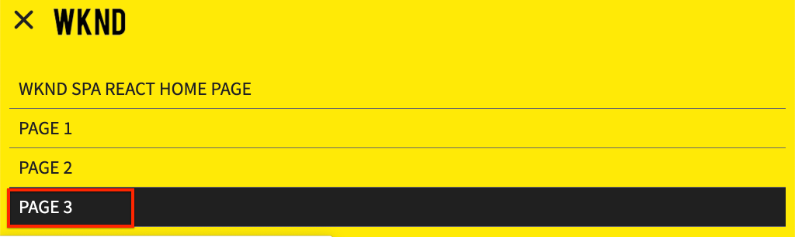

# hinzufügen Navigation und Routing {#navigation-routing}

Erfahren Sie, wie mehrere Ansichten im SPA durch Zuordnen zu AEM Seiten mit dem SPA Editor SDK unterstützt werden können. Die dynamische Navigation wird mithilfe des React Routers implementiert und einer vorhandenen Header-Komponente hinzugefügt.

## Vorgabe

1. Machen Sie sich mit den Optionen des SPA-Routings vertraut, die bei der Verwendung des SPA-Editors verfügbar sind.
2. Hier erfahren Sie, wie Sie mit dem [React Router](https://reacttraining.com/react-router/) zwischen verschiedenen Ansichten der SPA navigieren.
3. Implementieren Sie eine dynamische Navigation, die von der AEM Seitenhierarchie gesteuert wird.

## Was Sie erstellen

In diesem Kapitel wird ein Navigationsmenü zu einer vorhandenen `Header` Komponente hinzugefügt. Das Navigationsmenü wird von der AEM Seitenhierarchie gesteuert und verwendet das JSON-Modell, das von der [Navigationskernkomponente](https://docs.adobe.com/content/help/de/experience-manager-core-components/using/components/navigation.html)bereitgestellt wird.


## Voraussetzungen

Überprüfen Sie die erforderlichen Werkzeuge und Anleitungen zum Einrichten einer [lokalen Entwicklungs-Umgebung](overview.md#local-dev-environment).

### Code abrufen

1. Laden Sie den Ausgangspunkt für dieses Lernprogramm über Git herunter:

   ```shell
   $ git clone git@github.com:adobe/aem-guides-wknd-spa.git
   $ cd aem-guides-wknd-spa
   $ git checkout React/navigation-routing-start
   ```

2. Stellen Sie die Codebasis mithilfe von Maven auf einer lokalen AEM-Instanz bereit:

   ```shell
   $ mvn clean install -PautoInstallSinglePackage
   ```

   Bei Verwendung von [AEM 6.x](overview.md#compatibility) fügen Sie das `classic` Profil hinzu:

   ```shell
   $ mvn clean install -PautoInstallSinglePackage -Pclassic
   ```

3. Installieren Sie das fertige Paket für die herkömmliche [WKND-Referenz-Website](https://github.com/adobe/aem-guides-wknd/releases/latest). Die von der [WKND-Referenzseite](https://github.com/adobe/aem-guides-wknd/releases/latest) bereitgestellten Bilder werden im WKND SPA wiederverwendet. Das Paket kann mit [AEM Package Manager](http://localhost:4502/crx/packmgr/index.jsp)installiert werden.

   

Sie können den fertigen Code immer auf [GitHub](https://github.com/adobe/aem-guides-wknd-spa/tree/React/navigation-routing-solution) Ansicht oder den Code lokal auschecken, indem Sie zur Verzweigung wechseln `React/navigation-routing-solution`.

## Inspect Header-Updates {#inspect-header}

In vorherigen Kapiteln wurde die `Header` Komponente als reine React-Komponente hinzugefügt, die über `App.js`aufgenommen wurde. In diesem Kapitel wurde die `Header` Komponente entfernt und wird über den [Vorlageneditor](https://docs.adobe.com/content/help/en/experience-manager-learn/sites/page-authoring/template-editor-feature-video-use.html)hinzugefügt. Auf diese Weise können Benutzer das Navigationsmenü des `Header` Formulars in AEM konfigurieren.

>[!NOTE]
>
> Zur Beginn dieses Kapitels wurden bereits mehrere CSS- und JavaScript-Aktualisierungen an der Codebasis vorgenommen. Um sich auf Kernkonzepte zu konzentrieren, werden nicht **alle** Codeänderungen besprochen. Die vollständigen Änderungen können [hier](https://github.com/adobe/aem-guides-wknd-spa/compare/React/map-components-solution...React/navigation-routing-start)Ansicht werden.

1. Öffnen Sie in der IDE Ihrer Wahl das SPA-Startprojekt für dieses Kapitel.
2. Unterhalb des `ui.frontend` Moduls überprüfen Sie die Datei `Header.js` unter: `ui.frontend/src/components/Header/Header.js`.

   Es wurden verschiedene Aktualisierungen vorgenommen, darunter das Hinzufügen eines `HeaderEditConfig` und eines , `MapTo` um die Zuordnung der Komponente zu einer AEM zu ermöglichen `wknd-spa-react/components/header`.

   ```js
   /* Header.js */
   ...
   export const HeaderEditConfig = {
       ...
   }
   ...
   MapTo('wknd-spa-react/components/header')(withRouter(Header), HeaderEditConfig);
   ```

3. Überprüfen Sie im `ui.apps` Modul die Komponentendefinition der AEM `Header` Komponente: `ui.apps/src/main/content/jcr_root/apps/wknd-spa-react/components/header/.content.xml`:

   ```xml
   <?xml version="1.0" encoding="UTF-8"?>
   <jcr:root xmlns:sling="http://sling.apache.org/jcr/sling/1.0" xmlns:cq="http://www.day.com/jcr/cq/1.0"
       xmlns:jcr="http://www.jcp.org/jcr/1.0"
       jcr:primaryType="cq:Component"
       jcr:title="Header"
       sling:resourceSuperType="wknd-spa-react/components/navigation"
       componentGroup="WKND SPA React - Structure"/>
   ```

   Die AEM `Header` -Komponente erbt alle Funktionen der [Navigationskernkomponente](https://docs.adobe.com/content/help/de/experience-manager-core-components/using/components/navigation.html) über die `sling:resourceSuperType` Eigenschaft.

## hinzufügen der Kopfzeile zur Vorlage {#add-header-template}

1. Öffnen Sie einen Browser und melden Sie sich bei AEM an, [http://localhost:4502/](http://localhost:4502/). Die Basis für den Startcode sollte bereits bereitgestellt werden.
2. Navigieren Sie zur **SPA-Seitenvorlage**: [http://localhost:4502/editor.html/conf/wknd-spa-react/settings/wcm/templates/spa-page-template/structure.html](http://localhost:4502/editor.html/conf/wknd-spa-react/settings/wcm/templates/spa-page-template/structure.html).
3. Wählen Sie den Container **&quot;** Stammlayout&quot;am äußeren Rand aus und klicken Sie auf das Symbol &quot; **Richtlinie** &quot;. Achten Sie darauf, **nicht** den nicht gesperrten **Layout-Container** für das Authoring auszuwählen.

   

4. Erstellen Sie eine neue Richtlinie mit dem Namen **SPA-Struktur**:

   

   Wählen Sie unter &quot; **Zulässige Komponenten** &quot;> &quot; **Allgemein** &quot;> &quot; **Layout-Container** &quot;aus.

   Wählen Sie unter **Zulässige Komponenten** > **WKND-SPA-REACT - STRUKTUR** > die Komponente **Kopfzeile** aus:

   

   Wählen Sie unter **Zulässige Komponenten** > **WKND-SPA-REACT - Inhalt** > die Komponenten **Bild** und **Text** aus. Sie sollten vier Komponenten auswählen.

   Click **Done** to save the changes.

5. Aktualisieren Sie die Seite und fügen Sie die **Kopfzeilenkomponente** über dem nicht gesperrten **Layout-Container** hinzu:

   

6. Wählen Sie die Komponente &quot; **Kopfzeile** &quot;aus und klicken Sie auf das Symbol &quot; **Richtlinie** &quot;, um die Richtlinie zu bearbeiten.
7. Erstellen Sie eine neue Richtlinie mit einem **Richtlinientitel** des **WKND-SPA-Headers**.

   Unter **Eigenschaften**:

   * Legen Sie den **Navigationsstamm** auf `/content/wknd-spa-react/us/en`.
   * Legen Sie die **Ausschließen-Stammebene** auf **1** fest.
   * Uncheck **Collect all child pages**.
   * Legen Sie die **Navigationsstrukturtiefe** auf **3** fest.

   

   Dadurch werden die 2 Ebenen der Navigation tief unter `/content/wknd-spa-react/us/en`.

8. Nach dem Speichern der Änderungen sollten Sie das ausgefüllte `Header` als Teil der Vorlage sehen:

   

## Untergeordnete Seiten erstellen

Anschließend erstellen Sie zusätzliche Seiten in AEM, die als verschiedene Ansichten im SPA dienen. Wir werden auch die hierarchische Struktur des von AEM bereitgestellten JSON-Modells überprüfen.

1. Navigieren Sie zur **Sites** -Konsole: [http://localhost:4502/sites.html/content/wknd-spa-react/us/en/home](http://localhost:4502/sites.html/content/wknd-spa-react/us/en/home). Wählen Sie die **WKND-Startseite** &quot;SPA-Reaktion&quot;aus und klicken Sie auf **Erstellen** > **Seite**:

   

2. Wählen Sie unter **Vorlage** die Option **SPA-Seite**. Geben Sie unter **Eigenschaften** **Seite 1** als **Titel** und **Seite 1** als Name ein.

   

   Klicken Sie auf **Erstellen** und dann im Popup-Dialogfeld auf **Öffnen** , um die Seite im AEM SPA-Editor zu öffnen.

3. hinzufügen eine neue **Textkomponente** in den Haupt- **Layout-Container**. Bearbeiten Sie die Komponente und geben Sie den Text ein: **Seite 1** mit dem RTE- und dem **H1** -Element (Sie müssen zum Ändern der Absatzelemente in den Vollbildmodus wechseln)

   

   Fügen Sie zusätzliche Inhalte hinzu, z. B. ein Bild.

4. Kehren Sie zur AEM Sites-Konsole zurück und wiederholen Sie die oben genannten Schritte, und erstellen Sie eine zweite Seite mit dem Namen **Seite 2** als Geschwisterseite von **Seite 1**.
5. Schließlich erstellen Sie eine dritte Seite, **Seite 3** , aber als **untergeordnetes** Element von **Seite 2**. Nach Abschluss des Vorgangs sollte die Site-Hierarchie wie folgt aussehen:

   

6. Öffnen Sie auf einer neuen Registerkarte die JSON-Modell-API, die von AEM bereitgestellt wird: [http://localhost:4502/content/wknd-spa-react/us/en.model.json](http://localhost:4502/content/wknd-spa-react/us/en.model.json). Dieser JSON-Inhalt wird angefordert, wenn die SPA zum ersten Mal geladen wird. Die äußere Struktur sieht wie folgt aus:

   ```json
   {
   "language": "en",
   "title": "en",
   "templateName": "spa-app-template",
   "designPath": "/libs/settings/wcm/designs/default",
   "cssClassNames": "spa page basicpage",
   ":type": "wknd-spa-react/components/spa",
   ":items": {},
   ":itemsOrder": [],
   ":hierarchyType": "page",
   ":path": "/content/wknd-spa-react/us/en",
   ":children": {
       "/content/wknd-spa-react/us/en/home": {},
       "/content/wknd-spa-react/us/en/home/page-1": {},
       "/content/wknd-spa-react/us/en/home/page-2": {},
       "/content/wknd-spa-react/us/en/home/page-2/page-3": {}
       }
   }
   ```

   Unter sollte `:children` für jede erstellte Seite ein Eintrag angezeigt werden. Der Inhalt für alle Seiten ist in dieser ersten JSON-Anforderung enthalten. Nach der Implementierung des Navigationssystems werden nachfolgende Ansichten des SPA schnell geladen, da der Routing bereits clientseitig verfügbar ist.

   Es ist nicht sinnvoll, **ALLE** Inhalte einer SPA in der anfänglichen JSON-Anforderung zu laden, da dies das Laden der ersten Seite verlangsamen würde. Als Nächstes sehen wir uns an, wie die Hierarchietiefe der Seiten erfasst wird.

7. Navigieren Sie zur **SPA-Stammvorlage** unter: [http://localhost:4502/editor.html/conf/wknd-spa-react/settings/wcm/templates/spa-app-template/structure.html](http://localhost:4502/editor.html/conf/wknd-spa-react/settings/wcm/templates/spa-app-template/structure.html).

   Klicken Sie auf das **Seiteneigenschaften-Menü** > **Seitenrichtlinie**:

   

8. Die **SPA-Stammvorlage** verfügt über eine zusätzliche Registerkarte &quot; **Hierarchische Struktur** &quot;, um den erfassten JSON-Inhalt zu steuern. Die **Strukturtiefe** bestimmt, wie tief in der Site-Hierarchie untergeordnete Seiten unterhalb des **Stammordners** erfasst werden. Sie können auch das Feld &quot; **Strukturmuster** &quot;verwenden, um weitere Seiten basierend auf einem regulären Ausdruck auszufiltern.

   Aktualisieren Sie die **Strukturtiefe** auf **2**:

   

   Klicken Sie auf **Fertig** , um die Änderungen an der Richtlinie zu speichern.

9. Öffnen Sie das JSON-Modell erneut [http://localhost:4502/content/wknd-spa-react/us/en.model.json](http://localhost:4502/content/wknd-spa-react/us/en.model.json).

   ```json
   {
   "language": "en",
   "title": "en",
   "templateName": "spa-app-template",
   "designPath": "/libs/settings/wcm/designs/default",
   "cssClassNames": "spa page basicpage",
   ":type": "wknd-spa-react/components/spa",
   ":items": {},
   ":itemsOrder": [],
   ":hierarchyType": "page",
   ":path": "/content/wknd-spa-react/us/en",
   ":children": {
       "/content/wknd-spa-react/us/en/home": {},
       "/content/wknd-spa-react/us/en/home/page-1": {},
       "/content/wknd-spa-react/us/en/home/page-2": {}
       }
   }
   ```

   Beachten Sie, dass der Pfad **Seite 3** entfernt wurde: `/content/wknd-spa-react/us/en/home/page-2/page-3` aus dem anfänglichen JSON-Modell.

   Später werden wir beobachten, wie das AEM SPA Editor SDK zusätzliche Inhalte dynamisch laden kann.

## Implementierung der Navigation

Implementieren Sie anschließend das Navigationsmenü als Teil des `Header`. Wir könnten den Code direkt in hinzufügen, `Header.js` aber eine bessere Praxis mit ist, große Komponenten zu vermeiden. Stattdessen werden wir eine `Navigation` SPA-Komponente implementieren, die möglicherweise später wiederverwendet werden könnte.

1. Überprüfen Sie das JSON, das von der AEM `Header` -Komponente bereitgestellt wird, unter [http://localhost:4502/content/wknd-spa-react/us/en.model.json](http://localhost:4502/content/wknd-spa-react/us/en.model.json):

   ```json
   ...
   "header": {
       "items": [
       {
       "level": 0,
       "active": true,
       "path": "/content/wknd-spa-react/us/en/home",
       "description": null,
       "url": "/content/wknd-spa-react/us/en/home.html",
       "lastModified": 1589062597083,
       "title": "WKND SPA React Home Page",
       "children": [
               {
               "children": [],
               "level": 1,
               "active": false,
               "path": "/content/wknd-spa-react/us/en/home/page-1",
               "description": null,
               "url": "/content/wknd-spa-react/us/en/home/page-1.html",
               "lastModified": 1589429385100,
               "title": "Page 1"
               },
               {
               "level": 1,
               "active": true,
               "path": "/content/wknd-spa-react/us/en/home/page-2",
               "description": null,
               "url": "/content/wknd-spa-react/us/en/home/page-2.html",
               "lastModified": 1589429603507,
               "title": "Page 2",
               "children": [
                   {
                   "children": [],
                   "level": 2,
                   "active": false,
                   "path": "/content/wknd-spa-react/us/en/home/page-2/page-3",
                   "description": null,
                   "url": "/content/wknd-spa-react/us/en/home/page-2/page-3.html",
                   "lastModified": 1589430413831,
                   "title": "Page 3"
                   }
               ],
               }
           ]
           }
       ],
   ":type": "wknd-spa-react/components/header"
   ```

   Die hierarchische Natur der AEM Seiten wird im JSON modelliert, das zum Ausfüllen eines Navigationsmenüs verwendet werden kann. Denken Sie daran, dass die `Header` Komponente alle Funktionen der [Navigationskernkomponente](https://docs.adobe.com/content/help/de/experience-manager-core-components/using/components/navigation.html) übernimmt und dass der über JSON offen gelegte Inhalt automatisch React Props zugeordnet wird.

2. Öffnen Sie ein neues Terminalfenster und navigieren Sie zum `ui.frontend` Ordner des SPA-Projekts. Beginn den **webpack-dev-server** mit dem Befehl `npm start`.

   ```shell
   $ cd ui.frontend
   $ npm start
   ```

3. Öffnen Sie die neue Registerkarte &quot;Browser&quot;und navigieren Sie zu [http://localhost:3000/](http://localhost:3000/).

   Der **webpack-dev-server** sollte so konfiguriert werden, dass das JSON-Modell von einer lokalen Instanz von AEM (`ui.frontend/.env.development`) aus proxyliert wird. Auf diese Weise können wir direkt mit den Inhalten vergleichen, die in AEM vorherigen Übung erstellt wurden. Vergewissern Sie sich, dass Sie in derselben Browsersitzung in AEM authentifiziert sind.

   

   Die `Header` derzeit implementierte Menüumschaltfunktion ist bereits implementiert. Implementieren Sie anschließend das Navigationsmenü.

4. Kehren Sie zur IDE Ihrer Wahl zurück und öffnen Sie die `Header.js` unter `ui.frontend/src/components/Header/Header.js`.
5. Aktualisieren Sie die `homeLink()` Methode, um den hartcodierten String zu entfernen und die von der AEM-Komponente übergebenen dynamischen Eigenschaften zu verwenden:

   ```js
   /* Header.js */
   ...
   get homeLink() {
        //expect a single root defined as part of the navigation
       if(!this.props.items || this.props.items.length !== 1) {
           return null;
       }
   
       return this.props.items[0].url;
   }
   ...
   ```

   Der obige Code füllt eine URL basierend auf dem von der Komponente konfigurierten Stammnavigationselement. `homeLink()` wird verwendet, um das Logo in der `logo()` Methode zu füllen und zu bestimmen, ob die Zurück-Taste angezeigt werden soll `backButton()`.

   Speichern Sie die Änderungen in `Header.js`.

6. hinzufügen eine Zeile oben, `Header.js` `Navigation` um die Komponente unterhalb der anderen Importe zu importieren:

   ```js
   /* Header.js */
   ...
   import Navigation from '../Navigation/Navigation';
   ```

7. Aktualisieren Sie anschließend die `get navigation()` Methode, um die `Navigation` Komponente zu instanziieren:

   ```js
   /* Header.js */
   ...
   get navigation() {
       //pass all the props to Navigation component
       return <Navigation {...this.props} />;
   }
   ...
   ```

   Wie bereits erwähnt, werden `Header` wir anstelle der Implementierung der Navigation innerhalb der Komponente den Großteil der Logik in der `Navigation` Komponente implementieren.  Die Eigenschaftsvariablen der `Header` beinhalten die JSON-Struktur, die zum Erstellen des Menüs erforderlich ist. Wir übergeben alle Props.
8. Open the file `Navigation.js` at `ui.frontend/src/components/Navigation/Navigation.js`.
9. Implementieren Sie die `renderGroupNav(children)` Methode:

   ```js
   /* Navigation.js */
   ...
   renderGroupNav(children) {
   
       if(children === null || children.length < 1 ) {
           return null;
       }
       return (<ul className={this.baseCss + '__group'}>
                   {children.map(
                       (item,index) => { return this.renderNavItem(item,index)}
                   )}
               </ul>
       );
   }
   ...
   ```

   Diese Methode nimmt ein Array von Navigationselementen `children`und erstellt eine ungeordnete Liste. Anschließend wird das Array durchlaufen und das Element an die `renderNavItem`übergeben, die dann implementiert wird.

10. Implementieren Sie die `renderNavItem`:

   ```js
   /* Navigation.js */
   ...
   renderNavItem(item, index) {
       const cssClass = this.baseCss + '__item ' + 
                        this.baseCss + '__item--level-' + item.level + ' ' +
                        (item.active ? ' ' + this.baseCss + '__item--active' : '');
       return (
           <li key={this.baseCss + '__item-' + index} className={cssClass}>
                   { this.renderLink(item) }
                   { this.renderGroupNav(item.children) }
           </li>
       );
   }
   ...
   ```

   Diese Methode rendert ein Element der Liste, wobei CSS-Klassen auf Eigenschaften `level` und `active`basieren. Die Methode ruft dann `renderLink` zum Erstellen des Verankerungs-Tags auf. Da der `Navigation` Inhalt hierarchisch ist, wird eine rekursive Strategie verwendet, um die `renderGroupNav` für die untergeordneten Elemente des aktuellen Elements aufzurufen.

11. Implementieren Sie die `renderLink` Methode:

   hinzufügen eine Importmethode für die Komponente [Link](https://reacttraining.com/react-router/web/api/Link) , Teil des React-Routers, oben in der Datei mit den anderen Importen:

   ```js
   import {Link} from "react-router-dom";
   ```

   Die Implementierung der `renderLink` Methode als Nächstes beenden:

   ```js
   renderLink(item){
       return (
           <Link to={item.url} title={item.title} aria-current={item.active && 'page'}
              className={this.baseCss + '__item-link'}>{item.title}</Link>
       );
   }
   ```

   Beachten Sie, dass anstelle eines normalen Anker-Tags `<a>`die Komponente &quot; [Link](https://reacttraining.com/react-router/web/api/Link) &quot;verwendet wird. Dadurch wird sichergestellt, dass keine vollständige Seitenaktualisierung ausgelöst wird und stattdessen der React-Router vom AEM SPA Editor JS SDK genutzt wird.

12. Speichern Sie die Änderungen `Navigation.js` und kehren Sie zum **webpack-dev-server** zurück: [http://localhost:3000](http://localhost:3000)

   

   Öffnen Sie die Navigation, indem Sie auf den Menüschalter klicken, und Sie sollten die ausgefüllten Navigationslinks sehen. Sie sollten zu verschiedenen Ansichten der Einzelseitenanwendung navigieren können.

## Inspect - SPA-Routing

Nachdem die Navigation implementiert wurde, überprüfen Sie das Routing in AEM.

1. Öffnen Sie in der IDE die Datei `index.js` unter `ui.frontend/src/index.js`.

   ```js
   /* index.js */
   import { Router } from 'react-router-dom';
   ...
   ...
    ModelManager.initialize().then(pageModel => {
       const history = createBrowserHistory();
       render(
       <Router history={history}>
           <App
           history={history}
           cqChildren={pageModel[Constants.CHILDREN_PROP]}
           cqItems={pageModel[Constants.ITEMS_PROP]}
           cqItemsOrder={pageModel[Constants.ITEMS_ORDER_PROP]}
           cqPath={pageModel[Constants.PATH_PROP]}
           locationPathname={window.location.pathname}
           />
       </Router>,
       document.getElementById('spa-root')
       );
   });
   ```

   Beachten Sie, dass die `App` Komponente in der `Router` Komponente vom [React Router](https://reacttraining.com/react-router/)aufgenommen wird. Mit dem `ModelManager`vom JS-SDK für den AEM SPA Editor bereitgestellten SDK werden die dynamischen Routen zu AEM Seiten hinzugefügt, die auf der JSON-Modell-API basieren.

2. Öffnen Sie ein Terminal, navigieren Sie zum Projektstamm und stellen Sie das Projekt bereit, AEM Sie Ihre Maven-Fähigkeiten verwenden:

   ```shell
   $ cd aem-guides-wknd-spa
   $ mvn clean install -PautoInstallSinglePackage
   ```

3. Navigieren Sie zur SPA-Homepage in AEM: [http://localhost:4502/content/wknd-spa-react/us/en/home.html](http://localhost:4502/content/wknd-spa-react/us/en/home.html) und öffnen Sie die Entwicklerwerkzeuge Ihres Browsers. Screenshots unten werden aus dem Google Chrome-Browser erfasst.

   Aktualisieren Sie die Seite und Sie sollten eine XHR-Anforderung an sehen, `/content/wknd-spa-react/us/en.model.json`die der SPA-Stammordner ist. Beachten Sie, dass nur drei untergeordnete Seiten enthalten sind, basierend auf der Konfiguration der Hierarchietiefe für die SPA-Stammvorlage, die zuvor im Lernprogramm vorgenommen wurde. Dies schließt **Seite 3** nicht ein.

   

4. Wenn die Entwicklerwerkzeuge geöffnet sind, verwenden Sie die `Header` Navigation, um zu **Seite 3** zu navigieren:

   

   Beachten Sie, dass eine neue XHR-Anforderung an Folgendes gerichtet wird: `/content/wknd-spa-react/us/en/home/page-2/page-3.model.json`

   

   Der AEM Model Manager erkennt, dass der JSON-Inhalt von **Seite 3** nicht verfügbar ist und löst automatisch die zusätzliche XHR-Anforderung aus.

5. Fahren Sie weiter mit den verschiedenen Navigationslinks der `Header` Komponente in der SPA. Beachten Sie, dass keine weiteren XHR-Anforderungen gestellt werden und keine vollständige Aktualisierung der Seite erfolgt. Dadurch wird die SPA für den Endbenutzer schnell und die Anzahl unnötiger Anfragen auf AEM reduziert.

   

6. Experimentieren Sie mit Deep Links, indem Sie direkt zu Folgendem navigieren: [http://localhost:4502/content/wknd-spa-react/us/en/home/page-2.html](http://localhost:4502/content/wknd-spa-react/us/en/home/page-2.html). Beachten Sie, dass die Zurück-Taste des Browsers weiterhin funktioniert.

## Herzlichen Glückwunsch! {#congratulations}

Herzlichen Glückwunsch, Sie haben gelernt, wie mehrere Ansichten im SPA durch Zuordnen zu AEM Seiten mit dem SPA Editor SDK unterstützt werden können. Die dynamische Navigation wurde mit dem React Router implementiert und der `Header` Komponente hinzugefügt.

Sie können den fertigen Code immer auf [GitHub](https://github.com/adobe/aem-guides-wknd-spa/tree/React/navigation-routing-solution) Ansicht oder den Code lokal auschecken, indem Sie zur Verzweigung wechseln `React/navigation-routing-solution`.
